[Back to Main](index.md)

    
        Portrait
    
    
        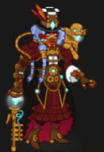Model
    

# Aeon

Aeon, a Goliath of exceptional intellect and charm, masterfully intertwines her skills as an Artillerist Artificer and Bard of the College of Whispers. Operating under the guise of a master tinkerer, she is, in truth, a cunning spy and manipulative puppet master. Aeon owns the renowned Greenhow, a unique tavern where patrons are served by her intricate automata, while she sells mechanical devices and curios embedded with Sending Stones and other surveillance tools; her 'gifts' have managed to make their way into some of the most powerful homes in the North Ward of Waterdeep. Her strategy is brilliantly deceptive; she portrays herself as a flamboyant performer and entertainer, so vivid and engaging that none suspect her of orchestrating a grand network of espionage, controlling events from the shadows.

# Basic Information

Aeon will be a new champion in the Founders' Day event on 3 July 2024.

    
        
            **Seat**:
        
        
            10
        
        
            **Stat**
        
        
            **Value**
        
        
            **Day 1 Trials**
        
        
            **Patrons**
        
    
    
        
            **Race**:
        
        
            Goliath
        
        
            **Strength**:
        
        
            10
        
        
            Yes
        
        
            Mirt
        
    
    
        
            **Class**:
        
        
            Bard / Artificer
        
        
            **Dexterity**:
        
        
            10
        
        
            -
        
        
            Sometimes
        
    
    
        
            **Roles**:
        
        
            Support / Debuff
        
        
            **Constitution**:
        
        
            12
        
        
            Yes
        
        
            Strahd
        
    
    
        
            **Age**:
        
        
            32
        
        
            **Intelligence**:
        
        
            20
        
        
            Yes
        
        
            Zariel
        
    
    
        
            **Gender**:
        
        
            Female
        
        
            **Wisdom**:
        
        
            14
        
        
            Yes
        
        
            Elminster
        
    
    
        
            **Alignment**:
        
        
            Lawful Evil
        
        
            **Charisma**:
        
        
            18
        
        
            Yes
        
        
            &nbsp;
        
    
    
        
            **Affiliation**:
        
        
            -
        
        
            **Total**:
        
        
            84
        
        
            Champion ID:
        
        
            150
        
    

# Formation

    <svg xmlns="http://www.w3.org/2000/svg" id="Aeon" fill="#aaa" data-formationName="Aeon" data-campaignName="Founders' Day" width="312" height="160"><circle cx="175" cy="65" r="15"/><circle cx="135" cy="85" r="15"/><circle cx="135" cy="125" r="15"/><circle cx="95" cy="25" r="15"/><circle cx="95" cy="65" r="15"/><circle cx="95" cy="105" r="15"/><circle cx="95" cy="145" r="15"/><circle cx="55" cy="85" r="15"/><circle cx="55" cy="125" r="15"/><circle cx="15" cy="65" r="15"/><text x="205" y="25" fill="#dcdcdc" font-size="25" font-family="Arial" font-weight="bold">Aeon</text><text x="205" y="65" fill="#dcdcdc" font-size="15" font-family="Arial" font-weight="bold">Founders' Day</text></svg>

# Abilities

 **Base Attack: Cane Wand** (Ranged)
> Aeon fires an energy bolt from her cane at the closest enemy for one hit.  
> Cooldown: 6s (Cap 1.5s)

<em>Raw Data</em>

<pre>
{
    "id": 769,
    "name": "Cane Wand",
    "description": "Aeon fires an energy bolt from her cane at the closest enemy for one hit.",
    "long_description": "",
    "graphic_id": 0,
    "target": "front",
    "num_targets": 1,
    "aoe_radius": 0,
    "damage_modifier": 1,
    "cooldown": 6,
    "animations": [
        {
            "type": "ranged_attack",
            "projectile": "pd_generic_projectile",
            "shoot_offset_x": 42,
            "shoot_offset_y": -40,
            "shoot_frame": 8,
            "shoot_sound": 149,
            "hit_sound": 133,
            "projectile_details": {
                "hash": "cane_wand",
                "target_offset_y": -20,
                "projectile_speed": 2000,
                "projectile_graphic_id": 23696,
                "projectile_hit_graphic_id": 23697,
                "trail": {
                    "particle_graphic_ids": [
                        "23696"
                    ],
                    "lifespan": 0.2,
                    "spawn_rate": 200,
                    "spawn_shape_scale": {
                        "x": 0,
                        "y": 0
                    },
                    "initial_velocity": {
                        "x": 0,
                        "y": 0
                    },
                    "velocity_jitter": {
                        "x": 30,
                        "y": 30
                    },
                    "rotation_jitter": 0,
                    "alpha_lerp": {
                        "0": 0,
                        "0.1": 0.75,
                        "1": 0
                    },
                    "scale_lerp": [
                        {
                            "x": 1,
                            "y": 1
                        },
                        {
                            "x": 0,
                            "y": 0
                        }
                    ]
                }
            }
        }
    ],
    "tags": [
        "ranged"
    ],
    "damage_types": [
        "ranged"
    ]
}
</pre>

 **Base Attack: Cane Wand** (Ranged)
> Aeon fires an energy bolt from her cane at the closest enemy that hits all enemies in a line.  
> Cooldown: 6s (Cap 1.5s)

<em>Raw Data</em>

<pre>
{
    "id": 771,
    "name": "Cane Wand",
    "description": "Aeon fires an energy bolt from her cane at the closest enemy that hits all enemies in a line.",
    "long_description": "",
    "graphic_id": 0,
    "target": "front",
    "num_targets": 1,
    "aoe_radius": 0,
    "damage_modifier": 1,
    "cooldown": 6,
    "animations": [
        {
            "type": "ranged_attack",
            "projectile": "pd_generic_projectile",
            "shoot_offset_x": -50,
            "shoot_offset_y": -40,
            "shoot_frame": 8,
            "shoot_sound": 149,
            "hit_sound": 133,
            "projectile_details": {
                "hash": "cane_wand_buffed",
                "target_offset_y": -30,
                "projectile_speed": 2000,
                "move_across_entire_screen": true,
                "hit_monsters_moved_through": true,
                "line_thickness": 160,
                "projectile_graphic_id": 23696,
                "projectile_hit_graphic_id": 23697,
                "trail": {
                    "particle_graphic_ids": [
                        "23696"
                    ],
                    "lifespan": 0.2,
                    "spawn_rate": 200,
                    "spawn_shape_scale": {
                        "x": 0,
                        "y": 0
                    },
                    "initial_velocity": {
                        "x": 0,
                        "y": 0
                    },
                    "velocity_jitter": {
                        "x": 30,
                        "y": 30
                    },
                    "rotation_jitter": 0,
                    "alpha_lerp": {
                        "0": 0,
                        "0.1": 0.75,
                        "1": 0
                    },
                    "scale_lerp": [
                        {
                            "x": 1,
                            "y": 1
                        },
                        {
                            "x": 0,
                            "y": 0
                        }
                    ]
                }
            }
        }
    ],
    "tags": [
        "ranged"
    ],
    "damage_types": [
        "ranged"
    ]
}
</pre>

 **Ultimate Attack: Deuce** (Level: 0)
> Aeon's mechanical monkey Deuce deals one ultimate hit to each enemy and knocks them back a short distance.  
> Cooldown: 360s (Cap 90s)

<em>Raw Data</em>

<pre>
{
    "id": 770,
    "name": "Deuce",
    "description": "Deuce deals one ultimate hit to each enemy and knocks them back.",
    "long_description": "Aeon's mechanical monkey Deuce deals one ultimate hit to each enemy and knocks them back a short distance.",
    "graphic_id": 23841,
    "target": "front",
    "num_targets": 1,
    "aoe_radius": 0,
    "damage_modifier": 0.03,
    "cooldown": 360,
    "animations": [
        {
            "type": "ultimate_attack",
            "ultimate": "aeon",
            "knockback_effect": {
                "effect_string": "push_back_monster,25"
            },
            "beam_data": {
                "fire_duration": 0.1,
                "sweep_duration": 0.5,
                "angle": 60,
                "screen_edge_offset": 200,
                "beam_graphic": "Effect_AeonCaneBlast",
                "impact_graphic": "Effect_AeonUltBeam_Hit",
                "segment_width": 15,
                "distance_adjustment": -20,
                "scale": 1,
                "fire_offset": [
                    45,
                    -140
                ]
            }
        }
    ],
    "tags": [
        "ranged",
        "ultimate"
    ],
    "damage_types": [
        "ranged"
    ]
}
</pre>

 **Network of Espionage** (Level: 0)
> Every week, Aeon targets one Patron for infiltration. Aeon can be used in any Patron adventure or variant for her current Patron target, even if she would not normally be available to be used due to variant or patron restrictions.

<em>Raw Data</em>

<pre>
{
    "id": 15195,
    "hero_id": 150,
    "required_level": 0,
    "required_upgrade_id": 0,
    "upgrade_type": "unlock_ability",
    "effect": "effect_def,2025",
    "static_dps_mult": null,
    "default_enabled": 1,
    "name": "Network of Espionage"
}
{
    "id": 2025,
    "flavour_text": "",
    "description": {
        "desc": "Every week, Aeon targets one Patron for infiltration. Aeon can be used in any Patron adventure or variant for her current Patron target, even if she would not normally be available to be used due to variant or patron restrictions."
    },
    "effect_keys": [
        {
            "effect_string": "do_nothing,0"
        }
    ],
    "requirements": "",
    "graphic_id": 23834,
    "large_graphic_id": 23830,
    "properties": {
        "is_formation_ability": true,
        "owner_use_outgoing_description": false,
        "formation_circle_icon": false,
        "show_in_owner_outgoing": false,
        "not_a_buff": true
    }
}
</pre>

 **Inner Circle** (Level: 20)
> Aeon increases the damage of adjacent Champions by 100% for each Champion in the formation that is eligible for the patron she is infiltrating this week, stacking multiplicatively.  
> Only Champions that start the adventure eligible, or Champions with equipped feats that make them eligible, will count for this ability.

ⓘ *Note: This ability is prestack.*

<em>Upgrade Data</em>

<pre>
Upgrades:
       80: 200%
      170: 200%
      290: 200%
      370: 200%
      500: 200%
      630: 200%
      780: 200%
      920: 200%
    1,080: 200%
    1,240: 200%
    1,390: 200%
    1,540: 200%
    1,690: 200%

    Total Upgrade Bonus: 1.59e08%
</pre>

<em>Raw Data</em>

<pre>
{
    "id": 15196,
    "hero_id": 150,
    "required_level": 20,
    "required_upgrade_id": 0,
    "upgrade_type": "unlock_ability",
    "effect": "effect_def,2003",
    "static_dps_mult": null,
    "default_enabled": 1,
    "name": "Inner Circle",
    "tip_text": "Aeon increases the damage of adjacent Champions, with the buff increasing for each Champion in the formation eligible for Aeon's current patron target."
}
{
    "id": 2003,
    "flavour_text": "",
    "description": {
        "desc": "Aeon increases the damage of adjacent Champions by $(amount)% for each Champion in the formation that is eligible for the patron she is infiltrating this week, stacking multiplicatively.^Only Champions that start the adventure eligible, or Champions with equipped feats that make them eligible, will count for this ability."
    },
    "effect_keys": [
        {
            "effect_string": "pre_stack_amount,100"
        },
        {
            "off_when_benched": true,
            "effect_string": "hero_dps_multiplier_mult,0",
            "amount_expr": "upgrade_amount(15196, 0)",
            "stack_func": "per_hero_attribute",
            "per_hero_expr": "EligibleForPatron(aeon_current_patron_id)",
            "amount_func": "mult",
            "targets": [
                {
                    "type": "distance",
                    "distance": 1
                }
            ],
            "amount_updated_listeners": [
                "slot_changed",
                "aeon_active_patron_changed"
            ],
            "show_bonus": true,
            "use_computed_amount_for_description": true
        }
    ],
    "requirements": "",
    "graphic_id": 23833,
    "large_graphic_id": 23829,
    "properties": {
        "is_formation_ability": true,
        "owner_use_outgoing_description": true,
        "indexed_effect_properties": true,
        "per_effect_index_bonuses": true
    }
}
{
    "id": 15310,
    "hero_id": 150,
    "required_level": 80,
    "required_upgrade_id": 0,
    "upgrade_type": "upgrade_ability",
    "effect": "{\"effect_string\": \"buff_upgrade,200,15196,1\"}",
    "static_dps_mult": null,
    "default_enabled": 1,
    "name": ""
}
{
    "id": 15311,
    "hero_id": 150,
    "required_level": 170,
    "required_upgrade_id": 0,
    "upgrade_type": "upgrade_ability",
    "effect": "{\"effect_string\": \"buff_upgrade,200,15196,1\"}",
    "static_dps_mult": null,
    "default_enabled": 1,
    "name": ""
}
{
    "id": 15313,
    "hero_id": 150,
    "required_level": 290,
    "required_upgrade_id": 0,
    "upgrade_type": "upgrade_ability",
    "effect": "{\"effect_string\": \"buff_upgrade,200,15196,1\"}",
    "static_dps_mult": null,
    "default_enabled": 1,
    "name": ""
}
{
    "id": 15314,
    "hero_id": 150,
    "required_level": 370,
    "required_upgrade_id": 0,
    "upgrade_type": "upgrade_ability",
    "effect": "{\"effect_string\": \"buff_upgrade,200,15196,1\"}",
    "static_dps_mult": null,
    "default_enabled": 1,
    "name": ""
}
{
    "id": 15317,
    "hero_id": 150,
    "required_level": 500,
    "required_upgrade_id": 0,
    "upgrade_type": "upgrade_ability",
    "effect": "{\"effect_string\": \"buff_upgrade,200,15196,1\"}",
    "static_dps_mult": null,
    "default_enabled": 1,
    "name": ""
}
{
    "id": 15319,
    "hero_id": 150,
    "required_level": 630,
    "required_upgrade_id": 0,
    "upgrade_type": "upgrade_ability",
    "effect": "{\"effect_string\": \"buff_upgrade,200,15196,1\"}",
    "static_dps_mult": null,
    "default_enabled": 1,
    "name": ""
}
{
    "id": 15320,
    "hero_id": 150,
    "required_level": 780,
    "required_upgrade_id": 0,
    "upgrade_type": "upgrade_ability",
    "effect": "{\"effect_string\": \"buff_upgrade,200,15196,1\"}",
    "static_dps_mult": null,
    "default_enabled": 1,
    "name": ""
}
{
    "id": 15322,
    "hero_id": 150,
    "required_level": 920,
    "required_upgrade_id": 0,
    "upgrade_type": "upgrade_ability",
    "effect": "{\"effect_string\": \"buff_upgrade,200,15196,1\"}",
    "static_dps_mult": null,
    "default_enabled": 1,
    "name": ""
}
{
    "id": 15324,
    "hero_id": 150,
    "required_level": 1080,
    "required_upgrade_id": 0,
    "upgrade_type": "upgrade_ability",
    "effect": "{\"effect_string\": \"buff_upgrade,200,15196,1\"}",
    "static_dps_mult": null,
    "default_enabled": 1,
    "name": ""
}
{
    "id": 15326,
    "hero_id": 150,
    "required_level": 1240,
    "required_upgrade_id": 0,
    "upgrade_type": "upgrade_ability",
    "effect": "{\"effect_string\": \"buff_upgrade,200,15196,1\"}",
    "static_dps_mult": null,
    "default_enabled": 1,
    "name": ""
}
{
    "id": 15328,
    "hero_id": 150,
    "required_level": 1390,
    "required_upgrade_id": 0,
    "upgrade_type": "upgrade_ability",
    "effect": "{\"effect_string\": \"buff_upgrade,200,15196,1\"}",
    "static_dps_mult": null,
    "default_enabled": 1,
    "name": ""
}
{
    "id": 15329,
    "hero_id": 150,
    "required_level": 1540,
    "required_upgrade_id": 0,
    "upgrade_type": "upgrade_ability",
    "effect": "{\"effect_string\": \"buff_upgrade,200,15196,1\"}",
    "static_dps_mult": null,
    "default_enabled": 1,
    "name": ""
}
{
    "id": 15332,
    "hero_id": 150,
    "required_level": 1690,
    "required_upgrade_id": 0,
    "upgrade_type": "upgrade_ability",
    "effect": "{\"effect_string\": \"buff_upgrade,200,15196,1\"}",
    "static_dps_mult": null,
    "default_enabled": 1,
    "name": ""
}
</pre>

 **Uncover Weakness** (Level: 60)
> Each enemy that Aeon damages gains a Stolen Secrets stack. Enemies with a Stolen Secrets stack take 100% more damage from all sources, stacking multiplicatively up to 5 times.

ⓘ *Note: This ability is prestack.*

<em>Raw Data</em>

<pre>
{
    "id": 15197,
    "hero_id": 150,
    "required_level": 60,
    "required_upgrade_id": 0,
    "upgrade_type": "unlock_ability",
    "effect": "effect_def,2004",
    "static_dps_mult": null,
    "default_enabled": 1,
    "name": "Uncover Weakness",
    "tip_text": "Aeon uncovers the secrets of her enemies, causing them to take more damage from all sources for each secret she has uncovered."
}
{
    "id": 2004,
    "flavour_text": "",
    "description": {
        "desc": "Each enemy that Aeon damages gains a Stolen Secrets stack. Enemies with a Stolen Secrets stack take $(amount)% more damage from all sources, stacking multiplicatively up to 5 times."
    },
    "effect_keys": [
        {
            "effect_string": "pre_stack,100"
        },
        {
            "effect_string": "aeon_uncover_weakness",
            "off_when_benched": true,
            "broadcast_name": "aeon_debuffs_monster",
            "debuff_before_damage": true,
            "debuff_max_stacks": 5,
            "debuffing_attack_ids": [
                769,
                770,
                771
            ],
            "debuff_effects": [
                {
                    "effect_string": "increase_monster_damage,0",
                    "amount_expr": "upgrade_amount(15197,0)",
                    "is_aeon_debuff": true,
                    "active_graphic_id": 23961,
                    "active_graphic_y": -120,
                    "use_stack_as_frame": true,
                    "stack_as_frame_offset": 0,
                    "overlay_play_mode": "stopped",
                    "bottom": false,
                    "stacks_on_reapply": true,
                    "manual_stacking": true,
                    "max_stacks": 5,
                    "stacks_multiply": true,
                    "use_collection_source": false,
                    "stack_across_effects": false
                }
            ]
        }
    ],
    "requirements": "",
    "graphic_id": 23835,
    "large_graphic_id": 23831,
    "properties": {
        "is_formation_ability": true,
        "owner_use_outgoing_description": true,
        "indexed_effect_properties": true,
        "per_effect_index_bonuses": true,
        "retain_on_slot_changed": true,
        "default_bonus_index": 0
    }
}
</pre>

 **Challenge Accepted** (Level: 100)
> Aeon increases the effect of Inner Circle by 100% for each completed patron challenge for her current Patron, stacking multiplicatively.

ⓘ *Note: This ability is prestack.*

<em>Raw Data</em>

<pre>
{
    "id": 15198,
    "hero_id": 150,
    "required_level": 100,
    "required_upgrade_id": 0,
    "upgrade_type": "unlock_ability",
    "effect": "effect_def,2005",
    "static_dps_mult": null,
    "default_enabled": 1,
    "name": "Challenge Accepted"
}
{
    "id": 2005,
    "flavour_text": "",
    "description": {
        "desc": "Aeon increases the effect of Inner Circle by $(amount)% for each completed patron challenge for her current Patron, stacking multiplicatively."
    },
    "effect_keys": [
        {
            "effect_string": "pre_stack_amount,100"
        },
        {
            "effect_string": "buff_upgrade,0,15196,1",
            "amount_expr": "upgrade_amount(15198, 0)",
            "stack_func": "per_hero_attribute",
            "post_process_expr": "CompletedPatronChallenges(aeon_current_patron_id)",
            "amount_func": "mult",
            "amount_updated_listeners": [
                "slot_changed",
                "aeon_active_patron_changed",
                "patron_challenge_completed"
            ],
            "show_bonus": true,
            "off_when_benched": true
        }
    ],
    "requirements": "",
    "graphic_id": 23832,
    "large_graphic_id": 23828,
    "properties": {
        "is_formation_ability": true,
        "owner_use_outgoing_description": true,
        "indexed_effect_properties": true,
        "per_effect_index_bonuses": true
    }
}
</pre>

 **Deuce** (Level: 130)
> Unlock Aeon's Deuce Ultimate Attack.

<em>Raw Data</em>

<pre>
{
    "id": 15204,
    "hero_id": 150,
    "required_level": 130,
    "required_upgrade_id": 0,
    "upgrade_type": "unlock_ultimate",
    "effect": "effect_def,2011",
    "static_dps_mult": null,
    "default_enabled": 1,
    "name": "Deuce"
}
{
    "id": 2011,
    "flavour_text": "",
    "description": {
        "desc": "Unlock $(source_hero)'s Deuce Ultimate Attack"
    },
    "effect_keys": [
        {
            "effect_string": "set_ultimate_attack"
        }
    ],
    "requirements": "",
    "graphic_id": 0,
    "large_graphic_id": 0,
    "properties": []
}
</pre>

# Specialisations

 **Immediate Infiltration** (Level: 150)
> Increases the effect of Inner Circle by 100% each time Uncover Weakness applies a Stolen Secrets stack, stacking additively up to 10 times per area and resetting when changing areas.

<em>Raw Data</em>

<pre>
{
    "id": 15199,
    "hero_id": 150,
    "required_level": 150,
    "required_upgrade_id": 0,
    "upgrade_type": "unlock_ability",
    "effect": "effect_def,2006",
    "static_dps_mult": null,
    "default_enabled": 1,
    "name": "Immediate Infiltration",
    "specialization_name": "Immediate Infiltration",
    "specialization_description": "Aeon concentrates on getting information quickly, good for shorter adventures",
    "specialization_graphic_id": 23837
}
{
    "id": 2006,
    "flavour_text": "",
    "description": {
        "desc": "Increases the effect of Inner Circle by $(not_buffed amount)% each time Uncover Weakness applies a Stolen Secrets stack, stacking additively up to 10 times per area and resetting when changing areas."
    },
    "effect_keys": [
        {
            "effect_string": "buff_upgrade,100,15196,1",
            "max_stacks": 10,
            "total_title": "Total Buff to Inner Circle",
            "stacks_on_trigger": "on_broadcast_stacks,aeon_debuffs_monster",
            "show_bonus": true,
            "more_triggers": [
                {
                    "trigger": "area_changed",
                    "action": {
                        "type": "reduce_percent",
                        "percent": 100
                    }
                }
            ]
        }
    ],
    "requirements": "",
    "graphic_id": 0,
    "large_graphic_id": 0,
    "properties": {
        "is_formation_ability": true,
        "owner_use_outgoing_description": true,
        "indexed_effect_properties": true,
        "per_effect_index_bonuses": true
    }
}
</pre>

 **Play the Long Game** (Level: 150)
> Increases the effect of Inner Circle by 0.1% each time Uncover Weakness applies a Stolen Secrets stack, stacking additively up to 1,000,000 times and persisting until you reset the adventure.

<em>Raw Data</em>

<pre>
{
    "id": 15200,
    "hero_id": 150,
    "required_level": 150,
    "required_upgrade_id": 0,
    "upgrade_type": "unlock_ability",
    "effect": "effect_def,2007",
    "static_dps_mult": null,
    "default_enabled": 1,
    "name": "Play the Long Game",
    "specialization_name": "Play the Long Game",
    "specialization_description": "Aeon seeks out comprehensive information, best for long adventures",
    "specialization_graphic_id": 23838
}
{
    "id": 2007,
    "flavour_text": "",
    "description": {
        "desc": "Increases the effect of Inner Circle by $(not_buffed amount)% each time Uncover Weakness applies a Stolen Secrets stack, stacking additively up to 1,000,000 times and persisting until you reset the adventure."
    },
    "effect_keys": [
        {
            "effect_string": "buff_upgrade,0.1,15196,1",
            "max_stacks": 1000000,
            "total_title": "Total Buff to Inner Circle",
            "stacks_on_trigger": "on_broadcast_stacks,aeon_debuffs_monster",
            "off_when_benched": false,
            "show_bonus": true
        },
        {
            "effect_string": "aeon_play_the_long_game",
            "broadcast_name": "aeon_debuffs_monster"
        }
    ],
    "requirements": "",
    "graphic_id": 0,
    "large_graphic_id": 0,
    "properties": {
        "is_formation_ability": true,
        "owner_use_outgoing_description": true,
        "indexed_effect_properties": true,
        "per_effect_index_bonuses": true
    }
}
</pre>

 **Artificer's Arsenal** (Level: 250)
> Cane Wand can now pierce through the targeted enemy, dealing one hit to all enemies in a line. Additionally, it deals 5 seconds of BUD-based damage to all enemies it hits.

<em>Raw Data</em>

<pre>
{
    "id": 15201,
    "hero_id": 150,
    "required_level": 250,
    "required_upgrade_id": 0,
    "upgrade_type": "unlock_ability",
    "effect": "effect_def,2008",
    "static_dps_mult": null,
    "default_enabled": 1,
    "name": "Artificer's Arsenal",
    "specialization_name": "Artificer's Arsenal",
    "specialization_description": "Aeon improves the damage of her Cane Wand.",
    "specialization_graphic_id": 23836
}
{
    "id": 2008,
    "flavour_text": "",
    "description": {
        "desc": "Cane Wand can now pierce through the targeted enemy, dealing one hit to all enemies in a line. Additionally, it deals 5 seconds of BUD-based damage to all enemies it hits."
    },
    "effect_keys": [
        {
            "effect_string": "change_base_attack,771"
        },
        {
            "effect_string": "base_attack_deal_bonus_damage,5",
            "immediately_after_damage": true
        }
    ],
    "requirements": "",
    "graphic_id": 0,
    "large_graphic_id": 0,
    "properties": {
        "is_formation_ability": true,
        "owner_use_outgoing_description": true,
        "formation_circle_icon": false
    }
}
</pre>

 **Powerful Patronage** (Level: 250)
> Increases the pre-stack effect of Challenge Accepted by 150% while on a patron adventure/variant/free play for the week's chosen patron.

ⓘ *Note: This applies prestackitively to Challenge Accepted.*

<em>Raw Data</em>

<pre>
{
    "id": 15203,
    "hero_id": 150,
    "required_level": 250,
    "required_upgrade_id": 0,
    "upgrade_type": "unlock_ability",
    "effect": "effect_def,2010",
    "static_dps_mult": null,
    "default_enabled": 1,
    "name": "Powerful Patronage",
    "specialization_name": "Powerful Patronage",
    "specialization_description": "Aeon assists her current Patron on completing patron variant adventures.",
    "specialization_graphic_id": 23839
}
{
    "id": 2010,
    "flavour_text": "",
    "description": {
        "desc": "Increases the pre-stack effect of Challenge Accepted by 150% while on a patron adventure/variant/free play for the week's chosen patron."
    },
    "effect_keys": [
        {
            "effect_string": "buff_upgrade,150,15198,0",
            "amount_func": "if",
            "stack_func": "per_hero_attribute",
            "post_process_expr": "OnPatronAdventure(aeon_current_patron_id)"
        }
    ],
    "requirements": [
        {
            "requirement": "is_on_aeon_patron_variant_or_freeplay",
            "use_requirement_only_for_valid_spec_check": true
        }
    ],
    "graphic_id": 0,
    "large_graphic_id": 0,
    "properties": {
        "is_formation_ability": true,
        "owner_use_outgoing_description": true,
        "check_requirements_on_spec_choice": true
    }
}
</pre>

 **Spy Network** (Level: 250)
> Inner Circle now affects all Champions within two slots of Aeon and its pre-stack effect is increased by 75%.

<em>Raw Data</em>

<pre>
{
    "id": 15202,
    "hero_id": 150,
    "required_level": 250,
    "required_upgrade_id": 0,
    "upgrade_type": "unlock_ability",
    "effect": "effect_def,2009",
    "static_dps_mult": null,
    "default_enabled": 1,
    "name": "Spy Network",
    "specialization_name": "Spy Network",
    "specialization_description": "Aeon expands her inner circle up to include more members.",
    "specialization_graphic_id": 23840
}
{
    "id": 2009,
    "flavour_text": "",
    "description": {
        "desc": "Inner Circle now affects all Champions within two slots of Aeon and its pre-stack effect is increased by 75%."
    },
    "effect_keys": [
        {
            "effect_string": "change_upgrade_data,15196,1",
            "data": {
                "targets": [
                    {
                        "type": "distance",
                        "distance": 2
                    }
                ]
            }
        },
        {
            "effect_string": "buff_upgrade,75,15196,0"
        }
    ],
    "requirements": "",
    "graphic_id": 0,
    "large_graphic_id": 0,
    "properties": {
        "is_formation_ability": true,
        "owner_use_outgoing_description": true
    }
}
</pre>

# Items

    
        
            **Icons**
        
        
            **Slot**
        
        
            **Epic Name**
        
        
            **Effect**
        
    
    
        
            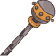**An Emerging Interest**This is difficult for folks? Seems pretty easy to me.<code>global_dps_multiplier_mult,10</code>**Sparking Cane**Skill is one thing. The tools to properly protect yourself are another.<code>global_dps_multiplier_mult,65</code>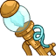**Artificer's Walking Stick**Leave them amazed, even if it's just by going for a walk.<code>global_dps_multiplier_mult,120</code>**Antimatter Blasting Cane**Reconsider that choice before you find out what my cane can really do.<code>global_dps_multiplier_mult,230</code>&nbsp;
        
        
            1
        
        
            Antimatter Blasting Cane
        
        
            All Champion Damage
        
    
    
        
            **Start of the Show**I once saw a showman that drew crowds from all around wear this...<code>buff_upgrade,25,15196,1</code>**Top Hat**...and from that moment on I knew exactly how I wanted to present myself.<code>buff_upgrade,87.5,15196,1</code>**Hat of the Spymaster**As time went on my style and skills began to crossover...<code>buff_upgrade,150,15196,1</code>**Top Hat of Telepathy**...until eventually, they became one and the same.<code>buff_upgrade,275,15196,1</code>
        
        
            2
        
        
            Top Hat of Telepathy
        
        
            Inner Circle
        
    
    
        
            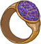**Spy's Protection**In this world, thoughts are not safe. I know that better than most.<code>buff_upgrade,25,15197,0</code>**Ring of Mind Shielding**There's a second feature of this item most don't think about. A backup plan.<code>buff_upgrade,87.5,15197,0</code>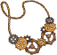**Necklace of Intellect**I need my mind and my skills to be as sharp as they can be.<code>buff_upgrade,150,15197,0</code>**Bigby's Beneficent Bracelet**A recent gift from back home. Somewhere I haven't been in a long, long time.<code>buff_upgrade,275,15197,0</code>
        
        
            3
        
        
            Bigby's Beneficent Bracelet
        
        
            Uncover Weakness (Prestack)
        
    
    
        
            **A Fresh Idea**These were just something I made in my free time...<code>buff_upgrade,25,15198,1</code>**Music Box**...but I saw a much greater potential for them.<code>buff_upgrade,87.5,15198,1</code>**Aeon's Wonderous Music Box**It's amazing the things people will just take into their homes.<code>buff_upgrade,150,15198,1</code>**Cosmic Wind-up**This one... this one is just for my own collection.<code>buff_upgrade,275,15198,1</code>
        
        
            4
        
        
            Cosmic Wind-up
        
        
            Challenge Accepted
        
    
    
        
            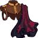**Elegant Disguise**People always think of spies in black leathers and hoods...<code>buff_upgrades,25,15199,15200</code>**Glamoured Shawl**...never in elegant formal wear out on the town.<code>buff_upgrades,87.5,15199,15200</code>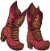**Heels of Elvenkind**These had to be specially made, but it was completely worth it.<code>buff_upgrades,150,15199,15200</code>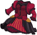**Gown of Whispers**Not even a hushed conversation escapes me while in this.<code>buff_upgrades,275,15199,15200</code>
        
        
            5
        
        
            Gown of Whispers
        
        
            All First Specialisations
        
    
    
        
            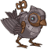**A New Friend**This was more of a test of my own skill than anything else.<code>reduce_ultimate_cooldown,9</code>**Mark II Sparrow**But, to my surprise, it turned into a friend and companion.<code>reduce_ultimate_cooldown,18</code>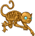**Mark VII 'Deuce'**It took a while to find a form he was comfortable in...<code>reduce_ultimate_cooldown,36</code>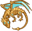**Mark X Pseudodragon**...but just wait until he sees what I've been working on for him.<code>reduce_ultimate_cooldown,90</code>
        
        
            6
        
        
            Mark X Pseudodragon
        
        
            Ultimate Cooldown Reduction Cap: 501 dull / 251 shiny / 126 golden.
        
    

<em>Item Names and Descriptions</em>

<pre>
Slot 1:
       An Emerging Interest: This is difficult for folks? Seems pretty easy to me.
              Sparking Cane: Skill is one thing. The tools to properly protect yourself are
                             another.
  Artificer's Walking Stick: Leave them amazed, even if it's just by going for a walk.
   Antimatter Blasting Cane: Reconsider that choice before you find out what my cane can really
                             do.

Slot 2:
          Start of the Show: I once saw a showman that drew crowds from all around wear this...
                    Top Hat: ...and from that moment on I knew exactly how I wanted to present
                             myself.
       Hat of the Spymaster: As time went on my style and skills began to crossover...
       Top Hat of Telepathy: ...until eventually, they became one and the same.

Slot 3:
           Spy's Protection: In this world, thoughts are not safe. I know that better than
                             most.
     Ring of Mind Shielding: There's a second feature of this item most don't think about. A
                             backup plan.
      Necklace of Intellect: I need my mind and my skills to be as sharp as they can be.
Bigby's Beneficent Bracelet: A recent gift from back home. Somewhere I haven't been in a long,
                             long time.

Slot 4:
               A Fresh Idea: These were just something I made in my free time...
                  Music Box: ...but I saw a much greater potential for them.
 Aeon's Wonderous Music Box: It's amazing the things people will just take into their homes.
             Cosmic Wind-up: This one... this one is just for my own collection.

Slot 5:
           Elegant Disguise: People always think of spies in black leathers and hoods...
            Glamoured Shawl: ...never in elegant formal wear out on the town.
         Heels of Elvenkind: These had to be specially made, but it was completely worth it.
           Gown of Whispers: Not even a hushed conversation escapes me while in this.

Slot 6:
               A New Friend: This was more of a test of my own skill than anything else.
            Mark II Sparrow: But, to my surprise, it turned into a friend and companion.
           Mark VII 'Deuce': It took a while to find a form he was comfortable in...
        Mark X Pseudodragon: ...but just wait until he sees what I've been working on for him.
</pre>

 

# Feats

This list will only show feats that are going to be available on the release of this champion. The separate [Feats](feats.md) page may show others that could be available later if they exist.

    
        
            **Feat**
        
        
            **Effect**
        
        
            **Source**
        
    
    
        
            **Selflessness (Aeon)**Yes, I am going to help, but it WILL cost you!<code>global_dps_multiplier_mult,10</code>Selflessness
        
        
            10% All Champion Damage
        
        
            Free
        
    
    
        
            **Inspiring Leader (Aeon)**How about you do your jobs, or I start revealing your darkest secrets?<code>global_dps_multiplier_mult,25</code>Inspiring Leader
        
        
            25% All Champion Damage
        
        
            Gold Chest
        
    
    
        
            **You'll Do (Aeon)**I guess you have your uses.<code>buff_upgrade,20,15196,1</code>You'll Do
        
        
            20% Inner Circle
        
        
            Free
        
    
    
        
            **Trusted For Now (Aeon)**Don't be surprised when we aren't friends next week.<code>buff_upgrade,40,15196,1</code>Trusted For Now
        
        
            40% Inner Circle
        
        
            12,500 Gems
        
    
    
        
            **Word on the Street (Aeon)**Don't worry; I know where their real weak spot is.<code>buff_upgrade,40,15197,0</code>Word on the Street
        
        
            40% Uncover Weakness (Prestack)
        
        
            Gold Chest
        
    
    
        
            **A Little Bird Said... (Aeon)**Now that folks are talking, our enemies will crumble.<code>buff_upgrade,80,15197,0</code>A Little Bird Said...
        
        
            80% Uncover Weakness (Prestack)
        
        
            Event Bonus
        
    
    
        
            **Are You Chicken? (Aeon)**They have no idea how far I will go to prove I'm right.<code>buff_upgrade,20,15198,1</code>Are You Chicken?
        
        
            20% Challenge Accepted
        
        
            Free
        
    
    
        
            **Do You Give Up? (Aeon)**Next time, don't mess with a professional.<code>buff_upgrade,40,15198,1</code>Do You Give Up?
        
        
            40% Challenge Accepted
        
        
            12,500 Gems
        
    
    
        
            **The Plan (Aeon)**Don't worry. They're playing right into our hands.<code>buff_upgrades,20,15199,15200</code>The Plan
        
        
            20% All First Specialisations
        
        
            Free
        
    
    
        
            **The Heist (Aeon)**Something ALWAYS goes wrong!<code>buff_upgrades,40,15199,15200</code>The Heist
        
        
            40% All First Specialisations
        
        
            Gold Chest
        
    
    
        
            **The Getaway (Aeon)**What were you so worried about?<code>buff_upgrades,80,15199,15200</code>The Getaway
        
        
            80% All First Specialisations
        
        
            50,000 Gems
        
    

# Legendaries

* Increases the damage of all Champions by 100%.
* Increases the damage of all Female Champions by 125%.
* Increases the damage of all Champions by 10% for each Champion in the formation.
* Increases the damage of all Champions with a INT score of 11 or higher by 100%.
* Increases the damage of all Champions with a WIS score of 11 or higher by 100%.
* Increases the damage of all Champions by 40% for each Champion in the formation with a EVIL alignment.

<em>DPS Applicable</em>

<pre>
     Arkhan: 4 / 6
    Artemis: 5 / 6
    Asharra: 6 / 6
      Azaka: 5 / 6
     Binwin: 4 / 6
   Birdsong: 6 / 6
Black Viper: 6 / 6
 Catti-brie: 6 / 6
     D'hani: 6 / 6
  Dark Urge: 4 / 6
     Delina: 6 / 6
    Dhadius: 4 / 6
     Drizzt: 5 / 6
    Farideh: 6 / 6
        Fen: 6 / 6
      Grimm: 4 / 6
     Gromma: 6 / 6
       Ishi: 6 / 6
    Jaheira: 5 / 6
    Jamilah: 5 / 6
   Jarlaxle: 5 / 6
        Jim: 5 / 6
    Karlach: 5 / 6
       Kent: 4 / 6
      Krond: 5 / 6
       Krux: 5 / 6
    Lae'zel: 6 / 6
     Lucius: 5 / 6
      Makos: 4 / 6
      Minsc: 3 / 6
      NERDS: 5 / 6
     Nahara: 5 / 6
      Nixie: 4 / 6
     Orisha: 6 / 6
   Prudence: 6 / 6
      Strix: 6 / 6
     Warden: 4 / 6
    Warduke: 4 / 6
      Zorbu: 5 / 6
</pre>

<em>Non-DPS Applicable</em>

<pre>
          Aeon: 6 / 6
          Aila: 5 / 6
       Alyndra: 6 / 6
       Antrius: 4 / 6
         Avren: 4 / 6
          BBEG: 5 / 6
       Baeloth: 5 / 6
        Beadle: 4 / 6
       Blooshi: 5 / 6
          Brig: 5 / 6
          Briv: 3 / 6
       Bruenor: 4 / 6
      Calliope: 6 / 6
       Celeste: 6 / 6
     Certainty: 6 / 6
       Corazón: 5 / 6
        Deekin: 3 / 6
       Desmond: 5 / 6
         Diana: 6 / 6
           Dob: 5 / 6
        Donaar: 3 / 6
    Dragonbait: 5 / 6
Dungeon Master: 5 / 6
      Dynaheir: 6 / 6
        Egbert: 3 / 6
       Evandra: 5 / 6
        Evelyn: 6 / 6
     Ezmerelda: 6 / 6
        Freely: 3 / 6
          Gale: 4 / 6
       Gazrick: 5 / 6
      Hew Maan: 5 / 6
         Hitch: 5 / 6
         Imoen: 6 / 6
      Jang Sao: 6 / 6
      K'thriss: 4 / 6
         Korth: 4 / 6
         Krull: 5 / 6
        Krydle: 5 / 6
       Lazaapz: 5 / 6
         Mehen: 5 / 6
          Melf: 5 / 6
      Merilwen: 6 / 6
         Miria: 6 / 6
        Môrgæn: 6 / 6
        Nayeli: 4 / 6
         Nerys: 6 / 6
        Nordom: 4 / 6
          Nova: 5 / 6
         Nrakk: 5 / 6
          Omin: 5 / 6
        Orkira: 5 / 6
       Paultin: 5 / 6
      Penelope: 5 / 6
        Presto: 5 / 6
         Pwent: 4 / 6
        Qillek: 5 / 6
     Ravengard: 4 / 6
         Regis: 4 / 6
          Reya: 6 / 6
          Rust: 5 / 6
        Selise: 6 / 6
        Sentry: 5 / 6
     Sgt. Knox: 4 / 6
   Shadowheart: 5 / 6
         Shaka: 5 / 6
       Shandie: 6 / 6
      Sisaspia: 6 / 6
        Solaak: 5 / 6
         Spurt: 3 / 6
         Stoki: 6 / 6
   Strongheart: 5 / 6
         Talin: 5 / 6
       Tatyana: 5 / 6
      Thellora: 5 / 6
        Turiel: 5 / 6
       Umberto: 5 / 6
         Uriah: 5 / 6
     Valentine: 6 / 6
            Vi: 6 / 6
       Viconia: 6 / 6
      Vin Ursa: 6 / 6
       Vlahnya: 6 / 6
      Voronika: 6 / 6
        Walnut: 5 / 6
        Widdle: 6 / 6
          Wyll: 5 / 6
        Xander: 5 / 6
      Xerophon: 5 / 6
</pre>

 

# Adventures and Variants

 **Unlock Adventure: Party Crashers (Aeon)** (Complete Area 50)
> Save Waterdeep from the chaos of a Founders' Day gone awry.

 **Variant 1: Mechanical Mayhem** (Complete Area 75)
> 1-2 Iron Defenders spawn with each wave. They don't drop gold nor count towards quest progress.  
> Aeon starts in the formation. She can't be moved or removed.  
> Only Champions next to Aeon can deal damage.  
> Getting to Know Aeon: Aeon buffs Champions next to her. Place your damage dealer next to her for the best effect!

 **Variant 2: Spy's Strategy** (Complete Area 125)
> Aeon starts in the formation. She can't be moved or removed.  
> You may only use core Champions and/or Champions eligible for Aeon's current Patron.  
> Getting to Know Aeon: Aeon's main buff is made stronger by using Champions that are eligible for the Patron she is currently infiltrating.

 **Variant 3: Discovered Secrets** (Complete Area 175)
> Aeon starts in the formation. She can't be moved or removed.  
> Only monsters that have a debuff can take damage.  
> Getting to Know Aeon: Aeon's attacks debuff monsters, making them take additional damage. Use her and other debuffing Champions to make it so you can damage these monsters!

# Other Champion Images

    
        
            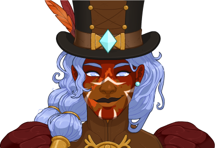Console Portrait
        
    
    
        
            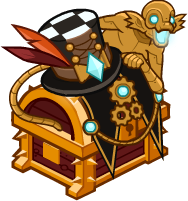Gold Chest Icon
        
        
            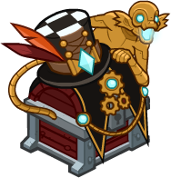Silver Chest Icon
        
    

[Back to Top](#top)

*Last Modified: {{ site.time }}*