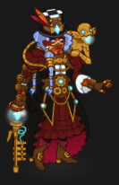
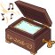
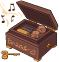

[Back to Main](index.md)

    
        Portait
    
    
        Model
    

# Aeon

Aeon looks like they'll be a CNE original tied to an upcoming Idle Champions Presents stream. Given their item names - it's possible they'll be some kind of Artillerist Artificer.

# Basic Information

Aeon will be a new champion in the Founders' Day event on 3 July 2024.

    
        
            **Seat**:
        
        
            Unknown
        
    
    
        
            **Race**:
        
        
            Goliath (Guess)
        
    
    
        
            **Class**:
        
        
            Artificer (Guess)
        
    
    
        
            **Roles**:
        
        
            Unknown
        
    
    
        
            **Age**:
        
        
            Unknown
        
    
    
        
            **Gender**:
        
        
            Female (Guess)
        
    
    
        
            **Alignment**:
        
        
            Unknown
        
    
    
        
            **Affiliation**:
        
        
            Unknown
        
    

# Formation

Unknown.


    



# Abilities

**Base Attack: Cane Wand** (Magic)
> Aeon fires an energy bolt from her cane at the closest enemy for one hit.  
> Cooldown: 6s (Cap 1.5s)

<em>Raw Data</em>

<pre>
{
    "id": 769,
    "name": "Cane Wand",
    "description": "Aeon fires an energy bolt from her cane at the closest enemy for one hit.",
    "long_description": "",
    "graphic_id": 0,
    "target": "front",
    "num_targets": 1,
    "aoe_radius": 0,
    "damage_modifier": 1,
    "cooldown": 6,
    "animations": [
        {
            "type": "ranged_attack",
            "projectile": "pd_generic_projectile",
            "shoot_offset_x": 42,
            "shoot_offset_y": -40,
            "shoot_frame": 8,
            "shoot_sound": 149,
            "hit_sound": 133,
            "projectile_details": {
                "hash": "ca7467c80e4d9c689e04b38d4141e3e2",
                "target_offset_y": 0,
                "projectile_speed": 2000,
                "projectile_graphic_id": 23696,
                "projectile_hit_graphic_id": 23698,
                "trail": {
                    "particle_graphic_ids": [
                        "23696"
                    ],
                    "lifespan": 0.2,
                    "spawn_rate": 200,
                    "spawn_shape_scale": {
                        "x": 0,
                        "y": 0
                    },
                    "initial_velocity": {
                        "x": 0,
                        "y": 0
                    },
                    "velocity_jitter": {
                        "x": 30,
                        "y": 30
                    },
                    "rotation_jitter": 0,
                    "alpha_lerp": {
                        "0": 0,
                        "0.1": 0.75,
                        "1": 0
                    },
                    "scale_lerp": [
                        {
                            "x": 1,
                            "y": 1
                        },
                        {
                            "x": 0,
                            "y": 0
                        }
                    ]
                }
            }
        }
    ],
    "tags": [
        "ranged"
    ],
    "damage_types": [
        "magic"
    ]
}
</pre>

**Base Attack: Cane Wand** (Magic)
> Aeon fires an energy bolt from her cane at the closest enemy for one hit.  
> Cooldown: 6s (Cap 1.5s)

<em>Raw Data</em>

<pre>
{
    "id": 771,
    "name": "Cane Wand",
    "description": "Aeon fires an energy bolt from her cane at the closest enemy for one hit.",
    "long_description": "",
    "graphic_id": 0,
    "target": "front",
    "num_targets": 1,
    "aoe_radius": 0,
    "damage_modifier": 1,
    "cooldown": 6,
    "animations": [
        {
            "type": "ranged_attack",
            "projectile": "pd_generic_projectile",
            "shoot_offset_x": 42,
            "shoot_offset_y": -40,
            "shoot_frame": 8,
            "shoot_sound": 149,
            "hit_sound": 133,
            "projectile_details": {
                "hash": "ca7467c80e4d9c689e04b38d4141e3e2",
                "target_offset_y": 0,
                "projectile_speed": 2500,
                "move_across_entire_screen": true,
                "hit_monsters_moved_through": true,
                "line_thickness": 100,
                "projectile_graphic_id": 23696,
                "projectile_hit_graphic_id": 23698,
                "trail": {
                    "particle_graphic_ids": [
                        "23696"
                    ],
                    "lifespan": 0.2,
                    "spawn_rate": 200,
                    "spawn_shape_scale": {
                        "x": 0,
                        "y": 0
                    },
                    "initial_velocity": {
                        "x": 0,
                        "y": 0
                    },
                    "velocity_jitter": {
                        "x": 30,
                        "y": 30
                    },
                    "rotation_jitter": 0,
                    "alpha_lerp": {
                        "0": 0,
                        "1": 0,
                        "0.1": 0.75
                    },
                    "scale_lerp": [
                        {
                            "x": 1,
                            "y": 1
                        },
                        {
                            "x": 0,
                            "y": 0
                        }
                    ]
                }
            }
        }
    ],
    "tags": [
        "ranged"
    ],
    "damage_types": [
        "magic"
    ]
}
</pre>

**Base Attack: Deuce** (Magic)
> Aeon's mechanical monkey Deuce fires a barrage at all enemies, dealing one ultimate hit to each one and knocking them back a short distance.  
> Cooldown: 6s (Cap 1.5s)

<em>Raw Data</em>

<pre>
{
    "id": 770,
    "name": "Deuce",
    "description": "Aeon's mechanical monkey Deuce fires a barrage at all enemies, dealing one ultimate hit to each one and knocking them back a short distance.",
    "long_description": "",
    "graphic_id": 0,
    "target": "front",
    "num_targets": 1,
    "aoe_radius": 0,
    "damage_modifier": 1,
    "cooldown": 6,
    "animations": [
        {
            "type": "ranged_attack",
            "projectile": "pd_generic_projectile",
            "shoot_offset_x": 50,
            "shoot_offset_y": -40,
            "shoot_frame": 8,
            "shoot_sound": 149,
            "hit_sound": 133,
            "projectile_details": {
                "hash": "ca7467c80e4d9c689e04b38d4141e3e2",
                "target_offset_y": 0,
                "projectile_speed": 2000,
                "projectile_graphic_id": 23696,
                "projectile_hit_graphic_id": 23698,
                "trail": {
                    "particle_graphic_ids": [
                        "23696"
                    ],
                    "lifespan": 0.2,
                    "spawn_rate": 200,
                    "spawn_shape_scale": {
                        "x": 0,
                        "y": 0
                    },
                    "initial_velocity": {
                        "x": 0,
                        "y": 0
                    },
                    "velocity_jitter": {
                        "x": 30,
                        "y": 30
                    },
                    "rotation_jitter": 0,
                    "alpha_lerp": {
                        "0": 0,
                        "0.1": 0.75,
                        "1": 0
                    },
                    "scale_lerp": [
                        {
                            "x": 1,
                            "y": 1
                        },
                        {
                            "x": 0,
                            "y": 0
                        }
                    ]
                }
            }
        }
    ],
    "tags": [
        "ranged"
    ],
    "damage_types": [
        "magic"
    ]
}
</pre>

**Challenge Accepted** (Guess)
> Unknown effect.

<em>Raw Data</em>

<pre>
{
    "id": 23832,
    "graphic": "Icons/Events/2018FoundersDay/Y7 Aeon/Icon_Formation_AeonChallengeAccepted",
    "v": 2,
    "fs": 0,
    "p": 0,
    "type": 1,
    "export_params": {
        "uses": [
            "icon"
        ]
    }
}
</pre>

**Inner Circle** (Guess)
> Unknown effect.

<em>Raw Data</em>

<pre>
{
    "id": 23833,
    "graphic": "Icons/Events/2018FoundersDay/Y7 Aeon/Icon_Formation_AeonInnerCircle",
    "v": 2,
    "fs": 0,
    "p": 0,
    "type": 1,
    "export_params": {
        "uses": [
            "icon"
        ]
    }
}
</pre>

**Network of Espionage** (Guess)
> Unknown effect.

<em>Raw Data</em>

<pre>
{
    "id": 23834,
    "graphic": "Icons/Events/2018FoundersDay/Y7 Aeon/Icon_Formation_AeonNetworkofEspionage",
    "v": 2,
    "fs": 0,
    "p": 0,
    "type": 1,
    "export_params": {
        "uses": [
            "icon"
        ]
    }
}
</pre>

**Uncover Weakness** (Guess)
> Unknown effect.

<em>Raw Data</em>

<pre>
{
    "id": 23835,
    "graphic": "Icons/Events/2018FoundersDay/Y7 Aeon/Icon_Formation_AeonUncoverWeakness",
    "v": 2,
    "fs": 0,
    "p": 0,
    "type": 1,
    "export_params": {
        "uses": [
            "icon"
        ]
    }
}
</pre>

# Specialisations

**Artificers Arsenal** (Guess)
> Unknown effect.

<em>Raw Data</em>

<pre>
{
    "id": 23836,
    "graphic": "Icons/Events/2018FoundersDay/Y7 Aeon/Icon_Specialization_AeonArtificersArsenal",
    "v": 2,
    "fs": 0,
    "p": 0,
    "type": 1,
    "export_params": {
        "uses": [
            "icon"
        ]
    }
}
</pre>

**Immediate Infiltration** (Guess)
> Unknown effect.

<em>Raw Data</em>

<pre>
{
    "id": 23837,
    "graphic": "Icons/Events/2018FoundersDay/Y7 Aeon/Icon_Specialization_AeonImmediateInfiltration",
    "v": 2,
    "fs": 0,
    "p": 0,
    "type": 1,
    "export_params": {
        "uses": [
            "icon"
        ]
    }
}
</pre>

**Play The Long Game** (Guess)
> Unknown effect.

<em>Raw Data</em>

<pre>
{
    "id": 23838,
    "graphic": "Icons/Events/2018FoundersDay/Y7 Aeon/Icon_Specialization_AeonPlayTheLongGame",
    "v": 2,
    "fs": 0,
    "p": 0,
    "type": 1,
    "export_params": {
        "uses": [
            "icon"
        ]
    }
}
</pre>

**Powerful Patronage** (Guess)
> Unknown effect.

<em>Raw Data</em>

<pre>
{
    "id": 23839,
    "graphic": "Icons/Events/2018FoundersDay/Y7 Aeon/Icon_Specialization_AeonPowerfulPatronage",
    "v": 2,
    "fs": 0,
    "p": 0,
    "type": 1,
    "export_params": {
        "uses": [
            "icon"
        ]
    }
}
</pre>

**Spy Network: Inner Circle** (Guess)
> Unknown effect.

<em>Raw Data</em>

<pre>
{
    "id": 23840,
    "graphic": "Icons/Events/2018FoundersDay/Y7 Aeon/Icon_Specialization_AeonSpyNetworkInnerCircle",
    "v": 2,
    "fs": 0,
    "p": 0,
    "type": 1,
    "export_params": {
        "uses": [
            "icon"
        ]
    }
}
</pre>

# Items

    
        
            **Icons**
        
        
            **Name**
        
    
    
        
            
        
        
            Cane
        
    
    
        
            
        
        
            Clothing
        
    
    
        
            
        
        
            Eldritch Cannon
        
    
    
        
            
        
        
            Jewelry
        
    
    
        
            
        
        
            Music Box
        
    
    
        
            
        
        
            Top Hat
        
    

# Feats

Unknown.

# Legendaries

Unknown.

# Adventures and Variants

Unknown.

# Other Champion Images

    
        
            Console Portait
        
    
    
        
            Gold Chest Icon
        
        
            Silver Chest Icon
        
    

[Back to Top](#top)

*Last Modified: {{ site.time }}*