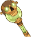
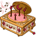

[Back to Main](index.md)

    
        Model
    

# Aeon

Right now nothing is known about this champion except their name. Given that they appeared in the defs at the same time as Umberto - the assumption is that they'll both be characters in an upcoming Idle Champions Presents stream.

# Basic Information

Aeon will be a new champion - potentially in the Founders' Day event on 3 July 2024. (It's possible they could be in a different event - we don't know yet.)

    
        
            **Seat**:
        
        
            Unknown
        
    
    
        
            **Race**:
        
        
            Unknown
        
    
    
        
            **Class**:
        
        
            Unknown
        
    
    
        
            **Roles**:
        
        
            Unknown
        
    
    
        
            **Age**:
        
        
            Unknown
        
    
    
        
            **Gender**:
        
        
            Unknown
        
    
    
        
            **Alignment**:
        
        
            Unknown
        
    
    
        
            **Affiliation**:
        
        
            Unknown
        
    

# Formation

Unknown.


    



# Abilities

**Base Attack: Unknown**
> Unknown effect.

<em>Raw Data</em>

<pre>
</pre>

**Ultimate Attack: Unknown**
> Unknown effect.

<em>Raw Data</em>

<pre>
</pre>

**Unknown**
> Unknown effect.

<em>Raw Data</em>

<pre>
</pre>

# Specialisations

Unknown.

# Items

    
        
            **Icons**
        
        
            **Name**
        
    
    
        
            
        
        
            Cane
        
    
    
        
            
        
        
            Clothing
        
    
    
        
            
        
        
            Eldritch Cannon
        
    
    
        
            
        
        
            Jewelry
        
    
    
        
            
        
        
            Music Box
        
    
    
        
            
        
        
            Top Hat
        
    

# Feats

Unknown.

# Legendaries

Unknown.

# Adventures and Variants

Unknown.


# Other Champion Images



[Back to Top](#top)

*Last Modified: {{ site.time }}*