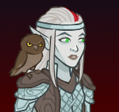

[Back to Main](index.md)

    
        
            
        
        
        Portrait
        
    

# Alyndra

Alyndra Alexandria Garanahil Sarrbarand is known by many names: Lorekeeper of Rime Spiro, Kinscribe of Clan Monkeymouse, Daughter of Oblivion, Fate Changer, Knight of Wonder and Captivation...and apologetic offspring of Avren & Sofieus.

# Changes

Alyndra will be a reworked champion in the Highharvestide event on 10 September 2025 (expected a week after event start due to Worst the Wait).

Only abilities that have seen some changes will be displayed here - and be aware that there's a lot of guesswork involved. Some abilities may not have names - some may have the *wrong* names - or specialisations might not be marked as such - etc.. Focus on the effect data itself.

Please do me a favour and don't get all melodramatic about what you find here. I - and CNE - don't appreciate it. These are spoilers and will almost certainly change before release - likely multiple times. That and we don't have access to any upgrade data prior to release. Making assumptions on how the champions will turn out based on this information would be premature.

# Abilities

**Circle of Divination** (Guess)
> Unknown.

<em>Raw Data</em>

<pre>
{
    "id": 27169,
    "graphic": "Icons/Events/2017Highharvestide/Highharvestide_Y9/Icon_FormationLarge_CazrinUnctuousUggie",
    "v": 2,
    "fs": 0,
    "p": 0,
    "type": 1,
    "export_params": {
        "uses": [
            "icon"
        ]
    }
}
</pre>

**I Have Forseen This** (Guess)
> Unknown.

<em>Raw Data</em>

<pre>
{
    "id": 27170,
    "graphic": "Icons/Events/2017Highharvestide/Highharvestide_Y9/Icon_Formation_AlyndraCircleofDivination",
    "v": 2,
    "fs": 0,
    "p": 0,
    "type": 1,
    "export_params": {
        "uses": [
            "icon"
        ]
    }
}
</pre>

# Specialisations

**Specialisation: Heroes of the Planes** (Guess)
> Unknown.

<em>Raw Data</em>

<pre>
{
    "id": 27181,
    "graphic": "Icons/Events/2017Highharvestide/Highharvestide_Y9/Icon_Specialization_AlyndraHeroesofthePlanes",
    "v": 2,
    "fs": 0,
    "p": 0,
    "type": 1,
    "export_params": {
        "uses": [
            "icon"
        ]
    }
}
</pre>

# Adventures and Variants

**Unlock Adventure: A Fool's Errand (Alyndra)** (Complete Area 50)
> Save the village from a foolish prank gone wrong.

 **Variant 1: Future Sight** (Complete Area 75)
> In each boss area, you will encounter the current boss AND the next boss at once. You'll need to defeat both to progress. Chadwick joins the formation. He mostly observes and tries to figure out what's going on.

 **Variant 2: Frost Wave** (Complete Area 125)
> Additional Frost Giants appear in each area. Each of these additional Frost Giants start with 4 hits-based hit points. Every 25 areas they gain 4 additional hits-based hit points. Champion damage is reduced by 99%.

 **Variant 3: Knowledge Over Power** (Complete Area 175)
> Only Champions with INT of 14 or higher can be used. Alyndra starts in your formation. She can be moved or removed.

# Formation

    <svg xmlns="http://www.w3.org/2000/svg" id="Alyndra" fill="#aaa" data-formationName="Alyndra" data-campaignName="Festival of Fools" width="327" height="160"><circle cx="175" cy="105" r="15"/><circle cx="135" cy="45" r="15"/><circle cx="135" cy="85" r="15"/><circle cx="135" cy="125" r="15"/><circle cx="95" cy="25" r="15"/><circle cx="95" cy="65" r="15"/><circle cx="95" cy="145" r="15"/><circle cx="55" cy="45" r="15"/><circle cx="55" cy="125" r="15"/><circle cx="15" cy="65" r="15"/><text x="205" y="25" fill="#dcdcdc" font-size="25" font-family="Arial" font-weight="bold">Alyndra</text><text x="205" y="65" fill="#dcdcdc" font-size="15" font-family="Arial" font-weight="bold">Festival of Fools</text></svg>

[Back to Top](#top)

*Last Modified: {{ site.time }}*