[Back to Main](index.md)

    
        
            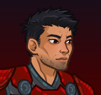
        
        
            Portrait
        
    
    
        
            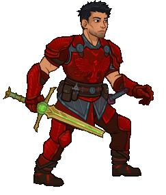
        
        
            Model
        
    

# Anson

Anson, a fighter too stubborn to stay down, even when the odds are stacked against him.

[The Fallbacks: Bound for Ruin - Fandom Wiki](https://forgottenrealms.fandom.com/wiki/The_Fallbacks:_Bound_for_Ruin)

# Basic Information

Anson will be a new champion in the Wintershield event on 7 January 2026.

    
        
            **Seat**:
        
        
            1
        
    
    
        
            **Species**:
        
        
            Human
        
    
    
        
            **Class**:
        
        
            Fighter
        
    
    
        
            **Roles**:
        
        
            Support / Tanking / Control
        
    
    
        
            **Age**:
        
        
            23
        
    
    
        
            **Gender**:
        
        
            Male
        
    
    
        
            **Alignment**:
        
        
            Neutral Good
        
    
    
        
            **Affiliation**:
        
        
            The Fallbacks
        
    

# Formation

    <svg xmlns="http://www.w3.org/2000/svg" id="Anson" fill="#aaa" data-formationName="Anson" data-campaignName="Wintershield" width="299" height="160"><circle cx="175" cy="25" r="15"/><circle cx="175" cy="65" r="15"/><circle cx="135" cy="85" r="15"/><circle cx="95" cy="25" r="15"/><circle cx="95" cy="65" r="15"/><circle cx="95" cy="105" r="15"/><circle cx="95" cy="145" r="15"/><circle cx="55" cy="85" r="15"/><circle cx="15" cy="25" r="15"/><circle cx="15" cy="65" r="15"/><text x="205" y="25" fill="#dcdcdc" font-size="25" font-family="Arial" font-weight="bold">Anson</text><text x="205" y="65" fill="#dcdcdc" font-size="15" font-family="Arial" font-weight="bold">Wintershield</text></svg>

# Attacks

**Base Attack: Broken Blade** (Melee)
> Anson attacks the closest enemy and deals one hit.  
> Cooldown: 4s (Cap 1s)

<em>Raw Data</em>

<pre>
{
    "id": 924,
    "name": "Broken Blade",
    "description": "Anson attacks the closest enemy, dealing 1 hit.",
    "long_description": "Anson attacks the closest enemy and deals one hit.",
    "graphic_id": 0,
    "target": "front",
    "num_targets": 1,
    "aoe_radius": 0,
    "damage_modifier": 1,
    "cooldown": 4,
    "animations": [
        {
            "type": "melee_attack",
            "power_up_sequence": {
                "start_frame": 0,
                "end_frame": 3
            },
            "sequences": [
                {
                    "start_frame": 3,
                    "end_frame": 20
                }
            ],
            "damage_frame": 2
        }
    ],
    "tags": [
        "melee"
    ],
    "damage_types": [
        "melee"
    ]
}
</pre>

**Base Attack: Broken Blade** (Melee)
> Anson attacks the closest enemy and deals one hit.  
> Cooldown: 4s (Cap 1s)

<em>Raw Data</em>

<pre>
{
    "id": 930,
    "name": "Broken Blade",
    "description": "Anson attacks the closest enemy, dealing 1 hit.",
    "long_description": "Anson attacks the closest enemy and deals one hit.",
    "graphic_id": 0,
    "target": "front",
    "num_targets": 1,
    "aoe_radius": 0,
    "damage_modifier": 1,
    "cooldown": 4,
    "animations": [
        {
            "type": "melee_attack",
            "damage_frame": 2
        }
    ],
    "tags": [
        "melee"
    ],
    "damage_types": [
        "melee"
    ]
}
</pre>

**Base Attack: Uggie's Bite** (Melee)
> Uggie leaps out and bites a random enemy, dealing 1 hit. Uggie will prioritize enemies she hasn't attacked yet.  
> Cooldown: 0s (Cap 0s)

<em>Raw Data</em>

<pre>
{
    "id": 928,
    "name": "Uggie's Bite",
    "description": "Uggie protects her persons by biting a scary monster.",
    "long_description": "Uggie leaps out and bites a random enemy, dealing 1 hit. Uggie will prioritize enemies she hasn't attacked yet.",
    "graphic_id": 0,
    "target": "front",
    "num_targets": 1,
    "aoe_radius": 0,
    "damage_modifier": 1,
    "cooldown": 0,
    "animations": [
        {
            "type": "melee_attack",
            "damage_frame": 3
        }
    ],
    "tags": [
        "melee",
        "ignore_cooldown_override"
    ],
    "damage_types": [
        "melee"
    ]
}
</pre>

**Ultimate Attack: Storm Crash**
> Anson attacks the toughest enemy with his sword, while blasting all nearby foes with deadly lightning.  
> Cooldown: 360s (Cap 90s)

<em>Raw Data</em>

<pre>
{
    "id": 927,
    "name": "Storm Crash",
    "description": "Anson attacks the toughest enemy and creates a blast of deadly lightning.",
    "long_description": "Anson attacks the toughest enemy with his sword, while blasting all nearby foes with deadly lightning.",
    "graphic_id": 28061,
    "target": "highest_health",
    "num_targets": 1,
    "aoe_radius": 0,
    "damage_modifier": 0.03,
    "cooldown": 360,
    "animations": [
        {
            "type": "ultimate_attack",
            "attack_seq": "ultimate",
            "alternate_charge_sequence": "special",
            "refresh_damage_targets_pre_jump": true,
            "ultimate": "anson",
            "power_up_sequence": {
                "start_frame": 0,
                "end_frame": 21
            },
            "sequences": [
                {
                    "start_frame": 22,
                    "end_frame": 62,
                    "damage_frame": 30,
                    "target_offset_x": -70,
                    "visual_effect_frames": {
                        "hit": {
                            "effect": "animated_clip",
                            "graphic_id": 28092,
                            "offset_x": 0,
                            "offset_y": -20,
                            "scale": 3,
                            "sort_offset": -9999
                        }
                    }
                }
            ]
        }
    ],
    "tags": [
        "magic",
        "ultimate"
    ],
    "damage_types": [
        "magic"
    ]
}
</pre>

**Base Attack: United Strike (Storm Crash)** (Magic)
> Anson directs all the Fallbacks to attack with their ultimate attack, including his own Storm Crash.  
> Cooldown: 360s (Cap 90s)

<em>Raw Data</em>

<pre>
{
    "id": 926,
    "name": "United Strike (Storm Crash)",
    "description": "Anson directs all the Fallbacks to make their ultimate attack.",
    "long_description": "Anson directs all the Fallbacks to attack with their ultimate attack, including his own Storm Crash.",
    "graphic_id": 26833,
    "target": "none",
    "num_targets": 0,
    "aoe_radius": 0,
    "damage_modifier": 0.03,
    "cooldown": 360,
    "animations": [
        {
            "type": "united_strike_ultimate"
        }
    ],
    "tags": [
        "magic"
    ],
    "damage_types": [
        "magic"
    ]
}
</pre>

**Base Attack: Call Uggie**
> Anson calls Uggie to his side.  
> Cooldown: 0s (Cap 0s)

<em>Raw Data</em>

<pre>
{
    "id": 925,
    "name": "Call Uggie",
    "description": "Anson calls Uggie to his side.",
    "long_description": "Anson calls Uggie to his side.",
    "graphic_id": 27100,
    "target": "none",
    "num_targets": 0,
    "aoe_radius": 0,
    "damage_modifier": 1,
    "cooldown": 0,
    "animations": [
        {
            "type": "call_uggie_ultimate",
            "no_damage_display": true
        }
    ],
    "tags": [
        "ignore_familiar",
        "ignore_cooldown_override"
    ],
    "damage_types": []
}
</pre>

# Abilities

**Unknown** (Guess)
> Uggie joins the party, starting next to Anson unless she's already in the formation next to another Fallbacks Champion. Uggie increases the damage of all non-adjacent Champions by 100%.

<em>Raw Data</em>

<pre>
{
    "id": 2546,
    "flavour_text": "",
    "description": {
        "desc": "Uggie joins the party, starting next to Anson unless she's already in the formation next to another Fallbacks Champion. Uggie increases the damage of all non-adjacent Champions by $amount%."
    },
    "effect_keys": [
        {
            "effect_string": "uggie_handler,100",
            "off_when_benched": true,
            "uggie_roaming_disable_index": 1,
            "post_united_strike_effect_indices": [
                2
            ],
            "uggie_priority": 4,
            "uggie_buff_effect_id": 2366,
            "call_uggie_ult_id": 925,
            "united_strike_ult_id": 926,
            "use_computed_amount_for_description": true,
            "attack_id": 928
        },
        {
            "effect_string": "disallow_roaming_familiar_ult_trigger",
            "apply_manually": true
        },
        {
            "effect_string": "buff_ultimate,100",
            "apply_manually": true,
            "targets": [
                "all"
            ],
            "filter_targets": [
                {
                    "type": "hero_expr",
                    "hero_expr": "HasTag(`fallbacks`)"
                }
            ]
        }
    ],
    "requirements": "",
    "graphic_id": 27103,
    "large_graphic_id": 27103,
    "properties": {
        "is_formation_ability": true,
        "show_incoming": false,
        "owner_use_outgoing_description": true,
        "indexed_effect_properties": true,
        "per_effect_index_bonuses": true,
        "default_bonus_index": 0,
        "retain_on_slot_changed": true
    }
}
</pre>

**Unshakable** (Guess)
> Anson increases the damage of all Champions in the columns behind him by 100%.

<em>Raw Data</em>

<pre>
{
    "id": 2547,
    "flavour_text": "",
    "description": {
        "desc": "Anson increases the damage of all Champions in the columns behind him by $(amount)%."
    },
    "effect_keys": [
        {
            "off_when_benched": true,
            "effect_string": "hero_dps_multiplier_mult,100",
            "targets": [
                "behind"
            ],
            "amount_updated_listeners": [
                "slot_changed",
                "hero_tags_changed",
                "feat_changed"
            ]
        },
        {
            "effect_string": "do_nothing_unshakable",
            "off_when_benched": true,
            "targets": [
                "behind"
            ],
            "skip_effect_key_desc": true
        }
    ],
    "requirements": "",
    "graphic_id": 28050,
    "large_graphic_id": 28044,
    "properties": {
        "is_formation_ability": true,
        "owner_use_outgoing_description": true
    }
}
</pre>

**Unbreakable Uggie** (Guess)
> Uggie's buff is increased by 400% when Anson is in the formation.

<em>Raw Data</em>

<pre>
{
    "id": 2548,
    "flavour_text": "",
    "description": {
        "desc": "Uggie's buff is increased by $amount% when Anson is in the formation."
    },
    "effect_keys": [
        {
            "effect_string": "unleash_uggie_contribution,400",
            "off_when_benched": true
        }
    ],
    "requirements": "",
    "graphic_id": 28049,
    "large_graphic_id": 28043,
    "properties": {
        "is_formation_ability": true,
        "owner_use_outgoing_description": true,
        "indexed_effect_properties": true,
        "per_effect_index_bonuses": true,
        "default_bonus_index": 0
    }
}
</pre>

**Biting Style** (Guess)
> When Uggie is with Anson, Uggie attacks the closest enemy whenever Anson attacks. Uggie's damage deals 1 second of BUD-based damage and drives the enemy berserk. Berserk enemies move 50% faster and attack twice as often, but deal 90% less damage.

<em>Raw Data</em>

<pre>
{
    "id": 2549,
    "flavour_text": "",
    "description": {
        "desc": "When Uggie is with Anson, Uggie attacks the closest enemy whenever Anson attacks. Uggie's damage deals 1 second of BUD-based damage and drives the enemy berserk. Berserk enemies move 50% faster and attack twice as often, but deal 90% less damage."
    },
    "effect_keys": [
        {
            "effect_string": "uggie_attack_handler,1",
            "off_when_benched": true,
            "uggie_attack_on_start": true
        },
        {
            "effect_string": "uggie_inflict_berserk",
            "off_when_benched": true,
            "debuff_before_damage": true,
            "debuffing_attack_ids": [
                928
            ],
            "debuff_effects": [
                {
                    "effect_string": "effect_def,2472"
                }
            ]
        }
    ],
    "requirements": "",
    "graphic_id": 28045,
    "large_graphic_id": 28039,
    "properties": {
        "is_formation_ability": true,
        "owner_use_outgoing_description": true
    }
}
</pre>

**Got Your Back** (Guess)
> Anson increases the health of all other Champions by 25% of his max health, and healing effects on all Champions are increased by 25%.

<em>Raw Data</em>

<pre>
{
    "id": 2550,
    "flavour_text": "",
    "description": {
        "desc": "Anson increases the health of all other Champions by $amount% of his max health, and healing effects on all Champions are increased by $amount___2%."
    },
    "effect_keys": [
        {
            "effect_string": "increase_health_by_source_percent,25",
            "targets": [
                "other"
            ],
            "off_when_benched": true
        },
        {
            "effect_string": "healing_add_mult,25",
            "off_when_benched": true,
            "targets": [
                "all"
            ]
        }
    ],
    "requirements": "",
    "graphic_id": 28048,
    "large_graphic_id": 28042,
    "properties": {
        "is_formation_ability": true,
        "owner_use_outgoing_description": true,
        "indexed_effect_properties": true,
        "per_effect_index_bonuses": true,
        "default_bonus_index": 0
    }
}
</pre>

**Combat Trance** (Guess)
> Each time Anson is attacked or takes damage in an area, he gains a Meditation stack. Each Meditation stack increases the effect of Unshakable by 50%, stacking multiplicatively. Anson can have a maximum of 50 Meditation stacks, and they reset when changing areas.

<em>Raw Data</em>

<pre>
{
    "id": 2551,
    "flavour_text": "",
    "description": {
        "desc": "Each time Anson is attacked or takes damage in an area, he gains a Meditation stack. Each Meditation stack increases the effect of Unshakable by $amount%, stacking multiplicatively. Anson can have a maximum of $(anson_meditation_max_stacks) Meditation stacks, and they reset when changing areas."
    },
    "effect_keys": [
        {
            "effect_string": "pre_stack,50"
        },
        {
            "effect_string": "buff_upgrade,0,18468",
            "amount_expr": "upgrade_amount(18472,0)",
            "stacks_on_trigger": "will_stack_manually",
            "stacks_multiply": true,
            "show_bonus": true
        },
        {
            "effect_string": "anson_combat_trance",
            "buff_effect_key_index": 1,
            "base_max_stacks": 75,
            "stacks_per_damage": 1
        }
    ],
    "requirements": "",
    "graphic_id": 28046,
    "large_graphic_id": 28040,
    "properties": {
        "is_formation_ability": true,
        "owner_use_outgoing_description": true,
        "indexed_effect_properties": true,
        "per_effect_index_bonuses": true,
        "default_bonus_index": 1
    }
}
</pre>

**Erratic Energy** (Guess)
> When Anson uses his Storm Crash ultimate ability, Anson's sword ignites in lightning for 45 seconds. For the duration, Anson's attacks deal an additional 5 seconds of BUD-based damage, damage him for damage equal to 1% of his Maximum Health, and increase the maximum stacks of Combat Trance's Meditation by 1, up to a maximum of 25 additional maximum stacks. The increase to the maximum stacks resets when changing areas.

<em>Raw Data</em>

<pre>
{
    "id": 2552,
    "flavour_text": "",
    "description": {
        "desc": "When Anson uses his Storm Crash ultimate ability, Anson's sword ignites in lightning for 45 seconds. For the duration, Anson's attacks deal an additional $(seconds_of_bud) seconds of BUD-based damage, damage him for damage equal to $(damage_percent)% of his Maximum Health, and increase the maximum stacks of Combat Trance's Meditation by $(stacks_per_attack), up to a maximum of $max_stacks___3 additional maximum stacks. The increase to the maximum stacks resets when changing areas."
    },
    "effect_keys": [
        {
            "effect_string": "anson_erratic_energy",
            "duration": 45,
            "seconds_of_bud": 5,
            "damage_percent": 1,
            "stacks_per_attack": 1,
            "buff_indicies": [
                1,
                2
            ],
            "post_buff_indicies": [
                3
            ],
            "attack_ids": [
                924,
                927
            ]
        },
        {
            "effect_string": "animation_synced_overlay,28162",
            "skin_property_prefix": "erratic_energy_overlay",
            "apply_manually": true
        },
        {
            "effect_string": "add_max_combat_trance_stacks,1",
            "stacks_on_trigger": "will_stack_manually",
            "stacks_per_attack": 1,
            "max_stacks": 25,
            "stacks_multiply": false,
            "show_stacks": true,
            "apply_manually": true
        },
        {
            "effect_string": "add_max_combat_trance_stacks,1",
            "stacks_on_trigger": "will_stack_manually",
            "max_stacks": 25,
            "stacks_multiply": false,
            "show_stacks": false,
            "apply_manually": true
        }
    ],
    "requirements": "",
    "graphic_id": 28047,
    "large_graphic_id": 28041,
    "properties": {
        "is_formation_ability": true,
        "owner_use_outgoing_description": true,
        "indexed_effect_properties": true,
        "per_effect_index_bonuses": true
    }
}
</pre>

**Get Behind Me!** (Guess)
> Anson's attacks have a 50% chance to taunt enemies. When he successfully taunts an enemy, he increases his max Meditation stacks by 1 until changing areas, up to a max of 25.

<em>Raw Data</em>

<pre>
{
    "id": 2559,
    "flavour_text": "",
    "description": {
        "desc": "Anson's attacks have a 50% chance to taunt enemies. When he successfully taunts an enemy, he increases his max Meditation stacks by 1 until changing areas, up to a max of 25"
    },
    "effect_keys": [
        {
            "effect_string": "anson_taunt",
            "buff_index": 1
        },
        {
            "effect_string": "add_max_combat_trance_stacks,1",
            "stacks_on_trigger": "will_stack_manually",
            "stacks_per_attack": 1,
            "max_stacks": 25,
            "stacks_multiply": false,
            "show_stacks": true
        }
    ],
    "requirements": "",
    "graphic_id": 0,
    "large_graphic_id": 0,
    "properties": {
        "is_formation_ability": true,
        "effect_name": "Get Behind Me!",
        "show_in_owner_outgoing": true,
        "owner_use_outgoing_description": true
    }
}
</pre>

# Specialisations

**Pure of Heart** (Guess)
> Anson increases the effect of Unshakable by 100% for each Good Champion or Fallbacks Champion in the formation, stacking multiplicatively.

ⓘ *Note: This ability is prestack.*

<em>Raw Data</em>

<pre>
{
    "id": 2553,
    "flavour_text": "",
    "description": {
        "desc": "Anson increases the effect of Unshakable by $(amount)% for each Good Champion or Fallbacks Champion in the formation, stacking multiplicatively."
    },
    "effect_keys": [
        {
            "effect_string": "pre_stack,100",
            "skip_effect_key_desc": true
        },
        {
            "effect_string": "buff_upgrade,0,18468",
            "off_when_benched": true,
            "stack_func": "per_hero_attribute",
            "per_hero_expr": "HasTag(`good`) || HasTag(`fallbacks`)",
            "amount_func": "mult",
            "amount_expr": "upgrade_amount(18474,0)",
            "amount_updated_listeners": [
                "slot_changed",
                "upgrade_unlocked",
                "feat_changed",
                "loot_changed"
            ],
            "show_bonus": true
        }
    ],
    "requirements": "",
    "graphic_id": 28057,
    "large_graphic_id": 28057,
    "properties": {
        "is_formation_ability": true,
        "owner_use_outgoing_description": true,
        "indexed_effect_properties": true,
        "per_effect_index_bonuses": true,
        "default_bonus_index": 0,
        "spec_option_post_apply_info": "Good or Fallback Champions: $num_stacks___2"
    }
}
</pre>

**Found Family** (Guess)
> Anson increases the effect of Unshakable by 125% for each unaffiliated Champion or Fallbacks Champion in the formation, stacking multiplicatively.

ⓘ *Note: This ability is prestack.*

<em>Raw Data</em>

<pre>
{
    "id": 2554,
    "flavour_text": "",
    "description": {
        "desc": "Anson increases the effect of Unshakable by $(amount)% for each unaffiliated Champion or Fallbacks Champion in the formation, stacking multiplicatively."
    },
    "effect_keys": [
        {
            "effect_string": "pre_stack,125",
            "skip_effect_key_desc": true
        },
        {
            "effect_string": "buff_upgrade,0,18468",
            "off_when_benched": true,
            "stack_func": "per_hero_attribute",
            "per_hero_expr": "HasTag(`unaffiliated`) || HasTag(`fallbacks`)",
            "amount_func": "mult",
            "amount_expr": "upgrade_amount(18475,0)",
            "amount_updated_listeners": [
                "slot_changed",
                "upgrade_unlocked",
                "feat_changed",
                "loot_changed"
            ],
            "show_bonus": true
        }
    ],
    "requirements": "",
    "graphic_id": 28055,
    "large_graphic_id": 28055,
    "properties": {
        "is_formation_ability": true,
        "owner_use_outgoing_description": true,
        "indexed_effect_properties": true,
        "per_effect_index_bonuses": true,
        "default_bonus_index": 0,
        "spec_option_post_apply_info": "Unaffiliated or Fallback Champions: $num_stacks___2"
    }
}
</pre>

**Never Surrender** (Guess)
> Anson increases the effect of Unshakable by 200% for each formation slot blocked by an escort or Fallbacks Champion in the formation, stacking multiplicatively.

ⓘ *Note: This ability is prestack.*

<em>Raw Data</em>

<pre>
{
    "id": 2555,
    "flavour_text": "",
    "description": {
        "desc": "Anson increases the effect of Unshakable by $(amount)% for each formation slot blocked by an escort or Fallbacks Champion in the formation, stacking multiplicatively."
    },
    "effect_keys": [
        {
            "effect_string": "pre_stack,200",
            "skip_effect_key_desc": true
        },
        {
            "effect_string": "buff_upgrade,0,18468",
            "off_when_benched": true,
            "stack_func": "per_crusader",
            "stack_func_data": {
                "include_escorts": true,
                "target_filters_or": [
                    {
                        "type": "escort"
                    },
                    {
                        "type": "tags",
                        "tags": "fallbacks"
                    }
                ]
            },
            "amount_func": "mult",
            "amount_expr": "upgrade_amount(18476,0)",
            "amount_updated_listeners": [
                "slot_changed",
                "upgrade_unlocked",
                "feat_changed",
                "loot_changed"
            ],
            "show_bonus": true
        }
    ],
    "requirements": "",
    "graphic_id": 28056,
    "large_graphic_id": 28056,
    "properties": {
        "is_formation_ability": true,
        "owner_use_outgoing_description": true,
        "indexed_effect_properties": true,
        "per_effect_index_bonuses": true,
        "default_bonus_index": 0,
        "spec_option_post_apply_info": "Escorts or Fallback Champions: $num_stacks___2"
    }
}
</pre>

# Items

    
        
            **Icons**
        
        
            **Name**
        
    
    
        
            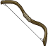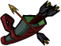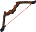
        
        
            Bow
        
    
    
        
            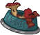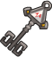
        
        
            Fallbacks
        
    
    
        
            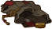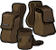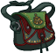
        
        
            Pouches
        
    
    
        
            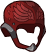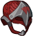
        
        
            Shield Helm
        
    
    
        
            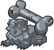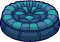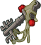
        
        
            Uggie Stuff
        
    
    
        
            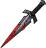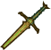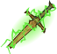
        
        
            Weapons
        
    

# Feats

Unknown.

# Legendaries

Unknown.

# Adventures and Variants

 **Unlock Adventure: The Merry Map Misadventure (Anson)** (Complete Area 50)
> Help a poor map find its way home for the holidays.

 **Variant 1: Always Count Uggie** (Complete Area 75)
> Anson starts in the formation with his Unshakable Ability unlocked. He can be moved but not removed.  
> Only Anson and Champions buffed by both him and Uggie can deal damage.  
> 1-2 Mimics spawn with each wave. They don't drop gold nor count towards quest progress.  
> <b>Getting to Know Anson:</b> Anson increases the damage of Champions behind him, while Uggie increases the damage of Champions not next to Uggie. Position your damage dealer to take advantage of both buffs!

 **Variant 2: The Walkers of Waterdeep** (Complete Area 125)
> Anson starts in the formation. He can be moved but not removed.  
> Champions don't recover health when moving to a new area.   
> Champions resurrect at half health when changing areas instead of full health.  
> Every 100 areas, enemy speed and damage is increased by 100%, stacking additively up to 10 times.  
> Starting in area 50, a thrown rock hits a random Champion every second, dealing 1% of their max health in damage  
> <b>Getting to Know Anson:</b> Anson's unstable weapon sometimes shocks him, but he powers through it. You may need to include some healing abilities to get him through!

 **Variant 3: Family Matters** (Complete Area 175)
> Anson starts in the formation. He can be moved but not removed.  
> Anson's brother Valen and a scared villager join the formation.  
> 1-2 Zhentarim Thugs spawn with each wave. They don't drop gold nor count towards quest progress.  
> You may only use Good, Unaffiliated, or Fallbacks champions.  
> <b>Getting to Know Anson:</b> Anson's specialization choices determine which heroes he works best with. Who will you include in the formation?

# Other Champion Images

    
        
            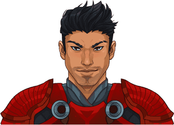Console Portrait
        
    
    
        
            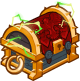Gold Chest Icon
        
        
            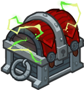Silver Chest Icon
        
    

[Back to Top](#top)

*Last Modified: {{ site.time }}*