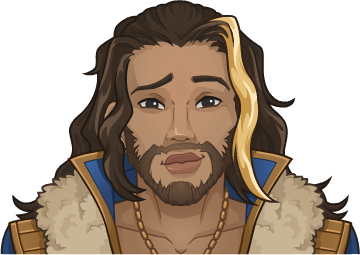

[Back to Main](index.md)





# Antrius

Antrius is a "a vain and charming human Bard" from the 1 for All sketch show. According to Google.

# Basic Information

Antrius will be the new champion in the Greengrass event on 5 April 2023.

* Seat: Unknown
* Race: Human (Guess)
* Class: Bard (Guess)
* Roles: Unknown
* Gender: Male (Guess)
* Alignment: Unknown
* Affiliation: Unknown
* Stats: Unknown

# Formation

Unknown.




# Abilities

**Base Attack: Unknown**
> Unknown effect.

<em>Raw Data</em>

<pre>
</pre>

 

**Ultimate Attack: Unknown**
> Unknown effect.

<em>Raw Data</em>

<pre>
</pre>

 

**Unknown**
> Unknown effect.

<em>Raw Data</em>

<pre>
</pre>

 

# Specialisations

Unknown.

# Items

| Slot | Name | Type |
|---|---|---|
| 1 | `Unknown` | Unknown |
| 2 | `Unknown` | Unknown |
| 3 | `Unknown` | Unknown |
| 4 | `Unknown` | Unknown |
| 5 | `Unknown` | Unknown |
| 6 | `Unknown` | Unknown |

# Feats

Unknown.

# Legendaries

Unknown.


# Console Portrait


[Back to Top](#top)

*Last Modified: {{ site.time }}*