[Back to Main](index.md)

    
        
            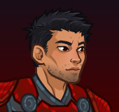
        
        
            Portrait
        
    
    
        
            
        
        
            Model
        
    

# Anson Iro

Anson has known his share of hardship in his life. Orphaned at a young age, he and his younger brother were forced to live on the streets, doing what they had to do to keep from starving. But while that experience taught his brother to fear and mistrust the world, it had the opposite effect on Anson. Beaten, battered, or bruised, the fighter refuses to stay down, and he doesn't believe in giving up, on anyone or anything. No person is too broken, no cause too lost. It's a philosophy that makes him fiercely loyal to his companions, but sometimes it also results in him charging in recklessly when he should stop and think.

# Basic Information

Anson Iro will be a new champion in the Wintershield event on 7 January 2026.

    
        
            **Seat**:
        
        
            1
        
        
            **Stat**
        
        
            **Value**
        
        
            **Day 1 Trials**
        
        
            **Patrons**
        
    
    
        
            **Species**:
        
        
            Human
        
        
            **Strength**:
        
        
            16
        
        
            Yes
        
        
            Mirt
        
    
    
        
            **Class**:
        
        
            Fighter
        
        
            **Dexterity**:
        
        
            14
        
        
            Yes
        
        
            Vajra
        
    
    
        
            **Roles**:
        
        
            Support / Tanking / Control
        
        
            **Constitution**:
        
        
            14
        
        
            Yes
        
        
            Strahd (with Feat)
        
    
    
        
            **Age**:
        
        
            23
        
        
            **Intelligence**:
        
        
            11
        
        
            Yes
        
        
            Zariel (with Feat)
        
    
    
        
            **Gender**:
        
        
            Male
        
        
            **Wisdom**:
        
        
            11
        
        
            Yes
        
        
            Elminster
        
    
    
        
            **Alignment**:
        
        
            Neutral Good
        
        
            **Charisma**:
        
        
            12
        
        
            Yes
        
        
            &nbsp;
        
    
    
        
            **Affiliation**:
        
        
            The Fallbacks
        
        
            **Total**:
        
        
            78
        
        
            Champion ID:
        
        
            171
        
    

# Formation

    <svg xmlns="http://www.w3.org/2000/svg" id="Anson" fill="#aaa" data-formationName="Anson" data-campaignName="Wintershield" width="299" height="160"><circle cx="175" cy="25" r="15"/><circle cx="175" cy="65" r="15"/><circle cx="135" cy="85" r="15"/><circle cx="95" cy="25" r="15"/><circle cx="95" cy="65" r="15"/><circle cx="95" cy="105" r="15"/><circle cx="95" cy="145" r="15"/><circle cx="55" cy="85" r="15"/><circle cx="15" cy="25" r="15"/><circle cx="15" cy="65" r="15"/><text x="205" y="25" fill="#dcdcdc" font-size="25" font-family="Arial" font-weight="bold">Anson</text><text x="205" y="65" fill="#dcdcdc" font-size="15" font-family="Arial" font-weight="bold">Wintershield</text></svg>

# Attacks

 **Base Attack: Broken Blade** (Melee)
> Anson attacks the closest enemy and deals one hit.  
> Cooldown: 4s (Cap 1s)

<em>Raw Data</em>

<pre>
{
    "id": 924,
    "name": "Broken Blade",
    "description": "Anson attacks the closest enemy, dealing 1 hit.",
    "long_description": "Anson attacks the closest enemy and deals one hit.",
    "graphic_id": 0,
    "target": "front",
    "num_targets": 1,
    "aoe_radius": 0,
    "damage_modifier": 1,
    "cooldown": 4,
    "animations": [
        {
            "type": "melee_attack",
            "power_up_sequence": {
                "start_frame": 0,
                "end_frame": 3
            },
            "sequences": [
                {
                    "start_frame": 3,
                    "end_frame": 20
                }
            ],
            "damage_frame": 2
        }
    ],
    "tags": [
        "melee"
    ],
    "damage_types": [
        "melee"
    ]
}
</pre>

 **Ultimate Attack: Storm Crash** (Level: 0)
> Anson attacks the toughest enemy with his sword, while blasting all nearby foes with deadly lightning.  
> Cooldown: 360s (Cap 90s)

<em>Raw Data</em>

<pre>
{
    "id": 927,
    "name": "Storm Crash",
    "description": "Anson attacks the toughest enemy and creates a blast of deadly lightning.",
    "long_description": "Anson attacks the toughest enemy with his sword, while blasting all nearby foes with deadly lightning.",
    "graphic_id": 28061,
    "target": "highest_health",
    "num_targets": 1,
    "aoe_radius": 0,
    "damage_modifier": 0.03,
    "cooldown": 360,
    "animations": [
        {
            "type": "ultimate_attack",
            "attack_seq": "ultimate",
            "alternate_charge_sequence": "special",
            "refresh_damage_targets_pre_jump": true,
            "ultimate": "anson",
            "power_up_sequence": {
                "start_frame": 0,
                "end_frame": 21
            },
            "sequences": [
                {
                    "start_frame": 22,
                    "end_frame": 62,
                    "damage_frame": 30,
                    "target_offset_x": -70,
                    "visual_effect_frames": {
                        "hit": {
                            "effect": "animated_clip",
                            "graphic_id": 28092,
                            "offset_x": 0,
                            "offset_y": -20,
                            "scale": 3,
                            "sort_offset": -9999
                        }
                    }
                }
            ]
        }
    ],
    "tags": [
        "magic",
        "ultimate"
    ],
    "damage_types": [
        "magic"
    ]
}
</pre>

# Abilities

 **Uggie!** (Level: 0)
> Uggie joins the party, starting next to Anson unless she's already in the formation next to another Fallbacks Champion. Uggie increases the damage of all non-adjacent Champions by 100%.

<em>Raw Data</em>

<pre>
{
    "id": 18467,
    "hero_id": 171,
    "required_level": 0,
    "required_upgrade_id": 0,
    "upgrade_type": "unlock_ability",
    "effect": "effect_def,2546",
    "static_dps_mult": null,
    "default_enabled": 1,
    "name": "Uggie!"
}
{
    "id": 2546,
    "flavour_text": "",
    "description": {
        "desc": "Uggie joins the party, starting next to Anson unless she's already in the formation next to another Fallbacks Champion. Uggie increases the damage of all non-adjacent Champions by $amount%."
    },
    "effect_keys": [
        {
            "effect_string": "uggie_handler,100",
            "off_when_benched": true,
            "uggie_roaming_disable_index": 1,
            "post_united_strike_effect_indices": [
                2
            ],
            "uggie_priority": 4,
            "uggie_buff_effect_id": 2366,
            "call_uggie_ult_id": 925,
            "united_strike_ult_id": 926,
            "use_computed_amount_for_description": true,
            "attack_id": 928
        },
        {
            "effect_string": "disallow_roaming_familiar_ult_trigger",
            "apply_manually": true
        },
        {
            "effect_string": "buff_ultimate,100",
            "apply_manually": true,
            "targets": [
                "all"
            ],
            "filter_targets": [
                {
                    "type": "hero_expr",
                    "hero_expr": "HasTag(`fallbacks`)"
                }
            ]
        }
    ],
    "requirements": "",
    "graphic_id": 27103,
    "large_graphic_id": 27103,
    "properties": {
        "is_formation_ability": true,
        "show_incoming": false,
        "owner_use_outgoing_description": true,
        "indexed_effect_properties": true,
        "per_effect_index_bonuses": true,
        "default_bonus_index": 0,
        "retain_on_slot_changed": true
    }
}
</pre>

 **Unshakable** (Level: 30)
> Anson increases the damage of all Champions in the columns behind him by 100%.

<em>Upgrade Data</em>

<pre>
Upgrades:
      130: 100%
      280: 100%
      420: 100%
      570: 100%
      710: 100%
      840: 100%
    1,000: 100%
    1,130: 100%
    1,270: 100%
    1,400: 100%
    1,540: 100%
    1,680: 100%
    1,800: 100%
    1,950: 100%
    2,080: 100%
    2,220: 100%
    2,360: 100%
    2,490: 100%
    2,620: 100%
    2,760: 100%

    Total Upgrade Bonus: 1.05e08%
</pre>

<em>Raw Data</em>

<pre>
{
    "id": 18468,
    "hero_id": 171,
    "required_level": 30,
    "required_upgrade_id": 0,
    "upgrade_type": "unlock_ability",
    "effect": "effect_def,2547",
    "static_dps_mult": null,
    "default_enabled": 1,
    "name": "Unshakable",
    "tip_text": "Anson increases the damage of all Champions in the columns behind him, and Uggie increases the damage of Champions not next to her."
}
{
    "id": 2547,
    "flavour_text": "",
    "description": {
        "desc": "Anson increases the damage of all Champions in the columns behind him by $(amount)%."
    },
    "effect_keys": [
        {
            "off_when_benched": true,
            "effect_string": "hero_dps_multiplier_mult,100",
            "targets": [
                "behind"
            ],
            "amount_updated_listeners": [
                "slot_changed",
                "hero_tags_changed",
                "feat_changed"
            ]
        },
        {
            "effect_string": "do_nothing_unshakable",
            "off_when_benched": true,
            "targets": [
                "behind"
            ],
            "skip_effect_key_desc": true
        }
    ],
    "requirements": "",
    "graphic_id": 28050,
    "large_graphic_id": 28044,
    "properties": {
        "is_formation_ability": true,
        "owner_use_outgoing_description": true
    }
}
{
    "id": 18479,
    "hero_id": 171,
    "required_level": 130,
    "required_upgrade_id": 0,
    "upgrade_type": "upgrade_ability",
    "effect": "buff_upgrade,100,18468",
    "static_dps_mult": null,
    "default_enabled": 1,
    "name": ""
}
{
    "id": 18772,
    "hero_id": 171,
    "required_level": 280,
    "required_upgrade_id": 0,
    "upgrade_type": "upgrade_ability",
    "effect": "buff_upgrade,100,18468",
    "static_dps_mult": null,
    "default_enabled": 1,
    "name": ""
}
{
    "id": 18774,
    "hero_id": 171,
    "required_level": 420,
    "required_upgrade_id": 0,
    "upgrade_type": "upgrade_ability",
    "effect": "buff_upgrade,100,18468",
    "static_dps_mult": null,
    "default_enabled": 1,
    "name": ""
}
{
    "id": 18777,
    "hero_id": 171,
    "required_level": 570,
    "required_upgrade_id": 0,
    "upgrade_type": "upgrade_ability",
    "effect": "buff_upgrade,100,18468",
    "static_dps_mult": null,
    "default_enabled": 1,
    "name": ""
}
{
    "id": 18780,
    "hero_id": 171,
    "required_level": 710,
    "required_upgrade_id": 0,
    "upgrade_type": "upgrade_ability",
    "effect": "buff_upgrade,100,18468",
    "static_dps_mult": null,
    "default_enabled": 1,
    "name": ""
}
{
    "id": 18781,
    "hero_id": 171,
    "required_level": 840,
    "required_upgrade_id": 0,
    "upgrade_type": "upgrade_ability",
    "effect": "buff_upgrade,100,18468",
    "static_dps_mult": null,
    "default_enabled": 1,
    "name": ""
}
{
    "id": 18784,
    "hero_id": 171,
    "required_level": 1000,
    "required_upgrade_id": 0,
    "upgrade_type": "upgrade_ability",
    "effect": "buff_upgrade,100,18468",
    "static_dps_mult": null,
    "default_enabled": 1,
    "name": ""
}
{
    "id": 18787,
    "hero_id": 171,
    "required_level": 1130,
    "required_upgrade_id": 0,
    "upgrade_type": "upgrade_ability",
    "effect": "buff_upgrade,100,18468",
    "static_dps_mult": null,
    "default_enabled": 1,
    "name": ""
}
{
    "id": 18788,
    "hero_id": 171,
    "required_level": 1270,
    "required_upgrade_id": 0,
    "upgrade_type": "upgrade_ability",
    "effect": "buff_upgrade,100,18468",
    "static_dps_mult": null,
    "default_enabled": 1,
    "name": ""
}
{
    "id": 18791,
    "hero_id": 171,
    "required_level": 1400,
    "required_upgrade_id": 0,
    "upgrade_type": "upgrade_ability",
    "effect": "buff_upgrade,100,18468",
    "static_dps_mult": null,
    "default_enabled": 1,
    "name": ""
}
{
    "id": 18793,
    "hero_id": 171,
    "required_level": 1540,
    "required_upgrade_id": 0,
    "upgrade_type": "upgrade_ability",
    "effect": "buff_upgrade,100,18468",
    "static_dps_mult": null,
    "default_enabled": 1,
    "name": ""
}
{
    "id": 18795,
    "hero_id": 171,
    "required_level": 1680,
    "required_upgrade_id": 0,
    "upgrade_type": "upgrade_ability",
    "effect": "buff_upgrade,100,18468",
    "static_dps_mult": null,
    "default_enabled": 1,
    "name": ""
}
{
    "id": 18797,
    "hero_id": 171,
    "required_level": 1800,
    "required_upgrade_id": 0,
    "upgrade_type": "upgrade_ability",
    "effect": "buff_upgrade,100,18468",
    "static_dps_mult": null,
    "default_enabled": 1,
    "name": ""
}
{
    "id": 18799,
    "hero_id": 171,
    "required_level": 1950,
    "required_upgrade_id": 0,
    "upgrade_type": "upgrade_ability",
    "effect": "buff_upgrade,100,18468",
    "static_dps_mult": null,
    "default_enabled": 1,
    "name": ""
}
{
    "id": 18801,
    "hero_id": 171,
    "required_level": 2080,
    "required_upgrade_id": 0,
    "upgrade_type": "upgrade_ability",
    "effect": "buff_upgrade,100,18468",
    "static_dps_mult": null,
    "default_enabled": 1,
    "name": ""
}
{
    "id": 18803,
    "hero_id": 171,
    "required_level": 2220,
    "required_upgrade_id": 0,
    "upgrade_type": "upgrade_ability",
    "effect": "buff_upgrade,100,18468",
    "static_dps_mult": null,
    "default_enabled": 1,
    "name": ""
}
{
    "id": 18806,
    "hero_id": 171,
    "required_level": 2360,
    "required_upgrade_id": 0,
    "upgrade_type": "upgrade_ability",
    "effect": "buff_upgrade,100,18468",
    "static_dps_mult": null,
    "default_enabled": 1,
    "name": ""
}
{
    "id": 18808,
    "hero_id": 171,
    "required_level": 2490,
    "required_upgrade_id": 0,
    "upgrade_type": "upgrade_ability",
    "effect": "buff_upgrade,100,18468",
    "static_dps_mult": null,
    "default_enabled": 1,
    "name": ""
}
{
    "id": 18811,
    "hero_id": 171,
    "required_level": 2620,
    "required_upgrade_id": 0,
    "upgrade_type": "upgrade_ability",
    "effect": "buff_upgrade,100,18468",
    "static_dps_mult": null,
    "default_enabled": 1,
    "name": ""
}
{
    "id": 18812,
    "hero_id": 171,
    "required_level": 2760,
    "required_upgrade_id": 0,
    "upgrade_type": "upgrade_ability",
    "effect": "buff_upgrade,100,18468",
    "static_dps_mult": null,
    "default_enabled": 1,
    "name": ""
}
</pre>

 **Unbreakable Uggie** (Level: 100)
> Uggie's buff is increased by 400% when Anson is in the formation.

<em>Raw Data</em>

<pre>
{
    "id": 18469,
    "hero_id": 171,
    "required_level": 100,
    "required_upgrade_id": 0,
    "upgrade_type": "unlock_ability",
    "effect": "effect_def,2548",
    "static_dps_mult": null,
    "default_enabled": 1,
    "name": "Unbreakable Uggie"
}
{
    "id": 2548,
    "flavour_text": "",
    "description": {
        "desc": "Uggie's buff is increased by $amount% when Anson is in the formation."
    },
    "effect_keys": [
        {
            "effect_string": "unleash_uggie_contribution,400",
            "off_when_benched": true
        }
    ],
    "requirements": "",
    "graphic_id": 28049,
    "large_graphic_id": 28043,
    "properties": {
        "is_formation_ability": true,
        "owner_use_outgoing_description": true,
        "indexed_effect_properties": true,
        "per_effect_index_bonuses": true,
        "default_bonus_index": 0
    }
}
</pre>

 **Biting Style** (Level: 150)
> When Uggie is with Anson, Uggie attacks the closest enemy whenever Anson attacks. Uggie's damage deals 1 second of BUD-based damage and drives the enemy berserk. Berserk enemies move 50% faster and attack twice as often, but deal 90% less damage.

<em>Raw Data</em>

<pre>
{
    "id": 18470,
    "hero_id": 171,
    "required_level": 150,
    "required_upgrade_id": 0,
    "upgrade_type": "unlock_ability",
    "effect": "effect_def,2549",
    "static_dps_mult": null,
    "default_enabled": 1,
    "name": "Biting Style"
}
{
    "id": 2549,
    "flavour_text": "",
    "description": {
        "desc": "When Uggie is with Anson, Uggie attacks the closest enemy whenever Anson attacks. Uggie's damage deals 1 second of BUD-based damage and drives the enemy berserk. Berserk enemies move 50% faster and attack twice as often, but deal 90% less damage."
    },
    "effect_keys": [
        {
            "effect_string": "uggie_attack_handler,1",
            "off_when_benched": true,
            "uggie_attack_on_start": true
        },
        {
            "effect_string": "uggie_inflict_berserk",
            "off_when_benched": true,
            "debuff_before_damage": true,
            "debuffing_attack_ids": [
                928
            ],
            "debuff_effects": [
                {
                    "effect_string": "effect_def,2472"
                }
            ]
        }
    ],
    "requirements": "",
    "graphic_id": 28045,
    "large_graphic_id": 28039,
    "properties": {
        "is_formation_ability": true,
        "owner_use_outgoing_description": true
    }
}
</pre>

 **Combat Trance** (Level: 200)
> Each time Anson is attacked or takes damage in an area, he gains a Meditation stack. Each Meditation stack increases the effect of Unshakable by 50%, stacking multiplicatively. Anson can have a maximum of 50 Meditation stacks, and they reset when changing areas.

<em>Raw Data</em>

<pre>
{
    "id": 18472,
    "hero_id": 171,
    "required_level": 200,
    "required_upgrade_id": 0,
    "upgrade_type": "unlock_ability",
    "effect": "effect_def,2551",
    "static_dps_mult": null,
    "default_enabled": 1,
    "name": "Combat Trance",
    "tip_text": "When Anson gets hurt, his Combat Trance meditation increases, further increasing his Unshakable buff."
}
{
    "id": 2551,
    "flavour_text": "",
    "description": {
        "desc": "Each time Anson is attacked or takes damage in an area, he gains a Meditation stack. Each Meditation stack increases the effect of Unshakable by $amount%, stacking multiplicatively. Anson can have a maximum of $(anson_meditation_max_stacks) Meditation stacks, and they reset when changing areas."
    },
    "effect_keys": [
        {
            "effect_string": "pre_stack,50"
        },
        {
            "effect_string": "buff_upgrade,0,18468",
            "amount_expr": "upgrade_amount(18472,0)",
            "stacks_on_trigger": "will_stack_manually",
            "stacks_multiply": true,
            "show_bonus": true
        },
        {
            "effect_string": "anson_combat_trance",
            "buff_effect_key_index": 1,
            "base_max_stacks": 75,
            "stacks_per_damage": 1
        }
    ],
    "requirements": "",
    "graphic_id": 28046,
    "large_graphic_id": 28040,
    "properties": {
        "is_formation_ability": true,
        "owner_use_outgoing_description": true,
        "indexed_effect_properties": true,
        "per_effect_index_bonuses": true,
        "default_bonus_index": 1
    }
}
</pre>

 **Storm Crash** (Level: 250)
> Anson leaps out and attacks the toughest enemy for one ultimate hit. At the same time, a flash of lightning envelops him and all enemies in a large area, dealing an additional ultimate hit to any enemy in the area.

<em>Raw Data</em>

<pre>
{
    "id": 18477,
    "hero_id": 171,
    "required_level": 250,
    "required_upgrade_id": 0,
    "upgrade_type": "unlock_ultimate",
    "effect": "effect_def,2557",
    "static_dps_mult": null,
    "default_enabled": 1,
    "name": "Storm Crash"
}
{
    "id": 2557,
    "flavour_text": "",
    "description": {
        "desc": "Anson leaps out and attacks the toughest enemy for one ultimate hit. At the same time, a flash of lightning envelops him and all enemies in a large area, dealing an additional ultimate hit to any enemy in the area."
    },
    "effect_keys": [
        {
            "effect_string": "set_ultimate_attack,927"
        }
    ],
    "requirements": "",
    "graphic_id": 28061,
    "large_graphic_id": 28061,
    "properties": {
        "is_formation_ability": true,
        "owner_use_outgoing_description": true,
        "indexed_effect_properties": true,
        "per_effect_index_bonuses": true,
        "default_bonus_index": 0
    }
}
</pre>

 **Erratic Energy** (Level: 350)
> When Anson uses his Storm Crash ultimate ability, Anson's sword ignites in lightning for 45 seconds. For the duration, Anson's attacks deal an additional 5 seconds of BUD-based damage, damage him for damage equal to 1% of his Maximum Health, and increase the maximum stacks of Combat Trance's Meditation by 1, up to a maximum of 25 additional maximum stacks. The increase to the maximum stacks resets when changing areas.

<em>Raw Data</em>

<pre>
{
    "id": 18473,
    "hero_id": 171,
    "required_level": 350,
    "required_upgrade_id": 0,
    "upgrade_type": "unlock_ability",
    "effect": "effect_def,2552",
    "static_dps_mult": null,
    "default_enabled": 1,
    "name": "Erratic Energy"
}
{
    "id": 2552,
    "flavour_text": "",
    "description": {
        "desc": "When Anson uses his Storm Crash ultimate ability, Anson's sword ignites in lightning for 45 seconds. For the duration, Anson's attacks deal an additional $(seconds_of_bud) seconds of BUD-based damage, damage him for damage equal to $(damage_percent)% of his Maximum Health, and increase the maximum stacks of Combat Trance's Meditation by $(stacks_per_attack), up to a maximum of $max_stacks___3 additional maximum stacks. The increase to the maximum stacks resets when changing areas."
    },
    "effect_keys": [
        {
            "effect_string": "anson_erratic_energy",
            "duration": 45,
            "seconds_of_bud": 5,
            "damage_percent": 1,
            "stacks_per_attack": 1,
            "buff_indicies": [
                1,
                2
            ],
            "post_buff_indicies": [
                3
            ],
            "attack_ids": [
                924,
                927
            ]
        },
        {
            "effect_string": "animation_synced_overlay,28162",
            "skin_property_prefix": "erratic_energy_overlay",
            "apply_manually": true
        },
        {
            "effect_string": "add_max_combat_trance_stacks,1",
            "stacks_on_trigger": "will_stack_manually",
            "stacks_per_attack": 1,
            "max_stacks": 25,
            "stacks_multiply": false,
            "show_stacks": true,
            "apply_manually": true
        },
        {
            "effect_string": "add_max_combat_trance_stacks,1",
            "stacks_on_trigger": "will_stack_manually",
            "max_stacks": 25,
            "stacks_multiply": false,
            "show_stacks": false,
            "apply_manually": true
        }
    ],
    "requirements": "",
    "graphic_id": 28047,
    "large_graphic_id": 28041,
    "properties": {
        "is_formation_ability": true,
        "owner_use_outgoing_description": true,
        "indexed_effect_properties": true,
        "per_effect_index_bonuses": true
    }
}
</pre>

 **Got Your Back** (Level: 400)
> Anson increases the health of all other Champions by 25% of his max health, and healing effects on all Champions are increased by 25%.

<em>Raw Data</em>

<pre>
{
    "id": 18471,
    "hero_id": 171,
    "required_level": 400,
    "required_upgrade_id": 0,
    "upgrade_type": "unlock_ability",
    "effect": "effect_def,2550",
    "static_dps_mult": null,
    "default_enabled": 1,
    "name": "Got Your Back"
}
{
    "id": 2550,
    "flavour_text": "",
    "description": {
        "desc": "Anson increases the health of all other Champions by $amount% of his max health, and healing effects on all Champions are increased by $amount___2%."
    },
    "effect_keys": [
        {
            "effect_string": "increase_health_by_source_percent,25",
            "targets": [
                "other"
            ],
            "off_when_benched": true
        },
        {
            "effect_string": "healing_add_mult,25",
            "off_when_benched": true,
            "targets": [
                "all"
            ]
        }
    ],
    "requirements": "",
    "graphic_id": 28048,
    "large_graphic_id": 28042,
    "properties": {
        "is_formation_ability": true,
        "owner_use_outgoing_description": true,
        "indexed_effect_properties": true,
        "per_effect_index_bonuses": true,
        "default_bonus_index": 0
    }
}
</pre>

# Specialisations

 **Pure of Heart** (Level: 230)
> Anson increases the effect of Unshakable by 100% for each Good Champion or Fallbacks Champion in the formation, stacking multiplicatively.

ⓘ *Note: This ability is prestack.*

<em>Raw Data</em>

<pre>
{
    "id": 18474,
    "hero_id": 171,
    "required_level": 230,
    "required_upgrade_id": 0,
    "upgrade_type": "unlock_ability",
    "effect": "effect_def,2553",
    "static_dps_mult": null,
    "default_enabled": 1,
    "name": "Pure of Heart",
    "specialization_name": "Pure of Heart",
    "specialization_description": "Anson would do anything for his friends.",
    "specialization_graphic_id": 28057
}
{
    "id": 2553,
    "flavour_text": "",
    "description": {
        "desc": "Anson increases the effect of Unshakable by $(amount)% for each Good Champion or Fallbacks Champion in the formation, stacking multiplicatively."
    },
    "effect_keys": [
        {
            "effect_string": "pre_stack,100",
            "skip_effect_key_desc": true
        },
        {
            "effect_string": "buff_upgrade,0,18468",
            "off_when_benched": true,
            "stack_func": "per_hero_attribute",
            "per_hero_expr": "HasTag(`good`) || HasTag(`fallbacks`)",
            "amount_func": "mult",
            "amount_expr": "upgrade_amount(18474,0)",
            "amount_updated_listeners": [
                "slot_changed",
                "upgrade_unlocked",
                "feat_changed",
                "loot_changed"
            ],
            "show_bonus": true
        }
    ],
    "requirements": "",
    "graphic_id": 28057,
    "large_graphic_id": 28057,
    "properties": {
        "is_formation_ability": true,
        "owner_use_outgoing_description": true,
        "indexed_effect_properties": true,
        "per_effect_index_bonuses": true,
        "default_bonus_index": 0,
        "spec_option_post_apply_info": "Good or Fallback Champions: $num_stacks___2"
    }
}
</pre>

 **Found Family** (Level: 230)
> Anson increases the effect of Unshakable by 125% for each unaffiliated Champion or Fallbacks Champion in the formation, stacking multiplicatively.

ⓘ *Note: This ability is prestack.*

<em>Raw Data</em>

<pre>
{
    "id": 18475,
    "hero_id": 171,
    "required_level": 230,
    "required_upgrade_id": 0,
    "upgrade_type": "unlock_ability",
    "effect": "effect_def,2554",
    "static_dps_mult": null,
    "default_enabled": 1,
    "name": "Found Family",
    "specialization_name": "Found Family",
    "specialization_description": "As an orphan that grew up in the streets, Anson is always willing to lend a hand to those in need.",
    "specialization_graphic_id": 28055
}
{
    "id": 2554,
    "flavour_text": "",
    "description": {
        "desc": "Anson increases the effect of Unshakable by $(amount)% for each unaffiliated Champion or Fallbacks Champion in the formation, stacking multiplicatively."
    },
    "effect_keys": [
        {
            "effect_string": "pre_stack,125",
            "skip_effect_key_desc": true
        },
        {
            "effect_string": "buff_upgrade,0,18468",
            "off_when_benched": true,
            "stack_func": "per_hero_attribute",
            "per_hero_expr": "HasTag(`unaffiliated`) || HasTag(`fallbacks`)",
            "amount_func": "mult",
            "amount_expr": "upgrade_amount(18475,0)",
            "amount_updated_listeners": [
                "slot_changed",
                "upgrade_unlocked",
                "feat_changed",
                "loot_changed"
            ],
            "show_bonus": true
        }
    ],
    "requirements": "",
    "graphic_id": 28055,
    "large_graphic_id": 28055,
    "properties": {
        "is_formation_ability": true,
        "owner_use_outgoing_description": true,
        "indexed_effect_properties": true,
        "per_effect_index_bonuses": true,
        "default_bonus_index": 0,
        "spec_option_post_apply_info": "Unaffiliated or Fallback Champions: $num_stacks___2"
    }
}
</pre>

 **Never Surrender** (Level: 230)
> Anson increases the effect of Unshakable by 200% for each formation slot blocked by an escort or Fallbacks Champion in the formation, stacking multiplicatively.

ⓘ *Note: This ability is prestack.*

<em>Raw Data</em>

<pre>
{
    "id": 18476,
    "hero_id": 171,
    "required_level": 230,
    "required_upgrade_id": 0,
    "upgrade_type": "unlock_ability",
    "effect": "effect_def,2555",
    "static_dps_mult": null,
    "default_enabled": 1,
    "name": "Never Surrender",
    "specialization_name": "Never Surrender",
    "specialization_description": "Anson's tendency to put himself in harm's way is what Tess loves and fears most about him.",
    "specialization_graphic_id": 28056
}
{
    "id": 2555,
    "flavour_text": "",
    "description": {
        "desc": "Anson increases the effect of Unshakable by $(amount)% for each formation slot blocked by an escort or Fallbacks Champion in the formation, stacking multiplicatively."
    },
    "effect_keys": [
        {
            "effect_string": "pre_stack,200",
            "skip_effect_key_desc": true
        },
        {
            "effect_string": "buff_upgrade,0,18468",
            "off_when_benched": true,
            "stack_func": "per_crusader",
            "stack_func_data": {
                "include_escorts": true,
                "target_filters_or": [
                    {
                        "type": "escort"
                    },
                    {
                        "type": "tags",
                        "tags": "fallbacks"
                    }
                ]
            },
            "amount_func": "mult",
            "amount_expr": "upgrade_amount(18476,0)",
            "amount_updated_listeners": [
                "slot_changed",
                "upgrade_unlocked",
                "feat_changed",
                "loot_changed"
            ],
            "show_bonus": true
        }
    ],
    "requirements": "",
    "graphic_id": 28056,
    "large_graphic_id": 28056,
    "properties": {
        "is_formation_ability": true,
        "owner_use_outgoing_description": true,
        "indexed_effect_properties": true,
        "per_effect_index_bonuses": true,
        "default_bonus_index": 0,
        "spec_option_post_apply_info": "Escorts or Fallback Champions: $num_stacks___2"
    }
}
</pre>

# Items

    
        
            **Icons**
        
        
            **Slot**
        
        
            **Epic Name**
        
        
            **Effect**
        
    
    
        
            ID: 4082**Unassuming Dagger**I don't remember where I got this from, or how long I've had it.  Increases the effect of Anson's Unshakable ability by 25%.<code>buff_upgrade,25,18468 allow_ge:false</code>ID: 4083**Murder Weapon**We have to make this right. What do we do?  Increases the effect of Anson's Unshakable ability by 87.5%.<code>buff_upgrade,87.5,18468 allow_ge:false</code>ID: 4084**Shattered Sword**Be careful. It's unstable. I have no idea what it might do.  Increases the effect of Anson's Unshakable ability by 150%.<code>buff_upgrade,150,18468 allow_ge:false</code>ID: 4085**Dragon Slayer**My father gave his life to save us. Now his legacy is mine to wield.  Increases the effect of Anson's Unshakable ability by 275%.<code>buff_upgrade,275,18468 allow_ge:false</code>&nbsp;
        
        
            1
        
        
            Dragon Slayer
        
        
            Increases the effect of Anson's Unshakable ability by 275%.
        
    
    
        
            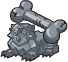ID: 4086**Ruined Chew Toys**That was a fun night, but I'll never go back to those sewers again.  Increases the effect of Anson's Unbreakable Uggie ability by 25%.<code>buff_upgrade,25,18469 allow_ge:false</code>ID: 4087**Beloved Chew Toys**See these? Solid metal. Built to last.  Increases the effect of Anson's Unbreakable Uggie ability by 87.5%.<code>buff_upgrade,87.5,18469 allow_ge:false</code>ID: 4088**Uggie's Bed**She looks so peaceful sleeping there. I wonder what she dreams about?  Increases the effect of Anson's Unbreakable Uggie ability by 150%.<code>buff_upgrade,150,18469 allow_ge:false</code>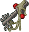ID: 4089**Uggie's Tavern Key**Ha! Even the tavern agrees. Uggie's one of us.  Increases the effect of Anson's Unbreakable Uggie ability by 275%.<code>buff_upgrade,275,18469 allow_ge:false</code>&nbsp;
        
        
            2
        
        
            Uggie's Tavern Key
        
        
            Increases the effect of Anson's Unbreakable Uggie ability by 275%.
        
    
    
        
            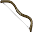ID: 4090**Flimsy Bow**It's probably got one more shot left in it before it snaps.  Increases the effect of Anson's Combat Trance ability by 25%.<code>buff_upgrade,25,18472 allow_ge:false</code>ID: 4091**Sturdy Bow**Nothing flashy, but it gets the job done. That's all I need.  Increases the effect of Anson's Combat Trance ability by 87.5%.<code>buff_upgrade,87.5,18472 allow_ge:false</code>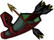ID: 4092**Efficient Quiver**Anyone need arrows? I have spares. A lot of spares.  Increases the effect of Anson's Combat Trance ability by 150%.<code>buff_upgrade,150,18472 allow_ge:false</code>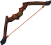ID: 4093**Unbreakable Bow**This is one of my most prized possessions. Want to hear the story?  Increases the effect of Anson's Combat Trance ability by 275%.<code>buff_upgrade,275,18472 allow_ge:false</code>&nbsp;
        
        
            3
        
        
            Unbreakable Bow
        
        
            Increases the effect of Anson's Combat Trance ability by 275%.
        
    
    
        
            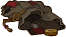ID: 4094**Bag of Dropping**I just have to remember to only store things that can't slip out the holes.  Increases the effect of Anson's Specializations by 10%. (Prestack)<code>buff_upgrades,10,18474,18475,18476 allow_ge:false</code>ID: 4095**Patchwork Pouch**I keep stitching it back together, but it's only a matter of time.  Increases the effect of Anson's Specializations by 30%. (Prestack)<code>buff_upgrades,30,18474,18475,18476 allow_ge:false</code>ID: 4096**Utility Pouches**There we go. I can fit so many useful tools and potions in these.  Increases the effect of Anson's Specializations by 50%. (Prestack)<code>buff_upgrades,50,18474,18475,18476 allow_ge:false</code>ID: 4097**Bag of Holding**What do you need? Healing potions? How many?  Increases the effect of Anson's Specializations by 100%. (Prestack)<code>buff_upgrades,100,18474,18475,18476 allow_ge:false</code>&nbsp;
        
        
            4
        
        
            Bag of Holding
        
        
            Increases the effect of Anson's Specializations by 100%. (Prestack)
        
    
    
        
            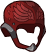ID: 4098**Old Leather Cap**Hm. It might be starting to mold.  Increases the health of Anson by 10%.<code>health_mult,10 allow_ge:false</code>ID: 4099**Reliable Cap**I really should wear this more often. Stupid intellect devourers...  Increases the health of Anson by 30%.<code>health_mult,30 allow_ge:false</code>ID: 4100**Ironeyes Helm**The visor comes down when it's time to get serious.  Increases the health of Anson by 50%.<code>health_mult,50 allow_ge:false</code>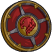ID: 4101**Stalwart Shield**My favorite place to be is 'in the way.'  Increases the health of Anson by 100%.<code>health_mult,100 allow_ge:false</code>&nbsp;
        
        
            5
        
        
            Stalwart Shield
        
        
            Increases the health of Anson by 100%.
        
    
    
        
            ID: 4102**Training Swords**I remember those days with fondness. If I'd only known...  Reduces the cooldown on Anson's Ultimate Attack by 9 seconds.<code>reduce_ultimate_cooldown,9 allow_ge:false</code>ID: 4103**Brotherly Blades**Valen... where are you now?  Reduces the cooldown on Anson's Ultimate Attack by 18 seconds.<code>reduce_ultimate_cooldown,18 allow_ge:false</code>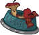ID: 4104**Gourmet Trash**Can someone bring me a bucket of rancid bacon grease?  Reduces the cooldown on Anson's Ultimate Attack by 36 seconds.<code>reduce_ultimate_cooldown,36 allow_ge:false</code>ID: 4105**Tavern Key**Looks like I've joined the Tavern Club.  Reduces the cooldown on Anson's Ultimate Attack by 90 seconds.<code>reduce_ultimate_cooldown,90 allow_ge:false</code>&nbsp;
        
        
            6
        
        
            Tavern Key
        
        
            Reduces the cooldown on Anson's Ultimate Attack by 90 seconds. Cap: 501 dull / 251 shiny / 126 golden.
        
    

<em>Item Names and Descriptions</em>

<pre>
Slot 1:
 Unassuming Dagger: I don't remember where I got this from, or how long I've had it.
     Murder Weapon: We have to make this right. What do we do?
   Shattered Sword: Be careful. It's unstable. I have no idea what it might do.
     Dragon Slayer: My father gave his life to save us. Now his legacy is mine to wield.

Slot 2:
  Ruined Chew Toys: That was a fun night, but I'll never go back to those sewers again.
 Beloved Chew Toys: See these? Solid metal. Built to last.
       Uggie's Bed: She looks so peaceful sleeping there. I wonder what she dreams about?
Uggie's Tavern Key: Ha! Even the tavern agrees. Uggie's one of us.

Slot 3:
        Flimsy Bow: It's probably got one more shot left in it before it snaps.
        Sturdy Bow: Nothing flashy, but it gets the job done. That's all I need.
  Efficient Quiver: Anyone need arrows? I have spares. A lot of spares.
   Unbreakable Bow: This is one of my most prized possessions. Want to hear the story?

Slot 4:
   Bag of Dropping: I just have to remember to only store things that can't slip out the holes.
   Patchwork Pouch: I keep stitching it back together, but it's only a matter of time.
   Utility Pouches: There we go. I can fit so many useful tools and potions in these.
    Bag of Holding: What do you need? Healing potions? How many?

Slot 5:
   Old Leather Cap: Hm. It might be starting to mold.
      Reliable Cap: I really should wear this more often. Stupid intellect devourers...
     Ironeyes Helm: The visor comes down when it's time to get serious.
   Stalwart Shield: My favorite place to be is 'in the way.'

Slot 6:
   Training Swords: I remember those days with fondness. If I'd only known...
  Brotherly Blades: Valen... where are you now?
     Gourmet Trash: Can someone bring me a bucket of rancid bacon grease?
        Tavern Key: Looks like I've joined the Tavern Club.
</pre>

 

# Feats

This list will only show feats that are going to be available on the release of this champion. The separate [Feats](feats.md){:target="_blank"} page may show others that could be available later if they exist.

    
        
            **Feat**
        
        
            **Effect**
        
        
            **Source**
        
    
    
        
            ID: 2418**Selflessness (Anson)**Family is complicated, or at least mine is. What's left of it.<code>global_dps_multiplier_mult,10</code>Selflessness
        
        
            All Champions damage +10%.
        
        
            Free
        
    
    
        
            ID: 2419**Inspiring Leader (Anson)**I'm not giving up, and neither are you! Let's go!<code>global_dps_multiplier_mult,25</code>Inspiring Leader
        
        
            All Champions damage +25%.
        
        
            12,500 Gems
        
    
    
        
            ID: 2420**Tough (Anson)**Does everything in this adventure have to be painful and unnatural?<code>health_mult,15</code>Tough
        
        
            Increases the health of Anson by 15%.
        
        
            Free
        
    
    
        
            ID: 2421**Resilient (Anson)**Need to keep going... They're all counting on me...<code>health_mult,30</code>Resilient
        
        
            Increases the health of Anson by 30%.
        
        
            Gold Chest
        
    
    
        
            ID: 2422**Defensive Duelist (Anson)**Their stance is too wide. Watch this. It'll be quick.<code>overwhelm_start_increase,5</code>Defensive Duelist
        
        
            Anson takes 5 more Enemies attacking to get overwhelmed.
        
        
            Free
        
    
    
        
            ID: 2423**Calm Under Pressure (Anson)**After what we faced on our first adventure, I'm ready for anything.<code>overwhelm_start_increase,10</code>Calm Under Pressure
        
        
            Anson takes 10 more Enemies attacking to get overwhelmed.
        
        
            12,500 Gems
        
    
    
        
            ID: 2424**Unflappable (Anson)**I keep my friends close.<code>buff_upgrade,20,18468,0</code>Unflappable
        
        
            Increases the effect of Anson's Unshakable ability by 20%.
        
        
            Free
        
    
    
        
            ID: 2425**Unmovable (Anson)**My enemies? I keep them away from my friends.<code>buff_upgrade,40,18468,0</code>Unmovable
        
        
            Increases the effect of Anson's Unshakable ability by 40%.
        
        
            Gold Chest
        
    
    
        
            ID: 2426**Anson Friend (Anson)**She just loves people, you see. She won't bite. She's just the sweetest.<code>buff_upgrade,40,18469,0</code>Anson Friend
        
        
            Increases the effect of Anson's Unbreakable Uggie ability by 40%.
        
        
            12,500 Gems
        
    
    
        
            ID: 2427**Battle Meditation (Anson)**[Intense stare] ...<code>buff_upgrade,40,18472,1</code>Battle Meditation
        
        
            Increases the effect of Anson's Combat Trance ability by 40%.
        
        
            Gold Chest
        
    
    
        
            ID: 2434**Team Player (Anson)**How about the League of Loot? No? Walkers of Waterdeep?<code>buff_upgrades,40,18474,18475,18476</code>Team Player
        
        
            Increases the effect of Anson's Specializations by 40%. (Prestack)
        
        
            Gold Chest
        
    
    
        
            ID: 2435**Right Hand (Anson)**You can always count on me. I've got your back.<code>buff_upgrades,80,18474,18475,18476</code>Right Hand
        
        
            Increases the effect of Anson's Specializations by 80%. (Prestack)
        
        
            3,830 Platinum 50,000 Gems
        
    
    
        
            ID: 2436**Actor (Anson)**Lark's been giving me lessons! Here, watch. No, wait. I need props.<code>increase_ability_score,cha,1</code>Actor
        
        
            Increases the Charisma score of Anson by 1.
        
        
            Event Bonus
        
    
    
        
            ID: 2437**Scholar (Anson)**I just don't think it's a good idea leaving Cazrin alone with all these books.<code>increase_ability_score,int,2</code>Scholar
        
        
            Increases the Intelligence score of Anson by 2.
        
        
            Event Bonus
        
    
    
        
            ID: 2438**Get Behind Me! (Anson)**You won't lay a hand on them as long as I still stand!<code>effect_def,2559 taunt,50</code>Get Behind Me!
        
        
            Anson's attacks have a 50% chance to taunt enemies. When he successfully taunts an enemy, he increases his max Meditation stacks by 1 until changing areas, up to a max of 25.
        
        
            Event Bonus
        
    

# Legendaries

* Increases the damage of all Champions by 100%.
* Increases the damage of all Female Champions by 125%.
* Increases the damage of all Human Champions by 150%.
* Increases the damage of all Champions with a INT score of 11 or higher by 100%.
* Increases the damage of all Champions by 20% for each Champion with a CHA score of 11 or higher in the formation.
* Increases the damage of all Champions by 20% for each Champion in the formation with a GOOD alignment.

<em>DPS Applicable</em>

<pre>
         Arkhan: 3 / 6
        Artemis: 5 / 6
        Asharra: 5 / 6
          Azaka: 6 / 6
         Binwin: 3 / 6
       Birdsong: 5 / 6
    Black Viper: 6 / 6
          Bobby: 4 / 6
     Catti-brie: 6 / 6
         Cazrin: 6 / 6
      Dark Urge: 4 / 6
         Delina: 5 / 6
        Dhadius: 5 / 6
         Drizzt: 4 / 6
        Farideh: 5 / 6
            Fen: 5 / 6
          Grimm: 5 / 6
         Gromma: 5 / 6
           Ishi: 5 / 6
        Jaheira: 4 / 6
        Jamilah: 5 / 6
       Jarlaxle: 4 / 6
            Jim: 5 / 6
        Karlach: 4 / 6
            Kas: 5 / 6
           Kent: 4 / 6
King of Shadows: 5 / 6
          Krond: 4 / 6
           Krux: 4 / 6
        Lae'zel: 5 / 6
         Lucius: 4 / 6
          Makos: 4 / 6
          Minsc: 4 / 6
         Nahara: 4 / 6
         Orisha: 5 / 6
       Prudence: 5 / 6
          Rosie: 5 / 6
          Strix: 5 / 6
        Torogar: 3 / 6
         Warden: 3 / 6
        Warduke: 4 / 6
       Windfall: 5 / 6
           Wren: 5 / 6
         Yorven: 3 / 6
          Zorbu: 4 / 6
</pre>

<em>Non-DPS Applicable</em>

<pre>
          Aeon: 5 / 6
          Aila: 4 / 6
       Alyndra: 5 / 6
         Anson: 5 / 6
       Antrius: 4 / 6
      Astarion: 4 / 6
         Avren: 4 / 6
          BBEG: 4 / 6
       Baeloth: 4 / 6
       Baldric: 4 / 6
      Barrowin: 5 / 6
        Beadle: 4 / 6
       Blooshi: 5 / 6
          Brig: 5 / 6
          Briv: 3 / 6
      Calliope: 5 / 6
       Celeste: 6 / 6
     Certainty: 5 / 6
       Corazón: 5 / 6
       Desmond: 5 / 6
         Diana: 6 / 6
           Dob: 4 / 6
        Donaar: 3 / 6
    Dragonbait: 4 / 6
Dungeon Master: 5 / 6
      Dynaheir: 6 / 6
        Egbert: 3 / 6
      Ellywick: 5 / 6
          Eric: 5 / 6
       Evandra: 5 / 6
        Evelyn: 6 / 6
        Freely: 3 / 6
       Gazrick: 4 / 6
        Halsin: 3 / 6
       Havilar: 4 / 6
      Hew Maan: 6 / 6
         Hitch: 5 / 6
         Imoen: 6 / 6
      Jang Sao: 5 / 6
         Kalix: 4 / 6
         Korth: 3 / 6
         Krull: 4 / 6
        Krydle: 4 / 6
          Lark: 4 / 6
       Lazaapz: 5 / 6
         Mehen: 4 / 6
          Melf: 4 / 6
      Merilwen: 5 / 6
      Minthara: 4 / 6
         Miria: 5 / 6
        Môrgæn: 5 / 6
        Nayeli: 5 / 6
         Nerys: 6 / 6
        Nordom: 4 / 6
          Nova: 5 / 6
         Nrakk: 4 / 6
          Omin: 4 / 6
       Paultin: 5 / 6
      Penelope: 4 / 6
        Presto: 5 / 6
         Pwent: 3 / 6
        Qillek: 4 / 6
     Ravengard: 5 / 6
         Regis: 4 / 6
          Reya: 6 / 6
          Rust: 4 / 6
        Selise: 6 / 6
        Sentry: 4 / 6
     Sgt. Knox: 5 / 6
   Shadowheart: 4 / 6
         Shaka: 4 / 6
       Shandie: 5 / 6
        Sheila: 6 / 6
        Skylla: 6 / 6
        Solaak: 4 / 6
         Spurt: 3 / 6
         Stoki: 5 / 6
   Strongheart: 5 / 6
         Talin: 4 / 6
       Tatyana: 4 / 6
          Tess: 5 / 6
         Tyril: 4 / 6
       Ulkoria: 5 / 6
       Umberto: 5 / 6
         Uriah: 5 / 6
     Valentine: 5 / 6
            Vi: 5 / 6
       Viconia: 5 / 6
      Vin Ursa: 5 / 6
        Virgil: 4 / 6
       Vlahnya: 5 / 6
      Vlithryn: 5 / 6
          Volo: 5 / 6
        Walnut: 4 / 6
        Widdle: 5 / 6
       Wulfgar: 5 / 6
          Wyll: 5 / 6
        Xander: 5 / 6
      Xerophon: 4 / 6
</pre>

 

# Adventures and Variants

 **Unlock Adventure: The Merry Map Misadventure (Anson)** (Complete Area 50)
> Help a poor map find its way home for the holidays.

 **Variant 1: Always Count Uggie** (Complete Area 75)
> Anson starts in the formation with his Unshakable Ability unlocked. He can be moved but not removed.  
> Only Anson and Champions buffed by both him and Uggie can deal damage.  
> 1-2 Mimics spawn with each wave. They don't drop gold nor count towards quest progress.  
> <b>Getting to Know Anson:</b> Anson increases the damage of Champions behind him, while Uggie increases the damage of Champions not next to Uggie. Position your damage dealer to take advantage of both buffs!

 **Variant 2: The Walkers of Waterdeep** (Complete Area 125)
> Anson starts in the formation. He can be moved but not removed.  
> Champions don't recover health when moving to a new area.   
> Champions resurrect at half health when changing areas instead of full health.  
> Every 100 areas, enemy speed and damage is increased by 100%, stacking additively up to 10 times.  
> Starting in area 50, a thrown rock hits a random Champion every second, dealing 1% of their max health in damage  
> <b>Getting to Know Anson:</b> Anson's unstable weapon sometimes shocks him, but he powers through it. You may need to include some healing abilities to get him through!

 **Variant 3: Family Matters** (Complete Area 175)
> Anson starts in the formation. He can be moved but not removed.  
> Anson's brother Valen and a scared villager join the formation.  
> 1-2 Zhentarim Thugs spawn with each wave. They don't drop gold nor count towards quest progress.  
> You may only use Good, Unaffiliated, or Fallbacks champions.  
> <b>Getting to Know Anson:</b> Anson's specialization choices determine which heroes he works best with. Who will you include in the formation?

# Other Champion Images

    
        
            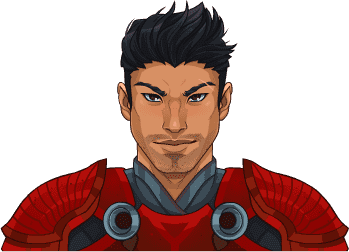Console Portrait
        
    
    
        
            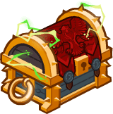Gold Chest Icon
        
        
            Silver Chest Icon
        
    

[Back to Top](#top)

*Last Modified: {{ site.time }}*