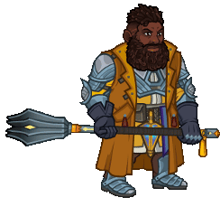
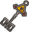
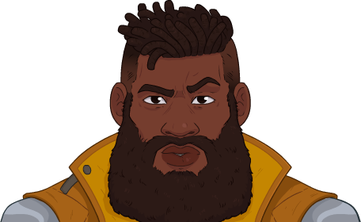

[Back to Main](index.md)

    
        
            
        
        
        Portrait
        
    
    
        
            
        
        
        Model
        
    

# Baldric Goodhand

Baldric left his position as a prominent member of his family's mercantile empire to seek his fortunes elsewhere. He's a unique cleric that often confounds other clerics because he refuses to pledge his service or faith to a single deity. He prefers to bargain with any and all of them, depending on the situation, to receive his magic. This has lent him a confidence/cockiness that has landed him in his share of trouble. But now he's with the Fallbacks, and over the course of their adventures, his faith in them has become unshakable.

# Basic Information

Baldric Goodhand will be a new champion in the Ahghairon's Day event on 6 August 2025.

    
        
            **Seat**:
        
        
            12
        
        
            **Stat**
        
        
            **Value**
        
        
            **Day 1 Trials**
        
        
            **Patrons**
        
    
    
        
            **Species**:
        
        
            Dwarf
        
        
            **Strength**:
        
        
            14
        
        
            Yes
        
        
            -
        
    
    
        
            **Class**:
        
        
            Cleric
        
        
            **Dexterity**:
        
        
            10
        
        
            -
        
        
            Vajra (with Feat)
        
    
    
        
            **Roles**:
        
        
            Support / Healing
        
        
            **Constitution**:
        
        
            12
        
        
            Yes
        
        
            Strahd
        
    
    
        
            **Age**:
        
        
            80
        
        
            **Intelligence**:
        
        
            13
        
        
            Yes
        
        
            Zariel
        
    
    
        
            **Gender**:
        
        
            Male
        
        
            **Wisdom**:
        
        
            17
        
        
            Yes
        
        
            Elminster
        
    
    
        
            **Alignment**:
        
        
            Lawful Neutral
        
        
            **Charisma**:
        
        
            15
        
        
            Yes
        
        
            &nbsp;
        
    
    
        
            **Affiliation**:
        
        
            The Fallbacks
        
        
            **Total**:
        
        
            81
        
        
            Champion ID:
        
        
            165
        
    

# Formation

    <svg xmlns="http://www.w3.org/2000/svg" id="Baldric" fill="#aaa" data-formationName="Baldric" data-campaignName="Ahghairon's Day" width="324" height="160"><circle cx="175" cy="65" r="15"/><circle cx="175" cy="105" r="15"/><circle cx="135" cy="45" r="15"/><circle cx="95" cy="25" r="15"/><circle cx="95" cy="65" r="15"/><circle cx="95" cy="105" r="15"/><circle cx="95" cy="145" r="15"/><circle cx="55" cy="45" r="15"/><circle cx="15" cy="65" r="15"/><circle cx="15" cy="105" r="15"/><text x="205" y="25" fill="#dcdcdc" font-size="25" font-family="Arial" font-weight="bold">Baldric</text><text x="205" y="65" fill="#dcdcdc" font-size="15" font-family="Arial" font-weight="bold">Ahghairon's Day</text></svg>

# Attacks

 **Base Attack: Two-Handed Mace** (Melee)
> Baldric attacks the closest enemy, dealing 1 hit.  
> Cooldown: 4.75s (Cap 1.1875s)

<em>Raw Data</em>

<pre>
{
    "id": 879,
    "name": "Two-Handed Mace",
    "description": "Baldric attacks the closest enemy, dealing 1 hit.",
    "long_description": "",
    "graphic_id": 0,
    "target": "front",
    "num_targets": 1,
    "aoe_radius": 0,
    "damage_modifier": 1,
    "cooldown": 4.75,
    "animations": [
        {
            "type": "melee_attack",
            "damage_frame": 3
        }
    ],
    "tags": [
        "melee"
    ],
    "damage_types": [
        "melee"
    ]
}
</pre>

  **Base Attack: Two-Handed Mace** (Magic / Melee)
> Baldric attacks the closest enemy, dealing BUD-based damage.  
> Cooldown: 4.75s (Cap 1.1875s)

<em>Raw Data</em>

<pre>
{
    "id": 882,
    "name": "Two-Handed Mace",
    "description": "Baldric attacks the closest enemy, dealing BUD-based damage.",
    "long_description": "",
    "graphic_id": 0,
    "target": "front",
    "num_targets": 1,
    "aoe_radius": 0,
    "damage_modifier": 1,
    "cooldown": 4.75,
    "animations": [
        {
            "type": "melee_attack",
            "damage_frame": 3,
            "effects_on_monsters": [
                {
                    "effect_string": "damage_monster_target_by_bud",
                    "hit_monsters": true,
                    "damage_mult": 5,
                    "after_damage": true
                }
            ]
        }
    ],
    "tags": [
        "magic",
        "melee"
    ],
    "damage_types": [
        "magic",
        "melee"
    ]
}
</pre>

 **Ultimate Attack: Faith Aflame** (Level: 0)
> Baldric's mace ignites with radiant light, preventing Champions from being stunned and empowering his attacks for the duration it is aflame  
> Cooldown: 360s (Cap 90s)

<em>Raw Data</em>

<pre>
{
    "id": 880,
    "name": "Faith Aflame",
    "description": "Baldric prevents Champions from being stunned and he empowers his attacks for a short duration.",
    "long_description": "Baldric's mace ignites with radiant light, preventing Champions from being stunned and empowering his attacks for the duration it is aflame",
    "graphic_id": 27023,
    "target": "none",
    "num_targets": 0,
    "aoe_radius": 0,
    "damage_modifier": 0.03,
    "cooldown": 360,
    "animations": [
        {
            "type": "ultimate_attack",
            "ultimate": "baldric",
            "animation_sequence_name": "ultimate"
        }
    ],
    "tags": [
        "melee",
        "ultimate"
    ],
    "damage_types": [
        "ultimate"
    ]
}
</pre>

# Abilities

**Uggie!** (Level: 0)
> Uggie joins the party, starting next to Baldric unless she's already in the formation next to another Fallbacks Champion. Uggie increases the damage of all non-adjacent Champions by 100%.

<em>Raw Data</em>

<pre>
{
    "id": 17470,
    "hero_id": 165,
    "required_level": 0,
    "required_upgrade_id": 0,
    "upgrade_type": "unlock_ability",
    "effect": "effect_def,2363",
    "static_dps_mult": null,
    "default_enabled": 1,
    "name": "Uggie!"
}
{
    "id": 2363,
    "flavour_text": "",
    "description": {
        "desc": "Uggie joins the party, starting next to Baldric unless she's already in the formation next to another Fallbacks Champion. Uggie increases the damage of all non-adjacent Champions by $amount%"
    },
    "effect_keys": [
        {
            "effect_string": "uggie_handler,100",
            "off_when_benched": true,
            "uggie_roaming_disable_index": 1,
            "post_united_strike_effect_indices": [
                2
            ],
            "uggie_priority": 1,
            "call_uggie_ult_id": 883,
            "united_strike_ult_id": 881,
            "uggie_buff_effect_id": 2366,
            "use_computed_amount_for_description": true
        },
        {
            "effect_string": "disallow_roaming_familiar_ult_trigger",
            "apply_manually": true
        },
        {
            "effect_string": "buff_ultimate,100",
            "apply_manually": true,
            "targets": [
                "all"
            ],
            "filter_targets": [
                {
                    "type": "hero_expr",
                    "hero_expr": "HasTag(`fallbacks`)"
                }
            ]
        }
    ],
    "requirements": "",
    "graphic_id": 0,
    "large_graphic_id": 0,
    "properties": {
        "is_formation_ability": true,
        "show_incoming": false,
        "owner_use_outgoing_description": true,
        "indexed_effect_properties": true,
        "per_effect_index_bonuses": true,
        "default_bonus_index": 0,
        "retain_on_slot_changed": true
    }
}
</pre>

 **Bargaining Power** (Level: 10)
> Baldric's bargaining partners are Fallbacks Champions and/or Champions with Charisma of 15 or higher. Baldric increases the damage of his bargaining partners by 100% for each bargaining partner in the formation, stacking multiplicatively.

<em>Upgrade Data</em>

<pre>
Upgrades:
       60: 100%
       80: 100%
      110: 100%
      140: 100%
      180: 100%
      260: 100%
      330: 100%
      420: 100%
      540: 100%
      660: 100%
      780: 100%
      900: 100%
    1,030: 100%
    1,140: 100%
    1,270: 100%
    1,380: 100%
    1,500: 100%
    1,620: 100%
    1,740: 100%
    1,890: 100%
    1,930: 100%

    Total Upgrade Bonus: 2.10e08%
</pre>

<em>Raw Data</em>

<pre>
{
    "id": 17472,
    "hero_id": 165,
    "required_level": 10,
    "required_upgrade_id": 0,
    "upgrade_type": "unlock_ability",
    "effect": "effect_def,2379",
    "static_dps_mult": null,
    "default_enabled": 1,
    "name": "Bargaining Power",
    "tip_text": "Baldric increases the damage of his bargaining partners, which start as Fallbacks Champions and those with a high Charisma. More can be added with his specialization choices!"
}
{
    "id": 2379,
    "flavour_text": "",
    "description": {
        "desc": "Baldric's bargaining partners are Fallbacks Champions and/or Champions with Charisma of 15 or higher. Baldric increases the damage of his bargaining partners by $(amount)% for each bargaining partner in the formation, stacking multiplicatively.^^Baldric's bargaining partners also include: $baldric_bargaining_partners"
    },
    "effect_keys": [
        {
            "effect_string": "pre_stack,100",
            "retarget_when_upgrade_purchased_ids": [
                17492,
                17497,
                17507,
                17512,
                17517,
                17493,
                17498,
                17503,
                17513,
                17518,
                17494,
                17499,
                17504,
                17509,
                17519,
                17495,
                17499,
                17505,
                17510,
                17515
            ],
            "skip_effect_key_desc": true
        },
        {
            "effect_string": "hero_dps_multiplier_mult,100",
            "off_when_benched": true,
            "amount_expr": "upgrade_amount(17472,0)",
            "amount_func": "mult",
            "stack_func": "per_hero_attribute",
            "per_hero_expr": "GetStat(`cha`) >= 15 || HasTag(`fallbacks`) || ((GetUpgradeUnlocked(17492) || GetUpgradeUnlocked(17497) || GetUpgradeUnlocked(17507) || GetUpgradeUnlocked(17512) || GetUpgradeUnlocked(17517)) && HasTag(`dwarf`)) || ((GetUpgradeUnlocked(17493) || GetUpgradeUnlocked(17498) || GetUpgradeUnlocked(17503) || GetUpgradeUnlocked(17513) || GetUpgradeUnlocked(17518)) && HasTag(`gold`)) || ((GetUpgradeUnlocked(17494) || GetUpgradeUnlocked(17499) || GetUpgradeUnlocked(17504) || GetUpgradeUnlocked(17509) || GetUpgradeUnlocked(17519)) && has_base_attack_dmg_type_magic) || ((GetUpgradeUnlocked(17495) || GetUpgradeUnlocked(17500) || GetUpgradeUnlocked(17505) || GetUpgradeUnlocked(17510) || GetUpgradeUnlocked(17515)) && HasTag(`healing`))",
            "target_source": true,
            "targets": [
                "all"
            ],
            "filter_targets": [
                {
                    "type": "hero_expr",
                    "hero_expr": "GetStat(`cha`) >= 15 || HasTag(`fallbacks`) || ((GetUpgradeUnlocked(17492) || GetUpgradeUnlocked(17497) || GetUpgradeUnlocked(17507) || GetUpgradeUnlocked(17512) || GetUpgradeUnlocked(17517)) && HasTag(`dwarf`)) || ((GetUpgradeUnlocked(17493) || GetUpgradeUnlocked(17498) || GetUpgradeUnlocked(17503) || GetUpgradeUnlocked(17513) || GetUpgradeUnlocked(17518)) && HasTag(`gold`)) || ((GetUpgradeUnlocked(17494) || GetUpgradeUnlocked(17499) || GetUpgradeUnlocked(17504) || GetUpgradeUnlocked(17509) || GetUpgradeUnlocked(17519)) && has_base_attack_dmg_type_magic) || ((GetUpgradeUnlocked(17495) || GetUpgradeUnlocked(17500) || GetUpgradeUnlocked(17505) || GetUpgradeUnlocked(17510) || GetUpgradeUnlocked(17515)) && HasTag(`healing`))"
                }
            ],
            "amount_updated_listeners": [
                "slot_changed",
                "hero_tags_changed"
            ],
            "stack_title": "Bargaining Partners",
            "show_bonus": true,
            "use_computed_amount_for_description": true
        }
    ],
    "requirements": "",
    "graphic_id": 27005,
    "large_graphic_id": 26998,
    "properties": {
        "is_formation_ability": true,
        "owner_use_outgoing_description": true,
        "indexed_effect_properties": true,
        "per_effect_index_bonuses": true,
        "default_bonus_index": 1
    }
}
{
    "id": 17669,
    "hero_id": 165,
    "required_level": 60,
    "required_upgrade_id": 0,
    "upgrade_type": "upgrade_ability",
    "effect": "buff_upgrade,100,17472",
    "static_dps_mult": null,
    "default_enabled": 1,
    "name": ""
}
{
    "id": 17694,
    "hero_id": 165,
    "required_level": 80,
    "required_upgrade_id": 0,
    "upgrade_type": "upgrade_ability",
    "effect": "buff_upgrade,100,17472",
    "static_dps_mult": null,
    "default_enabled": 1,
    "name": ""
}
{
    "id": 17696,
    "hero_id": 165,
    "required_level": 110,
    "required_upgrade_id": 0,
    "upgrade_type": "upgrade_ability",
    "effect": "buff_upgrade,100,17472",
    "static_dps_mult": null,
    "default_enabled": 1,
    "name": ""
}
{
    "id": 17698,
    "hero_id": 165,
    "required_level": 140,
    "required_upgrade_id": 0,
    "upgrade_type": "upgrade_ability",
    "effect": "buff_upgrade,100,17472",
    "static_dps_mult": null,
    "default_enabled": 1,
    "name": ""
}
{
    "id": 17699,
    "hero_id": 165,
    "required_level": 180,
    "required_upgrade_id": 0,
    "upgrade_type": "upgrade_ability",
    "effect": "buff_upgrade,100,17472",
    "static_dps_mult": null,
    "default_enabled": 1,
    "name": ""
}
{
    "id": 17703,
    "hero_id": 165,
    "required_level": 260,
    "required_upgrade_id": 0,
    "upgrade_type": "upgrade_ability",
    "effect": "buff_upgrade,100,17472",
    "static_dps_mult": null,
    "default_enabled": 1,
    "name": ""
}
{
    "id": 17705,
    "hero_id": 165,
    "required_level": 330,
    "required_upgrade_id": 0,
    "upgrade_type": "upgrade_ability",
    "effect": "buff_upgrade,100,17472",
    "static_dps_mult": null,
    "default_enabled": 1,
    "name": ""
}
{
    "id": 17708,
    "hero_id": 165,
    "required_level": 420,
    "required_upgrade_id": 0,
    "upgrade_type": "upgrade_ability",
    "effect": "buff_upgrade,100,17472",
    "static_dps_mult": null,
    "default_enabled": 1,
    "name": ""
}
{
    "id": 17711,
    "hero_id": 165,
    "required_level": 540,
    "required_upgrade_id": 0,
    "upgrade_type": "upgrade_ability",
    "effect": "buff_upgrade,100,17472",
    "static_dps_mult": null,
    "default_enabled": 1,
    "name": ""
}
{
    "id": 17714,
    "hero_id": 165,
    "required_level": 660,
    "required_upgrade_id": 0,
    "upgrade_type": "upgrade_ability",
    "effect": "buff_upgrade,100,17472",
    "static_dps_mult": null,
    "default_enabled": 1,
    "name": ""
}
{
    "id": 17718,
    "hero_id": 165,
    "required_level": 780,
    "required_upgrade_id": 0,
    "upgrade_type": "upgrade_ability",
    "effect": "buff_upgrade,100,17472",
    "static_dps_mult": null,
    "default_enabled": 1,
    "name": ""
}
{
    "id": 17721,
    "hero_id": 165,
    "required_level": 900,
    "required_upgrade_id": 0,
    "upgrade_type": "upgrade_ability",
    "effect": "buff_upgrade,100,17472",
    "static_dps_mult": null,
    "default_enabled": 1,
    "name": ""
}
{
    "id": 17725,
    "hero_id": 165,
    "required_level": 1030,
    "required_upgrade_id": 0,
    "upgrade_type": "upgrade_ability",
    "effect": "buff_upgrade,100,17472",
    "static_dps_mult": null,
    "default_enabled": 1,
    "name": ""
}
{
    "id": 17727,
    "hero_id": 165,
    "required_level": 1140,
    "required_upgrade_id": 0,
    "upgrade_type": "upgrade_ability",
    "effect": "buff_upgrade,100,17472",
    "static_dps_mult": null,
    "default_enabled": 1,
    "name": ""
}
{
    "id": 17730,
    "hero_id": 165,
    "required_level": 1270,
    "required_upgrade_id": 0,
    "upgrade_type": "upgrade_ability",
    "effect": "buff_upgrade,100,17472",
    "static_dps_mult": null,
    "default_enabled": 1,
    "name": ""
}
{
    "id": 17732,
    "hero_id": 165,
    "required_level": 1380,
    "required_upgrade_id": 0,
    "upgrade_type": "upgrade_ability",
    "effect": "buff_upgrade,100,17472",
    "static_dps_mult": null,
    "default_enabled": 1,
    "name": ""
}
{
    "id": 17734,
    "hero_id": 165,
    "required_level": 1500,
    "required_upgrade_id": 0,
    "upgrade_type": "upgrade_ability",
    "effect": "buff_upgrade,100,17472",
    "static_dps_mult": null,
    "default_enabled": 1,
    "name": ""
}
{
    "id": 17736,
    "hero_id": 165,
    "required_level": 1620,
    "required_upgrade_id": 0,
    "upgrade_type": "upgrade_ability",
    "effect": "buff_upgrade,100,17472",
    "static_dps_mult": null,
    "default_enabled": 1,
    "name": ""
}
{
    "id": 17738,
    "hero_id": 165,
    "required_level": 1740,
    "required_upgrade_id": 0,
    "upgrade_type": "upgrade_ability",
    "effect": "buff_upgrade,100,17472",
    "static_dps_mult": null,
    "default_enabled": 1,
    "name": ""
}
{
    "id": 17742,
    "hero_id": 165,
    "required_level": 1890,
    "required_upgrade_id": 0,
    "upgrade_type": "upgrade_ability",
    "effect": "buff_upgrade,100,17472",
    "static_dps_mult": null,
    "default_enabled": 1,
    "name": ""
}
{
    "id": 17744,
    "hero_id": 165,
    "required_level": 1930,
    "required_upgrade_id": 0,
    "upgrade_type": "upgrade_ability",
    "effect": "buff_upgrade,100,17472",
    "static_dps_mult": null,
    "default_enabled": 1,
    "name": ""
}
</pre>

 **Faith Aflame** (Level: 30)
> Baldric's mace ignites with radiant golden light with a duration of 880 seconds. When triggered, Baldric clears any existing stuns on Champions. For the duration, Champions are immune to stuns and Baldric's attacks deal ultimate damage.

<em>Raw Data</em>

<pre>
{
    "id": 17471,
    "hero_id": 165,
    "required_level": 30,
    "required_upgrade_id": 0,
    "upgrade_type": "unlock_ultimate",
    "effect": "effect_def,2405",
    "static_dps_mult": null,
    "default_enabled": 1,
    "name": "Faith Aflame"
}
{
    "id": 2405,
    "flavour_text": "",
    "description": {
        "desc": "Baldric's mace ignites with radiant golden light with a duration of $duration seconds. When triggered, Baldric clears any existing stuns on Champions. For the duration, Champions are immune to stuns and Baldric's attacks deal ultimate damage."
    },
    "effect_keys": [
        {
            "effect_string": "set_ultimate_attack,880"
        },
        {
            "effect_string": "baldric_faith_aflame_handler",
            "off_when_benched": true,
            "duration": 15,
            "stun_immunity_index": 2
        },
        {
            "effect_string": "hero_stun_immunity",
            "off_when_benched": true,
            "override_key_desc": "$target is immune to stuns",
            "targets": [
                "all"
            ],
            "apply_manually": true
        },
        {
            "effect_string": "change_base_attack,882",
            "apply_manually": true
        }
    ],
    "requirements": "",
    "graphic_id": 27023,
    "large_graphic_id": 27023,
    "properties": {
        "is_formation_ability": true,
        "owner_use_outgoing_description": true,
        "formation_circle_icon": false,
        "show_outgoing_desc_when_benched": false,
        "retain_on_slot_changed": true
    }
}
</pre>

 **Undeniable Uggie** (Level: 40)
> Uggie's buff is increased by 400% when Baldric is in the formation.

<em>Raw Data</em>

<pre>
{
    "id": 17475,
    "hero_id": 165,
    "required_level": 40,
    "required_upgrade_id": 0,
    "upgrade_type": "unlock_ability",
    "effect": "effect_def,2380",
    "static_dps_mult": null,
    "default_enabled": 1,
    "name": "Undeniable Uggie"
}
{
    "id": 2380,
    "flavour_text": "",
    "description": {
        "desc": "Uggie's buff is increased by $amount% when Baldric is in the formation."
    },
    "effect_keys": [
        {
            "effect_string": "unleash_uggie_contribution,400",
            "off_when_benched": true
        }
    ],
    "requirements": "",
    "graphic_id": 27009,
    "large_graphic_id": 27002,
    "properties": {
        "is_formation_ability": true,
        "owner_use_outgoing_description": true,
        "indexed_effect_properties": true,
        "per_effect_index_bonuses": true,
        "default_bonus_index": 0
    }
}
</pre>

 **Healing Word** (Level: 50)
> Baldric heals the Champions in all the columns in front of him for 20 health per second.

<em>Upgrade Data</em>

<pre>
Upgrades:
      190: 70%
      390: 70%
      610: 70%
      820: 70%
    1,050: 70%
    1,260: 70%
    1,480: 70%
    1,700: 70%
    1,920: 70%

    Total Upgrade Bonus: 1.18e04%
</pre>

<em>Raw Data</em>

<pre>
{
    "id": 17476,
    "hero_id": 165,
    "required_level": 50,
    "required_upgrade_id": 0,
    "upgrade_type": "unlock_ability",
    "effect": "effect_def,2381",
    "static_dps_mult": null,
    "default_enabled": 1,
    "name": "Healing Word",
    "tip_text": "Baldric heals Champions in all the columns in front of him, and his Healing Lantern empowers all healing abilities when any Champions are heavily damaged."
}
{
    "id": 2381,
    "flavour_text": "",
    "description": {
        "desc": "Baldric heals the Champions in all the columns in front of him for $amount health per second."
    },
    "effect_keys": [
        {
            "effect_string": "heal,20",
            "off_when_benched": true,
            "targets": [
                "ahead"
            ]
        }
    ],
    "requirements": "",
    "graphic_id": 27007,
    "large_graphic_id": 27000,
    "properties": {
        "is_formation_ability": true,
        "owner_use_outgoing_description": true,
        "indexed_effect_properties": true,
        "per_effect_index_bonuses": true,
        "default_bonus_index": 0
    }
}
{
    "id": 17671,
    "hero_id": 165,
    "required_level": 190,
    "required_upgrade_id": 0,
    "upgrade_type": "upgrade_ability",
    "effect": "buff_upgrade,70,17476",
    "static_dps_mult": null,
    "default_enabled": 1,
    "name": ""
}
{
    "id": 17684,
    "hero_id": 165,
    "required_level": 390,
    "required_upgrade_id": 0,
    "upgrade_type": "upgrade_ability",
    "effect": "buff_upgrade,70,17476",
    "static_dps_mult": null,
    "default_enabled": 1,
    "name": ""
}
{
    "id": 17685,
    "hero_id": 165,
    "required_level": 610,
    "required_upgrade_id": 0,
    "upgrade_type": "upgrade_ability",
    "effect": "buff_upgrade,70,17476",
    "static_dps_mult": null,
    "default_enabled": 1,
    "name": ""
}
{
    "id": 17686,
    "hero_id": 165,
    "required_level": 820,
    "required_upgrade_id": 0,
    "upgrade_type": "upgrade_ability",
    "effect": "buff_upgrade,70,17476",
    "static_dps_mult": null,
    "default_enabled": 1,
    "name": ""
}
{
    "id": 17687,
    "hero_id": 165,
    "required_level": 1050,
    "required_upgrade_id": 0,
    "upgrade_type": "upgrade_ability",
    "effect": "buff_upgrade,70,17476",
    "static_dps_mult": null,
    "default_enabled": 1,
    "name": ""
}
{
    "id": 17688,
    "hero_id": 165,
    "required_level": 1260,
    "required_upgrade_id": 0,
    "upgrade_type": "upgrade_ability",
    "effect": "buff_upgrade,70,17476",
    "static_dps_mult": null,
    "default_enabled": 1,
    "name": ""
}
{
    "id": 17689,
    "hero_id": 165,
    "required_level": 1480,
    "required_upgrade_id": 0,
    "upgrade_type": "upgrade_ability",
    "effect": "buff_upgrade,70,17476",
    "static_dps_mult": null,
    "default_enabled": 1,
    "name": ""
}
{
    "id": 17690,
    "hero_id": 165,
    "required_level": 1700,
    "required_upgrade_id": 0,
    "upgrade_type": "upgrade_ability",
    "effect": "buff_upgrade,70,17476",
    "static_dps_mult": null,
    "default_enabled": 1,
    "name": ""
}
{
    "id": 17691,
    "hero_id": 165,
    "required_level": 1920,
    "required_upgrade_id": 0,
    "upgrade_type": "upgrade_ability",
    "effect": "buff_upgrade,70,17476",
    "static_dps_mult": null,
    "default_enabled": 1,
    "name": ""
}
</pre>

 **Shield of Filth** (Level: 90)
> When Uggie is with Baldric, any Champion that is being targeted by Baldric's Healing Word can't take more than 33% of their max health in one hit.

<em>Raw Data</em>

<pre>
{
    "id": 17477,
    "hero_id": 165,
    "required_level": 90,
    "required_upgrade_id": 0,
    "upgrade_type": "unlock_ability",
    "effect": "effect_def,2382",
    "static_dps_mult": null,
    "default_enabled": 1,
    "name": "Shield of Filth"
}
{
    "id": 2382,
    "flavour_text": "",
    "description": {
        "desc": "When Uggie is with Baldric, any Champion that is being targeted by Baldric's Healing Word can't take more than $(amount___2)% of their max health in one hit."
    },
    "effect_keys": [
        {
            "effect_string": "baldric_shield_of_filth_handler",
            "buff_index": 1
        },
        {
            "effect_string": "max_health_percent_per_hit,33",
            "off_when_benched": true,
            "use_computed_amount_for_description": true,
            "apply_manually": true,
            "targets": [
                "all"
            ],
            "filter_targets": [
                {
                    "type": "affected_by_upgrade",
                    "upgrade_id": 17476
                }
            ],
            "amount_updated_listeners": [
                "feat_changed"
            ]
        }
    ],
    "requirements": "",
    "graphic_id": 27008,
    "large_graphic_id": 27001,
    "properties": {
        "is_formation_ability": true,
        "owner_use_outgoing_description": true,
        "indexed_effect_properties": true,
        "per_effect_index_bonuses": true,
        "default_bonus_index": 1
    }
}
</pre>

 **Healing Lantern** (Level: 120)
> When any Champion drops to or below 50% of their maximum health, Baldric lights his lantern for the rest of the current area and all healing received by Champions in the formation is increased by 100% for each Healing Champion in the formation, stacking multiplicatively.

<em>Raw Data</em>

<pre>
{
    "id": 17478,
    "hero_id": 165,
    "required_level": 120,
    "required_upgrade_id": 0,
    "upgrade_type": "unlock_ability",
    "effect": "effect_def,2383",
    "static_dps_mult": null,
    "default_enabled": 1,
    "name": "Healing Lantern"
}
{
    "id": 2383,
    "flavour_text": "",
    "description": {
        "desc": "When any Champion drops to or below $health_percent% of their maximum health, Baldric lights his lantern for the rest of the current area and all healing received by Champions in the formation is increased by $(not_buffed amount___2)% for each Healing Champion in the formation, stacking multiplicatively."
    },
    "effect_keys": [
        {
            "effect_string": "baldric_healing_lantern_handler",
            "health_percent": 50,
            "off_when_benched": true
        },
        {
            "effect_string": "healing_mult,100",
            "off_when_benched": true,
            "amount_func": "mult",
            "stack_func": "per_hero_attribute",
            "per_hero_expr": "HasTag(`healing`)",
            "targets": [
                "all"
            ],
            "show_bonus": true,
            "amount_updated_listeners": [
                "slot_changed",
                "hero_tags_changed"
            ],
            "apply_manually": true
        }
    ],
    "requirements": "",
    "graphic_id": 27006,
    "large_graphic_id": 26999,
    "properties": {
        "is_formation_ability": true,
        "owner_use_outgoing_description": true,
        "indexed_effect_properties": true,
        "per_effect_index_bonuses": true,
        "default_bonus_index": 1,
        "retain_on_slot_changed": true
    }
}
</pre>

# Specialisations

 **Bargain With Tyr** (Level: 70)
> Baldric increases the pre-stack bonus of Bargaining Power by 50%.

ⓘ *Note: This ability is prestack.*

ⓘ *Note: This applies prestackitively to Bargaining Power.*

<em>Raw Data</em>

<pre>
{
    "id": 17491,
    "hero_id": 165,
    "required_level": 70,
    "required_upgrade_id": 0,
    "upgrade_type": "unlock_ability",
    "effect": "effect_def,2384",
    "static_dps_mult": null,
    "default_enabled": 1,
    "name": "Bargain With Tyr",
    "specialization_name": "Bargain With Tyr",
    "specialization_description": "Baldric has a complicated relationship with Tyr, the god of law and justice.",
    "specialization_graphic_id": 27016
}
{
    "id": 2384,
    "flavour_text": "",
    "description": {
        "desc": "Baldric increases the pre-stack bonus of Bargaining Power by $(not_buffed amount)%."
    },
    "effect_keys": [
        {
            "effect_string": "buff_upgrade,50,17472,0",
            "off_when_benched": true
        }
    ],
    "requirements": "",
    "graphic_id": 0,
    "large_graphic_id": 0,
    "properties": {
        "is_formation_ability": true,
        "owner_use_outgoing_description": true,
        "indexed_effect_properties": true,
        "per_effect_index_bonuses": true,
        "default_bonus_index": 0
    }
}
</pre>

 **Bargain With Moradin** (Level: 70)
> You may use any Dwarf Champion in the current adventure, even if the Patron, Variant, or other restrictions would say otherwise. Additionally, Dwarf Champions also count as Baldric's bargaining partners.

<em>Raw Data</em>

<pre>
{
    "id": 17492,
    "hero_id": 165,
    "required_level": 70,
    "required_upgrade_id": 0,
    "upgrade_type": "unlock_ability",
    "effect": "effect_def,2385",
    "static_dps_mult": null,
    "default_enabled": 1,
    "name": "Bargain With Moradin",
    "specialization_name": "Bargain With Moradin",
    "specialization_description": "All dwarves are familiar with the strength of Moradin, the main deity of their pantheon.",
    "specialization_graphic_id": 27013
}
{
    "id": 2385,
    "flavour_text": "",
    "description": {
        "desc": "You may use any Dwarf Champion in the current adventure, even if the Patron, Variant, or other restrictions would say otherwise. Additionally, Dwarf Champions also count as Baldric's bargaining partners."
    },
    "effect_keys": [
        {
            "effect_string": "force_allow_hero_by_tag,dwarf",
            "off_when_benched": true
        },
        {
            "effect_string": "do_nothing,0",
            "off_when_benched": true,
            "stack_func": "per_hero_attribute",
            "per_hero_expr": "HasTag(`dwarf`)",
            "amount_updated_listeners": [
                "slot_changed",
                "hero_tags_changed"
            ]
        }
    ],
    "requirements": "",
    "graphic_id": 0,
    "large_graphic_id": 0,
    "properties": {
        "is_formation_ability": true,
        "owner_use_outgoing_description": true,
        "indexed_effect_properties": true,
        "per_effect_index_bonuses": true,
        "default_bonus_index": 0,
        "spec_option_post_apply_info": "Dwarf Champions: $num_stacks___2"
    }
}
</pre>

 **Bargain With Tymora** (Level: 70)
> Baldric gains the Gold Find role and increases the party's gold find by 100% for each bargaining partner, stacking multiplicatively. Additionally, Champions with the Gold Find role also count as Baldric's bargaining partners.

<em>Raw Data</em>

<pre>
{
    "id": 17493,
    "hero_id": 165,
    "required_level": 70,
    "required_upgrade_id": 0,
    "upgrade_type": "unlock_ability",
    "effect": "effect_def,2386",
    "static_dps_mult": null,
    "default_enabled": 1,
    "name": "Bargain With Tymora",
    "specialization_name": "Bargain With Tymora",
    "specialization_description": "Baldric bargains with Lady Luck herself when fortune and wealth are required.",
    "specialization_graphic_id": 27015
}
{
    "id": 2386,
    "flavour_text": "",
    "description": {
        "desc": "Baldric gains the Gold Find role and increases the party's gold find by 100% for each bargaining partner, stacking multiplicatively. Additionally, Champions with the Gold Find role also count as Baldric's bargaining partners."
    },
    "effect_keys": [
        {
            "effect_string": "add_hero_tags,0,gold"
        },
        {
            "effect_string": "gold_multiplier_mult,100",
            "amount_func": "mult",
            "stack_func": "per_hero_attribute",
            "per_hero_expr": "0",
            "post_process_expr": "GetUpgradeStacks(17472,1)",
            "amount_updated_listeners": [
                "slot_changed",
                "hero_tags_changed",
                "upgrade_unlocked"
            ],
            "show_bonus": true
        },
        {
            "effect_string": "do_nothing,0",
            "off_when_benched": true,
            "stack_func": "per_hero_attribute",
            "per_hero_expr": "HasTag(`gold`)",
            "amount_updated_listeners": [
                "slot_changed",
                "hero_tags_changed"
            ]
        }
    ],
    "requirements": "",
    "graphic_id": 0,
    "large_graphic_id": 0,
    "properties": {
        "is_formation_ability": true,
        "owner_use_outgoing_description": true,
        "indexed_effect_properties": true,
        "per_effect_index_bonuses": true,
        "default_bonus_index": 0,
        "spec_option_post_apply_info": "Gold Find Champions: $num_stacks___3"
    }
}
</pre>

 **Bargain With Mystra** (Level: 70)
> Baldric's base attack also deals 5 seconds of BUD-based damage and counts as a magic attack. Additionally, Champions with a magic base attack also count as Baldric's bargaining partners.

<em>Raw Data</em>

<pre>
{
    "id": 17494,
    "hero_id": 165,
    "required_level": 70,
    "required_upgrade_id": 0,
    "upgrade_type": "unlock_ability",
    "effect": "effect_def,2387",
    "static_dps_mult": null,
    "default_enabled": 1,
    "name": "Bargain With Mystra",
    "specialization_name": "Bargain With Mystra",
    "specialization_description": "Baldric pleads with the Lady of Mysteries when in need of magic and knowledge.",
    "specialization_graphic_id": 27014
}
{
    "id": 2387,
    "flavour_text": "",
    "description": {
        "desc": "Baldric's base attack also deals 5 seconds of BUD-based damage and counts as a magic attack. Additionally, Champions with a magic base attack also count as Baldric's bargaining partners."
    },
    "effect_keys": [
        {
            "effect_string": "change_base_attack,882"
        },
        {
            "effect_string": "do_nothing,0",
            "off_when_benched": true,
            "stack_func": "per_hero_attribute",
            "per_hero_expr": "HasAttackDamageType(`magic`)",
            "amount_updated_listeners": [
                "slot_changed",
                "hero_tags_changed"
            ]
        }
    ],
    "requirements": "",
    "graphic_id": 0,
    "large_graphic_id": 0,
    "properties": {
        "is_formation_ability": true,
        "owner_use_outgoing_description": true,
        "indexed_effect_properties": true,
        "per_effect_index_bonuses": true,
        "default_bonus_index": 0,
        "spec_option_post_apply_info": "Magic Attacking Champions: $num_stacks___2"
    }
}
</pre>

 **Bargain With Eldath** (Level: 70)
> Baldric increases the effect of Healing Word by 100%. Additionally, Champions with the Healing role also count as Baldric's bargaining partners.

<em>Raw Data</em>

<pre>
{
    "id": 17495,
    "hero_id": 165,
    "required_level": 70,
    "required_upgrade_id": 0,
    "upgrade_type": "unlock_ability",
    "effect": "effect_def,2388",
    "static_dps_mult": null,
    "default_enabled": 1,
    "name": "Bargain With Eldath",
    "specialization_name": "Bargain With Eldath",
    "specialization_description": "When violence is not the answer, Baldric turns to Eldath, the Guardian of Groves.",
    "specialization_graphic_id": 27012
}
{
    "id": 2388,
    "flavour_text": "",
    "description": {
        "desc": "Baldric increases the effect of Healing Word by $(not_buffed amount)%. Additionally, Champions with the Healing role also count as Baldric's bargaining partners."
    },
    "effect_keys": [
        {
            "effect_string": "buff_upgrade,100,17476,0",
            "off_when_benched": true
        },
        {
            "effect_string": "do_nothing,0",
            "off_when_benched": true,
            "stack_func": "per_hero_attribute",
            "per_hero_expr": "HasTag(`healing`)",
            "amount_updated_listeners": [
                "slot_changed",
                "hero_tags_changed"
            ]
        }
    ],
    "requirements": "",
    "graphic_id": 0,
    "large_graphic_id": 0,
    "properties": {
        "is_formation_ability": true,
        "owner_use_outgoing_description": true,
        "indexed_effect_properties": true,
        "per_effect_index_bonuses": true,
        "default_bonus_index": 0,
        "spec_option_post_apply_info": "Healing Champions: $num_stacks___2"
    }
}
</pre>

 **Dark Bargain** (Level: 150)
> Baldric increases the pre-stack bonus of Bargaining Power by an additional 50%, but the effect of Healing Word is reduced by 99%.

ⓘ *Note: This ability is prestack.*

ⓘ *Note: This applies prestackitively to Bargaining Power.*

<em>Raw Data</em>

<pre>
{
    "id": 17496,
    "hero_id": 165,
    "required_level": 150,
    "required_upgrade_id": 17491,
    "upgrade_type": "unlock_ability",
    "effect": "effect_def,2389",
    "static_dps_mult": null,
    "default_enabled": 1,
    "name": "Dark Bargain",
    "specialization_name": "Dark Bargain",
    "specialization_description": "Baldric takes a calculated risk to bargain for power with a mysterious Dark Entity.",
    "specialization_graphic_id": 27017
}
{
    "id": 2389,
    "flavour_text": "",
    "description": {
        "desc": "Baldric increases the pre-stack bonus of Bargaining Power by an additional $(not_buffed amount)%, but the effect of Healing Word is reduced by $(amount___2)%."
    },
    "effect_keys": [
        {
            "effect_string": "buff_upgrade,50,17472,0",
            "off_when_benched": true
        },
        {
            "effect_string": "debuff_upgrade,99,17476",
            "off_when_benched": true
        }
    ],
    "requirements": "",
    "graphic_id": 0,
    "large_graphic_id": 0,
    "properties": {
        "is_formation_ability": true,
        "owner_use_outgoing_description": true,
        "indexed_effect_properties": true,
        "per_effect_index_bonuses": true,
        "default_bonus_index": 0
    }
}
</pre>

 **Bargain With Moradin** (Level: 150)
> You may use any Dwarf Champion in the current adventure, even if the Patron, Variant, or other restrictions would say otherwise. Additionally, Dwarf Champions also count as Baldric's bargaining partners.

<em>Raw Data</em>

<pre>
{
    "id": 17497,
    "hero_id": 165,
    "required_level": 150,
    "required_upgrade_id": 17491,
    "upgrade_type": "unlock_ability",
    "effect": "effect_def,2385",
    "static_dps_mult": null,
    "default_enabled": 1,
    "name": "Bargain With Moradin",
    "specialization_name": "Bargain With Moradin",
    "specialization_description": "All dwarves are familiar with the strength of Moradin, the main deity of their pantheon.",
    "specialization_graphic_id": 27013
}
{
    "id": 2385,
    "flavour_text": "",
    "description": {
        "desc": "You may use any Dwarf Champion in the current adventure, even if the Patron, Variant, or other restrictions would say otherwise. Additionally, Dwarf Champions also count as Baldric's bargaining partners."
    },
    "effect_keys": [
        {
            "effect_string": "force_allow_hero_by_tag,dwarf",
            "off_when_benched": true
        },
        {
            "effect_string": "do_nothing,0",
            "off_when_benched": true,
            "stack_func": "per_hero_attribute",
            "per_hero_expr": "HasTag(`dwarf`)",
            "amount_updated_listeners": [
                "slot_changed",
                "hero_tags_changed"
            ]
        }
    ],
    "requirements": "",
    "graphic_id": 0,
    "large_graphic_id": 0,
    "properties": {
        "is_formation_ability": true,
        "owner_use_outgoing_description": true,
        "indexed_effect_properties": true,
        "per_effect_index_bonuses": true,
        "default_bonus_index": 0,
        "spec_option_post_apply_info": "Dwarf Champions: $num_stacks___2"
    }
}
</pre>

 **Bargain With Tymora** (Level: 150)
> Baldric gains the Gold Find role and increases the party's gold find by 100% for each bargaining partner, stacking multiplicatively. Additionally, Champions with the Gold Find role also count as Baldric's bargaining partners.

<em>Raw Data</em>

<pre>
{
    "id": 17498,
    "hero_id": 165,
    "required_level": 150,
    "required_upgrade_id": 17491,
    "upgrade_type": "unlock_ability",
    "effect": "effect_def,2386",
    "static_dps_mult": null,
    "default_enabled": 1,
    "name": "Bargain With Tymora",
    "specialization_name": "Bargain With Tymora",
    "specialization_description": "Baldric bargains with Lady Luck herself when fortune and wealth are required.",
    "specialization_graphic_id": 27015
}
{
    "id": 2386,
    "flavour_text": "",
    "description": {
        "desc": "Baldric gains the Gold Find role and increases the party's gold find by 100% for each bargaining partner, stacking multiplicatively. Additionally, Champions with the Gold Find role also count as Baldric's bargaining partners."
    },
    "effect_keys": [
        {
            "effect_string": "add_hero_tags,0,gold"
        },
        {
            "effect_string": "gold_multiplier_mult,100",
            "amount_func": "mult",
            "stack_func": "per_hero_attribute",
            "per_hero_expr": "0",
            "post_process_expr": "GetUpgradeStacks(17472,1)",
            "amount_updated_listeners": [
                "slot_changed",
                "hero_tags_changed",
                "upgrade_unlocked"
            ],
            "show_bonus": true
        },
        {
            "effect_string": "do_nothing,0",
            "off_when_benched": true,
            "stack_func": "per_hero_attribute",
            "per_hero_expr": "HasTag(`gold`)",
            "amount_updated_listeners": [
                "slot_changed",
                "hero_tags_changed"
            ]
        }
    ],
    "requirements": "",
    "graphic_id": 0,
    "large_graphic_id": 0,
    "properties": {
        "is_formation_ability": true,
        "owner_use_outgoing_description": true,
        "indexed_effect_properties": true,
        "per_effect_index_bonuses": true,
        "default_bonus_index": 0,
        "spec_option_post_apply_info": "Gold Find Champions: $num_stacks___3"
    }
}
</pre>

 **Bargain With Mystra** (Level: 150)
> Baldric's base attack also deals 5 seconds of BUD-based damage and counts as a magic attack. Additionally, Champions with a magic base attack also count as Baldric's bargaining partners.

<em>Raw Data</em>

<pre>
{
    "id": 17499,
    "hero_id": 165,
    "required_level": 150,
    "required_upgrade_id": 17491,
    "upgrade_type": "unlock_ability",
    "effect": "effect_def,2387",
    "static_dps_mult": null,
    "default_enabled": 1,
    "name": "Bargain With Mystra",
    "specialization_name": "Bargain With Mystra",
    "specialization_description": "Baldric pleads with the Lady of Mysteries when in need of magic and knowledge.",
    "specialization_graphic_id": 27014
}
{
    "id": 2387,
    "flavour_text": "",
    "description": {
        "desc": "Baldric's base attack also deals 5 seconds of BUD-based damage and counts as a magic attack. Additionally, Champions with a magic base attack also count as Baldric's bargaining partners."
    },
    "effect_keys": [
        {
            "effect_string": "change_base_attack,882"
        },
        {
            "effect_string": "do_nothing,0",
            "off_when_benched": true,
            "stack_func": "per_hero_attribute",
            "per_hero_expr": "HasAttackDamageType(`magic`)",
            "amount_updated_listeners": [
                "slot_changed",
                "hero_tags_changed"
            ]
        }
    ],
    "requirements": "",
    "graphic_id": 0,
    "large_graphic_id": 0,
    "properties": {
        "is_formation_ability": true,
        "owner_use_outgoing_description": true,
        "indexed_effect_properties": true,
        "per_effect_index_bonuses": true,
        "default_bonus_index": 0,
        "spec_option_post_apply_info": "Magic Attacking Champions: $num_stacks___2"
    }
}
</pre>

 **Bargain With Eldath** (Level: 150)
> Baldric increases the effect of Healing Word by 100%. Additionally, Champions with the Healing role also count as Baldric's bargaining partners.

<em>Raw Data</em>

<pre>
{
    "id": 17500,
    "hero_id": 165,
    "required_level": 150,
    "required_upgrade_id": 17491,
    "upgrade_type": "unlock_ability",
    "effect": "effect_def,2388",
    "static_dps_mult": null,
    "default_enabled": 1,
    "name": "Bargain With Eldath",
    "specialization_name": "Bargain With Eldath",
    "specialization_description": "When violence is not the answer, Baldric turns to Eldath, the Guardian of Groves.",
    "specialization_graphic_id": 27012
}
{
    "id": 2388,
    "flavour_text": "",
    "description": {
        "desc": "Baldric increases the effect of Healing Word by $(not_buffed amount)%. Additionally, Champions with the Healing role also count as Baldric's bargaining partners."
    },
    "effect_keys": [
        {
            "effect_string": "buff_upgrade,100,17476,0",
            "off_when_benched": true
        },
        {
            "effect_string": "do_nothing,0",
            "off_when_benched": true,
            "stack_func": "per_hero_attribute",
            "per_hero_expr": "HasTag(`healing`)",
            "amount_updated_listeners": [
                "slot_changed",
                "hero_tags_changed"
            ]
        }
    ],
    "requirements": "",
    "graphic_id": 0,
    "large_graphic_id": 0,
    "properties": {
        "is_formation_ability": true,
        "owner_use_outgoing_description": true,
        "indexed_effect_properties": true,
        "per_effect_index_bonuses": true,
        "default_bonus_index": 0,
        "spec_option_post_apply_info": "Healing Champions: $num_stacks___2"
    }
}
</pre>

 **Bargain With Tyr** (Level: 150)
> Baldric increases the pre-stack bonus of Bargaining Power by 50%.

ⓘ *Note: This ability is prestack.*

ⓘ *Note: This applies prestackitively to Bargaining Power.*

<em>Raw Data</em>

<pre>
{
    "id": 17501,
    "hero_id": 165,
    "required_level": 150,
    "required_upgrade_id": 17492,
    "upgrade_type": "unlock_ability",
    "effect": "effect_def,2384",
    "static_dps_mult": null,
    "default_enabled": 1,
    "name": "Bargain With Tyr",
    "specialization_name": "Bargain With Tyr",
    "specialization_description": "Baldric has a complicated relationship with Tyr, the god of law and justice.",
    "specialization_graphic_id": 27016
}
{
    "id": 2384,
    "flavour_text": "",
    "description": {
        "desc": "Baldric increases the pre-stack bonus of Bargaining Power by $(not_buffed amount)%."
    },
    "effect_keys": [
        {
            "effect_string": "buff_upgrade,50,17472,0",
            "off_when_benched": true
        }
    ],
    "requirements": "",
    "graphic_id": 0,
    "large_graphic_id": 0,
    "properties": {
        "is_formation_ability": true,
        "owner_use_outgoing_description": true,
        "indexed_effect_properties": true,
        "per_effect_index_bonuses": true,
        "default_bonus_index": 0
    }
}
</pre>

 **Dark Bargain** (Level: 150)
> The damage of Dwarf Champions is increased by 100% for each Dwarf in the formation, stacking multiplicatively, but you may only have one of each non-Dwarf species in the formation.

<em>Raw Data</em>

<pre>
{
    "id": 17502,
    "hero_id": 165,
    "required_level": 150,
    "required_upgrade_id": 17492,
    "upgrade_type": "unlock_ability",
    "effect": "effect_def,2390",
    "static_dps_mult": null,
    "default_enabled": 1,
    "name": "Dark Bargain",
    "specialization_name": "Dark Bargain",
    "specialization_description": "Baldric takes a calculated risk to bargain for power with a mysterious Dark Entity.",
    "specialization_graphic_id": 27017
}
{
    "id": 2390,
    "flavour_text": "",
    "description": {
        "desc": "The damage of Dwarf Champions is increased by $(not_buffed amount)% for each Dwarf in the formation, stacking multiplicatively, but you may only have one of each non-Dwarf species in the formation."
    },
    "effect_keys": [
        {
            "effect_string": "hero_dps_multiplier_mult,100",
            "off_when_benched": true,
            "targets": [
                "all"
            ],
            "filter_targets": [
                {
                    "type": "hero_expr",
                    "hero_expr": "HasTag(`dwarf`)"
                }
            ],
            "stack_func": "per_hero_attribute",
            "amount_func": "mult",
            "per_hero_expr": "HasTag(`dwarf`)",
            "amount_updated_listeners": [
                "slot_changed",
                "hero_tags_changed"
            ],
            "use_computed_amount_for_description": true,
            "stack_title": "Dwarves in Formation",
            "show_bonus": true
        },
        {
            "effect_string": "limit_formation_by_tags_handler",
            "num_per_tag": 1,
            "tag_category": 1,
            "exclude_tags": [
                "dwarf"
            ]
        },
        {
            "effect_string": "do_nothing,0",
            "off_when_benched": true,
            "stack_func": "per_hero_attribute",
            "per_hero_expr": "HasTag(`dwarf`)",
            "amount_updated_listeners": [
                "slot_changed",
                "hero_tags_changed"
            ]
        }
    ],
    "requirements": "",
    "graphic_id": 0,
    "large_graphic_id": 0,
    "properties": {
        "is_formation_ability": true,
        "owner_use_outgoing_description": true,
        "indexed_effect_properties": true,
        "per_effect_index_bonuses": true,
        "default_bonus_index": 0,
        "spec_option_post_apply_info": "Dwarf Champions: $num_stacks___3"
    }
}
</pre>

 **Bargain With Tymora** (Level: 150)
> Baldric gains the Gold Find role and increases the party's gold find by 100% for each bargaining partner, stacking multiplicatively. Additionally, Champions with the Gold Find role also count as Baldric's bargaining partners.

<em>Raw Data</em>

<pre>
{
    "id": 17503,
    "hero_id": 165,
    "required_level": 150,
    "required_upgrade_id": 17492,
    "upgrade_type": "unlock_ability",
    "effect": "effect_def,2386",
    "static_dps_mult": null,
    "default_enabled": 1,
    "name": "Bargain With Tymora",
    "specialization_name": "Bargain With Tymora",
    "specialization_description": "Baldric bargains with Lady Luck herself when fortune and wealth are required.",
    "specialization_graphic_id": 27015
}
{
    "id": 2386,
    "flavour_text": "",
    "description": {
        "desc": "Baldric gains the Gold Find role and increases the party's gold find by 100% for each bargaining partner, stacking multiplicatively. Additionally, Champions with the Gold Find role also count as Baldric's bargaining partners."
    },
    "effect_keys": [
        {
            "effect_string": "add_hero_tags,0,gold"
        },
        {
            "effect_string": "gold_multiplier_mult,100",
            "amount_func": "mult",
            "stack_func": "per_hero_attribute",
            "per_hero_expr": "0",
            "post_process_expr": "GetUpgradeStacks(17472,1)",
            "amount_updated_listeners": [
                "slot_changed",
                "hero_tags_changed",
                "upgrade_unlocked"
            ],
            "show_bonus": true
        },
        {
            "effect_string": "do_nothing,0",
            "off_when_benched": true,
            "stack_func": "per_hero_attribute",
            "per_hero_expr": "HasTag(`gold`)",
            "amount_updated_listeners": [
                "slot_changed",
                "hero_tags_changed"
            ]
        }
    ],
    "requirements": "",
    "graphic_id": 0,
    "large_graphic_id": 0,
    "properties": {
        "is_formation_ability": true,
        "owner_use_outgoing_description": true,
        "indexed_effect_properties": true,
        "per_effect_index_bonuses": true,
        "default_bonus_index": 0,
        "spec_option_post_apply_info": "Gold Find Champions: $num_stacks___3"
    }
}
</pre>

 **Bargain With Mystra** (Level: 150)
> Baldric's base attack also deals 5 seconds of BUD-based damage and counts as a magic attack. Additionally, Champions with a magic base attack also count as Baldric's bargaining partners.

<em>Raw Data</em>

<pre>
{
    "id": 17504,
    "hero_id": 165,
    "required_level": 150,
    "required_upgrade_id": 17492,
    "upgrade_type": "unlock_ability",
    "effect": "effect_def,2387",
    "static_dps_mult": null,
    "default_enabled": 1,
    "name": "Bargain With Mystra",
    "specialization_name": "Bargain With Mystra",
    "specialization_description": "Baldric pleads with the Lady of Mysteries when in need of magic and knowledge.",
    "specialization_graphic_id": 27014
}
{
    "id": 2387,
    "flavour_text": "",
    "description": {
        "desc": "Baldric's base attack also deals 5 seconds of BUD-based damage and counts as a magic attack. Additionally, Champions with a magic base attack also count as Baldric's bargaining partners."
    },
    "effect_keys": [
        {
            "effect_string": "change_base_attack,882"
        },
        {
            "effect_string": "do_nothing,0",
            "off_when_benched": true,
            "stack_func": "per_hero_attribute",
            "per_hero_expr": "HasAttackDamageType(`magic`)",
            "amount_updated_listeners": [
                "slot_changed",
                "hero_tags_changed"
            ]
        }
    ],
    "requirements": "",
    "graphic_id": 0,
    "large_graphic_id": 0,
    "properties": {
        "is_formation_ability": true,
        "owner_use_outgoing_description": true,
        "indexed_effect_properties": true,
        "per_effect_index_bonuses": true,
        "default_bonus_index": 0,
        "spec_option_post_apply_info": "Magic Attacking Champions: $num_stacks___2"
    }
}
</pre>

 **Bargain With Eldath** (Level: 150)
> Baldric increases the effect of Healing Word by 100%. Additionally, Champions with the Healing role also count as Baldric's bargaining partners.

<em>Raw Data</em>

<pre>
{
    "id": 17505,
    "hero_id": 165,
    "required_level": 150,
    "required_upgrade_id": 17492,
    "upgrade_type": "unlock_ability",
    "effect": "effect_def,2388",
    "static_dps_mult": null,
    "default_enabled": 1,
    "name": "Bargain With Eldath",
    "specialization_name": "Bargain With Eldath",
    "specialization_description": "When violence is not the answer, Baldric turns to Eldath, the Guardian of Groves.",
    "specialization_graphic_id": 27012
}
{
    "id": 2388,
    "flavour_text": "",
    "description": {
        "desc": "Baldric increases the effect of Healing Word by $(not_buffed amount)%. Additionally, Champions with the Healing role also count as Baldric's bargaining partners."
    },
    "effect_keys": [
        {
            "effect_string": "buff_upgrade,100,17476,0",
            "off_when_benched": true
        },
        {
            "effect_string": "do_nothing,0",
            "off_when_benched": true,
            "stack_func": "per_hero_attribute",
            "per_hero_expr": "HasTag(`healing`)",
            "amount_updated_listeners": [
                "slot_changed",
                "hero_tags_changed"
            ]
        }
    ],
    "requirements": "",
    "graphic_id": 0,
    "large_graphic_id": 0,
    "properties": {
        "is_formation_ability": true,
        "owner_use_outgoing_description": true,
        "indexed_effect_properties": true,
        "per_effect_index_bonuses": true,
        "default_bonus_index": 0,
        "spec_option_post_apply_info": "Healing Champions: $num_stacks___2"
    }
}
</pre>

 **Bargain With Tyr** (Level: 150)
> Baldric increases the pre-stack bonus of Bargaining Power by 50%.

ⓘ *Note: This ability is prestack.*

ⓘ *Note: This applies prestackitively to Bargaining Power.*

<em>Raw Data</em>

<pre>
{
    "id": 17506,
    "hero_id": 165,
    "required_level": 150,
    "required_upgrade_id": 17493,
    "upgrade_type": "unlock_ability",
    "effect": "effect_def,2384",
    "static_dps_mult": null,
    "default_enabled": 1,
    "name": "Bargain With Tyr",
    "specialization_name": "Bargain With Tyr",
    "specialization_description": "Baldric has a complicated relationship with Tyr, the god of law and justice.",
    "specialization_graphic_id": 27016
}
{
    "id": 2384,
    "flavour_text": "",
    "description": {
        "desc": "Baldric increases the pre-stack bonus of Bargaining Power by $(not_buffed amount)%."
    },
    "effect_keys": [
        {
            "effect_string": "buff_upgrade,50,17472,0",
            "off_when_benched": true
        }
    ],
    "requirements": "",
    "graphic_id": 0,
    "large_graphic_id": 0,
    "properties": {
        "is_formation_ability": true,
        "owner_use_outgoing_description": true,
        "indexed_effect_properties": true,
        "per_effect_index_bonuses": true,
        "default_bonus_index": 0
    }
}
</pre>

 **Bargain With Moradin** (Level: 150)
> You may use any Dwarf Champion in the current adventure, even if the Patron, Variant, or other restrictions would say otherwise. Additionally, Dwarf Champions also count as Baldric's bargaining partners.

<em>Raw Data</em>

<pre>
{
    "id": 17507,
    "hero_id": 165,
    "required_level": 150,
    "required_upgrade_id": 17493,
    "upgrade_type": "unlock_ability",
    "effect": "effect_def,2385",
    "static_dps_mult": null,
    "default_enabled": 1,
    "name": "Bargain With Moradin",
    "specialization_name": "Bargain With Moradin",
    "specialization_description": "All dwarves are familiar with the strength of Moradin, the main deity of their pantheon.",
    "specialization_graphic_id": 27013
}
{
    "id": 2385,
    "flavour_text": "",
    "description": {
        "desc": "You may use any Dwarf Champion in the current adventure, even if the Patron, Variant, or other restrictions would say otherwise. Additionally, Dwarf Champions also count as Baldric's bargaining partners."
    },
    "effect_keys": [
        {
            "effect_string": "force_allow_hero_by_tag,dwarf",
            "off_when_benched": true
        },
        {
            "effect_string": "do_nothing,0",
            "off_when_benched": true,
            "stack_func": "per_hero_attribute",
            "per_hero_expr": "HasTag(`dwarf`)",
            "amount_updated_listeners": [
                "slot_changed",
                "hero_tags_changed"
            ]
        }
    ],
    "requirements": "",
    "graphic_id": 0,
    "large_graphic_id": 0,
    "properties": {
        "is_formation_ability": true,
        "owner_use_outgoing_description": true,
        "indexed_effect_properties": true,
        "per_effect_index_bonuses": true,
        "default_bonus_index": 0,
        "spec_option_post_apply_info": "Dwarf Champions: $num_stacks___2"
    }
}
</pre>

 **Dark Bargain** (Level: 150)
> Bosses have a 10% chance to drop twice as many gems, but non boss area quest requirements are increased by 100%.

<em>Raw Data</em>

<pre>
{
    "id": 17508,
    "hero_id": 165,
    "required_level": 150,
    "required_upgrade_id": 17493,
    "upgrade_type": "unlock_ability",
    "effect": "effect_def,2391",
    "static_dps_mult": null,
    "default_enabled": 1,
    "name": "Dark Bargain",
    "specialization_name": "Dark Bargain",
    "specialization_description": "Baldric takes a calculated risk to bargain for power with a mysterious Dark Entity.",
    "specialization_graphic_id": 27017
}
{
    "id": 2391,
    "flavour_text": "",
    "description": {
        "desc": "Bosses have a $amount% chance to drop twice as many gems, but non boss area quest requirements are increased by 100%."
    },
    "effect_keys": [
        {
            "effect_string": "chance_effect_on_area_change,10",
            "only_boss_areas": true,
            "only_highest_area": true,
            "effect_chance_indices": [
                1
            ]
        },
        {
            "effect_string": "increase_boss_gems_percent,100",
            "apply_manually": true
        },
        {
            "effect_string": "chance_increase_quest_requirement,100,100"
        },
        {
            "effect_string": "do_nothing,0",
            "off_when_benched": true,
            "stack_func": "per_hero_attribute",
            "per_hero_expr": "HasTag(`gold`)",
            "amount_updated_listeners": [
                "slot_changed",
                "hero_tags_changed"
            ]
        }
    ],
    "requirements": "",
    "graphic_id": 0,
    "large_graphic_id": 0,
    "properties": {
        "is_formation_ability": true,
        "owner_use_outgoing_description": true,
        "indexed_effect_properties": true,
        "per_effect_index_bonuses": true,
        "default_bonus_index": 0,
        "spec_option_post_apply_info": "Gold Find Champions: $num_stacks___4"
    }
}
</pre>

 **Bargain With Mystra** (Level: 150)
> Baldric's base attack also deals 5 seconds of BUD-based damage and counts as a magic attack. Additionally, Champions with a magic base attack also count as Baldric's bargaining partners.

<em>Raw Data</em>

<pre>
{
    "id": 17509,
    "hero_id": 165,
    "required_level": 150,
    "required_upgrade_id": 17493,
    "upgrade_type": "unlock_ability",
    "effect": "effect_def,2387",
    "static_dps_mult": null,
    "default_enabled": 1,
    "name": "Bargain With Mystra",
    "specialization_name": "Bargain With Mystra",
    "specialization_description": "Baldric pleads with the Lady of Mysteries when in need of magic and knowledge.",
    "specialization_graphic_id": 27014
}
{
    "id": 2387,
    "flavour_text": "",
    "description": {
        "desc": "Baldric's base attack also deals 5 seconds of BUD-based damage and counts as a magic attack. Additionally, Champions with a magic base attack also count as Baldric's bargaining partners."
    },
    "effect_keys": [
        {
            "effect_string": "change_base_attack,882"
        },
        {
            "effect_string": "do_nothing,0",
            "off_when_benched": true,
            "stack_func": "per_hero_attribute",
            "per_hero_expr": "HasAttackDamageType(`magic`)",
            "amount_updated_listeners": [
                "slot_changed",
                "hero_tags_changed"
            ]
        }
    ],
    "requirements": "",
    "graphic_id": 0,
    "large_graphic_id": 0,
    "properties": {
        "is_formation_ability": true,
        "owner_use_outgoing_description": true,
        "indexed_effect_properties": true,
        "per_effect_index_bonuses": true,
        "default_bonus_index": 0,
        "spec_option_post_apply_info": "Magic Attacking Champions: $num_stacks___2"
    }
}
</pre>

 **Bargain With Eldath** (Level: 150)
> Baldric increases the effect of Healing Word by 100%. Additionally, Champions with the Healing role also count as Baldric's bargaining partners.

<em>Raw Data</em>

<pre>
{
    "id": 17510,
    "hero_id": 165,
    "required_level": 150,
    "required_upgrade_id": 17493,
    "upgrade_type": "unlock_ability",
    "effect": "effect_def,2388",
    "static_dps_mult": null,
    "default_enabled": 1,
    "name": "Bargain With Eldath",
    "specialization_name": "Bargain With Eldath",
    "specialization_description": "When violence is not the answer, Baldric turns to Eldath, the Guardian of Groves.",
    "specialization_graphic_id": 27012
}
{
    "id": 2388,
    "flavour_text": "",
    "description": {
        "desc": "Baldric increases the effect of Healing Word by $(not_buffed amount)%. Additionally, Champions with the Healing role also count as Baldric's bargaining partners."
    },
    "effect_keys": [
        {
            "effect_string": "buff_upgrade,100,17476,0",
            "off_when_benched": true
        },
        {
            "effect_string": "do_nothing,0",
            "off_when_benched": true,
            "stack_func": "per_hero_attribute",
            "per_hero_expr": "HasTag(`healing`)",
            "amount_updated_listeners": [
                "slot_changed",
                "hero_tags_changed"
            ]
        }
    ],
    "requirements": "",
    "graphic_id": 0,
    "large_graphic_id": 0,
    "properties": {
        "is_formation_ability": true,
        "owner_use_outgoing_description": true,
        "indexed_effect_properties": true,
        "per_effect_index_bonuses": true,
        "default_bonus_index": 0,
        "spec_option_post_apply_info": "Healing Champions: $num_stacks___2"
    }
}
</pre>

 **Bargain With Tyr** (Level: 150)
> Baldric increases the pre-stack bonus of Bargaining Power by 50%.

ⓘ *Note: This ability is prestack.*

ⓘ *Note: This applies prestackitively to Bargaining Power.*

<em>Raw Data</em>

<pre>
{
    "id": 17511,
    "hero_id": 165,
    "required_level": 150,
    "required_upgrade_id": 17494,
    "upgrade_type": "unlock_ability",
    "effect": "effect_def,2384",
    "static_dps_mult": null,
    "default_enabled": 1,
    "name": "Bargain With Tyr",
    "specialization_name": "Bargain With Tyr",
    "specialization_description": "Baldric has a complicated relationship with Tyr, the god of law and justice.",
    "specialization_graphic_id": 27016
}
{
    "id": 2384,
    "flavour_text": "",
    "description": {
        "desc": "Baldric increases the pre-stack bonus of Bargaining Power by $(not_buffed amount)%."
    },
    "effect_keys": [
        {
            "effect_string": "buff_upgrade,50,17472,0",
            "off_when_benched": true
        }
    ],
    "requirements": "",
    "graphic_id": 0,
    "large_graphic_id": 0,
    "properties": {
        "is_formation_ability": true,
        "owner_use_outgoing_description": true,
        "indexed_effect_properties": true,
        "per_effect_index_bonuses": true,
        "default_bonus_index": 0
    }
}
</pre>

 **Bargain With Moradin** (Level: 150)
> You may use any Dwarf Champion in the current adventure, even if the Patron, Variant, or other restrictions would say otherwise. Additionally, Dwarf Champions also count as Baldric's bargaining partners.

<em>Raw Data</em>

<pre>
{
    "id": 17512,
    "hero_id": 165,
    "required_level": 150,
    "required_upgrade_id": 17494,
    "upgrade_type": "unlock_ability",
    "effect": "effect_def,2385",
    "static_dps_mult": null,
    "default_enabled": 1,
    "name": "Bargain With Moradin",
    "specialization_name": "Bargain With Moradin",
    "specialization_description": "All dwarves are familiar with the strength of Moradin, the main deity of their pantheon.",
    "specialization_graphic_id": 27013
}
{
    "id": 2385,
    "flavour_text": "",
    "description": {
        "desc": "You may use any Dwarf Champion in the current adventure, even if the Patron, Variant, or other restrictions would say otherwise. Additionally, Dwarf Champions also count as Baldric's bargaining partners."
    },
    "effect_keys": [
        {
            "effect_string": "force_allow_hero_by_tag,dwarf",
            "off_when_benched": true
        },
        {
            "effect_string": "do_nothing,0",
            "off_when_benched": true,
            "stack_func": "per_hero_attribute",
            "per_hero_expr": "HasTag(`dwarf`)",
            "amount_updated_listeners": [
                "slot_changed",
                "hero_tags_changed"
            ]
        }
    ],
    "requirements": "",
    "graphic_id": 0,
    "large_graphic_id": 0,
    "properties": {
        "is_formation_ability": true,
        "owner_use_outgoing_description": true,
        "indexed_effect_properties": true,
        "per_effect_index_bonuses": true,
        "default_bonus_index": 0,
        "spec_option_post_apply_info": "Dwarf Champions: $num_stacks___2"
    }
}
</pre>

 **Bargain With Tymora** (Level: 150)
> Baldric gains the Gold Find role and increases the party's gold find by 100% for each bargaining partner, stacking multiplicatively. Additionally, Champions with the Gold Find role also count as Baldric's bargaining partners.

<em>Raw Data</em>

<pre>
{
    "id": 17513,
    "hero_id": 165,
    "required_level": 150,
    "required_upgrade_id": 17494,
    "upgrade_type": "unlock_ability",
    "effect": "effect_def,2386",
    "static_dps_mult": null,
    "default_enabled": 1,
    "name": "Bargain With Tymora",
    "specialization_name": "Bargain With Tymora",
    "specialization_description": "Baldric bargains with Lady Luck herself when fortune and wealth are required.",
    "specialization_graphic_id": 27015
}
{
    "id": 2386,
    "flavour_text": "",
    "description": {
        "desc": "Baldric gains the Gold Find role and increases the party's gold find by 100% for each bargaining partner, stacking multiplicatively. Additionally, Champions with the Gold Find role also count as Baldric's bargaining partners."
    },
    "effect_keys": [
        {
            "effect_string": "add_hero_tags,0,gold"
        },
        {
            "effect_string": "gold_multiplier_mult,100",
            "amount_func": "mult",
            "stack_func": "per_hero_attribute",
            "per_hero_expr": "0",
            "post_process_expr": "GetUpgradeStacks(17472,1)",
            "amount_updated_listeners": [
                "slot_changed",
                "hero_tags_changed",
                "upgrade_unlocked"
            ],
            "show_bonus": true
        },
        {
            "effect_string": "do_nothing,0",
            "off_when_benched": true,
            "stack_func": "per_hero_attribute",
            "per_hero_expr": "HasTag(`gold`)",
            "amount_updated_listeners": [
                "slot_changed",
                "hero_tags_changed"
            ]
        }
    ],
    "requirements": "",
    "graphic_id": 0,
    "large_graphic_id": 0,
    "properties": {
        "is_formation_ability": true,
        "owner_use_outgoing_description": true,
        "indexed_effect_properties": true,
        "per_effect_index_bonuses": true,
        "default_bonus_index": 0,
        "spec_option_post_apply_info": "Gold Find Champions: $num_stacks___3"
    }
}
</pre>

 **Dark Bargain** (Level: 150)
> All Champions with magic base attacks deal an additional 5 seconds of BUD-based damage with each attack, but all Champions without a magic base attack no longer deal any damage with their base attacks.

<em>Raw Data</em>

<pre>
{
    "id": 17514,
    "hero_id": 165,
    "required_level": 150,
    "required_upgrade_id": 17494,
    "upgrade_type": "unlock_ability",
    "effect": "effect_def,2392",
    "static_dps_mult": null,
    "default_enabled": 1,
    "name": "Dark Bargain",
    "specialization_name": "Dark Bargain",
    "specialization_description": "Baldric takes a calculated risk to bargain for power with a mysterious Dark Entity.",
    "specialization_graphic_id": 27017
}
{
    "id": 2392,
    "flavour_text": "",
    "description": {
        "desc": "All Champions with magic base attacks deal an additional 5 seconds of BUD-based damage with each attack, but all Champions without a magic base attack no longer deal any damage with their base attacks."
    },
    "effect_keys": [
        {
            "effect_string": "base_attack_deal_bonus_damage,5",
            "off_when_benched": true,
            "targets": [
                "all"
            ],
            "filter_targets": [
                {
                    "type": "hero_expr",
                    "hero_expr": "has_base_attack_dmg_type_magic"
                }
            ],
            "immediately_after_damage": true,
            "buff_targets_instead_of_owner": true,
            "override_key_desc": "$(target)'s base attack deals an additional $seconds_of_bud seconds of BUD-based damage with each attack"
        },
        {
            "effect_string": "hero_dps_multiplier_reduce,100",
            "off_when_benched": true,
            "targets": [
                "all"
            ],
            "filter_targets": [
                {
                    "type": "hero_expr",
                    "hero_expr": "!has_base_attack_dmg_type_magic"
                }
            ],
            "slot_change_updates_targets": true,
            "amount_updated_listeners": [
                "slot_changed",
                "attack_changed"
            ]
        },
        {
            "effect_string": "do_nothing,0",
            "off_when_benched": true,
            "stack_func": "per_hero_attribute",
            "per_hero_expr": "HasAttackDamageType(`magic`)",
            "amount_updated_listeners": [
                "slot_changed",
                "hero_tags_changed"
            ]
        }
    ],
    "requirements": "",
    "graphic_id": 0,
    "large_graphic_id": 0,
    "properties": {
        "is_formation_ability": true,
        "owner_use_outgoing_description": true,
        "indexed_effect_properties": true,
        "per_effect_index_bonuses": true,
        "default_bonus_index": 0,
        "spec_option_post_apply_info": "Magic Attacking Champions: $num_stacks___3"
    }
}
</pre>

 **Bargain With Eldath** (Level: 150)
> Baldric increases the effect of Healing Word by 100%. Additionally, Champions with the Healing role also count as Baldric's bargaining partners.

<em>Raw Data</em>

<pre>
{
    "id": 17515,
    "hero_id": 165,
    "required_level": 150,
    "required_upgrade_id": 17494,
    "upgrade_type": "unlock_ability",
    "effect": "effect_def,2388",
    "static_dps_mult": null,
    "default_enabled": 1,
    "name": "Bargain With Eldath",
    "specialization_name": "Bargain With Eldath",
    "specialization_description": "When violence is not the answer, Baldric turns to Eldath, the Guardian of Groves.",
    "specialization_graphic_id": 27012
}
{
    "id": 2388,
    "flavour_text": "",
    "description": {
        "desc": "Baldric increases the effect of Healing Word by $(not_buffed amount)%. Additionally, Champions with the Healing role also count as Baldric's bargaining partners."
    },
    "effect_keys": [
        {
            "effect_string": "buff_upgrade,100,17476,0",
            "off_when_benched": true
        },
        {
            "effect_string": "do_nothing,0",
            "off_when_benched": true,
            "stack_func": "per_hero_attribute",
            "per_hero_expr": "HasTag(`healing`)",
            "amount_updated_listeners": [
                "slot_changed",
                "hero_tags_changed"
            ]
        }
    ],
    "requirements": "",
    "graphic_id": 0,
    "large_graphic_id": 0,
    "properties": {
        "is_formation_ability": true,
        "owner_use_outgoing_description": true,
        "indexed_effect_properties": true,
        "per_effect_index_bonuses": true,
        "default_bonus_index": 0,
        "spec_option_post_apply_info": "Healing Champions: $num_stacks___2"
    }
}
</pre>

 **Bargain With Tyr** (Level: 150)
> Baldric increases the pre-stack bonus of Bargaining Power by 50%.

ⓘ *Note: This ability is prestack.*

ⓘ *Note: This applies prestackitively to Bargaining Power.*

<em>Raw Data</em>

<pre>
{
    "id": 17516,
    "hero_id": 165,
    "required_level": 150,
    "required_upgrade_id": 17495,
    "upgrade_type": "unlock_ability",
    "effect": "effect_def,2384",
    "static_dps_mult": null,
    "default_enabled": 1,
    "name": "Bargain With Tyr",
    "specialization_name": "Bargain With Tyr",
    "specialization_description": "Baldric has a complicated relationship with Tyr, the god of law and justice.",
    "specialization_graphic_id": 27016
}
{
    "id": 2384,
    "flavour_text": "",
    "description": {
        "desc": "Baldric increases the pre-stack bonus of Bargaining Power by $(not_buffed amount)%."
    },
    "effect_keys": [
        {
            "effect_string": "buff_upgrade,50,17472,0",
            "off_when_benched": true
        }
    ],
    "requirements": "",
    "graphic_id": 0,
    "large_graphic_id": 0,
    "properties": {
        "is_formation_ability": true,
        "owner_use_outgoing_description": true,
        "indexed_effect_properties": true,
        "per_effect_index_bonuses": true,
        "default_bonus_index": 0
    }
}
</pre>

 **Bargain With Moradin** (Level: 150)
> You may use any Dwarf Champion in the current adventure, even if the Patron, Variant, or other restrictions would say otherwise. Additionally, Dwarf Champions also count as Baldric's bargaining partners.

<em>Raw Data</em>

<pre>
{
    "id": 17517,
    "hero_id": 165,
    "required_level": 150,
    "required_upgrade_id": 17495,
    "upgrade_type": "unlock_ability",
    "effect": "effect_def,2385",
    "static_dps_mult": null,
    "default_enabled": 1,
    "name": "Bargain With Moradin",
    "specialization_name": "Bargain With Moradin",
    "specialization_description": "All dwarves are familiar with the strength of Moradin, the main deity of their pantheon.",
    "specialization_graphic_id": 27013
}
{
    "id": 2385,
    "flavour_text": "",
    "description": {
        "desc": "You may use any Dwarf Champion in the current adventure, even if the Patron, Variant, or other restrictions would say otherwise. Additionally, Dwarf Champions also count as Baldric's bargaining partners."
    },
    "effect_keys": [
        {
            "effect_string": "force_allow_hero_by_tag,dwarf",
            "off_when_benched": true
        },
        {
            "effect_string": "do_nothing,0",
            "off_when_benched": true,
            "stack_func": "per_hero_attribute",
            "per_hero_expr": "HasTag(`dwarf`)",
            "amount_updated_listeners": [
                "slot_changed",
                "hero_tags_changed"
            ]
        }
    ],
    "requirements": "",
    "graphic_id": 0,
    "large_graphic_id": 0,
    "properties": {
        "is_formation_ability": true,
        "owner_use_outgoing_description": true,
        "indexed_effect_properties": true,
        "per_effect_index_bonuses": true,
        "default_bonus_index": 0,
        "spec_option_post_apply_info": "Dwarf Champions: $num_stacks___2"
    }
}
</pre>

 **Bargain With Tymora** (Level: 150)
> Baldric gains the Gold Find role and increases the party's gold find by 100% for each bargaining partner, stacking multiplicatively. Additionally, Champions with the Gold Find role also count as Baldric's bargaining partners.

<em>Raw Data</em>

<pre>
{
    "id": 17518,
    "hero_id": 165,
    "required_level": 150,
    "required_upgrade_id": 17495,
    "upgrade_type": "unlock_ability",
    "effect": "effect_def,2386",
    "static_dps_mult": null,
    "default_enabled": 1,
    "name": "Bargain With Tymora",
    "specialization_name": "Bargain With Tymora",
    "specialization_description": "Baldric bargains with Lady Luck herself when fortune and wealth are required.",
    "specialization_graphic_id": 27015
}
{
    "id": 2386,
    "flavour_text": "",
    "description": {
        "desc": "Baldric gains the Gold Find role and increases the party's gold find by 100% for each bargaining partner, stacking multiplicatively. Additionally, Champions with the Gold Find role also count as Baldric's bargaining partners."
    },
    "effect_keys": [
        {
            "effect_string": "add_hero_tags,0,gold"
        },
        {
            "effect_string": "gold_multiplier_mult,100",
            "amount_func": "mult",
            "stack_func": "per_hero_attribute",
            "per_hero_expr": "0",
            "post_process_expr": "GetUpgradeStacks(17472,1)",
            "amount_updated_listeners": [
                "slot_changed",
                "hero_tags_changed",
                "upgrade_unlocked"
            ],
            "show_bonus": true
        },
        {
            "effect_string": "do_nothing,0",
            "off_when_benched": true,
            "stack_func": "per_hero_attribute",
            "per_hero_expr": "HasTag(`gold`)",
            "amount_updated_listeners": [
                "slot_changed",
                "hero_tags_changed"
            ]
        }
    ],
    "requirements": "",
    "graphic_id": 0,
    "large_graphic_id": 0,
    "properties": {
        "is_formation_ability": true,
        "owner_use_outgoing_description": true,
        "indexed_effect_properties": true,
        "per_effect_index_bonuses": true,
        "default_bonus_index": 0,
        "spec_option_post_apply_info": "Gold Find Champions: $num_stacks___3"
    }
}
</pre>

 **Bargain With Mystra** (Level: 150)
> Baldric's base attack also deals 5 seconds of BUD-based damage and counts as a magic attack. Additionally, Champions with a magic base attack also count as Baldric's bargaining partners.

<em>Raw Data</em>

<pre>
{
    "id": 17519,
    "hero_id": 165,
    "required_level": 150,
    "required_upgrade_id": 17495,
    "upgrade_type": "unlock_ability",
    "effect": "effect_def,2387",
    "static_dps_mult": null,
    "default_enabled": 1,
    "name": "Bargain With Mystra",
    "specialization_name": "Bargain With Mystra",
    "specialization_description": "Baldric pleads with the Lady of Mysteries when in need of magic and knowledge.",
    "specialization_graphic_id": 27014
}
{
    "id": 2387,
    "flavour_text": "",
    "description": {
        "desc": "Baldric's base attack also deals 5 seconds of BUD-based damage and counts as a magic attack. Additionally, Champions with a magic base attack also count as Baldric's bargaining partners."
    },
    "effect_keys": [
        {
            "effect_string": "change_base_attack,882"
        },
        {
            "effect_string": "do_nothing,0",
            "off_when_benched": true,
            "stack_func": "per_hero_attribute",
            "per_hero_expr": "HasAttackDamageType(`magic`)",
            "amount_updated_listeners": [
                "slot_changed",
                "hero_tags_changed"
            ]
        }
    ],
    "requirements": "",
    "graphic_id": 0,
    "large_graphic_id": 0,
    "properties": {
        "is_formation_ability": true,
        "owner_use_outgoing_description": true,
        "indexed_effect_properties": true,
        "per_effect_index_bonuses": true,
        "default_bonus_index": 0,
        "spec_option_post_apply_info": "Magic Attacking Champions: $num_stacks___2"
    }
}
</pre>

 **Dark Bargain** (Level: 150)
> Champions are immune to damage for 15 seconds after the first instance of damage that they would take in every area (including that damage), but take 100% additional damage from all sources after that.

<em>Raw Data</em>

<pre>
{
    "id": 17520,
    "hero_id": 165,
    "required_level": 150,
    "required_upgrade_id": 17495,
    "upgrade_type": "unlock_ability",
    "effect": "effect_def,2393",
    "static_dps_mult": null,
    "default_enabled": 1,
    "name": "Dark Bargain",
    "specialization_name": "Dark Bargain",
    "specialization_description": "Baldric takes a calculated risk to bargain for power with a mysterious Dark Entity.",
    "specialization_graphic_id": 27017
}
{
    "id": 2393,
    "flavour_text": "",
    "description": {
        "desc": "Champions are immune to damage for $duration seconds after the first instance of damage that they would take in every area (including that damage), but take $(amount___3)% additional damage from all sources after that."
    },
    "effect_keys": [
        {
            "effect_string": "baldric_dark_bargain_eldath_handler",
            "duration": 15,
            "immunity_effect_index": 1,
            "damage_effect_index": 2
        },
        {
            "effect_string": "damage_reduction,100",
            "targets": [
                "all"
            ],
            "apply_manually": true
        },
        {
            "effect_string": "damage_increase,100",
            "targets": [
                "all"
            ],
            "apply_manually": true
        },
        {
            "effect_string": "do_nothing,0",
            "off_when_benched": true,
            "stack_func": "per_hero_attribute",
            "per_hero_expr": "HasTag(`healing`)",
            "amount_updated_listeners": [
                "slot_changed",
                "hero_tags_changed"
            ]
        }
    ],
    "requirements": "",
    "graphic_id": 0,
    "large_graphic_id": 0,
    "properties": {
        "is_formation_ability": true,
        "owner_use_outgoing_description": true,
        "indexed_effect_properties": true,
        "per_effect_index_bonuses": true,
        "retain_on_slot_changed": true,
        "default_bonus_index": 0,
        "spec_option_post_apply_info": "Healing Champions: $num_stacks___4"
    }
}
</pre>

# Items

    
        
            **Icons**
        
        
            **Slot**
        
        
            **Epic Name**
        
        
            **Effect**
        
    
    
        
            ID: 3914**Rusted Mace**Good for practice, at least.  All Champions damage +10%.<code>global_dps_multiplier_mult,10 allow_ge:true</code>ID: 3915**Dwarven Mace**Solid craft, with a nice heft.  All Champions damage +65%.<code>global_dps_multiplier_mult,65 allow_ge:true</code>ID: 3916**Magical Mace**I've cracked my share of skulls with this.  All Champions damage +120%.<code>global_dps_multiplier_mult,120 allow_ge:true</code>ID: 3917**Mace of Burning Faith**Heads up, undead filth! This one's on the house!  All Champions damage +230%.<code>global_dps_multiplier_mult,230 allow_ge:true</code>&nbsp;
        
        
            1
        
        
            Mace of Burning Faith
        
        
            All Champions damage +230%.
        
    
    
        
            ID: 3918**Worthless Helm**Better purposed as a snack for the otyugh.  All Champions damage +10%.<code>global_dps_multiplier_mult,10 allow_ge:false</code>ID: 3919**Proven Helm**Would've lost my head if not for this.  All Champions damage +65%.<code>global_dps_multiplier_mult,65 allow_ge:false</code>ID: 3920**Dwarven Helm**Now here's a hunk of metal that'll stand a few blows.  All Champions damage +120%.<code>global_dps_multiplier_mult,120 allow_ge:false</code>ID: 3921**Helm of Divine Petition**It amplifies prayer and helps secure a stronger connection.  All Champions damage +230%.<code>global_dps_multiplier_mult,230 allow_ge:false</code>&nbsp;
        
        
            2
        
        
            Helm of Divine Petition
        
        
            All Champions damage +230%.
        
    
    
        
            ID: 3922**Tattered Sash**I'm not earning any divine favors with this.  Increases the effect of Baldric's Bargaining Power ability by 10%. (Prestack)<code>buff_upgrade,10,17472,0 allow_ge:false</code>ID: 3923**Humble Sash**Are you there, Tyr? It's me, Baldric.  Increases the effect of Baldric's Bargaining Power ability by 30%. (Prestack)<code>buff_upgrade,30,17472,0 allow_ge:false</code>ID: 3924**Adaptable Sash**Believe me. There's a god for every occasion.  Increases the effect of Baldric's Bargaining Power ability by 50%. (Prestack)<code>buff_upgrade,50,17472,0 allow_ge:false</code>ID: 3925**Sash of the Pantheon**Let's just say I have powerful friends.  Increases the effect of Baldric's Bargaining Power ability by 100%. (Prestack)<code>buff_upgrade,100,17472,0 allow_ge:false</code>&nbsp;
        
        
            3
        
        
            Sash of the Pantheon
        
        
            Increases the effect of Baldric's Bargaining Power ability by 100%. (Prestack)
        
    
    
        
            ID: 3926**Sweaty Tunic**All this running around has consequences, you know.  Increases the effect of Baldric's Undeniable Uggie ability by 25%.<code>buff_upgrade,25,17475 allow_ge:false</code>ID: 3927**Fresh Tunic**There we go. Much better.  Increases the effect of Baldric's Undeniable Uggie ability by 87.5%.<code>buff_upgrade,87.5,17475 allow_ge:false</code>ID: 3928**Steel Plate**Think you can make a dent? You can try.  Increases the effect of Baldric's Undeniable Uggie ability by 150%.<code>buff_upgrade,150,17475 allow_ge:false</code>ID: 3929**Dwarven Duster**Does it make me look distinguished?  Increases the effect of Baldric's Undeniable Uggie ability by 275%.<code>buff_upgrade,275,17475 allow_ge:false</code>&nbsp;
        
        
            4
        
        
            Dwarven Duster
        
        
            Increases the effect of Baldric's Undeniable Uggie ability by 275%.
        
    
    
        
            ID: 3930**Empty Lantern**Need to remember to stock up on oil soon.  Increases the effect of Baldric's Healing Word ability by 25%.<code>buff_upgrade,25,17476 allow_ge:false</code>ID: 3931**Serviceable Lantern**I can see in the dark just fine, but better to have some color.  Increases the effect of Baldric's Healing Word ability by 87.5%.<code>buff_upgrade,87.5,17476 allow_ge:false</code>ID: 3932**Healing Lantern**No reason to suffer when I'm right here.  Increases the effect of Baldric's Healing Word ability by 150%.<code>buff_upgrade,150,17476 allow_ge:false</code>ID: 3933**Lifesaver Lantern**You'll live, but I'm not carrying you, sunshine.  Increases the effect of Baldric's Healing Word ability by 275%.<code>buff_upgrade,275,17476 allow_ge:false</code>&nbsp;
        
        
            5
        
        
            Lifesaver Lantern
        
        
            Increases the effect of Baldric's Healing Word ability by 275%.
        
    
    
        
            ID: 3934**Discarded Coins**Might still grease a palm or two.  Reduces the cooldown on Baldric's Ultimate Attack by 9 seconds.<code>reduce_ultimate_cooldown,9 allow_ge:false</code>ID: 3935**Gambler's Coins**You a betting man, Anson?  Reduces the cooldown on Baldric's Ultimate Attack by 18 seconds.<code>reduce_ultimate_cooldown,18 allow_ge:false</code>ID: 3936**Encoded Map**This better be worth the price.  Reduces the cooldown on Baldric's Ultimate Attack by 36 seconds.<code>reduce_ultimate_cooldown,36 allow_ge:false</code>ID: 3937**Tavern Key**Bit of a fixer-upper. Good bones, though.  Reduces the cooldown on Baldric's Ultimate Attack by 90 seconds.<code>reduce_ultimate_cooldown,90 allow_ge:false</code>&nbsp;
        
        
            6
        
        
            Tavern Key
        
        
            Reduces the cooldown on Baldric's Ultimate Attack by 90 seconds. Cap: 501 dull / 251 shiny / 126 golden.
        
    

<em>Item Names and Descriptions</em>

<pre>
Slot 1:
            Rusted Mace: Good for practice, at least.
           Dwarven Mace: Solid craft, with a nice heft.
           Magical Mace: I've cracked my share of skulls with this.
  Mace of Burning Faith: Heads up, undead filth! This one's on the house!

Slot 2:
         Worthless Helm: Better purposed as a snack for the otyugh.
            Proven Helm: Would've lost my head if not for this.
           Dwarven Helm: Now here's a hunk of metal that'll stand a few blows.
Helm of Divine Petition: It amplifies prayer and helps secure a stronger connection.

Slot 3:
          Tattered Sash: I'm not earning any divine favors with this.
            Humble Sash: Are you there, Tyr? It's me, Baldric.
         Adaptable Sash: Believe me. There's a god for every occasion.
   Sash of the Pantheon: Let's just say I have powerful friends.

Slot 4:
           Sweaty Tunic: All this running around has consequences, you know.
            Fresh Tunic: There we go. Much better.
            Steel Plate: Think you can make a dent? You can try.
         Dwarven Duster: Does it make me look distinguished?

Slot 5:
          Empty Lantern: Need to remember to stock up on oil soon.
    Serviceable Lantern: I can see in the dark just fine, but better to have some color.
        Healing Lantern: No reason to suffer when I'm right here.
      Lifesaver Lantern: You'll live, but I'm not carrying you, sunshine.

Slot 6:
        Discarded Coins: Might still grease a palm or two.
        Gambler's Coins: You a betting man, Anson?
            Encoded Map: This better be worth the price.
             Tavern Key: Bit of a fixer-upper. Good bones, though.
</pre>

 

# Feats

This list will only show feats that are going to be available on the release of this champion. The separate [Feats](feats.md) page may show others that could be available later if they exist.

    
        
            **Feat**
        
        
            **Effect**
        
        
            **Source**
        
    
    
        
            ID: 2263**Selflessness (Baldric)**I'm willing to give this a chance and see how it goes.<code>global_dps_multiplier_mult,10</code>Selflessness
        
        
            All Champions damage +10%.
        
        
            Free
        
    
    
        
            ID: 2264**Inspiring Leader (Baldric)**Go. I know you can do this. We'll face our demons together.<code>global_dps_multiplier_mult,25</code>Inspiring Leader
        
        
            All Champions damage +25%.
        
        
            Gold Chest
        
    
    
        
            ID: 2265**Low Stakes (Baldric)**I'm an expert on owing debts that are difficult to pay.<code>buff_upgrade,20,17472,0</code>Low Stakes
        
        
            Increases the effect of Baldric's Bargaining Power ability by 20%. (Prestack)
        
        
            Free
        
    
    
        
            ID: 2266**Raise the Stakes (Baldric)**Whatever you do or say, be prepared to back up your words with actions.<code>buff_upgrade,40,17472,0</code>Raise the Stakes
        
        
            Increases the effect of Baldric's Bargaining Power ability by 40%. (Prestack)
        
        
            12,500 Gems
        
    
    
        
            ID: 2267**Baldric Person (Baldric)**I'm never intentionally working with that creature.<code>buff_upgrade,20,17475</code>Baldric Person
        
        
            Increases the effect of Baldric's Undeniable Uggie ability by 20%.
        
        
            Free
        
    
    
        
            ID: 2268**Baldric Friend (Baldric)**I'm waiting for it to murder you in your sleep one night and eat your body.<code>buff_upgrade,40,17475</code>Baldric Friend
        
        
            Increases the effect of Baldric's Undeniable Uggie ability by 40%.
        
        
            Gold Chest
        
    
    
        
            ID: 2269**A Good Word (Baldric)**We'll do our best.<code>buff_upgrade,20,17476</code>A Good Word
        
        
            Increases the effect of Baldric's Healing Word ability by 20%.
        
        
            Free
        
    
    
        
            ID: 2270**High Praise (Baldric)**Share some of the fun, will you, Anson?<code>buff_upgrade,40,17476</code>High Praise
        
        
            Increases the effect of Baldric's Healing Word ability by 40%.
        
        
            12,500 Gems
        
    
    
        
            ID: 2271**Trash Taste (Baldric)**Cazrin, you promised you wouldn't tell anyone I was feeding Uggie bacon!<code>change_upgrade_data,17477,1</code>Trash Taste
        
        
            Lowers the max damage per hit of Baldric's Shield of Filth ability to 20% of target's max health.
        
        
            12,500 Gems
        
    
    
        
            ID: 2272**Onerous Odor (Baldric)**Stop drooling on my clothes! It's going to take all day to get the stench out!<code>change_upgrade_data,17477,1</code>Onerous Odor
        
        
            Lowers the max damage per hit of Baldric's Shield of Filth ability to 10% of target's max health.
        
        
            Event Bonus
        
    
    
        
            ID: 2273**Lighthearted (Baldric)**I'm a simple holy man on a quest for the finest red blend in Waterdeep.<code>buff_upgrade,40,17478</code>Lighthearted
        
        
            Increases the effect of Baldric's Healing Lantern ability by 40%.
        
        
            Gold Chest
        
    
    
        
            ID: 2274**Tenacious (Baldric)**No one wants to take out the trash, but if someone doesn't do it...<code>increase_ability_score,con,2</code>Tenacious
        
        
            Increases the Constitution score of Baldric by 2.
        
        
            Event Bonus
        
    
    
        
            ID: 2275**Resolute (Baldric)**That all you've got? Come try to impress me when you get a little older.<code>hero_stun_immunity</code>Resolute
        
        
            Grants Baldric immunity to stun effects.
        
        
            3,830 Platinum 50,000 Gems
        
    

# Legendaries

* Increases the damage of all Champions by 100%.
* Increases the damage of all Female Champions by 125%.
* Increases the damage of all Human Champions by 150%.
* Increases the damage of all Champions with a WIS score of 13 or higher by 150%.
* Increases the damage of all Champions with a INT score of 15 or higher by 200%.
* Increases the damage of all Champions by 20% for each Champion in the formation with a CHAOTIC alignment.

<em>DPS Applicable</em>

<pre>
    Artemis: 4 / 6 (Potentially 5 / 6)
    Asharra: 4 / 6 (Potentially 5 / 6)
     Binwin: 1 / 6 (Potentially 2 / 6)
   Birdsong: 2 / 6 (Potentially 3 / 6)
Black Viper: 4 / 6
 Catti-brie: 5 / 6
     D'hani: 4 / 6
  Dark Urge: 2 / 6
     Delina: 5 / 6
    Dhadius: 4 / 6
     Drizzt: 2 / 6 (Potentially 3 / 6)
    Farideh: 3 / 6 (Potentially 4 / 6)
        Fen: 3 / 6
      Grimm: 3 / 6
     Gromma: 3 / 6 (Potentially 4 / 6)
       Ishi: 4 / 6
    Jaheira: 3 / 6 (Potentially 4 / 6)
    Jamilah: 4 / 6 (Potentially 5 / 6)
   Jarlaxle: 2 / 6 (Potentially 3 / 6)
        Jim: 4 / 6
    Karlach: 3 / 6
        Kas: 4 / 6 (Potentially 5 / 6)
       Kent: 1 / 6 (Potentially 2 / 6)
      Krond: 4 / 6
       Krux: 1 / 6 (Potentially 2 / 6)
    Lae'zel: 2 / 6 (Potentially 3 / 6)
     Lucius: 2 / 6 (Potentially 3 / 6)
      Makos: 1 / 6 (Potentially 2 / 6)
      Minsc: 3 / 6
      NERDS: 2 / 6
     Nahara: 4 / 6
      Nixie: 3 / 6
     Orisha: 3 / 6 (Potentially 4 / 6)
   Prudence: 4 / 6
      Rosie: 4 / 6
      Strix: 4 / 6
    Torogar: 1 / 6 (Potentially 2 / 6)
     Warden: 2 / 6
    Warduke: 3 / 6
   Windfall: 5 / 6
       Wren: 3 / 6 (Potentially 4 / 6)
     Yorven: 3 / 6
</pre>

<em>Non-DPS Applicable</em>

<pre>
          Aeon: 4 / 6 (Potentially 5 / 6)
          Aila: 4 / 6
       Alyndra: 4 / 6 (Potentially 5 / 6)
       Antrius: 3 / 6
      Astarion: 2 / 6 (Potentially 3 / 6)
         Avren: 2 / 6
          BBEG: 3 / 6 (Potentially 4 / 6)
       Baeloth: 3 / 6
       Baldric: 2 / 6
      Barrowin: 3 / 6 (Potentially 4 / 6)
        Beadle: 2 / 6 (Potentially 3 / 6)
       Blooshi: 2 / 6 (Potentially 3 / 6)
          Brig: 4 / 6
          Briv: 2 / 6
       Bruenor: 2 / 6 (Potentially 3 / 6)
      Calliope: 3 / 6
       Celeste: 4 / 6 (Potentially 5 / 6)
     Certainty: 4 / 6 (Potentially 5 / 6)
       Corazón: 5 / 6
        Deekin: 1 / 6 (Potentially 2 / 6)
       Desmond: 3 / 6
         Diana: 4 / 6 (Potentially 5 / 6)
        Donaar: 2 / 6
    Dragonbait: 2 / 6 (Potentially 3 / 6)
Dungeon Master: 4 / 6 (Potentially 5 / 6)
      Dynaheir: 5 / 6 (Potentially 6 / 6)
        Egbert: 2 / 6
      Ellywick: 3 / 6
          Eric: 2 / 6 (Potentially 3 / 6)
       Evandra: 3 / 6
        Evelyn: 3 / 6 (Potentially 4 / 6)
     Ezmerelda: 5 / 6
        Freely: 1 / 6 (Potentially 2 / 6)
          Gale: 3 / 6 (Potentially 4 / 6)
       Gazrick: 3 / 6 (Potentially 4 / 6)
        Halsin: 2 / 6 (Potentially 3 / 6)
          Hank: 3 / 6 (Potentially 4 / 6)
       Havilar: 3 / 6
      Hew Maan: 3 / 6 (Potentially 4 / 6)
         Hitch: 4 / 6
         Imoen: 4 / 6 (Potentially 5 / 6)
      Jang Sao: 3 / 6 (Potentially 4 / 6)
      K'thriss: 2 / 6
         Kalix: 1 / 6 (Potentially 2 / 6)
         Korth: 2 / 6 (Potentially 3 / 6)
         Krull: 2 / 6 (Potentially 3 / 6)
        Krydle: 2 / 6
       Lazaapz: 3 / 6 (Potentially 4 / 6)
         Mehen: 1 / 6 (Potentially 2 / 6)
      Merilwen: 3 / 6 (Potentially 4 / 6)
      Minthara: 2 / 6 (Potentially 3 / 6)
        Môrgæn: 4 / 6
        Nayeli: 3 / 6 (Potentially 4 / 6)
        Nordom: 2 / 6 (Potentially 3 / 6)
          Nova: 4 / 6
         Nrakk: 2 / 6 (Potentially 3 / 6)
          Omin: 2 / 6 (Potentially 3 / 6)
        Orkira: 4 / 6
       Paultin: 3 / 6
        Presto: 4 / 6 (Potentially 5 / 6)
         Pwent: 2 / 6
        Qillek: 2 / 6 (Potentially 3 / 6)
     Ravengard: 2 / 6 (Potentially 3 / 6)
         Regis: 2 / 6
          Reya: 3 / 6 (Potentially 4 / 6)
          Rust: 1 / 6 (Potentially 2 / 6)
        Sentry: 3 / 6 (Potentially 4 / 6)
     Sgt. Knox: 2 / 6 (Potentially 3 / 6)
   Shadowheart: 3 / 6 (Potentially 4 / 6)
         Shaka: 3 / 6 (Potentially 4 / 6)
       Shandie: 3 / 6
        Sheila: 4 / 6 (Potentially 5 / 6)
      Sisaspia: 3 / 6 (Potentially 4 / 6)
        Solaak: 2 / 6 (Potentially 3 / 6)
         Spurt: 1 / 6 (Potentially 2 / 6)
         Stoki: 3 / 6 (Potentially 4 / 6)
   Strongheart: 3 / 6 (Potentially 4 / 6)
         Talin: 3 / 6
       Tatyana: 4 / 6
          Tess: 5 / 6
      Thellora: 2 / 6 (Potentially 3 / 6)
        Turiel: 2 / 6 (Potentially 3 / 6)
         Tyril: 2 / 6 (Potentially 3 / 6)
       Ulkoria: 4 / 6 (Potentially 5 / 6)
       Umberto: 3 / 6 (Potentially 4 / 6)
         Uriah: 3 / 6 (Potentially 4 / 6)
     Valentine: 3 / 6 (Potentially 4 / 6)
       Viconia: 4 / 6 (Potentially 5 / 6)
      Vin Ursa: 3 / 6 (Potentially 4 / 6)
        Virgil: 1 / 6 (Potentially 2 / 6)
       Vlahnya: 3 / 6 (Potentially 4 / 6)
      Vlithryn: 4 / 6 (Potentially 5 / 6)
          Volo: 4 / 6
      Voronika: 4 / 6
        Walnut: 3 / 6 (Potentially 4 / 6)
        Widdle: 4 / 6
       Wulfgar: 3 / 6
        Xander: 4 / 6
      Xerophon: 2 / 6 (Potentially 3 / 6)
</pre>

 

# Adventures and Variants

**Unlock Adventure: Reclaiming the Past (Baldric)** (Complete Area 50)
> Help Laeral Silverhand track down a retired Open Lord.

 **Variant 1: High Stakes Negotiators** (Complete Area 75)
> Baldric starts in the formation. He can be moved, but not removed.  
> Only Champions who have a Charisma of 15 or higher and are not next to Uggie can deal damage  
> Fallbacks Champions can always deal damage, regardless of their position or Charisma  
> Getting to know Baldric and Uggie: Baldric's main buff primarily targets Champions with a high Charisma, and Uggie's buff targets Champions that aren't next to her. Choose and place your primary damage dealer carefully!

 **Variant 2: The Tavern Keepers** (Complete Area 125)
> Baldric starts in the formation with his Healing Word ability unlocked. He can be moved, but not removed.  
> A thrown mug hits a random Champion every second, dealing 5% of their max health in damage. After area 125, this increases to 10%. After area 350, this increases to 25%; and after area 800, this increases to 50%.  
> Getting to know Baldric: Baldric heals Champions that are in front of him in the formation, and his lantern boosts all healing abilities when a Champion is heavily wounded. Use him and other healing Champions to get through this variant!

 **Variant 3: A God for Every Occasion** (Complete Area 175)
> Baldric starts in the formation with his Bargaining Power ability unlocked. He can be moved, but not removed.  
> You may only use Champions that count as one of Baldric's bargaining partners.  
> Getting to know Baldric: Baldric doesn't follow a single deity, but instead bargains with multiple deities for spells and favors. You can use his specializations to access additional Champions for this variant!

# Other Champion Images

    
        
            Console Portrait
        
    
    
        
            Gold Chest Icon
        
        
            Silver Chest Icon
        
    

[Back to Top](#top)

*Last Modified: {{ site.time }}*