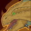

[Back to Main](index.md)

    
        
            
        
        
            Portrait
        
    

# Binwin

A grumpy and headstrong dwarf with a penchant for springing traps rather than disarming them, if Binwin's not the first into battle then he's disappointed. There's nary a door, tankard, or acid pit that hasn't felt the wrath of Binwin Bronzebottom at one time or another.

# Changes

Binwin will be a reworked champion in the Grand Revel event and delayed until 11 February 2026.

Only abilities that have seen some changes will be displayed here - and be aware that there's a lot of guesswork involved. Some abilities may not have names - some may have the *wrong* names - or specialisations might not be marked as such - etc.. Focus on the effect data itself.

Please do me a favour and don't get all melodramatic about what you find here. I - and CNE - don't appreciate it. These are spoilers and will almost certainly change before release - likely multiple times. That and we don't have access to any upgrade data prior to release. Making assumptions on how the champions will turn out based on this information would be premature.

# Attacks

**Ultimate: Barrel Roll** (Guess)
> Binwin hops onto a sturdy wooden barrel and rides toward a single enemy, dealing damage along the way. When he reaches the targeted enemy, the barrel explodes, dealing ultimate area damage and slowing all affected enemies.  
> Cooldown: 195s (Cap 48.75s)

<em>Raw Data</em>

<pre>
{
    "id": 929,
    "name": "Barrel Roll",
    "description": "Binwin hops onto a sturdy wooden barrel and rides toward a single enemy, creating a path of destruction in his wake.",
    "long_description": "Binwin hops onto a sturdy wooden barrel and rides toward a single enemy, dealing damage along the way. When he reaches the targeted enemy, the barrel explodes, dealing ultimate area damage and slowing all affected enemies.",
    "graphic_id": 3230,
    "target": "random",
    "num_targets": 1,
    "aoe_radius": 0,
    "damage_modifier": 0.03,
    "cooldown": 195,
    "animations": [
        {
            "type": "binwin_ultimate",
            "power_up_sequence": {
                "start_frame": 0,
                "end_frame": 10
            },
            "sequences": [
                {
                    "start_frame": 11,
                    "end_frame": 21
                }
            ],
            "radius": 250,
            "slow_graphic": 6548
        }
    ],
    "tags": [
        "melee",
        "ultimate"
    ],
    "damage_types": [
        "melee"
    ]
}
</pre>

# Abilities

**Unknown** (Guess)
> Binwin's base chance to Critical Hit is 20%.

<em>Raw Data</em>

<pre>
{
    "id": 2536,
    "flavour_text": "",
    "description": {
        "desc": "Binwin's base chance to Critical Hit is 20%."
    },
    "effect_keys": [
        {
            "effect_string": "set_base_crit_chance,20"
        }
    ],
    "requirements": "",
    "graphic_id": 0,
    "large_graphic_id": 0,
    "properties": {
        "is_formation_ability": true
    }
}
</pre>

**Unknown** (Guess)
> Binwin deals double hits against enemies or objects with hits-based or armored hits-based health. If Binwin attacks an armored enemy and doesn't break any armor, he gains a Resolve stack. Binwin deals 100% additional damage for each Resolve stack, stacking multiplicatively up to 10 times, resetting when changing areas.

<em>Raw Data</em>

<pre>
{
    "id": 2545,
    "flavour_text": "",
    "description": {
        "desc": "Binwin deals double hits against enemies or objects with hits-based or armored hits-based health. If Binwin attacks an armored enemy and doesn't break any armor, he gains a Resolve stack. Binwin deals $amount% additional damage for each Resolve stack, stacking multiplicatively up to 10 times, resetting when changing areas."
    },
    "effect_keys": [
        {
            "off_when_benched": true,
            "effect_string": "hero_dps_multiplier_mult,100",
            "max_stacks": 10,
            "stacks_multiply": true,
            "show_bonus": true,
            "stacks_on_trigger": "owner_attack_failed_break_armor",
            "more_triggers": [
                {
                    "trigger": "area_changed",
                    "action": {
                        "type": "reset"
                    }
                }
            ],
            "stack_title": "Resolve Stacks"
        },
        {
            "effect_string": "increase_num_unique_hits,100"
        }
    ],
    "requirements": "",
    "graphic_id": 28058,
    "large_graphic_id": 28058,
    "properties": {
        "is_formation_ability": true,
        "owner_use_outgoing_description": true
    }
}
</pre>

**Extra Attack** (Guess)
> Binwin gains a Bonus Hit when an adjacent Champion attacks. The next time he attacks, he consumes his Bonus Hits to deal additional hits to the enemy he attacks. If his target dies and Binwin still has Bonus Hits, he'll jump to a new enemy if possible. Unused Bonus Hits are lost when his attack ends. Caps at 10 stacks.

<em>Raw Data</em>

<pre>
{
    "id": 2537,
    "flavour_text": "",
    "description": {
        "desc": "Binwin gains a Bonus Hit when an adjacent Champion attacks. The next time he attacks, he consumes his Bonus Hits to deal additional hits to the enemy he attacks. If his target dies and Binwin still has Bonus Hits, he'll jump to a new enemy if possible. Unused Bonus Hits are lost when his attack ends. Caps at $max_stacks___2 stacks."
    },
    "effect_keys": [
        {
            "effect_string": "binwin_extra_attacks_rework_handler,100",
            "bonus_effect_counter_index": 1,
            "extra_damage_effect_id": 2538,
            "critical_combo_effect_id": 2540
        },
        {
            "effect_string": "bonus_hit_counter",
            "min_stacks": 0,
            "max_stacks": 10,
            "stacks_on_trigger": "will_stack_manually",
            "stacks_multiply": true,
            "show_stacks": true,
            "more_triggers": [
                {
                    "trigger": "area_changed",
                    "action": {
                        "type": "reset"
                    }
                },
                {
                    "trigger": "adj_attack_disabled",
                    "action": {
                        "type": "add_stack"
                    }
                },
                {
                    "trigger": "champion_affected_by_upg_attacked,18459,1",
                    "action": {
                        "type": "add_stack"
                    }
                },
                {
                    "trigger": "feat_changed,2407",
                    "action": {
                        "type": "reset"
                    }
                }
            ],
            "binwin_graphic_id": 5837,
            "binwin_graphic_y": -130,
            "amount_updated_listeners": [
                "hero_attack_ended",
                "slot_changed",
                "stacks_changed"
            ]
        },
        {
            "effect_string": "binwin_hit_detect",
            "skip_effect_key_desc": true,
            "targets": [
                {
                    "type": "distance",
                    "distance": 1,
                    "comparison": "="
                }
            ]
        }
    ],
    "requirements": "",
    "graphic_id": 28052,
    "large_graphic_id": 28052,
    "properties": {
        "is_formation_ability": true,
        "owner_use_outgoing_description": true,
        "indexed_effect_properties": true,
        "per_effect_index_bonuses": true,
        "default_bonus_index": 0
    }
}
</pre>

**Extra Damage** (Guess)
> Each subsequent hit Binwin does during the same attack deals 100% more damage, stacking multiplicatively.100.

ⓘ *Note: This ability is prestack.*

<em>Raw Data</em>

<pre>
{
    "id": 2538,
    "flavour_text": "",
    "description": {
        "desc": "Each subsequent hit Binwin does during the same attack deals $amount% more damage, stacking multiplicatively.$binwin_show_hits"
    },
    "effect_keys": [
        {
            "effect_string": "pre_stack,100",
            "skip_effect_key_desc": true
        },
        {
            "effect_string": "binwin_extra_damage,100",
            "amount_expr": "upgrade_amount(18460,0)"
        }
    ],
    "requirements": "",
    "graphic_id": 5846,
    "large_graphic_id": 5847,
    "properties": {
        "is_formation_ability": true,
        "owner_use_outgoing_description": true,
        "indexed_effect_properties": true,
        "per_effect_index_bonuses": true,
        "default_bonus_index": 0
    }
}
</pre>

**Lingering Damage** (Guess)
> While Binwin is your BUD-setting Champion and he attacks but does not kill an enemy, the enemy takes 100% of the damage it took over the next 5 seconds.

<em>Raw Data</em>

<pre>
{
    "id": 2539,
    "flavour_text": "",
    "description": {
        "desc": "While Binwin is your BUD-setting Champion and he attacks but does not kill an enemy, the enemy takes $amount% of the damage it took over the next 5 seconds. $(if upgrade_purchased 18461) $bud_setting_active $(fi)"
    },
    "effect_keys": [
        {
            "effect_string": "binwin_lingering_damage,100",
            "off_when_benched": true,
            "seconds_of_bud": 1,
            "total_seconds": 5,
            "debuffing_attack_ids": [],
            "debuff_before_damage": false,
            "debuff_effects": [
                {
                    "effect_string": "bud_dot,$amount",
                    "active_graphic_id": 28054,
                    "active_graphic_y": -75,
                    "tick_rate": 1,
                    "total_ticks": 5,
                    "for_time": "$total_seconds",
                    "time_stack_type": "time_reset",
                    "stack_across_effects": true,
                    "exact_damage": true
                }
            ]
        },
        {
            "effect_string": "change_upgrade_data,18461,0",
            "apply_manually": true,
            "data": {
                "debuffing_attack_ids": [
                    107
                ]
            },
            "skip_effect_key_desc": true
        },
        {
            "effect_string": "apply_when_bud_setting",
            "index_to_apply": 1,
            "skip_effect_key_desc": true
        }
    ],
    "requirements": "",
    "graphic_id": 5848,
    "large_graphic_id": 5849,
    "properties": {
        "is_formation_ability": true,
        "owner_use_outgoing_description": true
    }
}
</pre>

**Critical Combo** (Guess)
> When Binwin scores a critical hit, he gains an additional Bonus Hit for his current attack. This can occur up to 5 times per attack.

<em>Raw Data</em>

<pre>
{
    "id": 2540,
    "flavour_text": "",
    "description": {
        "desc": "When Binwin scores a critical hit, he gains an additional Bonus Hit for his current attack. This can occur up to 5 times per attack."
    },
    "effect_keys": [
        {
            "effect_string": "binwin_critical_combo",
            "max_per_attack": 5
        }
    ],
    "requirements": "",
    "graphic_id": 28051,
    "large_graphic_id": 28051,
    "properties": {
        "is_formation_ability": true,
        "show_incoming": false,
        "owner_use_outgoing_description": true
    }
}
</pre>

# Specialisations

**Specialisation: Overkill** (Guess)
> When Binwin defeats an enemy, he gains stacks of Overkill based on how many orders of magnitude more damage he did compared to the enemy's remaining health. Binwin's damage is increased by 1% for each Overkill stack, stacking additively. Overkill stacks persist until the adventure resets.

<em>Raw Data</em>

<pre>
{
    "id": 2541,
    "flavour_text": "",
    "description": {
        "desc": "When Binwin defeats an enemy, he gains stacks of Overkill based on how many orders of magnitude more damage he did compared to the enemy's remaining health. Binwin's damage is increased by $amount% for each Overkill stack, stacking additively. Overkill stacks persist until the adventure resets."
    },
    "effect_keys": [
        {
            "effect_string": "hero_dps_multiplier_mult,1",
            "max_stacks": 4000000000,
            "show_bonus": true,
            "stacks_multiply": false,
            "stack_title": "Overkill Stacks",
            "stacks_on_trigger": "will_stack_manually"
        },
        {
            "effect_string": "stacks_data_binder_safe,0,binwin_overkill_count",
            "is_instanced_stat": true,
            "use_stat_defs": true,
            "skip_effect_key_desc": true
        },
        {
            "effect_string": "binwin_overkill",
            "skip_effect_key_desc": true
        }
    ],
    "requirements": "",
    "graphic_id": 28059,
    "large_graphic_id": 28059,
    "properties": {
        "is_formation_ability": true
    }
}
</pre>

**Specialisation: Dwarven Encouragement** (Guess)
> Binwin encourages the Champions adjacent to him to attack more frequently, reducing their base attack cooldowns by 2 seconds and increasing his own damage by 100%.

<em>Raw Data</em>

<pre>
{
    "id": 2542,
    "flavour_text": "",
    "description": {
        "desc": "Binwin encourages the Champions adjacent to him to attack more frequently, reducing their base attack cooldowns by 2 seconds and increasing his own damage by $amount%."
    },
    "effect_keys": [
        {
            "effect_string": "hero_dps_multiplier_mult,100"
        },
        {
            "effect_string": "reduce_attack_cooldown,2",
            "targets": [
                "adj"
            ]
        }
    ],
    "requirements": "",
    "graphic_id": 28058,
    "large_graphic_id": 28058,
    "properties": {
        "is_formation_ability": true,
        "owner_use_outgoing_description": true,
        "indexed_effect_properties": true,
        "per_effect_index_bonuses": true,
        "default_bonus_index": 0
    }
}
</pre>

**Specialisation: Tallest in Faerun** (Guess)
> Binwin's damage is increased by 200% for each Dwarf, Kobold, Halfling, Gnome, or Goblin in the formation, stacking multiplicatively.

<em>Raw Data</em>

<pre>
{
    "id": 2543,
    "flavour_text": "",
    "description": {
        "desc": "Binwin's damage is increased by 200% for each Dwarf, Kobold, Halfling, Gnome, or Goblin in the formation, stacking multiplicatively."
    },
    "effect_keys": [
        {
            "effect_string": "hero_dps_mult_per_tagged_crusader_mult,200,dwarf|kobold|halfling|gnome|goblin",
            "stacks_multiply": true
        }
    ],
    "requirements": [],
    "graphic_id": 28060,
    "large_graphic_id": 28060,
    "properties": {
        "is_formation_ability": true,
        "use_outgoing_description": true,
        "spec_option_post_apply_info": "Qualified Champions: $num_stacks"
    }
}
</pre>

# Adventures and Variants

**Unlock Adventure: Let Sleeping Dragons Lie (Binwin)** (Complete Area 50)
> Attempt to calm down a very angry bronze dragon.

 **Variant 1: Awaken the Beasts** (Complete Area 75)
> Beast enemies move more quickly (3x) and deal more damage (4x).

 **Variant 2: Binwin's Minions** (Complete Area 125)
> Two useless minions take up slots in the formation; they move every 20 areas. They massively debuff adjacent Champions except for Binwin, whom they massively buff.

 **Variant 3: Untrusting** (Complete Area 175)
> Bronze wyrmlings spawn in every area with various powers.

# Formation

    <svg xmlns="http://www.w3.org/2000/svg" id="Binwin" fill="#aaa" data-formationName="Binwin" data-campaignName="Dragondown" width="300" height="160"><circle cx="175" cy="65" r="15"/><circle cx="175" cy="105" r="15"/><circle cx="175" cy="145" r="15"/><circle cx="135" cy="85" r="15"/><circle cx="95" cy="25" r="15"/><circle cx="95" cy="65" r="15"/><circle cx="95" cy="105" r="15"/><circle cx="55" cy="85" r="15"/><circle cx="55" cy="125" r="15"/><circle cx="15" cy="105" r="15"/><text x="205" y="25" fill="#dcdcdc" font-size="25" font-family="Arial" font-weight="bold">Binwin</text><text x="205" y="65" fill="#dcdcdc" font-size="15" font-family="Arial" font-weight="bold">Dragondown</text></svg>

[Back to Top](#top)

*Last Modified: {{ site.time }}*