[Back to Main](index.md)

    
        
            
        
        
            Portrait
        
    
    
        
            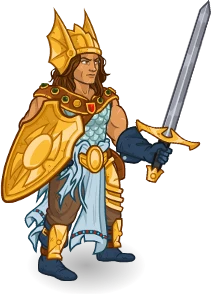
        
        
            Model
        
    

# Caramon Majere

Born strong of arm and broad of shoulder with a heart of gold, Caramon Majere is the Sword to his younger twin brother Raistlin's Sorcery. Loyal to a fault, Caramon gives his all to protect his beloved friends and family, even (and often) to his detriment. Together with his fellow Heroes of the Lance, Caramon wields his brute strength tempered with good morals against Takhisis, the Dragon Queen.

# Basic Information

Caramon Majere will be a new champion in the Highharvestide event on 2 September 2026.

  **Seat**:
  3
  **Stat**
  **Value**
  **Day 1 Trials**
  **Patrons**
  **Skylla Patrons**
  **Species**:
  Human
  **Strength**:
  19
  Yes
  Mirt
  Mirt
  **Class**:
  Fighter
  **Dexterity**:
  11
  -
  Vajra
  -
  **Roles**:
  Support / Tanking
  **Constitution**:
  17
  Yes
  -
  -
  **Age**:
  25
  **Intelligence**:
  12
  Yes
  Zariel
  Zariel
  **Gender**:
  Male
  **Wisdom**:
  11
  Yes
  Elminster
  Elminster
  **Alignment**:
  Lawful Good
  **Charisma**:
  15
  Yes
  &nbsp;
  
  **Affiliation**:
  Heroes of the Lance
  **Total**:
  85
  &nbsp;
  Champion ID:
  179

# Formation

    <svg xmlns="http://www.w3.org/2000/svg" id="Caramon" fill="#aaa" data-formationName="Caramon" data-campaignName="Highharvestide" width="279" height="160"><circle cx="135" cy="45" r="15"/><circle cx="135" cy="85" r="15"/><circle cx="135" cy="125" r="15"/><circle cx="95" cy="25" r="15"/><circle cx="95" cy="65" r="15"/><circle cx="95" cy="105" r="15"/><circle cx="95" cy="145" r="15"/><circle cx="55" cy="45" r="15"/><circle cx="55" cy="85" r="15"/><circle cx="15" cy="65" r="15"/><text x="165" y="25" fill="#dcdcdc" font-size="25" font-family="Arial" font-weight="bold">Caramon</text><text x="165" y="65" fill="#dcdcdc" font-size="15" font-family="Arial" font-weight="bold">Highharvestide</text></svg>

# Attacks

 **Base Attack: Mighty Blow** (Melee)
> Caramon attacks the nearest enemy for one hit.  
> Cooldown: 6.25s (Cap 1.5625s)

<em>Raw Data</em>

<pre>
{
    "id": 996,
    "name": "Mighty Blow",
    "description": "Caramon attacks the nearest enemy for one hit.",
    "long_description": "",
    "graphic_id": 0,
    "target": "front",
    "num_targets": 1,
    "aoe_radius": 0,
    "damage_modifier": 1,
    "cooldown": 6.25,
    "animations": [
        {
            "type": "melee_attack",
            "start_frame": 6,
            "target_offset_x": -34,
            "damage_frame": 8,
            "jump_sound": 30,
            "sound_frames": {
                "2": 154
            }
        }
    ],
    "tags": [
        "melee"
    ],
    "damage_types": [
        "melee"
    ]
}
</pre>

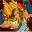 **Ultimate Attack: Endure All** (Level: 0)
> Caramon is healed to full and buffs the party based on the health he was missing. This ultimate can automatically trigger when Caramon is close to death.  
> Cooldown: 360s (Cap 90s)

<em>Raw Data</em>

<pre>
{
    "id": 997,
    "name": "Endure All",
    "description": "Caramon is healed to full and buffs the party based on the health he was missing.",
    "long_description": "Caramon is healed to full and buffs the party based on the health he was missing. This ultimate can automatically trigger when Caramon is close to death.",
    "graphic_id": 30155,
    "target": "none",
    "num_targets": 1,
    "aoe_radius": 0,
    "damage_modifier": 0.03,
    "cooldown": 360,
    "animations": [
        {
            "type": "ultimate_attack",
            "ultimate": "caramon",
            "animation_sequence_name": "ultimate",
            "no_damage_display": true
        }
    ],
    "tags": [
        "magic",
        "ultimate"
    ],
    "damage_types": [
        "magic"
    ]
}
</pre>

# Abilities

**Brothers Majere** (Level: 0)
> If Raistlin is in the formation, Caramon may be used as well, regardless of any active variant or patron restrictions.

<em>Raw Data</em>

<pre>
{
    "id": 20176,
    "hero_id": 179,
    "required_level": 0,
    "required_upgrade_id": 0,
    "upgrade_type": "unlock_ability",
    "effect": "effect_def,2851",
    "static_dps_mult": null,
    "default_enabled": 1,
    "name": "Brothers Majere"
}
{
    "id": 2851,
    "flavour_text": "",
    "description": {
        "desc": "If Raistlin is in the formation, Caramon may be used as well, regardless of any active variant or patron restrictions."
    },
    "effect_keys": [
        {
            "effect_string": "force_allow_hero",
            "off_when_benched": true,
            "paired_hero_id": 173,
            "ignore_hero_source_check": true,
            "hero_ids": [
                173
            ]
        }
    ],
    "requirements": "",
    "graphic_id": 0,
    "large_graphic_id": 0,
    "properties": {
        "is_formation_ability": true,
        "owner_use_outgoing_description": true,
        "indexed_effect_properties": true,
        "per_effect_index_bonuses": true,
        "default_bonus_index": 0
    }
}
</pre>

 **Protect the Weak** (Level: 60)
> Caramon increases the health of all Champions targeted by his Raise Spirits Specialization by 10% of his max health. If a Champion is targeted multiple times (via his Allies Specialization), this ability applies multiple times.

<em>Raw Data</em>

<pre>
{
    "id": 20183,
    "hero_id": 179,
    "required_level": 60,
    "required_upgrade_id": 0,
    "upgrade_type": "unlock_ability",
    "effect": "effect_def,2858",
    "static_dps_mult": null,
    "default_enabled": 1,
    "name": "Protect the Weak"
}
{
    "id": 2858,
    "flavour_text": "",
    "description": {
        "desc": "Caramon increases the health of all Champions targeted by his Raise Spirits Specialization by $amount% of his max health. If a Champion is targeted multiple times (via his Allies Specialization), this ability applies multiple times."
    },
    "effect_keys": [
        {
            "off_when_benched": true,
            "effect_string": "caramon_protect_the_weak,10",
            "targets": [
                "all"
            ],
            "filter_targets": [
                {
                    "type": "hero_expr",
                    "hero_expr": "HasEffect(`caramon_raise_spirits`)"
                }
            ],
            "health_stacking_index": 0,
            "effect_key": "caramon_raise_spirits",
            "health_effect": {
                "effect_string": "effect_def,2861"
            }
        }
    ],
    "requirements": [],
    "graphic_id": 30136,
    "large_graphic_id": 30133,
    "properties": {
        "is_formation_ability": true,
        "show_incoming": false,
        "owner_use_outgoing_description": true,
        "indexed_effect_properties": true,
        "per_effect_index_bonuses": true,
        "default_bonus_index": 0,
        "retain_on_slot_changed": true
    }
}
</pre>

 **Close Ranks** (Level: 100)
> Whenever Caramon is attacked by an enemy, the effect of his Raise Spirits Specialization is increased by 100%, stacking multiplicatively. This can stack up to 25 times and loses half of its stacks when changing areas.

<em>Raw Data</em>

<pre>
{
    "id": 20184,
    "hero_id": 179,
    "required_level": 100,
    "required_upgrade_id": 0,
    "upgrade_type": "unlock_ability",
    "effect": "effect_def,2859",
    "static_dps_mult": null,
    "default_enabled": 1,
    "name": "Close Ranks"
}
{
    "id": 2859,
    "flavour_text": "",
    "description": {
        "desc": "Whenever Caramon is attacked by an enemy, the effect of his Raise Spirits Specialization is increased by $(not_buffed amount)%, stacking multiplicatively. This can stack up to $max_stacks times and loses half of its stacks when changing areas."
    },
    "effect_keys": [
        {
            "off_when_benched": true,
            "effect_string": "buff_upgrades,100,20177,20178,20179",
            "stacks_on_trigger": {
                "trigger": "hero_attacked",
                "target": "self_slot"
            },
            "more_triggers": [
                {
                    "trigger": "area_changed",
                    "action": {
                        "type": "reduce_percent",
                        "percent": 50
                    }
                }
            ],
            "max_stacks": 25,
            "stacks_multiply": true,
            "show_bonus": true
        }
    ],
    "requirements": [],
    "graphic_id": 30135,
    "large_graphic_id": 30132,
    "properties": {
        "is_formation_ability": true,
        "owner_use_outgoing_description": true,
        "indexed_effect_properties": true,
        "per_effect_index_bonuses": true,
        "default_bonus_index": 0
    }
}
</pre>

 **Endure All** (Level: 150)
> Caramon's health is completely refilled, and the effect of his Raise Spirits Specialization is increased by 100% for every 10% of Caramon's health that he was missing (rounding up), stacking multiplicatively and lasting for 30 seconds. This Ultimate automatically triggers if Caramon would be knocked out by an incoming attack.

<em>Raw Data</em>

<pre>
{
    "id": 20257,
    "hero_id": 179,
    "required_level": 150,
    "required_upgrade_id": 0,
    "upgrade_type": "unlock_ultimate",
    "effect": "effect_def,2862",
    "static_dps_mult": null,
    "default_enabled": 1,
    "name": "Endure All"
}
{
    "id": 2862,
    "flavour_text": "",
    "description": {
        "desc": "Caramon's health is completely refilled, and the effect of his Raise Spirits Specialization is increased by $amount% for every $stack_per_percent% of Caramon's health that he was missing (rounding up), stacking multiplicatively and lasting for 30 seconds. This Ultimate automatically triggers if Caramon would be knocked out by an incoming attack."
    },
    "effect_keys": [
        {
            "off_when_benched": true,
            "effect_string": "caramon_endure_all_handler,100",
            "time": 30,
            "stack_per_percent": 10,
            "buff_effect_index": 1,
            "show_bonus": true
        },
        {
            "effect_string": "buff_upgrades,100,20177,20178,20179",
            "stacks_on_trigger": "will_stack_manually",
            "apply_manually": true,
            "stacks_multiply": true,
            "show_bonus": true
        },
        {
            "effect_string": "set_ultimate_attack,997"
        }
    ],
    "requirements": [],
    "graphic_id": 30155,
    "large_graphic_id": 30155,
    "properties": {
        "is_formation_ability": true,
        "owner_use_outgoing_description": true,
        "indexed_effect_properties": true,
        "per_effect_index_bonuses": true,
        "default_bonus_index": 0
    }
}
</pre>

 **Brother's Keeper** (Level: 200)
> Caramon increases the effect of his Raise Spirit Specialization by 100% for each Champion in the formation not affected by Raise Spirits.

ⓘ *Note: This ability is prestack.*

<em>Raw Data</em>

<pre>
{
    "id": 20185,
    "hero_id": 179,
    "required_level": 200,
    "required_upgrade_id": 0,
    "upgrade_type": "unlock_ability",
    "effect": "effect_def,2860",
    "static_dps_mult": null,
    "default_enabled": 1,
    "name": "Brother's Keeper"
}
{
    "id": 2860,
    "flavour_text": "",
    "description": {
        "conditions": [
            {
                "condition": "feat_assigned 2758",
                "desc": "Caramon increases the effect of his Raise Spirits Specialization by $amount% for each Champion in the formation affected by at least two instances of Raise Spirits."
            },
            {
                "desc": "Caramon increases the effect of his Raise Spirit Specialization by $amount% for each Champion in the formation not affected by Raise Spirits."
            }
        ]
    },
    "effect_keys": [
        {
            "effect_string": "pre_stack,100",
            "skip_effect_key_desc": true
        },
        {
            "off_when_benched": true,
            "effect_string": "buff_upgrades,0,20177,20178,20179",
            "amount_expr": "upgrade_amount(20185,0)",
            "amount_func": "mult",
            "stack_func": "per_hero_attribute",
            "per_hero_expr": "as_int((!GetFeatEquipped(2758) && NumEffectKey(`caramon_raise_spirits`) <= 0) || (GetFeatEquipped(2758) && NumEffectKey(`caramon_raise_spirits`) >= 2))",
            "stacks_multiply": true,
            "amount_updated_listeners": [
                "slot_changed",
                "feat_changed"
            ],
            "show_bonus": true
        }
    ],
    "requirements": [],
    "graphic_id": 30134,
    "large_graphic_id": 30131,
    "properties": {
        "is_formation_ability": true,
        "owner_use_outgoing_description": true,
        "indexed_effect_properties": true,
        "per_effect_index_bonuses": true,
        "default_bonus_index": 0
    }
}
</pre>

# Specialisations

 **Raise Spirits: Encirclement** (Level: 20)
> Caramon increases the damage of all adjacent Champions by 100%.

<em>Raw Data</em>

<pre>
{
    "id": 20177,
    "hero_id": 179,
    "required_level": 20,
    "required_upgrade_id": 0,
    "upgrade_type": "unlock_ability",
    "effect": "effect_def,2852",
    "static_dps_mult": null,
    "default_enabled": 1,
    "name": "Raise Spirits: Encirclement",
    "specialization_name": "Raise Spirits: Encirclement",
    "specialization_description": "Caramon suggests that his allies group up and form a perimeter near him to watch for movement.",
    "specialization_graphic_id": 30141,
    "tip_text": "Caramon increases the damage of Champions adjacent to himself. Make sure your damage dealer is adjacent to him!"
}
{
    "id": 2852,
    "flavour_text": "",
    "description": {
        "desc": "$target increases the damage of all adjacent Champions by $amount%."
    },
    "effect_keys": [
        {
            "off_when_benched": true,
            "effect_string": "hero_dps_multiplier_mult,100",
            "targets": [
                "adj"
            ],
            "amount_updated_listeners": [
                "slot_changed"
            ]
        },
        {
            "off_when_benched": true,
            "effect_string": "caramon_raise_spirits",
            "skip_effect_key_desc": true,
            "targets": [
                "adj"
            ]
        }
    ],
    "requirements": [],
    "graphic_id": 30141,
    "large_graphic_id": 30141,
    "properties": {
        "is_formation_ability": true,
        "effect_name": "Raise Spirits: Encirclement",
        "owner_use_outgoing_description": true,
        "show_owner_incoming": true,
        "show_incoming": true,
        "indexed_effect_properties": true,
        "per_effect_index_bonuses": true,
        "default_bonus_index": 0
    }
}
</pre>

 **Raise Spirits: Overwatch** (Level: 20)
> Caramon increases the damage of all Champions in the same column as him and the column in front of him by 100%.

<em>Raw Data</em>

<pre>
{
    "id": 20178,
    "hero_id": 179,
    "required_level": 20,
    "required_upgrade_id": 0,
    "upgrade_type": "unlock_ability",
    "effect": "effect_def,2853",
    "static_dps_mult": null,
    "default_enabled": 1,
    "name": "Raise Spirits: Overwatch",
    "specialization_name": "Raise Spirits: Overwatch",
    "specialization_description": "Caramon suggests that his allies approach with caution while keeping an eye out for danger.",
    "specialization_graphic_id": 30142,
    "tip_text": "Caramon increases the damage of Champions in his column and the one ahead of him. Make sure your damage dealer is in an affected slot!"
}
{
    "id": 2853,
    "flavour_text": "",
    "description": {
        "desc": "$target increases the damage of all Champions in the same column as him and the column in front of him by $amount%."
    },
    "effect_keys": [
        {
            "off_when_benched": true,
            "effect_string": "hero_dps_multiplier_mult,100",
            "targets": [
                "col_and_next_col"
            ],
            "amount_updated_listeners": [
                "slot_changed",
                "feat_changed",
                "loot_changed",
                "hero_attack_ended"
            ]
        },
        {
            "off_when_benched": true,
            "effect_string": "caramon_raise_spirits",
            "skip_effect_key_desc": true,
            "targets": [
                "col_and_next_col"
            ]
        }
    ],
    "requirements": [],
    "graphic_id": 30142,
    "large_graphic_id": 30142,
    "properties": {
        "is_formation_ability": true,
        "effect_name": "Raise Spirits: Overwatch",
        "owner_use_outgoing_description": true,
        "show_owner_incoming": true,
        "show_incoming": true,
        "indexed_effect_properties": true,
        "per_effect_index_bonuses": true,
        "default_bonus_index": 0
    }
}
</pre>

 **Raise Spirits: Spearhead** (Level: 20)
> Caramon increases the damage of all Champions in the two columns behind him by 100%.

<em>Raw Data</em>

<pre>
{
    "id": 20179,
    "hero_id": 179,
    "required_level": 20,
    "required_upgrade_id": 0,
    "upgrade_type": "unlock_ability",
    "effect": "effect_def,2854",
    "static_dps_mult": null,
    "default_enabled": 1,
    "name": "Raise Spirits: Spearhead",
    "specialization_name": "Raise Spirits: Spearhead",
    "specialization_description": "Caramon suggests that his allies throw caution to the wind and charge the enemy headlong.",
    "specialization_graphic_id": 30143,
    "tip_text": "Caramon increases the damage of Champions in the two columns behind him. Make sure your damage dealer is in an affected slot!"
}
{
    "id": 2854,
    "flavour_text": "",
    "description": {
        "desc": "$target increases the damage of all Champions in the two columns behind him by $amount%."
    },
    "effect_keys": [
        {
            "effect_string": "hero_dps_multiplier_mult,100",
            "off_when_benched": true,
            "targets": [
                "prev_two_col"
            ],
            "amount_updated_listeners": [
                "slot_changed",
                "feat_changed",
                "loot_changed"
            ]
        },
        {
            "effect_string": "caramon_raise_spirits",
            "off_when_benched": true,
            "skip_effect_key_desc": true,
            "targets": [
                "prev_two_col"
            ]
        }
    ],
    "requirements": [],
    "graphic_id": 30143,
    "large_graphic_id": 30143,
    "properties": {
        "is_formation_ability": true,
        "effect_name": "Raise Spirits: Spearhead",
        "owner_use_outgoing_description": true,
        "show_owner_incoming": true,
        "show_incoming": true,
        "indexed_effect_properties": true,
        "per_effect_index_bonuses": true,
        "default_bonus_index": 0
    }
}
</pre>

 **Staunch Allies** (Level: 170)
> Caramon recruits all other Tanking Champions in the formation. Caramon's Raise Spirits Specialization emanates from each eligible Champion as if each were a separate formation ability for the purposes of Champions that care about such things.

<em>Raw Data</em>

<pre>
{
    "id": 20180,
    "hero_id": 179,
    "required_level": 170,
    "required_upgrade_id": 0,
    "upgrade_type": "unlock_ability",
    "effect": "effect_def,2855",
    "static_dps_mult": null,
    "default_enabled": 1,
    "name": "Staunch Allies",
    "specialization_name": "Staunch Allies",
    "specialization_description": "Caramon's tireless form inspires those like him to raise their spirits in battle.",
    "specialization_graphic_id": 30144,
    "tip_text": "Copies of Caramon's main buff emanate from all Tanking Champions in the formation. Make sure your damage dealer is"
}
{
    "id": 2855,
    "flavour_text": "",
    "description": {
        "desc": "Caramon recruits all other Tanking Champions in the formation. Caramon's Raise Spirits Specialization emanates from each eligible Champion as if each were a separate formation ability for the purposes of Champions that care about such things."
    },
    "effect_keys": [
        {
            "effect_string": "carmon_second_spec,100",
            "off_when_benched": true,
            "show_incoming": true,
            "override_key_desc": "Recruits $target to emanate Caramon's Raise Spirits Specialization",
            "targets": [
                "all"
            ],
            "filter_targets": [
                {
                    "type": "hero_expr",
                    "hero_expr": "HasTag(`tanking`)"
                }
            ],
            "spec_a_upgrades": {
                "20177": 0,
                "20178": 1,
                "20179": 2
            }
        }
    ],
    "requirements": [],
    "graphic_id": 30144,
    "large_graphic_id": 30144,
    "properties": {
        "is_formation_ability": true,
        "owner_use_outgoing_description": true,
        "indexed_effect_properties": true,
        "per_effect_index_bonuses": true,
        "spec_option_post_apply_info": "Tanking Champions: $num_targets",
        "default_bonus_index": 0
    }
}
</pre>

 **Sympathetic Allies** (Level: 170)
> Caramon recruits all other Good Champions in the formation. Caramon's Raise Spirits Specialization emanates from each eligible Champion as if each were a separate formation ability for the purposes of Champions that care about such things.

<em>Raw Data</em>

<pre>
{
    "id": 20181,
    "hero_id": 179,
    "required_level": 170,
    "required_upgrade_id": 0,
    "upgrade_type": "unlock_ability",
    "effect": "effect_def,2856",
    "static_dps_mult": null,
    "default_enabled": 1,
    "name": "Sympathetic Allies",
    "specialization_name": "Sympathetic Allies",
    "specialization_description": "Caramon's greathearted nature inspires those like him to raise their spirits in battle.",
    "specialization_graphic_id": 30154,
    "tip_text": "Copies of Caramon's main buff emanate from all Good Champions in the formation. Make sure your damage dealer is positioned to take advantage of the extra buffs!"
}
{
    "id": 2856,
    "flavour_text": "",
    "description": {
        "desc": "Caramon recruits all other Good Champions in the formation. Caramon's Raise Spirits Specialization emanates from each eligible Champion as if each were a separate formation ability for the purposes of Champions that care about such things."
    },
    "effect_keys": [
        {
            "effect_string": "carmon_second_spec,100",
            "off_when_benched": true,
            "show_incoming": true,
            "override_key_desc": "Recruits $target to emanate Caramon's Raise Spirits Specialization",
            "targets": [
                "all"
            ],
            "filter_targets": [
                {
                    "type": "hero_expr",
                    "hero_expr": "HasTag(`good`)"
                }
            ],
            "spec_a_upgrades": {
                "20177": 0,
                "20178": 1,
                "20179": 2
            },
            "retarget_when_any_hero_tags_changed": true
        }
    ],
    "requirements": [],
    "graphic_id": 30154,
    "large_graphic_id": 30154,
    "properties": {
        "is_formation_ability": true,
        "owner_use_outgoing_description": true,
        "indexed_effect_properties": true,
        "per_effect_index_bonuses": true,
        "spec_option_post_apply_info": "Good Champions: $num_targets",
        "default_bonus_index": 0
    }
}
</pre>

 **Stalwart Allies** (Level: 170)
> Caramon recruits all other Champions in the formation with a STR score of 16 or higher. Caramon's Raise Spirits Specialization emanates from each eligible Champion as if each were a separate formation ability for the purposes of Champions that care about such things.

<em>Raw Data</em>

<pre>
{
    "id": 20182,
    "hero_id": 179,
    "required_level": 170,
    "required_upgrade_id": 0,
    "upgrade_type": "unlock_ability",
    "effect": "effect_def,2857",
    "static_dps_mult": null,
    "default_enabled": 1,
    "name": "Stalwart Allies",
    "specialization_name": "Stalwart Allies",
    "specialization_description": "Caramon's incredible might inspires those like him to raise their spirits in battle.",
    "specialization_graphic_id": 30145,
    "tip_text": "Copies of Caramon's main buff emanate from all high STR Champions in the formation. Make sure your damage dealer is positioned to take advantage of the extra buffs!"
}
{
    "id": 2857,
    "flavour_text": "",
    "description": {
        "desc": "Caramon recruits all other Champions in the formation with a STR score of 16 or higher. Caramon's Raise Spirits Specialization emanates from each eligible Champion as if each were a separate formation ability for the purposes of Champions that care about such things."
    },
    "effect_keys": [
        {
            "effect_string": "carmon_second_spec,100",
            "off_when_benched": true,
            "show_incoming": true,
            "override_key_desc": "Recruits $target to emanate Caramon's Raise Spirits Specialization",
            "targets": [
                "all"
            ],
            "filter_targets": [
                {
                    "type": "hero_expr",
                    "hero_expr": "GetStat(`str`) >= 16"
                }
            ],
            "spec_a_upgrades": {
                "20177": 0,
                "20178": 1,
                "20179": 2
            }
        }
    ],
    "requirements": [],
    "graphic_id": 30145,
    "large_graphic_id": 30145,
    "properties": {
        "is_formation_ability": true,
        "owner_use_outgoing_description": true,
        "indexed_effect_properties": true,
        "per_effect_index_bonuses": true,
        "spec_option_post_apply_info": "STR 16+ Champions: $num_targets",
        "default_bonus_index": 0
    }
}
</pre>

# Items

    
        
            **Icons**
        
        
            **Slot**
        
        
            **Epic Name**
        
        
            **Effect**
        
    
    
        
            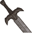ID: 4346**Battleworn Blade**My sword broke in a fight with an ogre.  All Champions damage +10%.<code>global_dps_multiplier_mult,10 allow_ge:true</code>ID: 4347**Mercenary Blade**That's a beauty. They don't make them like that these days.  All Champions damage +65%.<code>global_dps_multiplier_mult,65 allow_ge:true</code>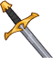ID: 4348**Mantooth**[Sigh] I hit them too hard.  All Champions damage +120%.<code>global_dps_multiplier_mult,120 allow_ge:true</code>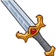ID: 4349**Warbringer**They told me, in the Tower of High Sorcery, that his strength would help save the world.  All Champions damage +230%.<code>global_dps_multiplier_mult,230 allow_ge:true</code>&nbsp;
        
        
            1
        
        
            Warbringer
        
        
            All Champions damage +230%.
        
    
    
        
            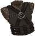ID: 4350**Battleworn Cuirass**Are you sure I'll fit?  Increases the health of Caramon by 10%.<code>health_mult,10 allow_ge:false</code>ID: 4351**Mercenary Cuirass**I'll go anywhere, fight anything, Tanis. You know that.  Increases the health of Caramon by 30%.<code>health_mult,30 allow_ge:false</code>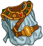ID: 4352**Scale & Tunic**I will die fighting.  Increases the health of Caramon by 50%.<code>health_mult,50 allow_ge:false</code>ID: 4353**Storied Plate**They don't need me. Even Tika doesn't need me, not like Raist needed me.  Increases the health of Caramon by 100%.<code>health_mult,100 allow_ge:false</code>&nbsp;
        
        
            2
        
        
            Storied Plate
        
        
            Increases the health of Caramon by 100%.
        
    
    
        
            ID: 4354**Rotting Rope**I've climbed worse.  Increases the effect of Caramon's Raise Spirits Specializations by 10%.<code>buff_upgrades,10,20177,20178,20179 allow_ge:false</code>ID: 4355**Sturdy Rope**I'm sorry about this, but it's the only way out of here. ~Tika  Increases the effect of Caramon's Raise Spirits Specializations by 30%.<code>buff_upgrades,30,20177,20178,20179 allow_ge:false</code>ID: 4356**Valenwood Branch**I want to go home, Tanis. I know it's going to be easy going back.  Increases the effect of Caramon's Raise Spirits Specializations by 50%.<code>buff_upgrades,50,20177,20178,20179 allow_ge:false</code>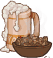ID: 4357**Taste of Home**They'll need me in Solace, Tanis, to help rebuild. They'll need my strength.  Increases the effect of Caramon's Raise Spirits Specializations by 100%.<code>buff_upgrades,100,20177,20178,20179 allow_ge:false</code>&nbsp;
        
        
            3
        
        
            Taste of Home
        
        
            Increases the effect of Caramon's Raise Spirits Specializations by 100%.
        
    
    
        
            ID: 4358**Battered Shield**Do you think it's safe?  Increases the effect of Caramon's Close Ranks ability by 25%.<code>buff_upgrade,25,20184 allow_ge:false</code>ID: 4359**Gladiator Shield**Just like the old days.  Increases the effect of Caramon's Close Ranks ability by 87.5%.<code>buff_upgrade,87.5,20184 allow_ge:false</code>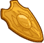ID: 4360**Heroic Shield**Get behind me.  Increases the effect of Caramon's Close Ranks ability by 150%.<code>buff_upgrade,150,20184 allow_ge:false</code>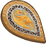ID: 4361**Storied Shield**What will he do without me? What will I do without him?  Increases the effect of Caramon's Close Ranks ability by 275%.<code>buff_upgrade,275,20184 allow_ge:false</code>&nbsp;
        
        
            4
        
        
            Storied Shield
        
        
            Increases the effect of Caramon's Close Ranks ability by 275%.
        
    
    
        
            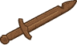ID: 4362**Notched Sword**Kit taught me to use a sword and fight with honor in the tournaments, but...  Increases the effect of Caramon's Brother's Keeper ability by 10%. (Prestack)<code>buff_upgrade,10,20185 allow_ge:false</code>ID: 4363**Practice Sword**She also taught me how to kick a man in the groin when the judges weren't watching.  Increases the effect of Caramon's Brother's Keeper ability by 30%. (Prestack)<code>buff_upgrade,30,20185 allow_ge:false</code>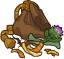ID: 4364**Brother's Herbs**Caramon, it is time for my drink. ~Raistlin  Increases the effect of Caramon's Brother's Keeper ability by 50%. (Prestack)<code>buff_upgrade,50,20185 allow_ge:false</code>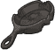ID: 4365**Tika's Love**She can come first in all my thoughts now.  Increases the effect of Caramon's Brother's Keeper ability by 100%. (Prestack)<code>buff_upgrade,100,20185 allow_ge:false</code>&nbsp;
        
        
            5
        
        
            Tika's Love
        
        
            Increases the effect of Caramon's Brother's Keeper ability by 100%. (Prestack)
        
    
    
        
            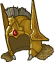ID: 4366**Battered Helm**I think we're under attack.  Reduces the cooldown on Caramon's Ultimate Attack by 9 seconds.<code>reduce_ultimate_cooldown,9 allow_ge:false</code>ID: 4367**Gladiator Helm**Just another adventure. Eh, Raist?  Reduces the cooldown on Caramon's Ultimate Attack by 18 seconds.<code>reduce_ultimate_cooldown,18 allow_ge:false</code>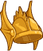ID: 4368**Golden Winged Helm**There's a battle brewing up north. I'd hate to miss it.  Reduces the cooldown on Caramon's Ultimate Attack by 36 seconds.<code>reduce_ultimate_cooldown,36 allow_ge:false</code>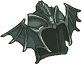ID: 4369**Silver Dragon Helm**The war's over.  Reduces the cooldown on Caramon's Ultimate Attack by 90 seconds.<code>reduce_ultimate_cooldown,90 allow_ge:false</code>&nbsp;
        
        
            6
        
        
            Silver Dragon Helm
        
        
            Reduces the cooldown on Caramon's Ultimate Attack by 90 seconds. Cap: 501 dull / 251 shiny / 126 golden.
        
    

<em>Item Names and Descriptions</em>

<pre>
Slot 1:
  Battleworn Blade: My sword broke in a fight with an ogre.
   Mercenary Blade: That's a beauty. They don't make them like that these days.
          Mantooth: [Sigh] I hit them too hard.
        Warbringer: They told me, in the Tower of High Sorcery, that his strength would help
                    save the world.

Slot 2:
Battleworn Cuirass: Are you sure I'll fit?
 Mercenary Cuirass: I'll go anywhere, fight anything, Tanis. You know that.
     Scale & Tunic: I will die fighting.
     Storied Plate: They don't need me. Even Tika doesn't need me, not like Raist needed me.

Slot 3:
      Rotting Rope: I've climbed worse.
       Sturdy Rope: I'm sorry about this, but it's the only way out of here. ~Tika
  Valenwood Branch: I want to go home, Tanis. I know it's going to be easy going back.
     Taste of Home: They'll need me in Solace, Tanis, to help rebuild. They'll need my
                    strength.

Slot 4:
   Battered Shield: Do you think it's safe?
  Gladiator Shield: Just like the old days.
     Heroic Shield: Get behind me.
    Storied Shield: What will he do without me? What will I do without him?

Slot 5:
     Notched Sword: Kit taught me to use a sword and fight with honor in the tournaments,
                    but...
    Practice Sword: She also taught me how to kick a man in the groin when the judges weren't
                    watching.
   Brother's Herbs: Caramon, it is time for my drink. ~Raistlin
       Tika's Love: She can come first in all my thoughts now.

Slot 6:
     Battered Helm: I think we're under attack.
    Gladiator Helm: Just another adventure. Eh, Raist?
Golden Winged Helm: There's a battle brewing up north. I'd hate to miss it.
Silver Dragon Helm: The war's over.
</pre>

 

# Feats

This list will only show feats that are going to be available on the release of this champion. The separate [Feats](feats.md){:target="_blank"} page may show others that could be available later if they exist.

    
        
            **Feat**
        
        
            **Effect**
        
        
            **Source**
        
    
    
        
            ID: 2747**Selflessness (Caramon)**Why does he put up with that? ~Tanis<code>global_dps_multiplier_mult,10</code>Selflessness
        
        
            All Champions damage +10%.
        
        
            Free
        
    
    
        
            ID: 2748**Inspiring Leader (Caramon)**We can't let him die out there by himself! ~Sturm<code>global_dps_multiplier_mult,25</code>Inspiring Leader
        
        
            All Champions damage +25%.
        
        
            Gold Chest
        
    
    
        
            ID: 2749**Tough (Caramon)**There'll be less for dinner. Tighten your belt. ~Tas<code>health_mult,15</code>Tough
        
        
            Increases the health of Caramon by 15%.
        
        
            Free
        
    
    
        
            ID: 2750**Resilient (Caramon)**Quit belly-aching, you big ox! They're depending on you! ~Flint<code>health_mult,30</code>Resilient
        
        
            Increases the health of Caramon by 30%.
        
        
            12,500 Gems
        
    
    
        
            ID: 2751**Defensive Duelist (Caramon)**I'll go first. Keep behind me, single-file. Caramon, you're rear guard. ~Tanis<code>overwhelm_start_increase,5</code>Defensive Duelist
        
        
            Caramon takes 5 more Enemies attacking to get overwhelmed.
        
        
            Free
        
    
    
        
            ID: 2752**Calm Under Pressure (Caramon)**Great danger and great evil surround us. ~Raistlin<code>overwhelm_start_increase,10</code>Calm Under Pressure
        
        
            Caramon takes 10 more Enemies attacking to get overwhelmed.
        
        
            Gold Chest
        
    
    
        
            ID: 2753**Battle Cry (Caramon)**Some party! Remember? Caramon got a tankard of ale dumped on his head. ~Tas<code>buff_upgrades,40,20177,20178,20179</code>Battle Cry
        
        
            Increases the effect of Caramon's Raise Spirits Specializations by 40%.
        
        
            12,500 Gems
        
    
    
        
            ID: 2754**Dig In (Caramon)**I don't know who's the greater idiot. ~Flint<code>buff_upgrade,20,20184</code>Dig In
        
        
            Increases the effect of Caramon's Close Ranks ability by 20%.
        
        
            Free
        
    
    
        
            ID: 2755**Entrenched (Caramon)**That big idiot! They'll cut the lummox to jerky down there. ~Sturm<code>buff_upgrade,40,20184</code>Entrenched
        
        
            Increases the effect of Caramon's Close Ranks ability by 40%.
        
        
            12,500 Gems
        
    
    
        
            ID: 2756**His Brother's Sword (Caramon)**We are not out of this yet, my brother. ~Raistlin<code>buff_upgrade,40,20185</code>His Brother's Sword
        
        
            Increases the effect of Caramon's Brother's Keeper ability by 40%. (Prestack)
        
        
            Gold Chest
        
    
    
        
            ID: 2757**His Brother's Strength (Caramon)**Remember, my brother! This happens because I choose it to happen! ~Raistlin<code>buff_upgrade,80,20185</code>His Brother's Strength
        
        
            Increases the effect of Caramon's Brother's Keeper ability by 80%. (Prestack)
        
        
            3,830 Platinum 50,000 Gems
        
    
    
        
            ID: 2758**His Own Path (Caramon)**Go forward into your new life in peace. ~Fizban<code>change_upgrade_data,20185</code>His Own Path
        
        
            Brother's Keeper now increases the effect of Caramon's Raise Spirits Specialization by 100% for each Champion in the formation affected by at least two instances of Raise Spirits.
        
        
            Event Bonus
        
    
    
        
            ID: 2759**Taunt (Caramon)**My brother's a fool. ~Raistlin<code>global_dps_multiplier_mult,100 taunt,50</code>Taunt
        
        
            Caramon's attacks have a 100% chance to taunt enemies.
        
        
            Event Bonus
        
    

# Legendaries

* Increases the damage of all Champions by 100%.
* Increases the damage of all Male Champions by 125%.
* Increases the damage of all Human Champions by 150%.
* Increases the damage of all Champions by 20% for each Champion with a WIS score of 11 or higher in the formation.
* Increases the damage of all Champions by 30% for each Champion in the formation with a LAWFUL alignment.
* Increases the damage of all Champions by 20% for each Melee Champion in the formation.

<em>DPS Applicable</em>

<pre>
         Arkhan: 5 / 6
        Asharra: 4 / 6
          Azaka: 5 / 6
       Birdsong: 4 / 6
    Black Viper: 5 / 6
          Bobby: 6 / 6
     Catti-brie: 5 / 6
         Cazrin: 5 / 6
         D'hani: 4 / 6
      Dark Urge: 5 / 6
         Delina: 4 / 6
        Dhadius: 6 / 6
         Drizzt: 5 / 6
        Farideh: 4 / 6
            Fen: 4 / 6
          Grimm: 6 / 6
           Ishi: 4 / 6
        Jaheira: 4 / 6
        Jamilah: 5 / 6
       Jarlaxle: 5 / 6
            Jim: 6 / 6
        Karlach: 4 / 6
            Kas: 6 / 6
           Kent: 5 / 6
King of Shadows: 6 / 6
          Krond: 5 / 6
           Krux: 5 / 6
        Lae'zel: 4 / 6
         Lucius: 5 / 6
          Makos: 5 / 6
          Minsc: 6 / 6
          NERDS: 4 / 6
          Nixie: 4 / 6
         Orisha: 4 / 6
       Prudence: 4 / 6
       Raistlin: 6 / 6
          Rosie: 4 / 6
          Strix: 4 / 6
        Torogar: 5 / 6
         Warden: 4 / 6
        Warduke: 6 / 6
       Windfall: 4 / 6
         Yorven: 5 / 6
          Zorbu: 5 / 6
</pre>

<em>Non-DPS Applicable</em>

<pre>
          Aeon: 4 / 6
          Aila: 4 / 6
       Alyndra: 4 / 6
         Anson: 6 / 6
       Antrius: 6 / 6
      Astarion: 5 / 6
         Avren: 5 / 6
       Baeloth: 5 / 6
       Baldric: 5 / 6
      Barrowin: 4 / 6
        Beadle: 5 / 6
       Blooshi: 4 / 6
          Briv: 5 / 6
       Bruenor: 5 / 6
      Calliope: 4 / 6
       Caramon: 6 / 6
       Celeste: 5 / 6
     Certainty: 4 / 6
       Corazón: 6 / 6
        Deekin: 5 / 6
       Desmond: 6 / 6
         Diana: 5 / 6
           Dob: 5 / 6
        Donaar: 5 / 6
    Dragonbait: 5 / 6
Dungeon Master: 6 / 6
        Egbert: 5 / 6
      Ellywick: 4 / 6
          Eric: 6 / 6
       Evandra: 4 / 6
        Evelyn: 5 / 6
     Ezmerelda: 5 / 6
         Flint: 5 / 6
        Freely: 5 / 6
          Gale: 6 / 6
       Gazrick: 5 / 6
          Hank: 6 / 6
       Havilar: 4 / 6
      Hew Maan: 6 / 6
         Hitch: 6 / 6
         Imoen: 5 / 6
      Jang Sao: 4 / 6
      K'thriss: 5 / 6
         Kalix: 5 / 6
         Korth: 5 / 6
         Krull: 5 / 6
        Krydle: 5 / 6
          Kyre: 5 / 6
          Lark: 5 / 6
       Laurana: 4 / 6
       Lazaapz: 4 / 6
          Melf: 5 / 6
      Merilwen: 4 / 6
         Miria: 4 / 6
        Môrgæn: 4 / 6
         Nerys: 5 / 6
        Nordom: 4 / 6
          Nova: 4 / 6
         Nrakk: 5 / 6
        Orkira: 4 / 6
       Paultin: 6 / 6
      Penelope: 4 / 6
        Presto: 6 / 6
         Pwent: 5 / 6
        Qillek: 5 / 6
     Ravengard: 6 / 6
         Regis: 5 / 6
          Reya: 5 / 6
          Rust: 5 / 6
        Selise: 5 / 6
        Sentry: 4 / 6
     Sgt. Knox: 6 / 6
   Shadowheart: 4 / 6
         Shaka: 5 / 6
       Shandie: 4 / 6
        Sheila: 5 / 6
      Sisaspia: 4 / 6
        Skylla: 5 / 6
        Solaak: 5 / 6
         Stoki: 4 / 6
   Strongheart: 6 / 6
         Talin: 5 / 6
    Tasslehoff: 5 / 6
       Tatyana: 4 / 6
          Tess: 4 / 6
      Thellora: 4 / 6
        Trixie: 4 / 6
        Turiel: 5 / 6
         Tyril: 5 / 6
       Ulkoria: 4 / 6
       Umberto: 6 / 6
         Uriah: 6 / 6
     Valentine: 4 / 6
   Van Richten: 6 / 6
            Vi: 4 / 6
       Viconia: 4 / 6
      Vin Ursa: 4 / 6
        Virgil: 5 / 6
       Vlahnya: 4 / 6
      Vlithryn: 4 / 6
          Volo: 6 / 6
      Voronika: 4 / 6
        Walnut: 4 / 6
        Widdle: 4 / 6
       Wulfgar: 6 / 6
          Wyll: 6 / 6
        Xander: 6 / 6
      Xerophon: 4 / 6
</pre>

 

# Adventures and Variants

**Unlock Adventure: The Bandit's Harvest (Caramon)** (Complete Area 50)
> Bandits are attempting to pilfer the harvest during Highharvestide and must be stopped.

 **Variant 1: The Mercenary Years** (Complete Area 75)
> Caramon starts in the formation. He can be moved, but not removed.   
> After area 50, only Champions affected by Caramon's Raise Spirits Specialization can deal damage.   
> 1 to 3 extra goblin enemies spawn with each wave of enemies. They do not drop gold nor count toward quest progress.  
> <b>Getting to Know Caramon</b>: Caramon's first Specialization lets you choose the formation positions he buffs with his Raise Spirits Specialization. Make sure to position your Champions wisely!

 **Variant 2: The War Begins** (Complete Area 125)
> Caramon starts in the formation. He can be moved, but not removed.   
> After area 100, only Champions affected at least twice by Caramon's Raise Spirits Specialization can deal damage.   
> Only Champions with the Tanking role, Champions of a Good alignment, or Champions with a STR of 16 or higher may be used.   
> 1 extra draconian enemy spawns in each area with the first wave of enemies. They do not drop gold nor count toward quest progress.  
> <b>Getting to Know Caramon</b>: Caramon's second Specialization tasks you with positioning a chosen group of Champions so as to cause multiple instances of his Raise Spirits Specialization to be spread throughout the formation.

 **Variant 3: Why We Fight** (Complete Area 175)
> Caramon starts in the formation. He can be moved, but not removed.   
> After area 150, only Champions affected at least three times by Caramon's Raise Spirits Specialization can deal damage.   
> Tika takes up a position in the formation. Caramon may only be placed in spots adjacent to Tika.   
> Enemies move 100% faster and attack twice as often.   
> <b>Getting to Know Caramon</b>: Caramon cares deeply for three things: Tika Waylan, Otik's Spiced Potatoes, and staying alive no matter what to protect his brother. Caramon's Raise Spirits Specialization is buffed whenever he is attacked, and his Ultimate helps him stay alive against all odds, so try to keep him in front!

# Other Champion Images

    
        
            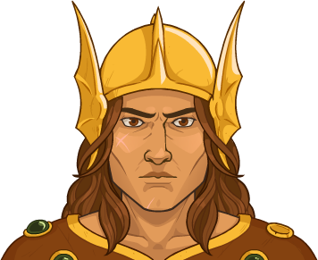Console Portrait
        
    
    
        
            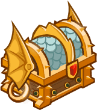Gold Chest Icon
        
        
            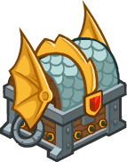Silver Chest Icon
        
    

[Back to Top](#top)

*Last Modified: {{ site.time }}*