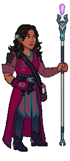
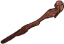
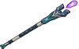
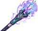
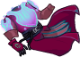
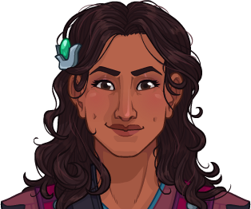
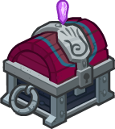

[Back to Main](index.md)

    
        
            
        
        
        Portrait
        
    
    
        
            
        
        
        Model
        
    

# Cazrin Varaith

Cazrin is the ray of sunshine in the party, the eternal optimist, the friendly ear or the shoulder to cry on. She is passionate about magic, knowledge, and learning, always experimenting or testing new theories. Growing up, Cazrin's family feared and forbade the study of magic because of an ancestress who misused her power, so Cazrin was forced to teach herself and eventually leave her family behind to pursue her dreams. Intelligent but inexperienced, she has embraced a life of adventuring to gather the thrills and experiences that as a child she could only read about in books.

# Basic Information

Cazrin Varaith will be a new champion in the Highharvestide event on 3 September 2025.

    
        
            **Seat**:
        
        
            10
        
        
            **Stat**
        
        
            **Value**
        
        
            **Day 1 Trials**
        
        
            **Patrons**
        
    
    
        
            **Species**:
        
        
            Human
        
        
            **Strength**:
        
        
            8
        
        
            Yes (with Feat)
        
        
            Mirt
        
    
    
        
            **Class**:
        
        
            Wizard
        
        
            **Dexterity**:
        
        
            13
        
        
            Yes
        
        
            Vajra
        
    
    
        
            **Roles**:
        
        
            DPS / Support
        
        
            **Constitution**:
        
        
            14
        
        
            Yes
        
        
            Strahd
        
    
    
        
            **Age**:
        
        
            22
        
        
            **Intelligence**:
        
        
            18
        
        
            Yes
        
        
            Zariel (with Feat)
        
    
    
        
            **Gender**:
        
        
            Female
        
        
            **Wisdom**:
        
        
            13
        
        
            Yes
        
        
            Elminster
        
    
    
        
            **Alignment**:
        
        
            Chaotic Good
        
        
            **Charisma**:
        
        
            13
        
        
            Yes
        
        
            &nbsp;
        
    
    
        
            **Affiliation**:
        
        
            The Fallbacks
        
        
            **Total**:
        
        
            79
        
        
            Champion ID:
        
        
            166
        
    

# Formation

    <svg xmlns="http://www.w3.org/2000/svg" id="Cazrin" fill="#aaa" data-formationName="Cazrin" data-campaignName="Highharvestide" width="319" height="140"><circle cx="175" cy="25" r="15"/><circle cx="175" cy="65" r="15"/><circle cx="135" cy="85" r="15"/><circle cx="95" cy="25" r="15"/><circle cx="95" cy="65" r="15"/><circle cx="95" cy="105" r="15"/><circle cx="55" cy="45" r="15"/><circle cx="55" cy="125" r="15"/><circle cx="15" cy="65" r="15"/><circle cx="15" cy="105" r="15"/><text x="205" y="25" fill="#dcdcdc" font-size="25" font-family="Arial" font-weight="bold">Cazrin</text><text x="205" y="65" fill="#dcdcdc" font-size="15" font-family="Arial" font-weight="bold">Highharvestide</text></svg>

# Attacks

 **Base Attack: Magic Missile** (Magic)
> Cazrin fires 2 magic missiles at random enemies, preferring different targets if possible  
> Cooldown: 4.5s (Cap 1.125s)

<em>Raw Data</em>

<pre>
{
    "id": 891,
    "name": "Magic Missile",
    "description": "Cazrin fires 2 magic missiles at random enemies, preferring different targets if possible",
    "long_description": "",
    "graphic_id": 27105,
    "target": "random",
    "num_targets": 2,
    "aoe_radius": 0,
    "damage_modifier": 1,
    "cooldown": 4.5,
    "animations": [
        {
            "type": "ranged_attack",
            "projectile": "magic_missile",
            "shoot_frame": 10,
            "shoot_offset_x": 55,
            "shoot_offset_y": -155,
            "projectile_delay": 0.1,
            "projectile_count": 2,
            "shoot_sound": 149,
            "hit_sound": 133,
            "projectile_details": {
                "projectile_graphic_id": 27105,
                "impact_offset_y": -45,
                "trail_tint": "#c999c3",
                "impact_tint": "#c999c3"
            }
        }
    ],
    "tags": [
        "ranged",
        "multitarget"
    ],
    "damage_types": [
        "magic"
    ]
}
</pre>

 **Base Attack: Magic Missile** (Magic)
> Cazrin fires 3 magic missiles at random enemies, preferring different targets if possible  
> Cooldown: 4.5s (Cap 1.125s)

<em>Raw Data</em>

<pre>
{
    "id": 896,
    "name": "Magic Missile",
    "description": "Cazrin fires 3 magic missiles at random enemies, preferring different targets if possible",
    "long_description": "",
    "graphic_id": 27105,
    "target": "random",
    "num_targets": 3,
    "aoe_radius": 0,
    "damage_modifier": 1,
    "cooldown": 4.5,
    "animations": [
        {
            "type": "ranged_attack",
            "projectile": "magic_missile",
            "shoot_frame": 10,
            "shoot_offset_x": 55,
            "shoot_offset_y": -155,
            "projectile_delay": 0.1,
            "projectile_count": 3,
            "shoot_sound": 149,
            "hit_sound": 133,
            "projectile_details": {
                "projectile_graphic_id": 27105,
                "impact_offset_y": -45,
                "trail_tint": "#c999c3",
                "impact_tint": "#c999c3"
            }
        }
    ],
    "tags": [
        "ranged",
        "multitarget"
    ],
    "damage_types": [
        "magic"
    ]
}
</pre>

 **Base Attack: Magic Missile** (Magic)
> Cazrin fires 4 magic missiles at random enemies, preferring different targets if possible  
> Cooldown: 4.5s (Cap 1.125s)

<em>Raw Data</em>

<pre>
{
    "id": 897,
    "name": "Magic Missile",
    "description": "Cazrin fires 4 magic missiles at random enemies, preferring different targets if possible",
    "long_description": "",
    "graphic_id": 27105,
    "target": "random",
    "num_targets": 4,
    "aoe_radius": 0,
    "damage_modifier": 1,
    "cooldown": 4.5,
    "animations": [
        {
            "type": "ranged_attack",
            "projectile": "magic_missile",
            "shoot_frame": 10,
            "shoot_offset_x": 55,
            "shoot_offset_y": -155,
            "projectile_delay": 0.1,
            "projectile_count": 4,
            "shoot_sound": 149,
            "hit_sound": 133,
            "projectile_details": {
                "projectile_graphic_id": 27105,
                "impact_offset_y": -45,
                "trail_tint": "#c999c3",
                "impact_tint": "#c999c3"
            }
        }
    ],
    "tags": [
        "ranged",
        "multitarget"
    ],
    "damage_types": [
        "magic"
    ]
}
</pre>

 **Ultimate Attack: Fallback Fireball** (Level: 0)
> Cazrin attacks all enemies with her version of a fireball.  
> Cooldown: 360s (Cap 90s)

<em>Raw Data</em>

<pre>
{
    "id": 892,
    "name": "Fallback Fireball",
    "description": "Cazrin attacks all enemies with a fireball.",
    "long_description": "Cazrin attacks all enemies with her version of a fireball.",
    "graphic_id": 27188,
    "target": "all",
    "num_targets": 1,
    "aoe_radius": 0,
    "damage_modifier": 0.03,
    "cooldown": 360,
    "animations": [
        {
            "type": "ultimate_attack",
            "ultimate": "cazrin",
            "projectile_data": {
                "type": "ranged_attack",
                "shoot_offset_y": -215,
                "shoot_offset_x": 165,
                "shoot_frame": 29,
                "shoot_sound": 149,
                "hit_sound": 133,
                "projectile_details": {
                    "hash": "7081d5ba41d98b53cc07844a3a0a219d",
                    "projectile_speed": 1500,
                    "projectile_graphic_id": 27104,
                    "impact_graphic_id": 27466,
                    "smoke_graphic_id": 446,
                    "explosion_graphic_id": 27465
                }
            },
            "damage_frame": 8
        }
    ],
    "tags": [
        "ranged",
        "ultimate"
    ],
    "damage_types": [
        "magic"
    ]
}
</pre>

# Abilities

 **Uggie!** (Level: 0)
> Uggie joins the party, starting next to Cazrin unless she's already in the formation next to another Fallbacks Champion. Uggie increases the damage of all non-adjacent Champions by 100%.

<em>Raw Data</em>

<pre>
{
    "id": 17672,
    "hero_id": 166,
    "required_level": 0,
    "required_upgrade_id": 0,
    "upgrade_type": "unlock_ability",
    "effect": "effect_def,2412",
    "static_dps_mult": null,
    "default_enabled": 1,
    "name": "Uggie!"
}
{
    "id": 2412,
    "flavour_text": "",
    "description": {
        "desc": "Uggie joins the party, starting next to Cazrin unless she's already in the formation next to another Fallbacks Champion. Uggie increases the damage of all non-adjacent Champions by $amount%."
    },
    "effect_keys": [
        {
            "effect_string": "uggie_handler,100",
            "off_when_benched": true,
            "uggie_roaming_disable_index": 1,
            "uggie_priority": 3,
            "call_uggie_ult_id": 893,
            "united_strike_ult_id": 894,
            "use_computed_amount_for_description": true,
            "uggie_buff_effect_id": 2366,
            "reload_buff_def_upgrade_ids": [
                17681
            ]
        },
        {
            "effect_string": "disallow_roaming_familiar_ult_trigger",
            "apply_manually": true
        }
    ],
    "requirements": "",
    "graphic_id": 27102,
    "large_graphic_id": 27102,
    "properties": {
        "is_formation_ability": true,
        "owner_use_outgoing_description": true,
        "indexed_effect_properties": true,
        "per_effect_index_bonuses": true,
        "default_bonus_index": 0
    }
}
</pre>

 **Library of Lore** (Level: 10)
> Whenever a boss is defeated for the first time in an adventure, it drops a Book that Cazrin collects. Subsequent kills of the same boss have a 10% chance of dropping an additional Book. The maximum number of Books that can be collected during a single adventure is the highest area reached divided by 5, rounded down. Cazrin keeps track of both the number of Books she has collected in the current adventure, as well as the size of her Library, which is the number of Books she has collected across all adventures. Cazrin's damage is increased by 10% for each book in her Library, stacking additively. Each time her Library reaches a new order of magnitude, the base buff is multiplicatively increased by 100%.

ⓘ *Note: This ability is prestack.*

<em>Raw Data</em>

<pre>
{
    "id": 17673,
    "hero_id": 166,
    "required_level": 10,
    "required_upgrade_id": 0,
    "upgrade_type": "unlock_ability",
    "effect": "effect_def,2413",
    "static_dps_mult": null,
    "default_enabled": 1,
    "name": "Library of Lore",
    "tip_text": "Cazrin collects books that bosses drop, which increases her damage and her library of books persists between resets."
}
{
    "id": 2413,
    "flavour_text": "",
    "description": {
        "desc": "Whenever a boss is defeated for the first time in an adventure, it drops a Book that Cazrin collects. Subsequent kills of the same boss have a $chance% chance of dropping an additional Book. The maximum number of Books that can be collected during a single adventure is the highest area reached divided by $max_book_divisor, rounded down. Cazrin keeps track of both the number of Books she has collected in the current adventure, as well as the size of her Library, which is the number of Books she has collected across all adventures. Cazrin's damage is increased by $(amount___2)% for each book in her Library, stacking additively. Each time her Library reaches a new order of magnitude, the base buff is multiplicatively increased by $(amount___5)%.",
        "post": {
            "conditions": [
                {
                    "condition": "not static_desc",
                    "desc": "^^Books Collected This Adventure: $(stat_value cazrin_books_collected_this_adventure 1 none) (max $cazrin_library_of_lore_max_books)"
                }
            ]
        }
    },
    "effect_keys": [
        {
            "effect_string": "library_of_lore_handler,1",
            "max_book_divisor": 5,
            "chance": 10,
            "off_when_benched": true
        },
        {
            "effect_string": "pre_stack,10",
            "skip_effect_key_desc": true
        },
        {
            "effect_string": "hero_dps_multiplier_add,10",
            "apply_manually": true,
            "amount_expr": "upgrade_amount(17673,1)",
            "stacks_multiply": false,
            "stacks_on_trigger": "will_manually_stack",
            "stack_title": "Books Collected",
            "show_stacks": true,
            "show_bonus": true
        },
        {
            "effect_string": "buff_upgrade,100,17673,1",
            "amount_expr": "upgrade_amount(17673,5)",
            "stacks_multiply": true,
            "stacks_on_trigger": "will_manually_stack",
            "apply_manually": true
        },
        {
            "effect_string": "pre_stack,100",
            "skip_effect_key_desc": true
        }
    ],
    "requirements": "",
    "graphic_id": 27173,
    "large_graphic_id": 27166,
    "properties": {
        "is_formation_ability": true,
        "owner_use_outgoing_description": true,
        "indexed_effect_properties": true,
        "per_effect_index_bonuses": true,
        "default_bonus_index": 1
    }
}
</pre>

 **Sunny Disposition** (Level: 30)
> Cazrin increases the damage of all Champions in her column (including herself) and the columns in front of her by 100%.

<em>Upgrade Data</em>

<pre>
Upgrades:
       80: 100%
      120: 100%
      200: 100%
      250: 100%
      300: 100%
      380: 100%
      480: 100%
      580: 100%
      680: 100%
      780: 100%
      900: 100%
    1,010: 100%
    1,120: 100%
    1,240: 100%
    1,350: 100%
    1,460: 100%
    1,570: 100%
    1,690: 100%
    1,800: 100%
    1,920: 100%

    Total Upgrade Bonus: 1.05e08%
</pre>

<em>Raw Data</em>

<pre>
{
    "id": 17674,
    "hero_id": 166,
    "required_level": 30,
    "required_upgrade_id": 0,
    "upgrade_type": "unlock_ability",
    "effect": "effect_def,2414",
    "static_dps_mult": null,
    "default_enabled": 1,
    "name": "Sunny Disposition",
    "tip_text": "Cazrin increases the damage of Champions in her column and the columns in front of her."
}
{
    "id": 2414,
    "flavour_text": "",
    "description": {
        "desc": "Cazrin increases the damage of all Champions in her column (including herself) and the columns in front of her by $amount%."
    },
    "effect_keys": [
        {
            "effect_string": "hero_dps_multiplier_mult,100",
            "off_when_benched": true,
            "targets": [
                "col_and_ahead"
            ]
        }
    ],
    "requirements": "",
    "graphic_id": 27175,
    "large_graphic_id": 27168,
    "properties": {
        "is_formation_ability": true,
        "owner_use_outgoing_description": true,
        "indexed_effect_properties": true,
        "per_effect_index_bonuses": true,
        "default_bonus_index": 0
    }
}
{
    "id": 17854,
    "hero_id": 166,
    "required_level": 80,
    "required_upgrade_id": 0,
    "upgrade_type": "upgrade_ability",
    "effect": "buff_upgrade,100,17674",
    "static_dps_mult": null,
    "default_enabled": 1,
    "name": ""
}
{
    "id": 17982,
    "hero_id": 166,
    "required_level": 120,
    "required_upgrade_id": 0,
    "upgrade_type": "upgrade_ability",
    "effect": "buff_upgrade,100,17674",
    "static_dps_mult": null,
    "default_enabled": 1,
    "name": ""
}
{
    "id": 17986,
    "hero_id": 166,
    "required_level": 200,
    "required_upgrade_id": 0,
    "upgrade_type": "upgrade_ability",
    "effect": "buff_upgrade,100,17674",
    "static_dps_mult": null,
    "default_enabled": 1,
    "name": ""
}
{
    "id": 17988,
    "hero_id": 166,
    "required_level": 250,
    "required_upgrade_id": 0,
    "upgrade_type": "upgrade_ability",
    "effect": "buff_upgrade,100,17674",
    "static_dps_mult": null,
    "default_enabled": 1,
    "name": ""
}
{
    "id": 17991,
    "hero_id": 166,
    "required_level": 300,
    "required_upgrade_id": 0,
    "upgrade_type": "upgrade_ability",
    "effect": "buff_upgrade,100,17674",
    "static_dps_mult": null,
    "default_enabled": 1,
    "name": ""
}
{
    "id": 17994,
    "hero_id": 166,
    "required_level": 380,
    "required_upgrade_id": 0,
    "upgrade_type": "upgrade_ability",
    "effect": "buff_upgrade,100,17674",
    "static_dps_mult": null,
    "default_enabled": 1,
    "name": ""
}
{
    "id": 17997,
    "hero_id": 166,
    "required_level": 480,
    "required_upgrade_id": 0,
    "upgrade_type": "upgrade_ability",
    "effect": "buff_upgrade,100,17674",
    "static_dps_mult": null,
    "default_enabled": 1,
    "name": ""
}
{
    "id": 18000,
    "hero_id": 166,
    "required_level": 580,
    "required_upgrade_id": 0,
    "upgrade_type": "upgrade_ability",
    "effect": "buff_upgrade,100,17674",
    "static_dps_mult": null,
    "default_enabled": 1,
    "name": ""
}
{
    "id": 18003,
    "hero_id": 166,
    "required_level": 680,
    "required_upgrade_id": 0,
    "upgrade_type": "upgrade_ability",
    "effect": "buff_upgrade,100,17674",
    "static_dps_mult": null,
    "default_enabled": 1,
    "name": ""
}
{
    "id": 18006,
    "hero_id": 166,
    "required_level": 780,
    "required_upgrade_id": 0,
    "upgrade_type": "upgrade_ability",
    "effect": "buff_upgrade,100,17674",
    "static_dps_mult": null,
    "default_enabled": 1,
    "name": ""
}
{
    "id": 18010,
    "hero_id": 166,
    "required_level": 900,
    "required_upgrade_id": 0,
    "upgrade_type": "upgrade_ability",
    "effect": "buff_upgrade,100,17674",
    "static_dps_mult": null,
    "default_enabled": 1,
    "name": ""
}
{
    "id": 18013,
    "hero_id": 166,
    "required_level": 1010,
    "required_upgrade_id": 0,
    "upgrade_type": "upgrade_ability",
    "effect": "buff_upgrade,100,17674",
    "static_dps_mult": null,
    "default_enabled": 1,
    "name": ""
}
{
    "id": 18016,
    "hero_id": 166,
    "required_level": 1120,
    "required_upgrade_id": 0,
    "upgrade_type": "upgrade_ability",
    "effect": "buff_upgrade,100,17674",
    "static_dps_mult": null,
    "default_enabled": 1,
    "name": ""
}
{
    "id": 18018,
    "hero_id": 166,
    "required_level": 1240,
    "required_upgrade_id": 0,
    "upgrade_type": "upgrade_ability",
    "effect": "buff_upgrade,100,17674",
    "static_dps_mult": null,
    "default_enabled": 1,
    "name": ""
}
{
    "id": 18021,
    "hero_id": 166,
    "required_level": 1350,
    "required_upgrade_id": 0,
    "upgrade_type": "upgrade_ability",
    "effect": "buff_upgrade,100,17674",
    "static_dps_mult": null,
    "default_enabled": 1,
    "name": ""
}
{
    "id": 18023,
    "hero_id": 166,
    "required_level": 1460,
    "required_upgrade_id": 0,
    "upgrade_type": "upgrade_ability",
    "effect": "buff_upgrade,100,17674",
    "static_dps_mult": null,
    "default_enabled": 1,
    "name": ""
}
{
    "id": 18025,
    "hero_id": 166,
    "required_level": 1570,
    "required_upgrade_id": 0,
    "upgrade_type": "upgrade_ability",
    "effect": "buff_upgrade,100,17674",
    "static_dps_mult": null,
    "default_enabled": 1,
    "name": ""
}
{
    "id": 18027,
    "hero_id": 166,
    "required_level": 1690,
    "required_upgrade_id": 0,
    "upgrade_type": "upgrade_ability",
    "effect": "buff_upgrade,100,17674",
    "static_dps_mult": null,
    "default_enabled": 1,
    "name": ""
}
{
    "id": 18029,
    "hero_id": 166,
    "required_level": 1800,
    "required_upgrade_id": 0,
    "upgrade_type": "upgrade_ability",
    "effect": "buff_upgrade,100,17674",
    "static_dps_mult": null,
    "default_enabled": 1,
    "name": ""
}
{
    "id": 18032,
    "hero_id": 166,
    "required_level": 1920,
    "required_upgrade_id": 0,
    "upgrade_type": "upgrade_ability",
    "effect": "buff_upgrade,100,17674",
    "static_dps_mult": null,
    "default_enabled": 1,
    "name": ""
}
</pre>

 **Unctuous Uggie** (Level: 60)
> Uggie's buff is increased by 400% when Cazrin is in the formation.

<em>Raw Data</em>

<pre>
{
    "id": 17675,
    "hero_id": 166,
    "required_level": 60,
    "required_upgrade_id": 0,
    "upgrade_type": "unlock_ability",
    "effect": "effect_def,2415",
    "static_dps_mult": null,
    "default_enabled": 1,
    "name": "Unctuous Uggie"
}
{
    "id": 2415,
    "flavour_text": "",
    "description": {
        "desc": "Uggie's buff is increased by $amount% when Cazrin is in the formation."
    },
    "effect_keys": [
        {
            "effect_string": "unleash_uggie_contribution,400",
            "off_when_benched": true,
            "show_bonus": false
        }
    ],
    "requirements": "",
    "graphic_id": 27176,
    "large_graphic_id": 27169,
    "properties": {
        "is_formation_ability": true,
        "owner_use_outgoing_description": true,
        "indexed_effect_properties": true,
        "per_effect_index_bonuses": true,
        "default_bonus_index": 0
    }
}
</pre>

 **Fallback Fireball** (Level: 100)
> Cazrin attacks all enemies with her version of a massive fireball, dealing ultimate damage to each one.

<em>Raw Data</em>

<pre>
{
    "id": 17683,
    "hero_id": 166,
    "required_level": 100,
    "required_upgrade_id": 0,
    "upgrade_type": "unlock_ultimate",
    "effect": "effect_def,2423",
    "static_dps_mult": null,
    "default_enabled": 1,
    "name": "Fallback Fireball"
}
{
    "id": 2423,
    "flavour_text": "",
    "description": {
        "desc": "Cazrin attacks all enemies with her version of a massive fireball, dealing ultimate damage to each one."
    },
    "effect_keys": [
        {
            "effect_string": "set_ultimate_attack,892"
        }
    ],
    "requirements": "",
    "graphic_id": 27188,
    "large_graphic_id": 27188,
    "properties": {
        "is_formation_ability": true,
        "owner_use_outgoing_description": true,
        "indexed_effect_properties": true,
        "per_effect_index_bonuses": true,
        "default_bonus_index": 0
    }
}
</pre>

 **Mage Armor** (Level: 130)
> The first time anyone in the formation takes damage in each area, Cazrin casts Mage Armor on herself. Champions affected by Mage Armor decrease the damage they take by 25%.

<em>Raw Data</em>

<pre>
{
    "id": 17676,
    "hero_id": 166,
    "required_level": 130,
    "required_upgrade_id": 0,
    "upgrade_type": "unlock_ability",
    "effect": "effect_def,2416",
    "static_dps_mult": null,
    "default_enabled": 1,
    "name": "Mage Armor"
}
{
    "id": 2416,
    "flavour_text": "",
    "description": {
        "desc": "The first time anyone in the formation takes damage in each area, Cazrin casts Mage Armor on herself. Champions affected by Mage Armor decrease the damage they take by $(amount___2)%."
    },
    "effect_keys": [
        {
            "effect_string": "apply_effects_at_stacks",
            "off_when_benched": true,
            "show_description": false,
            "apply_effect_stack_amounts": [
                1,
                1
            ],
            "max_stacks": 1,
            "stacks_on_trigger": "hero_damaged",
            "more_triggers": [
                {
                    "trigger": "area_changed",
                    "action": {
                        "type": "reset"
                    }
                }
            ]
        },
        {
            "effect_string": "damage_reduction,25",
            "targets": [
                "self_slot"
            ],
            "apply_manually": true
        },
        {
            "effect_string": "animation_synced_overlay_on_stat",
            "stat": "cazrin_books_collected_this_adventure",
            "instanced": true,
            "stat_keys": [
                0,
                120
            ],
            "graphics": [
                "mage_armor_graphic_id",
                "empowered_mage_armor_graphic_id"
            ],
            "default_graphic_ids": [
                27351,
                27352
            ],
            "apply_manually": true
        }
    ],
    "requirements": "",
    "graphic_id": 27174,
    "large_graphic_id": 27167,
    "properties": {
        "is_formation_ability": true,
        "owner_use_outgoing_description": true,
        "indexed_effect_properties": true,
        "per_effect_index_bonuses": true,
        "default_bonus_index": 1
    }
}
</pre>

 **In Search of Knowledge** (Level: 160)
> Cazrin's attacks and abilities gain additional effects based on the number of Books that she has collected in the current adventure.
- 10+ Books Cazrin fires an additional Magic Missile with her base attack.
 - 40+ Books Increase the effect of Sunny Disposition by 5% for each Book she has collected in the current adventure, stacking multiplicatively.
 - 80+ Books Cazrin fires an additional Magic Missile with her base attack. 
 - 120+ Books When triggered, Mage Armor is now cast on all Champions in the formation instead of just Cazrin.
 - 160+ Books Increase the effect of Unctuous Uggie by 1% for each Book Cazrin has collected in the current adventure, stacking additively.
 - 200+ Books Support Champions affected by Mage Armor have a 40% chance to deal an additional 5 seconds of BUD damage with each normal attack hit.
 - 240+ Books Mage Armor's damage prevention is increased to 50%.
 - 300+ Books For each Tanking Champion affected by Mage Armor, the effect of Sunny Disposition is increased by 400%, stacking multiplicatively.

<em>Raw Data</em>

<pre>
{
    "id": 17677,
    "hero_id": 166,
    "required_level": 160,
    "required_upgrade_id": 0,
    "upgrade_type": "unlock_ability",
    "effect": "effect_def,2417",
    "static_dps_mult": null,
    "default_enabled": 1,
    "name": "In Search of Knowledge"
}
{
    "id": 2417,
    "flavour_text": "",
    "description": {
        "desc": "Cazrin's attacks and abilities gain additional effects based on the number of Books that she has collected in the current adventure",
        "post": {
            "conditions": [
                {
                    "condition": "not static_desc",
                    "desc": ":^^ - 10+ Books: Cazrin fires an additional Magic Missile with her base attack.^^ - 40+ Books: Increase the effect of Sunny Disposition by $(amount___10)% for each Book she has collected in the current adventure, stacking multiplicatively.^^ - 80+ Books: Cazrin fires an additional Magic Missile with her base attack. ^^ - 120+ Books: When triggered, Mage Armor is now cast on all Champions in the formation instead of just Cazrin.^^ - 160+ Books: Increase the effect of Unctuous Uggie by $(amount___6)% for each Book Cazrin has collected in the current adventure, stacking additively.^^ - 200+ Books: Support Champions affected by Mage Armor have a $(chance___7)% chance to deal an additional 5 seconds of BUD damage with each normal attack hit.^^ - 240+ Books: Mage Armor's damage prevention is increased to $(amount_desc___8)%.^^ - 300+ Books: For each Tanking Champion affected by Mage Armor, the effect of Sunny Disposition is increased by $(amount___9)%, stacking multiplicatively."
                }
            ]
        }
    },
    "effect_keys": [
        {
            "effect_string": "apply_effects_at_stacks",
            "off_when_benched": true,
            "show_description": false,
            "apply_effect_stack_amounts": [
                10,
                40,
                80,
                120,
                160,
                200,
                240,
                300,
                0
            ],
            "stacks_on_trigger": "will_stack_manually",
            "stacks_from_amount_func": "get_stat",
            "instance_stat": true,
            "stat": "cazrin_books_collected_this_adventure",
            "amount_updated_listeners": [
                "stat_changed,cazrin_books_collected_this_adventure",
                "slot_changed"
            ],
            "stack_title": "Books Collected This Adventure",
            "show_stacks": true
        },
        {
            "effect_string": "change_base_attack,896",
            "apply_manually": true
        },
        {
            "effect_string": "buff_upgrade,5,17674",
            "amount_expr": "upgrade_amount(17677,9)",
            "stacks_from_amount_func": "get_stat",
            "stacks_multiply": true,
            "instance_stat": true,
            "stat": "cazrin_books_collected_this_adventure",
            "amount_updated_listeners": [
                "stat_changed,cazrin_books_collected_this_adventure",
                "slot_changed"
            ],
            "apply_manually": true
        },
        {
            "effect_string": "change_base_attack,897",
            "apply_manually": true
        },
        {
            "effect_string": "change_upgrade_data,17676,1",
            "data": {
                "targets": [
                    "all"
                ]
            },
            "apply_manually": true
        },
        {
            "effect_string": "buff_upgrade_add_then_mult,1,17675",
            "amount_func": "add",
            "stack_func": "get_stat",
            "stacks_multiply": false,
            "instance_stat": true,
            "stat": "cazrin_books_collected_this_adventure",
            "amount_updated_listeners": [
                "stat_changed,cazrin_books_collected_this_adventure",
                "slot_changed"
            ],
            "apply_manually": true
        },
        {
            "effect_string": "add_monster_hit_effects,5",
            "chance": 40,
            "monster_effect": {
                "effect_string": "ki_explosion,$amount,1,1"
            },
            "after_damage": true,
            "targets": [
                "all"
            ],
            "filter_targets": [
                {
                    "type": "by_tags",
                    "tags": "support"
                },
                {
                    "type": "affected_by_upgrade",
                    "upgrade_id": 17676
                }
            ],
            "apply_manually": true
        },
        {
            "effect_string": "change_upgrade_data,17676,1",
            "data": {
                "amount": 50
            },
            "amount_desc": 50,
            "apply_manually": true
        },
        {
            "effect_string": "buff_upgrade,400,17674",
            "amount_func": "mult",
            "stack_func": "per_hero_attribute",
            "per_hero_expr": "HasTag(`tanking`) && HasEffectByID(2416) && GetUpgradeUnlocked(17676)",
            "amount_updated_listeners": [
                "stacks_changed"
            ],
            "changing_stack_upgade_ids": [
                17676
            ],
            "apply_manually": true
        },
        {
            "effect_string": "pre_stack,5",
            "skip_effect_key_desc": true
        }
    ],
    "requirements": "",
    "graphic_id": 27172,
    "large_graphic_id": 27165,
    "properties": {
        "is_formation_ability": true,
        "owner_use_outgoing_description": true,
        "indexed_effect_properties": true,
        "per_effect_index_bonuses": true,
        "default_bonus_index": 0
    }
}
</pre>

# Specialisations

 **Self Taught** (Level: 180)
> Cazrin increases the damage bonus of Sunny Disposition by 100% for each Fallbacks Champion and/or Champions with a Melee and/or Ranged base attack in the formation, stacking multiplicatively.

ⓘ *Note: This ability is prestack.*

<em>Raw Data</em>

<pre>
{
    "id": 17678,
    "hero_id": 166,
    "required_level": 180,
    "required_upgrade_id": 0,
    "upgrade_type": "unlock_ability",
    "effect": "effect_def,2418",
    "static_dps_mult": null,
    "default_enabled": 1,
    "name": "Self Taught",
    "specialization_name": "Self Taught",
    "specialization_description": "Forbidden by her family to study magic, Cazrin secretly taught herself the arcane arts.",
    "specialization_graphic_id": 27184
}
{
    "id": 2418,
    "flavour_text": "",
    "description": {
        "desc": "Cazrin increases the damage bonus of Sunny Disposition by $amount% for each Fallbacks Champion and/or Champions with a Melee and/or Ranged base attack in the formation, stacking multiplicatively."
    },
    "effect_keys": [
        {
            "effect_string": "pre_stack,100",
            "skip_effect_key_desc": true
        },
        {
            "effect_string": "buff_upgrade,100,17674",
            "amount_expr": "upgrade_amount(17678,0)",
            "off_when_benched": true,
            "amount_func": "mult",
            "stack_func": "per_hero_attribute",
            "per_hero_expr": "HasTag(`fallbacks`) || has_base_attack_dmg_type_melee || has_base_attack_dmg_type_ranged",
            "amount_updated_listeners": [
                "slot_changed",
                "hero_tags_changed"
            ],
            "show_bonus": true
        }
    ],
    "requirements": "",
    "graphic_id": 27184,
    "large_graphic_id": 27184,
    "properties": {
        "is_formation_ability": true,
        "owner_use_outgoing_description": true,
        "indexed_effect_properties": true,
        "per_effect_index_bonuses": true,
        "default_bonus_index": 0,
        "spec_option_post_apply_info": "Qualified Champions: $num_stacks___2"
    }
}
</pre>

 **Ancestor's Shadow** (Level: 180)
> Cazrin increases the damage bonus of Sunny Disposition by 100% for each Fallbacks Champion and/or Good Champion in the formation, stacking multiplicatively.

ⓘ *Note: This ability is prestack.*

<em>Raw Data</em>

<pre>
{
    "id": 17679,
    "hero_id": 166,
    "required_level": 180,
    "required_upgrade_id": 0,
    "upgrade_type": "unlock_ability",
    "effect": "effect_def,2419",
    "static_dps_mult": null,
    "default_enabled": 1,
    "name": "Ancestor's Shadow",
    "specialization_name": "Ancestor's Shadow",
    "specialization_description": "Cazrin strives to use her magic for good and not follow her ancestor's twisted path.",
    "specialization_graphic_id": 27182
}
{
    "id": 2419,
    "flavour_text": "",
    "description": {
        "desc": "Cazrin increases the damage bonus of Sunny Disposition by $amount% for each Fallbacks Champion and/or Good Champion in the formation, stacking multiplicatively."
    },
    "effect_keys": [
        {
            "effect_string": "pre_stack,100",
            "skip_effect_key_desc": true
        },
        {
            "effect_string": "buff_upgrade,100,17674",
            "amount_expr": "upgrade_amount(17679,0)",
            "off_when_benched": true,
            "amount_func": "mult",
            "stack_func": "per_hero_attribute",
            "per_hero_expr": "HasTag(`fallbacks`) || HasTag(`good`)",
            "amount_updated_listeners": [
                "slot_changed",
                "hero_tags_changed"
            ],
            "show_bonus": true
        }
    ],
    "requirements": "",
    "graphic_id": 27182,
    "large_graphic_id": 27182,
    "properties": {
        "is_formation_ability": true,
        "owner_use_outgoing_description": true,
        "indexed_effect_properties": true,
        "per_effect_index_bonuses": true,
        "default_bonus_index": 0,
        "spec_option_post_apply_info": "Qualified Champions: $num_stacks___2"
    }
}
</pre>

 **Lost in the Library** (Level: 180)
> Whenever a boss drops a Book, Cazrin collects 3 Books. The maximum number of Books she can collect during this adventure is tripled, but In Search of Knowledge's per Book damage boost to Sunny Disposition is reduced from 5% to 1.65%.

<em>Raw Data</em>

<pre>
{
    "id": 17680,
    "hero_id": 166,
    "required_level": 180,
    "required_upgrade_id": 0,
    "upgrade_type": "unlock_ability",
    "effect": "effect_def,2420",
    "static_dps_mult": null,
    "default_enabled": 1,
    "name": "Lost in the Library",
    "specialization_name": "Lost in the Library",
    "specialization_description": "Her hunger for knowledge outweighs ambition; Cazrin would rather read than rule.",
    "specialization_graphic_id": 27183
}
{
    "id": 2420,
    "flavour_text": "",
    "description": {
        "desc": "Whenever a boss drops a Book, Cazrin collects $amount_desc Books. The maximum number of Books she can collect during this adventure is tripled, but In Search of Knowledge's per Book damage boost to Sunny Disposition is reduced from 5% to $(amount_desc___2)%."
    },
    "effect_keys": [
        {
            "effect_string": "change_upgrade_data,17673,0",
            "off_when_benched": true,
            "data": {
                "amount": 3
            },
            "amount_desc": 3
        },
        {
            "effect_string": "change_upgrade_data,17677,9",
            "off_when_benched": true,
            "data": {
                "amount": 1.65
            },
            "amount_desc": 1.65
        }
    ],
    "requirements": "",
    "graphic_id": 27183,
    "large_graphic_id": 27183,
    "properties": {
        "is_formation_ability": true,
        "owner_use_outgoing_description": true,
        "indexed_effect_properties": true,
        "per_effect_index_bonuses": true,
        "default_bonus_index": 0
    }
}
</pre>

 **Signature Smell** (Level: 240)
> When Uggie is with Cazrin, each damage increase that Uggie! would normally apply to other members of the formation instead applies to Cazrin herself, stacking multiplicatively.

<em>Raw Data</em>

<pre>
{
    "id": 17681,
    "hero_id": 166,
    "required_level": 240,
    "required_upgrade_id": 0,
    "upgrade_type": "unlock_ability",
    "effect": "effect_def,2421",
    "static_dps_mult": null,
    "default_enabled": 1,
    "name": "Signature Smell",
    "specialization_name": "Signature Smell",
    "specialization_description": "The worse Uggie smells, the harder Cazrin hits. A disturbing symbiosis.",
    "specialization_graphic_id": 27185
}
{
    "id": 2421,
    "flavour_text": "",
    "description": {
        "desc": "When Uggie is with Cazrin, each damage increase that Uggie! would normally apply to other members of the formation instead applies to Cazrin herself, stacking multiplicatively."
    },
    "effect_keys": [
        {
            "effect_string": "cazrin_uggie_spec_handler",
            "off_when_benched": true,
            "spec_effect_index": 1
        },
        {
            "effect_string": "change_upgrade_data,17672,0",
            "apply_manually": true,
            "data": {
                "uggie_buff_effect_id": 2424
            }
        }
    ],
    "requirements": "",
    "graphic_id": 27185,
    "large_graphic_id": 27185,
    "properties": {
        "is_formation_ability": true,
        "owner_use_outgoing_description": true,
        "indexed_effect_properties": true,
        "per_effect_index_bonuses": true,
        "default_bonus_index": 0
    }
}
</pre>

 **Smell Mastery** (Level: 240)
> When Uggie is with Cazrin, In Search of Knowledge's per-Book bonus for Sunny Disposition is increased by 100%.

<em>Raw Data</em>

<pre>
{
    "id": 17682,
    "hero_id": 166,
    "required_level": 240,
    "required_upgrade_id": 0,
    "upgrade_type": "unlock_ability",
    "effect": "effect_def,2422",
    "static_dps_mult": null,
    "default_enabled": 1,
    "name": "Smell Mastery",
    "specialization_name": "Smell Mastery",
    "specialization_description": "It takes true mastery to turn a smell that bad into a support strategy.",
    "specialization_graphic_id": 27186
}
{
    "id": 2422,
    "flavour_text": "",
    "description": {
        "desc": "When Uggie is with Cazrin, In Search of Knowledge's per-Book bonus for Sunny Disposition is increased by $amount___2%."
    },
    "effect_keys": [
        {
            "effect_string": "cazrin_uggie_spec_handler",
            "off_when_benched": true,
            "spec_effect_index": 1
        },
        {
            "effect_string": "buff_upgrade,100,17677,9",
            "apply_manually": true
        }
    ],
    "requirements": "",
    "graphic_id": 27186,
    "large_graphic_id": 27186,
    "properties": {
        "is_formation_ability": true,
        "owner_use_outgoing_description": true,
        "indexed_effect_properties": true,
        "per_effect_index_bonuses": true,
        "default_bonus_index": 0
    }
}
</pre>

# Items

    
        
            **Icons**
        
        
            **Slot**
        
        
            **Epic Name**
        
        
            **Effect**
        
    
    
        
            ID: 3938**Walking Stick**It helps me get around.  All Champions damage +10%.<code>global_dps_multiplier_mult,10 allow_ge:true</code>ID: 3939**Standard Staff**It allows for arcane attunement, and that's about it.  All Champions damage +65%.<code>global_dps_multiplier_mult,65 allow_ge:true</code>ID: 3940**Enhanced Staff**Now we're ready to see some real magic.  All Champions damage +120%.<code>global_dps_multiplier_mult,120 allow_ge:true</code>ID: 3941**Wrath of Varaith**You hurt my friends. That was a mistake.  All Champions damage +230%.<code>global_dps_multiplier_mult,230 allow_ge:true</code>&nbsp;
        
        
            1
        
        
            Wrath of Varaith
        
        
            All Champions damage +230%.
        
    
    
        
            ID: 3942**Discarded Diary**My parents threw it out when they found it.  Increases the effect of Cazrin's Library of Lore ability by 25%. (Prestack)<code>buff_upgrade,25,17673 allow_ge:false</code>ID: 3943**Secret Diary**They never found this one.  Increases the effect of Cazrin's Library of Lore ability by 87.5%. (Prestack)<code>buff_upgrade,87.5,17673 allow_ge:false</code>ID: 3944**Animated Spellbook**I was a lonely child. I decided to make a friend.  Increases the effect of Cazrin's Library of Lore ability by 150%. (Prestack)<code>buff_upgrade,150,17673 allow_ge:false</code>ID: 3945**Keeper**Keeper? Please open to the page for Fireball, thank you.  Increases the effect of Cazrin's Library of Lore ability by 275%. (Prestack)<code>buff_upgrade,275,17673 allow_ge:false</code>&nbsp;
        
        
            2
        
        
            Keeper
        
        
            Increases the effect of Cazrin's Library of Lore ability by 275%. (Prestack)
        
    
    
        
            ID: 3946**Pointy Stick**For practice, when I was a child. It's all in the wrist.  Increases the effect of Cazrin's Sunny Disposition ability by 25%.<code>buff_upgrade,25,17674 allow_ge:false</code>ID: 3947**Makeshift Wand**At least it can handle cantrips, I think.  Increases the effect of Cazrin's Sunny Disposition ability by 87.5%.<code>buff_upgrade,87.5,17674 allow_ge:false</code>ID: 3948**Wand of Missiles**When you cannot afford to miss, accept no substitutes.  Increases the effect of Cazrin's Sunny Disposition ability by 150%.<code>buff_upgrade,150,17674 allow_ge:false</code>ID: 3949**Paired Wands**The red one is for offensive spells, the other for binding magic.  Increases the effect of Cazrin's Sunny Disposition ability by 275%.<code>buff_upgrade,275,17674 allow_ge:false</code>&nbsp;
        
        
            3
        
        
            Paired Wands
        
        
            Increases the effect of Cazrin's Sunny Disposition ability by 275%.
        
    
    
        
            ID: 3950**Rejected Rubbish**Just because Uggie eats garbage doesn't mean she can't have preferences.  Increases the effect of Cazrin's Unctuous Uggie ability by 25%.<code>buff_upgrade,25,17675 allow_ge:false</code>ID: 3951**Tasty Trash**Uggie! Snack time!  Increases the effect of Cazrin's Unctuous Uggie ability by 87.5%.<code>buff_upgrade,87.5,17675 allow_ge:false</code>ID: 3952**Candlekeep Chew Toy**Uggie, no! Not again!  Increases the effect of Cazrin's Unctuous Uggie ability by 150%.<code>buff_upgrade,150,17675 allow_ge:false</code>ID: 3953**Perfect Disguise**She'll look like a big, drooly sheepdog to anyone not paying attention.  Increases the effect of Cazrin's Unctuous Uggie ability by 275%.<code>buff_upgrade,275,17675 allow_ge:false</code>&nbsp;
        
        
            4
        
        
            Perfect Disguise
        
        
            Increases the effect of Cazrin's Unctuous Uggie ability by 275%.
        
    
    
        
            ID: 3954**Inconvenient Cloak**Why are there no pockets!?  Increases the effect of Cazrin's Self Taught and Ancestor's Shadow by 10%. (Prestack)<code>buff_upgrades,10,17678,17679 allow_ge:false</code>ID: 3955**Practical Robe**Acceptable covering for any adventuring mage.  Increases the effect of Cazrin's Self Taught and Ancestor's Shadow by 30%. (Prestack)<code>buff_upgrades,30,17678,17679 allow_ge:false</code>ID: 3956**Tailored Robe**Perfectly suited to my tastes. Now I'm ready for anything.  Increases the effect of Cazrin's Self Taught and Ancestor's Shadow by 50%. (Prestack)<code>buff_upgrades,50,17678,17679 allow_ge:false</code>ID: 3957**Mage Armored Robe**I'm not afraid to be in the thick of things when necessary.  Increases the effect of Cazrin's Self Taught and Ancestor's Shadow by 100%. (Prestack)<code>buff_upgrades,100,17678,17679 allow_ge:false</code>&nbsp;
        
        
            5
        
        
            Mage Armored Robe
        
        
            Increases the effect of Cazrin's Self Taught and Ancestor's Shadow by 100%. (Prestack)
        
    
    
        
            ID: 3958**Precarious Pile**Careful! They keep falling over!  Reduces the cooldown on Cazrin's Ultimate Attack by 9 seconds.<code>reduce_ultimate_cooldown,9 allow_ge:false</code>ID: 3959**Cazrin's Collection**This treasure trove was just rotting away! So many valuable texts!  Reduces the cooldown on Cazrin's Ultimate Attack by 18 seconds.<code>reduce_ultimate_cooldown,18 allow_ge:false</code>ID: 3960**Fancy Tea Set**It calms the nerves and soothes the soul.  Reduces the cooldown on Cazrin's Ultimate Attack by 36 seconds.<code>reduce_ultimate_cooldown,36 allow_ge:false</code>ID: 3961**Tavern Key**I know that I'm enough, just as I am.  Reduces the cooldown on Cazrin's Ultimate Attack by 90 seconds.<code>reduce_ultimate_cooldown,90 allow_ge:false</code>&nbsp;
        
        
            6
        
        
            Tavern Key
        
        
            Reduces the cooldown on Cazrin's Ultimate Attack by 90 seconds. Cap: 501 dull / 251 shiny / 126 golden.
        
    

<em>Item Names and Descriptions</em>

<pre>
Slot 1:
      Walking Stick: It helps me get around.
     Standard Staff: It allows for arcane attunement, and that's about it.
     Enhanced Staff: Now we're ready to see some real magic.
   Wrath of Varaith: You hurt my friends. That was a mistake.

Slot 2:
    Discarded Diary: My parents threw it out when they found it.
       Secret Diary: They never found this one.
 Animated Spellbook: I was a lonely child. I decided to make a friend.
             Keeper: Keeper? Please open to the page for Fireball, thank you.

Slot 3:
       Pointy Stick: For practice, when I was a child. It's all in the wrist.
     Makeshift Wand: At least it can handle cantrips, I think.
   Wand of Missiles: When you cannot afford to miss, accept no substitutes.
       Paired Wands: The red one is for offensive spells, the other for binding magic.

Slot 4:
   Rejected Rubbish: Just because Uggie eats garbage doesn't mean she can't have preferences.
        Tasty Trash: Uggie! Snack time!
Candlekeep Chew Toy: Uggie, no! Not again!
   Perfect Disguise: She'll look like a big, drooly sheepdog to anyone not paying attention.

Slot 5:
 Inconvenient Cloak: Why are there no pockets!?
     Practical Robe: Acceptable covering for any adventuring mage.
      Tailored Robe: Perfectly suited to my tastes. Now I'm ready for anything.
  Mage Armored Robe: I'm not afraid to be in the thick of things when necessary.

Slot 6:
    Precarious Pile: Careful! They keep falling over!
Cazrin's Collection: This treasure trove was just rotting away! So many valuable texts!
      Fancy Tea Set: It calms the nerves and soothes the soul.
         Tavern Key: I know that I'm enough, just as I am.
</pre>

 

# Feats

This list will only show feats that are going to be available on the release of this champion. The separate [Feats](feats.md) page may show others that could be available later if they exist.

    
        
            **Feat**
        
        
            **Effect**
        
        
            **Source**
        
    
    
        
            ID: 2279**Selflessness (Cazrin)**Sometimes you have to make sacrifices for the good of the group.<code>global_dps_multiplier_mult,10</code>Selflessness
        
        
            All Champions damage +10%.
        
        
            Free
        
    
    
        
            ID: 2280**Inspiring Leader (Cazrin)**You did it! That was brilliant! I shouldn't have doubted you!<code>global_dps_multiplier_mult,25</code>Inspiring Leader
        
        
            All Champions damage +25%.
        
        
            Gold Chest
        
    
    
        
            ID: 2281**Adept (Cazrin)**Imagine all the spells waiting to be discovered!<code>hero_dps_multiplier_mult,30</code>Adept
        
        
            Increases the damage of Cazrin by 30%.
        
        
            Free
        
    
    
        
            ID: 2282**Elementalist (Cazrin)**It's not the first time I've dealt with dangerous magic. This is my job.<code>hero_dps_multiplier_mult,60</code>Elementalist
        
        
            Increases the damage of Cazrin by 60%.
        
        
            12,500 Gems
        
    
    
        
            ID: 2283**Friend to Books (Cazrin)**To be honest, you had me at lost spellbook. I couldn't resist.<code>buff_upgrade,40,17673</code>Friend to Books
        
        
            Increases the effect of Cazrin's Library of Lore ability by 40%. (Prestack)
        
        
            Gold Chest
        
    
    
        
            ID: 2284**Rapid Analysis (Cazrin)**Having more knowledge is always better, even if you don't always like it.<code>buff_upgrade,100,17673,5</code>Rapid Analysis
        
        
            Increases the effect of Cazrin's Library of Lore order of magnitude buff by 100%.
        
        
            Event Bonus
        
    
    
        
            ID: 2285**Bright Side (Cazrin)**That was my favorite satchel! Oh well. I'll just get a new one.<code>buff_upgrade,20,17674</code>Bright Side
        
        
            Increases the effect of Cazrin's Sunny Disposition ability by 20%.
        
        
            Free
        
    
    
        
            ID: 2286**Optimistic Outlook (Cazrin)**You're not going to die. This potion is going to work. You're going to wake up.<code>buff_upgrade,40,17674</code>Optimistic Outlook
        
        
            Increases the effect of Cazrin's Sunny Disposition ability by 40%.
        
        
            12,500 Gems
        
    
    
        
            ID: 2287**Cazrin Person (Cazrin)**It's like breathing the inside of a corpse...<code>buff_upgrade,20,17675</code>Cazrin Person
        
        
            Increases the effect of Cazrin's Unctuous Uggie ability by 20%.
        
        
            Free
        
    
    
        
            ID: 2288**Cazrin Friend (Cazrin)**Do you think she actually understands what we're saying?<code>buff_upgrade,40,17675</code>Cazrin Friend
        
        
            Increases the effect of Cazrin's Unctuous Uggie ability by 40%.
        
        
            Gold Chest
        
    
    
        
            ID: 2289**Dangerous Magic (Cazrin)**I can get absorbed in my work sometimes, but I'm perfectly capable of sharing.<code>buff_upgrades,40,17678,17679</code>Dangerous Magic
        
        
            Increases the effect of Cazrin's Self Taught and Ancestor's Shadow by 40%. (Prestack)
        
        
            12,500 Gems
        
    
    
        
            ID: 2290**Forbidden Magic (Cazrin)**Knowledge should be shared by everyone, not hoarded by dragons.<code>buff_upgrades,80,17678,17679</code>Forbidden Magic
        
        
            Increases the effect of Cazrin's Self Taught and Ancestor's Shadow by 80%. (Prestack)
        
        
            3,830 Platinum 50,000 Gems
        
    
    
        
            ID: 2291**Heavy Lifter (Cazrin)**We all struggle. Why not struggle together and make the burden lighter?<code>increase_ability_score,str,2</code>Heavy Lifter
        
        
            Increases the Strength score of Cazrin by 2.
        
        
            Event Bonus
        
    

# Legendaries

* Increases the damage of all Champions by 100%.
* Increases the damage of all Female Champions by 125%.
* Increases the damage of all Human Champions by 150%.
* Increases the damage of all Champions with a CON score of 13 or higher by 150%.
* Increases the damage of all Champions by 30% for each Champion with a WIS score of 13 or higher in the formation.
* Increases the damage of all Chaotic Champions by 150%.

<em>DPS Applicable</em>

<pre>
     Arkhan: 3 / 6
    Artemis: 4 / 6
    Asharra: 3 / 6
      Azaka: 5 / 6
     Binwin: 3 / 6
   Birdsong: 3 / 6
Black Viper: 6 / 6
      Bobby: 4 / 6
 Catti-brie: 6 / 6
     Cazrin: 6 / 6
     D'hani: 5 / 6
  Dark Urge: 4 / 6
     Delina: 5 / 6
    Dhadius: 4 / 6
     Drizzt: 3 / 6
    Farideh: 4 / 6
        Fen: 5 / 6
      Grimm: 5 / 6
     Gromma: 4 / 6
       Ishi: 5 / 6
    Jaheira: 4 / 6
    Jamilah: 5 / 6
   Jarlaxle: 3 / 6
        Jim: 4 / 6
    Karlach: 5 / 6
        Kas: 4 / 6
       Kent: 3 / 6
      Krond: 4 / 6
       Krux: 3 / 6
    Lae'zel: 4 / 6
     Lucius: 3 / 6
      Makos: 3 / 6
      Minsc: 5 / 6
      NERDS: 4 / 6
     Nahara: 4 / 6
      Nixie: 5 / 6
     Orisha: 3 / 6
   Prudence: 5 / 6
      Strix: 5 / 6
     Warden: 3 / 6
    Warduke: 5 / 6
   Windfall: 5 / 6
       Wren: 4 / 6
      Zorbu: 4 / 6
</pre>

<em>Non-DPS Applicable</em>

<pre>
          Aila: 5 / 6
       Alyndra: 4 / 6
       Antrius: 5 / 6
         Avren: 4 / 6
          BBEG: 2 / 6
       Baeloth: 4 / 6
       Baldric: 2 / 6
        Beadle: 2 / 6
       Blooshi: 4 / 6
          Brig: 4 / 6
          Briv: 4 / 6
       Bruenor: 3 / 6
      Calliope: 5 / 6
       Celeste: 5 / 6
     Certainty: 3 / 6
       Corazón: 4 / 6
        Deekin: 3 / 6
       Desmond: 4 / 6
         Diana: 4 / 6
           Dob: 4 / 6
        Donaar: 4 / 6
    Dragonbait: 3 / 6
Dungeon Master: 4 / 6
      Dynaheir: 5 / 6
        Egbert: 4 / 6
          Eric: 4 / 6
       Evandra: 5 / 6
        Evelyn: 5 / 6
     Ezmerelda: 6 / 6
        Freely: 2 / 6
          Gale: 4 / 6
       Gazrick: 3 / 6
        Halsin: 3 / 6
          Hank: 3 / 6
      Hew Maan: 5 / 6
         Hitch: 4 / 6
         Imoen: 5 / 6
      Jang Sao: 3 / 6
      K'thriss: 3 / 6
         Kalix: 3 / 6
         Korth: 3 / 6
         Krull: 3 / 6
        Krydle: 4 / 6
       Lazaapz: 4 / 6
         Mehen: 3 / 6
          Melf: 3 / 6
      Merilwen: 4 / 6
      Minthara: 4 / 6
         Miria: 4 / 6
        Môrgæn: 4 / 6
        Nayeli: 5 / 6
         Nerys: 5 / 6
        Nordom: 3 / 6
          Nova: 5 / 6
         Nrakk: 3 / 6
          Omin: 3 / 6
        Orkira: 5 / 6
       Paultin: 5 / 6
      Penelope: 5 / 6
        Presto: 3 / 6
         Pwent: 4 / 6
        Qillek: 2 / 6
     Ravengard: 4 / 6
         Regis: 4 / 6
          Reya: 5 / 6
          Rust: 3 / 6
        Selise: 4 / 6
        Sentry: 4 / 6
     Sgt. Knox: 4 / 6
   Shadowheart: 4 / 6
         Shaka: 3 / 6
       Shandie: 5 / 6
        Sheila: 4 / 6
      Sisaspia: 4 / 6
        Solaak: 3 / 6
         Spurt: 2 / 6
         Stoki: 4 / 6
   Strongheart: 4 / 6
         Talin: 3 / 6
       Tatyana: 5 / 6
          Tess: 4 / 6
      Thellora: 4 / 6
        Turiel: 3 / 6
       Umberto: 4 / 6
         Uriah: 3 / 6
     Valentine: 4 / 6
            Vi: 4 / 6
       Viconia: 3 / 6
      Vin Ursa: 3 / 6
       Vlahnya: 3 / 6
      Vlithryn: 4 / 6
          Volo: 4 / 6
      Voronika: 5 / 6
        Walnut: 4 / 6
        Widdle: 5 / 6
          Wyll: 4 / 6
        Xander: 4 / 6
      Xerophon: 3 / 6
</pre>

 

# Adventures and Variants

**Unlock Adventure: The Bandit's Harvest (Cazrin)** (Complete Area 50)
> Bandits are attempting to pilfer the harvest during Highharvestide and must be stopped.

 **Variant 1: Time For Tea** (Complete Area 75)
> Cazrin starts in the formation with her Sunny Disposition ability unlocked. She can't be moved or removed.  
> Only Cazrin and Champions buffed by both her and Uggie can deal damage.  
> 1-2 Animated Tea Set constructs spawn with each wave. They don't drop gold nor count towards quest progress.  
> Getting to Know Cazrin and Uggie: Cazrin increases the damage of Champions in her column and the columns ahead of her, while Uggie increases the damage of Champions not next to Uggie. Will you focus on Cazrin being your damage dealer, or another Champion?

 **Variant 2: The Company of the Tavern** (Complete Area 125)
> Cazrin starts in the formation. She can be moved but not removed.  
> Starting in area 11, a thrown mug hits a random Champion every second, dealing 25% of their max health in damage. This does not happen for the first 5 seconds of every area.  
> Two revelers join the formation. They are so distracting that Champions next to them deal no damage with their base attacks.  
> Getting to Know Cazrin: Cazrin protects herself with Mage Armor when the formation is under attack. She extends her protection to the whole formation after she recovers enough books.

 **Variant 3: In Shambles** (Complete Area 175)
> Cazrin starts in the formation. She can be moved but not removed.  
> You may only use Good Champions, Champions with a Melee or Ranged attack, or Fallbacks Champions.  
> Starting in area 11, a thrown rock hits a random Champion every second, dealing 25% of their max health in damage and stunning them for 3 seconds. This does not happen for the first 5 seconds of every area.  
> At the start of each boss area, a Shambling Mound spawns as an additional boss. It must also be defeated to progress.  
> Getting to Know Cazrin: Cazrin's first specialization choice determines which Champions she works best with, and her second choice determines if her Support or Damage Dealing capabilities are buffed when Uggie is assigned to her.

# Other Champion Images

    
        
            Console Portrait
        
    
    
        
            Gold Chest Icon
        
        
            Silver Chest Icon
        
    

[Back to Top](#top)

*Last Modified: {{ site.time }}*