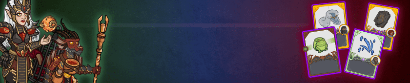
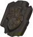
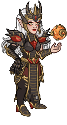
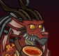
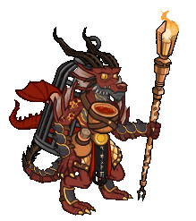

[Back to Main](index.md)

# Emergence 11

We know the next Emergence event will be Dragons and that it will start on 23 April 2025.

### Shop Contents

ⓘ *Note: This list might not be complete.*

    
        
            ID: 1**Support Pigment**The chosen equipment piece will now also increase the damage of all Champions by 200%<code>global_dps_multiplier_mult,200</code>
        
        
            **Pigmint**
            Marvelous Support Pigment
        
    
    
        
            ID: 2060**Broken Hellrider Sign (Reya)**I put it on the wall in Trollskull. A reminder of where I've been.<code>buff_upgrade,275,5458</code>
        
        
            **Golden Epic**
            Celestial Champion
            Reya (Slot 5)
        
    
    
        
            ID: 3837**Elegant Snow Cloak (Grimm)**Now THIS is a fashion statement! ~Grimm<code>buff_ultimate,275</code>
        
        
            **Golden Epic**
            Ultimate Damage
            Grimm (Slot 5)
        
    
    
        
            ID: 557**Highlord Miria (Miria)**
        
        
            **Skin**
            Highlord Miria
        
    
    
        
            ID: 558**Dragonlance Spurt (Spurt)**
        
        
            **Skin**
            Dragonlance Spurt
        
    
    
        
            ID: 2125**Reaching Shadow (Beadle)**As the sun dips low, shadows loom large. That's when we strike. ~Beadle<code>change_upgrade_targets,16722 change_upgrade_targets,16722</code>
        
        
            **Feat**
            Reaching Shadow
            Beadle (Changes In the Shadows to affect 3 slots away)
        
    
    
        
            ID: 2155**Venom Harvester (Spurt)**Spurt make discovery! Wyvern tail VERY stingy!<code>buff_spurt_waspiration_effect,80,0</code>
        
        
            **Feat**
            Venom Harvester
            Spurt (+80% to Wa-spiration: Stingy)
        
    
    
        
            ID: 2156**Heavily Armored (Miria)**You have no idea how much suffering a body can take.<code>health_mult,60</code>
        
        
            **Feat**
            Heavily Armored
            Miria (60% Health)
        
    
    
        
            ID: 2157**Weapon Master (Grimm)**Whether giants or dragons, all I need is one good swing.  ~Grimm<code>hero_dps_multiplier_mult,120</code>
        
        
            **Feat**
            Weapon Master
            Grimm (120% Self DPS)
        
    
    
        
            ID: 734**Chromatic Dragon Emergence Chest**Loot for: Beadle, Grimm, Miria, Reya and Spurt<code>"for_crusaders":[64,161,121,86,43]</code>
        
        
            **Chest**
            Chromatic Dragon Emergence Chest
        
    

The Chromatic Dragon Emergence Chest will contain loot for Beadle, Grimm, Miria, Reya and Spurt.


# Emergence FAQ



[Back to Top](#top)

*Last Modified: {{ site.time }}*