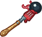

[Back to Main](index.md)





# Emergence 12

We know the next Emergence event will be Vecnas and that it will start on 23 July 2025.

### Shop Contents

ⓘ *Note: This list might not be complete.*

    
        
            ID: 1**Support Pigment**The chosen equipment piece will now also increase the damage of all Champions by 200%<code>global_dps_multiplier_mult,200</code>
        
        
            **Pigmint**
            Marvelous Support Pigment
        
    
    
        
            ID: 2536**Fork of Regicide (Blooshi)**Everyone knows a fork is the best assassination tool. Good size for eyes.  Increases the effect of Blooshi's A Life Well Lived ability by 275%.<code>buff_upgrade,275,7520</code>
        
        
            **Golden Epic**
            Fork of Regicide
            Blooshi (Slot 4)
        
    
    
        
            ID: 3905**Trapfinder's Friend (Tess)**No trap is safe from me.  Increases the effect of Tess's Trap Expert ability by 275%.<code>buff_upgrade,275,17320</code>
        
        
            **Golden Epic**
            Trapfinder's Friend
            Tess (Slot 4)
        
    
    
        
            ID: 581**Chosen of Vecna Blooshi (Blooshi)**
        
        
            **Skin**
            Chosen of Vecna Blooshi
        
    
    
        
            ID: 584**Gentleman Jarlaxle (Jarlaxle)**
        
        
            **Skin**
            Gentleman Jarlaxle
        
    
    
        
            ID: 2218**Cantrip: Ascendant Shocking Grasp (Krond)**Few can survive the lightning strike of a rampaging kraken. I did. Let's see how you fare.  Krond gains the Control role and his base attack deals additional 1600% damage to the main target, and the target is stunned for 4 seconds.<code>krond_shocking_grasp,1600,4 change_base_attack,864 add_hero_tags,0,control</code>
        
        
            **Feat**
            Cantrip: Ascendant Shocking Grasp
            Krond
        
    
    
        
            ID: 2229**Weapon Master (Windfall)**I've lost count of the number of lives I've taken with this blade.  Increases the damage of Windfall by 120%.<code>hero_dps_multiplier_mult,120</code>
        
        
            **Feat**
            Weapon Master
            Windfall
        
    
    
        
            ID: 2230**Discerning Taste (Kas)**Ah, such a rich vintage, with notes of fey. I must have more.  Increases the effect of Kas' Life Drain ability by 80%.<code>buff_upgrade,80,15621,0</code>
        
        
            **Feat**
            Discerning Taste
            Kas
        
    
    
        
            ID: 2231**Prodigal Leader (Tess)**I'm not always the best leader, but I truly believe that we're stronger together.  All Champions damage +50%.<code>global_dps_multiplier_mult,50</code>
        
        
            **Feat**
            Prodigal Leader
            Tess
        
    
    
        
            ID: 750**Vecna Emergence Chest**Loot for: Jarlaxle, Krond, Blooshi, Kas, Tess and Windfall<code>"for_crusaders":[4,15,106,153,164,167]</code>
        
        
            **Chest**
            Vecna Emergence Chest
        
    

The Vecna Emergence Chest will contain loot for Jarlaxle, Krond, Blooshi, Kas, Tess and Windfall.


# Emergence FAQ



[Back to Top](#top)

*Last Modified: {{ site.time }}*