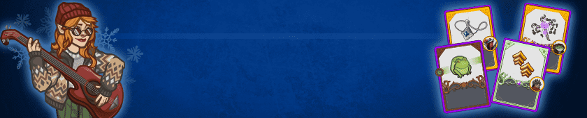
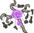
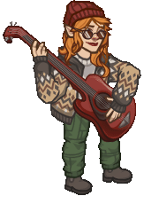

[Back to Main](index.md)

# Emergence 14

We know the next Emergence event will be Winter Beasts and that it will start on 23 December 2025.

### Shop Contents

ⓘ *Note: This list might not be complete.*

    
        
            ID: 1**Support Pigment**The chosen equipment piece will now also increase the damage of all Champions by 200%<code>global_dps_multiplier_mult,200</code>
        
        
            **Pigmint**
            Marvelous Support Pigment
        
    
    
        
            ID: 2524**Staff of the Reanimated (Blooshi)**If you could sum me up, spooky flowers and teeth would be a good start.  All Champions damage +230%.<code>global_dps_multiplier_mult,230</code>
        
        
            **Golden Epic**
            Staff of the Reanimated
            Blooshi (Slot 1)
        
    
    
        
            ID: 3965**Queen's Blade (Windfall)**She rewarded me with this on the day I opened the Red Belvedere.  All Champions damage +230%.<code>global_dps_multiplier_mult,230</code>
        
        
            **Golden Epic**
            Queen's Blade
            Windfall (Slot 1)
        
    
    
        
            ID: 4041**Pendant of Brilliance (Lark)**Every good performer knows when and how to make a quick exit, when necessary.  Increases the effect of Lark's Uptempo Uggie ability by 275%.<code>buff_upgrade,275,18052</code>
        
        
            **Golden Epic**
            Pendant of Brilliance
            Lark (Slot 2)
        
    
    
        
            ID: 635**Cozy Calliope (Calliope)**
        
        
            **Skin**
            Cozy Calliope
        
    
    
        
            ID: 1969**Vengeful Composure (Minthara)**Our foes will be reduced to nothing in time.  The Piercing component of Minthara's Oath of Vengeance ability only requires 1 Soul Branding stack to trigger.<code>change_upgrade_data,15945,2</code>
        
        
            **Feat**
            Vengeful Composure
            Minthara
        
    
    
        
            ID: 2348**Keen Athlete (Skylla)**Granny expects me to be at my very best, to do my very worst.  Increases the Intelligence score of Skylla by 1. Increases the Strength score of Skylla by 1.<code>increase_ability_score,int,1 increase_ability_score,str,1</code>
        
        
            **Feat**
            Keen Athlete
            Skylla
        
    
    
        
            ID: 2361**Multiversal Allies (Halsin)**To serve and protect nature is a common bond that transcends all borders.  Increases the damage of all Champions by 20% for each unique species in the formation, stacking additively.<code>effect_def,2193</code>
        
        
            **Feat**
            Multiversal Allies
            Halsin
        
    
    
        
            ID: 2362**Blazing Blade (Warduke)**I don't WANT to think about tactics. I want to HIT things with my SWORD!  Increases the effect of Warduke's A Trained Killer ability by 80%.<code>buff_upgrade,80,9615</code>
        
        
            **Feat**
            Blazing Blade
            Warduke
        
    
    
        
            ID: 2398**Scholar (Calliope)**Why didn't anyone tell me books could be so freaking exciting!?  Increases the Intelligence score of Calliope by 2.<code>increase_ability_score,int,2</code>
        
        
            **Feat**
            Scholar
            Calliope
        
    
    
        
            ID: 2399**Drifter (Windfall)**I'll leave you crying every day once I'm gone. Not sorry.  Increases the effect of Windfall's The Long Game ability by 80%.<code>buff_upgrade,80,17053</code>
        
        
            **Feat**
            Drifter
            Windfall
        
    
    
        
            ID: 2400**Prodigal Leader (Beadle)**He may be small, but he has the heart of a dragon. ~Grimm  All Champions damage +50%.<code>global_dps_multiplier_mult,50</code>
        
        
            **Feat**
            Prodigal Leader
            Beadle
        
    
    
        
            ID: 787**Winter Beast Emergence Chest**Loot for: Beadle, Blooshi, Calliope, Lark, Minthara, Skylla, Windfall, Warduke and Halsin<code>"for_crusaders":[64,106,5,170,154,169,167,116,156]</code>
        
        
            **Chest**
            Winter Beast Emergence Chest
        
    

The Winter Beast Emergence Chest will contain loot for Beadle, Blooshi, Calliope, Lark, Minthara, Skylla, Windfall, Warduke and Halsin.


# Emergence FAQ



[Back to Top](#top)

*Last Modified: {{ site.time }}*