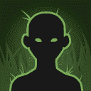

[Back to Main](index.md)

# Events 2.0

Since we've now had an official blog about Events 2.0 - probably best just to view that. We've been told the release date for the first Event2.0 is Festival of Fools on 6 March 2024.

[Idle Champions 2024 State of the Game Blog](https://codenameentertainment.com/?page=idle_champions&post_id=1636#blog)

ⓘ Update: We now have the full Events 2.0 Blog

[Idle Champions Events 2.0 Preview Blog ](https://codenameentertainment.com/?page=idle_champions&post_id=1650#blog)

## Removed Events

Because events 2.0 will have 12 events instead of 17 - 5 of them will be removed. The 5 removed events will be Greengrass / Midwinter / The Running / Midsummer / Brightswords. The champions that were available in those events will be redistributed to the remaining 12 - and the Devs said they tried to move them to events that were roughly around the same date they would have been - or as close as possible.

There will be some oddities though. Festival of Fools 2.0 will be in March this year - but April next year. Also - Greengrass 2.0 will happen this year in April - but won't appear again. The reason for this is that we've had too many events already this year for them to maintain their order properly so they've improvised.

While the redistributed champions will be available in different events than they were before - their adventures and variants will remain the event they were originally in - both story wise and enemies etc..

## Spending Event Tokens

Justin said on a recent Dev Insights that you'll be able to buy a pack of chests that will contain 1 gold and 2 silvers for an event champion for 7,500 event tokens. This is the same rate as current freeplays give - if we exclude the pity timer.

## Freeplays and Variants

We have heard from the developers that both freeplays and variants will be free. You will not need to spend tokens to start them. Also - there will now be 12 variants per champion. 3 variants in 4 tiers with their own area goals to reach. Each tier will supposedly have better and better rewards.

| Tier | Variant 1 | Variant 2 | Variant 3 |
|--:|--:|--:|--:|
| 1 | 75 | 125 | 175 |
| 2 | 250 | 350 | 450 |
| 3 | 600 | 800 | 1,000 |
| 4 | 1,200 | 1,400 | 1,600 |

## Text Defines

These are some of the raw text defines that reference Events 2.0 or new events in general.

<em>Raw Data</em>

<pre>
{
    "id": 5471,
    "key": "events_2_faq_title",
    "contents": "Event FAQ"
}
{
    "id": 5472,
    "key": "events_2_faq",
    "contents": "How do I play Events? \r\n\r\nEvents are temporary campaigns that run for a limited period of time each month. In each event you can complete adventures to unlock and gear up new and reworked Champions. You start event adventures from the Campaign Map just like you would any other adventure. The base adventure will unlock the Champion, and the variants provide chests that can be used to gear them up. When the event ends, you keep your new Champions along with any gear or other items you have acquired during the event, and gain a boost to your permanent campaign favor.\r\n\r\nWhat are Event Tokens? \r\n\r\nEvent Tokens will drop periodically from monsters in all adventures and campaigns. They can be used to purchase additional chests for Champions during the event. You will receive Event Tokens along with your offline gold gains when you load the game after having been offline for a while. Finally, using Bounty Contracts during the event will award Event Tokens at a rate of 2.4 per minute (72 for small contracts, 576 for medium, and 1152 for large).\r\n\r\nWhat are Event Tiers? \r\n\r\nOnce you have completed all three of the variants for a given Champion's event, the Champion gains a star and Tiers Up. Each tier contains three variants with higher area requirements than the last tier. Each variant awards an additional gold chest for the Champion. There are also unique rewards for completing all three variants in a given tier. Usually these are buffs that will empower the Champion for an extended period of time, but occasionally these rewards can include skins, feats, and more.\r\n\r\nHow many Champions can I unlock in an event? \r\n\r\nEach event initially contains two featured new or reworked Champions and three additional empty \"flex\" slots. You can pick which Champions you want to add to the flex slots from a fixed pool of Champions associated with the event. The first slot is available to use right away, while the other two slots can be unlocked using time gate pieces later in the event.  A sixth \"supporter\" slot is available as a \"thank you\" for players who purchase event-related DLC during the event.\r\n\r\nHow do I use the new Champions I've unlocked? \r\n\r\nOnce you complete the Champion's base adventure, you can swap in the new Champion you've unlocked by clicking on the portrait of whomever they swap with, then clicking the swap button the top-right corner of their portrait on their character sheet. You can only have one Champion from each bench seat in your formation at a time.\r\n\r\nHow do I gear up the new Champions I've unlocked?\r\n\r\nEquipment for event champions appear in champion-specific chests. They cannot receive gear from normal silver or gold chests. You can get champion chests by completing their event variants (1 per variant per tier, for a total of 12) or by purchasing them directly for Event Tokens or as in-app purchases. Gear for specific Champions can also be found in other types of chests, such as Electrum chests or patron-specific chests.\r\n\r\nWhat are Event Boons?\r\n\r\nEvent Boons are additional bonuses for players who purchase event-related DLC during an event. All Event Boons provide 25,000 additional Event Tokens, and the first one you obtain during an event unlocks that event's sixth \"supporter\" flex slot. Each Event Boon also increases the level of your Boon Buff for that event. The Boon Buff provides the same effects as if you had activated all five normal potions (damage, gold find, health, click damage, and speed) at the boon's level, so for example a level 4 (Epic) Event Boon will provide the same effects as Epic Potions of Giant's Strength, Clairvoyance, Heroism, Fire Breath, and Speed. The Boon Buff maxes out at level 4.\r\n\r\nWhat is the point of the event's Free Play adventures? \r\n\r\nFree Play adventures in events do not award any extra chests or special rewards. They can be used, like normal adventure Free Plays, to increase your favor level without the burden of any additional variant restrictions.\r\n\r\nWhat happens to my Event Divine Favor after the event ends?\r\n\r\nOnce the event ends you'll have an opportunity to convert your Event Divine Favor into a different deity's Divine Favor for the permanent campaign of your choice, so your hard earned Event Divine Favor will not go to waste. The more Divine Favor you earn in the event, the bigger the multiplier you earn for your permanent campaign.\r\n\r\nWhat happens to Event Currency I have left over after the event ends?\r\n\r\nAny Event Currency you have left over at the end of an event will be automatically converted into Champion chests as if you spent the event currency in the shop. The chests will be randomly selected from the event's featured Champions plus any flex Champions you chose during the event. After this conversion is completed, any remaining currency will be carried forward to the next event (up to a max of 7499).\r\n\r\nWhat happens when I use Bounty Contracts outside of events?\r\n\r\nBounty contracts used when an event is not running will add generic \"Event Currency\" items to your inventory. The next time an event starts, all the \"Event Currency\" in your inventory will be automatically converted into that event's actual currency.  This rate that  this \"Event Currency\" is awarded is the same as when you use bounty contracts during an event.\r\n\r\nCan I dismantle a reworked Event Champion?\r\n\r\nA dismantle will be available for reworked Champions during the event in which they are reworked, however purchasing event chests for the Champion with event tokens will end the dismantle period. Legendary dismantle events will now only occur during quarterly celebrations."
}
{
    "id": 5463,
    "key": "events_2_achievement_box_msg",
    "contents": "Each achievement increases the damage of all Champions by 1%"
}
{
    "id": 5458,
    "key": "supporter_flex_slot_locked_msg",
    "contents": "Unlock the supporter slot now by purchasing DLC containing an Event Boon"
}
{
    "id": 5440,
    "key": "getting_event_details",
    "contents": "Getting event details..."
}
{
    "id": 5489,
    "key": "events_pick_champion_confirmation",
    "contents": "Are you sure you want to pick $heroName?"
}
</pre>

 

## FAQ

The Events 2.0 FAQ has now become known:

### How do I play Events?

Events are temporary campaigns that run for a limited period of time each month. In each event you can complete adventures to unlock and gear up new and reworked Champions. You start event adventures from the Campaign Map just like you would any other adventure. The base adventure will unlock the Champion, and the variants provide chests that can be used to gear them up. When the event ends, you keep your new Champions along with any gear or other items you have acquired during the event, and gain a boost to your permanent campaign favor.

### What are Event Tokens?

Event Tokens will drop periodically from monsters in all adventures and campaigns. They can be used to purchase additional chests for Champions during the event. You will receive Event Tokens along with your offline gold gains when you load the game after having been offline for a while. Finally, using Bounty Contracts during the event will award Event Tokens at a rate of 2.4 per minute (72 for small contracts, 576 for medium, and 1152 for large).

### What are Event Tiers?

Once you have completed all three of the variants for a given Champion's event, the Champion gains a star and Tiers Up. Each tier contains three variants with higher area requirements than the last tier. Each variant awards an additional gold chest for the Champion. There are also unique rewards for completing all three variants in a given tier. Usually these are buffs that will empower the Champion for an extended period of time, but occasionally these rewards can include skins, feats, and more.

### How many Champions can I unlock in an event?

Each event initially contains two featured new or reworked Champions and three additional empty "flex" slots. You can pick which Champions you want to add to the flex slots from a fixed pool of Champions associated with the event. The first slot is available to use right away, while the other two slots unlock later in the event.  A sixth "supporter" slot is available as a "thank you" for players who purchase event-related DLC during the event.

### How do I use the new Champions I've unlocked?

Once you complete the Champion's base adventure, you can swap in the new Champion you've unlocked by clicking on the portrait of whomever they swap with, then clicking the swap button the top-right corner of their portrait on their character sheet. You can only have one Champion from each bench seat in your formation at a time.

### How do I gear up the new Champions I've unlocked?

Equipment for event champions appear in champion-specific chests. They cannot receive gear from normal silver or gold chests. You can get champion chests by completing their event variants (1 per variant per tier, for a total of 12) or by purchasing them directly for Event Tokens or as in-app purchases. Gear for specific Champions can also be found in other types of chests, such as Electrum chests or patron-specific chests.

### What are Event Boons?

Event Boons are additional bonuses for players who purchase event-related DLC during an event. All Event Boons provide 25,000 additional Event Tokens, and the first one you obtain during an event unlocks that event's sixth "supporter" flex slot. Each Event Boon also increases the level of your Boon Buff for that event. The Boon Buff provides the same effects as if you had activated all five normal potions (damage, gold find, health, click damage, and speed) at the boon's level, so for example a level 4 (Epic) Event Boon will provide the same effects as Epic Potions of Giant's Strength, Clairvoyance, Heroism, Fire Breath, and Speed. The Boon Buff maxes out at level 4.

### What is the point of the event's Free Play adventures?

Free Play adventures in events do not award any extra chests or special rewards. They can be used, like normal adventure Free Plays, to increase your favor level without the burden of any additional variant restrictions.

### What happens to my Event Divine Favor after the event ends?

Once the event ends you'll have an opportunity to convert your Event Divine Favor into a different deity's Divine Favor for the permanent campaign of your choice, so your hard earned Event Divine Favor will not go to waste. The more Divine Favor you earn in the event, the bigger the multiplier you earn for your permanent campaign.

### What happens to Event Currency I have left over after the event ends?

Any Event Currency you have left over at the end of an event will be automatically converted into Champion chests as if you spent the event currency in the shop. The chests will be randomly selected from the event's featured Champions plus any flex Champions you chose during the event. After this conversion is completed, any remaining currency will be carried forward to the next event (up to a max of 7499).

### What happens when I use Bounty Contracts outside of events?

Bounty contracts used when an event is not running will add generic "Event Currency" items to your inventory. The next time an event starts, all the "Event Currency" in your inventory will be automatically converted into that event's actual currency.  This rate that  this "Event Currency" is awarded is the same as when you use bounty contracts during an event.

### Can I dismantle a reworked Event Champion?

A dismantle will be available for reworked Champions during the event in which they are reworked, however purchasing event chests for the Champion with event tokens will end the dismantle period. Legendary dismantle events will now only occur during quarterly celebrations.

## Icons

    
        
            
        
        
            **Attack**
            Icon_Events20_GenericAttack
        
    
    
        
            
        
        
            **Magic**
            Icon_Events20_GenericMagic
        
    
    
        
            
        
        
            **Ranged**
            Icon_Events20_GenericRanged
        
    
    
        
            
        
        
            **Generic Event Token**
            Icons/Icon_EventToken
        
    

## Festival of Fools 2.0

    
        
            
        
        
            **Background**
            FestivalofFools_2_0_64Background
        
    
    
        
            
        
        
            **Blank Champion**
            FestivalofFools_2_0_BlankChampion
        
    
    
        
            
        
        
            **Buff**
            FestivalofFools_2_0_Buff
        
    

## Greengrass 2.0

    
        
            
        
        
            **Background**
            Greengrass_2_0_64Background
        
    
    
        
            
        
        
            **Blank Champion**
            Greengrass_2_0_BlankChampion
        
    
    
        
            
        
        
            **Buff**
            Greengrass_2_0_Buff
        
    

[Back to Top](#top)

*Last Modified: {{ site.time }}*