[Back to Main](index.md)

    
        
            
        
        
            Portrait
        
    
    
        
            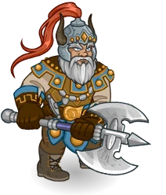
        
        
            Model
        
    

# Flint Fireforge

Flint Fireforge is many things - a fearless warrior, a renowned craftsman, and a loyal friend to the bitter end. He is the gruff and grumbling fatherly figure among his group of companions, fiercely protective of them despite seeming to be constantly frustrated by their choices (some more so than others). He is swift to act when danger appears, leading the charge with fury and reckless abandon against the evil forces of Takhisis.

# Basic Information

Flint Fireforge will be a new champion in the Ahghairon's Day event on 5 August 2026.

    
        
            **Seat**:
        
        
            9
        
        
            **Stat**
        
        
            **Value**
        
        
            **Day 1 Trials**
        
        
            **Patrons**
        
    
    
        
            **Species**:
        
        
            Dwarf
        
        
            **Strength**:
        
        
            16
        
        
            Yes
        
        
            Mirt
        
    
    
        
            **Class**:
        
        
            Fighter
        
        
            **Dexterity**:
        
        
            10
        
        
            Yes (Ability)
        
        
            Vajra
        
    
    
        
            **Roles**:
        
        
            Support / Tanking
        
        
            **Constitution**:
        
        
            18
        
        
            Yes
        
        
            Strahd (Ability)
        
    
    
        
            **Age**:
        
        
            148
        
        
            **Intelligence**:
        
        
            10
        
        
            Yes
        
        
            Zariel
        
    
    
        
            **Gender**:
        
        
            Male
        
        
            **Wisdom**:
        
        
            12
        
        
            Yes
        
        
            Elminster
        
    
    
        
            **Alignment**:
        
        
            Neutral Good
        
        
            **Charisma**:
        
        
            13
        
        
            Yes
        
        
            &nbsp;
        
    
    
        
            **Affiliation**:
        
        
            Heroes of the Lance
        
        
            **Total**:
        
        
            79
        
        
            Champion ID:
        
        
            178
        
    

# Formation

    <svg xmlns="http://www.w3.org/2000/svg" id="Flint" fill="#aaa" data-formationName="Flint" data-campaignName="Ahghairon's Day" width="364" height="140"><circle cx="215" cy="65" r="15"/><circle cx="215" cy="105" r="15"/><circle cx="175" cy="45" r="15"/><circle cx="175" cy="85" r="15"/><circle cx="175" cy="125" r="15"/><circle cx="135" cy="25" r="15"/><circle cx="135" cy="65" r="15"/><circle cx="95" cy="85" r="15"/><circle cx="55" cy="105" r="15"/><circle cx="15" cy="125" r="15"/><text x="245" y="25" fill="#dcdcdc" font-size="25" font-family="Arial" font-weight="bold">Flint</text><text x="245" y="65" fill="#dcdcdc" font-size="15" font-family="Arial" font-weight="bold">Ahghairon's Day</text></svg>

# Attacks

 **Base Attack: Battleaxe** (Melee)
> Flint attacks the nearest enemy with his trusty battleaxe.  
> Cooldown: 4s (Cap 1s)

<em>Raw Data</em>

<pre>
{
    "id": 987,
    "name": "Battleaxe",
    "description": "Flint hits anything that gets too close with his axe.",
    "long_description": "Flint attacks the nearest enemy with his trusty battleaxe.",
    "graphic_id": 0,
    "target": "front",
    "num_targets": 1,
    "aoe_radius": 0,
    "damage_modifier": 1,
    "cooldown": 4,
    "animations": [
        {
            "type": "melee_attack",
            "target_offset_x": -34,
            "damage_frame": 2,
            "jump_sound": 30,
            "sound_frames": {
                "2": 154
            }
        }
    ],
    "tags": [
        "melee"
    ],
    "damage_types": [
        "melee"
    ]
}
</pre>

 **Base Attack: Cleaving Strike** (Melee)
> Flint cleaves the nearest enemies with his trusty battleaxe.  
> Cooldown: 4s (Cap 1s)

<em>Raw Data</em>

<pre>
{
    "id": 988,
    "name": "Cleaving Strike",
    "description": "Flint cleaves anything that gets too close with his axe.",
    "long_description": "Flint cleaves the nearest enemies with his trusty battleaxe.",
    "graphic_id": 0,
    "target": "front",
    "num_targets": 1,
    "aoe_radius": 150,
    "damage_modifier": 1,
    "cooldown": 4,
    "animations": [
        {
            "type": "melee_attack",
            "attack_seq": "attack_b",
            "target_offset_x": -34,
            "damage_frame": 13,
            "jump_sound": 30,
            "sound_frames": {
                "2": 194
            }
        }
    ],
    "tags": [
        "melee"
    ],
    "damage_types": [
        "melee"
    ]
}
</pre>

 **Ultimate Attack: Hammer of Reorx** (Level: 70)
> Flint deals one ultimate hit to a small group of nearby enemies, knocking them far away and stunning them.  
> Cooldown: 400s (Cap 100s)

<em>Raw Data</em>

<pre>
{
    "id": 989,
    "name": "Hammer of Reorx",
    "description": "Flint deals one ultimate hit to a small group of nearby enemies and knocks them back.",
    "long_description": "Flint deals one ultimate hit to a small group of nearby enemies, knocking them far away and stunning them.",
    "graphic_id": 29611,
    "target": "front_retaliate_if_possible",
    "num_targets": 1,
    "aoe_radius": 200,
    "damage_modifier": 0.03,
    "cooldown": 400,
    "animations": [
        {
            "type": "melee_attack",
            "power_up_sequence": {
                "start_frame": 0,
                "end_frame": 13
            },
            "sequences": [
                {
                    "start_frame": 22,
                    "end_frame": 62,
                    "damage_frame": 25,
                    "target_offset_x": -34,
                    "effects_on_monsters": [
                        {
                            "effect_string": "push_back_monster,1000",
                            "animation": "hit",
                            "after_damage": true,
                            "push_speed": 800
                        }
                    ]
                }
            ]
        }
    ],
    "tags": [
        "melee",
        "ultimate"
    ],
    "damage_types": [
        "melee"
    ]
}
</pre>

# Abilities

**That Doorknob Kender** (Level: 0)
> Despite how annoyed and frustrated Flint can be when it comes to Tasslehoff, the two are inseparable. If Tasslehoff qualifies for an adventure restriction based on his tags, age, ability scores, etc., Flint may be used as well.

<em>Raw Data</em>

<pre>
{
    "id": 20129,
    "hero_id": 178,
    "required_level": 0,
    "required_upgrade_id": 0,
    "upgrade_type": "unlock_ability",
    "effect": "effect_def,2796",
    "static_dps_mult": null,
    "default_enabled": 1,
    "name": "That Doorknob Kender"
}
{
    "id": 2796,
    "flavour_text": "",
    "description": {
        "desc": "Despite how annoyed and frustrated Flint can be when it comes to Tasslehoff, the two are inseparable. If Tasslehoff qualifies for an adventure restriction based on his tags, age, ability scores, etc., Flint may be used as well."
    },
    "effect_keys": [
        {
            "effect_string": "do_nothing"
        }
    ],
    "requirements": "",
    "graphic_id": 0,
    "large_graphic_id": 0,
    "properties": {
        "is_formation_ability": true,
        "formation_circle_icon": false,
        "owner_use_outgoing_description": true
    }
}
</pre>

 **Forged Bonds** (Level: 20)
> Flint gains a Forged Bonds stack for each Champion adjacent to him. Flint buffs all Champions in his column and the column behind him by 100% for each Forged Bonds stack, stacking multiplicatively.

ⓘ *Note: This ability is prestack.*

<em>Upgrade Data</em>

<pre>
Upgrades:
       60: 100%
      140: 100%
      220: 100%
      290: 100%
      380: 100%
      560: 100%
      700: 100%
      890: 100%
    1,100: 100%
    1,270: 100%
    1,500: 100%
    1,660: 100%
    1,860: 100%
    2,030: 100%
    2,250: 100%
    2,420: 100%
    2,650: 100%
    2,820: 100%
    3,010: 100%
    3,260: 100%
    3,350: 100%

    Total Upgrade Bonus: 2.10e08%
</pre>

<em>Raw Data</em>

<pre>
{
    "id": 20130,
    "hero_id": 178,
    "required_level": 20,
    "required_upgrade_id": 0,
    "upgrade_type": "unlock_ability",
    "effect": "effect_def,2797",
    "static_dps_mult": null,
    "default_enabled": 1,
    "name": "Forged Bonds",
    "tip_text": "Flint buffs everyone in his column and the column behind him based on the number of Champions adjacent to him."
}
{
    "id": 2797,
    "flavour_text": "",
    "description": {
        "desc": "Flint gains a Forged Bonds stack for each Champion adjacent to him. Flint buffs all Champions in his column and the column behind him by $amount% for each Forged Bonds stack, stacking multiplicatively."
    },
    "effect_keys": [
        {
            "effect_string": "pre_stack_amount,100"
        },
        {
            "effect_string": "hero_dps_multiplier_mult,100",
            "use_computed_amount_for_description": true,
            "targets": [
                "col_and_prev_col"
            ],
            "amount_expr": "upgrade_amount(20130,0)",
            "amount_func": "mult",
            "stack_func": "per_hero_attribute",
            "per_hero_targets": [
                "adj"
            ],
            "post_process_expr": "as_int(GetFeatEquipped(2712)) + as_int(GetFeatEquipped(2713))*2 + as_int(GetFeatEquipped(2714))*as_int(GetUpgradeStacks(20130,2)) + as_int(GetFeatEquipped(2711))*as_int(IsHeroInFormation(174))*3 + input",
            "per_hero_expr": "true",
            "show_bonus": true,
            "stack_title": "Forged Bonds Stacks",
            "amount_updated_listeners": [
                "upgrade_unlocked",
                "slot_changed",
                "feat_changed",
                "hero_tags_changed"
            ]
        },
        {
            "effect_string": "forged_bonds_dwarf_extra_stacks",
            "stack_func": "per_hero_attribute",
            "per_hero_targets": [
                "adj"
            ],
            "per_hero_expr": "HasTag(`dwarf`)",
            "show_bonus": false,
            "show_stacks": false,
            "amount_updated_listeners": [
                "upgrade_unlocked",
                "slot_changed",
                "feat_changed",
                "hero_tags_changed"
            ]
        }
    ],
    "requirements": "",
    "graphic_id": 29596,
    "large_graphic_id": 29592,
    "properties": {
        "is_formation_ability": true,
        "formation_circle_icon": false,
        "owner_use_outgoing_description": true,
        "indexed_effect_properties": true,
        "per_effect_index_bonuses": true,
        "default_bonus_index": 0,
        "retain_on_slot_changed": true
    }
}
{
    "id": 20186,
    "hero_id": 178,
    "required_level": 60,
    "required_upgrade_id": 0,
    "upgrade_type": "upgrade_ability",
    "effect": "buff_upgrade,100,20130,1",
    "static_dps_mult": null,
    "default_enabled": 1,
    "name": ""
}
{
    "id": 20203,
    "hero_id": 178,
    "required_level": 140,
    "required_upgrade_id": 0,
    "upgrade_type": "upgrade_ability",
    "effect": "buff_upgrade,100,20130,1",
    "static_dps_mult": null,
    "default_enabled": 1,
    "name": ""
}
{
    "id": 20206,
    "hero_id": 178,
    "required_level": 220,
    "required_upgrade_id": 0,
    "upgrade_type": "upgrade_ability",
    "effect": "buff_upgrade,100,20130,1",
    "static_dps_mult": null,
    "default_enabled": 1,
    "name": ""
}
{
    "id": 20208,
    "hero_id": 178,
    "required_level": 290,
    "required_upgrade_id": 0,
    "upgrade_type": "upgrade_ability",
    "effect": "buff_upgrade,100,20130,1",
    "static_dps_mult": null,
    "default_enabled": 1,
    "name": ""
}
{
    "id": 20210,
    "hero_id": 178,
    "required_level": 380,
    "required_upgrade_id": 0,
    "upgrade_type": "upgrade_ability",
    "effect": "buff_upgrade,100,20130,1",
    "static_dps_mult": null,
    "default_enabled": 1,
    "name": ""
}
{
    "id": 20215,
    "hero_id": 178,
    "required_level": 560,
    "required_upgrade_id": 0,
    "upgrade_type": "upgrade_ability",
    "effect": "buff_upgrade,100,20130,1",
    "static_dps_mult": null,
    "default_enabled": 1,
    "name": ""
}
{
    "id": 20218,
    "hero_id": 178,
    "required_level": 700,
    "required_upgrade_id": 0,
    "upgrade_type": "upgrade_ability",
    "effect": "buff_upgrade,100,20130,1",
    "static_dps_mult": null,
    "default_enabled": 1,
    "name": ""
}
{
    "id": 20221,
    "hero_id": 178,
    "required_level": 890,
    "required_upgrade_id": 0,
    "upgrade_type": "upgrade_ability",
    "effect": "buff_upgrade,100,20130,1",
    "static_dps_mult": null,
    "default_enabled": 1,
    "name": ""
}
{
    "id": 20224,
    "hero_id": 178,
    "required_level": 1100,
    "required_upgrade_id": 0,
    "upgrade_type": "upgrade_ability",
    "effect": "buff_upgrade,100,20130,1",
    "static_dps_mult": null,
    "default_enabled": 1,
    "name": ""
}
{
    "id": 20227,
    "hero_id": 178,
    "required_level": 1270,
    "required_upgrade_id": 0,
    "upgrade_type": "upgrade_ability",
    "effect": "buff_upgrade,100,20130,1",
    "static_dps_mult": null,
    "default_enabled": 1,
    "name": ""
}
{
    "id": 20230,
    "hero_id": 178,
    "required_level": 1500,
    "required_upgrade_id": 0,
    "upgrade_type": "upgrade_ability",
    "effect": "buff_upgrade,100,20130,1",
    "static_dps_mult": null,
    "default_enabled": 1,
    "name": ""
}
{
    "id": 20234,
    "hero_id": 178,
    "required_level": 1660,
    "required_upgrade_id": 0,
    "upgrade_type": "upgrade_ability",
    "effect": "buff_upgrade,100,20130,1",
    "static_dps_mult": null,
    "default_enabled": 1,
    "name": ""
}
{
    "id": 20237,
    "hero_id": 178,
    "required_level": 1860,
    "required_upgrade_id": 0,
    "upgrade_type": "upgrade_ability",
    "effect": "buff_upgrade,100,20130,1",
    "static_dps_mult": null,
    "default_enabled": 1,
    "name": ""
}
{
    "id": 20240,
    "hero_id": 178,
    "required_level": 2030,
    "required_upgrade_id": 0,
    "upgrade_type": "upgrade_ability",
    "effect": "buff_upgrade,100,20130,1",
    "static_dps_mult": null,
    "default_enabled": 1,
    "name": ""
}
{
    "id": 20242,
    "hero_id": 178,
    "required_level": 2250,
    "required_upgrade_id": 0,
    "upgrade_type": "upgrade_ability",
    "effect": "buff_upgrade,100,20130,1",
    "static_dps_mult": null,
    "default_enabled": 1,
    "name": ""
}
{
    "id": 20245,
    "hero_id": 178,
    "required_level": 2420,
    "required_upgrade_id": 0,
    "upgrade_type": "upgrade_ability",
    "effect": "buff_upgrade,100,20130,1",
    "static_dps_mult": null,
    "default_enabled": 1,
    "name": ""
}
{
    "id": 20246,
    "hero_id": 178,
    "required_level": 2650,
    "required_upgrade_id": 0,
    "upgrade_type": "upgrade_ability",
    "effect": "buff_upgrade,100,20130,1",
    "static_dps_mult": null,
    "default_enabled": 1,
    "name": ""
}
{
    "id": 20249,
    "hero_id": 178,
    "required_level": 2820,
    "required_upgrade_id": 0,
    "upgrade_type": "upgrade_ability",
    "effect": "buff_upgrade,100,20130,1",
    "static_dps_mult": null,
    "default_enabled": 1,
    "name": ""
}
{
    "id": 20250,
    "hero_id": 178,
    "required_level": 3010,
    "required_upgrade_id": 0,
    "upgrade_type": "upgrade_ability",
    "effect": "buff_upgrade,100,20130,1",
    "static_dps_mult": null,
    "default_enabled": 1,
    "name": ""
}
{
    "id": 20253,
    "hero_id": 178,
    "required_level": 3260,
    "required_upgrade_id": 0,
    "upgrade_type": "upgrade_ability",
    "effect": "buff_upgrade,100,20130,1",
    "static_dps_mult": null,
    "default_enabled": 1,
    "name": ""
}
{
    "id": 20256,
    "hero_id": 178,
    "required_level": 3350,
    "required_upgrade_id": 0,
    "upgrade_type": "upgrade_ability",
    "effect": "buff_upgrade,100,20130,1",
    "static_dps_mult": null,
    "default_enabled": 1,
    "name": ""
}
</pre>

 **Stubborn Determination** (Level: 40)
> Flint reduces the damage taken by all Champions by 10% for each Forged Bonds stack he currently has, stacking additively and capping at 90%.

<em>Raw Data</em>

<pre>
{
    "id": 20131,
    "hero_id": 178,
    "required_level": 40,
    "required_upgrade_id": 0,
    "upgrade_type": "unlock_ability",
    "effect": "effect_def,2798",
    "static_dps_mult": null,
    "default_enabled": 1,
    "name": "Stubborn Determination"
}
{
    "id": 2798,
    "flavour_text": "",
    "description": {
        "desc": "Flint reduces the damage taken by all Champions by $(amount)% for each Forged Bonds stack he currently has, stacking additively and capping at $(max_resistance_for_description)%."
    },
    "effect_keys": [
        {
            "effect_string": "reduce_incoming_damage_percent,10",
            "targets": [
                "all"
            ],
            "off_when_benched": true,
            "amount_func": "add",
            "stack_func": "per_hero_attribute",
            "post_process_expr": "as_int(GetUpgradeStacks(20130, 1))",
            "stacks_multiply": false,
            "show_bonus": true,
            "max_stacks": 9,
            "amount_updated_listeners": [
                "slot_changed",
                "hero_tags_changed"
            ],
            "max_resistance_for_description": 90,
            "retarget_when_any_hero_slot_changed": true,
            "use_computed_amount_for_description": true
        }
    ],
    "requirements": "",
    "graphic_id": 29598,
    "large_graphic_id": 29594,
    "properties": {
        "is_formation_ability": true,
        "owner_use_outgoing_description": true,
        "formation_circle_icon": false,
        "indexed_effect_properties": true,
        "per_effect_index_bonuses": true,
        "default_bonus_index": 0
    }
}
</pre>

 **Stonecunning** (Level: 110)
> The effect of Forged Bonds is increased by 5% for each completed area in the current adventure that was Underground.

<em>Raw Data</em>

<pre>
{
    "id": 20132,
    "hero_id": 178,
    "required_level": 110,
    "required_upgrade_id": 0,
    "upgrade_type": "unlock_ability",
    "effect": "effect_def,2799",
    "static_dps_mult": null,
    "default_enabled": 1,
    "name": "Stonecunning",
    "tip_text": "Flint increases his buff based on the number of Underground areas the formation has completed in the current adventure."
}
{
    "id": 2799,
    "flavour_text": "",
    "description": {
        "pre": "The effect of Forged Bonds is increased by $amount% for each completed area in the current adventure that was Underground.",
        "post": {
            "conditions": [
                {
                    "condition": "not static_desc",
                    "desc": "^^This adventure is underground in $(flint_stonecunning_percent)% of areas."
                }
            ]
        }
    },
    "effect_keys": [
        {
            "effect_string": "buff_upgrade,5,20130,1",
            "off_when_benched": true,
            "stacks_on_trigger": "will_stack_manually",
            "stacks_multiply": true,
            "show_bonus": true
        },
        {
            "effect_string": "flint_stonecunning_handler",
            "off_when_benched": true,
            "buff_index": 0
        }
    ],
    "requirements": "",
    "graphic_id": 29597,
    "large_graphic_id": 29593,
    "properties": {
        "is_formation_ability": true,
        "formation_circle_icon": false,
        "use_outgoing_description": true
    }
}
</pre>

 **Take The Initiative** (Level: 130)
> Until he takes damage in an area, Flint gains an Initiative stack whenever he attacks an enemy. Once he has taken damage, Flint gains Follow-Through stacks when he attacks instead. The damage of Forged Bonds is increased by 100% for each Follow-Through stack he has, stacking multiplicatively. The number of Follow-Through stacks can not exceed the number of Initiative stacks he has gained, and Initiative caps at 100 stacks. Both stacks reset when changing areas or when Flint is moved in the formation or removed from it.

<em>Raw Data</em>

<pre>
{
    "id": 20133,
    "hero_id": 178,
    "required_level": 130,
    "required_upgrade_id": 0,
    "upgrade_type": "unlock_ability",
    "effect": "effect_def,2800",
    "static_dps_mult": null,
    "default_enabled": 1,
    "name": "Take The Initiative"
}
{
    "id": 2800,
    "flavour_text": "",
    "description": {
        "desc": "Until he takes damage in an area, Flint gains $(if feat_assigned 2717)$stacks_per_hit Initiative stacks$(else)an Initiative stack$(fi) whenever he attacks an enemy. Once he has taken damage, Flint gains Follow-Through stacks when he attacks instead. The damage of Forged Bonds is increased by $(not_buffed amount___3)% for each Follow-Through stack he has, stacking multiplicatively. The number of Follow-Through stacks can not exceed the number of Initiative stacks he has gained, and Initiative caps at $max_stacks___2 stacks. Both stacks reset when changing areas or when Flint is moved in the formation or removed from it."
    },
    "effect_keys": [
        {
            "effect_string": "flint_take_the_initiative_handler",
            "initiative_index": 1,
            "follow_through_index": 2,
            "stacks_per_hit": 1
        },
        {
            "effect_string": "do_nothing,0",
            "stacks_on_trigger": "will_stack_manually",
            "stacks_multiply": false,
            "show_stacks": true,
            "max_stacks": 100,
            "stack_title": "Initiative Stacks"
        },
        {
            "effect_string": "buff_upgrade,100,20130,1",
            "stacks_on_trigger": "will_stack_manually",
            "stacks_multiply": true,
            "show_bonus": true,
            "stack_title": "Follow-Through Stacks"
        }
    ],
    "requirements": "",
    "graphic_id": 29599,
    "large_graphic_id": 29595,
    "properties": {
        "is_formation_ability": true,
        "formation_circle_icon": false,
        "owner_use_outgoing_description": true,
        "indexed_effect_properties": true,
        "per_effect_index_bonuses": true,
        "default_bonus_index": 2,
        "retain_on_slot_changed": true
    }
}
</pre>

# Specialisations

 **Fatherly Advice** (Level: 90)
> Increase the effect of Flint's Forged Bonds by 100% for each Champion in the formation who is 40 years old or younger, stacking multiplicatively.

ⓘ *Note: This ability is prestack.*

<em>Raw Data</em>

<pre>
{
    "id": 20134,
    "hero_id": 178,
    "required_level": 90,
    "required_upgrade_id": 0,
    "upgrade_type": "unlock_ability",
    "effect": "effect_def,2801",
    "static_dps_mult": null,
    "default_enabled": 1,
    "name": "Fatherly Advice",
    "specialization_name": "Fatherly Advice",
    "specialization_description": "Flint thinks of his younger allies as children who need protection and guidance.",
    "specialization_graphic_id": 29602
}
{
    "id": 2801,
    "flavour_text": "",
    "description": {
        "desc": "Increase the effect of Flint's Forged Bonds by $amount% for each Champion in the formation who is 40 years old or younger, stacking multiplicatively."
    },
    "effect_keys": [
        {
            "effect_string": "pre_stack,100",
            "off_when_benched": true
        },
        {
            "effect_string": "buff_upgrade,0,20130,1",
            "off_when_benched": true,
            "amount_expr": "upgrade_amount(20134,0)",
            "amount_func": "mult",
            "stack_func": "per_hero_attribute",
            "per_hero_expr": "age<=40 && hero_id != 146",
            "show_bonus": true,
            "amount_updated_listeners": [
                "slot_changed",
                "feat_changed"
            ]
        }
    ],
    "requirements": "",
    "graphic_id": 29602,
    "large_graphic_id": 29602,
    "properties": {
        "is_formation_ability": true,
        "formation_circle_icon": false,
        "owner_use_outgoing_description": true,
        "indexed_effect_properties": true,
        "per_effect_index_bonuses": true,
        "default_bonus_index": 0,
        "retain_on_slot_changed": true,
        "spec_option_post_apply_info": "Young Champions: $num_stacks___2"
    }
}
</pre>

 **Forged in War** (Level: 90)
> Increase the effect of Flint's Forged Bonds by 150% for each Heroes of the Lance Champion in the formation, stacking multiplicatively.

ⓘ *Note: This ability is prestack.*

<em>Raw Data</em>

<pre>
{
    "id": 20135,
    "hero_id": 178,
    "required_level": 90,
    "required_upgrade_id": 0,
    "upgrade_type": "unlock_ability",
    "effect": "effect_def,2802",
    "static_dps_mult": null,
    "default_enabled": 1,
    "name": "Forged in War",
    "specialization_name": "Forged in War",
    "specialization_description": "Flint knows that in the most dire circumstances, he can always count on his old companions.",
    "specialization_graphic_id": 29604
}
{
    "id": 2802,
    "flavour_text": "",
    "description": {
        "desc": "Increase the effect of Flint's Forged Bonds by $amount% for each Heroes of the Lance Champion in the formation, stacking multiplicatively."
    },
    "effect_keys": [
        {
            "effect_string": "pre_stack,150",
            "off_when_benched": true
        },
        {
            "effect_string": "buff_upgrade,0,20130,1",
            "off_when_benched": true,
            "amount_expr": "upgrade_amount(20135,0)",
            "amount_func": "mult",
            "stack_func": "per_hero_attribute",
            "per_hero_expr": "HasTag(`heroeslance`)",
            "show_bonus": true,
            "amount_updated_listeners": [
                "slot_changed",
                "hero_tags_changed"
            ]
        }
    ],
    "requirements": "",
    "graphic_id": 29604,
    "large_graphic_id": 29604,
    "properties": {
        "is_formation_ability": true,
        "formation_circle_icon": false,
        "owner_use_outgoing_description": true,
        "indexed_effect_properties": true,
        "per_effect_index_bonuses": true,
        "default_bonus_index": 0,
        "retain_on_slot_changed": true,
        "spec_option_post_apply_info": "Heroes of the Lance Champions: $num_stacks___2"
    }
}
</pre>

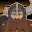 **Blood of Reorx** (Level: 90)
> Increase the effect of Flint's Forged Bonds by 200% for each dwarf in the formation, stacking multiplicatively.

ⓘ *Note: This ability is prestack.*

<em>Raw Data</em>

<pre>
{
    "id": 20136,
    "hero_id": 178,
    "required_level": 90,
    "required_upgrade_id": 0,
    "upgrade_type": "unlock_ability",
    "effect": "effect_def,2803",
    "static_dps_mult": null,
    "default_enabled": 1,
    "name": "Blood of Reorx",
    "specialization_name": "Blood of Reorx",
    "specialization_description": "Flint is a dwarf among dwarves, inspiring his fellow dwarves to embrace their heritage and fight as one.",
    "specialization_graphic_id": 29600
}
{
    "id": 2803,
    "flavour_text": "",
    "description": {
        "desc": "Increase the effect of Flint's Forged Bonds by $amount% for each dwarf in the formation, stacking multiplicatively."
    },
    "effect_keys": [
        {
            "effect_string": "pre_stack,200",
            "off_when_benched": true
        },
        {
            "effect_string": "buff_upgrade,0,20130,1",
            "off_when_benched": true,
            "amount_expr": "upgrade_amount(20136,0)",
            "amount_func": "mult",
            "stack_func": "per_hero_attribute",
            "per_hero_expr": "HasTag(`dwarf`)",
            "show_bonus": true,
            "amount_updated_listeners": [
                "slot_changed",
                "hero_tags_changed"
            ]
        }
    ],
    "requirements": "",
    "graphic_id": 29600,
    "large_graphic_id": 29600,
    "properties": {
        "is_formation_ability": true,
        "formation_circle_icon": false,
        "owner_use_outgoing_description": true,
        "indexed_effect_properties": true,
        "per_effect_index_bonuses": true,
        "default_bonus_index": 0,
        "retain_on_slot_changed": true,
        "spec_option_post_apply_info": "Dwarf Champions: $num_stacks___2"
    }
}
</pre>

 **Craft Maker** (Level: 200)
> Flint gains the Gold role and the party's Gold Find is increased proportionally based upon the max health of enemies in the current area. For each order of magnitude of max health the enemies have, the party's Gold Find is increased by 10%, stacking multiplicatively.

<em>Raw Data</em>

<pre>
{
    "id": 20137,
    "hero_id": 178,
    "required_level": 200,
    "required_upgrade_id": 0,
    "upgrade_type": "unlock_ability",
    "effect": "effect_def,2804",
    "static_dps_mult": null,
    "default_enabled": 1,
    "name": "Craft Maker",
    "specialization_name": "Craft Maker",
    "specialization_description": "Flint is a renowned master craftsman, and knows how to ply his trade wherever he goes.",
    "specialization_graphic_id": 29601
}
{
    "id": 2804,
    "flavour_text": "",
    "description": {
        "desc": "Flint gains the Gold role and the party's Gold Find is increased proportionally based upon the max health of enemies in the current area. For each order of magnitude of max health the enemies have, the party's Gold Find is increased by $amount%, stacking multiplicatively."
    },
    "effect_keys": [
        {
            "off_when_benched": true,
            "effect_string": "gold_multiplier_mult,10",
            "stack_title": "Enemy Health Order of Magnitude",
            "amount_func": "mult",
            "stack_func": "per_monster_health_order_of_magnitude",
            "stacks_multiply": true,
            "show_bonus": true,
            "amount_updated_listeners": [
                "area_changed"
            ]
        },
        {
            "effect_string": "add_hero_tags,0,gold"
        }
    ],
    "requirements": "",
    "graphic_id": 29601,
    "large_graphic_id": 29601,
    "properties": {
        "is_formation_ability": true,
        "owner_use_outgoing_description": true,
        "indexed_effect_properties": true,
        "per_effect_index_bonuses": true,
        "default_bonus_index": 0
    }
}
</pre>

 **Foe Breaker** (Level: 200)
> Flint gains the Breaker role. Attacks from Champions who are affected by Flint's Forged Bonds ability (including himself) remove an extra segment from enemies with segmented, armored, or critical health.

<em>Raw Data</em>

<pre>
{
    "id": 20138,
    "hero_id": 178,
    "required_level": 200,
    "required_upgrade_id": 0,
    "upgrade_type": "unlock_ability",
    "effect": "effect_def,2805",
    "static_dps_mult": null,
    "default_enabled": 1,
    "name": "Foe Breaker",
    "specialization_name": "Foe Breaker",
    "specialization_description": "Flint's profound skill for making things lends him an equally impressive talent for taking things apart.",
    "specialization_graphic_id": 29603
}
{
    "id": 2805,
    "flavour_text": "",
    "description": {
        "desc": "Flint gains the Breaker role. Attacks from Champions who are affected by Flint's Forged Bonds ability (including himself) remove an extra segment from enemies with segmented, armored, or critical health."
    },
    "effect_keys": [
        {
            "effect_string": "add_hero_tags,0,breaking",
            "off_when_benched": true,
            "skip_effect_key_desc": true
        },
        {
            "off_when_benched": true,
            "effect_string": "increase_damage_against_monster_armor_and_hits,1",
            "override_key_desc": "$(target)'s attacks removes an extra segment from enemies with segmented, armored, or critical health.",
            "targets": [
                "all"
            ],
            "filter_targets": [
                {
                    "type": "hero_expr",
                    "hero_expr": "HasEffectByID(2797)"
                }
            ]
        }
    ],
    "requirements": "",
    "graphic_id": 29603,
    "large_graphic_id": 29603,
    "properties": {
        "is_formation_ability": true,
        "owner_use_outgoing_description": true
    }
}
</pre>

 **Life Taker** (Level: 200)
> Flint gains the DPS role and increases his own damage by 10000% for each Forged Bonds stack he has, stacking multiplicatively. His base attack also gains a small cleave.

<em>Raw Data</em>

<pre>
{
    "id": 20139,
    "hero_id": 178,
    "required_level": 200,
    "required_upgrade_id": 0,
    "upgrade_type": "unlock_ability",
    "effect": "effect_def,2806",
    "static_dps_mult": null,
    "default_enabled": 1,
    "name": "Life Taker",
    "specialization_name": "Life Taker",
    "specialization_description": "Flint does not waste words nor time when a battle is imminent.",
    "specialization_graphic_id": 29605
}
{
    "id": 2806,
    "flavour_text": "",
    "description": {
        "desc": "Flint gains the DPS role and increases his own damage by $amount% for each Forged Bonds stack he has, stacking multiplicatively. His base attack also gains a small cleave."
    },
    "effect_keys": [
        {
            "effect_string": "hero_dps_multiplier_mult,10000",
            "off_when_benched": true,
            "amount_func": "mult",
            "stack_func": "per_hero_attribute",
            "post_process_expr": "as_int(GetUpgradeStacks(20130, 1))",
            "stacks_multiply": true,
            "show_bonus": true,
            "amount_updated_listeners": [
                "slot_changed",
                "hero_tags_changed"
            ],
            "use_computed_amount_for_description": true
        },
        {
            "effect_string": "add_hero_tags,0,dps",
            "skip_effect_key_desc": true
        },
        {
            "effect_string": "change_base_attack,988",
            "skip_effect_key_desc": true
        }
    ],
    "requirements": "",
    "graphic_id": 29605,
    "large_graphic_id": 29605,
    "properties": {
        "is_formation_ability": true,
        "owner_use_outgoing_description": true,
        "formation_circle_icon": false,
        "indexed_effect_properties": true,
        "per_effect_index_bonuses": true,
        "default_bonus_index": 0
    }
}
</pre>

# Items

    
        
            **Icons**
        
        
            **Slot**
        
        
            **Epic Name**
        
        
            **Effect**
        
    
    
        
            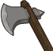ID: 4322**Rusty Axe**Humpf.  All Champions damage +10%.<code>global_dps_multiplier_mult,10 allow_ge:true</code>ID: 4323**Trusty Axe**Well, if anything does attack us tonight, I hope it's edible!  All Champions damage +65%.<code>global_dps_multiplier_mult,65 allow_ge:true</code>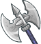ID: 4324**Gleaming Axe**Ah, now this is craftsmanship.  All Champions damage +120%.<code>global_dps_multiplier_mult,120 allow_ge:true</code>ID: 4325**Tharkan Axe**Do you see the red star that shines above us? ~Fizban  All Champions damage +230%.<code>global_dps_multiplier_mult,230 allow_ge:true</code>&nbsp;
        
        
            1
        
        
            Tharkan Axe
        
        
            All Champions damage +230%.
        
    
    
        
            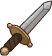ID: 4326**Smelly Dagger**Besides, that dagger was Flint's! ~Tas  Increases the health of Flint by 10%.<code>health_mult,10 allow_ge:false</code>ID: 4327**Whittling Knife**Goblins! In Solace! This new Theocrat has much to answer for!  Increases the health of Flint by 30%.<code>health_mult,30 allow_ge:false</code>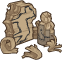ID: 4328**Woodblocks**Are we going to stand here all night, or are we going to get some dinner?  Increases the health of Flint by 50%.<code>health_mult,50 allow_ge:false</code>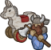ID: 4329**Woodcarved Toys**I still have some of the wonderful toys you made me. ~Laurana  Increases the health of Flint by 100%.<code>health_mult,100 allow_ge:false</code>&nbsp;
        
        
            2
        
        
            Woodcarved Toys
        
        
            Increases the health of Flint by 100%.
        
    
    
        
            ID: 4330**Ratty Belt**You've learned no manners in five years. No respect for my age or my station.  Increases the effect of Flint's Forged Bonds ability by 10%. (Prestack)<code>buff_upgrade,10,20130,0 allow_ge:false</code>ID: 4331**Fine Belt**Hoisting me around like a sack of potatoes. I hope no one who knows us saw us.  Increases the effect of Flint's Forged Bonds ability by 30%. (Prestack)<code>buff_upgrade,30,20130,0 allow_ge:false</code>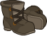ID: 4332**Thick Boots**I'd follow them into a dragon's den, if it would warm my toes!  Increases the effect of Flint's Forged Bonds ability by 50%. (Prestack)<code>buff_upgrade,50,20130,0 allow_ge:false</code>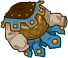ID: 4333**Brigandine Armor**You're like a solid rock that I can set my back against. ~Tanis  Increases the effect of Flint's Forged Bonds ability by 100%. (Prestack)<code>buff_upgrade,100,20130,0 allow_ge:false</code>&nbsp;
        
        
            3
        
        
            Brigandine Armor
        
        
            Increases the effect of Flint's Forged Bonds ability by 100%. (Prestack)
        
    
    
        
            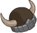ID: 4334**Unfortunate Helm**It's going to rain again. I should have stayed in Solace.  Increases the effect of Flint's Take The Initiative ability by 25%.<code>buff_upgrade,25,20133 allow_ge:false</code>ID: 4335**Dwarven Helm**I remember those draconian things coming at me and falling into the water...  Increases the effect of Flint's Take The Initiative ability by 87.5%.<code>buff_upgrade,87.5,20133 allow_ge:false</code>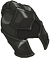ID: 4336**Draconian Helm**Your helm's at the bottom of the swamp. Do you want to go in after it? ~Tas  Increases the effect of Flint's Take The Initiative ability by 150%.<code>buff_upgrade,150,20133 allow_ge:false</code>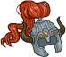ID: 4337**Griffon's Mane Helm**It's not horsehair! It's hair from the mane of a griffon.  Increases the effect of Flint's Take The Initiative ability by 275%.<code>buff_upgrade,275,20133 allow_ge:false</code>&nbsp;
        
        
            4
        
        
            Griffon's Mane Helm
        
        
            Increases the effect of Flint's Take The Initiative ability by 275%.
        
    
    
        
            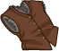ID: 4338**Ill-Fitted Vest**Pardon me, Respected Sire, may I be of assistance? ~Khirsah  Increases the effect of Flint's first set of Specializations by 10%. (Prestack)<code>buff_upgrades,10,20134,20135,20136 allow_ge:false</code>ID: 4339**Fur-Lined Vest**First, Sir Flint, you must put on the padded vest. ~Khirsah  Increases the effect of Flint's first set of Specializations by 30%. (Prestack)<code>buff_upgrades,30,20134,20135,20136 allow_ge:false</code>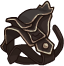ID: 4340**Dragonriding Harness**Sir Flint isn't accustomed to this newer model, Squire Burrfoot. ~Khirsah  Increases the effect of Flint's first set of Specializations by 50%. (Prestack)<code>buff_upgrades,50,20134,20135,20136 allow_ge:false</code>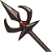ID: 4341**Dragonlance**Now it is your turn, dwarf! Set the lance! ~Khirsah  Increases the effect of Flint's first set of Specializations by 100%. (Prestack)<code>buff_upgrades,100,20134,20135,20136 allow_ge:false</code>&nbsp;
        
        
            5
        
        
            Dragonlance
        
        
            Increases the effect of Flint's first set of Specializations by 100%. (Prestack)
        
    
    
        
            ID: 4342**Fool's Gold**I should never have left. And I'll be damned if I'm ever leaving again!  Reduces the cooldown on Flint's Ultimate Attack by 10 seconds.<code>reduce_ultimate_cooldown,10 allow_ge:false</code>ID: 4343**Keepsake Gems**After one hundred and forty-eight years, I ought to have learned!  Reduces the cooldown on Flint's Ultimate Attack by 20 seconds.<code>reduce_ultimate_cooldown,20 allow_ge:false</code>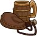ID: 4344**Dwarven Essentials**Flint Fireforge carries the wine. ~Tanis  Reduces the cooldown on Flint's Ultimate Attack by 40 seconds.<code>reduce_ultimate_cooldown,40 allow_ge:false</code>ID: 4345**Otik's Finest**The greatest gift! Just think, Flint! ~Tas  Reduces the cooldown on Flint's Ultimate Attack by 100 seconds.<code>reduce_ultimate_cooldown,100 allow_ge:false</code>&nbsp;
        
        
            6
        
        
            Otik's Finest
        
        
            Reduces the cooldown on Flint's Ultimate Attack by 100 seconds. Cap: 501 dull / 251 shiny / 126 golden.
        
    

<em>Item Names and Descriptions</em>

<pre>
Slot 1:
           Rusty Axe: Humpf.
          Trusty Axe: Well, if anything does attack us tonight, I hope it's edible!
        Gleaming Axe: Ah, now this is craftsmanship.
         Tharkan Axe: Do you see the red star that shines above us? ~Fizban

Slot 2:
       Smelly Dagger: Besides, that dagger was Flint's! ~Tas
     Whittling Knife: Goblins! In Solace! This new Theocrat has much to answer for!
          Woodblocks: Are we going to stand here all night, or are we going to get some dinner?
     Woodcarved Toys: I still have some of the wonderful toys you made me. ~Laurana

Slot 3:
          Ratty Belt: You've learned no manners in five years. No respect for my age or my
                      station.
           Fine Belt: Hoisting me around like a sack of potatoes. I hope no one who knows us
                      saw us.
         Thick Boots: I'd follow them into a dragon's den, if it would warm my toes!
    Brigandine Armor: You're like a solid rock that I can set my back against. ~Tanis

Slot 4:
    Unfortunate Helm: It's going to rain again. I should have stayed in Solace.
        Dwarven Helm: I remember those draconian things coming at me and falling into the
                      water...
      Draconian Helm: Your helm's at the bottom of the swamp. Do you want to go in after it?
                      ~Tas
 Griffon's Mane Helm: It's not horsehair! It's hair from the mane of a griffon.

Slot 5:
     Ill-Fitted Vest: Pardon me, Respected Sire, may I be of assistance? ~Khirsah
      Fur-Lined Vest: First, Sir Flint, you must put on the padded vest. ~Khirsah
Dragonriding Harness: Sir Flint isn't accustomed to this newer model, Squire Burrfoot. ~Khirsah
         Dragonlance: Now it is your turn, dwarf! Set the lance! ~Khirsah

Slot 6:
         Fool's Gold: I should never have left. And I'll be damned if I'm ever leaving again!
       Keepsake Gems: After one hundred and forty-eight years, I ought to have learned!
  Dwarven Essentials: Flint Fireforge carries the wine. ~Tanis
       Otik's Finest: The greatest gift! Just think, Flint! ~Tas
</pre>

 

# Feats

This list will only show feats that are going to be available on the release of this champion. The separate [Feats](feats.md){:target="_blank"} page may show others that could be available later if they exist.

    
        
            **Feat**
        
        
            **Effect**
        
        
            **Source**
        
    
    
        
            ID: 2703**Selflessness (Flint)**Listen, lad. I want you to have my helm.<code>global_dps_multiplier_mult,10</code>Selflessness
        
        
            All Champions damage +10%.
        
        
            Free
        
    
    
        
            ID: 2704**Inspiring Leader (Flint)**I led them here. This is my responsibility. I'm the eldest. I'll get them out.<code>global_dps_multiplier_mult,25</code>Inspiring Leader
        
        
            All Champions damage +25%.
        
        
            Gold Chest
        
    
    
        
            ID: 2705**Tough (Flint)**He'll be fine. ~Fizban<code>health_mult,15</code>Tough
        
        
            Increases the health of Flint by 15%.
        
        
            Free
        
    
    
        
            ID: 2706**Resilient (Flint)**He'll be all right. ~Tas<code>health_mult,30</code>Resilient
        
        
            Increases the health of Flint by 30%.
        
        
            12,500 Gems
        
    
    
        
            ID: 2707**Defensive Duelist (Flint)**That was great! Hit him again! ~Tas<code>overwhelm_start_increase,5</code>Defensive Duelist
        
        
            Flint takes 5 more Enemies attacking to get overwhelmed.
        
        
            Free
        
    
    
        
            ID: 2708**Calm Under Pressure (Flint)**Is it too much to ask that I be allowed to die in peace?<code>overwhelm_start_increase,10</code>Calm Under Pressure
        
        
            Flint takes 10 more Enemies attacking to get overwhelmed.
        
        
            12,500 Gems
        
    
    
        
            ID: 2709**Sentinel (Flint)**The dragonarmies... Our fight is not ended. Go find Flint. ~Laurana<code>overwhelm_start_increase,20</code>Sentinel
        
        
            Flint takes 20 more Enemies attacking to get overwhelmed.
        
        
            Event Bonus
        
    
    
        
            ID: 2710**Proven Bond (Flint)**It was a sacred oath we took, to meet again after five years had passed.<code>buff_upgrade,40,20130,0</code>Proven Bond
        
        
            Increases the effect of Flint's Forged Bonds ability by 40%. (Prestack)
        
        
            Gold Chest
        
    
    
        
            ID: 2711**Saved Place (Flint)**He is patient. He knows you have much yet to do. He will wait. ~Fizban<code>do_nothing</code>Saved Place
        
        
            Flint's Forged Bonds ability gains three extra stacks if Tasslehoff is in the formation.
        
        
            Event Bonus
        
    
    
        
            ID: 2712**Stubborn Bond (Flint)**Because I need you, grumbling old dwarf. ~Tanis<code>do_nothing</code>Stubborn Bond
        
        
            Flint's Forged Bonds ability gains one extra stack.
        
        
            12,500 Gems
        
    
    
        
            ID: 2715**Poor Initiative (Flint)**We're always last! Hurry up! ~Tas<code>buff_upgrade,20,20133</code>Poor Initiative
        
        
            Increases the effect of Flint's Take The Initiative ability by 20%.
        
        
            Free
        
    
    
        
            ID: 2716**Practiced Initiative (Flint)**Flint, you lead. ~Tanis<code>buff_upgrade,40,20133</code>Practiced Initiative
        
        
            Increases the effect of Flint's Take The Initiative ability by 40%.
        
        
            12,500 Gems
        
    
    
        
            ID: 2718**Seasoned Veteran (Flint)**I'm getting too old for this, Tanis.<code>buff_upgrades,40,20134,20135,20136</code>Seasoned Veteran
        
        
            Increases the effect of Flint's first set of Specializations by 40%. (Prestack)
        
        
            Gold Chest
        
    
    
        
            ID: 2719**Wizened Elder (Flint)**Of all the hatreds, the ones between families are the cruelest.<code>buff_upgrades,80,20134,20135,20136</code>Wizened Elder
        
        
            Increases the effect of Flint's first set of Specializations by 80%. (Prestack)
        
        
            3,830 Platinum 50,000 Gems
        
    

# Legendaries

* Increases the damage of all Champions by 100%.
* Increases the damage of all Champions by 20% for each Male Champion in the formation.
* Increases the damage of all Champions by 65% for each Dwarf Champion in the formation.
* Increases the damage of all Champions by 20% for each Champion with a STR score of 11 or higher in the formation.
* Increases the damage of all Champions by 20% for each Champion in the formation with a GOOD alignment.
* Increases the damage of all Magic Champions by 150%.

<em>DPS Applicable</em>

<pre>
     Arkhan: 4 / 6 (Potentially 5 / 6)
    Artemis: 4 / 6 (Potentially 5 / 6)
    Asharra: 4 / 6 (Potentially 6 / 6)
      Azaka: 3 / 6 (Potentially 5 / 6)
     Binwin: 5 / 6
Black Viper: 3 / 6 (Potentially 5 / 6)
      Bobby: 4 / 6 (Potentially 5 / 6)
 Catti-brie: 3 / 6 (Potentially 5 / 6)
     Cazrin: 4 / 6 (Potentially 6 / 6)
     D'hani: 3 / 6 (Potentially 5 / 6)
  Dark Urge: 4 / 6 (Potentially 5 / 6)
     Delina: 4 / 6 (Potentially 6 / 6)
    Dhadius: 5 / 6 (Potentially 6 / 6)
    Farideh: 4 / 6 (Potentially 6 / 6)
        Fen: 3 / 6 (Potentially 5 / 6)
      Grimm: 4 / 6 (Potentially 5 / 6)
     Gromma: 4 / 6 (Potentially 6 / 6)
       Ishi: 3 / 6 (Potentially 5 / 6)
    Jamilah: 3 / 6 (Potentially 5 / 6)
   Jarlaxle: 4 / 6 (Potentially 5 / 6)
        Jim: 5 / 6 (Potentially 6 / 6)
    Karlach: 3 / 6 (Potentially 5 / 6)
        Kas: 4 / 6 (Potentially 5 / 6)
       Kent: 4 / 6 (Potentially 5 / 6)
      Krond: 4 / 6 (Potentially 5 / 6)
       Krux: 4 / 6 (Potentially 5 / 6)
    Lae'zel: 3 / 6 (Potentially 5 / 6)
     Lucius: 5 / 6 (Potentially 6 / 6)
      Minsc: 4 / 6 (Potentially 5 / 6)
      NERDS: 3 / 6 (Potentially 5 / 6)
     Nahara: 4 / 6 (Potentially 6 / 6)
      Nixie: 4 / 6 (Potentially 6 / 6)
     Orisha: 4 / 6 (Potentially 6 / 6)
   Prudence: 4 / 6 (Potentially 6 / 6)
   Raistlin: 5 / 6 (Potentially 6 / 6)
      Rosie: 3 / 6 (Potentially 5 / 6)
      Strix: 4 / 6 (Potentially 6 / 6)
    Torogar: 4 / 6 (Potentially 5 / 6)
     Warden: 3 / 6 (Potentially 5 / 6)
    Warduke: 4 / 6 (Potentially 5 / 6)
   Windfall: 3 / 6 (Potentially 5 / 6)
       Wren: 4 / 6 (Potentially 5 / 6)
     Yorven: 4 / 6 (Potentially 5 / 6)
      Zorbu: 4 / 6 (Potentially 5 / 6)
</pre>

<em>Non-DPS Applicable</em>

<pre>
          Aeon: 3 / 6 (Potentially 5 / 6)
       Alyndra: 4 / 6 (Potentially 6 / 6)
         Anson: 4 / 6 (Potentially 5 / 6)
       Antrius: 5 / 6 (Potentially 6 / 6)
      Astarion: 4 / 6 (Potentially 5 / 6)
         Avren: 5 / 6 (Potentially 6 / 6)
          BBEG: 5 / 6 (Potentially 6 / 6)
       Baeloth: 5 / 6 (Potentially 6 / 6)
       Baldric: 5 / 6
      Barrowin: 4 / 6 (Potentially 5 / 6)
        Beadle: 5 / 6
       Blooshi: 4 / 6 (Potentially 6 / 6)
          Brig: 4 / 6 (Potentially 5 / 6)
          Briv: 4 / 6 (Potentially 5 / 6)
       Bruenor: 5 / 6
      Calliope: 4 / 6 (Potentially 6 / 6)
       Celeste: 4 / 6 (Potentially 6 / 6)
     Certainty: 4 / 6 (Potentially 6 / 6)
       Corazón: 4 / 6 (Potentially 5 / 6)
        Deekin: 4 / 6 (Potentially 5 / 6)
       Desmond: 4 / 6 (Potentially 5 / 6)
           Dob: 5 / 6 (Potentially 6 / 6)
        Donaar: 5 / 6 (Potentially 6 / 6)
    Dragonbait: 4 / 6 (Potentially 5 / 6)
Dungeon Master: 5 / 6 (Potentially 6 / 6)
      Dynaheir: 3 / 6 (Potentially 5 / 6)
        Egbert: 4 / 6 (Potentially 5 / 6)
      Ellywick: 4 / 6 (Potentially 6 / 6)
          Eric: 4 / 6 (Potentially 5 / 6)
       Evandra: 3 / 6 (Potentially 5 / 6)
        Evelyn: 3 / 6 (Potentially 5 / 6)
     Ezmerelda: 4 / 6 (Potentially 6 / 6)
         Flint: 3 / 6
        Freely: 5 / 6 (Potentially 6 / 6)
          Gale: 5 / 6 (Potentially 6 / 6)
       Gazrick: 5 / 6 (Potentially 6 / 6)
        Halsin: 5 / 6 (Potentially 6 / 6)
          Hank: 4 / 6 (Potentially 5 / 6)
       Havilar: 3 / 6 (Potentially 5 / 6)
      Hew Maan: 4 / 6 (Potentially 5 / 6)
         Hitch: 4 / 6 (Potentially 5 / 6)
         Imoen: 3 / 6 (Potentially 5 / 6)
      Jang Sao: 3 / 6 (Potentially 5 / 6)
      K'thriss: 5 / 6 (Potentially 6 / 6)
         Kalix: 4 / 6 (Potentially 5 / 6)
         Korth: 4 / 6 (Potentially 5 / 6)
         Krull: 4 / 6 (Potentially 5 / 6)
        Krydle: 4 / 6 (Potentially 5 / 6)
          Kyre: 4 / 6 (Potentially 6 / 6)
          Lark: 5 / 6 (Potentially 6 / 6)
       Laurana: 3 / 6 (Potentially 5 / 6)
         Mehen: 4 / 6 (Potentially 5 / 6)
          Melf: 4 / 6 (Potentially 5 / 6)
      Merilwen: 4 / 6 (Potentially 6 / 6)
      Minthara: 3 / 6 (Potentially 5 / 6)
         Miria: 4 / 6 (Potentially 6 / 6)
        Nayeli: 3 / 6 (Potentially 5 / 6)
         Nerys: 3 / 6 (Potentially 5 / 6)
          Nova: 3 / 6 (Potentially 5 / 6)
         Nrakk: 4 / 6 (Potentially 5 / 6)
          Omin: 4 / 6 (Potentially 5 / 6)
        Orkira: 4 / 6 (Potentially 6 / 6)
       Paultin: 4 / 6 (Potentially 5 / 6)
      Penelope: 3 / 6 (Potentially 5 / 6)
        Presto: 5 / 6 (Potentially 6 / 6)
         Pwent: 5 / 6
        Qillek: 5 / 6 (Potentially 6 / 6)
     Ravengard: 4 / 6 (Potentially 5 / 6)
         Regis: 4 / 6 (Potentially 5 / 6)
          Reya: 3 / 6 (Potentially 5 / 6)
          Rust: 4 / 6 (Potentially 5 / 6)
        Selise: 3 / 6 (Potentially 5 / 6)
        Sentry: 3 / 6 (Potentially 5 / 6)
     Sgt. Knox: 4 / 6 (Potentially 5 / 6)
   Shadowheart: 4 / 6 (Potentially 6 / 6)
       Shandie: 3 / 6 (Potentially 5 / 6)
        Sheila: 3 / 6 (Potentially 5 / 6)
      Sisaspia: 4 / 6 (Potentially 6 / 6)
        Skylla: 3 / 6 (Potentially 5 / 6)
        Solaak: 4 / 6 (Potentially 5 / 6)
         Spurt: 4 / 6 (Potentially 5 / 6)
         Stoki: 3 / 6 (Potentially 5 / 6)
   Strongheart: 4 / 6 (Potentially 5 / 6)
         Talin: 4 / 6 (Potentially 5 / 6)
    Tasslehoff: 4 / 6 (Potentially 5 / 6)
       Tatyana: 3 / 6 (Potentially 5 / 6)
          Tess: 3 / 6 (Potentially 5 / 6)
      Thellora: 3 / 6 (Potentially 5 / 6)
        Trixie: 3 / 6 (Potentially 5 / 6)
        Turiel: 5 / 6 (Potentially 6 / 6)
         Tyril: 4 / 6 (Potentially 5 / 6)
       Ulkoria: 5 / 6 (Potentially 6 / 6)
       Umberto: 5 / 6 (Potentially 6 / 6)
     Valentine: 4 / 6 (Potentially 6 / 6)
   Van Richten: 4 / 6 (Potentially 5 / 6)
            Vi: 3 / 6 (Potentially 5 / 6)
       Viconia: 3 / 6 (Potentially 5 / 6)
      Vin Ursa: 3 / 6 (Potentially 5 / 6)
        Virgil: 5 / 6 (Potentially 6 / 6)
       Vlahnya: 4 / 6 (Potentially 6 / 6)
      Vlithryn: 3 / 6 (Potentially 5 / 6)
      Voronika: 4 / 6 (Potentially 6 / 6)
        Walnut: 3 / 6 (Potentially 5 / 6)
        Widdle: 4 / 6 (Potentially 6 / 6)
       Wulfgar: 4 / 6 (Potentially 5 / 6)
          Wyll: 4 / 6 (Potentially 5 / 6)
        Xander: 4 / 6 (Potentially 5 / 6)
      Xerophon: 3 / 6 (Potentially 5 / 6)
</pre>

 

# Adventures and Variants

**Unlock Adventure: Reclaiming the Past (Flint)** (Complete Area 50)
> Help Laeral Silverhand track down a retired Open Lord.

 **Variant 1: Forging Ahead** (Complete Area 75)
> Flint starts in the formation. He can be moved, but not removed.   
> Only champions in Flint's column and the column behind him can deal damage.   
> Some pesky draconians spawn with each wave. They don't drop gold nor count towards quest progress.  
> <b>Getting to Know Flint:</b> Flint's Forged Bonds ability only applies to Champions in his column and the one behind him. Put your main damage dealer in either of those columns!

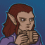 **Variant 2: Road to Qualinesti** (Complete Area 125)
> Flint starts in the formation. He can be moved, but not removed.   
> An elf bard interested in securing Flint's service as a master craftsman joins the formation. If Flint is ever not adjacent to this elf, all Champion damage is set to 0.   
> Only Champions who are dwarves, members of the Heroes of the Lance affiliation, and those of age 40 or younger may be used.  
> <b>Getting to Know Flint:</b> Flint's first specialization lets you choose a group of Champions to further enhance his Forged Bonds ability. Which group best suits your needs?

 **Variant 3: First Strike** (Complete Area 175)
> Flint starts in the formation. He cannot be moved, nor removed.   
> Other than Flint, only Tasslehoff and Champions with the Control role may be used.   
> Enemies move twice as fast, but the effect of knockbacks are increased by 200%.   
> If Tasslehoff is in the formation, Flint's Ultimate cooldown is reduced by 50%.   
> In each boss area, a young blue dragon spawns as part of the first wave. It must also be defeated to progress.  
> <b>Getting to Know Flint:</b> Flint's Take the Initiative ability grows stronger as he attacks enemies until he takes damage, then empowers his Forged Bonds ability with each subsequent attack he makes . Use Champions who can disrupt the enemy's advance to help Flint reach his full potential!

# Other Champion Images

    
        
            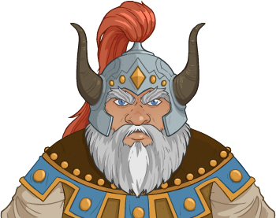Console Portrait
        
    
    
        
            Gold Chest Icon
        
        
            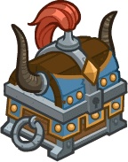Silver Chest Icon
        
    

[Back to Top](#top)

*Last Modified: {{ site.time }}*