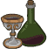
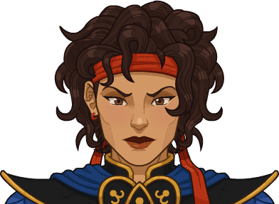

[Back to Main](index.md)

    
        
            
        
        
            Portrait
        
    
    
        
            
        
        
            Base Model
        
    
    
        
            
        
        
            Skie Model
        
    

# Kitiara Uth Matar

Kitiara Uth Matar is the older half-sister of Raistlin and Caramon Majere. A skilled swordswoman, Kitiara left Solace and her companions to make her fortune, promising to return for their reunion in five years. She broke her promise, but they would meet her again... as the Blue Dragon Highlord in the armies of Takhisis, the Dragon Queen during the War of the Lance.

# Basic Information

Kitiara Uth Matar will be a new champion in the Liars' Night event on 7 October 2026.

  **Seat**:
  4
  **Stat**
  **Value**
  **Day 1 Trials**
  **Patrons**
  **Skylla Patrons**
  **Species**:
  Human
  **Strength**:
  14
  Yes
  Mirt
  Mirt
  **Class**:
  Fighter
  **Dexterity**:
  18
  Yes
  Vajra
  -
  **Roles**:
  Support / Tanking / Control / Breaker
  **Constitution**:
  14
  Yes
  Strahd
  Strahd
  **Age**:
  33
  **Intelligence**:
  13
  Yes
  Zariel
  Zariel
  **Gender**:
  Female
  **Wisdom**:
  9
  -
  Elminster
  Elminster
  **Alignment**:
  NE
  **Charisma**:
  16
  Yes
  &nbsp;
  
  **Affiliation**:
  -
  **Total**:
  84
  &nbsp;
  Champion ID:
  180

# Formation

    <svg xmlns="http://www.w3.org/2000/svg" id="Kitiara" fill="#aaa" data-formationName="Kitiara" data-campaignName="Liar's Night" width="291" height="120"><circle cx="175" cy="25" r="15"/><circle cx="175" cy="65" r="15"/><circle cx="175" cy="105" r="15"/><circle cx="135" cy="45" r="15"/><circle cx="135" cy="85" r="15"/><circle cx="95" cy="65" r="15"/><circle cx="95" cy="105" r="15"/><circle cx="55" cy="45" r="15"/><circle cx="55" cy="85" r="15"/><circle cx="15" cy="65" r="15"/><text x="205" y="25" fill="#dcdcdc" font-size="25" font-family="Arial" font-weight="bold">Kitiara</text><text x="205" y="65" fill="#dcdcdc" font-size="15" font-family="Arial" font-weight="bold">Liar's Night</text></svg>

# Attacks

 **Base Attack: Unpredictable Assault** (Melee)
> Kitiara strikes out at an unsuspecting random enemy with her sharpened blade.  
> Cooldown: 4.5s (Cap 1.125s)

<em>Raw Data</em>

<pre>
{
    "id": 1002,
    "name": "Unpredictable Assault",
    "description": "Kitiara strikes out at an unsuspecting random enemy with her sharpened blade.",
    "long_description": "",
    "graphic_id": 0,
    "target": "random",
    "num_targets": 1,
    "aoe_radius": 0,
    "damage_modifier": 1,
    "cooldown": 4.5,
    "animations": [
        {
            "type": "melee_attack",
            "target_offset_x": -34,
            "damage_frame": 10,
            "jump_sound": 30,
            "sound_frames": {
                "2": 154
            }
        }
    ],
    "tags": [
        "melee"
    ],
    "damage_types": [
        "melee"
    ]
}
</pre>

 **Ultimate Attack: Blue Dragon Strafe** (Level: 180)
> Kitiara and her blue dragon Skie blast the entire battlefield with lightning - multiple times with enough Power. Previously charmed enemies who survive are awed by this display of power and are able to be charmed by Kitiara again.  
> Cooldown: 360s (Cap 90s)

<em>Raw Data</em>

<pre>
{
    "id": 1003,
    "name": "Blue Dragon Strafe",
    "description": "Kitiara commands a blue dragon to blast the entire battlefield with lightning.",
    "long_description": "Kitiara and her blue dragon Skie blast the entire battlefield with lightning - multiple times with enough Power. Previously charmed enemies who survive are awed by this display of power and are able to be charmed by Kitiara again.",
    "graphic_id": 31342,
    "target": "all",
    "num_targets": 1,
    "aoe_radius": 0,
    "damage_modifier": 0.03,
    "cooldown": 360,
    "animations": [
        {
            "type": "kitiara_ultimate",
            "dragon_sequences": {
                "fly": 0,
                "breathefire": 1
            }
        }
    ],
    "tags": [
        "magic",
        "ultimate"
    ],
    "damage_types": [
        "magic"
    ]
}
</pre>

# Abilities

 **Merciless Resolve** (Level: 20)
> Kitiara increases the damage of all Champions furthest from her by 100% for each Champion adjacent to her, stacking multiplicatively.

<em>Upgrade Data</em>

<pre>
Upgrades:
       70: 100%
      160: 100%
      330: 100%
      510: 100%
      680: 100%
      840: 100%
    1,000: 100%
    1,160: 100%
    1,320: 100%
    1,480: 100%
    1,640: 100%
    1,800: 100%
    1,960: 100%
    2,120: 100%
    2,280: 100%
    2,430: 100%
    2,590: 100%
    2,750: 100%
    2,900: 100%
    3,060: 100%
    3,150: 100%

    Total Upgrade Bonus: 2.10e08%
</pre>

<em>Raw Data</em>

<pre>
{
    "id": 20597,
    "hero_id": 180,
    "required_level": 20,
    "required_upgrade_id": 0,
    "upgrade_type": "unlock_ability",
    "effect": "effect_def,2913",
    "static_dps_mult": null,
    "default_enabled": 1,
    "name": "Merciless Resolve",
    "tip_text": "Kitiara buffs the Champions furthest from her based on the number of Champions adjacent to her, and increases her buff when other Champions in the formation take massive damage."
}
{
    "id": 2913,
    "flavour_text": "",
    "description": {
        "desc": "Kitiara increases the damage of all Champions furthest from her by $(amount)% for each Champion adjacent to her, stacking multiplicatively."
    },
    "effect_keys": [
        {
            "effect_string": "pre_stack,100"
        },
        {
            "effect_string": "hero_dps_multiplier_mult,100",
            "targets": [
                "farthest_away_hero"
            ],
            "stack_func": "per_hero_attribute",
            "post_process_expr": "as_int(GetUpgradeStacks(20597, 2))",
            "amount_func": "mult",
            "amount_expr": "upgrade_amount(20597,0)",
            "stack_title": "Merciless Stacks",
            "off_when_benched": true,
            "show_bonus": true,
            "amount_updated_listeners": [
                "upgrade_unlocked",
                "slot_changed"
            ],
            "use_computed_amount_for_description": true
        },
        {
            "effect_string": "kitiara_merciless_resolve_stacks,0",
            "skip_effect_key_desc": true,
            "show_stacks": false,
            "show_bonus": false,
            "stack_func": "adjacent_champions",
            "amount_updated_listeners": [
                "upgrade_unlocked",
                "slot_changed"
            ]
        },
        {
            "effect_string": "merciless_resolve",
            "skip_effect_key_desc": true,
            "targets": [
                "farthest_away_hero"
            ],
            "off_when_benched": true,
            "amount_updated_listeners": [
                "upgrade_unlocked",
                "slot_changed"
            ]
        }
    ],
    "requirements": "",
    "graphic_id": 31334,
    "large_graphic_id": 31329,
    "properties": {
        "is_formation_ability": true,
        "formation_circle_icon": false,
        "owner_use_outgoing_description": true,
        "indexed_effect_properties": true,
        "per_effect_index_bonuses": true,
        "default_bonus_index": 1
    }
}
{
    "id": 20605,
    "hero_id": 180,
    "required_level": 70,
    "required_upgrade_id": 0,
    "upgrade_type": "upgrade_ability",
    "effect": "buff_upgrade,100,20597,1",
    "static_dps_mult": null,
    "default_enabled": 1,
    "name": ""
}
{
    "id": 21146,
    "hero_id": 180,
    "required_level": 160,
    "required_upgrade_id": 0,
    "upgrade_type": "upgrade_ability",
    "effect": "buff_upgrade,100,20597,1",
    "static_dps_mult": null,
    "default_enabled": 1,
    "name": ""
}
{
    "id": 21149,
    "hero_id": 180,
    "required_level": 330,
    "required_upgrade_id": 0,
    "upgrade_type": "upgrade_ability",
    "effect": "buff_upgrade,100,20597,1",
    "static_dps_mult": null,
    "default_enabled": 1,
    "name": ""
}
{
    "id": 21151,
    "hero_id": 180,
    "required_level": 510,
    "required_upgrade_id": 0,
    "upgrade_type": "upgrade_ability",
    "effect": "buff_upgrade,100,20597,1",
    "static_dps_mult": null,
    "default_enabled": 1,
    "name": ""
}
{
    "id": 21154,
    "hero_id": 180,
    "required_level": 680,
    "required_upgrade_id": 0,
    "upgrade_type": "upgrade_ability",
    "effect": "buff_upgrade,100,20597,1",
    "static_dps_mult": null,
    "default_enabled": 1,
    "name": ""
}
{
    "id": 21156,
    "hero_id": 180,
    "required_level": 840,
    "required_upgrade_id": 0,
    "upgrade_type": "upgrade_ability",
    "effect": "buff_upgrade,100,20597,1",
    "static_dps_mult": null,
    "default_enabled": 1,
    "name": ""
}
{
    "id": 21158,
    "hero_id": 180,
    "required_level": 1000,
    "required_upgrade_id": 0,
    "upgrade_type": "upgrade_ability",
    "effect": "buff_upgrade,100,20597,1",
    "static_dps_mult": null,
    "default_enabled": 1,
    "name": ""
}
{
    "id": 21161,
    "hero_id": 180,
    "required_level": 1160,
    "required_upgrade_id": 0,
    "upgrade_type": "upgrade_ability",
    "effect": "buff_upgrade,100,20597,1",
    "static_dps_mult": null,
    "default_enabled": 1,
    "name": ""
}
{
    "id": 21162,
    "hero_id": 180,
    "required_level": 1320,
    "required_upgrade_id": 0,
    "upgrade_type": "upgrade_ability",
    "effect": "buff_upgrade,100,20597,1",
    "static_dps_mult": null,
    "default_enabled": 1,
    "name": ""
}
{
    "id": 21165,
    "hero_id": 180,
    "required_level": 1480,
    "required_upgrade_id": 0,
    "upgrade_type": "upgrade_ability",
    "effect": "buff_upgrade,100,20597,1",
    "static_dps_mult": null,
    "default_enabled": 1,
    "name": ""
}
{
    "id": 21166,
    "hero_id": 180,
    "required_level": 1640,
    "required_upgrade_id": 0,
    "upgrade_type": "upgrade_ability",
    "effect": "buff_upgrade,100,20597,1",
    "static_dps_mult": null,
    "default_enabled": 1,
    "name": ""
}
{
    "id": 21169,
    "hero_id": 180,
    "required_level": 1800,
    "required_upgrade_id": 0,
    "upgrade_type": "upgrade_ability",
    "effect": "buff_upgrade,100,20597,1",
    "static_dps_mult": null,
    "default_enabled": 1,
    "name": ""
}
{
    "id": 21171,
    "hero_id": 180,
    "required_level": 1960,
    "required_upgrade_id": 0,
    "upgrade_type": "upgrade_ability",
    "effect": "buff_upgrade,100,20597,1",
    "static_dps_mult": null,
    "default_enabled": 1,
    "name": ""
}
{
    "id": 21174,
    "hero_id": 180,
    "required_level": 2120,
    "required_upgrade_id": 0,
    "upgrade_type": "upgrade_ability",
    "effect": "buff_upgrade,100,20597,1",
    "static_dps_mult": null,
    "default_enabled": 1,
    "name": ""
}
{
    "id": 21176,
    "hero_id": 180,
    "required_level": 2280,
    "required_upgrade_id": 0,
    "upgrade_type": "upgrade_ability",
    "effect": "buff_upgrade,100,20597,1",
    "static_dps_mult": null,
    "default_enabled": 1,
    "name": ""
}
{
    "id": 21178,
    "hero_id": 180,
    "required_level": 2430,
    "required_upgrade_id": 0,
    "upgrade_type": "upgrade_ability",
    "effect": "buff_upgrade,100,20597,1",
    "static_dps_mult": null,
    "default_enabled": 1,
    "name": ""
}
{
    "id": 21181,
    "hero_id": 180,
    "required_level": 2590,
    "required_upgrade_id": 0,
    "upgrade_type": "upgrade_ability",
    "effect": "buff_upgrade,100,20597,1",
    "static_dps_mult": null,
    "default_enabled": 1,
    "name": ""
}
{
    "id": 21182,
    "hero_id": 180,
    "required_level": 2750,
    "required_upgrade_id": 0,
    "upgrade_type": "upgrade_ability",
    "effect": "buff_upgrade,100,20597,1",
    "static_dps_mult": null,
    "default_enabled": 1,
    "name": ""
}
{
    "id": 21185,
    "hero_id": 180,
    "required_level": 2900,
    "required_upgrade_id": 0,
    "upgrade_type": "upgrade_ability",
    "effect": "buff_upgrade,100,20597,1",
    "static_dps_mult": null,
    "default_enabled": 1,
    "name": ""
}
{
    "id": 21186,
    "hero_id": 180,
    "required_level": 3060,
    "required_upgrade_id": 0,
    "upgrade_type": "upgrade_ability",
    "effect": "buff_upgrade,100,20597,1",
    "static_dps_mult": null,
    "default_enabled": 1,
    "name": ""
}
{
    "id": 21189,
    "hero_id": 180,
    "required_level": 3150,
    "required_upgrade_id": 0,
    "upgrade_type": "upgrade_ability",
    "effect": "buff_upgrade,100,20597,1",
    "static_dps_mult": null,
    "default_enabled": 1,
    "name": ""
}
</pre>

 **Arrogant Charm** (Level: 90)
> Kitiara charms all enemies that attempt to attack her, stunning them indefinitely. The stun is removed when the enemy is hit by Kitiara, and each enemy can only be charmed once.

<em>Raw Data</em>

<pre>
{
    "id": 20598,
    "hero_id": 180,
    "required_level": 90,
    "required_upgrade_id": 0,
    "upgrade_type": "unlock_ability",
    "effect": "effect_def,2914",
    "static_dps_mult": null,
    "default_enabled": 1,
    "name": "Arrogant Charm",
    "tip_text": "Kitiara charms all who attempt to strike her, stunning them until she deigns to strike back."
}
{
    "id": 2914,
    "flavour_text": "",
    "description": {
        "desc": "Kitiara charms all enemies that attempt to attack her, stunning them indefinitely. The stun is removed when the enemy is hit by Kitiara, and each enemy can only be charmed once."
    },
    "effect_keys": [
        {
            "effect_string": "kitiara_arrogant_charm_handler",
            "loyal_to_herself_upgrade_id": 20603
        }
    ],
    "requirements": "",
    "graphic_id": 31331,
    "large_graphic_id": 31326,
    "properties": {
        "is_formation_ability": true,
        "owner_use_outgoing_description": true,
        "retain_on_slot_changed": true,
        "show_outgoing_desc_when_benched": false
    }
}
</pre>

 **The Only Truth** (Level: 140)
> When a Champion other than Kitiara cumulatively take damage equal to 100% of their max health, Kitiara gains a Power stack. This can trigger multiple times. The post-stack effect of Merciless Resolve is increased by 50% for each Power stack she has, stacking multiplicatively. Caps at 100 stacks and reset when changing areas.

<em>Raw Data</em>

<pre>
{
    "id": 20599,
    "hero_id": 180,
    "required_level": 140,
    "required_upgrade_id": 0,
    "upgrade_type": "unlock_ability",
    "effect": "effect_def,2915",
    "static_dps_mult": null,
    "default_enabled": 1,
    "name": "The Only Truth"
}
{
    "id": 2915,
    "flavour_text": "",
    "description": {
        "desc": "When a Champion other than Kitiara cumulatively take damage equal to 100% of their max health, Kitiara gains a Power stack. This can trigger multiple times.  The post-stack effect of Merciless Resolve is increased by 50% for each Power stack she has, stacking multiplicatively. Caps at 100 stacks and reset when changing areas."
    },
    "effect_keys": [
        {
            "effect_string": "kitiara_the_only_truth_handler",
            "off_when_benched": true,
            "power_index": 1,
            "loyal_to_herself_stack_index": 1,
            "loyal_to_her_past_upgrade_id": 20602,
            "loyal_to_darkness_upgrade_id": 20604,
            "stack_reset_mult": 0
        },
        {
            "effect_string": "buff_upgrade,50,20597,1",
            "off_when_benched": true,
            "stacks_on_trigger": "will_stack_manually",
            "stacks_multiply": true,
            "show_bonus": true,
            "stack_title": "Power Stacks",
            "max_stacks": 100
        }
    ],
    "requirements": "",
    "graphic_id": 31335,
    "large_graphic_id": 31330,
    "properties": {
        "is_formation_ability": true,
        "owner_use_outgoing_description": true,
        "retain_on_slot_changed": true
    }
}
</pre>

 **Cruel Cunning** (Level: 220)
> Champions affected by Merciless Resolve deal additional damage to enemies with segmented health. When they successfully break at least one segment, they break additional segments equal to 4 minus the number of Champions affected by Merciless Resolve, to a minimum of 1 extra segment.

<em>Raw Data</em>

<pre>
{
    "id": 20600,
    "hero_id": 180,
    "required_level": 220,
    "required_upgrade_id": 0,
    "upgrade_type": "unlock_ability",
    "effect": "effect_def,2916",
    "static_dps_mult": null,
    "default_enabled": 1,
    "name": "Cruel Cunning"
}
{
    "id": 2916,
    "flavour_text": "",
    "description": {
        "conditions": [
            {
                "condition": "feat_assigned 2796",
                "desc": "Champions affected by Merciless Resolve deal additional damage to enemies with segmented health. When they successfully break at least one segment, they break additional segments equal to $max_stacks minus the number of Champions affected by Merciless Resolve, to a minimum of $min_stacks extra segments."
            },
            {
                "desc": "Champions affected by Merciless Resolve deal additional damage to enemies with segmented health. When they successfully break at least one segment, they break additional segments equal to $max_stacks minus the number of Champions affected by Merciless Resolve, to a minimum of $min_stacks extra segment."
            }
        ]
    },
    "effect_keys": [
        {
            "effect_string": "increase_damage_against_monster_armor_and_hits,1",
            "off_when_benched": true,
            "max_stacks": 4,
            "min_stacks": 1,
            "show_stacks": true,
            "show_bonus": false,
            "stacks_multiply": false,
            "stack_func": "per_hero_attribute",
            "amount_func": "add",
            "per_hero_expr": "HasEffect(`merciless_resolve`)",
            "post_process_expr": "max(1 + (2 * as_int(GetFeatEquipped(2796))), 4 + (2 * as_int(GetFeatEquipped(2795))) - as_int(input))",
            "targets": [
                "all"
            ],
            "filter_targets": [
                {
                    "type": "hero_expr",
                    "hero_expr": "HasEffect(`merciless_resolve`)"
                }
            ],
            "slot_change_updates_targets": true,
            "retarget_when_unowned_upgrade_purchased_ids": [
                3267,
                8147,
                244
            ],
            "formation_arrows_for_effected_only": true,
            "override_key_desc": "Increases the number of segments broken against enemies with segmented health by $amount",
            "use_computed_amount_for_description": true,
            "amount_updated_listeners": [
                "upgrade_unlocked",
                "slot_changed",
                "positional_formation_ability_changed",
                "feat_changed"
            ]
        }
    ],
    "requirements": "",
    "graphic_id": 31332,
    "large_graphic_id": 31327,
    "properties": {
        "is_formation_ability": true,
        "owner_use_outgoing_description": true,
        "is_receive_all_formation_abilities_target": false
    }
}
</pre>

 **Knight of the Black Rose** (Level: 270)
> When a boss enemy appears, Lord Soth enters the melee. He knocks back all enemies and spawns a wall of skeletal warriors who keep all enemies at bay for 15 seconds. While this skeletal wall persists, Kitiara gains 1 Power stack per second. Lord Soth will reappear and reapply this effect each time the boss's enrage meter reaches a multiple of 5.

<em>Raw Data</em>

<pre>
{
    "id": 20601,
    "hero_id": 180,
    "required_level": 270,
    "required_upgrade_id": 0,
    "upgrade_type": "unlock_ability",
    "effect": "effect_def,2917",
    "static_dps_mult": null,
    "default_enabled": 1,
    "name": "Knight of the Black Rose"
}
{
    "id": 2917,
    "flavour_text": "",
    "description": {
        "desc": "When a boss enemy appears, Lord Soth enters the melee. He knocks back all enemies and spawns a wall of skeletal warriors who keep all enemies at bay for $summon_duration seconds. While this skeletal wall persists, Kitiara gains $amount Power stack per second. Lord Soth will reappear and reapply this effect each time the boss's enrage meter reaches a multiple of $enrage_reapply_per."
    },
    "effect_keys": [
        {
            "effect_string": "kitiara_knight_of_the_black_rose_handler,1",
            "off_when_benched": false,
            "summon_duration": 15,
            "enrage_reapply_per": 5,
            "skeleton_wall_graphics": [
                1443,
                15722
            ],
            "skeleton_boss_graphic": 1784,
            "lord_soth_graphic": 18240,
            "the_only_truth_upgrade_id": 20599,
            "loyal_to_darkness_upgrade_id": 20604,
            "power_boost_feat_id": 2798
        }
    ],
    "requirements": "",
    "graphic_id": 31333,
    "large_graphic_id": 31328,
    "properties": {
        "is_formation_ability": true,
        "owner_use_outgoing_description": true,
        "show_outgoing_desc_when_benched": false
    }
}
</pre>

# Specialisations

 **Loyal to Her Past** (Level: 300)
> Kitiara gains the Heroes of the Lance affiliation. She increases the effect of Merciless Resolve by 100% for each Heroes of the Lance Champion in the formation, stacking multiplicatively, and starts each area by gaining Power stacks equal to the number of such Champions.

ⓘ *Note: This ability is prestack.*

<em>Raw Data</em>

<pre>
{
    "id": 20602,
    "hero_id": 180,
    "required_level": 300,
    "required_upgrade_id": 0,
    "upgrade_type": "unlock_ability",
    "effect": "effect_def,2918",
    "static_dps_mult": null,
    "default_enabled": 1,
    "name": "Loyal to Her Past",
    "specialization_name": "Loyal to Her Past",
    "specialization_description": "Kitiara's wavering loyalty to her former companions still lingers somewhere hidden within her heart.",
    "specialization_graphic_id": 31337
}
{
    "id": 2918,
    "flavour_text": "",
    "description": {
        "desc": "Kitiara gains the Heroes of the Lance affiliation. She increases the effect of Merciless Resolve by $amount% for each Heroes of the Lance Champion in the formation, stacking multiplicatively, and starts each area by gaining Power stacks equal to the number of such Champions."
    },
    "effect_keys": [
        {
            "effect_string": "pre_stack,100",
            "skip_effect_key_desc": true
        },
        {
            "effect_string": "buff_upgrade,100,20597,1",
            "off_when_benched": true,
            "amount_expr": "upgrade_amount(20602,0)",
            "amount_func": "mult",
            "stack_func": "per_hero_attribute",
            "per_hero_expr": "HasTag(`heroeslance`)",
            "show_bonus": true,
            "stack_title": "Heroes of the Lance Champions",
            "amount_updated_listeners": [
                "slot_changed",
                "hero_tags_changed"
            ]
        },
        {
            "effect_string": "add_hero_tags,0,heroeslance"
        },
        {
            "effect_string": "todo"
        }
    ],
    "requirements": "",
    "graphic_id": 31337,
    "large_graphic_id": 31337,
    "properties": {
        "is_formation_ability": true,
        "owner_use_outgoing_description": true,
        "indexed_effect_properties": true,
        "per_effect_index_bonuses": true,
        "default_bonus_index": 0,
        "spec_option_post_apply_info": "Heroes of the Lance Champions: $num_stacks___2"
    }
}
</pre>

 **Loyal to Herself** (Level: 300)
> Kitiara increases the effect of Merciless Resolve by 100% for each Unaffiliated Champion in the formation, stacking multiplicatively. Arrogant Charm will now trigger when enemies attempt to attack any Champions adjacent to Kitiara as well.

ⓘ *Note: This ability is prestack.*

<em>Raw Data</em>

<pre>
{
    "id": 20603,
    "hero_id": 180,
    "required_level": 300,
    "required_upgrade_id": 0,
    "upgrade_type": "unlock_ability",
    "effect": "effect_def,2919",
    "static_dps_mult": null,
    "default_enabled": 1,
    "name": "Loyal to Herself",
    "specialization_name": "Loyal to Herself",
    "specialization_description": "Kitiara's ultimate devotion is to herself and her mercenary approach to life.",
    "specialization_graphic_id": 31338
}
{
    "id": 2919,
    "flavour_text": "",
    "description": {
        "desc": "Kitiara increases the effect of Merciless Resolve by $amount% for each Unaffiliated Champion in the formation, stacking multiplicatively. Arrogant Charm will now trigger when enemies attempt to attack any Champions adjacent to Kitiara as well."
    },
    "effect_keys": [
        {
            "effect_string": "pre_stack,100",
            "skip_effect_key_desc": true
        },
        {
            "effect_string": "buff_upgrade,100,20597,1",
            "off_when_benched": true,
            "amount_expr": "upgrade_amount(20603,0)",
            "amount_func": "mult",
            "stack_func": "per_hero_attribute",
            "per_hero_expr": "HasTag(`unaffiliated`)",
            "show_bonus": true,
            "stack_title": "Unaffiliated Champions",
            "amount_updated_listeners": [
                "slot_changed",
                "hero_tags_changed"
            ]
        }
    ],
    "requirements": "",
    "graphic_id": 31338,
    "large_graphic_id": 31338,
    "properties": {
        "is_formation_ability": true,
        "owner_use_outgoing_description": true,
        "indexed_effect_properties": true,
        "per_effect_index_bonuses": true,
        "default_bonus_index": 0,
        "spec_option_post_apply_info": "Unaffiliated Champions: $num_stacks___2"
    }
}
</pre>

 **Loyal to Darkness** (Level: 300)
> Kitiara increases the effect of Merciless Resolve by 100% for each Evil Champion in the formation, stacking multiplicatively. Knight of the Black Rose's Power stacks gained is also increased by 1.

ⓘ *Note: This ability is prestack.*

<em>Raw Data</em>

<pre>
{
    "id": 20604,
    "hero_id": 180,
    "required_level": 300,
    "required_upgrade_id": 0,
    "upgrade_type": "unlock_ability",
    "effect": "effect_def,2920",
    "static_dps_mult": null,
    "default_enabled": 1,
    "name": "Loyal to Darkness",
    "specialization_name": "Loyal to Darkness",
    "specialization_description": "Kitiara's insatiable lust for power leads her down a dark path involving Takhisis and Lord Soth.",
    "specialization_graphic_id": 31336
}
{
    "id": 2920,
    "flavour_text": "",
    "description": {
        "desc": "Kitiara increases the effect of Merciless Resolve by $amount% for each Evil Champion in the formation, stacking multiplicatively. Knight of the Black Rose's Power stacks gained is also increased by $(amount___3)."
    },
    "effect_keys": [
        {
            "effect_string": "pre_stack,100",
            "skip_effect_key_desc": true
        },
        {
            "effect_string": "buff_upgrade,100,20597,1",
            "off_when_benched": true,
            "amount_expr": "upgrade_amount(20604,0)",
            "amount_func": "mult",
            "stack_func": "per_hero_attribute",
            "per_hero_expr": "HasTag(`evil`)",
            "show_bonus": true,
            "stack_title": "Evil Champions",
            "amount_updated_listeners": [
                "slot_changed",
                "hero_tags_changed"
            ]
        },
        {
            "effect_string": "buff_upgrade_add,1,20601,0",
            "skip_effect_key_desc": true
        }
    ],
    "requirements": "",
    "graphic_id": 31336,
    "large_graphic_id": 31336,
    "properties": {
        "is_formation_ability": true,
        "owner_use_outgoing_description": true,
        "indexed_effect_properties": true,
        "per_effect_index_bonuses": true,
        "default_bonus_index": 0,
        "spec_option_post_apply_info": "Evil Champions: $num_stacks___2"
    }
}
</pre>

# Items

    
        
            **Icons**
        
        
            **Slot**
        
        
            **Epic Name**
        
        
            **Effect**
        
    
    
        
            ID: 4370**Familial Letter**What does she say? ~Caramon  All Champions damage +10%.<code>global_dps_multiplier_mult,10 allow_ge:false</code>ID: 4371**Heartless Warning**You're on your own now, Knight. ~Kitiara  All Champions damage +65%.<code>global_dps_multiplier_mult,65 allow_ge:false</code>ID: 4372**Reunion Missive**She sends her regrets and best wishes to all of us. ~Tanis  All Champions damage +120%.<code>global_dps_multiplier_mult,120 allow_ge:false</code>ID: 4373**Dire Invitation**I do this only because we are two women who understand each other. ~Kitiara  All Champions damage +230%.<code>global_dps_multiplier_mult,230 allow_ge:false</code>&nbsp;
        
        
            1
        
        
            Dire Invitation
        
        
            All Champions damage +230%.
        
    
    
        
            ID: 4374**Combat Skirt**I heard you needed some help. Seems I was right.  ~Kitiara  Increases the health of Kitiara by 10%.<code>health_mult,10 allow_ge:false</code>ID: 4375**Mercenary Garb**She has sworn allegiance to another. ~Raistlin  Increases the health of Kitiara by 30%.<code>health_mult,30 allow_ge:false</code>ID: 4376**Commander's Plate**Do you know who she means? What new lord does she talk about? ~Tanis  Increases the health of Kitiara by 50%.<code>health_mult,50 allow_ge:false</code>ID: 4377**Highlord's Armor**If I fooled you, my lord, I have no doubt that I have fooled the enemy. ~Kitiara  Increases the health of Kitiara by 100%.<code>health_mult,100 allow_ge:false</code>&nbsp;
        
        
            2
        
        
            Highlord's Armor
        
        
            Increases the health of Kitiara by 100%.
        
    
    
        
            ID: 4378**Old Sweatbands**Kitiara would not break her oath unless a stronger oath bound her. ~Raistlin  Increases the effect of Kitiara's Merciless Resolve ability by 10%. (Prestack)<code>buff_upgrade,10,20597,0 allow_ge:true</code>ID: 4379**Iconic Bandanas**She was always... always... Well, fun! ~Tasslehoff  Increases the effect of Kitiara's Merciless Resolve ability by 30%. (Prestack)<code>buff_upgrade,30,20597,0 allow_ge:true</code>ID: 4380**Highlord's Helmet**I don't need this frightful thing to keep my men in line. ~Kitiara  Increases the effect of Kitiara's Merciless Resolve ability by 50%. (Prestack)<code>buff_upgrade,50,20597,0 allow_ge:true</code>ID: 4381**The Crown of Power**Whoever wears the crown, rules. So it is written... written in blood! ~Kitiara  Increases the effect of Kitiara's Merciless Resolve ability by 100%. (Prestack)<code>buff_upgrade,100,20597,0 allow_ge:true</code>&nbsp;
        
        
            3
        
        
            The Crown of Power
        
        
            Increases the effect of Kitiara's Merciless Resolve ability by 100%. (Prestack)
        
    
    
        
            ID: 4382**Hand-Me-Down Blade**Her father taught her the only thing he knew - the art of warfare. ~Raistlin  Increases the effect of Kitiara's The Only Truth ability by 25%.<code>buff_upgrade,25,20599 allow_ge:false</code>ID: 4383**Training Sword**Then, that man - the noble warrior - was Kitiara's father? ~Laurana  Increases the effect of Kitiara's The Only Truth ability by 87.5%.<code>buff_upgrade,87.5,20599 allow_ge:false</code>ID: 4384**Mercenary Blade**When we were older, and more skilled, she took us with her. ~Raistlin  Increases the effect of Kitiara's The Only Truth ability by 150%.<code>buff_upgrade,150,20599 allow_ge:false</code>ID: 4385**Highlord's Sword**We understand each other, the Highlord and I. ~Skie  Increases the effect of Kitiara's The Only Truth ability by 275%.<code>buff_upgrade,275,20599 allow_ge:false</code>&nbsp;
        
        
            4
        
        
            Highlord's Sword
        
        
            Increases the effect of Kitiara's The Only Truth ability by 275%.
        
    
    
        
            ID: 4386**First Aid Kit**I would have died, if it hadn't been for Kitiara. ~Raistlin  Increases the effect of Kitiara's Specializations by 10%. (Prestack)<code>buff_upgrades,10,20602,20603,20604 allow_ge:false</code>ID: 4387**Medical Supplies**Her first battle was against death with me as the prize. ~Raistlin  Increases the effect of Kitiara's Specializations by 30%. (Prestack)<code>buff_upgrades,30,20602,20603,20604 allow_ge:false</code>ID: 4388**Dargaard Vintage**Call for another carafe of wine and I'll tell you his tale. ~Kitiara  Increases the effect of Kitiara's Specializations by 50%. (Prestack)<code>buff_upgrades,50,20602,20603,20604 allow_ge:false</code>ID: 4389**Banner of the Blue Dragon Army**Go forward, Tanis. Lead my troops. I will enter last. ~Kitiara  Increases the effect of Kitiara's Specializations by 100%. (Prestack)<code>buff_upgrades,100,20602,20603,20604 allow_ge:false</code>&nbsp;
        
        
            5
        
        
            Banner of the Blue Dragon Army
        
        
            Increases the effect of Kitiara's Specializations by 100%. (Prestack)
        
    
    
        
            ID: 4390**Well-Trod Boots**Kit - Not here! Not in the street! ~Tanis  Reduces the cooldown on Kitiara's Ultimate Attack by 9 seconds.<code>reduce_ultimate_cooldown,9 allow_ge:false</code>ID: 4391**Unforgettable Boots**Bring us a bottle of your finest wine and two glasses. Then leave us alone. ~Kitiara  Reduces the cooldown on Kitiara's Ultimate Attack by 18 seconds.<code>reduce_ultimate_cooldown,18 allow_ge:false</code>ID: 4392**Memento Armband**She left to look up relatives of her father. That's the last I saw of her. ~Sturm  Reduces the cooldown on Kitiara's Ultimate Attack by 36 seconds.<code>reduce_ultimate_cooldown,36 allow_ge:false</code>ID: 4393**The Nightjewel**I am after one thing and one thing only. ~Kitiara  Reduces the cooldown on Kitiara's Ultimate Attack by 90 seconds.<code>reduce_ultimate_cooldown,90 allow_ge:false</code>&nbsp;
        
        
            6
        
        
            The Nightjewel
        
        
            Reduces the cooldown on Kitiara's Ultimate Attack by 90 seconds. Cap: 501 dull / 251 shiny / 126 golden.
        
    

<em>Item Names and Descriptions</em>

<pre>
Slot 1:
               Familial Letter: What does she say? ~Caramon
             Heartless Warning: You're on your own now, Knight. ~Kitiara
               Reunion Missive: She sends her regrets and best wishes to all of us. ~Tanis
               Dire Invitation: I do this only because we are two women who understand each
                                other. ~Kitiara

Slot 2:
                  Combat Skirt: I heard you needed some help. Seems I was right.  ~Kitiara
                Mercenary Garb: She has sworn allegiance to another. ~Raistlin
             Commander's Plate: Do you know who she means? What new lord does she talk about?
                                ~Tanis
              Highlord's Armor: If I fooled you, my lord, I have no doubt that I have fooled
                                the enemy. ~Kitiara

Slot 3:
                Old Sweatbands: Kitiara would not break her oath unless a stronger oath bound
                                her. ~Raistlin
               Iconic Bandanas: She was always... always... Well, fun! ~Tasslehoff
             Highlord's Helmet: I don't need this frightful thing to keep my men in line.
                                ~Kitiara
            The Crown of Power: Whoever wears the crown, rules. So it is written... written in
                                blood! ~Kitiara

Slot 4:
            Hand-Me-Down Blade: Her father taught her the only thing he knew - the art of
                                warfare. ~Raistlin
                Training Sword: Then, that man - the noble warrior - was Kitiara's father?
                                ~Laurana
               Mercenary Blade: When we were older, and more skilled, she took us with her.
                                ~Raistlin
              Highlord's Sword: We understand each other, the Highlord and I. ~Skie

Slot 5:
                 First Aid Kit: I would have died, if it hadn't been for Kitiara. ~Raistlin
              Medical Supplies: Her first battle was against death with me as the prize.
                                ~Raistlin
              Dargaard Vintage: Call for another carafe of wine and I'll tell you his tale.
                                ~Kitiara
Banner of the Blue Dragon Army: Go forward, Tanis. Lead my troops. I will enter last. ~Kitiara

Slot 6:
               Well-Trod Boots: Kit - Not here! Not in the street! ~Tanis
           Unforgettable Boots: Bring us a bottle of your finest wine and two glasses. Then
                                leave us alone. ~Kitiara
               Memento Armband: She left to look up relatives of her father. That's the last I
                                saw of her. ~Sturm
                The Nightjewel: I am after one thing and one thing only. ~Kitiara
</pre>

 

# Feats

This list will only show feats that are going to be available on the release of this champion. The separate [Feats](feats.md){:target="_blank"} page may show others that could be available later if they exist.

    
        
            **Feat**
        
        
            **Effect**
        
        
            **Source**
        
    
    
        
            ID: 2784**Selflessness (Kitiara)**Go! Run quickly, back down the corridor. From there you can escape. ~Kitiara<code>global_dps_multiplier_mult,10</code>Selflessness
        
        
            All Champions damage +10%.
        
        
            Free
        
    
    
        
            ID: 2785**Inspiring Leader (Kitiara)**I plan to become a swordswoman, like Kitiara. ~Laurana<code>global_dps_multiplier_mult,25</code>Inspiring Leader
        
        
            All Champions damage +25%.
        
        
            Gold Chest
        
    
    
        
            ID: 2786**Tough (Kitiara)**She left home when she was fifteen, earning her living by her sword. ~Raistlin<code>health_mult,15</code>Tough
        
        
            Increases the health of Kitiara by 15%.
        
        
            Free
        
    
    
        
            ID: 2787**Resilient (Kitiara)**We were both soldiers, he and I. He understands. ~Kitiara<code>health_mult,30</code>Resilient
        
        
            Increases the health of Kitiara by 30%.
        
        
            12,500 Gems
        
    
    
        
            ID: 2788**Defensive Duelist (Kitiara)**You have won today. Savor your victory now, for it will be short-lived. ~Kitiara<code>overwhelm_start_increase,5</code>Defensive Duelist
        
        
            Kitiara takes 5 more Enemies attacking to get overwhelmed.
        
        
            Free
        
    
    
        
            ID: 2789**Calm Under Pressure (Kitiara)**My plans are succeeding much better than I had hoped. ~Kitiara<code>overwhelm_start_increase,10</code>Calm Under Pressure
        
        
            Kitiara takes 10 more Enemies attacking to get overwhelmed.
        
        
            Gold Chest
        
    
    
        
            ID: 2790**Cold as Ice (Kitiara)**The ones we love most are those we trust least. ~Kitiara<code>buff_upgrade,40,20597,0</code>Cold as Ice
        
        
            Increases the effect of Kitiara's Merciless Resolve ability by 40%. (Prestack)
        
        
            Gold Chest
        
    
    
        
            ID: 2791**Little Lies (Kitiara)**The circle is broken, the oath denied. Bad luck. ~Flint<code>buff_upgrade,20,20599</code>Little Lies
        
        
            Increases the effect of Kitiara's The Only Truth ability by 20%.
        
        
            Free
        
    
    
        
            ID: 2792**One Way or Another (Kitiara)**By the gods, you go too far! ~Ariakas<code>buff_upgrade,40,20599</code>One Way or Another
        
        
            Increases the effect of Kitiara's The Only Truth ability by 40%.
        
        
            12,500 Gems
        
    
    
        
            ID: 2793**Hungry Eyes (Kitiara)**I don't want his love. I want HIM! ~Kitiara<code>change_upgrade_data,20599,0</code>Hungry Eyes
        
        
            The Only Truth now keeps 15% of its stacks when changing areas.
        
        
            Event Bonus
        
    
    
        
            ID: 2795**Heartbreaker (Kitiara)**Laurana, I'm in love with someone else - a human woman. ~Tanis<code>change_upgrade_data,20600,0</code>Heartbreaker
        
        
            Changes the maximum stacks of Cruel Cunning to 6.
        
        
            Event Bonus
        
    
    
        
            ID: 2800**Lonely Heart (Kitiara)**What did you think I'd take you back for? Love? ~Kitiara<code>buff_upgrades,40,20602,20603,20604</code>Lonely Heart
        
        
            Increases the effect of Kitiara's Specializations by 40%. (Prestack)
        
        
            12,500 Gems
        
    
    
        
            ID: 2801**Total Eclipse (Kitiara)**You are a woman still, Kitiara. You love... And you hurt. ~Lord Soth<code>buff_upgrades,80,20602,20603,20604</code>Total Eclipse
        
        
            Increases the effect of Kitiara's Specializations by 80%. (Prestack)
        
        
            3,830 Platinum 50,000 Gems
        
    

# Legendaries

* Increases the damage of all Champions by 100%.
* Increases the damage of all Champions by 20% for each Female Champion in the formation.
* Increases the damage of all Champions by 30% for each Human Champion in the formation.
* Increases the damage of all Champions by 40% for each Champion with a DEX score of 15 or higher in the formation.
* Increases the damage of all Champions by 40% for each Champion in the formation with a EVIL alignment.
* Increases the damage of all Champions by 20% for each Melee Champion in the formation.

<em>DPS Applicable</em>

<pre>
         Arkhan: 6 / 6
        Artemis: 6 / 6
        Asharra: 6 / 6
          Azaka: 6 / 6
         Binwin: 6 / 6
       Birdsong: 6 / 6
    Black Viper: 6 / 6
          Bobby: 6 / 6
     Catti-brie: 6 / 6
         Cazrin: 6 / 6
         D'hani: 6 / 6
      Dark Urge: 6 / 6
         Delina: 6 / 6
        Dhadius: 6 / 6
         Drizzt: 6 / 6
        Farideh: 6 / 6
            Fen: 6 / 6
          Grimm: 6 / 6
         Gromma: 6 / 6
        Jaheira: 6 / 6
        Jamilah: 6 / 6
            Jim: 6 / 6
            Kas: 6 / 6
King of Shadows: 6 / 6
          Krond: 6 / 6
        Lae'zel: 6 / 6
         Lucius: 6 / 6
          Makos: 6 / 6
          Minsc: 6 / 6
          NERDS: 6 / 6
         Nahara: 6 / 6
          Nixie: 6 / 6
         Orisha: 6 / 6
       Prudence: 6 / 6
       Raistlin: 6 / 6
          Rosie: 6 / 6
          Strix: 6 / 6
        Torogar: 6 / 6
         Warden: 6 / 6
        Warduke: 6 / 6
       Windfall: 6 / 6
           Wren: 6 / 6
         Yorven: 6 / 6
          Zorbu: 6 / 6
</pre>

<em>Non-DPS Applicable</em>

<pre>
          Aeon: 6 / 6
          Aila: 6 / 6
       Alyndra: 6 / 6
         Anson: 6 / 6
      Astarion: 6 / 6
         Avren: 6 / 6
          BBEG: 6 / 6
       Baldric: 6 / 6
      Barrowin: 6 / 6
        Beadle: 6 / 6
       Blooshi: 6 / 6
          Brig: 6 / 6
          Briv: 6 / 6
       Bruenor: 6 / 6
      Calliope: 6 / 6
       Caramon: 6 / 6
       Celeste: 6 / 6
     Certainty: 6 / 6
       Corazón: 6 / 6
        Deekin: 6 / 6
         Diana: 6 / 6
           Dob: 6 / 6
        Donaar: 6 / 6
    Dragonbait: 6 / 6
Dungeon Master: 6 / 6
      Dynaheir: 6 / 6
        Egbert: 6 / 6
      Ellywick: 6 / 6
       Evandra: 6 / 6
        Evelyn: 6 / 6
     Ezmerelda: 6 / 6
         Flint: 6 / 6
        Freely: 6 / 6
          Gale: 6 / 6
       Gazrick: 6 / 6
        Halsin: 6 / 6
          Hank: 6 / 6
       Havilar: 6 / 6
      Hew Maan: 6 / 6
         Hitch: 6 / 6
         Imoen: 6 / 6
      Jang Sao: 6 / 6
      K'thriss: 6 / 6
         Kalix: 6 / 6
       Kitiara: 6 / 6
         Korth: 6 / 6
         Krull: 6 / 6
        Krydle: 6 / 6
          Kyre: 6 / 6
          Lark: 6 / 6
       Laurana: 6 / 6
       Lazaapz: 6 / 6
         Mehen: 6 / 6
          Melf: 6 / 6
      Merilwen: 6 / 6
      Minthara: 6 / 6
         Miria: 6 / 6
        Môrgæn: 6 / 6
        Nayeli: 6 / 6
         Nerys: 6 / 6
        Nordom: 6 / 6
          Nova: 6 / 6
         Nrakk: 6 / 6
          Omin: 6 / 6
        Orkira: 6 / 6
      Penelope: 6 / 6
        Presto: 6 / 6
         Pwent: 6 / 6
        Qillek: 6 / 6
     Ravengard: 6 / 6
         Regis: 6 / 6
          Reya: 6 / 6
          Rust: 6 / 6
        Selise: 6 / 6
     Sgt. Knox: 6 / 6
   Shadowheart: 6 / 6
         Shaka: 6 / 6
       Shandie: 6 / 6
        Sheila: 6 / 6
      Sisaspia: 6 / 6
        Solaak: 6 / 6
         Spurt: 6 / 6
   Strongheart: 6 / 6
         Talin: 6 / 6
    Tasslehoff: 6 / 6
       Tatyana: 6 / 6
          Tess: 6 / 6
      Thellora: 6 / 6
        Trixie: 6 / 6
        Turiel: 6 / 6
         Tyril: 6 / 6
       Ulkoria: 6 / 6
       Umberto: 6 / 6
         Uriah: 6 / 6
     Valentine: 6 / 6
   Van Richten: 6 / 6
            Vi: 6 / 6
       Viconia: 6 / 6
      Vin Ursa: 6 / 6
        Virgil: 6 / 6
       Vlahnya: 6 / 6
      Vlithryn: 6 / 6
          Volo: 6 / 6
      Voronika: 6 / 6
        Walnut: 6 / 6
        Widdle: 6 / 6
       Wulfgar: 6 / 6
          Wyll: 6 / 6
        Xander: 6 / 6
      Xerophon: 6 / 6
</pre>

 

# Adventures and Variants

**Unlock Adventure: The Trickster's Delight (Kitiara)** (Complete Area 50)
> Chase down a masked man who has performed a daring heist.

 **Variant 1: Show No Mercy** (Complete Area 75)
> Kitiara starts in the formation. She can be moved, but not removed.  
> Only Kitiara and Champions buffed by Kitiara's Merciless Resolve can deal damage.  
> Enemies move 100% faster and deal 100% more damage.  
> <b>Getting to Know Kitiara:</b> Kitiara buffs those furthest from her based on how many Champions are close to her. Place her near a lot of Champions, and place your damage deals as far from her as possible.

 **Variant 2: Trust Only Those You Control** (Complete Area 125)
> Kitiara starts in the formation with her Arrogant Charm ability unlocked. She can be moved, but not removed.  
> You may only use Champions who are Unaffiliated or a member of the Heroes of the Lance.  
> Enemies move 100% faster and deal 100% more damage.  
> Enemies can not be damaged until they have been stunned at least one time.  
> <b>Getting to Know Kitiara:</b> Enemies that attack Kitiara are automatically stunned until Kitiara deigns to attack them herself. You can use Kitiara's specializations to empower her based on the number of Unaffiliated or Heroes of the Lance Champions in the formation.

 **Variant 3: Conquest of the Blue Wing** (Complete Area 175)
> Kitiara starts in the formation. She can be moved, but not removed.  
> A Sivak Draconian take up 2 slots in the formation.  
> You may only use Champions who are Evil.  
> Enemies move 100% faster and deal 100% more damage.  
> A Knight of Solamnia boss appears alongside the normal boss in boss areas. They must also be defeated in order to progress.  
> <b>Getting to Know Kitiara:</b> Kitiara is pretty evil. You can use Kitiara's specializations to empower her based on the number of Evil Champions in the formation.

# Other Champion Images

    
        
            Console Portrait
        
    
    
        
            Gold Chest Icon
        
        
            Silver Chest Icon
        
    

[Back to Top](#top)

*Last Modified: {{ site.time }}*