[Back to Main](index.md)

    
        
            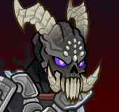
        
        
            Portrait
        
    

# King of Shadows

Once the noble guardian of the ancient elven empire of Illefarn, a cataclysmic event twisted this protector, binding him to the corrupting influence of the Shadow Weave. Now, as the King of Shadows, he commands legions of spectral Shadow Reavers and wields potent shadow magic. Driven by a warped sense of purpose tied to Illefarn's downfall and the dangerous power of the Shadow Weave, he seeks to engulf Neverwinter and beyond in an eternal night. His very being embodies the perversion of ancient power and the terrifying potential of unchecked darkness, making him a uniquely formidable and tragic antagonist.

# Basic Information

King of Shadows will be a new champion in the Liars' Night event on 1 October 2025.

    
        
            **Seat**:
        
        
            9
        
        
            **Stat**
        
        
            **Value**
        
        
            **Day 1 Trials**
        
        
            **Patrons**
        
    
    
        
            **Species**:
        
        
            Human
        
        
            **Strength**:
        
        
            20
        
        
            Yes
        
        
            Mirt
        
    
    
        
            **Class**:
        
        
            Barbarian / Warlock
        
        
            **Dexterity**:
        
        
            26
        
        
            Yes
        
        
            Vajra
        
    
    
        
            **Roles**:
        
        
            Support / Tanking / DPS
        
        
            **Constitution**:
        
        
            18
        
        
            Yes
        
        
            Strahd
        
    
    
        
            **Age**:
        
        
            1750
        
        
            **Intelligence**:
        
        
            14
        
        
            Yes
        
        
            Zariel
        
    
    
        
            **Gender**:
        
        
            Male
        
        
            **Wisdom**:
        
        
            14
        
        
            Yes
        
        
            Elminster
        
    
    
        
            **Alignment**:
        
        
            Lawful Evil
        
        
            **Charisma**:
        
        
            20
        
        
            Yes
        
        
            &nbsp;
        
    
    
        
            **Affiliation**:
        
        
            -
        
        
            **Total**:
        
        
            112
        
        
            Champion ID:
        
        
            168
        
    

# Formation

    <svg xmlns="http://www.w3.org/2000/svg" id="King of Shadows" fill="#aaa" data-formationName="King of Shadows" data-campaignName="Liar's Night" width="411" height="120"><circle cx="175" cy="65" r="15"/><circle cx="135" cy="85" r="15"/><circle cx="95" cy="25" r="15"/><circle cx="95" cy="65" r="15"/><circle cx="95" cy="105" r="15"/><circle cx="55" cy="45" r="15"/><circle cx="55" cy="85" r="15"/><circle cx="15" cy="25" r="15"/><circle cx="15" cy="65" r="15"/><circle cx="15" cy="105" r="15"/><text x="205" y="25" fill="#dcdcdc" font-size="25" font-family="Arial" font-weight="bold">King of Shadows</text><text x="205" y="65" fill="#dcdcdc" font-size="15" font-family="Arial" font-weight="bold">Liar's Night</text></svg>

# Attacks

  **Base Attack: Shadow Strike** (Melee / Magic)
> The King of Shadows slashes the closest enemies, then blasts the enemy with the most health.  
> Cooldown: 5s (Cap 1.25s)

<em>Raw Data</em>

<pre>
{
    "id": 900,
    "name": "Shadow Strike",
    "description": "The King of Shadows slashes the closest enemies, then blasts the enemy with the most health.",
    "long_description": "",
    "graphic_id": 0,
    "target": "front",
    "num_targets": 1,
    "aoe_radius": 0,
    "damage_modifier": 1,
    "cooldown": 5,
    "animations": [
        {
            "type": "melee_attack",
            "special_melee": "king_of_shadows",
            "target_offset": [
                -200,
                0
            ],
            "seq_chargeloop": 1,
            "attack_sounds": {
                "melee": 179,
                "eb": 184
            }
        }
    ],
    "tags": [
        "melee",
        "ranged"
    ],
    "damage_types": [
        "melee",
        "magic"
    ]
}
</pre>

 **Ultimate Attack: Cradle of Rime** (Level: 0)
> The King of Shadows blasts all enemies with cold and necrotic energies, slowing their movement for a short while.  
> Cooldown: 600s (Cap 150s)

<em>Raw Data</em>

<pre>
{
    "id": 902,
    "name": "Cradle of Rime",
    "description": "The King of Shadows blasts all enemies, slowing their movement.",
    "long_description": "The King of Shadows blasts all enemies with cold and necrotic energies, slowing their movement for a short while.",
    "graphic_id": 27513,
    "target": "all",
    "num_targets": 1,
    "aoe_radius": 0,
    "damage_modifier": 0.03,
    "cooldown": 600,
    "animations": [
        {
            "type": "ultimate_attack",
            "ultimate": "king_of_shadows",
            "projectile_data": {
                "type": "ranged_attack",
                "shoot_offset_y": -182,
                "shoot_offset_x": -25,
                "shoot_frame": 29,
                "shoot_sound": 149,
                "hit_sound": 133,
                "projectile_details": {
                    "hash": "king_of_shadows_ult_blast",
                    "projectile_speed": 1500,
                    "projectile_graphic_id": 687,
                    "impact_graphic_id": 19999,
                    "smoke_graphic_id": 446,
                    "explosion_graphic_id": 27562
                }
            },
            "damage_frame": 8,
            "effects_on_monsters": [
                {
                    "effect_string": "monster_speed_reduce,50",
                    "for_time": 30
                }
            ]
        }
    ],
    "tags": [
        "magic",
        "ultimate"
    ],
    "damage_types": [
        "magic"
    ]
}
</pre>

# Abilities

**Corrupted Guardian** (Level: 0)
> The King of Shadows is Undead and counts as 'dead' for the purposes of effects that care about dead Champions, but 'alive' for all other purposes.

<em>Raw Data</em>

<pre>
{
    "id": 17755,
    "hero_id": 168,
    "required_level": 0,
    "required_upgrade_id": 0,
    "upgrade_type": "unlock_ability",
    "effect": "effect_def,2446",
    "static_dps_mult": null,
    "default_enabled": 1,
    "name": "Corrupted Guardian"
}
{
    "id": 2446,
    "flavour_text": "",
    "description": {
        "desc": "The King of Shadows is Undead and counts as 'dead' for the purposes of effects that care about dead Champions, but 'alive' for all other purposes."
    },
    "effect_keys": [
        {
            "effect_string": "appear_dead"
        }
    ],
    "requirements": "",
    "graphic_id": 0,
    "large_graphic_id": 0,
    "properties": {
        "is_formation_ability": true,
        "owner_use_outgoing_description": true,
        "indexed_effect_properties": true,
        "per_effect_index_bonuses": true,
        "default_bonus_index": 0
    }
}
</pre>

**Phase One: The Watcher** (Level: 1)
> When you complete an area with the King of Shadows leading the formation from the front, he updates his current Toughness and Brutality stacks to the completed area number. When the King of Shadows is defeated for the first time, he immediately returns to full health, his Toughness stacks no longer update, and he enters Phase Two. When the King of Shadows is defeated for the second time, he immediately returns to full health, his Brutality stacks no longer update, and he enters Phase Three. His size increases by 25% each time he enters a new phase. Other abilities grant additional buffs upon gaining these new phases.

<em>Raw Data</em>

<pre>
{
    "id": 17756,
    "hero_id": 168,
    "required_level": 1,
    "required_upgrade_id": 0,
    "upgrade_type": "unlock_ability",
    "effect": "effect_def,2447",
    "static_dps_mult": null,
    "default_enabled": 1,
    "name": "Phase One: The Watcher",
    "tip_text": "The King of Shadows goes through three phases, and he enters the next phase when he is defeated for the first and second time. His Tanking and DPS abilities improve the longer you can keep him undefeated!"
}
{
    "id": 2447,
    "flavour_text": "",
    "description": {
        "desc": "When you complete an area with the King of Shadows leading the formation from the front, he updates his current Toughness and Brutality stacks to the completed area number. When the King of Shadows is defeated for the first time, he immediately returns to full health, his Toughness stacks no longer update, and he enters Phase Two. When the King of Shadows is defeated for the second time, he immediately returns to full health, his Brutality stacks no longer update, and he enters Phase Three. His size increases by $amount% each time he enters a new phase. Other abilities grant additional buffs upon gaining these new phases.",
        "post": {
            "conditions": [
                {
                    "condition": "not static_desc",
                    "desc": "^^ Toughness Stacks: $(stat_value kos_toughness_stacks 1 none)^^ Brutality Stacks: $(stat_value kos_brutality_stacks 1 none)"
                }
            ]
        }
    },
    "effect_keys": [
        {
            "effect_string": "king_of_shadows_phases,25",
            "pre_kill_priority": 1080,
            "off_when_benched": true
        }
    ],
    "requirements": "",
    "graphic_id": 0,
    "large_graphic_id": 0,
    "properties": {
        "is_formation_ability": true,
        "owner_use_outgoing_description": true,
        "indexed_effect_properties": true,
        "per_effect_index_bonuses": true,
        "default_bonus_index": 0
    }
}
</pre>

 **Power of the King** (Level: 20)
> The King of Shadows increases the damage of himself and Champions in the two columns behind him by 100%. This is increased by 250% each time the King of Shadows' max health is doubled, stacking multiplicatively.

<em>Upgrade Data</em>

<pre>
Upgrades:
       80: 100%
      140: 100%
      180: 100%
      220: 100%
      290: 100%
      350: 100%
      410: 100%
      460: 100%
      510: 100%
      590: 100%
      670: 100%
      760: 100%
      830: 100%
      920: 100%
      990: 100%
    1,080: 100%
    1,160: 100%
    1,240: 100%
    1,330: 100%
    1,400: 100%

    Total Upgrade Bonus: 1.05e08%
</pre>

<em>Raw Data</em>

<pre>
{
    "id": 17757,
    "hero_id": 168,
    "required_level": 20,
    "required_upgrade_id": 0,
    "upgrade_type": "unlock_ability",
    "effect": "effect_def,2448",
    "static_dps_mult": null,
    "default_enabled": 1,
    "name": "Power of the King",
    "tip_text": "The King of Shadows increases his own damage and the damage of Champions in the two columns behind him."
}
{
    "id": 2448,
    "flavour_text": "",
    "description": {
        "desc": "The King of Shadows increases the damage of himself and Champions in the two columns behind him by $king_of_shadows_power_king%. This is increased by $(amount___3)% each time the King of Shadows' max health is doubled, stacking multiplicatively."
    },
    "effect_keys": [
        {
            "effect_string": "buff_upgrade,100,17757",
            "amount_expr": "upgrade_amount(17757,2)",
            "off_when_benched": true,
            "amount_func": "mult",
            "stack_func": "per_hero_attribute",
            "post_process_expr": "log(GetHeroHP(168)/GetHeroBaseHP(168))/log(2)",
            "amount_updated_listeners": [
                "max_health_changed",
                "feat_changed"
            ],
            "total_title": "Base Buff Bonus",
            "show_bonus": true
        },
        {
            "effect_string": "hero_dps_multiplier_mult,100",
            "off_when_benched": true,
            "targets": [
                "self_and_prev_two_col"
            ],
            "amount_updated_listeners": [
                "slot_changed",
                "feat_changed"
            ],
            "show_bonus": true
        },
        {
            "effect_string": "pre_stack,250"
        }
    ],
    "requirements": "",
    "graphic_id": 27500,
    "large_graphic_id": 27495,
    "properties": {
        "is_formation_ability": true,
        "owner_use_outgoing_description": true,
        "indexed_effect_properties": true,
        "per_effect_index_bonuses": true,
        "default_bonus_index": 1
    }
}
{
    "id": 18163,
    "hero_id": 168,
    "required_level": 670,
    "required_upgrade_id": 0,
    "upgrade_type": "upgrade_ability",
    "effect": "buff_upgrade,100,17757",
    "static_dps_mult": null,
    "default_enabled": 1,
    "name": ""
}
{
    "id": 18161,
    "hero_id": 168,
    "required_level": 590,
    "required_upgrade_id": 0,
    "upgrade_type": "upgrade_ability",
    "effect": "buff_upgrade,100,17757",
    "static_dps_mult": null,
    "default_enabled": 1,
    "name": ""
}
{
    "id": 18159,
    "hero_id": 168,
    "required_level": 510,
    "required_upgrade_id": 0,
    "upgrade_type": "upgrade_ability",
    "effect": "buff_upgrade,100,17757",
    "static_dps_mult": null,
    "default_enabled": 1,
    "name": ""
}
{
    "id": 18157,
    "hero_id": 168,
    "required_level": 460,
    "required_upgrade_id": 0,
    "upgrade_type": "upgrade_ability",
    "effect": "buff_upgrade,100,17757",
    "static_dps_mult": null,
    "default_enabled": 1,
    "name": ""
}
{
    "id": 18156,
    "hero_id": 168,
    "required_level": 410,
    "required_upgrade_id": 0,
    "upgrade_type": "upgrade_ability",
    "effect": "buff_upgrade,100,17757",
    "static_dps_mult": null,
    "default_enabled": 1,
    "name": ""
}
{
    "id": 18153,
    "hero_id": 168,
    "required_level": 350,
    "required_upgrade_id": 0,
    "upgrade_type": "upgrade_ability",
    "effect": "buff_upgrade,100,17757",
    "static_dps_mult": null,
    "default_enabled": 1,
    "name": ""
}
{
    "id": 18152,
    "hero_id": 168,
    "required_level": 290,
    "required_upgrade_id": 0,
    "upgrade_type": "upgrade_ability",
    "effect": "buff_upgrade,100,17757",
    "static_dps_mult": null,
    "default_enabled": 1,
    "name": ""
}
{
    "id": 18149,
    "hero_id": 168,
    "required_level": 220,
    "required_upgrade_id": 0,
    "upgrade_type": "upgrade_ability",
    "effect": "buff_upgrade,100,17757",
    "static_dps_mult": null,
    "default_enabled": 1,
    "name": ""
}
{
    "id": 18148,
    "hero_id": 168,
    "required_level": 180,
    "required_upgrade_id": 0,
    "upgrade_type": "upgrade_ability",
    "effect": "buff_upgrade,100,17757",
    "static_dps_mult": null,
    "default_enabled": 1,
    "name": ""
}
{
    "id": 18146,
    "hero_id": 168,
    "required_level": 140,
    "required_upgrade_id": 0,
    "upgrade_type": "upgrade_ability",
    "effect": "buff_upgrade,100,17757",
    "static_dps_mult": null,
    "default_enabled": 1,
    "name": ""
}
{
    "id": 18047,
    "hero_id": 168,
    "required_level": 80,
    "required_upgrade_id": 0,
    "upgrade_type": "upgrade_ability",
    "effect": "buff_upgrade,100,17757",
    "static_dps_mult": null,
    "default_enabled": 1,
    "name": ""
}
{
    "id": 18061,
    "hero_id": 168,
    "required_level": 760,
    "required_upgrade_id": 0,
    "upgrade_type": "upgrade_ability",
    "effect": "buff_upgrade,100,17757",
    "static_dps_mult": null,
    "default_enabled": 1,
    "name": ""
}
{
    "id": 18063,
    "hero_id": 168,
    "required_level": 830,
    "required_upgrade_id": 0,
    "upgrade_type": "upgrade_ability",
    "effect": "buff_upgrade,100,17757",
    "static_dps_mult": null,
    "default_enabled": 1,
    "name": ""
}
{
    "id": 18066,
    "hero_id": 168,
    "required_level": 920,
    "required_upgrade_id": 0,
    "upgrade_type": "upgrade_ability",
    "effect": "buff_upgrade,100,17757",
    "static_dps_mult": null,
    "default_enabled": 1,
    "name": ""
}
{
    "id": 18067,
    "hero_id": 168,
    "required_level": 990,
    "required_upgrade_id": 0,
    "upgrade_type": "upgrade_ability",
    "effect": "buff_upgrade,100,17757",
    "static_dps_mult": null,
    "default_enabled": 1,
    "name": ""
}
{
    "id": 18069,
    "hero_id": 168,
    "required_level": 1080,
    "required_upgrade_id": 0,
    "upgrade_type": "upgrade_ability",
    "effect": "buff_upgrade,100,17757",
    "static_dps_mult": null,
    "default_enabled": 1,
    "name": ""
}
{
    "id": 18072,
    "hero_id": 168,
    "required_level": 1160,
    "required_upgrade_id": 0,
    "upgrade_type": "upgrade_ability",
    "effect": "buff_upgrade,100,17757",
    "static_dps_mult": null,
    "default_enabled": 1,
    "name": ""
}
{
    "id": 18073,
    "hero_id": 168,
    "required_level": 1240,
    "required_upgrade_id": 0,
    "upgrade_type": "upgrade_ability",
    "effect": "buff_upgrade,100,17757",
    "static_dps_mult": null,
    "default_enabled": 1,
    "name": ""
}
{
    "id": 18076,
    "hero_id": 168,
    "required_level": 1330,
    "required_upgrade_id": 0,
    "upgrade_type": "upgrade_ability",
    "effect": "buff_upgrade,100,17757",
    "static_dps_mult": null,
    "default_enabled": 1,
    "name": ""
}
{
    "id": 18078,
    "hero_id": 168,
    "required_level": 1400,
    "required_upgrade_id": 0,
    "upgrade_type": "upgrade_ability",
    "effect": "buff_upgrade,100,17757",
    "static_dps_mult": null,
    "default_enabled": 1,
    "name": ""
}
</pre>

 **Shadow Plague** (Level: 40)
> The King of Shadows damages all adjacent Champions for 4% of their max health each second, as long as the Champions have at least 20% of their max health remaining. Each time The King of Shadows successfully deals damage in this manner, he gains a Shadow Plague stack. Each Shadow Plague stack increases his own max health by 4%, stacking additively. Stacks cap at 250 and reset when changing areas.

<em>Raw Data</em>

<pre>
{
    "id": 17758,
    "hero_id": 168,
    "required_level": 40,
    "required_upgrade_id": 0,
    "upgrade_type": "unlock_ability",
    "effect": "effect_def,2449",
    "static_dps_mult": null,
    "default_enabled": 1,
    "name": "Shadow Plague"
}
{
    "id": 2449,
    "flavour_text": "",
    "description": {
        "desc": "The King of Shadows damages all adjacent Champions for $damage_percent% of their max health each second, as long as the Champions have at least $health_min_percent% of their max health remaining. Each time The King of Shadows successfully deals damage in this manner, he gains a Shadow Plague stack. Each Shadow Plague stack increases his own max health by $(amount___2)%, stacking additively. Stacks cap at $(max_stacks___2) and reset when changing areas."
    },
    "effect_keys": [
        {
            "effect_string": "king_of_shadows_shadow_plague",
            "off_when_benched": true,
            "targets": [
                "adj"
            ],
            "health_min_percent": 20,
            "damage_percent": 4,
            "health_buff_index": 1,
            "override_key_desc": "$target takes $damage_percent% of their max health each second, as long as $target has at least $health_min_percent% of their max health remaining"
        },
        {
            "effect_string": "health_mult,4",
            "stacks_on_trigger": "will_stack_manually",
            "max_stacks": 250,
            "stacks_multiply": false,
            "show_bonus": true
        }
    ],
    "requirements": "",
    "graphic_id": 27501,
    "large_graphic_id": 27496,
    "properties": {
        "is_formation_ability": true,
        "retain_on_slot_changed": true,
        "is_buff_incoming_formation_abilities_target": false,
        "owner_use_outgoing_description": true,
        "indexed_effect_properties": true,
        "per_effect_index_bonuses": true,
        "default_bonus_index": 0
    }
}
</pre>

 **Phase Two: The Warden** (Level: 100)
> After the King of Shadows enters Phase Two, his health is increased by 1% for each Toughness stack he collected, stacking additively. He also increases the health of all other Champions by 25% of his max health, and healing effects on all Champions are increased by 25%.

<em>Raw Data</em>

<pre>
{
    "id": 17759,
    "hero_id": 168,
    "required_level": 100,
    "required_upgrade_id": 0,
    "upgrade_type": "unlock_ability",
    "effect": "effect_def,2450",
    "static_dps_mult": null,
    "default_enabled": 1,
    "name": "Phase Two: The Warden"
}
{
    "id": 2450,
    "flavour_text": "",
    "description": {
        "desc": "After the King of Shadows enters Phase Two, his health is increased by $(amount___2)% for each Toughness stack he collected, stacking additively. He also increases the health of all other Champions by $(amount___3)% of his max health, and healing effects on all Champions are increased by $(amount___4)%."
    },
    "effect_keys": [
        {
            "effect_string": "apply_effects_at_stacks",
            "off_when_benched": true,
            "show_description": false,
            "apply_effect_stack_amounts": [
                1,
                1,
                1
            ],
            "stacks_on_trigger": "will_stack_manually",
            "stacks_from_amount_func": "get_stat",
            "instance_stat": true,
            "stat": "kos_phase",
            "amount_updated_listeners": [
                "stat_changed,kos_phase",
                "slot_changed"
            ]
        },
        {
            "effect_string": "health_mult,1",
            "stacks_on_trigger": "will_stack_manually",
            "stacks_from_amount_func": "get_stat",
            "instance_stat": true,
            "stat": "kos_toughness_stacks",
            "amount_updated_listeners": [
                "stat_changed,kos_toughness_stacks",
                "slot_changed"
            ],
            "stacks_multiply": false,
            "show_bonus": true,
            "apply_manually": true
        },
        {
            "off_when_benched": true,
            "effect_string": "increase_health_by_source_percent,25",
            "targets": [
                "other"
            ],
            "show_bonus": true,
            "apply_manually": true
        },
        {
            "effect_string": "global_healing_mult,25",
            "show_bonus": true,
            "apply_manually": true
        }
    ],
    "requirements": "",
    "graphic_id": 27503,
    "large_graphic_id": 27498,
    "properties": {
        "is_formation_ability": true,
        "owner_use_outgoing_description": true,
        "indexed_effect_properties": true,
        "per_effect_index_bonuses": true,
        "default_bonus_index": 1
    }
}
</pre>

 **Cradle of Rime** (Level: 110)
> The King of Shadows attacks all enemies with an explosion of magical cold and necrotic energies, dealing ultimate damage and slowing their movement by 50% for 30 seconds.

<em>Raw Data</em>

<pre>
{
    "id": 17767,
    "hero_id": 168,
    "required_level": 110,
    "required_upgrade_id": 0,
    "upgrade_type": "unlock_ultimate",
    "effect": "effect_def,2459",
    "static_dps_mult": null,
    "default_enabled": 1,
    "name": "Cradle of Rime"
}
{
    "id": 2459,
    "flavour_text": "",
    "description": {
        "desc": "The King of Shadows attacks all enemies with an explosion of magical cold and necrotic energies, dealing ultimate damage and slowing their movement by 50% for 30 seconds."
    },
    "effect_keys": [
        {
            "effect_string": "set_ultimate_attack,902"
        }
    ],
    "requirements": "",
    "graphic_id": 0,
    "large_graphic_id": 0,
    "properties": {
        "is_formation_ability": false,
        "formation_circle_icon": false,
        "show_outgoing_desc_when_benched": false,
        "owner_use_outgoing_description": true,
        "indexed_effect_properties": true,
        "per_effect_index_bonuses": true,
        "default_bonus_index": 0
    }
}
</pre>

 **Shadow Reavers** (Level: 130)
> After the King of Shadows enters Phase Two, he summons a Shadow Reaver each time he uses his ultimate. An additional Shadow Reaver is summoned for every 500 Toughness stacks he has. Each Shadow Reaver attacks a random enemy once every 5 seconds dealing 5 seconds of BUD-based damage. The Shadow Reavers last for 1 second plus 0.1 seconds for each Toughness stack he has. Using his ultimate again before the Shadow Reavers expire causes their duration to be refreshed to max.

<em>Raw Data</em>

<pre>
{
    "id": 17761,
    "hero_id": 168,
    "required_level": 130,
    "required_upgrade_id": 0,
    "upgrade_type": "unlock_ability",
    "effect": "effect_def,2452",
    "static_dps_mult": null,
    "default_enabled": 1,
    "name": "Shadow Reavers"
}
{
    "id": 2452,
    "flavour_text": "",
    "description": {
        "desc": "After the King of Shadows enters Phase Two, he summons a Shadow Reaver each time he uses his ultimate. An additional Shadow Reaver is summoned for every $reaver_per_toughness Toughness stacks he has. Each Shadow Reaver attacks a random enemy once every $attack_cooldown seconds dealing $seconds_of_bud seconds of BUD-based damage. The Shadow Reavers last for $base_duration second plus $duration_per_toughness seconds for each Toughness stack he has. Using his ultimate again before the Shadow Reavers expire causes their duration to be refreshed to max."
    },
    "effect_keys": [
        {
            "effect_string": "king_of_shadows_shadow_reavers",
            "off_when_benched": true,
            "reaver_per_toughness": 500,
            "duration_per_toughness": 0.1,
            "attack_cooldown": 5,
            "seconds_of_bud": 5,
            "base_duration": 1,
            "shadow_reaver_sequences": {
                "idle": 1,
                "walk": 1,
                "shoot": 2,
                "gethit": 3
            }
        }
    ],
    "requirements": "",
    "graphic_id": 27502,
    "large_graphic_id": 27497,
    "properties": {
        "is_formation_ability": true,
        "owner_use_outgoing_description": true,
        "retain_on_slot_changed": true,
        "indexed_effect_properties": true,
        "per_effect_index_bonuses": true,
        "default_bonus_index": 0
    }
}
</pre>

 **Phase Three: The Warrior** (Level: 200)
> After the King of Shadows enters Phase Three, his damage is increased by 5% for each Brutality stack, stacking multiplicatively.

<em>Raw Data</em>

<pre>
{
    "id": 17760,
    "hero_id": 168,
    "required_level": 200,
    "required_upgrade_id": 0,
    "upgrade_type": "unlock_ability",
    "effect": "effect_def,2451",
    "static_dps_mult": null,
    "default_enabled": 1,
    "name": "Phase Three: The Warrior"
}
{
    "id": 2451,
    "flavour_text": "",
    "description": {
        "desc": "After the King of Shadows enters Phase Three, his damage is increased by $(not_buffed amount___2)% for each Brutality stack, stacking multiplicatively."
    },
    "effect_keys": [
        {
            "effect_string": "apply_effects_at_stacks",
            "off_when_benched": true,
            "show_description": false,
            "apply_effect_stack_amounts": [
                2
            ],
            "stacks_on_trigger": "will_stack_manually",
            "stacks_from_amount_func": "get_stat",
            "instance_stat": true,
            "stat": "kos_phase",
            "amount_updated_listeners": [
                "stat_changed,kos_phase",
                "slot_changed"
            ]
        },
        {
            "effect_string": "hero_dps_multiplier_mult,5",
            "stacks_on_trigger": "will_stack_manually",
            "stacks_from_amount_func": "get_stat",
            "instance_stat": true,
            "stat": "kos_brutality_stacks",
            "amount_updated_listeners": [
                "stat_changed,kos_brutality_stacks",
                "slot_changed"
            ],
            "apply_manually": true,
            "stacks_multiply": true,
            "show_bonus": true
        }
    ],
    "requirements": "",
    "graphic_id": 27504,
    "large_graphic_id": 27499,
    "properties": {
        "is_formation_ability": true,
        "owner_use_outgoing_description": true,
        "indexed_effect_properties": true,
        "per_effect_index_bonuses": true,
        "default_bonus_index": 1
    }
}
</pre>

# Specialisations

 **Master of Pawns** (Level: 210)
> Increases the effect of Power of the King by 400%.

<em>Raw Data</em>

<pre>
{
    "id": 17762,
    "hero_id": 168,
    "required_level": 210,
    "required_upgrade_id": 0,
    "upgrade_type": "unlock_ability",
    "effect": "effect_def,2453",
    "static_dps_mult": null,
    "default_enabled": 1,
    "name": "Master of Pawns",
    "specialization_name": "Master of Pawns",
    "specialization_description": "The King of Shadows focuses on supporting his underlings in the formation.",
    "specialization_graphic_id": 27510
}
{
    "id": 2453,
    "flavour_text": "",
    "description": {
        "desc": "Increases the effect of Power of the King by $amount%."
    },
    "effect_keys": [
        {
            "effect_string": "buff_upgrade,400,17757",
            "off_when_benched": true
        }
    ],
    "requirements": "",
    "graphic_id": 27510,
    "large_graphic_id": 27510,
    "properties": {
        "is_formation_ability": true,
        "owner_use_outgoing_description": true,
        "indexed_effect_properties": true,
        "per_effect_index_bonuses": true,
        "default_bonus_index": 0
    }
}
</pre>

 **Shadow Unleashed** (Level: 210)
> Increases the effect of Phase Three: The Warrior by 1000%.

<em>Raw Data</em>

<pre>
{
    "id": 17763,
    "hero_id": 168,
    "required_level": 210,
    "required_upgrade_id": 0,
    "upgrade_type": "unlock_ability",
    "effect": "effect_def,2454",
    "static_dps_mult": null,
    "default_enabled": 1,
    "name": "Shadow Unleashed",
    "specialization_name": "Shadow Unleashed",
    "specialization_description": "The King of Shadows prioritizes his own abilities to deal massive amounts of damage to his enemies.",
    "specialization_graphic_id": 27512
}
{
    "id": 2454,
    "flavour_text": "",
    "description": {
        "desc": "Increases the effect of Phase Three: The Warrior by $amount%."
    },
    "effect_keys": [
        {
            "effect_string": "buff_upgrade,1000,17760",
            "off_when_benched": true
        }
    ],
    "requirements": "",
    "graphic_id": 27512,
    "large_graphic_id": 27512,
    "properties": {
        "is_formation_ability": true,
        "owner_use_outgoing_description": true,
        "indexed_effect_properties": true,
        "per_effect_index_bonuses": true,
        "default_bonus_index": 0
    }
}
</pre>

 **Legacy of Illefarn** (Level: 280)
> Increases the effect of Power of the King by 100% for each Elf, Dwarf, Half-Elf, and/or Human Champion in the formation, stacking multiplicatively.

ⓘ *Note: This ability is prestack.*

<em>Raw Data</em>

<pre>
{
    "id": 17764,
    "hero_id": 168,
    "required_level": 280,
    "required_upgrade_id": 0,
    "upgrade_type": "unlock_ability",
    "effect": "effect_def,2455",
    "static_dps_mult": null,
    "default_enabled": 1,
    "name": "Legacy of Illefarn",
    "specialization_name": "Legacy of Illefarn",
    "specialization_description": "The Guardian was created to defend Illefarn, an ancient elven kingdom that welcomed Dwarves and Humans into its domain. That directive still lingers, though the Guardian has long since been corrupted into the King of Shadows.",
    "specialization_graphic_id": 27509
}
{
    "id": 2455,
    "flavour_text": "",
    "description": {
        "desc": "Increases the effect of Power of the King by $amount% for each Elf, Dwarf, Half-Elf, and/or Human Champion in the formation, stacking multiplicatively."
    },
    "effect_keys": [
        {
            "effect_string": "pre_stack,100",
            "skip_effect_key_desc": true
        },
        {
            "effect_string": "buff_upgrade,0,17757",
            "off_when_benched": true,
            "amount_expr": "upgrade_amount(17764,0)",
            "amount_func": "mult",
            "stack_func": "per_hero_attribute",
            "per_hero_expr": "HasTag(`elf`) || HasTag(`half-elf`) || HasTag(`dwarf`) || HasTag(`human`)",
            "amount_updated_listeners": [
                "slot_changed",
                "hero_tags_changed"
            ],
            "show_bonus": true
        }
    ],
    "requirements": "",
    "graphic_id": 27509,
    "large_graphic_id": 27509,
    "properties": {
        "is_formation_ability": true,
        "owner_use_outgoing_description": true,
        "indexed_effect_properties": true,
        "per_effect_index_bonuses": true,
        "default_bonus_index": 0,
        "spec_option_post_apply_info": "Qualified Champions: $num_stacks___2"
    }
}
</pre>

 **Embrace the Shadow Weave** (Level: 280)
> Increases the effect of Power of the King by 200% for each Evil Champion in the formation, stacking multiplicatively.

ⓘ *Note: This ability is prestack.*

<em>Raw Data</em>

<pre>
{
    "id": 17765,
    "hero_id": 168,
    "required_level": 280,
    "required_upgrade_id": 0,
    "upgrade_type": "unlock_ability",
    "effect": "effect_def,2456",
    "static_dps_mult": null,
    "default_enabled": 1,
    "name": "Embrace the Shadow Weave",
    "specialization_name": "Embrace the Shadow Weave",
    "specialization_description": "The fall of Mystryl shattered the weave, forcing the Guardian of Illefarn to bind himself to the Shadow Weave to survive. In doing so, he became the King of Shadows.",
    "specialization_graphic_id": 27508
}
{
    "id": 2456,
    "flavour_text": "",
    "description": {
        "desc": "Increases the effect of Power of the King by $amount% for each Evil Champion in the formation, stacking multiplicatively."
    },
    "effect_keys": [
        {
            "effect_string": "pre_stack,200",
            "skip_effect_key_desc": true
        },
        {
            "effect_string": "buff_upgrade,0,17757",
            "off_when_benched": true,
            "amount_expr": "upgrade_amount(17765,0)",
            "amount_func": "mult",
            "stack_func": "per_hero_attribute",
            "per_hero_expr": "HasTag(`evil`)",
            "amount_updated_listeners": [
                "slot_changed",
                "hero_tags_changed"
            ],
            "show_bonus": true
        }
    ],
    "requirements": "",
    "graphic_id": 27508,
    "large_graphic_id": 27508,
    "properties": {
        "is_formation_ability": true,
        "owner_use_outgoing_description": true,
        "indexed_effect_properties": true,
        "per_effect_index_bonuses": true,
        "default_bonus_index": 0,
        "spec_option_post_apply_info": "Evil Champions: $num_stacks___2"
    }
}
</pre>

 **Rites of Survival** (Level: 280)
> Increases the effect of Power of the King by 300% for each Champion with the Healing role, stacking multiplicatively. Additionally, Shadow Plague no longer has a minimum health at which Champions will not be damaged, and the Shadow Plague stack cap is doubled.

ⓘ *Note: This ability is prestack.*

<em>Raw Data</em>

<pre>
{
    "id": 17766,
    "hero_id": 168,
    "required_level": 280,
    "required_upgrade_id": 0,
    "upgrade_type": "unlock_ability",
    "effect": "effect_def,2457",
    "static_dps_mult": null,
    "default_enabled": 1,
    "name": "Rites of Survival",
    "specialization_name": "Rites of Survival",
    "specialization_description": "The King of Shadows will survive by any means necessary, even if it means sacrificing those who stand beside him.",
    "specialization_graphic_id": 27511
}
{
    "id": 2457,
    "flavour_text": "",
    "description": {
        "desc": "Increases the effect of Power of the King by $amount% for each Champion with the Healing role, stacking multiplicatively. Additionally, Shadow Plague no longer has a minimum health at which Champions will not be damaged, and the Shadow Plague stack cap is doubled."
    },
    "effect_keys": [
        {
            "effect_string": "pre_stack,300",
            "skip_effect_key_desc": true
        },
        {
            "effect_string": "buff_upgrade,0,17757",
            "off_when_benched": true,
            "amount_expr": "upgrade_amount(17766,0)",
            "amount_func": "mult",
            "stack_func": "per_hero_attribute",
            "per_hero_expr": "HasTag(`healing`)",
            "amount_updated_listeners": [
                "slot_changed",
                "hero_tags_changed"
            ],
            "show_bonus": true
        },
        {
            "effect_string": "change_upgrade_data,17758",
            "data": {
                "health_min_percent": 0
            }
        },
        {
            "effect_string": "change_upgrade_data,17758,1",
            "data": {
                "max_stacks": 500
            }
        }
    ],
    "requirements": "",
    "graphic_id": 27511,
    "large_graphic_id": 27511,
    "properties": {
        "is_formation_ability": true,
        "owner_use_outgoing_description": true,
        "indexed_effect_properties": true,
        "per_effect_index_bonuses": true,
        "default_bonus_index": 0,
        "spec_option_post_apply_info": "Healing Champions: $num_stacks___2"
    }
}
</pre>

# Items

    
        
            **Icons**
        
        
            **Slot**
        
        
            **Epic Name**
        
        
            **Effect**
        
    
    
        
            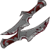ID: 3986**Ancient Daggers**It is you...  Increases the effect of Shadows's Power of the King ability by 25%.<code>buff_upgrade,25,17757 allow_ge:false</code>ID: 3987**Honed Blades**I know why you have come...  Increases the effect of Shadows's Power of the King ability by 87.5%.<code>buff_upgrade,87.5,17757 allow_ge:false</code>ID: 3988**Cruel Cleaver**If you believe Illefarn lost...  Increases the effect of Shadows's Power of the King ability by 150%.<code>buff_upgrade,150,17757 allow_ge:false</code>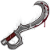ID: 3989**Lifesbane Khopesh**You must be cleansed with the rest.  Increases the effect of Shadows's Power of the King ability by 275%.<code>buff_upgrade,275,17757 allow_ge:false</code>&nbsp;
        
        
            1
        
        
            Lifesbane Khopesh
        
        
            Increases the effect of Shadows's Power of the King ability by 275%.
        
    
    
        
            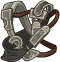ID: 3990**Brittle Harness**It began with a sacrifice...  Increases the effect of Shadows's Phase Two: The Warden ability by 25%.<code>buff_upgrade,25,17759 allow_ge:false</code>ID: 3991**Imperial Harness**They made me to be a perfect weapon...  Increases the effect of Shadows's Phase Two: The Warden ability by 87.5%.<code>buff_upgrade,87.5,17759 allow_ge:false</code>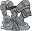ID: 3992**Corrupted Harness**The enemies of Illefarn must be destroyed...  Increases the effect of Shadows's Phase Two: The Warden ability by 150%.<code>buff_upgrade,150,17759 allow_ge:false</code>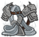ID: 3993**Accursed Harness**I will protect their legacy at all costs.  Increases the effect of Shadows's Phase Two: The Warden ability by 275%.<code>buff_upgrade,275,17759 allow_ge:false</code>&nbsp;
        
        
            2
        
        
            Accursed Harness
        
        
            Increases the effect of Shadows's Phase Two: The Warden ability by 275%.
        
    
    
        
            ID: 3994**Haunting Visage**I see in you a blind devotion...  Increases the effect of Shadows's Phase Three: The Warrior ability by 25%.<code>buff_upgrade,25,17760 allow_ge:false</code>ID: 3995**Mask of the Guardian**I was created to be the guardian of an empire...  Increases the effect of Shadows's Phase Three: The Warrior ability by 87.5%.<code>buff_upgrade,87.5,17760 allow_ge:false</code>ID: 3996**Face of Terror**I do what I must to protect and preserve it...  Increases the effect of Shadows's Phase Three: The Warrior ability by 150%.<code>buff_upgrade,150,17760 allow_ge:false</code>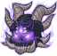ID: 3997**Aspect of the Demon King**Would you deprive this land of its Guardian?  Increases the effect of Shadows's Phase Three: The Warrior ability by 275%.<code>buff_upgrade,275,17760 allow_ge:false</code>&nbsp;
        
        
            3
        
        
            Aspect of the Demon King
        
        
            Increases the effect of Shadows's Phase Three: The Warrior ability by 275%.
        
    
    
        
            ID: 3998**Tattered Remnant**Mortals fear many things...  Increases the effect of King of Shadows first set of Specializations by 25%.<code>buff_upgrades,25,17762,17763 allow_ge:false</code>ID: 3999**Guardian's Garb**They charged me to protect them...  Increases the effect of King of Shadows first set of Specializations by 87.5%.<code>buff_upgrades,87.5,17762,17763 allow_ge:false</code>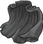ID: 4000**Dark Mantle**I removed all threats...  Increases the effect of King of Shadows first set of Specializations by 150%.<code>buff_upgrades,150,17762,17763 allow_ge:false</code>ID: 4001**Ashen Veil of Kings**Now they fear me.  Increases the effect of King of Shadows first set of Specializations by 275%.<code>buff_upgrades,275,17762,17763 allow_ge:false</code>&nbsp;
        
        
            4
        
        
            Ashen Veil of Kings
        
        
            Increases the effect of King of Shadows first set of Specializations by 275%.
        
    
    
        
            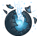ID: 4002**Unidentified Map**So much lost...  Increases the effect of King of Shadows second set of Specializations by 10%. (Prestack)<code>buff_upgrades,10,17764,17765,17766 allow_ge:false</code>ID: 4003**Map of Illefarn**So much to restore...  Increases the effect of King of Shadows second set of Specializations by 30%. (Prestack)<code>buff_upgrades,30,17764,17765,17766 allow_ge:false</code>ID: 4004**Shattered Orb**When Mystryl fell, my power waned...  Increases the effect of King of Shadows second set of Specializations by 50%. (Prestack)<code>buff_upgrades,50,17764,17765,17766 allow_ge:false</code>ID: 4005**Orb of True Night**The Shadow Weave sustains me now.  Increases the effect of King of Shadows second set of Specializations by 100%. (Prestack)<code>buff_upgrades,100,17764,17765,17766 allow_ge:false</code>&nbsp;
        
        
            5
        
        
            Orb of True Night
        
        
            Increases the effect of King of Shadows second set of Specializations by 100%. (Prestack)
        
    
    
        
            ID: 4006**Old Poem**Now but a shadow of its former glory...  Reduces the cooldown on Shadows's Ultimate Attack by 15 seconds.<code>reduce_ultimate_cooldown,15 allow_ge:false</code>ID: 4007**Tome of Iltkazar**We will yet have our day.  Reduces the cooldown on Shadows's Ultimate Attack by 30 seconds.<code>reduce_ultimate_cooldown,30 allow_ge:false</code>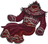ID: 4008**Reaver's Robe**They are called to serve, and serve they shall...  Reduces the cooldown on Shadows's Ultimate Attack by 60 seconds.<code>reduce_ultimate_cooldown,60 allow_ge:false</code>ID: 4009**Shadow Staff**Until this land is cleansed of all who would defile it.  Reduces the cooldown on Shadows's Ultimate Attack by 150 seconds.<code>reduce_ultimate_cooldown,150 allow_ge:false</code>&nbsp;
        
        
            6
        
        
            Shadow Staff
        
        
            Reduces the cooldown on Shadows's Ultimate Attack by 150 seconds. Cap: 501 dull / 251 shiny / 126 golden.
        
    

<em>Item Names and Descriptions</em>

<pre>
Slot 1:
         Ancient Daggers: It is you...
            Honed Blades: I know why you have come...
           Cruel Cleaver: If you believe Illefarn lost...
       Lifesbane Khopesh: You must be cleansed with the rest.

Slot 2:
         Brittle Harness: It began with a sacrifice...
        Imperial Harness: They made me to be a perfect weapon...
       Corrupted Harness: The enemies of Illefarn must be destroyed...
        Accursed Harness: I will protect their legacy at all costs.

Slot 3:
         Haunting Visage: I see in you a blind devotion...
    Mask of the Guardian: I was created to be the guardian of an empire...
          Face of Terror: I do what I must to protect and preserve it...
Aspect of the Demon King: Would you deprive this land of its Guardian?

Slot 4:
        Tattered Remnant: Mortals fear many things...
         Guardian's Garb: They charged me to protect them...
             Dark Mantle: I removed all threats...
     Ashen Veil of Kings: Now they fear me.

Slot 5:
        Unidentified Map: So much lost...
         Map of Illefarn: So much to restore...
           Shattered Orb: When Mystryl fell, my power waned...
       Orb of True Night: The Shadow Weave sustains me now.

Slot 6:
                Old Poem: Now but a shadow of its former glory...
        Tome of Iltkazar: We will yet have our day.
           Reaver's Robe: They are called to serve, and serve they shall...
            Shadow Staff: Until this land is cleansed of all who would defile it.
</pre>

 

# Feats

This list will only show feats that are going to be available on the release of this champion. The separate [Feats](feats.md) page may show others that could be available later if they exist.

    
        
            **Feat**
        
        
            **Effect**
        
        
            **Source**
        
    
    
        
            ID: 2307**Tavern Brawler (KoS)**You are already defeated...<code>hero_dps_multiplier_mult,30</code>Tavern Brawler
        
        
            Increases the damage of Shadows by 30%.
        
        
            Free
        
    
    
        
            ID: 2308**Grappler (KoS)**Only the weak require servants...<code>hero_dps_multiplier_mult,60</code>Grappler
        
        
            Increases the damage of Shadows by 60%.
        
        
            Gold Chest
        
    
    
        
            ID: 2309**Selflessness (KoS)**Sever your ties and protect something greater than yourself...<code>global_dps_multiplier_mult,10</code>Selflessness
        
        
            All Champions damage +10%.
        
        
            Free
        
    
    
        
            ID: 2310**Inspiring Leader (KoS)**Frightened mortals clamor for one to lead them, to protect them...<code>global_dps_multiplier_mult,25</code>Inspiring Leader
        
        
            All Champions damage +25%.
        
        
            Gold Chest
        
    
    
        
            ID: 2311**Tough (KoS)**You cannot stop me...<code>health_mult,15</code>Tough
        
        
            Increases the health of Shadows by 15%.
        
        
            Free
        
    
    
        
            ID: 2312**Resilient (KoS)**None shall stand against us...<code>health_mult,30</code>Resilient
        
        
            Increases the health of Shadows by 30%.
        
        
            12,500 Gems
        
    
    
        
            ID: 2313**Defensive Duelist (KoS)**Such denouncements are a threat...<code>overwhelm_start_increase,5</code>Defensive Duelist
        
        
            Shadows takes 5 more Enemies attacking to get overwhelmed.
        
        
            Free
        
    
    
        
            ID: 2314**Calm Under Pressure (KoS)**So be it...<code>overwhelm_start_increase,10</code>Calm Under Pressure
        
        
            Shadows takes 10 more Enemies attacking to get overwhelmed.
        
        
            Gold Chest
        
    
    
        
            ID: 2315**Noble Vision (KoS)**I see into your mortal heart, and all that guides your actions...<code>buff_upgrade,20,17757</code>Noble Vision
        
        
            Increases the effect of King of Shadows' Power of the King ability by 20%.
        
        
            Free
        
    
    
        
            ID: 2316**Corrupt Cause (KoS)**Ambition and evil brought you here...<code>buff_upgrade,40,17757</code>Corrupt Cause
        
        
            Increases the effect of King of Shadows' Power of the King ability by 40%.
        
        
            12,500 Gems
        
    
    
        
            ID: 2317**Tragic Devotion (KoS)**You need not die... You need not be cleansed...<code>buff_upgrade,10,17757,2</code>Tragic Devotion
        
        
            Increases the effect of King of Shadows' Power of the King ability whenever his max health is doubled by 10% (pre-stack). (Prestack)
        
        
            3,830 Platinum 50,000 Gems
        
    
    
        
            ID: 2318**Dark Savior (KoS)**They believe they can be saved... That they should be saved...<code>buff_upgrade,40,17759</code>Dark Savior
        
        
            Increases the effect of King of Shadows' Phase Two: The Warden ability by 40%.
        
        
            Gold Chest
        
    
    
        
            ID: 2319**Dark Avenger (KoS)**I will eliminate all who stand before me...<code>buff_upgrade,40,17760</code>Dark Avenger
        
        
            Increases the effect of King of Shadows' Phase Three: The Warrior ability by 40%.
        
        
            12,500 Gems
        
    
    
        
            ID: 2320**Demon King (KoS)**Let us continue with the cleansing...<code>buff_upgrades,40,17762,17763</code>Demon King
        
        
            Increases the effect of King of Shadows' first set of Specializations by 40%.
        
        
            Gold Chest
        
    
    
        
            ID: 2321**Royal Retinue (KoS)**Do not mourn... In death, all shall serve Illefarn and protect it...<code>buff_upgrades,40,17764,17765,17766</code>Royal Retinue
        
        
            Increases the effect of King of Shadows' second set of Specializations by 40%. (Prestack)
        
        
            12,500 Gems
        
    
    
        
            ID: 2322**Taunt (KoS)**Neverwinter shall fall before the moon waxes...<code>global_dps_multiplier_mult,100 taunt,50</code>Taunt
        
        
            King of Shadows' attacks have a 100% chance to taunt enemies.
        
        
            Event Bonus
        
    

# Legendaries

* Increases the damage of all Champions by 100%.
* Increases the damage of all Male Champions by 125%.
* Increases the damage of all Human Champions by 150%.
* Increases the damage of all Champions with a STR score of 15 or higher by 200%.
* Increases the damage of all Champions by 40% for each Champion with a DEX score of 15 or higher in the formation.
* Increases the damage of all Champions by 40% for each Champion in the formation with a EVIL alignment.

<em>DPS Applicable</em>

<pre>
     Arkhan: 5 / 6
    Artemis: 5 / 6
    Asharra: 3 / 6
      Azaka: 5 / 6
     Binwin: 5 / 6
Black Viper: 4 / 6
      Bobby: 6 / 6
 Catti-brie: 5 / 6
     Cazrin: 4 / 6
     D'hani: 3 / 6
  Dark Urge: 4 / 6
     Delina: 3 / 6
    Dhadius: 5 / 6
    Farideh: 3 / 6
        Fen: 3 / 6
      Grimm: 6 / 6
     Gromma: 3 / 6
       Ishi: 3 / 6
    Jamilah: 5 / 6
   Jarlaxle: 4 / 6
        Jim: 5 / 6
    Karlach: 4 / 6
        Kas: 6 / 6
       Kent: 4 / 6
      Krond: 5 / 6
       Krux: 5 / 6
    Lae'zel: 4 / 6
     Lucius: 4 / 6
      Minsc: 6 / 6
      NERDS: 3 / 6
     Nahara: 3 / 6
      Nixie: 3 / 6
     Orisha: 3 / 6
   Prudence: 3 / 6
      Rosie: 3 / 6
    Shadows: 6 / 6
      Strix: 3 / 6
    Torogar: 5 / 6
     Warden: 3 / 6
    Warduke: 6 / 6
   Windfall: 3 / 6
       Wren: 3 / 6
     Yorven: 5 / 6
      Zorbu: 4 / 6
</pre>

<em>Non-DPS Applicable</em>

<pre>
          Aeon: 3 / 6
       Alyndra: 3 / 6
       Antrius: 5 / 6
      Astarion: 4 / 6
         Avren: 4 / 6
          BBEG: 4 / 6
       Baeloth: 4 / 6
       Baldric: 4 / 6
      Barrowin: 4 / 6
        Beadle: 4 / 6
       Blooshi: 3 / 6
          Brig: 5 / 6
          Briv: 5 / 6
       Bruenor: 5 / 6
      Calliope: 3 / 6
       Celeste: 4 / 6
     Certainty: 3 / 6
       Corazón: 5 / 6
        Deekin: 4 / 6
       Desmond: 6 / 6
           Dob: 4 / 6
        Donaar: 5 / 6
    Dragonbait: 5 / 6
Dungeon Master: 6 / 6
      Dynaheir: 4 / 6
        Egbert: 5 / 6
      Ellywick: 3 / 6
          Eric: 5 / 6
       Evandra: 4 / 6
        Evelyn: 5 / 6
     Ezmerelda: 4 / 6
        Freely: 4 / 6
          Gale: 5 / 6
       Gazrick: 4 / 6
        Halsin: 5 / 6
          Hank: 5 / 6
       Havilar: 4 / 6
      Hew Maan: 5 / 6
         Hitch: 5 / 6
         Imoen: 4 / 6
      Jang Sao: 3 / 6
      K'thriss: 4 / 6
         Kalix: 4 / 6
         Korth: 4 / 6
         Krull: 5 / 6
        Krydle: 4 / 6
         Mehen: 5 / 6
          Melf: 5 / 6
      Merilwen: 3 / 6
      Minthara: 4 / 6
         Miria: 3 / 6
        Nayeli: 5 / 6
         Nerys: 5 / 6
          Nova: 3 / 6
         Nrakk: 4 / 6
          Omin: 5 / 6
        Orkira: 3 / 6
       Paultin: 5 / 6
      Penelope: 3 / 6
        Presto: 5 / 6
         Pwent: 5 / 6
        Qillek: 4 / 6
     Ravengard: 6 / 6
         Regis: 4 / 6
          Reya: 5 / 6
          Rust: 4 / 6
        Selise: 5 / 6
        Sentry: 4 / 6
     Sgt. Knox: 6 / 6
   Shadowheart: 3 / 6
       Shandie: 3 / 6
        Sheila: 4 / 6
      Sisaspia: 3 / 6
        Solaak: 4 / 6
         Spurt: 4 / 6
         Stoki: 3 / 6
   Strongheart: 6 / 6
         Talin: 4 / 6
       Tatyana: 4 / 6
          Tess: 3 / 6
      Thellora: 4 / 6
        Turiel: 4 / 6
         Tyril: 5 / 6
       Ulkoria: 3 / 6
       Umberto: 6 / 6
     Valentine: 3 / 6
            Vi: 3 / 6
       Viconia: 3 / 6
      Vin Ursa: 3 / 6
        Virgil: 4 / 6
       Vlahnya: 3 / 6
      Vlithryn: 3 / 6
      Voronika: 3 / 6
        Walnut: 3 / 6
        Widdle: 4 / 6
       Wulfgar: 6 / 6
          Wyll: 5 / 6
        Xander: 5 / 6
      Xerophon: 3 / 6
</pre>

 

# Adventures and Variants

**Unlock Adventure: The Trickster's Delight (King of Shadows)** (Complete Area 50)
> Chase down a masked man who has performed a daring heist.

 **Variant 1: There's a New Boss in Town** (Complete Area 75)
> The King of Shadows starts in the formation. He can't be moved or removed.  
> Only the King of Shadows and Champions in the two columns behind him can deal damage.  
> All boss enemies deal 100% additional damage.  
> A Mad Wizard has a 50% chance to spawn in the second wave of each non-boss area. No other enemies can be damaged while the Mad Wizard is alive.  
> Getting to Know The King of Shadows: The King of Shadows main support ability increases his damage and the damage of Champions in the two columns behind him.

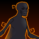 **Variant 2: Shadows of the Past** (Complete Area 125)
> The King of Shadows starts in the formation. He can't be moved or removed.  
> Two Shadow escorts join the formation.   
> Healing effects on Champions adjacent to one or more Shadows are reduced by 50%.   
> Getting to Know The King of Shadows: The King of Shadows gains Tanking and DPS abilities that get stronger the longer it takes for him to be defeated. Use healers and tanking Champions with Taunt to have him last longer!

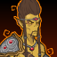 **Variant 3: A Path Through the Astral Plane** (Complete Area 175)
> The King of Shadows starts in the formation. He can't be moved or removed.  
> You may only use Elf, Dwarf, Half-Elf, Human, Evil, and/or Healing Champions.  
> 1-2 Githyanki Warriors spawn with each wave. They deal 500% additional damage to the King of Shadows due to their silver swords, and they don't drop gold nor count towards quest progress.  
> Getting to Know The King of Shadows: The King of Shadows' second specialization choice determines which Champions he synergizes with best. Which set will you choose?

# Other Champion Images

    
        
            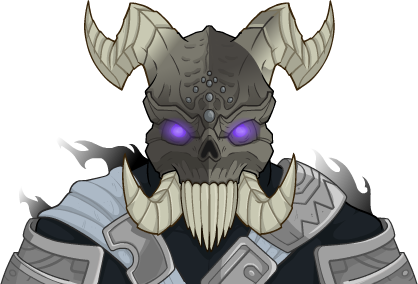Console Portrait
        
    
    
        
            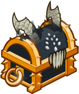Gold Chest Icon
        
        
            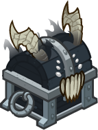Silver Chest Icon
        
    

[Back to Top](#top)

*Last Modified: {{ site.time }}*