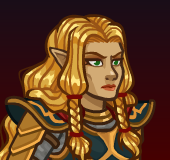
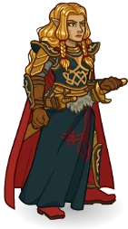
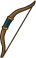
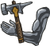
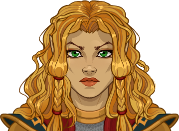
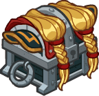

[Back to Main](index.md)

    
        
            
        
        
            Portrait
        
    
    
        
            
        
        
            Base Model
        
    
    
        
            
        
        
            Quallathon Model
        
    

# Lauralanthalasa Kanan

Lauralanthalasa Kanan was a pampered princess of the Qualinesti elves. Then the flames of evil dragons threatened her people and Laurana joined with other heroes to fight the Dragon Queen. In time, she became known as the Golden General: a renowned fighter, dragon rider, and brilliant battlefield commander. Now a living symbol of hope, Laurana fights to save her people and the world.

# Basic Information

Lauralanthalasa Kanan will be a new champion in the The Great Modron March event on 6 May 2026.

    
        
            **Seat**:
        
        
            7
        
        
            **Stat**
        
        
            **Value**
        
        
            **Day 1 Trials**
        
        
            **Patrons**
        
    
    
        
            **Species**:
        
        
            Elf (Qualinesti)
        
        
            **Strength**:
        
        
            13
        
        
            Yes
        
        
            Mirt
        
    
    
        
            **Class**:
        
        
            Fighter
        
        
            **Dexterity**:
        
        
            17
        
        
            Yes
        
        
            Vajra
        
    
    
        
            **Roles**:
        
        
            Support / Tanking
        
        
            **Constitution**:
        
        
            14
        
        
            Yes
        
        
            Strahd
        
    
    
        
            **Age**:
        
        
            80
        
        
            **Intelligence**:
        
        
            15
        
        
            Yes
        
        
            Zariel
        
    
    
        
            **Gender**:
        
        
            Female
        
        
            **Wisdom**:
        
        
            12
        
        
            Yes
        
        
            Elminster
        
    
    
        
            **Alignment**:
        
        
            Neutral Good
        
        
            **Charisma**:
        
        
            16
        
        
            Yes
        
        
            &nbsp;
        
    
    
        
            **Affiliation**:
        
        
            Heroes of the Lance
        
        
            **Total**:
        
        
            87
        
        
            Champion ID:
        
        
            175
        
    

# Formation

    <svg xmlns="http://www.w3.org/2000/svg" id="Laurana" fill="#aaa" data-formationName="Laurana" data-campaignName="The Great Modron March" width="349" height="140"><circle cx="135" cy="45" r="15"/><circle cx="135" cy="85" r="15"/><circle cx="95" cy="25" r="15"/><circle cx="95" cy="65" r="15"/><circle cx="95" cy="105" r="15"/><circle cx="55" cy="85" r="15"/><circle cx="55" cy="125" r="15"/><circle cx="15" cy="25" r="15"/><circle cx="15" cy="65" r="15"/><circle cx="15" cy="105" r="15"/><text x="165" y="25" fill="#dcdcdc" font-size="25" font-family="Arial" font-weight="bold">Laurana</text><text x="165" y="65" fill="#dcdcdc" font-size="15" font-family="Arial" font-weight="bold">The Great Modron March</text></svg>

# Attacks

 **Base Attack: Sword Strike** (Melee)
> Laurana nimbly attacks the closest enemy with her shortsword for one hit.  
> Cooldown: 5s (Cap 1.25s)

<em>Raw Data</em>

<pre>
{
    "id": 962,
    "name": "Sword Strike",
    "description": "Laurana attacks the closest enemy for one hit.",
    "long_description": "Laurana nimbly attacks the closest enemy with her shortsword for one hit.",
    "graphic_id": 0,
    "target": "front",
    "num_targets": 1,
    "aoe_radius": 0,
    "damage_modifier": 1,
    "cooldown": 5,
    "animations": [
        {
            "type": "melee_attack",
            "target_offset_x": -34,
            "damage_frame": 7,
            "jump_sound": 30,
            "sound_frames": {
                "7": 154
            }
        }
    ],
    "tags": [
        "melee"
    ],
    "damage_types": [
        "melee"
    ]
}
</pre>

 **Ultimate Attack: Dragon Strafe** (Level: 0)
> Laurana and Quallathon deal one ultimate hit to all enemies, which additionally encourages her allies for a short while.  
> Cooldown: 300s (Cap 75s)

<em>Raw Data</em>

<pre>
{
    "id": 963,
    "name": "Dragon Strafe",
    "description": "Laurana and Quallathon deal one ultimate hit to all enemies, and encourage her allies.",
    "long_description": "Laurana and Quallathon deal one ultimate hit to all enemies, which additionally encourages her allies for a short while.",
    "graphic_id": 28968,
    "target": "all",
    "num_targets": 1,
    "aoe_radius": 0,
    "damage_modifier": 0.03,
    "cooldown": 300,
    "animations": [
        {
            "type": "laurana_ultimate",
            "dragon_sequences": {
                "fly": 0,
                "breathefire": 1
            },
            "projectile_data": {
                "type": "ranged_attack",
                "projectile": "fire_breath_simple",
                "single_projectile": false,
                "does_no_damage": true,
                "shoot_offset_x": 166,
                "shoot_offset_y": -98,
                "auto_projectile_angle": false,
                "projectile_angle": -135,
                "hold_time": 2,
                "particle_duration": 0.7,
                "projectile_strength": 1200
            }
        }
    ],
    "tags": [
        "magic",
        "ultimate"
    ],
    "damage_types": [
        "magic"
    ]
}
</pre>

# Abilities

**The War of the Lance** (Level: 0)
> Laurana has 20 achievements. She gains one Campaign stack for each of her achievements that you have completed.

<em>Raw Data</em>

<pre>
{
    "id": 19348,
    "hero_id": 175,
    "required_level": 0,
    "required_upgrade_id": 0,
    "upgrade_type": "unlock_ability",
    "effect": "effect_def,2684",
    "static_dps_mult": null,
    "default_enabled": 1,
    "name": "The War of the Lance"
}
{
    "id": 2684,
    "flavour_text": "",
    "description": {
        "desc": "Laurana has 20 achievements. She gains one Campaign stack for each of her achievements that you have completed.",
        "post": {
            "conditions": [
                {
                    "condition": "laurana_has_bonus_from_adventure",
                    "desc": "^^Laurana has two extra stacks from the current adventure restrictions."
                },
                {
                    "condition": "not static_desc",
                    "desc": "^^Areas completed with Laurana this adventure: $(laurana_achievement_areas)."
                }
            ]
        }
    },
    "effect_keys": [
        {
            "effect_string": "laurana_achievement_handler",
            "off_when_benched": true,
            "stacks_on_trigger": "will_stack_manually",
            "amount_updated_listeners": [
                "slot_changed",
                "collection_and_guide_quest_changed"
            ],
            "stack_title": "Campaign Stacks",
            "show_stacks": true,
            "achievement_ids": [
                942,
                943,
                944,
                945,
                946,
                947,
                948,
                949,
                950,
                951,
                952,
                953,
                954,
                955,
                956,
                957,
                958,
                959,
                960,
                961
            ],
            "bonus_achievement_ids": [
                947,
                948,
                949,
                950,
                951,
                952,
                953,
                954,
                955,
                956,
                957,
                958,
                959,
                960,
                961
            ],
            "bonus_adventure_ids": [
                1965
            ]
        },
        {
            "effect_string": "expression_on_trigger,any_champion_crit",
            "per_trigger_expr": "AppendToSaveStat(`laurana_decisive_blows`, false, trigger_count))",
            "off_when_benched": true
        }
    ],
    "requirements": "",
    "graphic_id": 0,
    "large_graphic_id": 0,
    "properties": {
        "is_formation_ability": true,
        "owner_use_outgoing_description": true,
        "formation_circle_icon": false
    }
}
</pre>

 **Golden General** (Level: 50)
> The effect of Laurana's chosen Battle Plan specialization choice is increased by 100% for each Campaign stack she has, stacking multiplicatively.

ⓘ *Note: This ability is prestack.*

<em>Raw Data</em>

<pre>
{
    "id": 19350,
    "hero_id": 175,
    "required_level": 50,
    "required_upgrade_id": 0,
    "upgrade_type": "unlock_ability",
    "effect": "effect_def,2685",
    "static_dps_mult": null,
    "default_enabled": 1,
    "name": "Golden General",
    "tip_text": "Laurana's Battle Plan affects one of the three columns behind her (your choice); this buff is greatly increased by her Campaign stacks, which you can increase by completing her extra achievements."
}
{
    "id": 2685,
    "flavour_text": "",
    "description": {
        "desc": "The effect of Laurana's chosen Battle Plan specialization choice is increased by $amount% for each Campaign stack she has, stacking multiplicatively."
    },
    "effect_keys": [
        {
            "effect_string": "pre_stack_amount,100",
            "skip_effect_key_desc": true
        },
        {
            "effect_string": "buff_upgrades,0,19356,19355,19354",
            "stack_func": "per_hero_attribute",
            "post_process_expr": "as_int(GetUpgradeStacks(19348, 0))",
            "amount_func": "mult",
            "amount_expr": "upgrade_amount(19350,0)",
            "stack_title": "Campaign Stacks",
            "off_when_benched": true,
            "show_bonus": true
        }
    ],
    "requirements": "",
    "graphic_id": 28959,
    "large_graphic_id": 28955,
    "properties": {
        "is_formation_ability": true,
        "owner_use_outgoing_description": true,
        "formation_circle_icon": true,
        "indexed_effect_properties": true,
        "per_effect_index_bonuses": true,
        "default_bonus_index": 0
    }
}
</pre>

 **Leader of the Whitestone Armies** (Level: 80)
> Laurana's Soldiers are Heroes of the Lance Champions. Laurana gains Army stacks equal to the number of Soldiers in the formation, or the number of Campaign stacks she has divided by 2, whichever is lower. Laurana increases the effect of her chosen Battle Plan specialization choice by 100% for each Army stack that she has, stacking multiplicatively. A specialization choice and certain feats can add more Champions who are her Soldiers.

ⓘ *Note: This ability is prestack.*

<em>Raw Data</em>

<pre>
{
    "id": 19351,
    "hero_id": 175,
    "required_level": 80,
    "required_upgrade_id": 0,
    "upgrade_type": "unlock_ability",
    "effect": "effect_def,2686",
    "static_dps_mult": null,
    "default_enabled": 1,
    "name": "Leader of the Whitestone Armies",
    "tip_text": "Laurana recruits some of her fellow Champions to be Soldiers, and greatly increases the effect of her Battle Plan based on the strength of her Army."
}
{
    "id": 2686,
    "flavour_text": "",
    "description": {
        "desc": "Laurana's Soldiers are Heroes of the Lance Champions. Laurana gains Army stacks equal to the number of Soldiers in the formation, or the number of Campaign stacks she has divided by 2, whichever is lower. Laurana increases the effect of her chosen Battle Plan specialization choice by $amount% for each Army stack that she has, stacking multiplicatively. A specialization choice and certain feats can add more Champions who are her Soldiers."
    },
    "effect_keys": [
        {
            "effect_string": "pre_stack_amount,100",
            "skip_effect_key_desc": true
        },
        {
            "effect_string": "buff_upgrades,0,19356,19355,19354",
            "amount_func": "mult",
            "amount_expr": "upgrade_amount(19351,0)",
            "stack_func": "per_hero_attribute",
            "per_hero_expr": "HasTag(`heroeslance`) || (GetUpgradeUnlocked(19357) && HasTag(`dps`)) || (GetUpgradeUnlocked(19358) && GetStat(`con`) <= 12) || (GetUpgradeUnlocked(19359) && HasTag(`hunter`)) || (GetFeatEquipped(2578) && (HasTag(`elf`) || HasTag(`half-elf`))) || (GetFeatEquipped(2579) && GetStat(`total_ability_score`) >= 85) || (GetFeatEquipped(2580) && HasAttackDamageType(`melee`))",
            "post_process_expr": "min(as_int((GetUpgradeStacks(19348, 0) + 1)/2), input)",
            "amount_updated_listeners": [
                "slot_changed",
                "hero_tags_changed",
                "collection_and_guide_quest_changed",
                "upgrade_unlocked",
                "feat_changed"
            ],
            "stack_title": "Army Stacks",
            "show_bonus": true,
            "use_computed_amount_for_description": true,
            "off_when_benched": true
        }
    ],
    "requirements": "",
    "graphic_id": 28960,
    "large_graphic_id": 28956,
    "properties": {
        "is_formation_ability": true,
        "owner_use_outgoing_description": true,
        "formation_circle_icon": true,
        "indexed_effect_properties": true,
        "per_effect_index_bonuses": true,
        "default_bonus_index": 0
    }
}
</pre>

 **Strategic Reserves** (Level: 140)
> Laurana increases the health of all other Champions in the formation by 10% of her max health, plus 2% for each Campaign stack, stacking additively.

<em>Raw Data</em>

<pre>
{
    "id": 19352,
    "hero_id": 175,
    "required_level": 140,
    "required_upgrade_id": 0,
    "upgrade_type": "unlock_ability",
    "effect": "effect_def,2687",
    "static_dps_mult": null,
    "default_enabled": 1,
    "name": "Strategic Reserves"
}
{
    "id": 2687,
    "flavour_text": "",
    "description": {
        "desc": "Laurana increases the health of all other Champions in the formation by 10% of her max health, plus 2% for each Campaign stack, stacking additively."
    },
    "effect_keys": [
        {
            "off_when_benched": true,
            "effect_string": "do_nothing,2",
            "stack_func": "per_hero_attribute",
            "post_process_expr": "as_int(GetUpgradeStacks(19348, 0))",
            "amount_func": "add",
            "show_bonus": true,
            "stack_title": "Campaign Stacks",
            "total_title": "Campaign Stack Bonus",
            "desc_forced_order": 2,
            "listen_for_computed_changes": true,
            "amount_updated_listeners": [
                "upgrade_unlocked",
                "slot_changed",
                "feat_changed",
                "effect_key_changed"
            ]
        },
        {
            "off_when_benched": true,
            "effect_string": "do_nothing,10",
            "skip_effect_key_desc": true
        },
        {
            "off_when_benched": true,
            "effect_string": "increase_health_by_source_percent,0",
            "amount_expr": "upgrade_amount(19352,1)+max_upgrade_amount(19352,0)",
            "percent_values": false,
            "round_bonus_value": true,
            "show_current_value_bonus_desc": false,
            "use_computed_amount_for_description": true,
            "override_key_desc": "Increases the Health of $target by $amount",
            "targets": [
                "other"
            ],
            "desc_forced_order": 3
        }
    ],
    "requirements": "",
    "graphic_id": 28961,
    "large_graphic_id": 28957,
    "properties": {
        "is_formation_ability": true,
        "owner_use_outgoing_description": true,
        "formation_circle_icon": true
    }
}
</pre>

 **Inner Strength** (Level: 170)
> Laurana counts the number of enemies that have spawned in the current area, with bosses counting as the same as three times the number of Campaign stacks she has. Laurana increases the effect of her Battle Plan specialization choice by 20% for each one of these enemies, stacking multiplicatively and capped at 70.

<em>Raw Data</em>

<pre>
{
    "id": 19353,
    "hero_id": 175,
    "required_level": 170,
    "required_upgrade_id": 0,
    "upgrade_type": "unlock_ability",
    "effect": "effect_def,2688",
    "static_dps_mult": null,
    "default_enabled": 1,
    "name": "Inner Strength"
}
{
    "id": 2688,
    "flavour_text": "",
    "description": {
        "desc": "Laurana counts the number of enemies that have spawned in the current area, with bosses counting as the same as three times the number of Campaign stacks she has. Laurana increases the effect of her Battle Plan specialization choice by $(not_buffed amount)% for each one of these enemies, stacking multiplicatively and capped at 70."
    },
    "effect_keys": [
        {
            "effect_string": "buff_upgrades,20,19356,19355,19354",
            "off_when_benched": true,
            "stacks_on_trigger": "will_stack_manually",
            "more_triggers": [
                {
                    "trigger": "area_changed",
                    "action": {
                        "type": "reset"
                    }
                }
            ],
            "stacks_multiply": true,
            "max_stacks": 70,
            "show_bonus": true
        },
        {
            "effect_string": "do_nothing,0",
            "off_when_benched": true,
            "stack_func": "per_hero_attribute",
            "post_process_expr": "as_int(GetUpgradeStacks(19348, 0))",
            "stacks_multiply": true,
            "show_bonus": false
        },
        {
            "effect_string": "laurana_inner_strength_handler",
            "off_when_benched": true,
            "bonus_stack_index": 0,
            "campaign_stack_index": 1
        }
    ],
    "requirements": "",
    "graphic_id": 28958,
    "large_graphic_id": 28954,
    "properties": {
        "is_formation_ability": true,
        "owner_use_outgoing_description": true,
        "formation_circle_icon": true,
        "indexed_effect_properties": true,
        "per_effect_index_bonuses": true,
        "retain_on_slot_changed": true,
        "default_bonus_index": 0
    }
}
</pre>

 **Dragon Strafe** (Level: 250)
> Laurana and Quallathon deal one ultimate hit to all enemies, and encourage her allies.

<em>Raw Data</em>

<pre>
{
    "id": 19347,
    "hero_id": 175,
    "required_level": 250,
    "required_upgrade_id": 0,
    "upgrade_type": "unlock_ultimate",
    "effect": "effect_def,2695",
    "static_dps_mult": null,
    "default_enabled": 1,
    "name": "Dragon Strafe"
}
{
    "id": 2695,
    "flavour_text": "",
    "description": {
        "desc": "Laurana and Quallathon deal one ultimate hit to all enemies, and encourage her allies."
    },
    "effect_keys": [
        {
            "effect_string": "laurana_ultimate_handler,400",
            "off_when_benched": true,
            "ultimate_buff_effect_ids": [
                2
            ]
        },
        {
            "effect_string": "set_ultimate_attack,963"
        },
        {
            "effect_string": "hero_dps_multiplier_mult,400",
            "off_when_benched": true,
            "apply_manually": true,
            "time": 15,
            "targets": [
                "all"
            ]
        }
    ],
    "requirements": "",
    "graphic_id": 0,
    "large_graphic_id": 0,
    "properties": {
        "show_incoming": false,
        "formation_circle_icon": false
    }
}
</pre>

# Specialisations

 **Battle Plan: Charge** (Level: 30)
> Laurana increases the damage of Champions in the column behind her by 100%.

<em>Upgrade Data</em>

<pre>
Upgrades:
       70: 100%
      110: 100%
      190: 100%
      360: 100%
      570: 100%
      770: 100%
      950: 100%
    1,140: 100%
    1,330: 100%
    1,520: 100%
    1,710: 100%
    1,900: 100%
    2,080: 100%
    2,270: 100%
    2,470: 100%
    2,650: 100%
    2,840: 100%
    3,030: 100%
    3,220: 100%
    3,410: 100%
    3,520: 100%

    Total Upgrade Bonus: 2.10e08%
</pre>

<em>Raw Data</em>

<pre>
{
    "id": 19354,
    "hero_id": 175,
    "required_level": 30,
    "required_upgrade_id": 0,
    "upgrade_type": "unlock_ability",
    "effect": "effect_def,2689",
    "static_dps_mult": null,
    "default_enabled": 1,
    "name": "Battle Plan: Charge",
    "specialization_name": "Battle Plan: Charge",
    "specialization_description": "Laurana orders a direct advance with her closest allies.",
    "specialization_graphic_id": 28962
}
{
    "id": 2689,
    "flavour_text": "",
    "description": {
        "desc": "Laurana increases the damage of Champions in the column behind her by $amount%."
    },
    "effect_keys": [
        {
            "off_when_benched": true,
            "effect_string": "hero_dps_multiplier_mult,100",
            "targets": [
                {
                    "type": "exactly_x_behind",
                    "num_columns": 1
                }
            ]
        }
    ],
    "requirements": "",
    "graphic_id": 28962,
    "large_graphic_id": 28962,
    "properties": {
        "is_formation_ability": true,
        "owner_use_outgoing_description": true,
        "formation_circle_icon": true
    }
}
{
    "id": 19349,
    "hero_id": 175,
    "required_level": 70,
    "required_upgrade_id": 0,
    "upgrade_type": "upgrade_ability",
    "effect": "{\"effect_string\":\"buff_upgrades,100,19356,19355,19354\",\"description\":\"Increases the effect of Laurana's Battle Plan Specializations by $(amount)%\"}",
    "static_dps_mult": null,
    "default_enabled": 1,
    "name": ""
}
{
    "id": 19607,
    "hero_id": 175,
    "required_level": 110,
    "required_upgrade_id": 0,
    "upgrade_type": "upgrade_ability",
    "effect": "{\"effect_string\":\"buff_upgrades,100,19356,19355,19354\",\"description\":\"Increases the effect of Laurana's Battle Plan Specializations by $(amount)%\"}",
    "static_dps_mult": null,
    "default_enabled": 1,
    "name": ""
}
{
    "id": 19609,
    "hero_id": 175,
    "required_level": 190,
    "required_upgrade_id": 0,
    "upgrade_type": "upgrade_ability",
    "effect": "{\"effect_string\":\"buff_upgrades,100,19356,19355,19354\",\"description\":\"Increases the effect of Laurana's Battle Plan Specializations by $(amount)%\"}",
    "static_dps_mult": null,
    "default_enabled": 1,
    "name": ""
}
{
    "id": 19614,
    "hero_id": 175,
    "required_level": 360,
    "required_upgrade_id": 0,
    "upgrade_type": "upgrade_ability",
    "effect": "{\"effect_string\":\"buff_upgrades,100,19356,19355,19354\",\"description\":\"Increases the effect of Laurana's Battle Plan Specializations by $(amount)%\"}",
    "static_dps_mult": null,
    "default_enabled": 1,
    "name": ""
}
{
    "id": 19619,
    "hero_id": 175,
    "required_level": 570,
    "required_upgrade_id": 0,
    "upgrade_type": "upgrade_ability",
    "effect": "{\"effect_string\":\"buff_upgrades,100,19356,19355,19354\",\"description\":\"Increases the effect of Laurana's Battle Plan Specializations by $(amount)%\"}",
    "static_dps_mult": null,
    "default_enabled": 1,
    "name": ""
}
{
    "id": 19624,
    "hero_id": 175,
    "required_level": 770,
    "required_upgrade_id": 0,
    "upgrade_type": "upgrade_ability",
    "effect": "{\"effect_string\":\"buff_upgrades,100,19356,19355,19354\",\"description\":\"Increases the effect of Laurana's Battle Plan Specializations by $(amount)%\"}",
    "static_dps_mult": null,
    "default_enabled": 1,
    "name": ""
}
{
    "id": 19627,
    "hero_id": 175,
    "required_level": 950,
    "required_upgrade_id": 0,
    "upgrade_type": "upgrade_ability",
    "effect": "{\"effect_string\":\"buff_upgrades,100,19356,19355,19354\",\"description\":\"Increases the effect of Laurana's Battle Plan Specializations by $(amount)%\"}",
    "static_dps_mult": null,
    "default_enabled": 1,
    "name": ""
}
{
    "id": 19631,
    "hero_id": 175,
    "required_level": 1140,
    "required_upgrade_id": 0,
    "upgrade_type": "upgrade_ability",
    "effect": "{\"effect_string\":\"buff_upgrades,100,19356,19355,19354\",\"description\":\"Increases the effect of Laurana's Battle Plan Specializations by $(amount)%\"}",
    "static_dps_mult": null,
    "default_enabled": 1,
    "name": ""
}
{
    "id": 19634,
    "hero_id": 175,
    "required_level": 1330,
    "required_upgrade_id": 0,
    "upgrade_type": "upgrade_ability",
    "effect": "{\"effect_string\":\"buff_upgrades,100,19356,19355,19354\",\"description\":\"Increases the effect of Laurana's Battle Plan Specializations by $(amount)%\"}",
    "static_dps_mult": null,
    "default_enabled": 1,
    "name": ""
}
{
    "id": 19638,
    "hero_id": 175,
    "required_level": 1520,
    "required_upgrade_id": 0,
    "upgrade_type": "upgrade_ability",
    "effect": "{\"effect_string\":\"buff_upgrades,100,19356,19355,19354\",\"description\":\"Increases the effect of Laurana's Battle Plan Specializations by $(amount)%\"}",
    "static_dps_mult": null,
    "default_enabled": 1,
    "name": ""
}
{
    "id": 19642,
    "hero_id": 175,
    "required_level": 1710,
    "required_upgrade_id": 0,
    "upgrade_type": "upgrade_ability",
    "effect": "{\"effect_string\":\"buff_upgrades,100,19356,19355,19354\",\"description\":\"Increases the effect of Laurana's Battle Plan Specializations by $(amount)%\"}",
    "static_dps_mult": null,
    "default_enabled": 1,
    "name": ""
}
{
    "id": 19645,
    "hero_id": 175,
    "required_level": 1900,
    "required_upgrade_id": 0,
    "upgrade_type": "upgrade_ability",
    "effect": "{\"effect_string\":\"buff_upgrades,100,19356,19355,19354\",\"description\":\"Increases the effect of Laurana's Battle Plan Specializations by $(amount)%\"}",
    "static_dps_mult": null,
    "default_enabled": 1,
    "name": ""
}
{
    "id": 19649,
    "hero_id": 175,
    "required_level": 2080,
    "required_upgrade_id": 0,
    "upgrade_type": "upgrade_ability",
    "effect": "{\"effect_string\":\"buff_upgrades,100,19356,19355,19354\",\"description\":\"Increases the effect of Laurana's Battle Plan Specializations by $(amount)%\"}",
    "static_dps_mult": null,
    "default_enabled": 1,
    "name": ""
}
{
    "id": 19652,
    "hero_id": 175,
    "required_level": 2270,
    "required_upgrade_id": 0,
    "upgrade_type": "upgrade_ability",
    "effect": "{\"effect_string\":\"buff_upgrades,100,19356,19355,19354\",\"description\":\"Increases the effect of Laurana's Battle Plan Specializations by $(amount)%\"}",
    "static_dps_mult": null,
    "default_enabled": 1,
    "name": ""
}
{
    "id": 19656,
    "hero_id": 175,
    "required_level": 2470,
    "required_upgrade_id": 0,
    "upgrade_type": "upgrade_ability",
    "effect": "{\"effect_string\":\"buff_upgrades,100,19356,19355,19354\",\"description\":\"Increases the effect of Laurana's Battle Plan Specializations by $(amount)%\"}",
    "static_dps_mult": null,
    "default_enabled": 1,
    "name": ""
}
{
    "id": 19657,
    "hero_id": 175,
    "required_level": 2650,
    "required_upgrade_id": 0,
    "upgrade_type": "upgrade_ability",
    "effect": "{\"effect_string\":\"buff_upgrades,100,19356,19355,19354\",\"description\":\"Increases the effect of Laurana's Battle Plan Specializations by $(amount)%\"}",
    "static_dps_mult": null,
    "default_enabled": 1,
    "name": ""
}
{
    "id": 19661,
    "hero_id": 175,
    "required_level": 2840,
    "required_upgrade_id": 0,
    "upgrade_type": "upgrade_ability",
    "effect": "{\"effect_string\":\"buff_upgrades,100,19356,19355,19354\",\"description\":\"Increases the effect of Laurana's Battle Plan Specializations by $(amount)%\"}",
    "static_dps_mult": null,
    "default_enabled": 1,
    "name": ""
}
{
    "id": 19663,
    "hero_id": 175,
    "required_level": 3030,
    "required_upgrade_id": 0,
    "upgrade_type": "upgrade_ability",
    "effect": "{\"effect_string\":\"buff_upgrades,100,19356,19355,19354\",\"description\":\"Increases the effect of Laurana's Battle Plan Specializations by $(amount)%\"}",
    "static_dps_mult": null,
    "default_enabled": 1,
    "name": ""
}
{
    "id": 19666,
    "hero_id": 175,
    "required_level": 3220,
    "required_upgrade_id": 0,
    "upgrade_type": "upgrade_ability",
    "effect": "{\"effect_string\":\"buff_upgrades,100,19356,19355,19354\",\"description\":\"Increases the effect of Laurana's Battle Plan Specializations by $(amount)%\"}",
    "static_dps_mult": null,
    "default_enabled": 1,
    "name": ""
}
{
    "id": 19670,
    "hero_id": 175,
    "required_level": 3410,
    "required_upgrade_id": 0,
    "upgrade_type": "upgrade_ability",
    "effect": "{\"effect_string\":\"buff_upgrades,100,19356,19355,19354\",\"description\":\"Increases the effect of Laurana's Battle Plan Specializations by $(amount)%\"}",
    "static_dps_mult": null,
    "default_enabled": 1,
    "name": ""
}
{
    "id": 19674,
    "hero_id": 175,
    "required_level": 3520,
    "required_upgrade_id": 0,
    "upgrade_type": "upgrade_ability",
    "effect": "{\"effect_string\":\"buff_upgrades,100,19356,19355,19354\",\"description\":\"Increases the effect of Laurana's Battle Plan Specializations by $(amount)%\"}",
    "static_dps_mult": null,
    "default_enabled": 1,
    "name": ""
}
</pre>

 **Battle Plan: Outflank** (Level: 30)
> Laurana increases the damage of Champions in the column that is two columns behind her by 100%.

<em>Upgrade Data</em>

<pre>
Upgrades:
       70: 100%
      110: 100%
      190: 100%
      360: 100%
      570: 100%
      770: 100%
      950: 100%
    1,140: 100%
    1,330: 100%
    1,520: 100%
    1,710: 100%
    1,900: 100%
    2,080: 100%
    2,270: 100%
    2,470: 100%
    2,650: 100%
    2,840: 100%
    3,030: 100%
    3,220: 100%
    3,410: 100%
    3,520: 100%

    Total Upgrade Bonus: 2.10e08%
</pre>

<em>Raw Data</em>

<pre>
{
    "id": 19355,
    "hero_id": 175,
    "required_level": 30,
    "required_upgrade_id": 0,
    "upgrade_type": "unlock_ability",
    "effect": "effect_def,2690",
    "static_dps_mult": null,
    "default_enabled": 1,
    "name": "Battle Plan: Outflank",
    "specialization_name": "Battle Plan: Outflank",
    "specialization_description": "Laurana attacks from unexpected angles to shatter enemy lines.",
    "specialization_graphic_id": 28964
}
{
    "id": 2690,
    "flavour_text": "",
    "description": {
        "desc": "Laurana increases the damage of Champions in the column that is two columns behind her by $amount%."
    },
    "effect_keys": [
        {
            "off_when_benched": true,
            "effect_string": "hero_dps_multiplier_mult,100",
            "targets": [
                {
                    "type": "exactly_x_behind",
                    "num_columns": 2
                }
            ]
        }
    ],
    "requirements": "",
    "graphic_id": 28964,
    "large_graphic_id": 28964,
    "properties": {
        "is_formation_ability": true,
        "owner_use_outgoing_description": true,
        "formation_circle_icon": true
    }
}
{
    "id": 19349,
    "hero_id": 175,
    "required_level": 70,
    "required_upgrade_id": 0,
    "upgrade_type": "upgrade_ability",
    "effect": "{\"effect_string\":\"buff_upgrades,100,19356,19355,19354\",\"description\":\"Increases the effect of Laurana's Battle Plan Specializations by $(amount)%\"}",
    "static_dps_mult": null,
    "default_enabled": 1,
    "name": ""
}
{
    "id": 19607,
    "hero_id": 175,
    "required_level": 110,
    "required_upgrade_id": 0,
    "upgrade_type": "upgrade_ability",
    "effect": "{\"effect_string\":\"buff_upgrades,100,19356,19355,19354\",\"description\":\"Increases the effect of Laurana's Battle Plan Specializations by $(amount)%\"}",
    "static_dps_mult": null,
    "default_enabled": 1,
    "name": ""
}
{
    "id": 19609,
    "hero_id": 175,
    "required_level": 190,
    "required_upgrade_id": 0,
    "upgrade_type": "upgrade_ability",
    "effect": "{\"effect_string\":\"buff_upgrades,100,19356,19355,19354\",\"description\":\"Increases the effect of Laurana's Battle Plan Specializations by $(amount)%\"}",
    "static_dps_mult": null,
    "default_enabled": 1,
    "name": ""
}
{
    "id": 19614,
    "hero_id": 175,
    "required_level": 360,
    "required_upgrade_id": 0,
    "upgrade_type": "upgrade_ability",
    "effect": "{\"effect_string\":\"buff_upgrades,100,19356,19355,19354\",\"description\":\"Increases the effect of Laurana's Battle Plan Specializations by $(amount)%\"}",
    "static_dps_mult": null,
    "default_enabled": 1,
    "name": ""
}
{
    "id": 19619,
    "hero_id": 175,
    "required_level": 570,
    "required_upgrade_id": 0,
    "upgrade_type": "upgrade_ability",
    "effect": "{\"effect_string\":\"buff_upgrades,100,19356,19355,19354\",\"description\":\"Increases the effect of Laurana's Battle Plan Specializations by $(amount)%\"}",
    "static_dps_mult": null,
    "default_enabled": 1,
    "name": ""
}
{
    "id": 19624,
    "hero_id": 175,
    "required_level": 770,
    "required_upgrade_id": 0,
    "upgrade_type": "upgrade_ability",
    "effect": "{\"effect_string\":\"buff_upgrades,100,19356,19355,19354\",\"description\":\"Increases the effect of Laurana's Battle Plan Specializations by $(amount)%\"}",
    "static_dps_mult": null,
    "default_enabled": 1,
    "name": ""
}
{
    "id": 19627,
    "hero_id": 175,
    "required_level": 950,
    "required_upgrade_id": 0,
    "upgrade_type": "upgrade_ability",
    "effect": "{\"effect_string\":\"buff_upgrades,100,19356,19355,19354\",\"description\":\"Increases the effect of Laurana's Battle Plan Specializations by $(amount)%\"}",
    "static_dps_mult": null,
    "default_enabled": 1,
    "name": ""
}
{
    "id": 19631,
    "hero_id": 175,
    "required_level": 1140,
    "required_upgrade_id": 0,
    "upgrade_type": "upgrade_ability",
    "effect": "{\"effect_string\":\"buff_upgrades,100,19356,19355,19354\",\"description\":\"Increases the effect of Laurana's Battle Plan Specializations by $(amount)%\"}",
    "static_dps_mult": null,
    "default_enabled": 1,
    "name": ""
}
{
    "id": 19634,
    "hero_id": 175,
    "required_level": 1330,
    "required_upgrade_id": 0,
    "upgrade_type": "upgrade_ability",
    "effect": "{\"effect_string\":\"buff_upgrades,100,19356,19355,19354\",\"description\":\"Increases the effect of Laurana's Battle Plan Specializations by $(amount)%\"}",
    "static_dps_mult": null,
    "default_enabled": 1,
    "name": ""
}
{
    "id": 19638,
    "hero_id": 175,
    "required_level": 1520,
    "required_upgrade_id": 0,
    "upgrade_type": "upgrade_ability",
    "effect": "{\"effect_string\":\"buff_upgrades,100,19356,19355,19354\",\"description\":\"Increases the effect of Laurana's Battle Plan Specializations by $(amount)%\"}",
    "static_dps_mult": null,
    "default_enabled": 1,
    "name": ""
}
{
    "id": 19642,
    "hero_id": 175,
    "required_level": 1710,
    "required_upgrade_id": 0,
    "upgrade_type": "upgrade_ability",
    "effect": "{\"effect_string\":\"buff_upgrades,100,19356,19355,19354\",\"description\":\"Increases the effect of Laurana's Battle Plan Specializations by $(amount)%\"}",
    "static_dps_mult": null,
    "default_enabled": 1,
    "name": ""
}
{
    "id": 19645,
    "hero_id": 175,
    "required_level": 1900,
    "required_upgrade_id": 0,
    "upgrade_type": "upgrade_ability",
    "effect": "{\"effect_string\":\"buff_upgrades,100,19356,19355,19354\",\"description\":\"Increases the effect of Laurana's Battle Plan Specializations by $(amount)%\"}",
    "static_dps_mult": null,
    "default_enabled": 1,
    "name": ""
}
{
    "id": 19649,
    "hero_id": 175,
    "required_level": 2080,
    "required_upgrade_id": 0,
    "upgrade_type": "upgrade_ability",
    "effect": "{\"effect_string\":\"buff_upgrades,100,19356,19355,19354\",\"description\":\"Increases the effect of Laurana's Battle Plan Specializations by $(amount)%\"}",
    "static_dps_mult": null,
    "default_enabled": 1,
    "name": ""
}
{
    "id": 19652,
    "hero_id": 175,
    "required_level": 2270,
    "required_upgrade_id": 0,
    "upgrade_type": "upgrade_ability",
    "effect": "{\"effect_string\":\"buff_upgrades,100,19356,19355,19354\",\"description\":\"Increases the effect of Laurana's Battle Plan Specializations by $(amount)%\"}",
    "static_dps_mult": null,
    "default_enabled": 1,
    "name": ""
}
{
    "id": 19656,
    "hero_id": 175,
    "required_level": 2470,
    "required_upgrade_id": 0,
    "upgrade_type": "upgrade_ability",
    "effect": "{\"effect_string\":\"buff_upgrades,100,19356,19355,19354\",\"description\":\"Increases the effect of Laurana's Battle Plan Specializations by $(amount)%\"}",
    "static_dps_mult": null,
    "default_enabled": 1,
    "name": ""
}
{
    "id": 19657,
    "hero_id": 175,
    "required_level": 2650,
    "required_upgrade_id": 0,
    "upgrade_type": "upgrade_ability",
    "effect": "{\"effect_string\":\"buff_upgrades,100,19356,19355,19354\",\"description\":\"Increases the effect of Laurana's Battle Plan Specializations by $(amount)%\"}",
    "static_dps_mult": null,
    "default_enabled": 1,
    "name": ""
}
{
    "id": 19661,
    "hero_id": 175,
    "required_level": 2840,
    "required_upgrade_id": 0,
    "upgrade_type": "upgrade_ability",
    "effect": "{\"effect_string\":\"buff_upgrades,100,19356,19355,19354\",\"description\":\"Increases the effect of Laurana's Battle Plan Specializations by $(amount)%\"}",
    "static_dps_mult": null,
    "default_enabled": 1,
    "name": ""
}
{
    "id": 19663,
    "hero_id": 175,
    "required_level": 3030,
    "required_upgrade_id": 0,
    "upgrade_type": "upgrade_ability",
    "effect": "{\"effect_string\":\"buff_upgrades,100,19356,19355,19354\",\"description\":\"Increases the effect of Laurana's Battle Plan Specializations by $(amount)%\"}",
    "static_dps_mult": null,
    "default_enabled": 1,
    "name": ""
}
{
    "id": 19666,
    "hero_id": 175,
    "required_level": 3220,
    "required_upgrade_id": 0,
    "upgrade_type": "upgrade_ability",
    "effect": "{\"effect_string\":\"buff_upgrades,100,19356,19355,19354\",\"description\":\"Increases the effect of Laurana's Battle Plan Specializations by $(amount)%\"}",
    "static_dps_mult": null,
    "default_enabled": 1,
    "name": ""
}
{
    "id": 19670,
    "hero_id": 175,
    "required_level": 3410,
    "required_upgrade_id": 0,
    "upgrade_type": "upgrade_ability",
    "effect": "{\"effect_string\":\"buff_upgrades,100,19356,19355,19354\",\"description\":\"Increases the effect of Laurana's Battle Plan Specializations by $(amount)%\"}",
    "static_dps_mult": null,
    "default_enabled": 1,
    "name": ""
}
{
    "id": 19674,
    "hero_id": 175,
    "required_level": 3520,
    "required_upgrade_id": 0,
    "upgrade_type": "upgrade_ability",
    "effect": "{\"effect_string\":\"buff_upgrades,100,19356,19355,19354\",\"description\":\"Increases the effect of Laurana's Battle Plan Specializations by $(amount)%\"}",
    "static_dps_mult": null,
    "default_enabled": 1,
    "name": ""
}
</pre>

 **Battle Plan: Fortify** (Level: 30)
> Laurana increases the damage of Champions in the column that is three columns behind her by 100%.

<em>Upgrade Data</em>

<pre>
Upgrades:
       70: 100%
      110: 100%
      190: 100%
      360: 100%
      570: 100%
      770: 100%
      950: 100%
    1,140: 100%
    1,330: 100%
    1,520: 100%
    1,710: 100%
    1,900: 100%
    2,080: 100%
    2,270: 100%
    2,470: 100%
    2,650: 100%
    2,840: 100%
    3,030: 100%
    3,220: 100%
    3,410: 100%
    3,520: 100%

    Total Upgrade Bonus: 2.10e08%
</pre>

<em>Raw Data</em>

<pre>
{
    "id": 19356,
    "hero_id": 175,
    "required_level": 30,
    "required_upgrade_id": 0,
    "upgrade_type": "unlock_ability",
    "effect": "effect_def,2691",
    "static_dps_mult": null,
    "default_enabled": 1,
    "name": "Battle Plan: Fortify",
    "specialization_name": "Battle Plan: Fortify",
    "specialization_description": "Laurana reinforces the back, ensuring a devastating attack when the moment is right.",
    "specialization_graphic_id": 28963
}
{
    "id": 2691,
    "flavour_text": "",
    "description": {
        "desc": "Laurana increases the damage of Champions in the column that is three columns behind her by $amount%."
    },
    "effect_keys": [
        {
            "off_when_benched": true,
            "effect_string": "hero_dps_multiplier_mult,100",
            "targets": [
                {
                    "type": "exactly_x_behind",
                    "num_columns": 3
                }
            ]
        }
    ],
    "requirements": "",
    "graphic_id": 28963,
    "large_graphic_id": 28963,
    "properties": {
        "is_formation_ability": true,
        "owner_use_outgoing_description": true,
        "formation_circle_icon": true
    }
}
{
    "id": 19349,
    "hero_id": 175,
    "required_level": 70,
    "required_upgrade_id": 0,
    "upgrade_type": "upgrade_ability",
    "effect": "{\"effect_string\":\"buff_upgrades,100,19356,19355,19354\",\"description\":\"Increases the effect of Laurana's Battle Plan Specializations by $(amount)%\"}",
    "static_dps_mult": null,
    "default_enabled": 1,
    "name": ""
}
{
    "id": 19607,
    "hero_id": 175,
    "required_level": 110,
    "required_upgrade_id": 0,
    "upgrade_type": "upgrade_ability",
    "effect": "{\"effect_string\":\"buff_upgrades,100,19356,19355,19354\",\"description\":\"Increases the effect of Laurana's Battle Plan Specializations by $(amount)%\"}",
    "static_dps_mult": null,
    "default_enabled": 1,
    "name": ""
}
{
    "id": 19609,
    "hero_id": 175,
    "required_level": 190,
    "required_upgrade_id": 0,
    "upgrade_type": "upgrade_ability",
    "effect": "{\"effect_string\":\"buff_upgrades,100,19356,19355,19354\",\"description\":\"Increases the effect of Laurana's Battle Plan Specializations by $(amount)%\"}",
    "static_dps_mult": null,
    "default_enabled": 1,
    "name": ""
}
{
    "id": 19614,
    "hero_id": 175,
    "required_level": 360,
    "required_upgrade_id": 0,
    "upgrade_type": "upgrade_ability",
    "effect": "{\"effect_string\":\"buff_upgrades,100,19356,19355,19354\",\"description\":\"Increases the effect of Laurana's Battle Plan Specializations by $(amount)%\"}",
    "static_dps_mult": null,
    "default_enabled": 1,
    "name": ""
}
{
    "id": 19619,
    "hero_id": 175,
    "required_level": 570,
    "required_upgrade_id": 0,
    "upgrade_type": "upgrade_ability",
    "effect": "{\"effect_string\":\"buff_upgrades,100,19356,19355,19354\",\"description\":\"Increases the effect of Laurana's Battle Plan Specializations by $(amount)%\"}",
    "static_dps_mult": null,
    "default_enabled": 1,
    "name": ""
}
{
    "id": 19624,
    "hero_id": 175,
    "required_level": 770,
    "required_upgrade_id": 0,
    "upgrade_type": "upgrade_ability",
    "effect": "{\"effect_string\":\"buff_upgrades,100,19356,19355,19354\",\"description\":\"Increases the effect of Laurana's Battle Plan Specializations by $(amount)%\"}",
    "static_dps_mult": null,
    "default_enabled": 1,
    "name": ""
}
{
    "id": 19627,
    "hero_id": 175,
    "required_level": 950,
    "required_upgrade_id": 0,
    "upgrade_type": "upgrade_ability",
    "effect": "{\"effect_string\":\"buff_upgrades,100,19356,19355,19354\",\"description\":\"Increases the effect of Laurana's Battle Plan Specializations by $(amount)%\"}",
    "static_dps_mult": null,
    "default_enabled": 1,
    "name": ""
}
{
    "id": 19631,
    "hero_id": 175,
    "required_level": 1140,
    "required_upgrade_id": 0,
    "upgrade_type": "upgrade_ability",
    "effect": "{\"effect_string\":\"buff_upgrades,100,19356,19355,19354\",\"description\":\"Increases the effect of Laurana's Battle Plan Specializations by $(amount)%\"}",
    "static_dps_mult": null,
    "default_enabled": 1,
    "name": ""
}
{
    "id": 19634,
    "hero_id": 175,
    "required_level": 1330,
    "required_upgrade_id": 0,
    "upgrade_type": "upgrade_ability",
    "effect": "{\"effect_string\":\"buff_upgrades,100,19356,19355,19354\",\"description\":\"Increases the effect of Laurana's Battle Plan Specializations by $(amount)%\"}",
    "static_dps_mult": null,
    "default_enabled": 1,
    "name": ""
}
{
    "id": 19638,
    "hero_id": 175,
    "required_level": 1520,
    "required_upgrade_id": 0,
    "upgrade_type": "upgrade_ability",
    "effect": "{\"effect_string\":\"buff_upgrades,100,19356,19355,19354\",\"description\":\"Increases the effect of Laurana's Battle Plan Specializations by $(amount)%\"}",
    "static_dps_mult": null,
    "default_enabled": 1,
    "name": ""
}
{
    "id": 19642,
    "hero_id": 175,
    "required_level": 1710,
    "required_upgrade_id": 0,
    "upgrade_type": "upgrade_ability",
    "effect": "{\"effect_string\":\"buff_upgrades,100,19356,19355,19354\",\"description\":\"Increases the effect of Laurana's Battle Plan Specializations by $(amount)%\"}",
    "static_dps_mult": null,
    "default_enabled": 1,
    "name": ""
}
{
    "id": 19645,
    "hero_id": 175,
    "required_level": 1900,
    "required_upgrade_id": 0,
    "upgrade_type": "upgrade_ability",
    "effect": "{\"effect_string\":\"buff_upgrades,100,19356,19355,19354\",\"description\":\"Increases the effect of Laurana's Battle Plan Specializations by $(amount)%\"}",
    "static_dps_mult": null,
    "default_enabled": 1,
    "name": ""
}
{
    "id": 19649,
    "hero_id": 175,
    "required_level": 2080,
    "required_upgrade_id": 0,
    "upgrade_type": "upgrade_ability",
    "effect": "{\"effect_string\":\"buff_upgrades,100,19356,19355,19354\",\"description\":\"Increases the effect of Laurana's Battle Plan Specializations by $(amount)%\"}",
    "static_dps_mult": null,
    "default_enabled": 1,
    "name": ""
}
{
    "id": 19652,
    "hero_id": 175,
    "required_level": 2270,
    "required_upgrade_id": 0,
    "upgrade_type": "upgrade_ability",
    "effect": "{\"effect_string\":\"buff_upgrades,100,19356,19355,19354\",\"description\":\"Increases the effect of Laurana's Battle Plan Specializations by $(amount)%\"}",
    "static_dps_mult": null,
    "default_enabled": 1,
    "name": ""
}
{
    "id": 19656,
    "hero_id": 175,
    "required_level": 2470,
    "required_upgrade_id": 0,
    "upgrade_type": "upgrade_ability",
    "effect": "{\"effect_string\":\"buff_upgrades,100,19356,19355,19354\",\"description\":\"Increases the effect of Laurana's Battle Plan Specializations by $(amount)%\"}",
    "static_dps_mult": null,
    "default_enabled": 1,
    "name": ""
}
{
    "id": 19657,
    "hero_id": 175,
    "required_level": 2650,
    "required_upgrade_id": 0,
    "upgrade_type": "upgrade_ability",
    "effect": "{\"effect_string\":\"buff_upgrades,100,19356,19355,19354\",\"description\":\"Increases the effect of Laurana's Battle Plan Specializations by $(amount)%\"}",
    "static_dps_mult": null,
    "default_enabled": 1,
    "name": ""
}
{
    "id": 19661,
    "hero_id": 175,
    "required_level": 2840,
    "required_upgrade_id": 0,
    "upgrade_type": "upgrade_ability",
    "effect": "{\"effect_string\":\"buff_upgrades,100,19356,19355,19354\",\"description\":\"Increases the effect of Laurana's Battle Plan Specializations by $(amount)%\"}",
    "static_dps_mult": null,
    "default_enabled": 1,
    "name": ""
}
{
    "id": 19663,
    "hero_id": 175,
    "required_level": 3030,
    "required_upgrade_id": 0,
    "upgrade_type": "upgrade_ability",
    "effect": "{\"effect_string\":\"buff_upgrades,100,19356,19355,19354\",\"description\":\"Increases the effect of Laurana's Battle Plan Specializations by $(amount)%\"}",
    "static_dps_mult": null,
    "default_enabled": 1,
    "name": ""
}
{
    "id": 19666,
    "hero_id": 175,
    "required_level": 3220,
    "required_upgrade_id": 0,
    "upgrade_type": "upgrade_ability",
    "effect": "{\"effect_string\":\"buff_upgrades,100,19356,19355,19354\",\"description\":\"Increases the effect of Laurana's Battle Plan Specializations by $(amount)%\"}",
    "static_dps_mult": null,
    "default_enabled": 1,
    "name": ""
}
{
    "id": 19670,
    "hero_id": 175,
    "required_level": 3410,
    "required_upgrade_id": 0,
    "upgrade_type": "upgrade_ability",
    "effect": "{\"effect_string\":\"buff_upgrades,100,19356,19355,19354\",\"description\":\"Increases the effect of Laurana's Battle Plan Specializations by $(amount)%\"}",
    "static_dps_mult": null,
    "default_enabled": 1,
    "name": ""
}
{
    "id": 19674,
    "hero_id": 175,
    "required_level": 3520,
    "required_upgrade_id": 0,
    "upgrade_type": "upgrade_ability",
    "effect": "{\"effect_string\":\"buff_upgrades,100,19356,19355,19354\",\"description\":\"Increases the effect of Laurana's Battle Plan Specializations by $(amount)%\"}",
    "static_dps_mult": null,
    "default_enabled": 1,
    "name": ""
}
</pre>

 **Lead the Attack** (Level: 120)
> Laurana additively increases the Critical Hit Chance of her Soldiers by 20%, and the Critical Hit Damage by 100%. Additionally, DPS Champions also count as Laurana's Soldiers.

<em>Raw Data</em>

<pre>
{
    "id": 19357,
    "hero_id": 175,
    "required_level": 120,
    "required_upgrade_id": 0,
    "upgrade_type": "unlock_ability",
    "effect": "effect_def,2692",
    "static_dps_mult": null,
    "default_enabled": 1,
    "name": "Lead the Attack",
    "specialization_name": "Lead the Attack",
    "specialization_description": "Laurana's keen tactics grants her Soldiers the ability to critically hit more often and more effectively.",
    "specialization_graphic_id": 28965
}
{
    "id": 2692,
    "flavour_text": "",
    "description": {
        "desc": "Laurana additively increases the Critical Hit Chance of her Soldiers by 20%, and the Critical Hit Damage by $amount%. Additionally, DPS Champions also count as Laurana's Soldiers."
    },
    "effect_keys": [
        {
            "effect_string": "global_buff_base_crit_damage_add,100",
            "off_when_benched": true
        },
        {
            "effect_string": "global_buff_base_crit_chance_add,20",
            "off_when_benched": true,
            "stack_func": "per_hero_attribute",
            "per_hero_expr": "HasTag(`dps`)",
            "show_stacks": false
        },
        {
            "effect_string": "do_nothing",
            "off_when_benched": true,
            "stack_func": "per_hero_attribute",
            "per_hero_expr": "HasTag(`dps`)",
            "show_stacks": false
        }
    ],
    "requirements": "",
    "graphic_id": 28965,
    "large_graphic_id": 28965,
    "properties": {
        "is_formation_ability": true,
        "owner_use_outgoing_description": true,
        "formation_circle_icon": true,
        "indexed_effect_properties": true,
        "per_effect_index_bonuses": true,
        "default_bonus_index": 0,
        "spec_option_post_apply_info": "DPS Champions: $num_stacks___3"
    }
}
</pre>

 **Protect the Vulnerable** (Level: 120)
> Laurana increases her maximum health by 100%. Additionally, Champions with a Constitution of 12 or lower also count as Laurana's Soldiers.

<em>Raw Data</em>

<pre>
{
    "id": 19358,
    "hero_id": 175,
    "required_level": 120,
    "required_upgrade_id": 0,
    "upgrade_type": "unlock_ability",
    "effect": "effect_def,2693",
    "static_dps_mult": null,
    "default_enabled": 1,
    "name": "Protect the Vulnerable",
    "specialization_name": "Protect the Vulnerable",
    "specialization_description": "Laurana increases her fortitude and recruits Soldiers that others may overlook.",
    "specialization_graphic_id": 28966
}
{
    "id": 2693,
    "flavour_text": "",
    "description": {
        "desc": "Laurana increases her maximum health by $amount%. Additionally, Champions with a Constitution of 12 or lower also count as Laurana's Soldiers."
    },
    "effect_keys": [
        {
            "effect_string": "health_mult,100",
            "off_when_benched": true
        },
        {
            "effect_string": "do_nothing",
            "off_when_benched": true,
            "stack_func": "per_hero_attribute",
            "per_hero_expr": "GetStat(`con`) <= 12",
            "show_stacks": false
        }
    ],
    "requirements": "",
    "graphic_id": 28966,
    "large_graphic_id": 28966,
    "properties": {
        "is_formation_ability": true,
        "owner_use_outgoing_description": true,
        "formation_circle_icon": true,
        "indexed_effect_properties": true,
        "per_effect_index_bonuses": true,
        "default_bonus_index": 0,
        "spec_option_post_apply_info": "Qualified Champions: $num_stacks___2"
    }
}
</pre>

 **Wield the Dragonlance** (Level: 120)
> Laurana gains the Hunter role. Dragons and Monstrosities become her favored foes, allowing Champions to deal 400% more damage against them for each Hunter in the formation, stacking multiplicatively. Hunters also count as Laurana's Soldiers.

<em>Raw Data</em>

<pre>
{
    "id": 19359,
    "hero_id": 175,
    "required_level": 120,
    "required_upgrade_id": 0,
    "upgrade_type": "unlock_ability",
    "effect": "effect_def,2694",
    "static_dps_mult": null,
    "default_enabled": 1,
    "name": "Wield the Dragonlance",
    "specialization_name": "Wield the Dragonlance",
    "specialization_description": "Laurana seeks to destroy every Dragon enemy she can find and recruits other Hunters to join her as her Soldiers.",
    "specialization_graphic_id": 28967
}
{
    "id": 2694,
    "flavour_text": "",
    "description": {
        "desc": "Laurana gains the Hunter role. Dragons and Monstrosities become her favored foes, allowing Champions to deal $(not_buffed amount)% more damage against them for each Hunter in the formation, stacking multiplicatively. Hunters also count as Laurana's Soldiers."
    },
    "effect_keys": [
        {
            "effect_string": "increase_damage_against_monster,400",
            "monster_is_favored_foe_of_effect_owner": true,
            "targets": [
                "all"
            ],
            "off_when_benched": true,
            "override_key_desc": "$target does $amount% more damage against Laurana's Favored Foes.",
            "amount_func": "mult",
            "stacks_multiply": true,
            "stack_func": "per_hero_attribute",
            "per_hero_expr": "HasTag(`hunter`)",
            "amount_updated_listeners": [
                "slot_changed",
                "hero_tags_changed"
            ],
            "show_bonus": true
        },
        {
            "off_when_benched": true,
            "effect_string": "favored_foe,dragon"
        },
        {
            "off_when_benched": true,
            "effect_string": "favored_foe,monstrosity"
        },
        {
            "effect_string": "add_hero_tags,0,hunter"
        },
        {
            "effect_string": "do_nothing",
            "off_when_benched": true,
            "stack_func": "per_hero_attribute",
            "per_hero_expr": "HasTag(`hunter`)",
            "show_stacks": false
        }
    ],
    "requirements": "",
    "graphic_id": 28967,
    "large_graphic_id": 28967,
    "properties": {
        "is_formation_ability": true,
        "owner_use_outgoing_description": true,
        "formation_circle_icon": true,
        "indexed_effect_properties": true,
        "per_effect_index_bonuses": true,
        "default_bonus_index": 0,
        "spec_option_post_apply_info": "Hunter Champions: $num_stacks___5"
    }
}
</pre>

# Items

    
        
            **Icons**
        
        
            **Slot**
        
        
            **Epic Name**
        
        
            **Effect**
        
    
    
        
            ID: 4178**Practice Knife**Why don't you shave?  Increases the effect of Laurana's Battle Plan Specializations by 25%.<code>buff_upgrades,25,19354,19355,19356 allow_ge:false</code>ID: 4179**Qualinesti Dagger**Tika is not trained for fighting. I am. No matter if it was ceremonial.  Increases the effect of Laurana's Battle Plan Specializations by 87.5%.<code>buff_upgrades,87.5,19354,19355,19356 allow_ge:false</code>ID: 4180**Commander's Longsword**I will not fight my people. I will lay down my own sword first.  Increases the effect of Laurana's Battle Plan Specializations by 150%.<code>buff_upgrades,150,19354,19355,19356 allow_ge:false</code>ID: 4181**Ice Reaver**And the wolves fell silent. ~Raggart  Increases the effect of Laurana's Battle Plan Specializations by 275%.<code>buff_upgrades,275,19354,19355,19356 allow_ge:false</code>&nbsp;
        
        
            1
        
        
            Ice Reaver
        
        
            Increases the effect of Laurana's Battle Plan Specializations by 275%.
        
    
    
        
            ID: 4182**Childhood Bow**I am not a knight.  Increases the effect of Laurana's Golden General ability by 10%. (Prestack)<code>buff_upgrade,10,19350 allow_ge:false</code>ID: 4183**Qualinesti Bow**I am Lauralanthalasa, daughter of the Qualinesti.  Increases the effect of Laurana's Golden General ability by 30%. (Prestack)<code>buff_upgrade,30,19350 allow_ge:false</code>ID: 4184**Commander's Longbow**We elves have our own code of honor.  Increases the effect of Laurana's Golden General ability by 50%. (Prestack)<code>buff_upgrade,50,19350 allow_ge:false</code>ID: 4185**The First Strike**I can see you quite well in this darkness. I could have killed you.  Increases the effect of Laurana's Golden General ability by 100%. (Prestack)<code>buff_upgrade,100,19350 allow_ge:false</code>&nbsp;
        
        
            2
        
        
            The First Strike
        
        
            Increases the effect of Laurana's Golden General ability by 100%. (Prestack)
        
    
    
        
            ID: 4186**Flimsy Tunic**I welcome you to Qualinost, honored guests.  Increases the effect of Laurana's Leader of the Whitestone Armies ability by 10%. (Prestack)<code>buff_upgrade,10,19351 allow_ge:false</code>ID: 4187**Elven Chain**What I did was the act of a lovesick girl. I foolishly endangered your lives.  Increases the effect of Laurana's Leader of the Whitestone Armies ability by 30%. (Prestack)<code>buff_upgrade,30,19351 allow_ge:false</code>ID: 4188**Commander's Plate**The knights are assembled. Waiting your command. ~Flint  Increases the effect of Laurana's Leader of the Whitestone Armies ability by 50%. (Prestack)<code>buff_upgrade,50,19351 allow_ge:false</code>ID: 4189**Golden Regalia**I will take the leadership of the armies.  Increases the effect of Laurana's Leader of the Whitestone Armies ability by 100%. (Prestack)<code>buff_upgrade,100,19351 allow_ge:false</code>&nbsp;
        
        
            3
        
        
            Golden Regalia
        
        
            Increases the effect of Laurana's Leader of the Whitestone Armies ability by 100%. (Prestack)
        
    
    
        
            ID: 4190**Broken Dragonlance**I'm not going back. I'm coming with you, Tanis.  Increases the effect of Laurana's Inner Strength ability by 25%.<code>buff_upgrade,25,19353 allow_ge:false</code>ID: 4191**Desperate Hope**I couldn't lose you, not again. I love you. I'll make you proud of me.  Increases the effect of Laurana's Inner Strength ability by 87.5%.<code>buff_upgrade,87.5,19353 allow_ge:false</code>ID: 4192**Restored Dragonlance**I will leave this place. I will take this lance and the head of a dragon.  Increases the effect of Laurana's Inner Strength ability by 150%.<code>buff_upgrade,150,19353 allow_ge:false</code>ID: 4193**Hope of Whitestone**Wham! There goes one dragon! Wham! There goes another! ~Tas  Increases the effect of Laurana's Inner Strength ability by 275%.<code>buff_upgrade,275,19353 allow_ge:false</code>&nbsp;
        
        
            4
        
        
            Hope of Whitestone
        
        
            Increases the effect of Laurana's Inner Strength ability by 275%.
        
    
    
        
            ID: 4194**Mangled Pelt**Around the heroes a circle of knives of craving. ~Raggart  Increases the effect of Laurana's second set of Specializations by 25%.<code>buff_upgrades,25,19357,19358,19359 allow_ge:false</code>ID: 4195**Proof of Resolve**All stood frozen except for Laurana. ~Raggart  Increases the effect of Laurana's second set of Specializations by 87.5%.<code>buff_upgrades,87.5,19357,19358,19359 allow_ge:false</code>ID: 4196**Shattered Orb**Curious material. Greatest discovery this century. ~Gnosh  Increases the effect of Laurana's second set of Specializations by 150%.<code>buff_upgrades,150,19357,19358,19359 allow_ge:false</code>ID: 4197**Dragon Orb of Wayreth**I know how the orb works! I know how to kill the dragons!  Increases the effect of Laurana's second set of Specializations by 275%.<code>buff_upgrades,275,19357,19358,19359 allow_ge:false</code>&nbsp;
        
        
            5
        
        
            Dragon Orb of Wayreth
        
        
            Increases the effect of Laurana's second set of Specializations by 275%.
        
    
    
        
            ID: 4198**Promise Ring**You are my betrothed, remember?  Reduces the cooldown on Laurana's Ultimate Attack by 8 seconds.<code>reduce_ultimate_cooldown,8 allow_ge:false</code>ID: 4199**Broken Promise**That was a long time ago. We were children, playing a game. ~Tanis  Reduces the cooldown on Laurana's Ultimate Attack by 15 seconds.<code>reduce_ultimate_cooldown,15 allow_ge:false</code>ID: 4200**Storied Tools**To Theros of the Silver Arm, I give the power to forge the dragonlance. ~Silvara  Reduces the cooldown on Laurana's Ultimate Attack by 30 seconds.<code>reduce_ultimate_cooldown,30 allow_ge:false</code>ID: 4201**General's Helm**I didn't ride out of a children's story. I rode out of fire, darkness, and blood.  Reduces the cooldown on Laurana's Ultimate Attack by 75 seconds.<code>reduce_ultimate_cooldown,75 allow_ge:false</code>&nbsp;
        
        
            6
        
        
            General's Helm
        
        
            Reduces the cooldown on Laurana's Ultimate Attack by 75 seconds. Cap: 501 dull / 251 shiny / 126 golden.
        
    

<em>Item Names and Descriptions</em>

<pre>
Slot 1:
       Practice Knife: Why don't you shave?
    Qualinesti Dagger: Tika is not trained for fighting. I am. No matter if it was ceremonial.
Commander's Longsword: I will not fight my people. I will lay down my own sword first.
           Ice Reaver: And the wolves fell silent. ~Raggart

Slot 2:
        Childhood Bow: I am not a knight.
       Qualinesti Bow: I am Lauralanthalasa, daughter of the Qualinesti.
  Commander's Longbow: We elves have our own code of honor.
     The First Strike: I can see you quite well in this darkness. I could have killed you.

Slot 3:
         Flimsy Tunic: I welcome you to Qualinost, honored guests.
          Elven Chain: What I did was the act of a lovesick girl. I foolishly endangered your
                       lives.
    Commander's Plate: The knights are assembled. Waiting your command. ~Flint
       Golden Regalia: I will take the leadership of the armies.

Slot 4:
   Broken Dragonlance: I'm not going back. I'm coming with you, Tanis.
       Desperate Hope: I couldn't lose you, not again. I love you. I'll make you proud of me.
 Restored Dragonlance: I will leave this place. I will take this lance and the head of a
                       dragon.
   Hope of Whitestone: Wham! There goes one dragon! Wham! There goes another! ~Tas

Slot 5:
         Mangled Pelt: Around the heroes a circle of knives of craving. ~Raggart
     Proof of Resolve: All stood frozen except for Laurana. ~Raggart
        Shattered Orb: Curious material. Greatest discovery this century. ~Gnosh
Dragon Orb of Wayreth: I know how the orb works! I know how to kill the dragons!

Slot 6:
         Promise Ring: You are my betrothed, remember?
       Broken Promise: That was a long time ago. We were children, playing a game. ~Tanis
        Storied Tools: To Theros of the Silver Arm, I give the power to forge the dragonlance.
                       ~Silvara
       General's Helm: I didn't ride out of a children's story. I rode out of fire, darkness,
                       and blood.
</pre>

 

# Feats

This list will only show feats that are going to be available on the release of this champion. The separate [Feats](feats.md){:target="_blank"} page may show others that could be available later if they exist.

    
        
            **Feat**
        
        
            **Effect**
        
        
            **Source**
        
    
    
        
            ID: 2563**Selflessness (Laurana)**Damn it, Laurana! Live your own life! ~Sturm<code>global_dps_multiplier_mult,10</code>Selflessness
        
        
            All Champions damage +10%.
        
        
            Free
        
    
    
        
            ID: 2564**Inspiring Leader (Laurana)**You can command, Laurana. Your light will shine in this world. ~Sturm<code>global_dps_multiplier_mult,25</code>Inspiring Leader
        
        
            All Champions damage +25%.
        
        
            12,500 Gems
        
    
    
        
            ID: 2565**Tough (Laurana)**We are losing time. The girl has made her decision. ~Raistlin<code>health_mult,15</code>Tough
        
        
            Increases the health of Laurana by 15%.
        
        
            Free
        
    
    
        
            ID: 2566**Resilient (Laurana)**How long has it been since you slept? ~Flint<code>health_mult,30</code>Resilient
        
        
            Increases the health of Laurana by 30%.
        
        
            Gold Chest
        
    
    
        
            ID: 2567**Defensive Duelist (Laurana)**Sometimes you must risk your life for something you believe in.  ~Laurana<code>overwhelm_start_increase,5</code>Defensive Duelist
        
        
            Laurana takes 5 more Enemies attacking to get overwhelmed.
        
        
            Free
        
    
    
        
            ID: 2568**Calm Under Pressure (Laurana)**You are the only one who can save us now. ~Elistan<code>overwhelm_start_increase,10</code>Calm Under Pressure
        
        
            Laurana takes 10 more Enemies attacking to get overwhelmed.
        
        
            12,500 Gems
        
    
    
        
            ID: 2569**Burden of Command (Laurana)**If you make this decision, the burden of leadership will be upon you. ~Elistan<code>buff_upgrades,20,19354,19355,19356</code>Burden of Command
        
        
            Increases the effect of Laurana's Battle Plan Specializations by 20%.
        
        
            Free
        
    
    
        
            ID: 2570**Begrudging Command (Laurana)**I didn't want this. ~Laurana<code>buff_upgrades,40,19354,19355,19356</code>Begrudging Command
        
        
            Increases the effect of Laurana's Battle Plan Specializations by 40%.
        
        
            12,500 Gems
        
    
    
        
            ID: 2571**Soaring Higher (Laurana)**Let them have their hero. ~Lord Michael<code>buff_upgrade,40,19350</code>Soaring Higher
        
        
            Increases the effect of Laurana's Golden General ability by 40%. (Prestack)
        
        
            Gold Chest
        
    
    
        
            ID: 2572**Golden Glory (Laurana)**You see, Tanis? I’m not the love-sick child you knew. ~Laurana<code>buff_upgrade,80,19350</code>Golden Glory
        
        
            Increases the effect of Laurana's Golden General ability by 80%. (Prestack)
        
        
            3,830 Platinum 50,000 Gems
        
    
    
        
            ID: 2573**Brilliant Stratagem (Laurana)**Savor your victory now, for it will be short-lived. ~Kitiara<code>buff_upgrade,40,19351</code>Brilliant Stratagem
        
        
            Increases the effect of Laurana's Leader of the Whitestone Armies ability by 40%. (Prestack)
        
        
            12,500 Gems
        
    
    
        
            ID: 2574**Bound Destiny (Laurana)**The past is lost. Your future is your own. ~Astinus<code>buff_upgrade,40,19353</code>Bound Destiny
        
        
            Increases the effect of Laurana's Inner Strength ability by 40%.
        
        
            Gold Chest
        
    
    
        
            ID: 2575**Living Symbol (Laurana)**I know that my people are wrong. Laurana is right. ~Gilthanas<code>buff_upgrades,40,19357,19358,19359</code>Living Symbol
        
        
            Increases the effect of Laurana's second set of Specializations by 40%.
        
        
            Gold Chest
        
    
    
        
            ID: 2578**Qualinesti Princess (Laurana)**Well, whatever she said, it seems to have worked. ~Sturm<code>global_dps_multiplier_mult,50 do_nothing DevNote: Soldier addition is done in Laurana's Leader of the Whitestone Armies effect</code>Qualinesti Princess
        
        
            Elf and Half-Elf Champions always count as Laurana's Soldiers.
        
        
            Event Bonus
        
    
    
        
            ID: 2579**Gifted Leader (Laurana)**You are more capable than you give yourself credit for. ~Elistan<code>global_dps_multiplier_mult,50 do_nothing DevNote: Soldier addition is done in Laurana's Leader of the Whitestone Armies effect</code>Gifted Leader
        
        
            Champions with a total ability score of 85 or higher always count as Laurana's Soldiers.
        
        
            Event Bonus
        
    
    
        
            ID: 2580**Warrior General (Laurana)**War has come, and now you must do what you can to win it. ~Astinus<code>global_dps_multiplier_mult,50 do_nothing DevNote: Soldier addition is done in Laurana's Leader of the Whitestone Armies effect</code>Warrior General
        
        
            Champions with a Melee attack always count as Laurana's Soldiers.
        
        
            Event Bonus
        
    

# Legendaries

* Increases the damage of all Champions by 100%.
* Increases the damage of all Human Champions by 150%.
* Increases the damage of all Champions by 20% for each Female Champion in the formation.
* Increases the damage of all Champions by 20% for each Champion with a CHA score of 11 or higher in the formation.
* Increases the damage of all Champions by 20% for each Champion in the formation with a GOOD alignment.
* Increases the damage of all Magic Champions by 150%.

<em>DPS Applicable</em>

<pre>
         Arkhan: 4 / 6
        Artemis: 5 / 6
        Asharra: 5 / 6
          Azaka: 5 / 6
         Binwin: 4 / 6
       Birdsong: 4 / 6
          Bobby: 5 / 6
         Cazrin: 6 / 6
         D'hani: 4 / 6
      Dark Urge: 4 / 6
         Delina: 5 / 6
        Dhadius: 6 / 6
         Drizzt: 4 / 6
            Fen: 4 / 6
          Grimm: 5 / 6
         Gromma: 5 / 6
           Ishi: 4 / 6
        Jaheira: 4 / 6
        Jamilah: 5 / 6
       Jarlaxle: 4 / 6
        Karlach: 4 / 6
            Kas: 5 / 6
           Kent: 4 / 6
King of Shadows: 5 / 6
          Krond: 4 / 6
           Krux: 4 / 6
        Lae'zel: 4 / 6
          Makos: 5 / 6
          NERDS: 4 / 6
         Nahara: 5 / 6
          Nixie: 5 / 6
         Orisha: 5 / 6
       Prudence: 5 / 6
       Raistlin: 6 / 6
          Rosie: 4 / 6
          Strix: 5 / 6
        Torogar: 4 / 6
         Warden: 4 / 6
        Warduke: 5 / 6
       Windfall: 4 / 6
           Wren: 4 / 6
         Yorven: 4 / 6
          Zorbu: 4 / 6
</pre>

<em>Non-DPS Applicable</em>

<pre>
          Aeon: 4 / 6
          Aila: 4 / 6
       Alyndra: 5 / 6
         Anson: 5 / 6
       Antrius: 6 / 6
      Astarion: 4 / 6
         Avren: 5 / 6
          BBEG: 5 / 6
       Baeloth: 5 / 6
       Baldric: 4 / 6
      Barrowin: 4 / 6
        Beadle: 4 / 6
       Blooshi: 5 / 6
          Brig: 5 / 6
          Briv: 4 / 6
       Bruenor: 4 / 6
      Calliope: 5 / 6
       Celeste: 6 / 6
     Certainty: 5 / 6
       Corazón: 5 / 6
        Deekin: 4 / 6
       Desmond: 5 / 6
         Diana: 5 / 6
           Dob: 5 / 6
        Donaar: 5 / 6
    Dragonbait: 4 / 6
Dungeon Master: 6 / 6
      Dynaheir: 5 / 6
      Ellywick: 5 / 6
          Eric: 5 / 6
       Evandra: 4 / 6
        Evelyn: 5 / 6
     Ezmerelda: 6 / 6
          Gale: 6 / 6
        Halsin: 5 / 6
          Hank: 5 / 6
       Havilar: 4 / 6
      Hew Maan: 5 / 6
         Hitch: 5 / 6
         Imoen: 5 / 6
      Jang Sao: 4 / 6
      K'thriss: 5 / 6
         Kalix: 4 / 6
         Korth: 4 / 6
         Krull: 4 / 6
        Krydle: 4 / 6
          Kyre: 6 / 6
          Lark: 5 / 6
       Laurana: 4 / 6
       Lazaapz: 4 / 6
         Mehen: 4 / 6
          Melf: 4 / 6
      Merilwen: 5 / 6
      Minthara: 4 / 6
         Miria: 5 / 6
        Môrgæn: 4 / 6
        Nayeli: 5 / 6
         Nerys: 5 / 6
        Nordom: 4 / 6
          Nova: 4 / 6
         Nrakk: 4 / 6
          Omin: 4 / 6
        Orkira: 5 / 6
       Paultin: 5 / 6
      Penelope: 4 / 6
        Presto: 6 / 6
         Pwent: 4 / 6
        Qillek: 5 / 6
     Ravengard: 5 / 6
         Regis: 4 / 6
          Reya: 5 / 6
          Rust: 4 / 6
        Selise: 5 / 6
        Sentry: 4 / 6
     Sgt. Knox: 5 / 6
   Shadowheart: 5 / 6
         Shaka: 5 / 6
       Shandie: 4 / 6
      Sisaspia: 5 / 6
        Skylla: 5 / 6
        Solaak: 4 / 6
         Spurt: 4 / 6
         Stoki: 4 / 6
   Strongheart: 5 / 6
         Talin: 4 / 6
    Tasslehoff: 4 / 6
       Tatyana: 4 / 6
          Tess: 4 / 6
      Thellora: 4 / 6
        Turiel: 5 / 6
         Tyril: 4 / 6
       Ulkoria: 5 / 6
         Uriah: 6 / 6
     Valentine: 5 / 6
            Vi: 4 / 6
       Viconia: 4 / 6
        Virgil: 5 / 6
       Vlahnya: 5 / 6
      Vlithryn: 4 / 6
          Volo: 6 / 6
      Voronika: 5 / 6
        Walnut: 4 / 6
        Widdle: 5 / 6
       Wulfgar: 5 / 6
          Wyll: 5 / 6
        Xander: 5 / 6
</pre>

 

# Adventures and Variants

**Unlock Adventure: The Mechanical Menace (Laurana)** (Complete Area 50)
> Stop the Modron March from crushing Waterdeep under its mechanical heel.

 **Variant 1: Arrival of the Golden General** (Complete Area 75)
> Laurana starts in the formation. She can be moved, but not removed.  
> After area 50, only Laurana and Champions targeted by her Battle Plan specialization choice can deal damage.  
> 1-2 Baaz or Kapak Draconians spawn with each wave. They don't drop gold nor count towards quest progress.  
> In each boss area, a Sivak Draconian boss spawns as part of the first wave. It must also be defeated to progress.  
> <b>Getting to Know Laurana:</b> Laurana's first specialization choice selects one column behind her for her primary buff. Put your main damage dealer in that column!

 **Variant 2: Dragons of Winter Night** (Complete Area 125)
> Laurana starts in the formation. She can't be moved or removed.  
> Laurana gains 2 bonus Campaign stacks while on this adventure.  
> Fizban joins the formation. Champions in Fizban's column deal 1000% additional damage. This bonus counts as a positional formation ability.  
> 1-2 Chromatic Wyrmlings spawn with each wave. They don't drop gold, nor count towards quest progress.  
> All enemies move 100% faster and deal 100% more damage.  
> <b>Getting to Know Laurana:</b> Laurana has 15 bonus achievements, and her abilities improve as you complete these achievements. These achievements are listed in the Great Modron March section of the achievement dialog.

 **Variant 3: Critical Soldiers** (Complete Area 175)
> Laurana starts in the formation. She can be moved, but not removed.  
> You may only use Heroes of the Lance Champions, DPS Champions, Hunter Champions, or Champions with a Constitution of 12 or lower.  
> After area 50, bosses spawn with a special shield which must be destroyed before their regular hit points appear. To destroy a special shield, an enemy must be hit with a critical hit. After area 500, this special shield takes 5 critical hits to destroy.  
> 1-2 Bozak Draconians spawn with each wave. They don't drop gold nor count towards quest progress.  
> In each boss area, an Aurak Draconian boss spawns as part of the first wave. It must also be defeated to progress.  
> <b>Getting to Know Laurana:</b> Laurana's Soldiers further increase the power of her buff. Use her second specialization choice to add more Champions to her list of potential Soldiers!

# Other Champion Images

    
        
            Console Portrait
        
    
    
        
            Gold Chest Icon
        
        
            Silver Chest Icon
        
    

[Back to Top](#top)

*Last Modified: {{ site.time }}*