[Back to Main](index.md)

    
        
            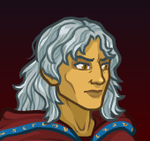
        
        
            Portrait
        
    
    
        
            
        
        
            Model
        
    

# Raistlin Majere

Born frail yet gifted with an uncanny aptitude for magic, Raistlin Majere is the Sorcery to his older twin brother Caramon's Sword. The youngest wizard ever to attempt the Test of High Sorcery, Raistlin was forever changed, marked by white hair, golden skin, and hourglass eyes that see the accelerated passage of time. Together with his fellow Heroes of the Lance, Raistlin wields his formidable arcane talents against Takhisis, the Dragon Queen.

# Basic Information

Raistlin Majere will be a new champion in the Fleetswake event on 4 March 2026.

    
        
            **Seat**:
        
        
            2
        
        
            **Stat**
        
        
            **Value**
        
        
            **Day 1 Trials**
        
        
            **Patrons**
        
    
    
        
            **Species**:
        
        
            Human
        
        
            **Strength**:
        
        
            9
        
        
            Yes
        
        
            Mirt
        
    
    
        
            **Class**:
        
        
            Wizard
        
        
            **Dexterity**:
        
        
            16
        
        
            Yes
        
        
            -
        
    
    
        
            **Roles**:
        
        
            DPS
        
        
            **Constitution**:
        
        
            9
        
        
            -
        
        
            Strahd
        
    
    
        
            **Age**:
        
        
            25
        
        
            **Intelligence**:
        
        
            18
        
        
            Yes
        
        
            -
        
    
    
        
            **Gender**:
        
        
            Male
        
        
            **Wisdom**:
        
        
            12
        
        
            Yes
        
        
            Elminster
        
    
    
        
            **Alignment**:
        
        
            Neutral
        
        
            **Charisma**:
        
        
            10
        
        
            -
        
        
            &nbsp;
        
    
    
        
            **Affiliation**:
        
        
            Heroes of the Lance
        
        
            **Total**:
        
        
            74
        
        
            Champion ID:
        
        
            173
        
    

# Formation

    <svg xmlns="http://www.w3.org/2000/svg" id="Raistlin" fill="#aaa" data-formationName="Raistlin" data-campaignName="Fleetswake" width="300" height="160"><circle cx="175" cy="25" r="15"/><circle cx="175" cy="145" r="15"/><circle cx="135" cy="45" r="15"/><circle cx="135" cy="125" r="15"/><circle cx="95" cy="65" r="15"/><circle cx="95" cy="105" r="15"/><circle cx="55" cy="45" r="15"/><circle cx="55" cy="125" r="15"/><circle cx="15" cy="25" r="15"/><circle cx="15" cy="145" r="15"/><text x="205" y="25" fill="#dcdcdc" font-size="25" font-family="Arial" font-weight="bold">Raistlin</text><text x="205" y="65" fill="#dcdcdc" font-size="15" font-family="Arial" font-weight="bold">Fleetswake</text></svg>

# Attacks

 **Base Attack: Magic Missile** (Magic)
> Raistlin fires a number of magic missiles at the toughest enemies.  
> Cooldown: 4.75s (Cap 1.1875s)

<em>Raw Data</em>

<pre>
{
    "id": 940,
    "name": "Magic Missile",
    "description": "Raistlin fires a number of magic missiles at the toughest enemies.",
    "long_description": "Raistlin fires a number of magic missiles at the toughest enemies.",
    "graphic_id": 0,
    "target": "highest_health",
    "num_targets": 3,
    "aoe_radius": 0,
    "damage_modifier": 1,
    "cooldown": 4.75,
    "animations": [
        {
            "type": "ranged_attack",
            "projectile": "magic_missile",
            "shoot_frame": 10,
            "shoot_offset_x": 64,
            "shoot_offset_y": -28,
            "projectile_delay": 0.1,
            "projectile_count": 3,
            "shoot_sound": 149,
            "hit_sound": 133,
            "projectile_details": {
                "projectile_graphic_id": 753,
                "impact_graphic_id": 754,
                "impact_offset_y": -50
            },
            "bonus_damage_from": {
                "type": "raistlin_debilitating_magic"
            },
            "hold_shoot_frame": true
        }
    ],
    "tags": [
        "ranged",
        "magic"
    ],
    "damage_types": [
        "magic"
    ]
}
</pre>

 **Ultimate Attack: Raistlin's Wheel of Flame** (Level: 80)
> Raistlin envelopes enemies with a deadly ring of fire, dealing one ultimate hit every second to enemies in the area.  
> Cooldown: 180s (Cap 45s)

<em>Raw Data</em>

<pre>
{
    "id": 941,
    "name": "Raistlin's Wheel of Flame",
    "description": "Raistlin envelopes enemies with a deadly ring of fire.",
    "long_description": "Raistlin envelopes enemies with a deadly ring of fire, dealing one ultimate hit every second to enemies in the area.",
    "graphic_id": 28532,
    "target": "all",
    "num_targets": 0,
    "aoe_radius": 0,
    "damage_modifier": 0.03,
    "cooldown": 180,
    "animations": [
        {
            "type": "ultimate_attack",
            "ultimate": "raistlin",
            "projectile_data": {
                "type": "ranged_attack",
                "shoot_offset_y": -185,
                "shoot_offset_x": 46,
                "shoot_frame": 36,
                "shoot_sound": 149,
                "hit_sound": 133,
                "projectile_details": {
                    "projectile_speed": 3500,
                    "projectile_graphic_id": 28553,
                    "impact_graphic_id": 28552,
                    "smoke_graphic_id": 446
                },
                "percent_height_offset": 5,
                "use_auto_rotation": true
            },
            "damage_frame": 8
        }
    ],
    "tags": [
        "magic",
        "ultimate"
    ],
    "damage_types": [
        "magic"
    ]
}
</pre>

# Abilities

 **Prodigy of High Sorcery** (Level: 20)
> Raistlin increases his damage by 100% for each Champion that is not adjacent to him, stacking multiplicatively.

<em>Upgrade Data</em>

<pre>
Upgrades:
      110: 100%
      210: 100%
      280: 100%
      370: 100%
      420: 100%
      490: 100%
      540: 100%
      590: 100%
      640: 100%
      690: 100%
      740: 100%
      780: 100%
      820: 100%
      870: 100%
      920: 100%
      980: 100%
    1,040: 100%
    1,100: 100%
    1,160: 100%
    1,220: 100%
    1,280: 100%
    1,340: 100%
    1,400: 100%
    1,460: 100%
    1,520: 100%
    1,580: 100%
    1,630: 100%
    1,690: 100%
    1,750: 100%
    1,810: 100%
    1,870: 100%
    1,930: 100%
    1,990: 100%
    2,050: 100%
    2,110: 100%
    2,170: 100%

    Total Upgrade Bonus: 6.87e12%
</pre>

<em>Raw Data</em>

<pre>
{
    "id": 18929,
    "hero_id": 173,
    "required_level": 20,
    "required_upgrade_id": 0,
    "upgrade_type": "unlock_ability",
    "effect": "effect_def,2619",
    "static_dps_mult": null,
    "default_enabled": 1,
    "name": "Prodigy of High Sorcery",
    "tip_text": "Raistlin increases his damage for each Champion that is not next to him."
}
{
    "id": 2619,
    "flavour_text": "",
    "description": {
        "desc": "Raistlin increases his damage by $(not_buffed amount)% for each Champion that is not adjacent to him, stacking multiplicatively."
    },
    "effect_keys": [
        {
            "effect_string": "hero_dps_multiplier_mult,100",
            "_amount_expr": "upgrade_amount(15619,0)",
            "amount_func": "mult",
            "stack_func": "per_hero_attribute",
            "per_hero_expr": "true",
            "per_hero_targets": [
                "non_adj"
            ],
            "show_bonus": true,
            "stack_title": "Non-Adjacent Champions",
            "amount_updated_listeners": [
                "upgrade_unlocked",
                "slot_changed",
                "feat_changed"
            ],
            "off_when_benched": true
        }
    ],
    "requirements": "",
    "graphic_id": 28524,
    "large_graphic_id": 28519,
    "properties": {
        "is_formation_ability": true,
        "owner_use_outgoing_description": true,
        "indexed_effect_properties": true,
        "per_effect_index_bonuses": true
    }
}
{
    "id": 18938,
    "hero_id": 173,
    "required_level": 110,
    "required_upgrade_id": 0,
    "upgrade_type": "upgrade_ability",
    "effect": "buff_upgrade,100,18929",
    "static_dps_mult": null,
    "default_enabled": 1,
    "name": ""
}
{
    "id": 19235,
    "hero_id": 173,
    "required_level": 2170,
    "required_upgrade_id": 0,
    "upgrade_type": "upgrade_ability",
    "effect": "buff_upgrade,100,18929",
    "static_dps_mult": null,
    "default_enabled": 1,
    "name": ""
}
{
    "id": 19231,
    "hero_id": 173,
    "required_level": 1990,
    "required_upgrade_id": 0,
    "upgrade_type": "upgrade_ability",
    "effect": "buff_upgrade,100,18929",
    "static_dps_mult": null,
    "default_enabled": 1,
    "name": ""
}
{
    "id": 19229,
    "hero_id": 173,
    "required_level": 1930,
    "required_upgrade_id": 0,
    "upgrade_type": "upgrade_ability",
    "effect": "buff_upgrade,100,18929",
    "static_dps_mult": null,
    "default_enabled": 1,
    "name": ""
}
{
    "id": 19228,
    "hero_id": 173,
    "required_level": 1870,
    "required_upgrade_id": 0,
    "upgrade_type": "upgrade_ability",
    "effect": "buff_upgrade,100,18929",
    "static_dps_mult": null,
    "default_enabled": 1,
    "name": ""
}
{
    "id": 19227,
    "hero_id": 173,
    "required_level": 1810,
    "required_upgrade_id": 0,
    "upgrade_type": "upgrade_ability",
    "effect": "buff_upgrade,100,18929",
    "static_dps_mult": null,
    "default_enabled": 1,
    "name": ""
}
{
    "id": 19225,
    "hero_id": 173,
    "required_level": 1750,
    "required_upgrade_id": 0,
    "upgrade_type": "upgrade_ability",
    "effect": "buff_upgrade,100,18929",
    "static_dps_mult": null,
    "default_enabled": 1,
    "name": ""
}
{
    "id": 19224,
    "hero_id": 173,
    "required_level": 1690,
    "required_upgrade_id": 0,
    "upgrade_type": "upgrade_ability",
    "effect": "buff_upgrade,100,18929",
    "static_dps_mult": null,
    "default_enabled": 1,
    "name": ""
}
{
    "id": 19222,
    "hero_id": 173,
    "required_level": 1630,
    "required_upgrade_id": 0,
    "upgrade_type": "upgrade_ability",
    "effect": "buff_upgrade,100,18929",
    "static_dps_mult": null,
    "default_enabled": 1,
    "name": ""
}
{
    "id": 19220,
    "hero_id": 173,
    "required_level": 1580,
    "required_upgrade_id": 0,
    "upgrade_type": "upgrade_ability",
    "effect": "buff_upgrade,100,18929",
    "static_dps_mult": null,
    "default_enabled": 1,
    "name": ""
}
{
    "id": 19219,
    "hero_id": 173,
    "required_level": 1520,
    "required_upgrade_id": 0,
    "upgrade_type": "upgrade_ability",
    "effect": "buff_upgrade,100,18929",
    "static_dps_mult": null,
    "default_enabled": 1,
    "name": ""
}
{
    "id": 19217,
    "hero_id": 173,
    "required_level": 1460,
    "required_upgrade_id": 0,
    "upgrade_type": "upgrade_ability",
    "effect": "buff_upgrade,100,18929",
    "static_dps_mult": null,
    "default_enabled": 1,
    "name": ""
}
{
    "id": 19215,
    "hero_id": 173,
    "required_level": 1400,
    "required_upgrade_id": 0,
    "upgrade_type": "upgrade_ability",
    "effect": "buff_upgrade,100,18929",
    "static_dps_mult": null,
    "default_enabled": 1,
    "name": ""
}
{
    "id": 19213,
    "hero_id": 173,
    "required_level": 1340,
    "required_upgrade_id": 0,
    "upgrade_type": "upgrade_ability",
    "effect": "buff_upgrade,100,18929",
    "static_dps_mult": null,
    "default_enabled": 1,
    "name": ""
}
{
    "id": 19212,
    "hero_id": 173,
    "required_level": 1280,
    "required_upgrade_id": 0,
    "upgrade_type": "upgrade_ability",
    "effect": "buff_upgrade,100,18929",
    "static_dps_mult": null,
    "default_enabled": 1,
    "name": ""
}
{
    "id": 19210,
    "hero_id": 173,
    "required_level": 1220,
    "required_upgrade_id": 0,
    "upgrade_type": "upgrade_ability",
    "effect": "buff_upgrade,100,18929",
    "static_dps_mult": null,
    "default_enabled": 1,
    "name": ""
}
{
    "id": 19208,
    "hero_id": 173,
    "required_level": 1160,
    "required_upgrade_id": 0,
    "upgrade_type": "upgrade_ability",
    "effect": "buff_upgrade,100,18929",
    "static_dps_mult": null,
    "default_enabled": 1,
    "name": ""
}
{
    "id": 19206,
    "hero_id": 173,
    "required_level": 1100,
    "required_upgrade_id": 0,
    "upgrade_type": "upgrade_ability",
    "effect": "buff_upgrade,100,18929",
    "static_dps_mult": null,
    "default_enabled": 1,
    "name": ""
}
{
    "id": 19204,
    "hero_id": 173,
    "required_level": 1040,
    "required_upgrade_id": 0,
    "upgrade_type": "upgrade_ability",
    "effect": "buff_upgrade,100,18929",
    "static_dps_mult": null,
    "default_enabled": 1,
    "name": ""
}
{
    "id": 19200,
    "hero_id": 173,
    "required_level": 920,
    "required_upgrade_id": 0,
    "upgrade_type": "upgrade_ability",
    "effect": "buff_upgrade,100,18929",
    "static_dps_mult": null,
    "default_enabled": 1,
    "name": ""
}
{
    "id": 19198,
    "hero_id": 173,
    "required_level": 870,
    "required_upgrade_id": 0,
    "upgrade_type": "upgrade_ability",
    "effect": "buff_upgrade,100,18929",
    "static_dps_mult": null,
    "default_enabled": 1,
    "name": ""
}
{
    "id": 19194,
    "hero_id": 173,
    "required_level": 780,
    "required_upgrade_id": 0,
    "upgrade_type": "upgrade_ability",
    "effect": "buff_upgrade,100,18929",
    "static_dps_mult": null,
    "default_enabled": 1,
    "name": ""
}
{
    "id": 19191,
    "hero_id": 173,
    "required_level": 690,
    "required_upgrade_id": 0,
    "upgrade_type": "upgrade_ability",
    "effect": "buff_upgrade,100,18929",
    "static_dps_mult": null,
    "default_enabled": 1,
    "name": ""
}
{
    "id": 19186,
    "hero_id": 173,
    "required_level": 590,
    "required_upgrade_id": 0,
    "upgrade_type": "upgrade_ability",
    "effect": "buff_upgrade,100,18929",
    "static_dps_mult": null,
    "default_enabled": 1,
    "name": ""
}
{
    "id": 19184,
    "hero_id": 173,
    "required_level": 540,
    "required_upgrade_id": 0,
    "upgrade_type": "upgrade_ability",
    "effect": "buff_upgrade,100,18929",
    "static_dps_mult": null,
    "default_enabled": 1,
    "name": ""
}
{
    "id": 19178,
    "hero_id": 173,
    "required_level": 420,
    "required_upgrade_id": 0,
    "upgrade_type": "upgrade_ability",
    "effect": "buff_upgrade,100,18929",
    "static_dps_mult": null,
    "default_enabled": 1,
    "name": ""
}
{
    "id": 19171,
    "hero_id": 173,
    "required_level": 280,
    "required_upgrade_id": 0,
    "upgrade_type": "upgrade_ability",
    "effect": "buff_upgrade,100,18929",
    "static_dps_mult": null,
    "default_enabled": 1,
    "name": ""
}
{
    "id": 19168,
    "hero_id": 173,
    "required_level": 210,
    "required_upgrade_id": 0,
    "upgrade_type": "upgrade_ability",
    "effect": "buff_upgrade,100,18929",
    "static_dps_mult": null,
    "default_enabled": 1,
    "name": ""
}
{
    "id": 19234,
    "hero_id": 173,
    "required_level": 2110,
    "required_upgrade_id": 0,
    "upgrade_type": "upgrade_ability",
    "effect": "buff_upgrade,100,18929",
    "static_dps_mult": null,
    "default_enabled": 1,
    "name": ""
}
{
    "id": 19232,
    "hero_id": 173,
    "required_level": 2050,
    "required_upgrade_id": 0,
    "upgrade_type": "upgrade_ability",
    "effect": "buff_upgrade,100,18929",
    "static_dps_mult": null,
    "default_enabled": 1,
    "name": ""
}
{
    "id": 19202,
    "hero_id": 173,
    "required_level": 980,
    "required_upgrade_id": 0,
    "upgrade_type": "upgrade_ability",
    "effect": "buff_upgrade,100,18929",
    "static_dps_mult": null,
    "default_enabled": 1,
    "name": ""
}
{
    "id": 19193,
    "hero_id": 173,
    "required_level": 740,
    "required_upgrade_id": 0,
    "upgrade_type": "upgrade_ability",
    "effect": "buff_upgrade,100,18929",
    "static_dps_mult": null,
    "default_enabled": 1,
    "name": ""
}
{
    "id": 19181,
    "hero_id": 173,
    "required_level": 490,
    "required_upgrade_id": 0,
    "upgrade_type": "upgrade_ability",
    "effect": "buff_upgrade,100,18929",
    "static_dps_mult": null,
    "default_enabled": 1,
    "name": ""
}
{
    "id": 19189,
    "hero_id": 173,
    "required_level": 640,
    "required_upgrade_id": 0,
    "upgrade_type": "upgrade_ability",
    "effect": "buff_upgrade,100,18929",
    "static_dps_mult": null,
    "default_enabled": 1,
    "name": ""
}
{
    "id": 19175,
    "hero_id": 173,
    "required_level": 370,
    "required_upgrade_id": 0,
    "upgrade_type": "upgrade_ability",
    "effect": "buff_upgrade,100,18929",
    "static_dps_mult": null,
    "default_enabled": 1,
    "name": ""
}
{
    "id": 19196,
    "hero_id": 173,
    "required_level": 820,
    "required_upgrade_id": 0,
    "upgrade_type": "upgrade_ability",
    "effect": "buff_upgrade,100,18929",
    "static_dps_mult": null,
    "default_enabled": 1,
    "name": ""
}
</pre>

 **Savant** (Level: 60)
> For each positional formation ability affecting Raistlin, he gains Intensity stacks based on how few other Champions are also affected by the same ability. He gains one stack if there are three other Champions affected, two if there are two other Champions affected, three if there is only one other Champion affected, and four if Raistlin is the only Champion affected. The effect of Prodigy of High Sorcery is increased by 100% for each Intensity stack Raistlin has, stacking multiplicatively.

ⓘ *Note: This ability is prestack.*

<em>Raw Data</em>

<pre>
{
    "id": 18930,
    "hero_id": 173,
    "required_level": 60,
    "required_upgrade_id": 0,
    "upgrade_type": "unlock_ability",
    "effect": "effect_def,2620",
    "static_dps_mult": null,
    "default_enabled": 1,
    "name": "Savant",
    "tip_text": "Raistlin's damage is increased for each positional buff he receives that only affects a few other Champions in the formation."
}
{
    "id": 2620,
    "flavour_text": "",
    "description": {
        "desc": "For each positional formation ability affecting Raistlin, he gains Intensity stacks based on how few other Champions are also affected by the same ability. He gains one stack if there are three other Champions affected, two if there are two other Champions affected, three if there is only one other Champion affected, and four if Raistlin is the only Champion affected. The effect of Prodigy of High Sorcery is increased by $amount% for each Intensity stack Raistlin has, stacking multiplicatively."
    },
    "effect_keys": [
        {
            "effect_string": "pre_stack,100",
            "off_when_benched": true
        },
        {
            "effect_string": "buff_upgrades,0,18929",
            "amount_func": "mult",
            "amount_expr": "upgrade_amount(18930,0)",
            "stack_func": "per_positional_formation_ability",
            "stack_func_data": {
                "stack_count_expr": "max(0, 4-other_champions_affected)"
            },
            "show_bonus": true,
            "stack_title": "Intensity Stacks",
            "amount_updated_listeners": [
                "slot_changed",
                "positional_formation_ability_changed"
            ],
            "off_when_benched": true
        },
        {
            "effect_string": "raistlin_savant_achievement",
            "off_when_benched": true
        }
    ],
    "requirements": "",
    "graphic_id": 28524,
    "large_graphic_id": 28520,
    "properties": {
        "is_formation_ability": true,
        "owner_use_outgoing_description": true,
        "formation_circle_icon": true,
        "indexed_effect_properties": true,
        "per_effect_index_bonuses": true,
        "default_bonus_index": 0
    }
}
</pre>

 **Debilitating Magic** (Level: 100)
> When Raistlin attacks and is at or above 90% of his max health, he takes 1% of his max health as damage but deals 400% more damage with his attack.

<em>Raw Data</em>

<pre>
{
    "id": 18931,
    "hero_id": 173,
    "required_level": 100,
    "required_upgrade_id": 0,
    "upgrade_type": "unlock_ability",
    "effect": "effect_def,2621",
    "static_dps_mult": null,
    "default_enabled": 1,
    "name": "Debilitating Magic"
}
{
    "id": 2621,
    "flavour_text": "",
    "description": {
        "desc": "When Raistlin attacks and is at or above $health_percent_threshold% of his max health, he takes $damage_percent% of his max health as damage but deals $amount% more damage with his attack."
    },
    "effect_keys": [
        {
            "effect_string": "raistlin_debilitating_magic,400",
            "health_percent_threshold": 90,
            "damage_percent": 1
        },
        {
            "effect_string": "do_nothing,0",
            "active_graphic_id": 28829,
            "active_graphic_y": -70
        }
    ],
    "requirements": "",
    "graphic_id": 28521,
    "large_graphic_id": 28516,
    "properties": {
        "is_formation_ability": true,
        "owner_use_outgoing_description": true,
        "indexed_effect_properties": true,
        "per_effect_index_bonuses": true,
        "default_bonus_index": 1
    }
}
</pre>

 **Herbalism** (Level: 150)
> Other Champions' healing effects on Raistlin are reduced by 50%. Whenever any other Champion in the formation uses an ultimate attack, Raistlin drinks a cup of tea after his next attack, healing himself for 2% of his max health for each ultimate that was used, stacking additively.

<em>Raw Data</em>

<pre>
{
    "id": 18932,
    "hero_id": 173,
    "required_level": 150,
    "required_upgrade_id": 0,
    "upgrade_type": "unlock_ability",
    "effect": "effect_def,2622",
    "static_dps_mult": null,
    "default_enabled": 1,
    "name": "Herbalism"
}
{
    "id": 2622,
    "flavour_text": "",
    "description": {
        "desc": "Other Champions' healing effects on Raistlin are reduced by $(amount___2)%. Whenever any other Champion in the formation uses an ultimate attack, Raistlin drinks a cup of tea after his next attack, healing himself for $health_percent_per_ultimate% of his max health for each ultimate that was used, stacking additively."
    },
    "effect_keys": [
        {
            "effect_string": "raistlin_herbalism",
            "health_percent_per_ultimate": 2,
            "stacks_on_trigger": "will_stack_manually",
            "stacks_multiply": false
        },
        {
            "effect_string": "healed_by_others_reduction_mult,50"
        }
    ],
    "requirements": "",
    "graphic_id": 28523,
    "large_graphic_id": 28518,
    "properties": {
        "is_formation_ability": true,
        "owner_use_outgoing_description": true,
        "indexed_effect_properties": true,
        "per_effect_index_bonuses": true
    }
}
</pre>

 **Flames of High Sorcery** (Level: 220)
> While fighting in an area with an incomplete quest, Raistlin casts Fireball at enemies in the next area after every fourth attack. This causes those enemies to spawn with missing health equal to 10% of their max health, stacking additively up to five times.

<em>Raw Data</em>

<pre>
{
    "id": 18933,
    "hero_id": 173,
    "required_level": 220,
    "required_upgrade_id": 0,
    "upgrade_type": "unlock_ability",
    "effect": "effect_def,2623",
    "static_dps_mult": null,
    "default_enabled": 1,
    "name": "Flames of High Sorcery"
}
{
    "id": 2623,
    "flavour_text": "",
    "description": {
        "desc": "While fighting in an area with an incomplete quest, Raistlin casts Fireball at enemies in the next area after every fourth attack. This causes those enemies to spawn with missing health equal to $damage_per_stack% of their max health, stacking additively up to five times."
    },
    "effect_keys": [
        {
            "effect_string": "raistlin_flames_of_high_sorcery",
            "stacks_on_trigger": "will_stack_manually",
            "stacks_multiply": false,
            "damage_per_stack": 10,
            "show_stacks": true,
            "max_stacks": 5,
            "stack_title": "Fireballs in last area",
            "effects": [
                {
                    "effect_string": "damage_hit_based_target_by_percent_disabled,0"
                },
                {
                    "effect_string": "damage_monster_target_by_percent,0"
                }
            ]
        }
    ],
    "requirements": "",
    "graphic_id": 28522,
    "large_graphic_id": 28517,
    "properties": {
        "is_formation_ability": true,
        "owner_use_outgoing_description": true
    }
}
</pre>

# Specialisations

 **Heroic Mage** (Level: 130)
> Raistlin increases the effect of Prodigy of High Sorcery by 125% for each Good Champion in the formation, stacking multiplicatively.

<em>Raw Data</em>

<pre>
{
    "id": 18934,
    "hero_id": 173,
    "required_level": 130,
    "required_upgrade_id": 0,
    "upgrade_type": "unlock_ability",
    "effect": "effect_def,2624",
    "static_dps_mult": null,
    "default_enabled": 1,
    "name": "Heroic Mage",
    "specialization_name": "Heroic Mage",
    "specialization_description": "Heroes are reluctantly forged in the crucible of war.",
    "specialization_graphic_id": 28529
}
{
    "id": 2624,
    "flavour_text": "",
    "description": {
        "desc": "Raistlin increases the effect of Prodigy of High Sorcery by $(not_buffed amount)% for each Good Champion in the formation, stacking multiplicatively."
    },
    "effect_keys": [
        {
            "effect_string": "buff_upgrade,125,18929",
            "off_when_benched": true,
            "show_bonus": true,
            "amount_func": "mult",
            "stack_func": "per_hero_attribute",
            "per_hero_expr": "HasTag(`good`)",
            "amount_updated_listeners": [
                "slot_changed",
                "hero_tags_changed"
            ]
        }
    ],
    "requirements": "",
    "graphic_id": 0,
    "large_graphic_id": 28529,
    "properties": {
        "is_formation_ability": true,
        "owner_use_outgoing_description": true,
        "formation_circle_icon": false,
        "spec_option_post_apply_info": "Good Champions: $num_stacks"
    }
}
</pre>

 **Reclusive Mage** (Level: 130)
> Raistlin increases the effect of Prodigy of High Sorcery by 125% for each Champion in the formation with a Melee or Ranged base attack, stacking multiplicatively.

<em>Raw Data</em>

<pre>
{
    "id": 18935,
    "hero_id": 173,
    "required_level": 130,
    "required_upgrade_id": 0,
    "upgrade_type": "unlock_ability",
    "effect": "effect_def,2625",
    "static_dps_mult": null,
    "default_enabled": 1,
    "name": "Reclusive Mage",
    "specialization_name": "Reclusive Mage",
    "specialization_description": "Raistlin stands apart among the Heroes of the Lance as the only true practitioner of High Sorcery.",
    "specialization_graphic_id": 28530
}
{
    "id": 2625,
    "flavour_text": "",
    "description": {
        "desc": "Raistlin increases the effect of Prodigy of High Sorcery by $(not_buffed amount)% for each Champion in the formation with a Melee or Ranged base attack, stacking multiplicatively."
    },
    "effect_keys": [
        {
            "effect_string": "buff_upgrade,125,18929",
            "off_when_benched": true,
            "show_bonus": true,
            "amount_func": "mult",
            "stack_func": "per_hero_attribute",
            "per_hero_expr": "HasAttackDamageType(`ranged`) || HasAttackDamageType(`melee`)",
            "amount_updated_listeners": [
                "slot_changed",
                "attack_changed"
            ]
        }
    ],
    "requirements": "",
    "graphic_id": 0,
    "large_graphic_id": 28530,
    "properties": {
        "is_formation_ability": true,
        "owner_use_outgoing_description": true,
        "formation_circle_icon": false,
        "spec_option_post_apply_info": "Melee or Ranged Champions: $num_stacks"
    }
}
</pre>

 **War Mage** (Level: 130)
> Raistlin increases the effect of Prodigy of High Sorcery by 300% for each Tanking Champion in the formation, stacking multiplicatively.

<em>Raw Data</em>

<pre>
{
    "id": 18936,
    "hero_id": 173,
    "required_level": 130,
    "required_upgrade_id": 0,
    "upgrade_type": "unlock_ability",
    "effect": "effect_def,2626",
    "static_dps_mult": null,
    "default_enabled": 1,
    "name": "War Mage",
    "specialization_name": "War Mage",
    "specialization_description": "When protected by his allies, Raistlin excels at facing the forces of Takhisis.",
    "specialization_graphic_id": 28531
}
{
    "id": 2626,
    "flavour_text": "",
    "description": {
        "desc": "Raistlin increases the effect of Prodigy of High Sorcery by $(not_buffed amount)% for each Tanking Champion in the formation, stacking multiplicatively."
    },
    "effect_keys": [
        {
            "effect_string": "buff_upgrade,300,18929",
            "off_when_benched": true,
            "show_bonus": true,
            "amount_func": "mult",
            "stack_func": "per_hero_attribute",
            "per_hero_expr": "HasTag(`tanking`)",
            "amount_updated_listeners": [
                "slot_changed",
                "hero_tags_changed"
            ]
        }
    ],
    "requirements": "",
    "graphic_id": 0,
    "large_graphic_id": 28531,
    "properties": {
        "is_formation_ability": true,
        "owner_use_outgoing_description": true,
        "formation_circle_icon": false,
        "spec_option_post_apply_info": "Tanking Champions: $num_stacks"
    }
}
</pre>

# Items

    
        
            **Icons**
        
        
            **Slot**
        
        
            **Epic Name**
        
        
            **Effect**
        
    
    
        
            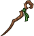ID: 4130**Simple Staff**My brother and I planned a secret journey.  Increases the damage of Raistlin by 50%.<code>hero_dps_multiplier_mult,50 allow_ge:true</code>ID: 4131**Apprentice Staff**I had been selected to take the Test. You can imagine my pride.  Increases the damage of Raistlin by 125%.<code>hero_dps_multiplier_mult,125 allow_ge:true</code>ID: 4132**Staff of Magius**We traveled to the secret place, the Towers of High Sorcery.  Increases the damage of Raistlin by 200%.<code>hero_dps_multiplier_mult,200 allow_ge:true</code>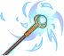ID: 4133**Staff of Magius Alight**There I passed the test. And there I nearly died!  Increases the damage of Raistlin by 350%.<code>hero_dps_multiplier_mult,350 allow_ge:true</code>&nbsp;
        
        
            1
        
        
            Staff of Magius Alight
        
        
            Increases the damage of Raistlin by 350%.
        
    
    
        
            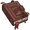ID: 4134**Discarded Book**While you and my brother played with wooden swords, I spent my time in study.  Increases the effect of Raistlin's Prodigy of High Sorcery ability by 25%.<code>buff_upgrade,25,18929 allow_ge:false</code>ID: 4135**Theobald's Academy Textbook**During the Cataclysm, the city of Xak Tsaroth was cast down the side of a cliff.  Increases the effect of Raistlin's Prodigy of High Sorcery ability by 87.5%.<code>buff_upgrade,87.5,18929 allow_ge:false</code>ID: 4136**Raistlin's Spellbook**My brother, there is something you must bring me from the dragon's lair.  Increases the effect of Raistlin's Prodigy of High Sorcery ability by 150%.<code>buff_upgrade,150,18929 allow_ge:false</code>ID: 4137**Spellbooks of Fistandantilus**It is one of the mage's early books. One he had when he was very young indeed.  Increases the effect of Raistlin's Prodigy of High Sorcery ability by 275%.<code>buff_upgrade,275,18929 allow_ge:false</code>&nbsp;
        
        
            2
        
        
            Spellbooks of Fistandantilus
        
        
            Increases the effect of Raistlin's Prodigy of High Sorcery ability by 275%.
        
    
    
        
            ID: 4138**Common Robes**When I awoke, my skin had turned this color - a mark of my suffering.  Increases the effect of Raistlin's Savant ability by 10%. (Prestack)<code>buff_upgrade,10,18930,0 allow_ge:false</code>ID: 4139**White Robes of Solinari**My body and health are irretrievably shattered. And my eyes!  Increases the effect of Raistlin's Savant ability by 30%. (Prestack)<code>buff_upgrade,30,18930,0 allow_ge:false</code>ID: 4140**Red Robes of Lunitari**I see through hourglass pupils. I see time, as it affects all things.  Increases the effect of Raistlin's Savant ability by 50%. (Prestack)<code>buff_upgrade,50,18930,0 allow_ge:false</code>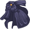ID: 4141**Black Robes of Nuitari**I see you dying, slowly, by inches. And so I see every living thing.  Increases the effect of Raistlin's Savant ability by 100%. (Prestack)<code>buff_upgrade,100,18930,0 allow_ge:false</code>&nbsp;
        
        
            3
        
        
            Black Robes of Nuitari
        
        
            Increases the effect of Raistlin's Savant ability by 100%. (Prestack)
        
    
    
        
            ID: 4142**Withered Herbs**I must replenish the herbs that heal my cough.  Increases the effect of Raistlin's Debilitating Magic ability by 25%.<code>buff_upgrade,25,18931 allow_ge:false</code>ID: 4143**Medicinal Herbs**My body was my sacrifice for my magic. This damage is permanent.  Increases the effect of Raistlin's Debilitating Magic ability by 87.5%.<code>buff_upgrade,87.5,18931 allow_ge:false</code>ID: 4144**Raistlin's Tea**I am much better. Leave me to my concoction.  Increases the effect of Raistlin's Debilitating Magic ability by 150%.<code>buff_upgrade,150,18931 allow_ge:false</code>ID: 4145**Mysterious Reagents**My spell components are secret.  Increases the effect of Raistlin's Debilitating Magic ability by 275%.<code>buff_upgrade,275,18931 allow_ge:false</code>&nbsp;
        
        
            4
        
        
            Mysterious Reagents
        
        
            Increases the effect of Raistlin's Debilitating Magic ability by 275%.
        
    
    
        
            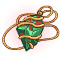ID: 4146**Unidentified Stone**You have never heard of him, yet he was one of the greatest of my order.  Increases the effect of Raistlin's Specializations by 25%.<code>buff_upgrades,25,18934,18935,18936 allow_ge:false</code>ID: 4147**Fake Bloodstone**His name was Fistandantilus. Ask me no more! You are as bad as the others!  Increases the effect of Raistlin's Specializations by 87.5%.<code>buff_upgrades,87.5,18934,18935,18936 allow_ge:false</code>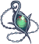ID: 4148**Bloodstone of Fistandantilus**It is valuable to me. I must have it! I must!  Increases the effect of Raistlin's Specializations by 150%.<code>buff_upgrades,150,18934,18935,18936 allow_ge:false</code>ID: 4149**Dragon Orb of Istar**None of us will come out of Silvanesti unscathed, if we come out at all.  Increases the effect of Raistlin's Specializations by 275%.<code>buff_upgrades,275,18934,18935,18936 allow_ge:false</code>&nbsp;
        
        
            5
        
        
            Dragon Orb of Istar
        
        
            Increases the effect of Raistlin's Specializations by 275%.
        
    
    
        
            ID: 4150**Powdered Herbs**Pound this in a cup and add water, then stir and drink. Ignore the smell.  Reduces the cooldown on Raistlin's Ultimate Attack by 5 seconds.<code>reduce_ultimate_cooldown,5 allow_ge:false</code>ID: 4151**Flashpowder**The halcyon days I spent in mimicry of a simple illusionist are long gone.  Reduces the cooldown on Raistlin's Ultimate Attack by 9 seconds.<code>reduce_ultimate_cooldown,9 allow_ge:false</code>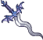ID: 4152**Dagger of Magius**Don't do it, my brother. Come no closer.  Reduces the cooldown on Raistlin's Ultimate Attack by 18 seconds.<code>reduce_ultimate_cooldown,18 allow_ge:false</code>ID: 4153**Spellbook of Magius**Par-Salian told me the day would come when my strength would shape the world!  Reduces the cooldown on Raistlin's Ultimate Attack by 45 seconds.<code>reduce_ultimate_cooldown,45 allow_ge:false</code>&nbsp;
        
        
            6
        
        
            Spellbook of Magius
        
        
            Reduces the cooldown on Raistlin's Ultimate Attack by 45 seconds. Cap: 501 dull / 251 shiny / 126 golden.
        
    

<em>Item Names and Descriptions</em>

<pre>
Slot 1:
             Staff of Magius: We traveled to the secret place, the Towers of High Sorcery.
                Simple Staff: My brother and I planned a secret journey.
            Apprentice Staff: I had been selected to take the Test. You can imagine my pride.
      Staff of Magius Alight: There I passed the test. And there I nearly died!

Slot 2:
              Discarded Book: While you and my brother played with wooden swords, I spent my
                              time in study.
 Theobald's Academy Textbook: During the Cataclysm, the city of Xak Tsaroth was cast down the
                              side of a cliff.
        Raistlin's Spellbook: My brother, there is something you must bring me from the
                              dragon's lair.
Spellbooks of Fistandantilus: It is one of the mage's early books. One he had when he was very
                              young indeed.

Slot 3:
                Common Robes: When I awoke, my skin had turned this color - a mark of my
                              suffering.
     White Robes of Solinari: My body and health are irretrievably shattered. And my eyes!
       Red Robes of Lunitari: I see through hourglass pupils. I see time, as it affects all
                              things.
      Black Robes of Nuitari: I see you dying, slowly, by inches. And so I see every living
                              thing.

Slot 4:
              Withered Herbs: I must replenish the herbs that heal my cough.
             Medicinal Herbs: My body was my sacrifice for my magic. This damage is permanent.
              Raistlin's Tea: I am much better. Leave me to my concoction.
         Mysterious Reagents: My spell components are secret.

Slot 5:
          Unidentified Stone: You have never heard of him, yet he was one of the greatest of my
                              order.
             Fake Bloodstone: His name was Fistandantilus. Ask me no more! You are as bad as
                              the others!
Bloodstone of Fistandantilus: It is valuable to me. I must have it! I must!
         Dragon Orb of Istar: None of us will come out of Silvanesti unscathed, if we come out
                              at all.

Slot 6:
              Powdered Herbs: Pound this in a cup and add water, then stir and drink. Ignore
                              the smell.
                 Flashpowder: The halcyon days I spent in mimicry of a simple illusionist are
                              long gone.
            Dagger of Magius: Don't do it, my brother. Come no closer.
         Spellbook of Magius: Par-Salian told me the day would come when my strength would
                              shape the world!
</pre>

 

# Feats

This list will only show feats that are going to be available on the release of this champion. The separate [Feats](feats.md){:target="_blank"} page may show others that could be available later if they exist.

    
        
            **Feat**
        
        
            **Effect**
        
        
            **Source**
        
    
    
        
            ID: 2510**Adept (Raistlin)**That pasty-faced, skinny magician. He's more than half charlatan himself. ~Flint<code>hero_dps_multiplier_mult,30</code>Adept
        
        
            Increases the damage of Raistlin by 30%.
        
        
            Free
        
    
    
        
            ID: 2511**Elementalist (Raistlin)**I think the young man was a better magician than you give him credit for. ~Tanis<code>hero_dps_multiplier_mult,60</code>Elementalist
        
        
            Increases the damage of Raistlin by 60%.
        
        
            Gold Chest
        
    
    
        
            ID: 2512**Glowing Darts (Raistlin)**Touch me not! I am magi! ~Raistlin<code>do_nothing</code>Glowing Darts
        
        
            Raistlin fires an additional magic missile with his base attack.
        
        
            Event Bonus
        
    
    
        
            ID: 2514**Seeker of Sorcery (Raistlin)**Power is what I have long sought - and still seek. ~Raistlin<code>buff_upgrade,20,18929</code>Seeker of Sorcery
        
        
            Increases the effect of Raistlin's Prodigy of High Sorcery ability by 20%.
        
        
            Free
        
    
    
        
            ID: 2515**Tested Sorcery (Raistlin)**I saw him battle powerful mages with only a few simple spells. ~Caramon<code>buff_upgrade,40,18929</code>Tested Sorcery
        
        
            Increases the effect of Raistlin's Prodigy of High Sorcery ability by 40%.
        
        
            12,500 Gems
        
    
    
        
            ID: 2516**Greatest Gift (Raistlin)**Caramon, there's a dark side to your brother, and Tanis has seen it. ~Sturm<code>buff_upgrade,40,18930</code>Greatest Gift
        
        
            Increases the effect of Raistlin's Savant ability by 40%. (Prestack)
        
        
            Gold Chest
        
    
    
        
            ID: 2517**Weakening Arcana (Raistlin)**I can cast a spell on the door, but it will weaken me greatly. ~Raistlin<code>buff_upgrade,20,18931</code>Weakening Arcana
        
        
            Increases the effect of Raistlin's Debilitating Magic ability by 20%.
        
        
            Free
        
    
    
        
            ID: 2518**Enfeebling Arcana (Raistlin)**The spell... drained me... I must rest... ~Raistlin<code>buff_upgrade,40,18931</code>Enfeebling Arcana
        
        
            Increases the effect of Raistlin's Debilitating Magic ability by 40%.
        
        
            12,500 Gems
        
    
    
        
            ID: 2524**Questioning Mage (Raistlin)**Ah, but who chose us? And for what purpose? Consider that, Tanis! ~Raistlin<code>buff_upgrades,20,18934,18935,18936</code>Questioning Mage
        
        
            Increases the effect of Raistlin's Specializations by 20%.
        
        
            Free
        
    
    
        
            ID: 2525**Desperate Mage (Raistlin)**Was it worth it? ~Tanis<code>buff_upgrades,40,18934,18935,18936</code>Desperate Mage
        
        
            Increases the effect of Raistlin's Specializations by 40%.
        
        
            Gold Chest
        
    
    
        
            ID: 2526**Timely Mage (Raistlin)**I am here, my brother. ~Raistlin<code>buff_upgrades,80,18934,18935,18936</code>Timely Mage
        
        
            Increases the effect of Raistlin's Specializations by 80%.
        
        
            Event Bonus
        
    
    
        
            ID: 2527**Fate Foretold (Raistlin)**As was foretold, he is the master of both present and past. ~Fizban<code>hero_dps_multiplier_mult,400 change_hero_alignment_tag,chaotic,evil</code>Fate Foretold
        
        
            Increases the Base DPS of Raistlin by 400% and changes his alignment to Chaotic Evil.
        
        
            3,830 Platinum 50,000 Gems
        
    

# Legendaries

Unknown.

# Adventures and Variants

**Unlock Adventure: The Unfair Sea (Raistlin)** (Complete Area 50)
> Search for some missing ships during Fleetswake in Waterdeep.

 **Variant 1: The Sly One** (Complete Area 75)
> Raistlin starts in the formation. He can be moved, but not removed.  
> Only Raistlin and Champions not next to him can deal damage.  
> After area 100, attacks against undamaged enemies have a 90% chance to completely miss.  
> 1-2 Baaz Draconians spawn with each wave. They don't drop gold nor count towards quest progress.  
> <b>Getting to Know Raistlin:</b> Raistlin's role is dealing damage, and he deals more damage when he is next to fewer Champions. Place him in an isolated spot of a formation to increase his damage!

 **Variant 2: Test of Sorcery** (Complete Area 125)
> Raistlin starts in the formation. He can be moved, but not removed.  
> Fizban joins the formation. Champions in Fizban's column deal 1000% additional damage. This bonus counts as a positional formation ability.  
> You may only use Champions that have positional formation abilities.  
> In each boss area, a Sivak Draconian boss spawns as part of the first wave. It must also be defeated to progress.  
> <b>Getting to Know Raistlin:</b> Raistlin's damage is increased dramatically when he is buffed by positional formation abilities that target 4 or fewer Champions in the formation. This buff further increases as the number of Champions buffed by the ability is reduced!

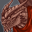 **Variant 3: War of the Lance** (Complete Area 175)
> Raistlin starts in the formation. He can be moved, but not removed.  
> You may only use Good Champions, Tanking Champions, or Champions with a ranged or melee attack.  
> Champions do not regain health when changing areas.  
> Every 3 seconds, a random Champion is struck by a falling rock, dealing 5% of their maximum health in damage.  
> 1-2 Kapak Draconians spawn with each wave. They don't drop gold nor count towards quest progress.  
> In each boss area, an Aurak Draconian boss spawns as part of the first wave. It must also be defeated to progress.  
> <b>Getting to Know Raistlin:</b> Raistlin's specialization choice determines which Champions he works best with. Which Champions will you add to the formation?

# Other Champion Images

    
        
            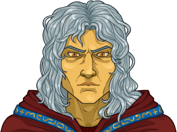Console Portrait
        
    
    
        
            Gold Chest Icon
        
        
            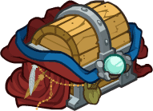Silver Chest Icon
        
    

[Back to Top](#top)

*Last Modified: {{ site.time }}*