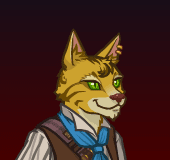

[Back to Main](index.md)

    
        Portrait
    

# Rust

Rust on the Harbour is a former pirate who gave up a life at sea because it was far too wet. Now trying life as an adventurer on land, he'll lend his roguish skills to anyone who can give him that which his heart desires most: one gold piece.

# Changes

Rust is potentially a reworked champion in the Ahghairon's Day event on 7 August 2024.

Only abilities that have seen some changes will be displayed here - and be aware that there's a lot of guesswork involved. Some abilities may not have names - some may have the *wrong* names - or specialisations might not be marked as such - etc.. Focus on the effect data itself.

Please do me a favour and don't get all melodramatic about what you find here. I - and CNE - don't appreciate it. These are spoilers and will almost certainly change before release - likely multiple times. That and we don't have access to any upgrade data prior to release. Making assumptions on how the champions will turn out based on this information would be premature.

# Abilities

**Base Attack: Bang Bang** (Guess)
> Rust shoots a random enemy with his pistols.

<em>Raw Data</em>

<pre>
{
    "id": 782,
    "name": "Bang Bang",
    "description": "Rust shoots a random enemy with his pistols.",
    "long_description": "Rust shoots a random enemy with his pistols.",
    "graphic_id": 0,
    "target": "random",
    "num_targets": 1,
    "aoe_radius": 0,
    "damage_modifier": 0.5,
    "cooldown": 5,
    "animations": [
        {
            "type": "ranged_attack",
            "projectile": "generic",
            "shoot_offset_x": 60,
            "shoot_offset_y": -50,
            "shoot_frame": 4,
            "projectile_delay_no_pause": 0.25,
            "projectile_count": 2,
            "unique_hit_multiplier": 2,
            "projectile_details": {
                "projectile_speed": 2400,
                "has_trail": false,
                "extend_line": true,
                "projectile_graphic_id": 5395
            }
        }
    ],
    "tags": [
        "ranged"
    ],
    "damage_types": [
        "melee",
        "ranged"
    ]
}
</pre>

**Base Attack: Stabby Stabby** (Guess)
> Rust leaps out and stabs a random enemy with his Rapier.

<em>Raw Data</em>

<pre>
{
    "id": 783,
    "name": "Stabby Stabby",
    "description": "Rust leaps out and stabs a random enemy with his Rapier.",
    "long_description": "Rust leaps out and stabs a random enemy with his Rapier.",
    "graphic_id": 0,
    "target": "random",
    "num_targets": 1,
    "aoe_radius": 0,
    "damage_modifier": 1,
    "cooldown": 5,
    "animations": [
        {
            "type": "melee_attack",
            "target_offset_x": -125,
            "damage_frame": 14,
            "jump_sound": 30,
            "sound_frames": {
                "14": 154
            }
        }
    ],
    "tags": [
        "melee"
    ],
    "damage_types": [
        "melee",
        "ranged"
    ]
}
</pre>

**Ultimate: Cannonball!** (Guess)
> Rust loads himself into a cannon and fires himself toward the enemies, dealing damage in a large area upon landing. If Rust has a shiny gold piece, he drops it while flying through the air.

<em>Raw Data</em>

<pre>
{
    "id": 784,
    "name": "Cannonball!",
    "description": "Rust climbs into a cannon and fires himself at the enemies, dealing damage in a large area.",
    "long_description": "Rust loads himself into a cannon and fires himself toward the enemies, dealing damage in a large area upon landing. If Rust has a shiny gold piece, he drops it while flying through the air.",
    "graphic_id": 12843,
    "target": "all",
    "num_targets": 1,
    "aoe_radius": 0,
    "damage_modifier": 0.03,
    "cooldown": 180,
    "animations": [
        {
            "type": "ultimate_attack",
            "ultimate": "rust"
        }
    ],
    "tags": [
        "ranged",
        "aoe",
        "ultimate"
    ],
    "damage_types": [
        "ranged"
    ]
}
</pre>

**Hello, Friends** (Guess)
> Rust increases the damage of all Champions by 400% for each Champion in the formation with the Gold Find role or the Oxventurers Guild affiliation, stacking multiplicatively.

<em>Raw Data</em>

<pre>
{
    "id": 2035,
    "flavour_text": "",
    "description": {
        "desc": "Rust increases the damage of all Champions by $(not_buffed amount)% for each Champion in the formation with the Gold Find role or the Oxventurers Guild affiliation, stacking multiplicatively."
    },
    "effect_keys": [
        {
            "off_when_benched": true,
            "effect_string": "hero_dps_multiplier_mult,400",
            "targets": [
                "all"
            ],
            "stacks_multiply": true,
            "amount_func": "mult",
            "stack_func": "per_hero_attribute",
            "per_hero_expr": "HasTag(`gold`) || HasTag(`oxventure`)",
            "show_bonus": true,
            "use_computed_amount_for_description": true
        }
    ],
    "requirements": "",
    "graphic_id": 12837,
    "large_graphic_id": 12833,
    "properties": {
        "is_formation_ability": true,
        "owner_use_outgoing_description": true
    }
}
</pre>

**Rust For Hire** (Guess)
> Rust increases your gold find by 400%.

<em>Raw Data</em>

<pre>
{
    "id": 2036,
    "flavour_text": "",
    "description": {
        "desc": "Rust increases your gold find by $(amount)%."
    },
    "effect_keys": [
        {
            "off_when_benched": true,
            "effect_string": "gold_multiplier_mult,400"
        }
    ],
    "requirements": "",
    "graphic_id": 12836,
    "large_graphic_id": 12832,
    "properties": {
        "is_formation_ability": true,
        "owner_use_outgoing_description": true
    }
}
</pre>

**One Gold Piece** (Guess)
> Assuming Rust does not already have one, he has a 10% chance to find a shiny gold piece after any kill that drops gold. Each time Rust finds a shiny gold piece he gains a Riches stack. Rust increases the effect of Hello, Friends by 10% for each Riches stack he has, stacking multiplicatively. Rust loses his shiny gold piece whenever you use his ultimate ability. Riches stacks are capped at the highest area unlocked divided by 5, rounded up.

<em>Raw Data</em>

<pre>
{
    "id": 2037,
    "flavour_text": "",
    "description": {
        "desc": "Assuming Rust does not already have one, he has a $(amount___2)% chance to find a shiny gold piece after any kill that drops gold. Each time Rust finds a shiny gold piece he gains a Riches stack. Rust increases the effect of Hello, Friends by $(not_buffed amount)% for each Riches stack he has, stacking multiplicatively. Rust loses his shiny gold piece whenever you use his ultimate ability. Riches stacks are capped at the highest area unlocked divided by 5, rounded up.",
        "post": {
            "conditions": [
                {
                    "condition": "not static_desc",
                    "desc": "^^Shiny Gold Piece: $(rust_shiny_gold_piece_v2)"
                }
            ]
        }
    },
    "effect_keys": [
        {
            "off_when_benched": true,
            "effect_string": "buff_upgrade,10,15357",
            "stacks_multiply": true,
            "manual_stacking": true,
            "show_bonus": true,
            "stack_title": "Riches stacks"
        },
        {
            "off_when_benched": true,
            "effect_string": "gold_piece_find_chance,10"
        },
        {
            "off_when_benched": true,
            "effect_string": "stacks_max_stack_expr,0,highest_available_area/5",
            "rounding_mode": "ceil"
        },
        {
            "off_when_benched": true,
            "effect_string": "rust_one_gold_piece_v2",
            "stacks_stat_name": "rust_riches_stacks",
            "achievement_stat_name": "rust_whats_lost_is_found_again",
            "has_gold_piece_stat_name": "rust_has_gold_piece"
        }
    ],
    "requirements": "",
    "graphic_id": 12839,
    "large_graphic_id": 12835,
    "properties": {
        "is_formation_ability": true,
        "owner_use_outgoing_description": true,
        "indexed_effect_properties": true,
        "per_effect_index_bonuses": true,
        "default_bonus_index": 0,
        "retain_on_slot_changed": true
    }
}
</pre>

**Highest Bidder** (Guess)
> Rust increases the damage of all Champions by 100% for each order of magnitude of your Gold Find percentage, stacking multiplicatively.

<em>Raw Data</em>

<pre>
{
    "id": 2038,
    "flavour_text": "",
    "description": {
        "desc": "Rust increases the damage of all Champions by $(not_buffed amount)% for each order of magnitude of your Gold Find percentage, stacking multiplicatively."
    },
    "effect_keys": [
        {
            "off_when_benched": true,
            "effect_string": "hero_dps_multiplier_mult,100",
            "targets": [
                "all"
            ],
            "stacks_multiply": true,
            "amount_func": "mult",
            "stack_func": "per_gold_find_orders_of_magnitude",
            "show_bonus": true,
            "use_computed_amount_for_description": true
        }
    ],
    "requirements": "",
    "graphic_id": 12838,
    "large_graphic_id": 12834,
    "properties": {
        "is_formation_ability": true,
        "owner_use_outgoing_description": true
    }
}
</pre>

**Rags to Riches** (Guess)
> Whenever Rust is holding a shiny gold piece, he increases the effect of Hello, Friends by 200%. Whenever Rust is NOT holding a shiny gold piece, he increases the effect of Rust For Hire by 200%.

<em>Raw Data</em>

<pre>
{
    "id": 2039,
    "flavour_text": "",
    "description": {
        "desc": "Whenever Rust is holding a shiny gold piece, he increases the effect of Hello, Friends by $amount%. Whenever Rust is NOT holding a shiny gold piece, he increases the effect of Rust For Hire by $amount%."
    },
    "effect_keys": [
        {
            "off_when_benched": true,
            "effect_string": "buff_me,200"
        },
        {
            "off_when_benched": true,
            "effect_string": "buff_upgrade,0,15357",
            "amount_expr": "upgrade_amount(15361,0)",
            "apply_manually": true
        },
        {
            "off_when_benched": true,
            "effect_string": "buff_upgrade,0,15358",
            "amount_expr": "upgrade_amount(15361,0)",
            "apply_manually": true
        },
        {
            "off_when_benched": true,
            "effect_string": "rust_rags_to_riches",
            "gold_piece_active_ek_idx": 1,
            "gold_piece_inactive_ek_idx": 2
        }
    ],
    "requirements": "",
    "graphic_id": 24169,
    "large_graphic_id": 24168,
    "properties": {
        "is_formation_ability": true,
        "owner_use_outgoing_description": true,
        "indexed_effect_properties": true,
        "per_effect_index_bonuses": true,
        "default_bonus_index": 0
    }
}
</pre>

**Specialisation: Get Rich Quick** (Guess)
> When Rust uses his ultimate, all other Champions with the Gold Find role or Oxventurers Guild affiliation have their remaining ultimate cooldowns reduced by 10%.

<em>Raw Data</em>

<pre>
{
    "id": 2040,
    "flavour_text": "",
    "description": {
        "desc": "When Rust uses his ultimate, all other Champions with the Gold Find role or Oxventurers Guild affiliation have their remaining ultimate cooldowns reduced by $amount%."
    },
    "effect_keys": [
        {
            "effect_string": "just_an_amount,10",
            "tag_expr": "gold|oxventure"
        }
    ],
    "requirements": "",
    "graphic_id": 24172,
    "large_graphic_id": 24172,
    "properties": {
        "is_formation_ability": true,
        "owner_use_outgoing_description": true
    }
}
</pre>

**Specialisation: Even More Riches** (Guess)
> Rust increases the cap of One Gold Piece's Riches stacks by 20% for each Champion in the formation with the Gold Find role or Oxventurers Guild affiliation, stacking multiplicatively.

<em>Raw Data</em>

<pre>
{
    "id": 2041,
    "flavour_text": "",
    "description": {
        "desc": "Rust increases the cap of One Gold Piece's Riches stacks by $(amount)% for each Champion in the formation with the Gold Find role or Oxventurers Guild affiliation, stacking multiplicatively."
    },
    "effect_keys": [
        {
            "off_when_benched": true,
            "effect_string": "buff_upgrade_effect_stacks_max_mult,20,15359",
            "stacks_multiply": true,
            "amount_func": "mult",
            "stack_func": "per_hero_attribute",
            "per_hero_expr": "HasTag(`gold`) || HasTag(`oxventure`)",
            "show_bonus": true,
            "amount_updated_listeners": [
                "hero_tags_changed",
                "slot_changed"
            ]
        }
    ],
    "requirements": "",
    "graphic_id": 24170,
    "large_graphic_id": 24170,
    "properties": {
        "is_formation_ability": true,
        "owner_use_outgoing_description": true,
        "spec_option_post_apply_info": "Champions in Formation Targeted: $num_stacks"
    }
}
</pre>

**Specialisation: Fever Dream** (Guess)
> Whenever Rust uses his ultimate ability, the weather changes to "raining gold", causing gold coins to rain from the sky. You gain gold equal to 5% of a monster kill (including your gold find modifier) in the current area every second.

<em>Raw Data</em>

<pre>
{
    "id": 2042,
    "flavour_text": "",
    "description": {
        "desc": "Whenever Rust uses his ultimate ability, the weather changes to \"raining gold\", causing gold coins to rain from the sky. You gain gold equal to $amount% of a monster kill (including your gold find modifier) in the current area every second."
    },
    "effect_keys": [
        {
            "effect_string": "rust_fever_dream,5"
        }
    ],
    "requirements": "",
    "graphic_id": 24171,
    "large_graphic_id": 24171,
    "properties": {
        "is_formation_ability": true,
        "owner_use_outgoing_description": true
    }
}
</pre>

# Adventures and Variants

 **Unlock Adventure: Deadwinter Day (Rust)** (Complete Area 50)
> Patrol the outskirts of Longsaddle on Deadwinter Day.

 **Variant 1: Gold Devourer** (Complete Area 75)
> Rust begins in the formation. He can't be moved or removed from the formation.   
> The Devourer appears as a secondary boss on area 25. It must be defeated in order to advance.  
> Gold Find is reduced by 99%.  
> Gold Find is increased by 200% for each Champion with the "Gold" role, stacking multiplicatively.  
> Getting to know Rust: Rust increases your damage based on your total gold find. Use gold find buffing Champions in your formation to boost his support abilities!

 **Variant 2: Deadwinter Drama** (Complete Area 125)
> Only Champions with CON of 14 or higher can be used.   
> Every area, frozen skeleton archers that attack a random Champion from range appear. These enemies do not drop gold, nor do they count towards quest progress.   
> If any undead enemy attacks a Champion, that Champion is stunned for 1 second.

 **Variant 3: Heads or Tails** (Complete Area 175)
> Rust begins in the formation (slot 6). He can't be moved or removed from the formation.   
> When Rust is not holding his shiny gold piece, adjacent champions damage is disabled  
> When Rust is holding his shiny gold piece, non-adjacent champion damage is disabled

# Formation

    <svg xmlns="http://www.w3.org/2000/svg" id="Rust" fill="#aaa" data-formationName="Rust" data-campaignName="Ahghairon's Day" width="364" height="160"><circle cx="215" cy="125" r="15"/><circle cx="175" cy="105" r="15"/><circle cx="135" cy="45" r="15"/><circle cx="135" cy="125" r="15"/><circle cx="95" cy="25" r="15"/><circle cx="95" cy="65" r="15"/><circle cx="95" cy="105" r="15"/><circle cx="95" cy="145" r="15"/><circle cx="55" cy="125" r="15"/><circle cx="15" cy="105" r="15"/><text x="245" y="25" fill="#dcdcdc" font-size="25" font-family="Arial" font-weight="bold">Rust</text><text x="245" y="65" fill="#dcdcdc" font-size="15" font-family="Arial" font-weight="bold">Ahghairon's Day</text></svg>

[Back to Top](#top)

*Last Modified: {{ site.time }}*