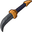
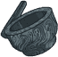
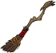
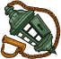
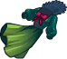
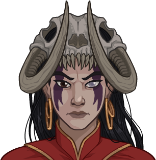
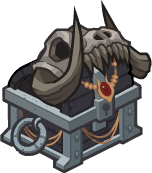

[Back to Main](index.md)

    
        
            
        
        
            Portrait
        
    
    
        
            
        
        
            Model
        
    

# Skylla

The evil magic user Skylla borrows her terrible power from none other than the infamous Arch-hag and Mother of Witches, Baba Yaga. An ally of convenience, Skylla lives only for the pursuit of power and acclaim, seeing even her fellow members of the League of Malevolence as tools to be used and discarded when it suits her needs. Skylla confounds her foes with magical trickery, wielding the unpredictable chaos of the Feywild to hypnotize and incapacitate those who stand between her and her goals.

# Basic Information

Skylla will be a new champion in the Feast of the Moon event on 5 November 2025.

    
        
            **Seat**:
        
        
            4
        
        
            **Stat**
        
        
            **Value**
        
        
            **Day 1 Trials**
        
        
            **Patrons**
        
    
    
        
            **Species**:
        
        
            Human
        
        
            **Strength**:
        
        
            9
        
        
            Yes
        
        
            Mirt
        
    
    
        
            **Class**:
        
        
            Warlock
        
        
            **Dexterity**:
        
        
            11
        
        
            -
        
        
            Vajra
        
    
    
        
            **Roles**:
        
        
            Support / Debuff
        
        
            **Constitution**:
        
        
            14
        
        
            Yes
        
        
            -
        
    
    
        
            **Age**:
        
        
            32
        
        
            **Intelligence**:
        
        
            12
        
        
            Yes
        
        
            -
        
    
    
        
            **Gender**:
        
        
            Female
        
        
            **Wisdom**:
        
        
            15
        
        
            Yes
        
        
            Elminster
        
    
    
        
            **Alignment**:
        
        
            Chaotic Evil
        
        
            **Charisma**:
        
        
            17
        
        
            Yes
        
        
            &nbsp;
        
    
    
        
            **Affiliation**:
        
        
            -
        
        
            **Total**:
        
        
            78
        
        
            Champion ID:
        
        
            169
        
    

# Formation

    <svg xmlns="http://www.w3.org/2000/svg" id="Skylla" fill="#aaa" data-formationName="Skylla" data-campaignName="Feast of the Moon" width="338" height="160"><circle cx="175" cy="25" r="15"/><circle cx="175" cy="105" r="15"/><circle cx="135" cy="45" r="15"/><circle cx="135" cy="85" r="15"/><circle cx="95" cy="25" r="15"/><circle cx="95" cy="65" r="15"/><circle cx="95" cy="105" r="15"/><circle cx="95" cy="145" r="15"/><circle cx="55" cy="45" r="15"/><circle cx="15" cy="25" r="15"/><text x="205" y="25" fill="#dcdcdc" font-size="25" font-family="Arial" font-weight="bold">Skylla</text><text x="205" y="65" fill="#dcdcdc" font-size="15" font-family="Arial" font-weight="bold">Feast of the Moon</text></svg>

# Attacks

  **Base Attack: Eldritch Staff** (Melee / Magic)
> Skylla attacks a random enemy with her staff for one hit, and zaps another random enemy for 1 hit.  
> Cooldown: 4.5s (Cap 1.125s)

<em>Raw Data</em>

<pre>
{
    "id": 904,
    "name": "Eldritch Staff",
    "description": "Skylla attacks a random enemy with her staff for one hit, and zaps another random enemy for 1 hit.",
    "long_description": "",
    "graphic_id": 0,
    "target": "random",
    "num_targets": 1,
    "aoe_radius": 0,
    "damage_modifier": 1,
    "cooldown": 4.5,
    "animations": [
        {
            "type": "melee_attack",
            "special_melee": "skylla",
            "target_offset": [
                -200,
                0
            ],
            "seq_chargeloop": 1,
            "attack_sounds": {
                "melee": 179,
                "ranged": 184
            },
            "particle_names": [
                "Particle_Skylla_FaerieFireGreen1",
                "Particle_Skylla_FaerieFireGreen2"
            ],
            "lightning_graphic_ids": [
                13484,
                13485,
                13486
            ],
            "projectile_id": 13483
        }
    ],
    "tags": [
        "melee",
        "ranged"
    ],
    "damage_types": [
        "melee",
        "magic"
    ]
}
</pre>

  **Base Attack: Eldritch Staff** (Melee / Magic)
> Skylla attacks a random enemy with her staff for one hit, and zaps another random enemy for 1 hit.  
> Cooldown: 4.5s (Cap 1.125s)

<em>Raw Data</em>

<pre>
{
    "id": 906,
    "name": "Eldritch Staff",
    "description": "Skylla attacks a random enemy with her staff for one hit, and zaps another random enemy for 1 hit.",
    "long_description": "",
    "graphic_id": 0,
    "target": "random",
    "num_targets": 1,
    "aoe_radius": 0,
    "damage_modifier": 1,
    "cooldown": 4.5,
    "animations": [
        {
            "type": "melee_attack",
            "special_melee": "skylla",
            "target_offset": [
                -200,
                0
            ],
            "seq_chargeloop": 1,
            "attack_sounds": {
                "melee": 179,
                "ranged": 184
            },
            "particle_names": [
                "Particle_Skylla_FaerieFireBlue1",
                "Particle_Skylla_FaerieFireBlue2"
            ],
            "lightning_graphic_ids": [
                25593,
                25594,
                25595
            ],
            "projectile_id": 25592
        }
    ],
    "tags": [
        "melee",
        "ranged"
    ],
    "damage_types": [
        "melee",
        "magic"
    ]
}
</pre>

  **Base Attack: Eldritch Staff** (Melee / Magic)
> Skylla attacks a random enemy with her staff for 1 hit, and zaps another random enemy for 1 hit.  
> Cooldown: 4.5s (Cap 1.125s)

<em>Raw Data</em>

<pre>
{
    "id": 907,
    "name": "Eldritch Staff",
    "description": "Skylla attacks a random enemy with her staff for 1 hit, and zaps another random enemy for 1 hit.",
    "long_description": "",
    "graphic_id": 0,
    "target": "random",
    "num_targets": 1,
    "aoe_radius": 0,
    "damage_modifier": 1,
    "cooldown": 4.5,
    "animations": [
        {
            "type": "melee_attack",
            "special_melee": "skylla",
            "target_offset": [
                -200,
                0
            ],
            "seq_chargeloop": 1,
            "attack_sounds": {
                "melee": 179,
                "ranged": 184
            },
            "particle_names": [
                "Particle_Skylla_FaerieFirePurple1",
                "Particle_Skylla_FaerieFirePurple2"
            ],
            "lightning_graphic_ids": [
                27709,
                27710,
                27711
            ],
            "projectile_id": 27708
        }
    ],
    "tags": [
        "melee",
        "ranged"
    ],
    "damage_types": [
        "melee",
        "magic"
    ]
}
</pre>

 **Ultimate Attack: Hypnotic Pattern** (Level: 0)
> Skylla casts Hypnotic Pattern, making enemies take additional BUD-based damage from attacks for the duration. Additionally, enemies are stunned until they take damage.  
> Cooldown: 200s (Cap 50s)

<em>Raw Data</em>

<pre>
{
    "id": 908,
    "name": "Hypnotic Pattern",
    "description": "Skylla casts Hypnotic Pattern, making enemies take more damage from attacks and briefly stunning them.",
    "long_description": "Skylla casts Hypnotic Pattern, making enemies take additional BUD-based damage from attacks for the duration. Additionally, enemies are stunned until they take damage.",
    "graphic_id": 27680,
    "target": "none",
    "num_targets": 1,
    "aoe_radius": 0,
    "damage_modifier": 0.03,
    "cooldown": 200,
    "animations": [
        {
            "type": "ultimate_attack",
            "ultimate": "skylla",
            "animation_sequence_name": "ultimate"
        }
    ],
    "tags": [
        "magic",
        "ultimate"
    ],
    "damage_types": [
        "magic"
    ]
}
</pre>

# Abilities

 **Whispers of Baba Yaga** (Level: 30)
> Skylla increases the damage of all Champions in the column in front of her by 400% for each Champion affected by this ability, stacking multiplicatively.

<em>Upgrade Data</em>

<pre>
Upgrades:
       90: 100%
      130: 100%
      230: 100%
      300: 100%
      400: 100%
      490: 100%
      580: 100%
      670: 100%
      760: 100%
      840: 100%
      930: 100%
    1,020: 100%
    1,110: 100%
    1,200: 100%
    1,280: 100%
    1,370: 100%
    1,460: 100%
    1,550: 100%
    1,640: 100%
    1,710: 100%
    1,770: 100%

    Total Upgrade Bonus: 2.10e08%
</pre>

<em>Raw Data</em>

<pre>
{
    "id": 17845,
    "hero_id": 169,
    "required_level": 30,
    "required_upgrade_id": 0,
    "upgrade_type": "unlock_ability",
    "effect": "effect_def,2474",
    "static_dps_mult": null,
    "default_enabled": 1,
    "name": "Whispers of Baba Yaga",
    "tip_text": "Skylla increases the damage of Champions in the column in front of her, with the benefit increasing as the number of buffed Champions increases."
}
{
    "id": 2474,
    "flavour_text": "",
    "description": {
        "desc": "Skylla increases the damage of all Champions in the column in front of her by $(amount)% for each Champion affected by this ability, stacking multiplicatively."
    },
    "effect_keys": [
        {
            "effect_string": "pre_stack,400"
        },
        {
            "effect_string": "hero_dps_multiplier_mult,400",
            "amount_expr": "upgrade_amount(17845,0)",
            "off_when_benched": true,
            "stacks_multiply": true,
            "amount_func": "mult",
            "stack_func": "per_hero_attribute",
            "per_hero_expr": "HasEffectByID(2474)",
            "targets": [
                "next_col"
            ],
            "amount_updated_listeners": [
                "slot_changed"
            ],
            "show_bonus": true,
            "use_computed_amount_for_description": true
        }
    ],
    "requirements": "",
    "graphic_id": 27665,
    "large_graphic_id": 27670,
    "properties": {
        "is_formation_ability": true,
        "owner_use_outgoing_description": true,
        "indexed_effect_properties": true,
        "per_effect_index_bonuses": true,
        "default_bonus_index": 1
    }
}
{
    "id": 18035,
    "hero_id": 169,
    "required_level": 90,
    "required_upgrade_id": 0,
    "upgrade_type": "upgrade_ability",
    "effect": "buff_upgrade,100,17845,1",
    "static_dps_mult": null,
    "default_enabled": 1,
    "name": ""
}
{
    "id": 18176,
    "hero_id": 169,
    "required_level": 130,
    "required_upgrade_id": 0,
    "upgrade_type": "upgrade_ability",
    "effect": "buff_upgrade,100,17845,1",
    "static_dps_mult": null,
    "default_enabled": 1,
    "name": ""
}
{
    "id": 18182,
    "hero_id": 169,
    "required_level": 230,
    "required_upgrade_id": 0,
    "upgrade_type": "upgrade_ability",
    "effect": "buff_upgrade,100,17845,1",
    "static_dps_mult": null,
    "default_enabled": 1,
    "name": ""
}
{
    "id": 18186,
    "hero_id": 169,
    "required_level": 300,
    "required_upgrade_id": 0,
    "upgrade_type": "upgrade_ability",
    "effect": "buff_upgrade,100,17845,1",
    "static_dps_mult": null,
    "default_enabled": 1,
    "name": ""
}
{
    "id": 18191,
    "hero_id": 169,
    "required_level": 400,
    "required_upgrade_id": 0,
    "upgrade_type": "upgrade_ability",
    "effect": "buff_upgrade,100,17845,1",
    "static_dps_mult": null,
    "default_enabled": 1,
    "name": ""
}
{
    "id": 18196,
    "hero_id": 169,
    "required_level": 490,
    "required_upgrade_id": 0,
    "upgrade_type": "upgrade_ability",
    "effect": "buff_upgrade,100,17845,1",
    "static_dps_mult": null,
    "default_enabled": 1,
    "name": ""
}
{
    "id": 18199,
    "hero_id": 169,
    "required_level": 580,
    "required_upgrade_id": 0,
    "upgrade_type": "upgrade_ability",
    "effect": "buff_upgrade,100,17845,1",
    "static_dps_mult": null,
    "default_enabled": 1,
    "name": ""
}
{
    "id": 18203,
    "hero_id": 169,
    "required_level": 670,
    "required_upgrade_id": 0,
    "upgrade_type": "upgrade_ability",
    "effect": "buff_upgrade,100,17845,1",
    "static_dps_mult": null,
    "default_enabled": 1,
    "name": ""
}
{
    "id": 18205,
    "hero_id": 169,
    "required_level": 760,
    "required_upgrade_id": 0,
    "upgrade_type": "upgrade_ability",
    "effect": "buff_upgrade,100,17845,1",
    "static_dps_mult": null,
    "default_enabled": 1,
    "name": ""
}
{
    "id": 18209,
    "hero_id": 169,
    "required_level": 840,
    "required_upgrade_id": 0,
    "upgrade_type": "upgrade_ability",
    "effect": "buff_upgrade,100,17845,1",
    "static_dps_mult": null,
    "default_enabled": 1,
    "name": ""
}
{
    "id": 18213,
    "hero_id": 169,
    "required_level": 930,
    "required_upgrade_id": 0,
    "upgrade_type": "upgrade_ability",
    "effect": "buff_upgrade,100,17845,1",
    "static_dps_mult": null,
    "default_enabled": 1,
    "name": ""
}
{
    "id": 18215,
    "hero_id": 169,
    "required_level": 1020,
    "required_upgrade_id": 0,
    "upgrade_type": "upgrade_ability",
    "effect": "buff_upgrade,100,17845,1",
    "static_dps_mult": null,
    "default_enabled": 1,
    "name": ""
}
{
    "id": 18219,
    "hero_id": 169,
    "required_level": 1110,
    "required_upgrade_id": 0,
    "upgrade_type": "upgrade_ability",
    "effect": "buff_upgrade,100,17845,1",
    "static_dps_mult": null,
    "default_enabled": 1,
    "name": ""
}
{
    "id": 18222,
    "hero_id": 169,
    "required_level": 1200,
    "required_upgrade_id": 0,
    "upgrade_type": "upgrade_ability",
    "effect": "buff_upgrade,100,17845,1",
    "static_dps_mult": null,
    "default_enabled": 1,
    "name": ""
}
{
    "id": 18224,
    "hero_id": 169,
    "required_level": 1280,
    "required_upgrade_id": 0,
    "upgrade_type": "upgrade_ability",
    "effect": "buff_upgrade,100,17845,1",
    "static_dps_mult": null,
    "default_enabled": 1,
    "name": ""
}
{
    "id": 18226,
    "hero_id": 169,
    "required_level": 1370,
    "required_upgrade_id": 0,
    "upgrade_type": "upgrade_ability",
    "effect": "buff_upgrade,100,17845,1",
    "static_dps_mult": null,
    "default_enabled": 1,
    "name": ""
}
{
    "id": 18229,
    "hero_id": 169,
    "required_level": 1460,
    "required_upgrade_id": 0,
    "upgrade_type": "upgrade_ability",
    "effect": "buff_upgrade,100,17845,1",
    "static_dps_mult": null,
    "default_enabled": 1,
    "name": ""
}
{
    "id": 18230,
    "hero_id": 169,
    "required_level": 1550,
    "required_upgrade_id": 0,
    "upgrade_type": "upgrade_ability",
    "effect": "buff_upgrade,100,17845,1",
    "static_dps_mult": null,
    "default_enabled": 1,
    "name": ""
}
{
    "id": 18232,
    "hero_id": 169,
    "required_level": 1640,
    "required_upgrade_id": 0,
    "upgrade_type": "upgrade_ability",
    "effect": "buff_upgrade,100,17845,1",
    "static_dps_mult": null,
    "default_enabled": 1,
    "name": ""
}
{
    "id": 18234,
    "hero_id": 169,
    "required_level": 1710,
    "required_upgrade_id": 0,
    "upgrade_type": "upgrade_ability",
    "effect": "buff_upgrade,100,17845,1",
    "static_dps_mult": null,
    "default_enabled": 1,
    "name": ""
}
{
    "id": 18238,
    "hero_id": 169,
    "required_level": 1770,
    "required_upgrade_id": 0,
    "upgrade_type": "upgrade_ability",
    "effect": "buff_upgrade,100,17845,1",
    "static_dps_mult": null,
    "default_enabled": 1,
    "name": ""
}
</pre>

 **Faerie Fire** (Level: 70)
> When Skylla attacks an enemy but doesn't defeat it, she casts Faerie Fire on it. Champions deal 100% additional damage to enemies affected by Faerie Fire.

<em>Raw Data</em>

<pre>
{
    "id": 17846,
    "hero_id": 169,
    "required_level": 70,
    "required_upgrade_id": 0,
    "upgrade_type": "unlock_ability",
    "effect": "effect_def,2475",
    "static_dps_mult": null,
    "default_enabled": 1,
    "name": "Faerie Fire",
    "tip_text": "Skylla casts Faerie Fire on foes she attacks and can't defeat, making them more vulnerable to subsequent attacks."
}
{
    "id": 2475,
    "flavour_text": "",
    "description": {
        "desc": "When Skylla attacks an enemy but doesn't defeat it, she casts Faerie Fire on it. Champions deal $amount% additional damage to enemies affected by Faerie Fire."
    },
    "effect_keys": [
        {
            "effect_string": "skylla_faerie_fire_handler,100",
            "off_when_benched": true,
            "faerie_fire_effect_key": "skylla_faerie_fire",
            "debuffing_attack_ids": [
                904,
                906,
                907
            ],
            "debuff_effects": [
                {
                    "effect_string": "increase_monster_damage,100",
                    "use_collection_source": true
                },
                {
                    "effect_string": "skylla_faerie_fire",
                    "force_is_debuff": false
                }
            ],
            "particle_names": [
                "Particle_Skylla_FaerieFireGreen1",
                "Particle_Skylla_FaerieFireGreen2"
            ],
            "tint_color": 0
        },
        {
            "effect_string": "expression_on_trigger,monster_killed_with_effect_key",
            "trigger_params": [
                "skylla_faerie_fire"
            ],
            "per_trigger_expr": "AppendToSaveStat(`skylla_enemies_affected_by_faerie_fire`, false, trigger_count)",
            "off_when_benched": true
        }
    ],
    "requirements": "",
    "graphic_id": 27668,
    "large_graphic_id": 27663,
    "properties": {
        "is_formation_ability": true,
        "owner_use_outgoing_description": true,
        "retain_on_slot_changed": true
    }
}
</pre>

 **Fae's Flicker** (Level: 150)
> Whenever an enemy that is debuffed by Faerie Fire is defeated, Skylla gains a Shimmer stack. Skylla increases the effect of Whispers of Baba Yaga by 100% for each Shimmer stack she has, stacking additively. Shimmer stacks persist for the entire adventure and reset when you complete it.

<em>Raw Data</em>

<pre>
{
    "id": 17847,
    "hero_id": 169,
    "required_level": 150,
    "required_upgrade_id": 0,
    "upgrade_type": "unlock_ability",
    "effect": "effect_def,2476",
    "static_dps_mult": null,
    "default_enabled": 1,
    "name": "Fae's Flicker"
}
{
    "id": 2476,
    "flavour_text": "",
    "description": {
        "desc": "Whenever an enemy that is debuffed by Faerie Fire is defeated, Skylla gains a Shimmer stack. Skylla increases the effect of Whispers of Baba Yaga by $(not_buffed amount)% for each Shimmer stack she has, stacking additively. Shimmer stacks persist for the entire adventure and reset when you complete it."
    },
    "effect_keys": [
        {
            "effect_string": "buff_upgrade,100,17845,1",
            "off_when_benched": true,
            "stacks_on_trigger": "monster_killed_with_effect_key,skylla_faerie_fire",
            "stacks_multiply": false,
            "stack_title": "Shimmer Stacks",
            "show_bonus": true
        },
        {
            "effect_string": "stacks_data_binder_safe",
            "index": 0,
            "stat_name": "skylla_shimmer_stacks",
            "is_instanced_stat": true,
            "use_stat_defs": true
        }
    ],
    "requirements": "",
    "graphic_id": 27669,
    "large_graphic_id": 27664,
    "properties": {
        "is_formation_ability": true,
        "owner_use_outgoing_description": true,
        "indexed_effect_properties": true,
        "per_effect_index_bonuses": true,
        "default_bonus_index": 0
    }
}
</pre>

 **Hypnotic Pattern** (Level: 170)
> Skylla creates a twisting pattern of colors above the enemies for 15 seconds. All enemies take 5 seconds of BUD-based damage when hit by any Champion for the duration. Additionally, all enemies, including any that spawn, are Stunned for the duration or until they take damage, whichever is shorter.

<em>Raw Data</em>

<pre>
{
    "id": 17978,
    "hero_id": 169,
    "required_level": 170,
    "required_upgrade_id": 0,
    "upgrade_type": "unlock_ultimate",
    "effect": "effect_def,2488",
    "static_dps_mult": null,
    "default_enabled": 1,
    "name": "Hypnotic Pattern"
}
{
    "id": 2488,
    "flavour_text": "",
    "description": {
        "desc": "Skylla creates a twisting pattern of colors above the enemies for 15 seconds. All enemies take 5 seconds of BUD-based damage when hit by any Champion for the duration. Additionally, all enemies, including any that spawn, are Stunned for the duration or until they take damage, whichever is shorter."
    },
    "effect_keys": [
        {
            "effect_string": "set_ultimate_attack,908"
        },
        {
            "effect_string": "skylla_hypnotic_pattern_handler",
            "off_when_benched": true
        },
        {
            "effect_string": "base_attack_deal_bonus_damage,5",
            "targets": [
                "all"
            ],
            "apply_manually": true,
            "buff_targets_instead_of_owner": true,
            "immediately_after_damage": true,
            "override_key_desc": "$target deals an extra 5 seconds of BUD-based damage"
        }
    ],
    "requirements": "",
    "graphic_id": 0,
    "large_graphic_id": 0,
    "properties": {
        "is_formation_ability": true,
        "owner_use_outgoing_description": true,
        "retain_on_slot_changed": true
    }
}
</pre>

# Specialisations

 **Witch's Switch** (Level: 110)
> Other Champions in the party have their ability scores switched: STR with CHA, DEX with INT, and CON with WIS. The effect of Whispers of Baba Yaga is increased by 100% each time the difference between the switched scores is 5 or more, stacking multiplicatively.

<em>Raw Data</em>

<pre>
{
    "id": 17848,
    "hero_id": 169,
    "required_level": 110,
    "required_upgrade_id": 0,
    "upgrade_type": "unlock_ability",
    "effect": "effect_def,2477",
    "static_dps_mult": null,
    "default_enabled": 1,
    "name": "Witch's Switch",
    "specialization_name": "Witch's Switch",
    "specialization_description": "The possibilities are nearly endless when you can reshape reality.",
    "specialization_graphic_id": 27678
}
{
    "id": 2477,
    "flavour_text": "",
    "description": {
        "desc": "Other Champions in the party have their ability scores switched: STR with CHA, DEX with INT, and CON with WIS. The effect of Whispers of Baba Yaga is increased by 100% each time the difference between the switched scores is 5 or more, stacking multiplicatively."
    },
    "effect_keys": [
        {
            "effect_string": "skylla_witch_switch_handler",
            "off_when_benched": true
        },
        {
            "effect_string": "buff_upgrade,100,17845,1",
            "off_when_benched": true,
            "amount_func": "mult",
            "stack_func": "per_hero_attribute",
            "per_hero_expr": "as_int(hero_id != 169) * (as_int(abs(GetStat(`str`) - GetStat(`cha`)) > 4) + as_int(abs(GetStat(`dex`) - GetStat(`int`)) > 4) + as_int(abs(GetStat(`con`) - GetStat(`wis`)) > 4))",
            "stacks_multiply": true,
            "show_bonus": true,
            "amount_updated_listeners": [
                "slot_changed"
            ]
        }
    ],
    "requirements": "",
    "graphic_id": 27678,
    "large_graphic_id": 27678,
    "properties": {
        "is_formation_ability": true,
        "owner_use_outgoing_description": true,
        "retain_on_slot_changed": true,
        "indexed_effect_properties": true,
        "per_effect_index_bonuses": true,
        "spec_option_post_apply_info": "Potential Stacks: $num_stacks___2",
        "default_bonus_index": 1
    }
}
</pre>

 **League of Malevolence** (Level: 110)
> Skylla increases the effect of Whispers of Baba Yaga by 100% for each evil Champion in the formation, stacking multiplicatively.

<em>Raw Data</em>

<pre>
{
    "id": 17849,
    "hero_id": 169,
    "required_level": 110,
    "required_upgrade_id": 0,
    "upgrade_type": "unlock_ability",
    "effect": "effect_def,2478",
    "static_dps_mult": null,
    "default_enabled": 1,
    "name": "League of Malevolence",
    "specialization_name": "League of Malevolence",
    "specialization_description": "The League of Malevolence is a cabal of odious villains united in one purpose: the accumulation of power.",
    "specialization_graphic_id": 27676
}
{
    "id": 2478,
    "flavour_text": "",
    "description": {
        "desc": "Skylla increases the effect of Whispers of Baba Yaga by $(not_buffed amount)% for each evil Champion in the formation, stacking multiplicatively."
    },
    "effect_keys": [
        {
            "effect_string": "buff_upgrade,100,17845",
            "off_when_benched": true,
            "amount_func": "mult",
            "stack_func": "per_hero_attribute",
            "per_hero_expr": "HasTag(`evil`)",
            "amount_updated_listeners": [
                "hero_tags_changed",
                "slot_changed"
            ],
            "show_bonus": true
        }
    ],
    "requirements": "",
    "graphic_id": 27676,
    "large_graphic_id": 27676,
    "properties": {
        "is_formation_ability": true,
        "owner_use_outgoing_description": true,
        "indexed_effect_properties": true,
        "per_effect_index_bonuses": true,
        "default_bonus_index": 0,
        "spec_option_post_apply_info": "Evil Champions: $num_stacks"
    }
}
</pre>

 **Withering Ward** (Level: 110)
> Increases the effect of Whispers of Baba Yaga by 33% for each debuff that has been applied to an enemy in the current area, stacking multiplicatively and capping at 50.

<em>Raw Data</em>

<pre>
{
    "id": 17850,
    "hero_id": 169,
    "required_level": 110,
    "required_upgrade_id": 0,
    "upgrade_type": "unlock_ability",
    "effect": "effect_def,2479",
    "static_dps_mult": null,
    "default_enabled": 1,
    "name": "Withering Ward",
    "specialization_name": "Withering Ward",
    "specialization_description": "Skylla draws power from the lifeforce of her opponents.",
    "specialization_graphic_id": 27679
}
{
    "id": 2479,
    "flavour_text": "",
    "description": {
        "desc": "Increases the effect of Whispers of Baba Yaga by $(not_buffed amount)% for each debuff that has been applied to an enemy in the current area, stacking multiplicatively and capping at $max_stacks."
    },
    "effect_keys": [
        {
            "effect_string": "buff_upgrade,33,17845,1",
            "off_when_benched": true,
            "stacks_on_trigger": "debuff_applied",
            "more_triggers": [
                {
                    "trigger": "area_changed",
                    "action": {
                        "type": "reset"
                    }
                }
            ],
            "stacks_multiply": true,
            "max_stacks": 50,
            "show_bonus": true
        }
    ],
    "requirements": "",
    "graphic_id": 27679,
    "large_graphic_id": 27679,
    "properties": {
        "is_formation_ability": true,
        "owner_use_outgoing_description": true
    }
}
</pre>

 **Green Fire** (Level: 200)
> Skylla's Faerie Fire remains green, but increases the effect of the debuff by 100%.

<em>Raw Data</em>

<pre>
{
    "id": 17851,
    "hero_id": 169,
    "required_level": 200,
    "required_upgrade_id": 0,
    "upgrade_type": "unlock_ability",
    "effect": "effect_def,2480",
    "static_dps_mult": null,
    "default_enabled": 1,
    "name": "Green Fire",
    "specialization_name": "Green Fire",
    "specialization_description": "Skylla increases the damage her opponents take when illuminated by her green Faerie Fire.",
    "specialization_graphic_id": 27675
}
{
    "id": 2480,
    "flavour_text": "",
    "description": {
        "desc": "Skylla's Faerie Fire remains green, but increases the effect of the debuff by $amount%."
    },
    "effect_keys": [
        {
            "effect_string": "buff_upgrade,100,17846",
            "off_when_benched": true
        }
    ],
    "requirements": "",
    "graphic_id": 27675,
    "large_graphic_id": 27675,
    "properties": {
        "is_formation_ability": true,
        "owner_use_outgoing_description": true
    }
}
</pre>

 **Blue Fire** (Level: 200)
> Skylla's Faerie Fire turns blue. Champions attacking enemies affected by Faerie Fire have a 40% additional chance to deal a critical hit.

<em>Raw Data</em>

<pre>
{
    "id": 17852,
    "hero_id": 169,
    "required_level": 200,
    "required_upgrade_id": 0,
    "upgrade_type": "unlock_ability",
    "effect": "effect_def,2481",
    "static_dps_mult": null,
    "default_enabled": 1,
    "name": "Blue Fire",
    "specialization_name": "Blue Fire",
    "specialization_description": "Skylla's Faerie Fire turns blue, leaving foes vulnerable to critical hits.",
    "specialization_graphic_id": 27674
}
{
    "id": 2481,
    "flavour_text": "",
    "description": {
        "desc": "Skylla's Faerie Fire turns blue. Champions attacking enemies affected by Faerie Fire have a $crit_hit_chance_desc% additional chance to deal a critical hit."
    },
    "effect_keys": [
        {
            "effect_string": "change_base_attack,906",
            "crit_hit_chance_desc": 40
        },
        {
            "effect_string": "change_upgrade_data,17846",
            "data": {
                "particle_names": [
                    "Particle_Skylla_FaerieFireBlue1",
                    "Particle_Skylla_FaerieFireBlue2"
                ],
                "tint_color": 1,
                "debuff_effects": [
                    {
                        "effect_string": "increase_monster_damage,100",
                        "use_collection_source": true
                    },
                    {
                        "effect_string": "skylla_faerie_fire",
                        "force_is_debuff": false
                    },
                    {
                        "effect_string": "buff_incoming_crit_chance_add,40",
                        "force_is_debuff": false
                    }
                ]
            }
        }
    ],
    "requirements": "",
    "graphic_id": 27674,
    "large_graphic_id": 27674,
    "properties": {
        "is_formation_ability": true,
        "owner_use_outgoing_description": true,
        "indexed_effect_properties": true,
        "per_effect_index_bonuses": true,
        "default_bonus_index": 0
    }
}
</pre>

 **Violet Fire** (Level: 200)
> Skylla gains the Breaker role and her Faerie Fire turns violet. Enemies affected by Faerie Fire lose an additional armor or segmented health piece when they are attacked and at least 1 segment was broken.

<em>Raw Data</em>

<pre>
{
    "id": 17853,
    "hero_id": 169,
    "required_level": 200,
    "required_upgrade_id": 0,
    "upgrade_type": "unlock_ability",
    "effect": "effect_def,2482",
    "static_dps_mult": null,
    "default_enabled": 1,
    "name": "Violet Fire",
    "specialization_name": "Violet Fire",
    "specialization_description": "Skylla's Faerie Fire turns violet, revealing flaws in the armor of her opponents.",
    "specialization_graphic_id": 27677
}
{
    "id": 2482,
    "flavour_text": "",
    "description": {
        "desc": "Skylla gains the Breaker role and her Faerie Fire turns violet. Enemies affected by Faerie Fire lose an additional armor or segmented health piece when they are attacked and at least 1 segment was broken."
    },
    "effect_keys": [
        {
            "effect_string": "change_base_attack,907"
        },
        {
            "effect_string": "change_upgrade_data,17846",
            "data": {
                "particle_names": [
                    "Particle_Skylla_FaerieFirePurple1",
                    "Particle_Skylla_FaerieFirePurple2"
                ],
                "tint_color": 2,
                "debuff_effects": [
                    {
                        "effect_string": "increase_monster_damage,100",
                        "use_collection_source": true
                    },
                    {
                        "effect_string": "skylla_faerie_fire",
                        "force_is_debuff": false
                    },
                    {
                        "effect_string": "increase_damage_on_armor_and_hits,1",
                        "force_is_debuff": false
                    }
                ]
            }
        },
        {
            "effect_string": "add_hero_tags,0,breaking"
        }
    ],
    "requirements": "",
    "graphic_id": 27677,
    "large_graphic_id": 27677,
    "properties": {
        "is_formation_ability": true,
        "owner_use_outgoing_description": true,
        "indexed_effect_properties": true,
        "per_effect_index_bonuses": true,
        "default_bonus_index": 0
    }
}
</pre>

# Items

    
        
            **Icons**
        
        
            **Slot**
        
        
            **Epic Name**
        
        
            **Effect**
        
    
    
        
            ID: 4010**Cursed Knife**The first cut is the deepest. I know.  All Champions damage +10%.<code>global_dps_multiplier_mult,10 allow_ge:false</code>ID: 4011**Crow Blade**I'll have your heart, one way or another.  All Champions damage +65%.<code>global_dps_multiplier_mult,65 allow_ge:false</code>ID: 4012**Eldritch Staff**My patron does not suffer fools.  All Champions damage +120%.<code>global_dps_multiplier_mult,120 allow_ge:false</code>ID: 4013**Staff of Commanding Charm**You'll make a fine servant. Now, say 'yes, mistress.' Good.  All Champions damage +230%.<code>global_dps_multiplier_mult,230 allow_ge:false</code>&nbsp;
        
        
            1
        
        
            Staff of Commanding Charm
        
        
            All Champions damage +230%.
        
    
    
        
            ID: 4014**Mercurial Mortar**It empties itself out if it disagrees with the recipe.  Increases the effect of Skylla's Whispers of Baba Yaga ability by 10%. (Prestack)<code>buff_upgrade,10,17845,0 allow_ge:false</code>ID: 4015**Hag's Bowl**Maiden's blood, mother's tears, and crone's bones. A fine brew, this will make.  Increases the effect of Skylla's Whispers of Baba Yaga ability by 30%. (Prestack)<code>buff_upgrade,30,17845,0 allow_ge:false</code>ID: 4016**Granny's Crystal Ball**It spins ever and on until I say the magic words.  Increases the effect of Skylla's Whispers of Baba Yaga ability by 50%. (Prestack)<code>buff_upgrade,50,17845,0 allow_ge:false</code>ID: 4017**Dancing Broom**A witch's best friend for traversing the night. Where shall I fly today?  Increases the effect of Skylla's Whispers of Baba Yaga ability by 100%. (Prestack)<code>buff_upgrade,100,17845,0 allow_ge:false</code>&nbsp;
        
        
            2
        
        
            Dancing Broom
        
        
            Increases the effect of Skylla's Whispers of Baba Yaga ability by 100%. (Prestack)
        
    
    
        
            ID: 4018**Rotten Components**What spell could I expect to cast with this rubbish?  Increases the effect of Skylla's Faerie Fire ability by 25%.<code>buff_upgrade,25,17846 allow_ge:false</code>ID: 4019**Glowing Components**A handful of foxfire blooms to reveal the unseen.  Increases the effect of Skylla's Faerie Fire ability by 87.5%.<code>buff_upgrade,87.5,17846 allow_ge:false</code>ID: 4020**Dazzling Components**Smoke and ash, fire and flash. I will craft for you a beautiful delusion.  Increases the effect of Skylla's Faerie Fire ability by 150%.<code>buff_upgrade,150,17846 allow_ge:false</code>ID: 4021**Luxury Components**I have everything I need to make your short life as miserable as possible.  Increases the effect of Skylla's Faerie Fire ability by 275%.<code>buff_upgrade,275,17846 allow_ge:false</code>&nbsp;
        
        
            3
        
        
            Luxury Components
        
        
            Increases the effect of Skylla's Faerie Fire ability by 275%.
        
    
    
        
            ID: 4022**Indecipherable Notes**These make no sense! No treats for you, Golmo!  Increases the effect of Skylla's Fae's Flicker ability by 25%.<code>buff_upgrade,25,17847 allow_ge:false</code>ID: 4023**Brilliant Diagrams**Mm, yes. I can make use of this. Well done, Golmo.  Increases the effect of Skylla's Fae's Flicker ability by 87.5%.<code>buff_upgrade,87.5,17847 allow_ge:false</code>ID: 4024**Enchanted Key**It turns for my hands, and mine alone.  Increases the effect of Skylla's Fae's Flicker ability by 150%.<code>buff_upgrade,150,17847 allow_ge:false</code>ID: 4025**Gaolantern**Useful for imprisoning tiny creatures to bend to my will.  Increases the effect of Skylla's Fae's Flicker ability by 275%.<code>buff_upgrade,275,17847 allow_ge:false</code>&nbsp;
        
        
            4
        
        
            Gaolantern
        
        
            Increases the effect of Skylla's Fae's Flicker ability by 275%.
        
    
    
        
            ID: 4026**Garish Boots**These are suited only for an understudy.  Increases the effect of Skylla's first set of Specializations by 25%.<code>buff_upgrades,25,17848,17849,17850 allow_ge:false</code>ID: 4027**Sublime Boots**If I'm stepping onto the stage, I'll be stepping out in style.  Increases the effect of Skylla's first set of Specializations by 87.5%.<code>buff_upgrades,87.5,17848,17849,17850 allow_ge:false</code>ID: 4028**Charmay's Gown**All eyes on me - or else.  Increases the effect of Skylla's first set of Specializations by 150%.<code>buff_upgrades,150,17848,17849,17850 allow_ge:false</code>ID: 4029**Lament**A fan is a must for a woman with secrets, and I have so many...  Increases the effect of Skylla's first set of Specializations by 275%.<code>buff_upgrades,275,17848,17849,17850 allow_ge:false</code>&nbsp;
        
        
            5
        
        
            Lament
        
        
            Increases the effect of Skylla's first set of Specializations by 275%.
        
    
    
        
            ID: 4030**Threadbare Rags**I am no seamstress. These are dead to me.  Reduces the cooldown on Skylla's Ultimate Attack by 5 seconds.<code>reduce_ultimate_cooldown,5 allow_ge:false</code>ID: 4031**Witch's Robe**The style, colors, and cut are all subject to my whim.  Reduces the cooldown on Skylla's Ultimate Attack by 10 seconds.<code>reduce_ultimate_cooldown,10 allow_ge:false</code>ID: 4032**Gloaming Amulet**I channel the powers of mischief and murk.  Reduces the cooldown on Skylla's Ultimate Attack by 20 seconds.<code>reduce_ultimate_cooldown,20 allow_ge:false</code>ID: 4033**Crown of the Bone Mother**A gift from granny. It burns away unnecessary things.  Reduces the cooldown on Skylla's Ultimate Attack by 50 seconds.<code>reduce_ultimate_cooldown,50 allow_ge:false</code>&nbsp;
        
        
            6
        
        
            Crown of the Bone Mother
        
        
            Reduces the cooldown on Skylla's Ultimate Attack by 50 seconds. Cap: 501 dull / 251 shiny / 126 golden.
        
    

<em>Item Names and Descriptions</em>

<pre>
Slot 1:
             Cursed Knife: The first cut is the deepest. I know.
               Crow Blade: I'll have your heart, one way or another.
           Eldritch Staff: My patron does not suffer fools.
Staff of Commanding Charm: You'll make a fine servant. Now, say 'yes, mistress.' Good.

Slot 2:
         Mercurial Mortar: It empties itself out if it disagrees with the recipe.
               Hag's Bowl: Maiden's blood, mother's tears, and crone's bones. A fine brew, this
                           will make.
    Granny's Crystal Ball: It spins ever and on until I say the magic words.
            Dancing Broom: A witch's best friend for traversing the night. Where shall I fly
                           today?

Slot 3:
        Rotten Components: What spell could I expect to cast with this rubbish?
       Glowing Components: A handful of foxfire blooms to reveal the unseen.
      Dazzling Components: Smoke and ash, fire and flash. I will craft for you a beautiful
                           delusion.
        Luxury Components: I have everything I need to make your short life as miserable as
                           possible.

Slot 4:
     Indecipherable Notes: These make no sense! No treats for you, Golmo!
       Brilliant Diagrams: Mm, yes. I can make use of this. Well done, Golmo.
            Enchanted Key: It turns for my hands, and mine alone.
               Gaolantern: Useful for imprisoning tiny creatures to bend to my will.

Slot 5:
             Garish Boots: These are suited only for an understudy.
            Sublime Boots: If I'm stepping onto the stage, I'll be stepping out in style.
           Charmay's Gown: All eyes on me - or else.
                   Lament: A fan is a must for a woman with secrets, and I have so many...

Slot 6:
          Threadbare Rags: I am no seamstress. These are dead to me.
             Witch's Robe: The style, colors, and cut are all subject to my whim.
          Gloaming Amulet: I channel the powers of mischief and murk.
 Crown of the Bone Mother: A gift from granny. It burns away unnecessary things.
</pre>

 

# Feats

This list will only show feats that are going to be available on the release of this champion. The separate [Feats](feats.md) page may show others that could be available later if they exist.

    
        
            **Feat**
        
        
            **Effect**
        
        
            **Source**
        
    
    
        
            ID: 2336**Selflessness (Skylla)**Good servants may keep their free will. Is that not selfless?<code>global_dps_multiplier_mult,10</code>Selflessness
        
        
            All Champions damage +10%.
        
        
            Free
        
    
    
        
            ID: 2337**Inspiring Leader (Skylla)**I promise power and riches to those who serve me well.<code>global_dps_multiplier_mult,25</code>Inspiring Leader
        
        
            All Champions damage +25%.
        
        
            Gold Chest
        
    
    
        
            ID: 2338**Dissonant Whispers (Skylla)**Do you hear her? At the edges of your mind?<code>buff_upgrade,40,17845,0</code>Dissonant Whispers
        
        
            Increases the effect of Skylla's Whispers of Baba Yaga ability by 40%. (Prestack)
        
        
            12,500 Gems
        
    
    
        
            ID: 2339**Whispers of the Grave (Skylla)**When all the life has left you, only her laughter will remain.<code>buff_upgrade,80,17845,0</code>Whispers of the Grave
        
        
            Increases the effect of Skylla's Whispers of Baba Yaga ability by 80%. (Prestack)
        
        
            3,830 Platinum 50,000 Gems
        
    
    
        
            ID: 2340**Flickering Fire (Skylla)**There you are...<code>buff_upgrade,20,17846</code>Flickering Fire
        
        
            Increases the effect of Skylla's Faerie Fire ability by 20%.
        
        
            Free
        
    
    
        
            ID: 2341**Focused Fire (Skylla)**There is no escape.<code>buff_upgrade,40,17846</code>Focused Fire
        
        
            Increases the effect of Skylla's Faerie Fire ability by 40%.
        
        
            Gold Chest
        
    
    
        
            ID: 2342**Hag's Apprentice (Skylla)**I watch. I yearn.<code>buff_upgrade,20,17847</code>Hag's Apprentice
        
        
            Increases the effect of Skylla's Fae's Flicker ability by 20%.
        
        
            Free
        
    
    
        
            ID: 2343**Hag's Disciple (Skylla)**I listen. I learn.<code>buff_upgrade,40,17847</code>Hag's Disciple
        
        
            Increases the effect of Skylla's Fae's Flicker ability by 40%.
        
        
            12,500 Gems
        
    
    
        
            ID: 2344**Hag's Pride (Skylla)**I know. They burn.<code>buff_upgrade,80,17847</code>Hag's Pride
        
        
            Increases the effect of Skylla's Fae's Flicker ability by 80%.
        
        
            Event Bonus
        
    
    
        
            ID: 2345**Toil (Skylla)**Just where am I supposed to find baboon's blood at this hour?<code>buff_upgrades,20,17848,17849,17850</code>Toil
        
        
            Increases the effect of Skylla's first set of Specializations by 20%.
        
        
            Free
        
    
    
        
            ID: 2346**Trouble (Skylla)**Now the charm is firm and good. Time for some fun.<code>buff_upgrades,40,17848,17849,17850</code>Trouble
        
        
            Increases the effect of Skylla's first set of Specializations by 40%.
        
        
            12,500 Gems
        
    

# Legendaries

* Increases the damage of all Champions by 100%.
* Increases the damage of all Champions by 20% for each Female Champion in the formation.
* Increases the damage of all Champions by 30% for each Human Champion in the formation.
* Increases the damage of all Champions with a CHA score of 13 or higher by 150%.
* Increases the damage of all Champions by 30% for each Champion with a WIS score of 13 or higher in the formation.
* Increases the damage of all Evil Champions by 150%.

<em>DPS Applicable</em>

<pre>
         Arkhan: 6 / 6
        Artemis: 6 / 6
        Asharra: 5 / 6
          Azaka: 5 / 6
         Binwin: 5 / 6
       Birdsong: 5 / 6
    Black Viper: 5 / 6
          Bobby: 4 / 6
     Catti-brie: 5 / 6
         Cazrin: 5 / 6
         D'hani: 4 / 6
      Dark Urge: 6 / 6
         Delina: 5 / 6
        Dhadius: 4 / 6
         Drizzt: 4 / 6
        Farideh: 5 / 6
            Fen: 6 / 6
          Grimm: 5 / 6
         Gromma: 5 / 6
        Jaheira: 5 / 6
        Jamilah: 5 / 6
            Jim: 5 / 6
            Kas: 6 / 6
King of Shadows: 6 / 6
          Krond: 5 / 6
        Lae'zel: 5 / 6
         Lucius: 5 / 6
          Makos: 6 / 6
          Minsc: 4 / 6
          NERDS: 4 / 6
         Nahara: 5 / 6
          Nixie: 5 / 6
         Orisha: 5 / 6
       Prudence: 6 / 6
          Rosie: 5 / 6
          Strix: 5 / 6
        Torogar: 6 / 6
         Warden: 6 / 6
        Warduke: 5 / 6
       Windfall: 6 / 6
           Wren: 5 / 6
         Yorven: 4 / 6
          Zorbu: 5 / 6
</pre>

<em>Non-DPS Applicable</em>

<pre>
          Aeon: 6 / 6
          Aila: 4 / 6
       Alyndra: 4 / 6
      Astarion: 5 / 6
         Avren: 5 / 6
          BBEG: 5 / 6
       Baldric: 5 / 6
      Barrowin: 4 / 6
        Beadle: 4 / 6
       Blooshi: 6 / 6
          Brig: 5 / 6
          Briv: 5 / 6
       Bruenor: 4 / 6
      Calliope: 5 / 6
       Celeste: 4 / 6
     Certainty: 5 / 6
       Corazón: 5 / 6
        Deekin: 5 / 6
         Diana: 4 / 6
           Dob: 5 / 6
        Donaar: 5 / 6
    Dragonbait: 5 / 6
Dungeon Master: 5 / 6
      Dynaheir: 4 / 6
        Egbert: 5 / 6
      Ellywick: 5 / 6
       Evandra: 4 / 6
        Evelyn: 5 / 6
     Ezmerelda: 5 / 6
        Freely: 5 / 6
          Gale: 4 / 6
       Gazrick: 5 / 6
        Halsin: 5 / 6
          Hank: 4 / 6
       Havilar: 4 / 6
      Hew Maan: 6 / 6
         Hitch: 5 / 6
         Imoen: 5 / 6
      Jang Sao: 4 / 6
      K'thriss: 5 / 6
         Kalix: 5 / 6
         Korth: 5 / 6
         Krull: 5 / 6
        Krydle: 5 / 6
       Lazaapz: 5 / 6
         Mehen: 5 / 6
          Melf: 4 / 6
      Merilwen: 4 / 6
      Minthara: 6 / 6
         Miria: 5 / 6
        Môrgæn: 4 / 6
        Nayeli: 5 / 6
         Nerys: 5 / 6
        Nordom: 4 / 6
          Nova: 5 / 6
         Nrakk: 4 / 6
          Omin: 4 / 6
        Orkira: 5 / 6
      Penelope: 5 / 6
        Presto: 5 / 6
         Pwent: 4 / 6
        Qillek: 5 / 6
     Ravengard: 5 / 6
         Regis: 5 / 6
          Reya: 5 / 6
          Rust: 5 / 6
        Selise: 5 / 6
     Sgt. Knox: 5 / 6
   Shadowheart: 4 / 6
         Shaka: 5 / 6
       Shandie: 5 / 6
        Sheila: 4 / 6
      Sisaspia: 6 / 6
        Skylla: 6 / 6
        Solaak: 5 / 6
         Spurt: 5 / 6
   Strongheart: 5 / 6
         Talin: 5 / 6
       Tatyana: 4 / 6
          Tess: 5 / 6
      Thellora: 5 / 6
        Turiel: 5 / 6
         Tyril: 5 / 6
       Ulkoria: 5 / 6
       Umberto: 5 / 6
         Uriah: 5 / 6
     Valentine: 5 / 6
            Vi: 4 / 6
       Viconia: 6 / 6
      Vin Ursa: 5 / 6
        Virgil: 5 / 6
       Vlahnya: 5 / 6
      Vlithryn: 4 / 6
          Volo: 5 / 6
      Voronika: 6 / 6
        Walnut: 4 / 6
        Widdle: 4 / 6
       Wulfgar: 5 / 6
          Wyll: 5 / 6
        Xander: 4 / 6
      Xerophon: 5 / 6
</pre>

 

# Adventures and Variants

**Unlock Adventure: The Crypt of Legends (Skylla)** (Complete Area 50)
> Pay respects to the heroes of olde during the Feast of the Moon.

 **Variant 1: Whispers of the Warlock** (Complete Area 75)
> Skylla starts in the formation with her Whispers of Baba Yaga ability unlocked. She can be moved, but not removed.  
> Only Skylla and Champions affected by her Whispers of Baba Yaga ability can deal damage.  
> <b>Getting to Know Skylla:</b> Skylla increases the damage of Champions in the column in front of her, and her buff grows stronger the more Champions it affects. Put her behind the longest column buffing your best damage dealer!

 **Variant 2: Nocturli** (Complete Area 125)
> Skylla starts in the formation. She can be moved, but not removed.  
> After area 50, enemies without a Debuff on them take only 1 damage from normal attacks.  
> Two animated constructs join the formation. Champions next to these constructs attack 1 second faster.  
> <b>Getting to Know Skylla:</b> When Skylla attacks and fails to defeat her enemy, she casts Faerie Fire on it, making it easier to damage with subsequent attacks. Use her and other debuff Champions to get through these resistant foes!

 **Variant 3: Twist of Fate** (Complete Area 175)
> Skylla starts in the formation. She can be moved, but not removed.  
> You may only use Debuff Champions, Evil Champions, or Champions with large differences in the ability scores that Skylla switches.  
> <b>Getting to Know Skylla:</b> One of Skylla's specialization choices swaps the ability scores of Champions in the formation, and increases her buff when the ability scores differ by a  large number. You might find some interesting interactions with Champions that care about ability score thresholds!

# Other Champion Images

    
        
            Console Portrait
        
    
    
        
            Gold Chest Icon
        
        
            Silver Chest Icon
        
    

[Back to Top](#top)

*Last Modified: {{ site.time }}*