[Back to Main](index.md)

    
        
            
        
        
            Portrait
        
    
    
        
            
        
        
            Model
        
    

# Tasslehoff Burrfoot

Excitable, friendly, and insatiably curious, Tasslehoff Burrfoot is a kender of no small renown. Tas is the beating heart of the Heroes of the Lance, and his knack for 'borrowing' somehow manages to solve more problems than it causes. While Tas may not see himself as a hero, he is fearless in the face of Krynn's greatest dangers, and he always comes to the aid of his friends.

# Basic Information

Tasslehoff Burrfoot will be a new champion in the Festival of Fools event on 1 April 2026.

    
        
            **Seat**:
        
        
            11
        
        
            **Stat**
        
        
            **Value**
        
        
            **Day 1 Trials**
        
        
            **Patrons**
        
    
    
        
            **Species**:
        
        
            Kender
        
        
            **Strength**:
        
        
            13
        
        
            Yes
        
        
            Mirt
        
    
    
        
            **Class**:
        
        
            Rogue
        
        
            **Dexterity**:
        
        
            16
        
        
            Yes
        
        
            Vajra
        
    
    
        
            **Roles**:
        
        
            Support / Speed
        
        
            **Constitution**:
        
        
            14
        
        
            Yes
        
        
            Strahd (with Feat)
        
    
    
        
            **Age**:
        
        
            38
        
        
            **Intelligence**:
        
        
            11
        
        
            Yes
        
        
            Zariel (with Feat)
        
    
    
        
            **Gender**:
        
        
            Male
        
        
            **Wisdom**:
        
        
            15
        
        
            Yes
        
        
            Elminster
        
    
    
        
            **Alignment**:
        
        
            Neutral Good
        
        
            **Charisma**:
        
        
            11
        
        
            Yes
        
        
            &nbsp;
        
    
    
        
            **Affiliation**:
        
        
            Heroes of the Lance
        
        
            **Total**:
        
        
            80
        
        
            Champion ID:
        
        
            174
        
    

# Formation

    <svg xmlns="http://www.w3.org/2000/svg" id="Tasslehoff" fill="#aaa" data-formationName="Tasslehoff" data-campaignName="Festival of Fools" width="294" height="160"><circle cx="135" cy="85" r="15"/><circle cx="135" cy="125" r="15"/><circle cx="95" cy="25" r="15"/><circle cx="95" cy="65" r="15"/><circle cx="95" cy="105" r="15"/><circle cx="95" cy="145" r="15"/><circle cx="55" cy="45" r="15"/><circle cx="55" cy="85" r="15"/><circle cx="55" cy="125" r="15"/><circle cx="15" cy="65" r="15"/><text x="165" y="25" fill="#dcdcdc" font-size="25" font-family="Arial" font-weight="bold">Tasslehoff</text><text x="165" y="65" fill="#dcdcdc" font-size="15" font-family="Arial" font-weight="bold">Festival of Fools</text></svg>

# Attacks

 **Base Attack: Hoopak** (Ranged)
> Tasslehoff fires a stone at the closest enemy, dealing one hit.  
> Cooldown: 3.5s (Cap 0.875s)

<em>Raw Data</em>

<pre>
{
    "id": 960,
    "name": "Hoopak",
    "description": "Tasslehoff fires a stone at the closest enemy, dealing one hit.",
    "long_description": "",
    "graphic_id": 0,
    "target": "front",
    "num_targets": 1,
    "aoe_radius": 0,
    "damage_modifier": 1,
    "cooldown": 3.5,
    "animations": [
        {
            "type": "ranged_attack",
            "projectile": "pd_generic_projectile",
            "shoot_offset_x": 48,
            "shoot_offset_y": -65,
            "shoot_frame": 31,
            "shoot_sound": 149,
            "hit_sound": 133,
            "projectile_details": {
                "hash": "hoopak",
                "projectile_speed": 1500,
                "rotation_speed": 467,
                "percent_height_offset": 12,
                "projectile_graphic_id": 28671,
                "__projectile_hit_graphic_id": 750,
                "trail": {
                    "lifespan": 0.2,
                    "spawn_rate": 367,
                    "particle_graphic_ids": [
                        12485
                    ],
                    "initial_velocity": {
                        "x": "0",
                        "y": "0"
                    },
                    "velocity_jitter": {
                        "x": "50",
                        "y": "50"
                    },
                    "alpha_lerp": {
                        "0": 0,
                        "0.1": 0.75,
                        "1": 0
                    },
                    "scale_lerp": [
                        {
                            "x": 0.25,
                            "y": 0.25
                        },
                        {
                            "x": 0,
                            "y": 0
                        }
                    ],
                    "tint": {
                        "r": 1,
                        "g": 1,
                        "b": 1,
                        "a": 1
                    }
                }
            }
        }
    ],
    "tags": [
        "ranged"
    ],
    "damage_types": [
        "ranged"
    ]
}
</pre>

 **Ultimate Attack: I'm Not the Hero** (Level: 0)
> Tasslehoff encourages the next Champion to use their ultimate to deal 400% more damage with that ultimate.  
> Cooldown: 120s (Cap 30s)

<em>Raw Data</em>

<pre>
{
    "id": 961,
    "name": "I'm Not the Hero",
    "description": "Tasslehoff causes the next ultimate used to deal 400% more damage with that ultimate.",
    "long_description": "Tasslehoff encourages the next Champion to use their ultimate to deal 400% more damage with that ultimate.",
    "graphic_id": 28640,
    "target": "none",
    "num_targets": 1,
    "aoe_radius": 0,
    "damage_modifier": 1,
    "cooldown": 120,
    "animations": [
        {
            "type": "tasslehoff_ultimate",
            "no_damage_display": true,
            "jump_pos": [
                50,
                680
            ]
        }
    ],
    "tags": [
        "ultimate"
    ],
    "damage_types": [
        "magic"
    ]
}
</pre>

# Abilities

**Fearless** (Level: 0)
> Tasslehoff is immune to being Stunned.

<em>Raw Data</em>

<pre>
{
    "id": 19246,
    "hero_id": 174,
    "required_level": 0,
    "required_upgrade_id": 0,
    "upgrade_type": "unlock_ability",
    "effect": "effect_def,2642",
    "static_dps_mult": null,
    "default_enabled": 1,
    "name": "Fearless"
}
{
    "id": 2642,
    "flavour_text": "",
    "description": {
        "desc": "Tasslehoff is immune to being Stunned."
    },
    "effect_keys": [
        {
            "effect_string": "hero_stun_immunity",
            "off_when_benched": true
        }
    ],
    "requirements": "",
    "graphic_id": 0,
    "large_graphic_id": 0,
    "properties": {
        "is_formation_ability": true,
        "owner_use_outgoing_description": true,
        "formation_circle_icon": false
    }
}
</pre>

 **Diversion** (Level: 60)
> Tasslehoff prevents any Champion-sourced non-healing positional formation abilities from targeting his slot or adjacent slots. For each prevented ability per slot, he gains a Diversion stack. Tasslehoff increases the effect of his Map Collector specialization by 10% for each Diversion stack, stacking multiplicatively.

ⓘ *Note: This ability is prestack.*

<em>Raw Data</em>

<pre>
{
    "id": 19245,
    "hero_id": 174,
    "required_level": 60,
    "required_upgrade_id": 0,
    "upgrade_type": "unlock_ability",
    "effect": "effect_def,2643",
    "static_dps_mult": null,
    "default_enabled": 1,
    "name": "Diversion",
    "tip_text": "Tasslehoff prevents non-healing positional formation abilities from buffing his slot and adjacent slots, but his buff grows stronger for each instance this occurs."
}
{
    "id": 2643,
    "flavour_text": "",
    "description": {
        "desc": "Tasslehoff prevents any Champion-sourced non-healing positional formation abilities from targeting his slot or adjacent slots. For each prevented ability per slot, he gains a Diversion stack. Tasslehoff increases the effect of his Map Collector specialization by $amount% for each Diversion stack, stacking multiplicatively."
    },
    "effect_keys": [
        {
            "effect_string": "pre_stack,10"
        },
        {
            "effect_string": "buff_upgrades,0,19240,19241,19242",
            "amount_expr": "upgrade_amount(19245,0)",
            "stacks_on_trigger": "will_stack_manually",
            "stacks_multiply": true,
            "show_bonus": true,
            "off_when_benched": true,
            "stack_title": "Blocked Abilities"
        },
        {
            "effect_string": "tasslehoff_diversion",
            "buff_effect_key_index": 1,
            "overlay": {
                "manual_graphic": "tasslehoff_diversion",
                "y": -40
            },
            "off_when_benched": true
        }
    ],
    "requirements": "",
    "graphic_id": 28632,
    "large_graphic_id": 28629,
    "properties": {
        "is_formation_ability": true,
        "is_positional_ability": true,
        "owner_use_outgoing_description": true,
        "formation_circle_icon": true,
        "indexed_effect_properties": true,
        "per_effect_index_bonuses": true,
        "default_bonus_index": 0
    }
}
</pre>

 **Borrower** (Level: 90)
> Each time the party completes an area, Tasslehoff somehow comes into possession of some future quest items, setting his Found Item stacks to 7. When Tasslehoff attacks an enemy that can drop quest items, there is a 10% chance he spends a Found Item stack and adds a quest item to the party's quest progress.

<em>Raw Data</em>

<pre>
{
    "id": 19244,
    "hero_id": 174,
    "required_level": 90,
    "required_upgrade_id": 0,
    "upgrade_type": "unlock_ability",
    "effect": "effect_def,2644",
    "static_dps_mult": null,
    "default_enabled": 1,
    "name": "Borrower",
    "tip_text": "In areas requiring quest items, Tasslehoff will sometimes find a quest item when he attacks."
}
{
    "id": 2644,
    "flavour_text": "",
    "description": {
        "desc": "Each time the party completes an area, Tasslehoff somehow comes into possession of some future quest items, setting his Found Item stacks to 7. When Tasslehoff attacks an enemy that can drop quest items, there is a $amount% chance he spends a Found Item stack and adds a quest item to the party's quest progress."
    },
    "effect_keys": [
        {
            "effect_string": "tasslehoff_borrower,10",
            "off_when_benched": true
        },
        {
            "effect_string": "do_nothing,0",
            "off_when_benched": true,
            "manual_stacking": true,
            "stack_title": "Found Items",
            "show_stacks": true,
            "show_bonus": false
        }
    ],
    "requirements": "",
    "graphic_id": 28631,
    "large_graphic_id": 28628,
    "properties": {
        "is_formation_ability": true,
        "owner_use_outgoing_description": true,
        "formation_circle_icon": true,
        "indexed_effect_properties": true,
        "per_effect_index_bonuses": true,
        "default_bonus_index": 0
    }
}
</pre>

 **I'm Not the Hero** (Level: 110)
> Tasslehoff increases the next ultimate's damage by 400%.

<em>Raw Data</em>

<pre>
{
    "id": 19335,
    "hero_id": 174,
    "required_level": 110,
    "required_upgrade_id": 0,
    "upgrade_type": "unlock_ultimate",
    "effect": "effect_def,2681",
    "static_dps_mult": null,
    "default_enabled": 1,
    "name": "I'm Not the Hero"
}
{
    "id": 2681,
    "flavour_text": "",
    "description": {
        "desc": "Tasslehoff increases the next ultimate's damage by 400%"
    },
    "effect_keys": [
        {
            "effect_string": "tasslehoff_ultimate_handler,400",
            "off_when_benched": true,
            "ultimate_buff_effect_ids": [
                2
            ]
        },
        {
            "effect_string": "set_ultimate_attack,961"
        },
        {
            "effect_string": "buff_ultimate,400",
            "off_when_benched": true,
            "apply_manually": true,
            "targets": [
                "all"
            ]
        }
    ],
    "requirements": "",
    "graphic_id": 0,
    "large_graphic_id": 0,
    "properties": {
        "show_incoming": false,
        "formation_circle_icon": false
    }
}
</pre>

 **Wanderlust** (Level: 120)
> Tasslehoff grows impatient if he remains in the same area for a long time. Tasslehoff increases the effect of his Map Collector specialization by 100% for every 10 seconds the party is in an area, stacking multiplicatively up to 12 times and resetting when changing areas.

<em>Raw Data</em>

<pre>
{
    "id": 19243,
    "hero_id": 174,
    "required_level": 120,
    "required_upgrade_id": 0,
    "upgrade_type": "unlock_ability",
    "effect": "effect_def,2645",
    "static_dps_mult": null,
    "default_enabled": 1,
    "name": "Wanderlust"
}
{
    "id": 2645,
    "flavour_text": "",
    "description": {
        "desc": "Tasslehoff grows impatient if he remains in the same area for a long time. Tasslehoff increases the effect of his Map Collector specialization by $(not_buffed amount)% for every 10 seconds the party is in an area, stacking multiplicatively up to $max_stacks times and resetting when changing areas."
    },
    "effect_keys": [
        {
            "effect_string": "buff_upgrades,100,19240,19241,19242",
            "stacks_on_trigger": "on_timer,10",
            "max_stacks": 12,
            "area_change_resets_stacks": true,
            "off_when_benched": true,
            "clear_stacks_on_deactivate": false,
            "show_bonus": true,
            "stacks_multiply": true,
            "time_per_stack": 10
        },
        {
            "effect_string": "tasslehoff_wanderlust",
            "buff_index": 0
        }
    ],
    "requirements": "",
    "graphic_id": 28633,
    "large_graphic_id": 28630,
    "properties": {
        "is_formation_ability": true,
        "owner_use_outgoing_description": true,
        "formation_circle_icon": true
    }
}
</pre>

# Specialisations

 **Map Collector: Pre-Cataclysm** (Level: 20)
> Tasslehoff increases the damage of Champions in the rear-most column by 100%.

<em>Upgrade Data</em>

<pre>
Upgrades:
       80: 100%
      140: 100%
      180: 100%
      230: 100%
      280: 100%
      340: 100%
      390: 100%
      500: 100%
      600: 100%
      700: 100%
      800: 100%
      900: 100%
    1,050: 100%
    1,200: 100%
    1,300: 100%
    1,400: 100%
    1,500: 100%
    1,600: 100%
    1,750: 100%
    1,900: 100%
    2,000: 100%

    Total Upgrade Bonus: 2.10e08%
</pre>

<em>Raw Data</em>

<pre>
{
    "id": 19240,
    "hero_id": 174,
    "required_level": 20,
    "required_upgrade_id": 0,
    "upgrade_type": "unlock_ability",
    "effect": "effect_def,2646",
    "static_dps_mult": null,
    "default_enabled": 1,
    "name": "Map Collector: Pre-Cataclysm",
    "specialization_name": "Map Collector: Pre-Cataclysm",
    "specialization_description": "Some of Tasslehoff's maps date as far back as before the Cataclysm, an event so powerful it reshaped the lands of Krynn.",
    "specialization_graphic_id": 28637
}
{
    "id": 2646,
    "flavour_text": "",
    "description": {
        "desc": "Tasslehoff increases the damage of Champions in the rear-most column by $amount%."
    },
    "effect_keys": [
        {
            "off_when_benched": true,
            "effect_string": "hero_dps_multiplier_mult,100",
            "targets": [
                {
                    "type": "col_num",
                    "start_from_back": true,
                    "column": 0
                }
            ]
        }
    ],
    "requirements": "",
    "graphic_id": 28635,
    "large_graphic_id": 28635,
    "properties": {
        "is_formation_ability": true,
        "owner_use_outgoing_description": true,
        "formation_circle_icon": true
    }
}
{
    "id": 19260,
    "hero_id": 174,
    "required_level": 80,
    "required_upgrade_id": 0,
    "upgrade_type": "upgrade_ability",
    "effect": "{\"effect_string\":\"buff_upgrades,100,19240,19241,19242\",\"description\":\"Increases the effect of Tasslehoff's Map Collector ability by $(amount)%\"}",
    "static_dps_mult": null,
    "default_enabled": 1,
    "name": ""
}
{
    "id": 19496,
    "hero_id": 174,
    "required_level": 140,
    "required_upgrade_id": 0,
    "upgrade_type": "upgrade_ability",
    "effect": "{\"effect_string\":\"buff_upgrades,100,19240,19241,19242\",\"description\":\"Increases the effect of Tasslehoff's Map Collector ability by $(amount)%\"}",
    "static_dps_mult": null,
    "default_enabled": 1,
    "name": ""
}
{
    "id": 19499,
    "hero_id": 174,
    "required_level": 180,
    "required_upgrade_id": 0,
    "upgrade_type": "upgrade_ability",
    "effect": "{\"effect_string\":\"buff_upgrades,100,19240,19241,19242\",\"description\":\"Increases the effect of Tasslehoff's Map Collector ability by $(amount)%\"}",
    "static_dps_mult": null,
    "default_enabled": 1,
    "name": ""
}
{
    "id": 19501,
    "hero_id": 174,
    "required_level": 230,
    "required_upgrade_id": 0,
    "upgrade_type": "upgrade_ability",
    "effect": "{\"effect_string\":\"buff_upgrades,100,19240,19241,19242\",\"description\":\"Increases the effect of Tasslehoff's Map Collector ability by $(amount)%\"}",
    "static_dps_mult": null,
    "default_enabled": 1,
    "name": ""
}
{
    "id": 19503,
    "hero_id": 174,
    "required_level": 280,
    "required_upgrade_id": 0,
    "upgrade_type": "upgrade_ability",
    "effect": "{\"effect_string\":\"buff_upgrades,100,19240,19241,19242\",\"description\":\"Increases the effect of Tasslehoff's Map Collector ability by $(amount)%\"}",
    "static_dps_mult": null,
    "default_enabled": 1,
    "name": ""
}
{
    "id": 19506,
    "hero_id": 174,
    "required_level": 340,
    "required_upgrade_id": 0,
    "upgrade_type": "upgrade_ability",
    "effect": "{\"effect_string\":\"buff_upgrades,100,19240,19241,19242\",\"description\":\"Increases the effect of Tasslehoff's Map Collector ability by $(amount)%\"}",
    "static_dps_mult": null,
    "default_enabled": 1,
    "name": ""
}
{
    "id": 19507,
    "hero_id": 174,
    "required_level": 390,
    "required_upgrade_id": 0,
    "upgrade_type": "upgrade_ability",
    "effect": "{\"effect_string\":\"buff_upgrades,100,19240,19241,19242\",\"description\":\"Increases the effect of Tasslehoff's Map Collector ability by $(amount)%\"}",
    "static_dps_mult": null,
    "default_enabled": 1,
    "name": ""
}
{
    "id": 19511,
    "hero_id": 174,
    "required_level": 500,
    "required_upgrade_id": 0,
    "upgrade_type": "upgrade_ability",
    "effect": "{\"effect_string\":\"buff_upgrades,100,19240,19241,19242\",\"description\":\"Increases the effect of Tasslehoff's Map Collector ability by $(amount)%\"}",
    "static_dps_mult": null,
    "default_enabled": 1,
    "name": ""
}
{
    "id": 19513,
    "hero_id": 174,
    "required_level": 600,
    "required_upgrade_id": 0,
    "upgrade_type": "upgrade_ability",
    "effect": "{\"effect_string\":\"buff_upgrades,100,19240,19241,19242\",\"description\":\"Increases the effect of Tasslehoff's Map Collector ability by $(amount)%\"}",
    "static_dps_mult": null,
    "default_enabled": 1,
    "name": ""
}
{
    "id": 19517,
    "hero_id": 174,
    "required_level": 700,
    "required_upgrade_id": 0,
    "upgrade_type": "upgrade_ability",
    "effect": "{\"effect_string\":\"buff_upgrades,100,19240,19241,19242\",\"description\":\"Increases the effect of Tasslehoff's Map Collector ability by $(amount)%\"}",
    "static_dps_mult": null,
    "default_enabled": 1,
    "name": ""
}
{
    "id": 19520,
    "hero_id": 174,
    "required_level": 800,
    "required_upgrade_id": 0,
    "upgrade_type": "upgrade_ability",
    "effect": "{\"effect_string\":\"buff_upgrades,100,19240,19241,19242\",\"description\":\"Increases the effect of Tasslehoff's Map Collector ability by $(amount)%\"}",
    "static_dps_mult": null,
    "default_enabled": 1,
    "name": ""
}
{
    "id": 19523,
    "hero_id": 174,
    "required_level": 900,
    "required_upgrade_id": 0,
    "upgrade_type": "upgrade_ability",
    "effect": "{\"effect_string\":\"buff_upgrades,100,19240,19241,19242\",\"description\":\"Increases the effect of Tasslehoff's Map Collector ability by $(amount)%\"}",
    "static_dps_mult": null,
    "default_enabled": 1,
    "name": ""
}
{
    "id": 19526,
    "hero_id": 174,
    "required_level": 1050,
    "required_upgrade_id": 0,
    "upgrade_type": "upgrade_ability",
    "effect": "{\"effect_string\":\"buff_upgrades,100,19240,19241,19242\",\"description\":\"Increases the effect of Tasslehoff's Map Collector ability by $(amount)%\"}",
    "static_dps_mult": null,
    "default_enabled": 1,
    "name": ""
}
{
    "id": 19530,
    "hero_id": 174,
    "required_level": 1200,
    "required_upgrade_id": 0,
    "upgrade_type": "upgrade_ability",
    "effect": "{\"effect_string\":\"buff_upgrades,100,19240,19241,19242\",\"description\":\"Increases the effect of Tasslehoff's Map Collector ability by $(amount)%\"}",
    "static_dps_mult": null,
    "default_enabled": 1,
    "name": ""
}
{
    "id": 19533,
    "hero_id": 174,
    "required_level": 1300,
    "required_upgrade_id": 0,
    "upgrade_type": "upgrade_ability",
    "effect": "{\"effect_string\":\"buff_upgrades,100,19240,19241,19242\",\"description\":\"Increases the effect of Tasslehoff's Map Collector ability by $(amount)%\"}",
    "static_dps_mult": null,
    "default_enabled": 1,
    "name": ""
}
{
    "id": 19535,
    "hero_id": 174,
    "required_level": 1400,
    "required_upgrade_id": 0,
    "upgrade_type": "upgrade_ability",
    "effect": "{\"effect_string\":\"buff_upgrades,100,19240,19241,19242\",\"description\":\"Increases the effect of Tasslehoff's Map Collector ability by $(amount)%\"}",
    "static_dps_mult": null,
    "default_enabled": 1,
    "name": ""
}
{
    "id": 19537,
    "hero_id": 174,
    "required_level": 1500,
    "required_upgrade_id": 0,
    "upgrade_type": "upgrade_ability",
    "effect": "{\"effect_string\":\"buff_upgrades,100,19240,19241,19242\",\"description\":\"Increases the effect of Tasslehoff's Map Collector ability by $(amount)%\"}",
    "static_dps_mult": null,
    "default_enabled": 1,
    "name": ""
}
{
    "id": 19539,
    "hero_id": 174,
    "required_level": 1600,
    "required_upgrade_id": 0,
    "upgrade_type": "upgrade_ability",
    "effect": "{\"effect_string\":\"buff_upgrades,100,19240,19241,19242\",\"description\":\"Increases the effect of Tasslehoff's Map Collector ability by $(amount)%\"}",
    "static_dps_mult": null,
    "default_enabled": 1,
    "name": ""
}
{
    "id": 19542,
    "hero_id": 174,
    "required_level": 1750,
    "required_upgrade_id": 0,
    "upgrade_type": "upgrade_ability",
    "effect": "{\"effect_string\":\"buff_upgrades,100,19240,19241,19242\",\"description\":\"Increases the effect of Tasslehoff's Map Collector ability by $(amount)%\"}",
    "static_dps_mult": null,
    "default_enabled": 1,
    "name": ""
}
{
    "id": 19545,
    "hero_id": 174,
    "required_level": 1900,
    "required_upgrade_id": 0,
    "upgrade_type": "upgrade_ability",
    "effect": "{\"effect_string\":\"buff_upgrades,100,19240,19241,19242\",\"description\":\"Increases the effect of Tasslehoff's Map Collector ability by $(amount)%\"}",
    "static_dps_mult": null,
    "default_enabled": 1,
    "name": ""
}
{
    "id": 19548,
    "hero_id": 174,
    "required_level": 2000,
    "required_upgrade_id": 0,
    "upgrade_type": "upgrade_ability",
    "effect": "{\"effect_string\":\"buff_upgrades,100,19240,19241,19242\",\"description\":\"Increases the effect of Tasslehoff's Map Collector ability by $(amount)%\"}",
    "static_dps_mult": null,
    "default_enabled": 1,
    "name": ""
}
</pre>

 **Map Collector: Time of Darkness** (Level: 20)
> Tasslehoff increases the damage of Champions in the second to rear-most column by 100%.

<em>Upgrade Data</em>

<pre>
Upgrades:
       80: 100%
      140: 100%
      180: 100%
      230: 100%
      280: 100%
      340: 100%
      390: 100%
      500: 100%
      600: 100%
      700: 100%
      800: 100%
      900: 100%
    1,050: 100%
    1,200: 100%
    1,300: 100%
    1,400: 100%
    1,500: 100%
    1,600: 100%
    1,750: 100%
    1,900: 100%
    2,000: 100%

    Total Upgrade Bonus: 2.10e08%
</pre>

<em>Raw Data</em>

<pre>
{
    "id": 19241,
    "hero_id": 174,
    "required_level": 20,
    "required_upgrade_id": 0,
    "upgrade_type": "unlock_ability",
    "effect": "effect_def,2647",
    "static_dps_mult": null,
    "default_enabled": 1,
    "name": "Map Collector: Time of Darkness",
    "specialization_name": "Map Collector: Time of Darkness",
    "specialization_description": "Tasslehoff's maps that date after the Cataclysm come from a time when the people believed the gods had abandoned Krynn.",
    "specialization_graphic_id": 28636
}
{
    "id": 2647,
    "flavour_text": "",
    "description": {
        "desc": "Tasslehoff increases the damage of Champions in the second to rear-most column by $amount%"
    },
    "effect_keys": [
        {
            "off_when_benched": true,
            "effect_string": "hero_dps_multiplier_mult,100",
            "targets": [
                {
                    "type": "col_num",
                    "start_from_back": true,
                    "column": 1
                }
            ]
        }
    ],
    "requirements": "",
    "graphic_id": 28636,
    "large_graphic_id": 28636,
    "properties": {
        "is_formation_ability": true,
        "owner_use_outgoing_description": true,
        "formation_circle_icon": true
    }
}
{
    "id": 19260,
    "hero_id": 174,
    "required_level": 80,
    "required_upgrade_id": 0,
    "upgrade_type": "upgrade_ability",
    "effect": "{\"effect_string\":\"buff_upgrades,100,19240,19241,19242\",\"description\":\"Increases the effect of Tasslehoff's Map Collector ability by $(amount)%\"}",
    "static_dps_mult": null,
    "default_enabled": 1,
    "name": ""
}
{
    "id": 19496,
    "hero_id": 174,
    "required_level": 140,
    "required_upgrade_id": 0,
    "upgrade_type": "upgrade_ability",
    "effect": "{\"effect_string\":\"buff_upgrades,100,19240,19241,19242\",\"description\":\"Increases the effect of Tasslehoff's Map Collector ability by $(amount)%\"}",
    "static_dps_mult": null,
    "default_enabled": 1,
    "name": ""
}
{
    "id": 19499,
    "hero_id": 174,
    "required_level": 180,
    "required_upgrade_id": 0,
    "upgrade_type": "upgrade_ability",
    "effect": "{\"effect_string\":\"buff_upgrades,100,19240,19241,19242\",\"description\":\"Increases the effect of Tasslehoff's Map Collector ability by $(amount)%\"}",
    "static_dps_mult": null,
    "default_enabled": 1,
    "name": ""
}
{
    "id": 19501,
    "hero_id": 174,
    "required_level": 230,
    "required_upgrade_id": 0,
    "upgrade_type": "upgrade_ability",
    "effect": "{\"effect_string\":\"buff_upgrades,100,19240,19241,19242\",\"description\":\"Increases the effect of Tasslehoff's Map Collector ability by $(amount)%\"}",
    "static_dps_mult": null,
    "default_enabled": 1,
    "name": ""
}
{
    "id": 19503,
    "hero_id": 174,
    "required_level": 280,
    "required_upgrade_id": 0,
    "upgrade_type": "upgrade_ability",
    "effect": "{\"effect_string\":\"buff_upgrades,100,19240,19241,19242\",\"description\":\"Increases the effect of Tasslehoff's Map Collector ability by $(amount)%\"}",
    "static_dps_mult": null,
    "default_enabled": 1,
    "name": ""
}
{
    "id": 19506,
    "hero_id": 174,
    "required_level": 340,
    "required_upgrade_id": 0,
    "upgrade_type": "upgrade_ability",
    "effect": "{\"effect_string\":\"buff_upgrades,100,19240,19241,19242\",\"description\":\"Increases the effect of Tasslehoff's Map Collector ability by $(amount)%\"}",
    "static_dps_mult": null,
    "default_enabled": 1,
    "name": ""
}
{
    "id": 19507,
    "hero_id": 174,
    "required_level": 390,
    "required_upgrade_id": 0,
    "upgrade_type": "upgrade_ability",
    "effect": "{\"effect_string\":\"buff_upgrades,100,19240,19241,19242\",\"description\":\"Increases the effect of Tasslehoff's Map Collector ability by $(amount)%\"}",
    "static_dps_mult": null,
    "default_enabled": 1,
    "name": ""
}
{
    "id": 19511,
    "hero_id": 174,
    "required_level": 500,
    "required_upgrade_id": 0,
    "upgrade_type": "upgrade_ability",
    "effect": "{\"effect_string\":\"buff_upgrades,100,19240,19241,19242\",\"description\":\"Increases the effect of Tasslehoff's Map Collector ability by $(amount)%\"}",
    "static_dps_mult": null,
    "default_enabled": 1,
    "name": ""
}
{
    "id": 19513,
    "hero_id": 174,
    "required_level": 600,
    "required_upgrade_id": 0,
    "upgrade_type": "upgrade_ability",
    "effect": "{\"effect_string\":\"buff_upgrades,100,19240,19241,19242\",\"description\":\"Increases the effect of Tasslehoff's Map Collector ability by $(amount)%\"}",
    "static_dps_mult": null,
    "default_enabled": 1,
    "name": ""
}
{
    "id": 19517,
    "hero_id": 174,
    "required_level": 700,
    "required_upgrade_id": 0,
    "upgrade_type": "upgrade_ability",
    "effect": "{\"effect_string\":\"buff_upgrades,100,19240,19241,19242\",\"description\":\"Increases the effect of Tasslehoff's Map Collector ability by $(amount)%\"}",
    "static_dps_mult": null,
    "default_enabled": 1,
    "name": ""
}
{
    "id": 19520,
    "hero_id": 174,
    "required_level": 800,
    "required_upgrade_id": 0,
    "upgrade_type": "upgrade_ability",
    "effect": "{\"effect_string\":\"buff_upgrades,100,19240,19241,19242\",\"description\":\"Increases the effect of Tasslehoff's Map Collector ability by $(amount)%\"}",
    "static_dps_mult": null,
    "default_enabled": 1,
    "name": ""
}
{
    "id": 19523,
    "hero_id": 174,
    "required_level": 900,
    "required_upgrade_id": 0,
    "upgrade_type": "upgrade_ability",
    "effect": "{\"effect_string\":\"buff_upgrades,100,19240,19241,19242\",\"description\":\"Increases the effect of Tasslehoff's Map Collector ability by $(amount)%\"}",
    "static_dps_mult": null,
    "default_enabled": 1,
    "name": ""
}
{
    "id": 19526,
    "hero_id": 174,
    "required_level": 1050,
    "required_upgrade_id": 0,
    "upgrade_type": "upgrade_ability",
    "effect": "{\"effect_string\":\"buff_upgrades,100,19240,19241,19242\",\"description\":\"Increases the effect of Tasslehoff's Map Collector ability by $(amount)%\"}",
    "static_dps_mult": null,
    "default_enabled": 1,
    "name": ""
}
{
    "id": 19530,
    "hero_id": 174,
    "required_level": 1200,
    "required_upgrade_id": 0,
    "upgrade_type": "upgrade_ability",
    "effect": "{\"effect_string\":\"buff_upgrades,100,19240,19241,19242\",\"description\":\"Increases the effect of Tasslehoff's Map Collector ability by $(amount)%\"}",
    "static_dps_mult": null,
    "default_enabled": 1,
    "name": ""
}
{
    "id": 19533,
    "hero_id": 174,
    "required_level": 1300,
    "required_upgrade_id": 0,
    "upgrade_type": "upgrade_ability",
    "effect": "{\"effect_string\":\"buff_upgrades,100,19240,19241,19242\",\"description\":\"Increases the effect of Tasslehoff's Map Collector ability by $(amount)%\"}",
    "static_dps_mult": null,
    "default_enabled": 1,
    "name": ""
}
{
    "id": 19535,
    "hero_id": 174,
    "required_level": 1400,
    "required_upgrade_id": 0,
    "upgrade_type": "upgrade_ability",
    "effect": "{\"effect_string\":\"buff_upgrades,100,19240,19241,19242\",\"description\":\"Increases the effect of Tasslehoff's Map Collector ability by $(amount)%\"}",
    "static_dps_mult": null,
    "default_enabled": 1,
    "name": ""
}
{
    "id": 19537,
    "hero_id": 174,
    "required_level": 1500,
    "required_upgrade_id": 0,
    "upgrade_type": "upgrade_ability",
    "effect": "{\"effect_string\":\"buff_upgrades,100,19240,19241,19242\",\"description\":\"Increases the effect of Tasslehoff's Map Collector ability by $(amount)%\"}",
    "static_dps_mult": null,
    "default_enabled": 1,
    "name": ""
}
{
    "id": 19539,
    "hero_id": 174,
    "required_level": 1600,
    "required_upgrade_id": 0,
    "upgrade_type": "upgrade_ability",
    "effect": "{\"effect_string\":\"buff_upgrades,100,19240,19241,19242\",\"description\":\"Increases the effect of Tasslehoff's Map Collector ability by $(amount)%\"}",
    "static_dps_mult": null,
    "default_enabled": 1,
    "name": ""
}
{
    "id": 19542,
    "hero_id": 174,
    "required_level": 1750,
    "required_upgrade_id": 0,
    "upgrade_type": "upgrade_ability",
    "effect": "{\"effect_string\":\"buff_upgrades,100,19240,19241,19242\",\"description\":\"Increases the effect of Tasslehoff's Map Collector ability by $(amount)%\"}",
    "static_dps_mult": null,
    "default_enabled": 1,
    "name": ""
}
{
    "id": 19545,
    "hero_id": 174,
    "required_level": 1900,
    "required_upgrade_id": 0,
    "upgrade_type": "upgrade_ability",
    "effect": "{\"effect_string\":\"buff_upgrades,100,19240,19241,19242\",\"description\":\"Increases the effect of Tasslehoff's Map Collector ability by $(amount)%\"}",
    "static_dps_mult": null,
    "default_enabled": 1,
    "name": ""
}
{
    "id": 19548,
    "hero_id": 174,
    "required_level": 2000,
    "required_upgrade_id": 0,
    "upgrade_type": "upgrade_ability",
    "effect": "{\"effect_string\":\"buff_upgrades,100,19240,19241,19242\",\"description\":\"Increases the effect of Tasslehoff's Map Collector ability by $(amount)%\"}",
    "static_dps_mult": null,
    "default_enabled": 1,
    "name": ""
}
</pre>

 **Map Collector: War of the Lance** (Level: 20)
> Tasslehoff increases the damage of Champions in the third to rear-most column by 100%.

<em>Upgrade Data</em>

<pre>
Upgrades:
       80: 100%
      140: 100%
      180: 100%
      230: 100%
      280: 100%
      340: 100%
      390: 100%
      500: 100%
      600: 100%
      700: 100%
      800: 100%
      900: 100%
    1,050: 100%
    1,200: 100%
    1,300: 100%
    1,400: 100%
    1,500: 100%
    1,600: 100%
    1,750: 100%
    1,900: 100%
    2,000: 100%

    Total Upgrade Bonus: 2.10e08%
</pre>

<em>Raw Data</em>

<pre>
{
    "id": 19242,
    "hero_id": 174,
    "required_level": 20,
    "required_upgrade_id": 0,
    "upgrade_type": "unlock_ability",
    "effect": "effect_def,2648",
    "static_dps_mult": null,
    "default_enabled": 1,
    "name": "Map Collector: War of the Lance",
    "specialization_name": "Map Collector: War of the Lance",
    "specialization_description": "Tas' newest maps were often inspired by his own travels.",
    "specialization_graphic_id": 28635
}
{
    "id": 2648,
    "flavour_text": "",
    "description": {
        "desc": "Tasslehoff increases the damage of Champions in the third to rear-most column by $amount%"
    },
    "effect_keys": [
        {
            "off_when_benched": true,
            "effect_string": "hero_dps_multiplier_mult,100",
            "targets": [
                {
                    "type": "col_num",
                    "start_from_back": true,
                    "column": 2
                }
            ]
        }
    ],
    "requirements": "",
    "graphic_id": 28637,
    "large_graphic_id": 28637,
    "properties": {
        "is_formation_ability": true,
        "owner_use_outgoing_description": true,
        "formation_circle_icon": true
    }
}
{
    "id": 19260,
    "hero_id": 174,
    "required_level": 80,
    "required_upgrade_id": 0,
    "upgrade_type": "upgrade_ability",
    "effect": "{\"effect_string\":\"buff_upgrades,100,19240,19241,19242\",\"description\":\"Increases the effect of Tasslehoff's Map Collector ability by $(amount)%\"}",
    "static_dps_mult": null,
    "default_enabled": 1,
    "name": ""
}
{
    "id": 19496,
    "hero_id": 174,
    "required_level": 140,
    "required_upgrade_id": 0,
    "upgrade_type": "upgrade_ability",
    "effect": "{\"effect_string\":\"buff_upgrades,100,19240,19241,19242\",\"description\":\"Increases the effect of Tasslehoff's Map Collector ability by $(amount)%\"}",
    "static_dps_mult": null,
    "default_enabled": 1,
    "name": ""
}
{
    "id": 19499,
    "hero_id": 174,
    "required_level": 180,
    "required_upgrade_id": 0,
    "upgrade_type": "upgrade_ability",
    "effect": "{\"effect_string\":\"buff_upgrades,100,19240,19241,19242\",\"description\":\"Increases the effect of Tasslehoff's Map Collector ability by $(amount)%\"}",
    "static_dps_mult": null,
    "default_enabled": 1,
    "name": ""
}
{
    "id": 19501,
    "hero_id": 174,
    "required_level": 230,
    "required_upgrade_id": 0,
    "upgrade_type": "upgrade_ability",
    "effect": "{\"effect_string\":\"buff_upgrades,100,19240,19241,19242\",\"description\":\"Increases the effect of Tasslehoff's Map Collector ability by $(amount)%\"}",
    "static_dps_mult": null,
    "default_enabled": 1,
    "name": ""
}
{
    "id": 19503,
    "hero_id": 174,
    "required_level": 280,
    "required_upgrade_id": 0,
    "upgrade_type": "upgrade_ability",
    "effect": "{\"effect_string\":\"buff_upgrades,100,19240,19241,19242\",\"description\":\"Increases the effect of Tasslehoff's Map Collector ability by $(amount)%\"}",
    "static_dps_mult": null,
    "default_enabled": 1,
    "name": ""
}
{
    "id": 19506,
    "hero_id": 174,
    "required_level": 340,
    "required_upgrade_id": 0,
    "upgrade_type": "upgrade_ability",
    "effect": "{\"effect_string\":\"buff_upgrades,100,19240,19241,19242\",\"description\":\"Increases the effect of Tasslehoff's Map Collector ability by $(amount)%\"}",
    "static_dps_mult": null,
    "default_enabled": 1,
    "name": ""
}
{
    "id": 19507,
    "hero_id": 174,
    "required_level": 390,
    "required_upgrade_id": 0,
    "upgrade_type": "upgrade_ability",
    "effect": "{\"effect_string\":\"buff_upgrades,100,19240,19241,19242\",\"description\":\"Increases the effect of Tasslehoff's Map Collector ability by $(amount)%\"}",
    "static_dps_mult": null,
    "default_enabled": 1,
    "name": ""
}
{
    "id": 19511,
    "hero_id": 174,
    "required_level": 500,
    "required_upgrade_id": 0,
    "upgrade_type": "upgrade_ability",
    "effect": "{\"effect_string\":\"buff_upgrades,100,19240,19241,19242\",\"description\":\"Increases the effect of Tasslehoff's Map Collector ability by $(amount)%\"}",
    "static_dps_mult": null,
    "default_enabled": 1,
    "name": ""
}
{
    "id": 19513,
    "hero_id": 174,
    "required_level": 600,
    "required_upgrade_id": 0,
    "upgrade_type": "upgrade_ability",
    "effect": "{\"effect_string\":\"buff_upgrades,100,19240,19241,19242\",\"description\":\"Increases the effect of Tasslehoff's Map Collector ability by $(amount)%\"}",
    "static_dps_mult": null,
    "default_enabled": 1,
    "name": ""
}
{
    "id": 19517,
    "hero_id": 174,
    "required_level": 700,
    "required_upgrade_id": 0,
    "upgrade_type": "upgrade_ability",
    "effect": "{\"effect_string\":\"buff_upgrades,100,19240,19241,19242\",\"description\":\"Increases the effect of Tasslehoff's Map Collector ability by $(amount)%\"}",
    "static_dps_mult": null,
    "default_enabled": 1,
    "name": ""
}
{
    "id": 19520,
    "hero_id": 174,
    "required_level": 800,
    "required_upgrade_id": 0,
    "upgrade_type": "upgrade_ability",
    "effect": "{\"effect_string\":\"buff_upgrades,100,19240,19241,19242\",\"description\":\"Increases the effect of Tasslehoff's Map Collector ability by $(amount)%\"}",
    "static_dps_mult": null,
    "default_enabled": 1,
    "name": ""
}
{
    "id": 19523,
    "hero_id": 174,
    "required_level": 900,
    "required_upgrade_id": 0,
    "upgrade_type": "upgrade_ability",
    "effect": "{\"effect_string\":\"buff_upgrades,100,19240,19241,19242\",\"description\":\"Increases the effect of Tasslehoff's Map Collector ability by $(amount)%\"}",
    "static_dps_mult": null,
    "default_enabled": 1,
    "name": ""
}
{
    "id": 19526,
    "hero_id": 174,
    "required_level": 1050,
    "required_upgrade_id": 0,
    "upgrade_type": "upgrade_ability",
    "effect": "{\"effect_string\":\"buff_upgrades,100,19240,19241,19242\",\"description\":\"Increases the effect of Tasslehoff's Map Collector ability by $(amount)%\"}",
    "static_dps_mult": null,
    "default_enabled": 1,
    "name": ""
}
{
    "id": 19530,
    "hero_id": 174,
    "required_level": 1200,
    "required_upgrade_id": 0,
    "upgrade_type": "upgrade_ability",
    "effect": "{\"effect_string\":\"buff_upgrades,100,19240,19241,19242\",\"description\":\"Increases the effect of Tasslehoff's Map Collector ability by $(amount)%\"}",
    "static_dps_mult": null,
    "default_enabled": 1,
    "name": ""
}
{
    "id": 19533,
    "hero_id": 174,
    "required_level": 1300,
    "required_upgrade_id": 0,
    "upgrade_type": "upgrade_ability",
    "effect": "{\"effect_string\":\"buff_upgrades,100,19240,19241,19242\",\"description\":\"Increases the effect of Tasslehoff's Map Collector ability by $(amount)%\"}",
    "static_dps_mult": null,
    "default_enabled": 1,
    "name": ""
}
{
    "id": 19535,
    "hero_id": 174,
    "required_level": 1400,
    "required_upgrade_id": 0,
    "upgrade_type": "upgrade_ability",
    "effect": "{\"effect_string\":\"buff_upgrades,100,19240,19241,19242\",\"description\":\"Increases the effect of Tasslehoff's Map Collector ability by $(amount)%\"}",
    "static_dps_mult": null,
    "default_enabled": 1,
    "name": ""
}
{
    "id": 19537,
    "hero_id": 174,
    "required_level": 1500,
    "required_upgrade_id": 0,
    "upgrade_type": "upgrade_ability",
    "effect": "{\"effect_string\":\"buff_upgrades,100,19240,19241,19242\",\"description\":\"Increases the effect of Tasslehoff's Map Collector ability by $(amount)%\"}",
    "static_dps_mult": null,
    "default_enabled": 1,
    "name": ""
}
{
    "id": 19539,
    "hero_id": 174,
    "required_level": 1600,
    "required_upgrade_id": 0,
    "upgrade_type": "upgrade_ability",
    "effect": "{\"effect_string\":\"buff_upgrades,100,19240,19241,19242\",\"description\":\"Increases the effect of Tasslehoff's Map Collector ability by $(amount)%\"}",
    "static_dps_mult": null,
    "default_enabled": 1,
    "name": ""
}
{
    "id": 19542,
    "hero_id": 174,
    "required_level": 1750,
    "required_upgrade_id": 0,
    "upgrade_type": "upgrade_ability",
    "effect": "{\"effect_string\":\"buff_upgrades,100,19240,19241,19242\",\"description\":\"Increases the effect of Tasslehoff's Map Collector ability by $(amount)%\"}",
    "static_dps_mult": null,
    "default_enabled": 1,
    "name": ""
}
{
    "id": 19545,
    "hero_id": 174,
    "required_level": 1900,
    "required_upgrade_id": 0,
    "upgrade_type": "upgrade_ability",
    "effect": "{\"effect_string\":\"buff_upgrades,100,19240,19241,19242\",\"description\":\"Increases the effect of Tasslehoff's Map Collector ability by $(amount)%\"}",
    "static_dps_mult": null,
    "default_enabled": 1,
    "name": ""
}
{
    "id": 19548,
    "hero_id": 174,
    "required_level": 2000,
    "required_upgrade_id": 0,
    "upgrade_type": "upgrade_ability",
    "effect": "{\"effect_string\":\"buff_upgrades,100,19240,19241,19242\",\"description\":\"Increases the effect of Tasslehoff's Map Collector ability by $(amount)%\"}",
    "static_dps_mult": null,
    "default_enabled": 1,
    "name": ""
}
</pre>

 **Small Friends** (Level: 150)
> Tasslehoff increases the effect of his Map Collector specialization by 100% for each dwarf, fairy, gnome, goblin, halfling, kender, kobold, and/or plasmoid Champion in the formation, stacking multiplicatively.

<em>Raw Data</em>

<pre>
{
    "id": 19237,
    "hero_id": 174,
    "required_level": 150,
    "required_upgrade_id": 0,
    "upgrade_type": "unlock_ability",
    "effect": "effect_def,2651",
    "static_dps_mult": null,
    "default_enabled": 1,
    "name": "Small Friends",
    "specialization_name": "Small Friends",
    "specialization_description": "Tas considers the dwarf Flint as his best friend, and while it may seem one-sided, Flint cares for him just as deeply.",
    "specialization_graphic_id": 28639
}
{
    "id": 2651,
    "flavour_text": "",
    "description": {
        "desc": "Tasslehoff increases the effect of his Map Collector specialization by $(not_buffed amount)% for each dwarf, fairy, gnome, goblin, halfling, kender, kobold, and/or plasmoid Champion in the formation, stacking multiplicatively."
    },
    "effect_keys": [
        {
            "effect_string": "buff_upgrades,100,19240,19241,19242",
            "amount_func": "mult",
            "stacks_multiply": true,
            "stack_func": "per_hero_attribute",
            "per_hero_expr": "HasTag(`dwarf`) || HasTag(`fairy`) || HasTag(`gnome`) || HasTag(`goblin`) || HasTag(`halfling`) || HasTag(`kender`) || HasTag(`kobold`) || HasTag(`plasmoid`)",
            "amount_updated_listeners": [
                "slot_changed",
                "hero_tags_changed"
            ],
            "stack_title": "Small Friends",
            "show_bonus": true,
            "off_when_benched": true
        }
    ],
    "requirements": "",
    "graphic_id": 28639,
    "large_graphic_id": 28639,
    "properties": {
        "is_formation_ability": true,
        "spec_option_post_apply_info": "Qualified Champions: $num_stacks"
    }
}
</pre>

 **Fast Friends** (Level: 150)
> Tasslehoff increases the effect of his Map Collector specialization by 100% for each Speed Champion and/or Champion with a Dexterity of 16 or higher in the formation, stacking multiplicatively.

<em>Raw Data</em>

<pre>
{
    "id": 19238,
    "hero_id": 174,
    "required_level": 150,
    "required_upgrade_id": 0,
    "upgrade_type": "unlock_ability",
    "effect": "effect_def,2650",
    "static_dps_mult": null,
    "default_enabled": 1,
    "name": "Fast Friends",
    "specialization_name": "Fast Friends",
    "specialization_description": "Tas approaches everyone with an open heart and is quick to make new friends.",
    "specialization_graphic_id": 28634
}
{
    "id": 2650,
    "flavour_text": "",
    "description": {
        "desc": "Tasslehoff increases the effect of his Map Collector specialization by $(not_buffed amount)% for each Speed Champion and/or Champion with a Dexterity of 16 or higher in the formation, stacking multiplicatively."
    },
    "effect_keys": [
        {
            "effect_string": "buff_upgrades,100,19240,19241,19242",
            "amount_func": "mult",
            "stacks_multiply": true,
            "stack_func": "per_hero_attribute",
            "per_hero_expr": "GetStat(`dex`) >= 16 || HasTag(`speed`)",
            "amount_updated_listeners": [
                "slot_changed"
            ],
            "stack_title": "Fast Friends",
            "show_bonus": true,
            "off_when_benched": true
        }
    ],
    "requirements": "",
    "graphic_id": 28634,
    "large_graphic_id": 28634,
    "properties": {
        "is_formation_ability": true,
        "spec_option_post_apply_info": "Qualified Champions: $num_stacks"
    }
}
</pre>

 **Old Friends** (Level: 150)
> Tasslehoff increases the effect of his Map Collector specialization by 100% for each Hero of the Lance and Champions that are 38 years and older in the formation, stacking multiplicatively.

<em>Raw Data</em>

<pre>
{
    "id": 19239,
    "hero_id": 174,
    "required_level": 150,
    "required_upgrade_id": 0,
    "upgrade_type": "unlock_ability",
    "effect": "effect_def,2649",
    "static_dps_mult": null,
    "default_enabled": 1,
    "name": "Old Friends",
    "specialization_name": "Old Friends",
    "specialization_description": "Tas is fiercely loyal to his friends, especially his old adventuring companions.",
    "specialization_graphic_id": 28638
}
{
    "id": 2649,
    "flavour_text": "",
    "description": {
        "desc": "Tasslehoff increases the effect of his Map Collector specialization by $(not_buffed amount)% for each Hero of the Lance and Champions that are 38 years and older in the formation, stacking multiplicatively."
    },
    "effect_keys": [
        {
            "effect_string": "buff_upgrades,100,19240,19241,19242",
            "amount_func": "mult",
            "stacks_multiply": true,
            "stack_func": "per_hero_attribute",
            "per_hero_expr": "age>=38 || HasTag(`heroeslance`)",
            "amount_updated_listeners": [
                "slot_changed"
            ],
            "stack_title": "Old Friends",
            "show_bonus": true,
            "off_when_benched": true
        }
    ],
    "requirements": "",
    "graphic_id": 28638,
    "large_graphic_id": 28638,
    "properties": {
        "is_formation_ability": true,
        "spec_option_post_apply_info": "Qualified Champions: $num_stacks"
    }
}
</pre>

# Items

    
        
            **Icons**
        
        
            **Slot**
        
        
            **Epic Name**
        
        
            **Effect**
        
    
    
        
            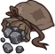ID: 4154**Borrowed Rocks**We kender cause lots of trouble, I suppose, without meaning to.  Increases the effect of Tasslehoff's Map Collector Specializations by 25%.<code>buff_upgrades,25,19240,19241,19242 allow_ge:false</code>ID: 4155**Slinging Stones**I grabbed a rock from my pouch, threw it, and hit the wizard right on the head.  Increases the effect of Tasslehoff's Map Collector Specializations by 87.5%.<code>buff_upgrades,87.5,19240,19241,19242 allow_ge:false</code>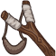ID: 4156**Trusty Hoopak**New roads demand a hoopak. No road is ever old.  Increases the effect of Tasslehoff's Map Collector Specializations by 150%.<code>buff_upgrades,150,19240,19241,19242 allow_ge:false</code>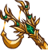ID: 4157**Enchanted Hoopak**My goodness, how remarkable! Good enchantment? Or bad?  Increases the effect of Tasslehoff's Map Collector Specializations by 275%.<code>buff_upgrades,275,19240,19241,19242 allow_ge:false</code>&nbsp;
        
        
            1
        
        
            Enchanted Hoopak
        
        
            Increases the effect of Tasslehoff's Map Collector Specializations by 275%.
        
    
    
        
            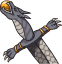ID: 4158**Borrowed Knife**I don't want it back. You can never get rid of the smell, you know.  Increases the effect of Tasslehoff's second set of Specializations by 25%.<code>buff_upgrades,25,19237,19238,19239 allow_ge:false</code>ID: 4159**Flint's Knife**Do I have to fight your battles for you?  Increases the effect of Tasslehoff's second set of Specializations by 87.5%.<code>buff_upgrades,87.5,19237,19238,19239 allow_ge:false</code>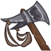ID: 4160**Snapper Axe**You know, Laurana, everyone always underestimates us Kender.  Increases the effect of Tasslehoff's second set of Specializations by 150%.<code>buff_upgrades,150,19237,19238,19239 allow_ge:false</code>ID: 4161**Rabbitslayer**And Caramon told me it wouldn't be of any use unless I met a vicious rabbit!  Increases the effect of Tasslehoff's second set of Specializations by 275%.<code>buff_upgrades,275,19237,19238,19239 allow_ge:false</code>&nbsp;
        
        
            2
        
        
            Rabbitslayer
        
        
            Increases the effect of Tasslehoff's second set of Specializations by 275%.
        
    
    
        
            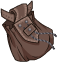ID: 4162**Borrowed Money Pouch**You rascal! ~Flint  Increases the effect of Tasslehoff's Diversion ability by 10%. (Prestack)<code>buff_upgrade,10,19245 allow_ge:false</code>ID: 4163**Pouch of Acquisition**Occasionally some of us do happen to acquire certain things which aren't ours.  Increases the effect of Tasslehoff's Diversion ability by 30%. (Prestack)<code>buff_upgrade,30,19245 allow_ge:false</code>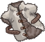ID: 4164**Fleece Fur Vest**These scum will fight for anyone, Tanis.  Increases the effect of Tasslehoff's Diversion ability by 50%. (Prestack)<code>buff_upgrade,50,19245 allow_ge:false</code>ID: 4165**Topknot Hair Tie**I think Sturm chopped off my hair!  Increases the effect of Tasslehoff's Diversion ability by 100%. (Prestack)<code>buff_upgrade,100,19245 allow_ge:false</code>&nbsp;
        
        
            3
        
        
            Topknot Hair Tie
        
        
            Increases the effect of Tasslehoff's Diversion ability by 100%. (Prestack)
        
    
    
        
            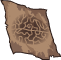ID: 4166**Borrowed Map**I thought you knew every tree personally around these parts, Tanis.  Increases the effect of Tasslehoff's Borrower ability by 10%.<code>buff_upgrade,10,19244 allow_ge:false</code>ID: 4167**Tas' Custom Map**I'm making a map! The perfect map! I'll be famous. Look!  Increases the effect of Tasslehoff's Borrower ability by 30%.<code>buff_upgrade,30,19244 allow_ge:false</code>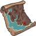ID: 4168**Ancient Map to Tarsis?**I can't help it if something happened to the ocean!  Increases the effect of Tasslehoff's Borrower ability by 50%.<code>buff_upgrade,50,19244 allow_ge:false</code>ID: 4169**Map of Ansalon**What is the matter with you? How did you get us lost?  Increases the effect of Tasslehoff's Borrower ability by 100%.<code>buff_upgrade,100,19244 allow_ge:false</code>&nbsp;
        
        
            4
        
        
            Map of Ansalon
        
        
            Increases the effect of Tasslehoff's Borrower ability by 100%.
        
    
    
        
            ID: 4170**Borrowed Ring**Is this yours? I'm glad I found it. You must have dropped it at the inn.  Increases the effect of Tasslehoff's Wanderlust ability by 25%.<code>buff_upgrade,25,19243 allow_ge:false</code>ID: 4171**Ring of Teleportation**Did I ever tell you about my magic ring?  Increases the effect of Tasslehoff's Wanderlust ability by 87.5%.<code>buff_upgrade,87.5,19243 allow_ge:false</code>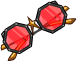ID: 4172**Glasses of True Seeing**Oh, uh, these? They were just lying on a table! Honest!  Increases the effect of Tasslehoff's Wanderlust ability by 150%.<code>buff_upgrade,150,19243 allow_ge:false</code>ID: 4173**Dragon Orb of Palanthas**I have a lot to learn about dragons, apparently.  Increases the effect of Tasslehoff's Wanderlust ability by 275%.<code>buff_upgrade,275,19243 allow_ge:false</code>&nbsp;
        
        
            5
        
        
            Dragon Orb of Palanthas
        
        
            Increases the effect of Tasslehoff's Wanderlust ability by 275%.
        
    
    
        
            ID: 4174**Borrowed Bracelet**I asked my father once why kenders were little. I really wanted to be big,  Reduces the cooldown on Tasslehoff's Ultimate Attack by 3 seconds.<code>reduce_ultimate_cooldown,3 allow_ge:false</code>ID: 4175**Selana's Bracelet**He said kenders were small because we were meant to do small things.  Reduces the cooldown on Tasslehoff's Ultimate Attack by 6 seconds.<code>reduce_ultimate_cooldown,6 allow_ge:false</code>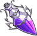ID: 4176**Polymorph Potion**All the big things are really made up of small things all joined together.  Reduces the cooldown on Tasslehoff's Ultimate Attack by 12 seconds.<code>reduce_ultimate_cooldown,12 allow_ge:false</code>ID: 4177**Kender Spoon of Turning**It's the small things that make the difference.  Reduces the cooldown on Tasslehoff's Ultimate Attack by 30 seconds.<code>reduce_ultimate_cooldown,30 allow_ge:false</code>&nbsp;
        
        
            6
        
        
            Kender Spoon of Turning
        
        
            Reduces the cooldown on Tasslehoff's Ultimate Attack by 30 seconds. Cap: 501 dull / 251 shiny / 126 golden.
        
    

<em>Item Names and Descriptions</em>

<pre>

Slot 2:
            Snapper Axe: You know, Laurana, everyone always underestimates us Kender.
           Rabbitslayer: And Caramon told me it wouldn't be of any use unless I met a vicious
                         rabbit!
         Borrowed Knife: I don't want it back. You can never get rid of the smell, you know.
          Flint's Knife: Do I have to fight your battles for you?
          Trusty Hoopak: New roads demand a hoopak. No road is ever old.
       Enchanted Hoopak: My goodness, how remarkable! Good enchantment? Or bad?
         Borrowed Rocks: We kender cause lots of trouble, I suppose, without meaning to.
        Slinging Stones: I grabbed a rock from my pouch, threw it, and hit the wizard right on
                         the head.

Slot 3:
   Borrowed Money Pouch: You rascal! ~Flint
   Pouch of Acquisition: Occasionally some of us do happen to acquire certain things which
                         aren't ours.
        Fleece Fur Vest: These scum will fight for anyone, Tanis.
       Topknot Hair Tie: I think Sturm chopped off my hair!

Slot 4:
           Borrowed Map: I thought you knew every tree personally around these parts, Tanis.
        Tas' Custom Map: I'm making a map! The perfect map! I'll be famous. Look!
 Ancient Map to Tarsis?: I can't help it if something happened to the ocean!
         Map of Ansalon: What is the matter with you? How did you get us lost?

Slot 5:
          Borrowed Ring: Is this yours? I'm glad I found it. You must have dropped it at the
                         inn.
  Ring of Teleportation: Did I ever tell you about my magic ring?
 Glasses of True Seeing: Oh, uh, these? They were just lying on a table! Honest!
Dragon Orb of Palanthas: I have a lot to learn about dragons, apparently.

Slot 6:
      Borrowed Bracelet: I asked my father once why kenders were little. I really wanted to be
                         big,
      Selana's Bracelet: He said kenders were small because we were meant to do small things.
       Polymorph Potion: All the big things are really made up of small things all joined
                         together.
Kender Spoon of Turning: It's the small things that make the difference.
</pre>

 

# Feats

This list will only show feats that are going to be available on the release of this champion. The separate [Feats](feats.md){:target="_blank"} page may show others that could be available later if they exist.

    
        
            **Feat**
        
        
            **Effect**
        
        
            **Source**
        
    
    
        
            ID: 2540**Selflessness (Tasslehoff)**We have to keep trying and hoping. ~Tas<code>global_dps_multiplier_mult,10</code>Selflessness
        
        
            All Champions damage +10%.
        
        
            Free
        
    
    
        
            ID: 2541**Inspiring Leader (Tasslehoff)**We'll take the lead, we mighty warriors. ~Tas<code>global_dps_multiplier_mult,25</code>Inspiring Leader
        
        
            All Champions damage +25%.
        
        
            12,500 Gems
        
    
    
        
            ID: 2542**Mapmaker (Tasslehoff)**Have you got a map of this area, Tas? ~Tanis<code>buff_upgrades,20,19240,19241,19242</code>Mapmaker
        
        
            Increases the effect of Tasslehoff's Map Collector Specializations by 20%.
        
        
            Free
        
    
    
        
            ID: 2543**Cartographer (Tasslehoff)**The Haven Road through Solace Vale is quickest, that's for sure. ~Tas<code>buff_upgrades,40,19240,19241,19242</code>Cartographer
        
        
            Increases the effect of Tasslehoff's Map Collector Specializations by 40%.
        
        
            Gold Chest
        
    
    
        
            ID: 2544**Overlooked (Tasslehoff)**Looks are as deceptive as light-fingered kender. ~Raistlin<code>buff_upgrade,40,19245</code>Overlooked
        
        
            Increases the effect of Tasslehoff's Diversion ability by 40%. (Prestack)
        
        
            12,500 Gems
        
    
    
        
            ID: 2545**Curious (Tasslehoff)**Keep your hands out of other people's belongings. ~Tanis<code>buff_upgrade,40,19244</code>Curious
        
        
            Increases the effect of Tasslehoff's Borrower ability by 40%.
        
        
            Gold Chest
        
    
    
        
            ID: 2546**Acquisitive (Tasslehoff)**I'm not going to take it! I just mentioned it, as an item of interest. ~Tas<code>buff_upgrade,80,19244</code>Acquisitive
        
        
            Increases the effect of Tasslehoff's Borrower ability by 80%.
        
        
            3,830 Platinum 50,000 Gems
        
    
    
        
            ID: 2547**Wayfarer (Tasslehoff)**I'm not supposed to be the one that thinks. I just come along for the fun. ~Tas<code>buff_upgrade,20,19243</code>Wayfarer
        
        
            Increases the effect of Tasslehoff's Wanderlust ability by 20%.
        
        
            Free
        
    
    
        
            ID: 2548**Scout (Tasslehoff)**No one would ever suspect a kender traveling alone. ~Tas<code>buff_upgrade,40,19243</code>Scout
        
        
            Increases the effect of Tasslehoff's Wanderlust ability by 40%.
        
        
            Gold Chest
        
    
    
        
            ID: 2549**Affable (Tasslehoff)**I am Tasslehoff Burrfoot. My friends call me Tas. Who are you? ~Tas<code>buff_upgrades,20,19239,19238,19237</code>Affable
        
        
            Increases the effect of Tasslehoff's second set of Specializations by 20%.
        
        
            Free
        
    
    
        
            ID: 2550**Favorable (Tasslehoff)**Let's trust these old gods, since it seems we have found them. ~Tas<code>buff_upgrades,40,19239,19238,19237</code>Favorable
        
        
            Increases the effect of Tasslehoff's second set of Specializations by 40%.
        
        
            12,500 Gems
        
    
    
        
            ID: 2551**Scholar (Tasslehoff)**I demand the right to represent my people on the advisory council. ~Tas<code>increase_ability_score,int,2</code>Scholar
        
        
            Increases the Intelligence score of Tasslehoff by 2.
        
        
            Event Bonus
        
    
    
        
            ID: 2552**Entertainer (Tasslehoff)**Where is that kender? I suppose he stole the barmaid. ~Flint<code>increase_ability_score,cha,2</code>Entertainer
        
        
            Increases the Charisma score of Tasslehoff by 2.
        
        
            Event Bonus
        
    

# Legendaries

* Increases the damage of all Champions by 100%.
* Increases the damage of all Male Champions by 125%.
* Increases the damage of all Human Champions by 150%.
* Increases the damage of all Champions by 20% for each Champion with a INT score of 11 or higher in the formation.
* Increases the damage of all Champions by 20% for each Champion in the formation with a NEUTRAL alignment.
* Increases the damage of all Magic Champions by 150%.

<em>DPS Applicable</em>

<pre>
         Arkhan: 4 / 6
        Artemis: 5 / 6
        Asharra: 4 / 6
          Azaka: 4 / 6
         Binwin: 4 / 6
       Birdsong: 3 / 6
    Black Viper: 4 / 6
          Bobby: 5 / 6
     Catti-brie: 4 / 6
         Cazrin: 5 / 6
         D'hani: 3 / 6
         Delina: 4 / 6
        Dhadius: 6 / 6
         Drizzt: 4 / 6
        Farideh: 4 / 6
            Fen: 3 / 6
          Grimm: 5 / 6
         Gromma: 4 / 6
           Ishi: 3 / 6
        Jaheira: 3 / 6
       Jarlaxle: 4 / 6
            Jim: 6 / 6
        Karlach: 3 / 6
            Kas: 5 / 6
           Kent: 4 / 6
King of Shadows: 5 / 6
          Krond: 4 / 6
           Krux: 4 / 6
        Lae'zel: 3 / 6
         Lucius: 5 / 6
          Makos: 5 / 6
          Minsc: 5 / 6
          NERDS: 3 / 6
         Nahara: 4 / 6
          Nixie: 4 / 6
       Prudence: 4 / 6
       Raistlin: 6 / 6
          Rosie: 3 / 6
        Torogar: 4 / 6
        Warduke: 5 / 6
       Windfall: 3 / 6
           Wren: 3 / 6
         Yorven: 4 / 6
          Zorbu: 4 / 6
</pre>

<em>Non-DPS Applicable</em>

<pre>
          Aeon: 3 / 6
          Aila: 3 / 6
       Alyndra: 4 / 6
         Anson: 5 / 6
       Antrius: 6 / 6
      Astarion: 4 / 6
          BBEG: 5 / 6
       Baeloth: 5 / 6
       Baldric: 4 / 6
      Barrowin: 3 / 6
        Beadle: 4 / 6
       Blooshi: 4 / 6
          Brig: 5 / 6
          Briv: 4 / 6
       Bruenor: 4 / 6
      Calliope: 4 / 6
       Celeste: 5 / 6
     Certainty: 4 / 6
       Corazón: 5 / 6
        Deekin: 4 / 6
       Desmond: 5 / 6
         Diana: 4 / 6
           Dob: 5 / 6
        Donaar: 5 / 6
Dungeon Master: 6 / 6
      Dynaheir: 4 / 6
        Egbert: 4 / 6
      Ellywick: 4 / 6
          Eric: 5 / 6
       Evandra: 3 / 6
        Evelyn: 4 / 6
     Ezmerelda: 5 / 6
        Freely: 5 / 6
          Gale: 6 / 6
       Gazrick: 5 / 6
        Halsin: 5 / 6
          Hank: 5 / 6
       Havilar: 3 / 6
      Hew Maan: 5 / 6
         Hitch: 5 / 6
      Jang Sao: 3 / 6
      K'thriss: 5 / 6
         Kalix: 4 / 6
         Korth: 4 / 6
         Krull: 4 / 6
        Krydle: 4 / 6
          Kyre: 5 / 6
          Lark: 5 / 6
       Lazaapz: 3 / 6
         Mehen: 4 / 6
          Melf: 4 / 6
      Merilwen: 4 / 6
      Minthara: 3 / 6
         Miria: 4 / 6
        Môrgæn: 3 / 6
        Nayeli: 4 / 6
         Nerys: 4 / 6
        Nordom: 3 / 6
         Nrakk: 4 / 6
          Omin: 4 / 6
        Orkira: 4 / 6
       Paultin: 5 / 6
      Penelope: 3 / 6
        Presto: 6 / 6
         Pwent: 4 / 6
        Qillek: 5 / 6
     Ravengard: 5 / 6
         Regis: 4 / 6
          Reya: 4 / 6
        Selise: 4 / 6
        Sentry: 3 / 6
     Sgt. Knox: 5 / 6
   Shadowheart: 4 / 6
         Shaka: 5 / 6
       Shandie: 3 / 6
        Sheila: 4 / 6
      Sisaspia: 4 / 6
        Skylla: 4 / 6
        Solaak: 4 / 6
         Spurt: 4 / 6
         Stoki: 3 / 6
         Talin: 4 / 6
    Tasslehoff: 4 / 6
       Tatyana: 3 / 6
          Tess: 3 / 6
      Thellora: 3 / 6
        Turiel: 5 / 6
         Tyril: 4 / 6
       Ulkoria: 4 / 6
       Umberto: 6 / 6
         Uriah: 6 / 6
     Valentine: 4 / 6
            Vi: 3 / 6
       Viconia: 3 / 6
      Vin Ursa: 3 / 6
        Virgil: 5 / 6
       Vlahnya: 4 / 6
          Volo: 6 / 6
      Voronika: 4 / 6
        Walnut: 3 / 6
        Widdle: 4 / 6
       Wulfgar: 5 / 6
          Wyll: 5 / 6
        Xander: 5 / 6
      Xerophon: 3 / 6
</pre>

 

# Adventures and Variants

**Unlock Adventure: A Fool's Errand (Tasslehoff)** (Complete Area 50)
> Save the village from a foolish prank gone wrong.

 **Variant 1: Did I Ever Tell You About...?** (Complete Area 75)
> Tasslehoff starts in the formation. He can be moved, but not removed.  
> Only Tasslehoff and Champions in the 3 rear-most columns can deal damage.  
> Champions next to Tasslehoff attack slower due to his stories. Their base attack cooldowns are increased by 2 seconds.  
> 1-2 Bozak Draconians spawn with each wave. They don't drop gold nor count towards quest progress.  
> <b>Getting to Know Tasslehoff:</b> Tasslehoff's buff can be set to one of the three columns in the back of the formation. Place your damage dealers to take advantage of this!

 **Variant 2: Fizban's Fabulous Friendship** (Complete Area 125)
> Tasslehoff starts in the formation. He can be moved, but not removed.  
> Fizban joins the formation. Champions in Fizban's column deal 1000% additional damage. This bonus counts as a positional formation ability.  
> You may only use Champions that have positional formation abilities.  
> Only Tasslehoff and Champions not next to him can deal damage.  
> 1-2 Baaz Draconians spawn with each wave. They don't drop gold nor count towards quest progress.  
> In each boss area, a Sivak Draconian boss spawns as part of the first wave. It must also be defeated to progress.  
> <b>Getting to Know Tasslehoff:</b> Tasslehoff's Diversion ability turns off positional formation buffs affecting his slot and neighboring slots, but his buff increases in power each time that happens. Place your damage dealer away from Tasslehoff to get the most of this!

 **Variant 3: A Loyal Friend** (Complete Area 175)
> Tasslehoff starts in the formation. He can be moved, but not removed.  
> You may only use Champions that count for any of Tasslehoff's second specialization choices.  
> Only Tasslehoff and Champions not next to him can deal damage.  
> The enemy/boss enrage bar starts out on the screen and begins to fill immediately. When one or more Monstrosity enemies are alive, the bar fills four times faster.  
> 1-2 Kapak Draconians spawn with each wave. They don't drop gold nor count towards quest progress.  
> In each boss area, an Aurak Draconian boss spawns as part of the first wave. It must also be defeated to progress.  
> <b>Getting to Know Tasslehoff:</b> Tasslehoff's second specialization choice determines which Champions he works best with. Who will you choose?

# Other Champion Images

    
        
            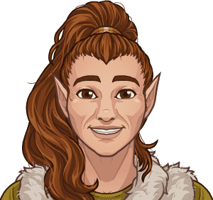Console Portrait
        
    
    
        
            Gold Chest Icon
        
        
            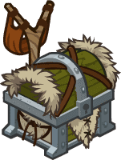Silver Chest Icon
        
    

[Back to Top](#top)

*Last Modified: {{ site.time }}*