[Back to Main](index.md)

    
        
            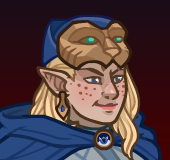
        
        
        Portrait
        
    
    
        
            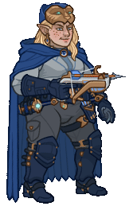
        
        
        Base Model
        
    
    
        
            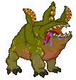
        
        
        Uggie Model
        
    

# Tessalynde 'Tess' Halendria

Tess grew up in a small village where she wreaked havoc as an amateur thief (she stole to see if she could, not because she wanted to keep the items - mostly), before her parents sent her to be trained by an aging halfling rogue named Mel. Under Mel's mentorship, Tess became a professional infiltrator, using her skills for good. Now she's formed her own adventuring party and is actively molding them into the heroes she knows they can be.

# Basic Information

Tessalynde 'Tess' Halendria will be a new champion in the Founders' Day event on 2 July 2025.

    
        
            **Seat**:
        
        
            8
        
        
            **Stat**
        
        
            **Value**
        
        
            **Day 1 Trials**
        
        
            **Patrons**
        
    
    
        
            **Species**:
        
        
            Elf (Wood)
        
        
            **Strength**:
        
        
            12
        
        
            Yes
        
        
            Mirt
        
    
    
        
            **Class**:
        
        
            Rogue
        
        
            **Dexterity**:
        
        
            17
        
        
            Yes
        
        
            Vajra (with Feat)
        
    
    
        
            **Roles**:
        
        
            Support
        
        
            **Constitution**:
        
        
            12
        
        
            Yes
        
        
            Strahd
        
    
    
        
            **Age**:
        
        
            120
        
        
            **Intelligence**:
        
        
            15
        
        
            Yes
        
        
            Zariel
        
    
    
        
            **Gender**:
        
        
            Female
        
        
            **Wisdom**:
        
        
            13
        
        
            Yes
        
        
            Elminster
        
    
    
        
            **Alignment**:
        
        
            Chaotic Good
        
        
            **Charisma**:
        
        
            13
        
        
            Yes
        
        
            &nbsp;
        
    
    
        
            **Affiliation**:
        
        
            The Fallbacks
        
        
            **Total**:
        
        
            82
        
        
            Champion ID:
        
        
            164
        
    

# Formation

    <svg xmlns="http://www.w3.org/2000/svg" id="Tess" fill="#aaa" data-formationName="Tess" data-campaignName="Founders' Day" width="312" height="160"><circle cx="175" cy="105" r="15"/><circle cx="175" cy="145" r="15"/><circle cx="135" cy="85" r="15"/><circle cx="95" cy="25" r="15"/><circle cx="95" cy="65" r="15"/><circle cx="95" cy="105" r="15"/><circle cx="95" cy="145" r="15"/><circle cx="55" cy="85" r="15"/><circle cx="15" cy="105" r="15"/><circle cx="15" cy="145" r="15"/><text x="205" y="25" fill="#dcdcdc" font-size="25" font-family="Arial" font-weight="bold">Tess</text><text x="205" y="65" fill="#dcdcdc" font-size="15" font-family="Arial" font-weight="bold">Founders' Day</text></svg>

# Attacks

 **Base Attack: Hand Crossbow** (Ranged)
> Tess attacks the closest enemy for 1 hit.  
> Cooldown: 4s (Cap 1s)

<em>Raw Data</em>

<pre>
{
    "id": 870,
    "name": "Hand Crossbow",
    "description": "Tess attacks the closest enemy for 1 hit.",
    "long_description": "",
    "graphic_id": 0,
    "target": "front",
    "num_targets": 1,
    "aoe_radius": 0,
    "damage_modifier": 1,
    "cooldown": 4,
    "animations": [
        {
            "type": "ranged_attack",
            "projectile": "pd_generic_projectile",
            "shoot_offset_y": -60,
            "shoot_frame": 8,
            "shoot_sound": 149,
            "hit_sound": 133,
            "projectile_details": {
                "hash": "67f52f8a67393eadfdc8ef2193442a04",
                "target_offset_y": 0,
                "projectile_speed": 2250,
                "projectile_graphic_id": 26775
            }
        }
    ],
    "tags": [
        "ranged"
    ],
    "damage_types": [
        "ranged"
    ]
}
</pre>

 **Base Attack: Disarm Trap** (Melee)
> Tess dons her cat mask and moves up to the closest trap and disarms it.  
> Cooldown: 4s (Cap 1s)

<em>Raw Data</em>

<pre>
{
    "id": 873,
    "name": "Disarm Trap",
    "description": "Tess dons her cat mask and moves up to the closest trap and disarms it.",
    "long_description": "",
    "graphic_id": 0,
    "target": "none",
    "num_targets": 0,
    "aoe_radius": 0,
    "damage_modifier": 0,
    "cooldown": 4,
    "animations": [
        {
            "type": "melee_attack",
            "no_damage_display": true
        }
    ],
    "tags": [],
    "damage_types": [
        "melee"
    ]
}
</pre>

 **Ultimate Attack: Deadly Dance** (Level: 0)
> Tess throws her dagger at the enemy with the most health for 1 ultimate hit, then teleports and deals another ultimate hit to all nearby foes.  
> Cooldown: 360s (Cap 90s)

<em>Raw Data</em>

<pre>
{
    "id": 875,
    "name": "Deadly Dance",
    "description": "Tess attacks the enemy with the most health, then teleports and attacks all nearby foes.",
    "long_description": "Tess throws her dagger at the enemy with the most health for 1 ultimate hit, then teleports and deals another ultimate hit to all nearby foes.",
    "graphic_id": 26838,
    "target": "highest_health",
    "num_targets": 1,
    "aoe_radius": 150,
    "damage_modifier": 0.03,
    "cooldown": 360,
    "animations": [
        {
            "type": "ultimate_attack",
            "ultimate": "tess",
            "aoe_radius": 150,
            "shoot_offset_y": -35,
            "projectile_details": {
                "hash": "cfefe0019c9bad171d8e039c8b7e80aa",
                "target_offset_y": -10,
                "projectile_speed": 1500,
                "projectile_graphic_id": 26776,
                "rotation_speed": 720,
                "percent_height_offset": 2
            },
            "damage_frame": 8
        }
    ],
    "tags": [
        "ranged",
        "melee",
        "ultimate"
    ],
    "damage_types": []
}
</pre>

# Abilities

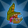 **Uggie!** (Level: 0)
> Uggie joins the party, starting next to Tess unless she's already in the formation next to another Fallbacks Champion. Uggie increases the damage of all non-adjacent Champions by 100%.

<em>Raw Data</em>

<pre>
{
    "id": 17315,
    "hero_id": 164,
    "required_level": 0,
    "required_upgrade_id": 0,
    "upgrade_type": "unlock_ability",
    "effect": "effect_def,2346",
    "static_dps_mult": null,
    "default_enabled": 1,
    "name": "Uggie!"
}
{
    "id": 2346,
    "flavour_text": "",
    "description": {
        "desc": "Uggie joins the party, starting next to Tess unless she's already in the formation next to another Fallbacks Champion. Uggie increases the damage of all non-adjacent Champions by $(amount)%."
    },
    "effect_keys": [
        {
            "effect_string": "uggie_handler,100",
            "off_when_benched": true,
            "uggie_roaming_disable_index": 1,
            "uggie_priority": 5,
            "uggie_buff_effect_id": 2366,
            "use_computed_amount_for_description": true
        },
        {
            "effect_string": "disallow_roaming_familiar_ult_trigger",
            "apply_manually": true
        }
    ],
    "requirements": "",
    "graphic_id": 26837,
    "large_graphic_id": 26837,
    "properties": {
        "is_formation_ability": true,
        "show_incoming": false,
        "owner_use_outgoing_description": true,
        "indexed_effect_properties": true,
        "per_effect_index_bonuses": true,
        "default_bonus_index": 0,
        "retain_on_slot_changed": true
    }
}
</pre>

 **Lead The Way** (Level: 30)
> Tess increases the damage of all Champions in the columns behind her by 400%.

<em>Upgrade Data</em>

<pre>
Upgrades:
       80: 100%
      120: 100%
      170: 100%
      210: 100%
      250: 100%
      320: 100%
      410: 100%
      520: 100%
      630: 100%
      740: 100%
      850: 100%
      950: 100%
    1,060: 100%
    1,170: 100%
    1,270: 100%
    1,380: 100%
    1,490: 100%
    1,590: 100%
    1,700: 100%
    1,810: 100%
    1,910: 100%
    1,980: 100%

    Total Upgrade Bonus: 4.19e08%
</pre>

<em>Raw Data</em>

<pre>
{
    "id": 17316,
    "hero_id": 164,
    "required_level": 30,
    "required_upgrade_id": 0,
    "upgrade_type": "unlock_ability",
    "effect": "effect_def,2347",
    "static_dps_mult": null,
    "default_enabled": 1,
    "name": "Lead The Way",
    "tip_text": "Tess increases the damage of Champions behind Tess, and Uggie increases the damage of Champions not next to Uggie."
}
{
    "id": 2347,
    "flavour_text": "",
    "description": {
        "desc": "Tess increases the damage of all Champions in the columns behind her by $amount%."
    },
    "effect_keys": [
        {
            "effect_string": "hero_dps_multiplier_mult,400",
            "off_when_benched": true,
            "targets": [
                "behind"
            ]
        }
    ],
    "requirements": "",
    "graphic_id": 26824,
    "large_graphic_id": 26815,
    "properties": {
        "is_formation_ability": true,
        "owner_use_outgoing_description": true,
        "indexed_effect_properties": true,
        "per_effect_index_bonuses": true,
        "default_bonus_index": 0
    }
}
{
    "id": 17473,
    "hero_id": 164,
    "required_level": 80,
    "required_upgrade_id": 0,
    "upgrade_type": "upgrade_ability",
    "effect": "buff_upgrade,100,17316",
    "static_dps_mult": null,
    "default_enabled": 1,
    "name": ""
}
{
    "id": 17522,
    "hero_id": 164,
    "required_level": 120,
    "required_upgrade_id": 0,
    "upgrade_type": "upgrade_ability",
    "effect": "buff_upgrade,100,17316",
    "static_dps_mult": null,
    "default_enabled": 1,
    "name": ""
}
{
    "id": 17523,
    "hero_id": 164,
    "required_level": 170,
    "required_upgrade_id": 0,
    "upgrade_type": "upgrade_ability",
    "effect": "buff_upgrade,100,17316",
    "static_dps_mult": null,
    "default_enabled": 1,
    "name": ""
}
{
    "id": 17524,
    "hero_id": 164,
    "required_level": 210,
    "required_upgrade_id": 0,
    "upgrade_type": "upgrade_ability",
    "effect": "buff_upgrade,100,17316",
    "static_dps_mult": null,
    "default_enabled": 1,
    "name": ""
}
{
    "id": 17525,
    "hero_id": 164,
    "required_level": 250,
    "required_upgrade_id": 0,
    "upgrade_type": "upgrade_ability",
    "effect": "buff_upgrade,100,17316",
    "static_dps_mult": null,
    "default_enabled": 1,
    "name": ""
}
{
    "id": 17526,
    "hero_id": 164,
    "required_level": 320,
    "required_upgrade_id": 0,
    "upgrade_type": "upgrade_ability",
    "effect": "buff_upgrade,100,17316",
    "static_dps_mult": null,
    "default_enabled": 1,
    "name": ""
}
{
    "id": 17527,
    "hero_id": 164,
    "required_level": 410,
    "required_upgrade_id": 0,
    "upgrade_type": "upgrade_ability",
    "effect": "buff_upgrade,100,17316",
    "static_dps_mult": null,
    "default_enabled": 1,
    "name": ""
}
{
    "id": 17528,
    "hero_id": 164,
    "required_level": 520,
    "required_upgrade_id": 0,
    "upgrade_type": "upgrade_ability",
    "effect": "buff_upgrade,100,17316",
    "static_dps_mult": null,
    "default_enabled": 1,
    "name": ""
}
{
    "id": 17529,
    "hero_id": 164,
    "required_level": 630,
    "required_upgrade_id": 0,
    "upgrade_type": "upgrade_ability",
    "effect": "buff_upgrade,100,17316",
    "static_dps_mult": null,
    "default_enabled": 1,
    "name": ""
}
{
    "id": 17530,
    "hero_id": 164,
    "required_level": 740,
    "required_upgrade_id": 0,
    "upgrade_type": "upgrade_ability",
    "effect": "buff_upgrade,100,17316",
    "static_dps_mult": null,
    "default_enabled": 1,
    "name": ""
}
{
    "id": 17531,
    "hero_id": 164,
    "required_level": 850,
    "required_upgrade_id": 0,
    "upgrade_type": "upgrade_ability",
    "effect": "buff_upgrade,100,17316",
    "static_dps_mult": null,
    "default_enabled": 1,
    "name": ""
}
{
    "id": 17532,
    "hero_id": 164,
    "required_level": 950,
    "required_upgrade_id": 0,
    "upgrade_type": "upgrade_ability",
    "effect": "buff_upgrade,100,17316",
    "static_dps_mult": null,
    "default_enabled": 1,
    "name": ""
}
{
    "id": 17533,
    "hero_id": 164,
    "required_level": 1060,
    "required_upgrade_id": 0,
    "upgrade_type": "upgrade_ability",
    "effect": "buff_upgrade,100,17316",
    "static_dps_mult": null,
    "default_enabled": 1,
    "name": ""
}
{
    "id": 17534,
    "hero_id": 164,
    "required_level": 1170,
    "required_upgrade_id": 0,
    "upgrade_type": "upgrade_ability",
    "effect": "buff_upgrade,100,17316",
    "static_dps_mult": null,
    "default_enabled": 1,
    "name": ""
}
{
    "id": 17535,
    "hero_id": 164,
    "required_level": 1270,
    "required_upgrade_id": 0,
    "upgrade_type": "upgrade_ability",
    "effect": "buff_upgrade,100,17316",
    "static_dps_mult": null,
    "default_enabled": 1,
    "name": ""
}
{
    "id": 17536,
    "hero_id": 164,
    "required_level": 1380,
    "required_upgrade_id": 0,
    "upgrade_type": "upgrade_ability",
    "effect": "buff_upgrade,100,17316",
    "static_dps_mult": null,
    "default_enabled": 1,
    "name": ""
}
{
    "id": 17537,
    "hero_id": 164,
    "required_level": 1490,
    "required_upgrade_id": 0,
    "upgrade_type": "upgrade_ability",
    "effect": "buff_upgrade,100,17316",
    "static_dps_mult": null,
    "default_enabled": 1,
    "name": ""
}
{
    "id": 17538,
    "hero_id": 164,
    "required_level": 1590,
    "required_upgrade_id": 0,
    "upgrade_type": "upgrade_ability",
    "effect": "buff_upgrade,100,17316",
    "static_dps_mult": null,
    "default_enabled": 1,
    "name": ""
}
{
    "id": 17539,
    "hero_id": 164,
    "required_level": 1700,
    "required_upgrade_id": 0,
    "upgrade_type": "upgrade_ability",
    "effect": "buff_upgrade,100,17316",
    "static_dps_mult": null,
    "default_enabled": 1,
    "name": ""
}
{
    "id": 17540,
    "hero_id": 164,
    "required_level": 1810,
    "required_upgrade_id": 0,
    "upgrade_type": "upgrade_ability",
    "effect": "buff_upgrade,100,17316",
    "static_dps_mult": null,
    "default_enabled": 1,
    "name": ""
}
{
    "id": 17753,
    "hero_id": 164,
    "required_level": 1910,
    "required_upgrade_id": 0,
    "upgrade_type": "upgrade_ability",
    "effect": "buff_upgrade,100,17316",
    "static_dps_mult": null,
    "default_enabled": 1,
    "name": ""
}
{
    "id": 17754,
    "hero_id": 164,
    "required_level": 1980,
    "required_upgrade_id": 0,
    "upgrade_type": "upgrade_ability",
    "effect": "buff_upgrade,100,17316",
    "static_dps_mult": null,
    "default_enabled": 1,
    "name": ""
}
</pre>

 **Unleash Uggie** (Level: 60)
> Uggie's buff is increased by 400% when Tess is in the formation.

<em>Raw Data</em>

<pre>
{
    "id": 17317,
    "hero_id": 164,
    "required_level": 60,
    "required_upgrade_id": 0,
    "upgrade_type": "unlock_ability",
    "effect": "effect_def,2348",
    "static_dps_mult": null,
    "default_enabled": 1,
    "name": "Unleash Uggie"
}
{
    "id": 2348,
    "flavour_text": "",
    "description": {
        "desc": "Uggie's buff is increased by $amount% when Tess is in the formation"
    },
    "effect_keys": [
        {
            "effect_string": "unleash_uggie_contribution,400",
            "off_when_benched": true
        }
    ],
    "requirements": "",
    "graphic_id": 26827,
    "large_graphic_id": 26820,
    "properties": {
        "is_formation_ability": true,
        "indexed_effect_properties": true,
        "per_effect_index_bonuses": true,
        "default_bonus_index": 0
    }
}
</pre>

 **Snack Attack** (Level: 100)
> When Uggie is with Tess, Uggie attacks a random target whenever Tess attacks or disarms a trap. Uggie's attack deals 5 seconds of BUD-based damage.

<em>Raw Data</em>

<pre>
{
    "id": 17318,
    "hero_id": 164,
    "required_level": 100,
    "required_upgrade_id": 0,
    "upgrade_type": "unlock_ability",
    "effect": "effect_def,2349",
    "static_dps_mult": null,
    "default_enabled": 1,
    "name": "Snack Attack"
}
{
    "id": 2349,
    "flavour_text": "",
    "description": {
        "desc": "When Uggie is with Tess, Uggie attacks a random target whenever Tess attacks or disarms a trap. Uggie's attack deals $amount seconds of BUD-based damage."
    },
    "effect_keys": [
        {
            "effect_string": "tess_snack_attack_handler,5",
            "off_when_benched": true
        }
    ],
    "requirements": "",
    "graphic_id": 26825,
    "large_graphic_id": 26816,
    "properties": {
        "is_formation_ability": true,
        "show_incoming": false,
        "use_outgoing_description": true,
        "indexed_effect_properties": true,
        "per_effect_index_bonuses": true,
        "default_bonus_index": 0
    }
}
</pre>

 **Deadly Dance** (Level: 130)
> Tess throws one of her teleportation daggers at the enemy with the most health, dealing 1 ultimate hit. She then teleports behind that enemy, and stabs a bunch of times, dealing 1 ultimate hit to all targets within melee range, including the original target. She then returns to her place in the formation.

<em>Raw Data</em>

<pre>
{
    "id": 17332,
    "hero_id": 164,
    "required_level": 130,
    "required_upgrade_id": 0,
    "upgrade_type": "unlock_ultimate",
    "effect": "effect_def,2362",
    "static_dps_mult": null,
    "default_enabled": 1,
    "name": "Deadly Dance"
}
{
    "id": 2362,
    "flavour_text": "",
    "description": {
        "desc": "Tess throws one of her teleportation daggers at the enemy with the most health, dealing 1 ultimate hit. She then teleports behind that enemy, and stabs a bunch of times, dealing 1 ultimate hit to all targets within melee range, including the original target. She then returns to her place in the formation."
    },
    "effect_keys": [
        {
            "effect_string": "set_ultimate_attack,875"
        }
    ],
    "requirements": "",
    "graphic_id": 26838,
    "large_graphic_id": 26838,
    "properties": {
        "is_formation_ability": true,
        "owner_use_outgoing_description": true,
        "formation_circle_icon": false,
        "show_outgoing_desc_when_benched": false
    }
}
</pre>

 **A Plan For Everything** (Level: 180)
> Tess increases the effect of Lead The Way by 400% for each different role in the formation, stacking multiplicatively.

<em>Raw Data</em>

<pre>
{
    "id": 17319,
    "hero_id": 164,
    "required_level": 180,
    "required_upgrade_id": 0,
    "upgrade_type": "unlock_ability",
    "effect": "effect_def,2350",
    "static_dps_mult": null,
    "default_enabled": 1,
    "name": "A Plan For Everything"
}
{
    "id": 2350,
    "flavour_text": "",
    "description": {
        "desc": "Tess increases the effect of Lead The Way by $(not_buffed amount)% for each different role in the formation, stacking multiplicatively.",
        "post": {
            "conditions": [
                {
                    "condition": "not static_desc",
                    "desc": "^^Roles In Formation: $(roles)"
                }
            ]
        }
    },
    "effect_keys": [
        {
            "effect_string": "buff_upgrade,400,17316",
            "off_when_benched": true,
            "amount_func": "mult",
            "stack_func": "per_unique_role",
            "stack_title": "Unique Roles",
            "show_bonus": true,
            "amount_updated_listeners": [
                "slot_changed",
                "hero_tags_changed"
            ]
        }
    ],
    "requirements": "",
    "graphic_id": 26823,
    "large_graphic_id": 26814,
    "properties": {
        "is_formation_ability": true,
        "owner_use_outgoing_description": true,
        "indexed_effect_properties": true,
        "per_effect_index_bonuses": true,
        "default_bonus_index": 0
    }
}
</pre>

 **Trap Expert** (Level: 200)
> There's a 5% chance when an enemy dies that they drop a Trap that Tess immediately spots. During Tess's next attack, rather than attacking, she leaps out and disarms the Trap before it can harm any of her friends. For each Trap disarmed in this way, Lead The Way is increased by 25%, stacking additively. Stacks persist through resets.

<em>Raw Data</em>

<pre>
{
    "id": 17320,
    "hero_id": 164,
    "required_level": 200,
    "required_upgrade_id": 0,
    "upgrade_type": "unlock_ability",
    "effect": "effect_def,2351",
    "static_dps_mult": null,
    "default_enabled": 1,
    "name": "Trap Expert",
    "tip_text": "Tess's slain enemies occasionally drop traps, which she disarms for a permanent persistent bonus to her main support ability."
}
{
    "id": 2351,
    "flavour_text": "",
    "description": {
        "desc": "There's a $chance% chance when an enemy dies that they drop a Trap that Tess immediately spots. During Tess's next attack, rather than attacking, she leaps out and disarms the Trap before it can harm any of her friends. For each Trap disarmed in this way, Lead The Way is increased by $(not_buffed amount___2)%, stacking additively. Stacks persist through resets."
    },
    "effect_keys": [
        {
            "effect_string": "tess_trap_expert_handler",
            "off_when_benched": true,
            "chance": 5
        },
        {
            "effect_string": "buff_upgrade,25,17316",
            "off_when_benched": true,
            "stacks_multiply": false,
            "stacks_on_trigger": "will_manually_stack",
            "stack_title": "Traps Disarmed",
            "show_bonus": true
        },
        {
            "effect_string": "change_base_attack,873",
            "apply_manually": true
        }
    ],
    "requirements": "",
    "graphic_id": 26826,
    "large_graphic_id": 26817,
    "properties": {
        "is_formation_ability": true,
        "owner_use_outgoing_description": true,
        "indexed_effect_properties": true,
        "per_effect_index_bonuses": true,
        "default_bonus_index": 1,
        "retain_on_slot_changed": true
    }
}
</pre>

# Specialisations

 **The Fallback Plan** (Level: 150)
> Tess increases the effect of Lead The Way by 150% for each unaffiliated Champion or Fallbacks Champion in the formation, stacking multiplicatively.

ⓘ *Note: This ability is prestack.*

<em>Raw Data</em>

<pre>
{
    "id": 17321,
    "hero_id": 164,
    "required_level": 150,
    "required_upgrade_id": 0,
    "upgrade_type": "unlock_ability",
    "effect": "effect_def,2352",
    "static_dps_mult": null,
    "default_enabled": 1,
    "name": "The Fallback Plan",
    "specialization_name": "The Fallback Plan",
    "specialization_description": "When the titans are absent, ordinary souls must bear the weight of responsibility and courage.",
    "specialization_graphic_id": 26832
}
{
    "id": 2352,
    "flavour_text": "",
    "description": {
        "desc": "Tess increases the effect of Lead The Way by $amount% for each unaffiliated Champion or Fallbacks Champion in the formation, stacking multiplicatively."
    },
    "effect_keys": [
        {
            "effect_string": "pre_stack,150",
            "skip_effect_key_desc": true
        },
        {
            "effect_string": "buff_upgrade,0,17316",
            "off_when_benched": true,
            "amount_expr": "upgrade_amount(17321,0)",
            "amount_func": "mult",
            "stack_func": "per_crusader",
            "stack_func_data": {
                "target_filters": [
                    {
                        "type": "tags",
                        "tags": "fallbacks|unaffiliated"
                    }
                ]
            },
            "amount_updated_listeners": [
                "slot_changed"
            ],
            "stacks_multiply": true,
            "show_bonus": true
        }
    ],
    "requirements": "",
    "graphic_id": 26832,
    "large_graphic_id": 26832,
    "properties": {
        "is_formation_ability": true,
        "spec_option_post_apply_info": "Qualified Champions: $num_stacks___2",
        "owner_use_outgoing_description": true,
        "indexed_effect_properties": true,
        "per_effect_index_bonuses": true,
        "default_bonus_index": 0
    }
}
</pre>

 **Eyes on the Horizon** (Level: 150)
> Tess increases the effect of Lead The Way by 200% for each Champion in the formation with a ranged attack, stacking multiplicatively.

ⓘ *Note: This ability is prestack.*

<em>Raw Data</em>

<pre>
{
    "id": 17322,
    "hero_id": 164,
    "required_level": 150,
    "required_upgrade_id": 0,
    "upgrade_type": "unlock_ability",
    "effect": "effect_def,2353",
    "static_dps_mult": null,
    "default_enabled": 1,
    "name": "Eyes on the Horizon",
    "specialization_name": "Eyes on the Horizon",
    "specialization_description": "Tess is still learning, but she always looks ahead.",
    "specialization_graphic_id": 26830
}
{
    "id": 2353,
    "flavour_text": "",
    "description": {
        "desc": "Tess increases the effect of Lead The Way by $amount% for each Champion in the formation with a ranged attack, stacking multiplicatively."
    },
    "effect_keys": [
        {
            "effect_string": "pre_stack,200",
            "skip_effect_key_desc": true
        },
        {
            "effect_string": "buff_upgrade,0,17316",
            "off_when_benched": true,
            "amount_expr": "upgrade_amount(17322,0)",
            "amount_func": "mult",
            "stack_func": "per_crusader",
            "stack_func_data": {
                "target_filters": [
                    {
                        "type": "attack_type",
                        "attack": "ranged"
                    }
                ]
            },
            "amount_updated_listeners": [
                "slot_changed",
                "attack_changed"
            ],
            "stacks_multiply": true,
            "show_bonus": true
        }
    ],
    "requirements": "",
    "graphic_id": 26830,
    "large_graphic_id": 26830,
    "properties": {
        "is_formation_ability": true,
        "spec_option_post_apply_info": "Qualified Champions: $num_stacks___2",
        "owner_use_outgoing_description": true,
        "indexed_effect_properties": true,
        "per_effect_index_bonuses": true,
        "default_bonus_index": 0
    }
}
</pre>

 **Rogues' Gallery** (Level: 150)
> Tess increases the effect of Lead The Way by 250% for each Rogue Champion in the formation, stacking multiplicatively.

ⓘ *Note: This ability is prestack.*

<em>Raw Data</em>

<pre>
{
    "id": 17323,
    "hero_id": 164,
    "required_level": 150,
    "required_upgrade_id": 0,
    "upgrade_type": "unlock_ability",
    "effect": "effect_def,2354",
    "static_dps_mult": null,
    "default_enabled": 1,
    "name": "Rogues' Gallery",
    "specialization_name": "Rogues' Gallery",
    "specialization_description": "One day, Tess hopes to make it through her mentor's challenge to finally grab that green scarf.",
    "specialization_graphic_id": 26831
}
{
    "id": 2354,
    "flavour_text": "",
    "description": {
        "desc": "Tess increases the effect of Lead The Way by $amount% for each Rogue Champion in the formation, stacking multiplicatively."
    },
    "effect_keys": [
        {
            "effect_string": "pre_stack,250",
            "skip_effect_key_desc": true
        },
        {
            "effect_string": "buff_upgrade,0,17316",
            "off_when_benched": true,
            "amount_expr": "upgrade_amount(17323,0)",
            "amount_func": "mult",
            "stack_func": "per_crusader",
            "stack_func_data": {
                "target_filters": [
                    {
                        "type": "tags",
                        "tags": "rogue"
                    }
                ]
            },
            "amount_updated_listeners": [
                "slot_changed"
            ],
            "stacks_multiply": true,
            "show_bonus": true
        }
    ],
    "requirements": "",
    "graphic_id": 26831,
    "large_graphic_id": 26831,
    "properties": {
        "is_formation_ability": true,
        "spec_option_post_apply_info": "Qualified Champions: $num_stacks___2",
        "owner_use_outgoing_description": true,
        "indexed_effect_properties": true,
        "per_effect_index_bonuses": true,
        "default_bonus_index": 0
    }
}
</pre>

# Items

    
        
            **Icons**
        
        
            **Slot**
        
        
            **Epic Name**
        
        
            **Effect**
        
    
    
        
            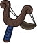ID: 3890**Childhood Sling**I used to get into so much trouble with this thing.<code>buff_upgrade,25,17316 allow_ge:true</code>ID: 3891**Practice Sling**Still good for training my aim. Bolts are expensive, you know.<code>buff_upgrade,87.5,17316 allow_ge:true</code>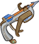ID: 3892**Handy Crossbow**It gets the job done. Now, where did I put my toxins...<code>buff_upgrade,150,17316 allow_ge:true</code>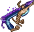ID: 3893**Enchanted Crossbow**Ready for Zhents, monsters, and anything else the world throws at us.<code>buff_upgrade,275,17316 allow_ge:true</code>&nbsp;
        
        
            1
        
        
            Enchanted Crossbow
        
        
            Lead The Way
        
    
    
        
            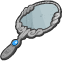ID: 3894**Forgotten Mirror**We found this in the tavern. No telling how long it's been there.<code>buff_upgrade,25,17317 allow_ge:false</code>ID: 3895**Polished Mirror**That's curious. There's some initials on the handle.<code>buff_upgrade,87.5,17317 allow_ge:false</code>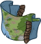ID: 3896**Faerûn Tapestry**Every city, every forest and sea, waiting for us.<code>buff_upgrade,150,17317 allow_ge:false</code>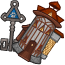ID: 3897**Figurine & Key**I can't be the party's leader without a party to lead. I know that now.<code>buff_upgrade,275,17317 allow_ge:false</code>
        
        
            2
        
        
            Figurine & Key
        
        
            Unleash Uggie
        
    
    
        
            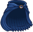ID: 3898**Raggedy Cloak**At least it will keep me warm.<code>buff_upgrade,25,17319 allow_ge:false</code>ID: 3899**Roguish Mantle**The color helps me to blend in with the night.<code>buff_upgrade,87.5,17319 allow_ge:false</code>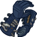ID: 3900**Tools of the Trade**Picks, pliers, you name it. I've got everything I need right here.<code>buff_upgrade,150,17319 allow_ge:false</code>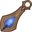ID: 3901**Precious Earring**A gift from my parents. It helps me feel safe.<code>buff_upgrade,275,17319 allow_ge:false</code>
        
        
            3
        
        
            Precious Earring
        
        
            A Plan For Everything
        
    
    
        
            ID: 3902**Costume Mask**I always looked forward to Liar's Night as a kid.<code>buff_upgrade,25,17320 allow_ge:false</code>ID: 3903**Masquerade Mask**Yes, I've been to a ball. No, I was not invited.<code>buff_upgrade,87.5,17320 allow_ge:false</code>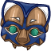ID: 3904**Jade Cat Mask**This lets me see hidden things.<code>buff_upgrade,150,17320 allow_ge:false</code>ID: 3905**Trapfinder's Friend**No trap is safe from me.<code>buff_upgrade,275,17320 allow_ge:false</code>
        
        
            4
        
        
            Trapfinder's Friend
        
        
            Trap Expert
        
    
    
        
            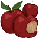ID: 3906**Bad Apples**Mel used to throw these at my head during training.<code>buff_upgrades,25,17321,17322,17323 allow_ge:false</code>ID: 3907**Fresh Fruit**Eventually, I learned to catch them and take a quick bite.<code>buff_upgrades,87.5,17321,17322,17323 allow_ge:false</code>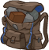ID: 3908**Training Pack**She had me running and diving over rooftops with this on.<code>buff_upgrades,150,17321,17322,17323 allow_ge:false</code>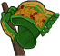ID: 3909**Mel's Scarf**I can't tell you how many times I almost got it. Then, one day, I did.<code>buff_upgrades,275,17321,17322,17323 allow_ge:false</code>
        
        
            5
        
        
            Mel's Scarf
        
        
            All Specialisations (Prestack)
        
    
    
        
            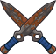ID: 3910**Rusted Dirks**These are one stab away from turning to dust.<code>reduce_ultimate_cooldown,9 allow_ge:false</code>ID: 3911**Battleworn Blades**I found Uggie chewing on these. I suppose that must mean good quality.<code>reduce_ultimate_cooldown,18 allow_ge:false</code>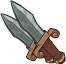ID: 3912**Fine Knives**Impressive steel, but replaceable in a pinch.<code>reduce_ultimate_cooldown,36 allow_ge:false</code>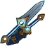ID: 3913**Displacement Daggers**Holding one lets me teleport to the other. I'll be in and out in a flash.<code>reduce_ultimate_cooldown,90 allow_ge:false</code>
        
        
            6
        
        
            Displacement Daggers
        
        
            Ultimate Cooldown Reduction Cap: 501 dull / 251 shiny / 126 golden.
        
    

<em>Item Names and Descriptions</em>

<pre>
Slot 1:
     Childhood Sling: I used to get into so much trouble with this thing.
      Practice Sling: Still good for training my aim. Bolts are expensive, you know.
      Handy Crossbow: It gets the job done. Now, where did I put my toxins...
  Enchanted Crossbow: Ready for Zhents, monsters, and anything else the world throws at us.

Slot 2:
    Forgotten Mirror: We found this in the tavern. No telling how long it's been there.
     Polished Mirror: That's curious. There's some initials on the handle.
     Faerûn Tapestry: Every city, every forest and sea, waiting for us.
      Figurine & Key: I can't be the party's leader without a party to lead. I know that now.

Slot 3:
       Raggedy Cloak: At least it will keep me warm.
      Roguish Mantle: The color helps me to blend in with the night.
  Tools of the Trade: Picks, pliers, you name it. I've got everything I need right here.
    Precious Earring: A gift from my parents. It helps me feel safe.

Slot 4:
        Costume Mask: I always looked forward to Liar's Night as a kid.
     Masquerade Mask: Yes, I've been to a ball. No, I was not invited.
       Jade Cat Mask: This lets me see hidden things.
 Trapfinder's Friend: No trap is safe from me.

Slot 5:
          Bad Apples: Mel used to throw these at my head during training.
         Fresh Fruit: Eventually, I learned to catch them and take a quick bite.
       Training Pack: She had me running and diving over rooftops with this on.
         Mel's Scarf: I can't tell you how many times I almost got it. Then, one day, I did.

Slot 6:
        Rusted Dirks: These are one stab away from turning to dust.
   Battleworn Blades: I found Uggie chewing on these. I suppose that must mean good quality.
         Fine Knives: Impressive steel, but replaceable in a pinch.
Displacement Daggers: Holding one lets me teleport to the other. I'll be in and out in a flash.
</pre>

 

# Feats

This list will only show feats that are going to be available on the release of this champion. The separate [Feats](feats.md) page may show others that could be available later if they exist.

    
        
            **Feat**
        
        
            **Effect**
        
        
            **Source**
        
    
    
        
            ID: 2233**Selflessness (Tess)**I have to care for this group. I have to be the leader they deserve.<code>global_dps_multiplier_mult,10</code>Selflessness
        
        
            10% All Champion Damage
        
        
            Free
        
    
    
        
            ID: 2234**Inspiring Leader (Tess)**There's no need to worry, because I have a plan.<code>global_dps_multiplier_mult,25</code>Inspiring Leader
        
        
            25% All Champion Damage
        
        
            Gold Chest
        
    
    
        
            ID: 2235**Looking Ahead (Tess)**This is just the beginning. Wait and see.<code>buff_upgrade,20,17316</code>Looking Ahead
        
        
            20% Lead The Way
        
        
            Free
        
    
    
        
            ID: 2236**Eyes on the Horizon (Tess)**You know where you went wrong, so you know how to adjust for next time.<code>buff_upgrade,40,17316</code>Eyes on the Horizon
        
        
            40% Lead The Way
        
        
            12,500 Gems
        
    
    
        
            ID: 2237**Great Things Ahead (Tess)**We've got something special. We shouldn't waste it. We can do great things.<code>change_upgrade_targets,17316</code>Great Things Ahead
        
        
            Lead The Way buffs columns in front instead of behind
        
        
            Event Bonus
        
    
    
        
            ID: 2238**Tess Person (Tess)**Ready to help out, girl?<code>buff_upgrade,20,17317</code>Tess Person
        
        
            20% Unleash Uggie
        
        
            Free
        
    
    
        
            ID: 2239**Tess Friend (Tess)**That was fun, wasn't it, girl?<code>buff_upgrade,40,17317</code>Tess Friend
        
        
            40% Unleash Uggie
        
        
            Gold Chest
        
    
    
        
            ID: 2240**Gourmand (Tess)**Uggie has... unusual dietary needs.<code>buff_upgrade,40,17318</code>Gourmand
        
        
            40% Snack Attack
        
        
            12,500 Gems
        
    
    
        
            ID: 2241**Gather Up (Tess)**Alright, Fallbacks. It's time to take this party inside.<code>buff_upgrade,20,17319</code>Gather Up
        
        
            20% A Plan For Everything
        
        
            Free
        
    
    
        
            ID: 2242**Ready for Anything (Tess)**You know I'm always prepared. It's my job to anticipate what the group needs.<code>buff_upgrade,40,17319</code>Ready for Anything
        
        
            40% A Plan For Everything
        
        
            Gold Chest
        
    
    
        
            ID: 2243**Deft Hands (Tess)**Call me Tess. My friend's name is Anson. We're professional infiltrators.<code>buff_upgrade,40,17320</code>Deft Hands
        
        
            40% Trap Expert
        
        
            12,500 Gems
        
    
    
        
            ID: 2244**Strategic Adjustment (Tess)**Would everyone shut up a minute and let me get a plan together?<code>buff_upgrades,40,17321,17322,17323</code>Strategic Adjustment
        
        
            40% All Specialisations (Prestack)
        
        
            Gold Chest
        
    
    
        
            ID: 2245**Tenacious (Tess)**I'm not always going to fail. Someday, I'll earn that scarf.<code>increase_ability_score,con,2</code>Tenacious
        
        
            Stat: +2 Constitution
        
        
            Event Bonus
        
    
    
        
            ID: 2246**Sleeping Toxin (Tess)**Careful. One poke from that and it's lights out.<code>add_hero_tags,0,control global_dps_multiplier_mult,100 change_base_attack,874</code>Sleeping Toxin
        
        
            Counts as Control & 100% All Champion Damage
        
        
            3,830 Platinum 50,000 Gems
        
    

# Legendaries

* Increases the damage of all Champions by 100%.
* Increases the damage of all Female Champions by 125%.
* Increases the damage of all Champions by 30% for each Human Champion in the formation.
* Increases the damage of all Champions by 20% for each Champion with a DEX score of 11 or higher in the formation.
* Increases the damage of all Champions by 20% for each Champion with a CON score of 11 or higher in the formation.
* Increases the damage of all Good Champions by 150%.

<em>DPS Applicable</em>

<pre>
     Arkhan: 3 / 6 (Potentially 4 / 6)
    Artemis: 4 / 6
    Asharra: 4 / 6 (Potentially 5 / 6)
      Azaka: 5 / 6
     Binwin: 4 / 6 (Potentially 5 / 6)
   Birdsong: 4 / 6 (Potentially 5 / 6)
Black Viper: 5 / 6
      Bobby: 5 / 6
 Catti-brie: 6 / 6
     D'hani: 5 / 6 (Potentially 6 / 6)
  Dark Urge: 3 / 6 (Potentially 4 / 6)
    Dhadius: 4 / 6
     Drizzt: 4 / 6 (Potentially 5 / 6)
    Farideh: 5 / 6 (Potentially 6 / 6)
        Fen: 4 / 6 (Potentially 5 / 6)
      Grimm: 5 / 6
     Gromma: 4 / 6 (Potentially 5 / 6)
       Ishi: 5 / 6 (Potentially 6 / 6)
    Jaheira: 4 / 6 (Potentially 5 / 6)
    Jamilah: 5 / 6
   Jarlaxle: 3 / 6 (Potentially 4 / 6)
        Jim: 4 / 6
    Karlach: 5 / 6 (Potentially 6 / 6)
        Kas: 4 / 6
       Kent: 4 / 6 (Potentially 5 / 6)
      Krond: 3 / 6 (Potentially 4 / 6)
       Krux: 4 / 6 (Potentially 5 / 6)
    Lae'zel: 4 / 6 (Potentially 5 / 6)
     Lucius: 3 / 6 (Potentially 4 / 6)
      Makos: 3 / 6 (Potentially 4 / 6)
      Minsc: 5 / 6
      NERDS: 3 / 6 (Potentially 4 / 6)
     Nahara: 4 / 6 (Potentially 5 / 6)
      Nixie: 4 / 6 (Potentially 5 / 6)
     Orisha: 5 / 6 (Potentially 6 / 6)
   Prudence: 4 / 6 (Potentially 5 / 6)
      Rosie: 5 / 6 (Potentially 6 / 6)
      Strix: 5 / 6 (Potentially 6 / 6)
    Torogar: 3 / 6 (Potentially 4 / 6)
     Warden: 3 / 6 (Potentially 4 / 6)
   Windfall: 4 / 6 (Potentially 5 / 6)
       Wren: 5 / 6 (Potentially 6 / 6)
     Yorven: 3 / 6 (Potentially 4 / 6)
      Zorbu: 4 / 6 (Potentially 5 / 6)
</pre>

<em>Non-DPS Applicable</em>

<pre>
          Aeon: 4 / 6 (Potentially 5 / 6)
          Aila: 4 / 6 (Potentially 5 / 6)
       Alyndra: 4 / 6 (Potentially 5 / 6)
       Antrius: 5 / 6
      Astarion: 3 / 6 (Potentially 4 / 6)
         Avren: 3 / 6 (Potentially 4 / 6)
          BBEG: 3 / 6 (Potentially 4 / 6)
       Baeloth: 3 / 6 (Potentially 4 / 6)
      Barrowin: 5 / 6 (Potentially 6 / 6)
       Blooshi: 4 / 6 (Potentially 5 / 6)
          Brig: 5 / 6
          Briv: 4 / 6 (Potentially 5 / 6)
       Bruenor: 4 / 6 (Potentially 5 / 6)
      Calliope: 5 / 6 (Potentially 6 / 6)
       Celeste: 6 / 6
     Certainty: 5 / 6 (Potentially 6 / 6)
        Deekin: 3 / 6 (Potentially 4 / 6)
       Desmond: 5 / 6
         Diana: 6 / 6
           Dob: 4 / 6 (Potentially 5 / 6)
        Donaar: 4 / 6 (Potentially 5 / 6)
    Dragonbait: 4 / 6 (Potentially 5 / 6)
Dungeon Master: 5 / 6
      Dynaheir: 6 / 6
        Egbert: 4 / 6 (Potentially 5 / 6)
      Ellywick: 4 / 6 (Potentially 5 / 6)
          Eric: 5 / 6
       Evandra: 4 / 6 (Potentially 5 / 6)
        Evelyn: 6 / 6
     Ezmerelda: 6 / 6
        Freely: 4 / 6 (Potentially 5 / 6)
          Gale: 4 / 6
       Gazrick: 4 / 6 (Potentially 5 / 6)
        Halsin: 4 / 6 (Potentially 5 / 6)
          Hank: 5 / 6
       Havilar: 5 / 6 (Potentially 6 / 6)
         Imoen: 6 / 6
      K'thriss: 3 / 6 (Potentially 4 / 6)
         Kalix: 3 / 6 (Potentially 4 / 6)
         Korth: 3 / 6 (Potentially 4 / 6)
         Krull: 3 / 6 (Potentially 4 / 6)
        Krydle: 4 / 6 (Potentially 5 / 6)
       Lazaapz: 4 / 6 (Potentially 5 / 6)
         Mehen: 4 / 6 (Potentially 5 / 6)
          Melf: 4 / 6 (Potentially 5 / 6)
      Merilwen: 4 / 6 (Potentially 5 / 6)
      Minthara: 4 / 6 (Potentially 5 / 6)
         Miria: 4 / 6 (Potentially 5 / 6)
        Môrgæn: 4 / 6 (Potentially 5 / 6)
        Nayeli: 6 / 6
         Nerys: 6 / 6
        Nordom: 3 / 6 (Potentially 4 / 6)
          Nova: 5 / 6 (Potentially 6 / 6)
          Omin: 3 / 6 (Potentially 4 / 6)
        Orkira: 5 / 6 (Potentially 6 / 6)
       Paultin: 4 / 6
      Penelope: 5 / 6 (Potentially 6 / 6)
        Presto: 5 / 6
         Pwent: 4 / 6 (Potentially 5 / 6)
        Qillek: 4 / 6 (Potentially 5 / 6)
         Regis: 3 / 6 (Potentially 4 / 6)
          Reya: 6 / 6
          Rust: 3 / 6 (Potentially 4 / 6)
        Selise: 5 / 6
        Sentry: 5 / 6 (Potentially 6 / 6)
     Sgt. Knox: 5 / 6
   Shadowheart: 4 / 6 (Potentially 5 / 6)
         Shaka: 4 / 6 (Potentially 5 / 6)
       Shandie: 5 / 6 (Potentially 6 / 6)
        Sheila: 6 / 6
      Sisaspia: 4 / 6 (Potentially 5 / 6)
        Solaak: 4 / 6 (Potentially 5 / 6)
         Spurt: 3 / 6 (Potentially 4 / 6)
         Stoki: 4 / 6 (Potentially 5 / 6)
   Strongheart: 5 / 6
         Talin: 4 / 6 (Potentially 5 / 6)
          Tess: 5 / 6
      Thellora: 4 / 6 (Potentially 5 / 6)
        Turiel: 4 / 6 (Potentially 5 / 6)
         Tyril: 4 / 6 (Potentially 5 / 6)
       Ulkoria: 5 / 6 (Potentially 6 / 6)
       Umberto: 5 / 6
         Uriah: 5 / 6
     Valentine: 4 / 6 (Potentially 5 / 6)
            Vi: 5 / 6 (Potentially 6 / 6)
       Viconia: 4 / 6 (Potentially 5 / 6)
      Vin Ursa: 4 / 6 (Potentially 5 / 6)
        Virgil: 4 / 6 (Potentially 5 / 6)
      Vlithryn: 5 / 6 (Potentially 6 / 6)
          Volo: 5 / 6
      Voronika: 4 / 6 (Potentially 5 / 6)
        Widdle: 4 / 6 (Potentially 5 / 6)
       Wulfgar: 5 / 6
          Wyll: 5 / 6
        Xander: 5 / 6
      Xerophon: 3 / 6 (Potentially 4 / 6)
</pre>

 

# Adventures and Variants

**Unlock Adventure: Party Crashers (Tess)** (Complete Area 50)
> Save Waterdeep from the chaos of a Founders' Day gone awry.

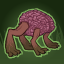 **Variant 1: The Deck of Many Intellect Devourers** (Complete Area 75)
> Tess starts in the formation. She can't be moved or removed.  
> Only Tess and Champions buffed by both her and Uggie can deal damage.  
> 1-2 Intellect Devourers spawn with each wave. They don't drop gold nor count towards quest progress.  
> Getting to Know Tess and Uggie: Tess increases the damage of Champions in the columns behind her, while Uggie increases the damage of Champions not next to Uggie. Place your damage dealers to take advantage of both buffs!

 **Variant 2: Tess's Treasure Seekers** (Complete Area 125)
> Tess starts in the formation. She can be moved but not removed.  
> After area 10, Gold Find is reduced by 50% for each Champion role NOT present in the formation, stacking multiplicatively. At area 400, this increases to 99% for each missing role.  
> Getting to Know Tess: Tess has a plan for every contingency, and she prefers to work with a well-rounded team that features different roles, such as Support, Healing, and Gold Find. Build a formation with the most diverse roles for the best results!

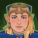 **Variant 3: The Leader They Deserve** (Complete Area 175)
> Tess starts in the formation. She can be moved, but not removed.  
> You may only use Champions that are Rogues, have ranged attacks, are Unaffiliated, or belong to The Fallbacks affiliation.  
> The Zhentarim and Purple Wormlings are fighting each other! One of each spawn with each wave, their speed is increased by 200%, and they don't drop gold nor count towards quest progress.  
> Whenever you kill Zhentarim or Purple Wormlings, that side gets weaker while the other side gets stronger.  
> Getting to know Tess: Build a formation that makes the best use of your specialization choice for Tess!

# Other Champion Images

    
        
            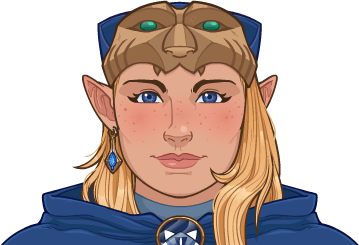Console Portrait
        
    
    
        
            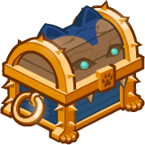Gold Chest Icon
        
        
            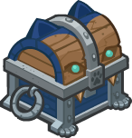Silver Chest Icon
        
    

[Back to Top](#top)

*Last Modified: {{ site.time }}*