[Back to Main](index.md)

    
        
            
        
        
            Portrait
        
    
    
        
            
        
        
            Model
        
    

# Trixie the Pixie

Trixie the Pixie has been a forgettable nuisance for the Champions for a long time, often appearing astride some charmed creature and always up to some mischief. Ambitious and daring, Trixie desperately grasps at a life larger than she's been given, and blames the Champions for their constant meddling in her affairs. Driven to desperation by her many failed attempts at seizing power and influence, Trixie sets out to try a new scheme. She's seen firsthand that the Champions are always hiring. If she can't beat them, she'll join them!

# Basic Information

Trixie the Pixie will be a new champion in the Dragondown event on 3 June 2026.

    
        
            **Seat**:
        
        
            8
        
        
            **Stat**
        
        
            **Value**
        
        
            **Day 1 Trials**
        
        
            **Patrons**
        
    
    
        
            **Species**:
        
        
            Fairy
        
        
            **Strength**:
        
        
            2
        
        
            -
        
        
            -
        
    
    
        
            **Class**:
        
        
            Druid
        
        
            **Dexterity**:
        
        
            20
        
        
            Yes
        
        
            -
        
    
    
        
            **Roles**:
        
        
            Support / Debuff / Control
        
        
            **Constitution**:
        
        
            8
        
        
            -
        
        
            -
        
    
    
        
            **Age**:
        
        
            19
        
        
            **Intelligence**:
        
        
            10
        
        
            Yes
        
        
            -
        
    
    
        
            **Gender**:
        
        
            Female
        
        
            **Wisdom**:
        
        
            14
        
        
            Yes
        
        
            Elminster
        
    
    
        
            **Alignment**:
        
        
            Chaotic Neutral
        
        
            **Charisma**:
        
        
            15
        
        
            Yes
        
        
            &nbsp;
        
    
    
        
            **Affiliation**:
        
        
            -
        
        
            **Total**:
        
        
            69
        
        
            Champion ID:
        
        
            176
        
    

# Formation

    <svg xmlns="http://www.w3.org/2000/svg" id="Trixie" fill="#aaa" data-formationName="Trixie" data-campaignName="Dragondown" width="300" height="120"><circle cx="175" cy="25" r="15"/><circle cx="175" cy="105" r="15"/><circle cx="135" cy="45" r="15"/><circle cx="135" cy="85" r="15"/><circle cx="95" cy="65" r="15"/><circle cx="95" cy="105" r="15"/><circle cx="55" cy="45" r="15"/><circle cx="55" cy="85" r="15"/><circle cx="15" cy="25" r="15"/><circle cx="15" cy="105" r="15"/><text x="205" y="25" fill="#dcdcdc" font-size="25" font-family="Arial" font-weight="bold">Trixie</text><text x="205" y="65" fill="#dcdcdc" font-size="15" font-family="Arial" font-weight="bold">Dragondown</text></svg>

# Attacks

 **Base Attack: Pixie Charge** (Melee)
> A pixie subordinate dives in and stabs a random enemy for one hit.  
> Cooldown: 6s (Cap 1.5s)

<em>Raw Data</em>

<pre>
{
    "id": 968,
    "name": "Pixie Charge",
    "description": "One of Trixie's Pixie Subordinates stabs a random enemy for one hit.",
    "long_description": "A pixie subordinate dives in and stabs a random enemy for one hit.",
    "graphic_id": 0,
    "target": "random",
    "num_targets": 1,
    "aoe_radius": 0,
    "damage_modifier": 1,
    "cooldown": 6,
    "animations": [
        {
            "type": "ranged_attack",
            "projectile": "pd_generic_projectile",
            "shoot_frame": 10,
            "override_start_position": true,
            "override_start_pos_x": -100,
            "override_start_pos_y": 300,
            "projectile_delay": 0.1,
            "projectile_count": 1,
            "shoot_sound": 149,
            "hit_sound": 133,
            "projectile_details": {
                "hash": "trixie_pixie",
                "percent_height_offset": -12,
                "percent_height_offset_variance": 30,
                "tween_func": "quad_out",
                "projectile_speed": 1400,
                "projectile_graphic_id": 29061,
                "impact_graphic_id": 10923,
                "impact_offset_y": -50,
                "fly_from_top_left": true
            },
            "hold_shoot_frame": true
        }
    ],
    "tags": [
        "melee"
    ],
    "damage_types": [
        "melee"
    ]
}
</pre>

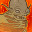 **Ultimate Attack: Call For Dev** (Level: 0)
> Trixie flies off to get Dev the Devourer to consume the healthiest non-boss enemy, or otherwise deal an ultimate hit to a boss.  
> Cooldown: 140s (Cap 35s)

<em>Raw Data</em>

<pre>
{
    "id": 979,
    "name": "Call For Dev",
    "description": "Trixie calls for Dev the Devourer to consume the healthiest non-boss enemy.",
    "long_description": "Trixie flies off to get Dev the Devourer to consume the healthiest non-boss enemy, or otherwise deal an ultimate hit to a boss.",
    "graphic_id": 29135,
    "target": "highest_health_deprio_bosses_exclude_blockers",
    "num_targets": 1,
    "aoe_radius": 0,
    "damage_modifier": 0.03,
    "cooldown": 140,
    "animations": [
        {
            "type": "trixie_ultimate",
            "devourers": 1,
            "devourer_speed": 6
        }
    ],
    "tags": [
        "melee",
        "ultimate"
    ],
    "damage_types": [
        "melee"
    ]
}
</pre>

# Abilities

 **Dancing Lights** (Level: 30)
> Trixie increases the damage of adjacent Champions by 100%.

<em>Upgrade Data</em>

<pre>
Upgrades:
       80: 100%
      130: 100%
      190: 100%
      210: 100%
      280: 100%
      380: 100%
      470: 100%
      570: 100%
      670: 100%
      770: 100%
      860: 100%
      960: 100%
    1,060: 100%
    1,150: 100%
    1,250: 100%
    1,350: 100%
    1,440: 100%
    1,540: 100%
    1,640: 100%
    1,730: 100%
    1,790: 100%

    Total Upgrade Bonus: 2.10e08%
</pre>

<em>Raw Data</em>

<pre>
{
    "id": 19686,
    "hero_id": 176,
    "required_level": 30,
    "required_upgrade_id": 0,
    "upgrade_type": "unlock_ability",
    "effect": "effect_def,2726",
    "static_dps_mult": null,
    "default_enabled": 1,
    "name": "Dancing Lights",
    "tip_text": "Trixie's Dancing Lights increases the damage of adjacent Champions."
}
{
    "id": 2726,
    "flavour_text": "",
    "description": {
        "desc": "Trixie increases the damage of adjacent Champions by $amount%."
    },
    "effect_keys": [
        {
            "effect_string": "hero_dps_multiplier_mult,100",
            "targets": [
                "adj"
            ]
        }
    ],
    "requirements": "",
    "graphic_id": 29127,
    "large_graphic_id": 29119,
    "properties": {
        "is_formation_ability": true,
        "owner_use_outgoing_description": true,
        "formation_circle_icon": false
    }
}
{
    "id": 19694,
    "hero_id": 176,
    "required_level": 80,
    "required_upgrade_id": 0,
    "upgrade_type": "upgrade_ability",
    "effect": "buff_upgrade,100,19686",
    "static_dps_mult": null,
    "default_enabled": 1,
    "name": ""
}
{
    "id": 19812,
    "hero_id": 176,
    "required_level": 130,
    "required_upgrade_id": 0,
    "upgrade_type": "upgrade_ability",
    "effect": "buff_upgrade,100,19686",
    "static_dps_mult": null,
    "default_enabled": 1,
    "name": ""
}
{
    "id": 19815,
    "hero_id": 176,
    "required_level": 190,
    "required_upgrade_id": 0,
    "upgrade_type": "upgrade_ability",
    "effect": "buff_upgrade,100,19686",
    "static_dps_mult": null,
    "default_enabled": 1,
    "name": ""
}
{
    "id": 19817,
    "hero_id": 176,
    "required_level": 210,
    "required_upgrade_id": 0,
    "upgrade_type": "upgrade_ability",
    "effect": "buff_upgrade,100,19686",
    "static_dps_mult": null,
    "default_enabled": 1,
    "name": ""
}
{
    "id": 19820,
    "hero_id": 176,
    "required_level": 280,
    "required_upgrade_id": 0,
    "upgrade_type": "upgrade_ability",
    "effect": "buff_upgrade,100,19686",
    "static_dps_mult": null,
    "default_enabled": 1,
    "name": ""
}
{
    "id": 19825,
    "hero_id": 176,
    "required_level": 380,
    "required_upgrade_id": 0,
    "upgrade_type": "upgrade_ability",
    "effect": "buff_upgrade,100,19686",
    "static_dps_mult": null,
    "default_enabled": 1,
    "name": ""
}
{
    "id": 19828,
    "hero_id": 176,
    "required_level": 470,
    "required_upgrade_id": 0,
    "upgrade_type": "upgrade_ability",
    "effect": "buff_upgrade,100,19686",
    "static_dps_mult": null,
    "default_enabled": 1,
    "name": ""
}
{
    "id": 19832,
    "hero_id": 176,
    "required_level": 570,
    "required_upgrade_id": 0,
    "upgrade_type": "upgrade_ability",
    "effect": "buff_upgrade,100,19686",
    "static_dps_mult": null,
    "default_enabled": 1,
    "name": ""
}
{
    "id": 19834,
    "hero_id": 176,
    "required_level": 670,
    "required_upgrade_id": 0,
    "upgrade_type": "upgrade_ability",
    "effect": "buff_upgrade,100,19686",
    "static_dps_mult": null,
    "default_enabled": 1,
    "name": ""
}
{
    "id": 19838,
    "hero_id": 176,
    "required_level": 770,
    "required_upgrade_id": 0,
    "upgrade_type": "upgrade_ability",
    "effect": "buff_upgrade,100,19686",
    "static_dps_mult": null,
    "default_enabled": 1,
    "name": ""
}
{
    "id": 19841,
    "hero_id": 176,
    "required_level": 860,
    "required_upgrade_id": 0,
    "upgrade_type": "upgrade_ability",
    "effect": "buff_upgrade,100,19686",
    "static_dps_mult": null,
    "default_enabled": 1,
    "name": ""
}
{
    "id": 19844,
    "hero_id": 176,
    "required_level": 960,
    "required_upgrade_id": 0,
    "upgrade_type": "upgrade_ability",
    "effect": "buff_upgrade,100,19686",
    "static_dps_mult": null,
    "default_enabled": 1,
    "name": ""
}
{
    "id": 19847,
    "hero_id": 176,
    "required_level": 1060,
    "required_upgrade_id": 0,
    "upgrade_type": "upgrade_ability",
    "effect": "buff_upgrade,100,19686",
    "static_dps_mult": null,
    "default_enabled": 1,
    "name": ""
}
{
    "id": 19850,
    "hero_id": 176,
    "required_level": 1150,
    "required_upgrade_id": 0,
    "upgrade_type": "upgrade_ability",
    "effect": "buff_upgrade,100,19686",
    "static_dps_mult": null,
    "default_enabled": 1,
    "name": ""
}
{
    "id": 19852,
    "hero_id": 176,
    "required_level": 1250,
    "required_upgrade_id": 0,
    "upgrade_type": "upgrade_ability",
    "effect": "buff_upgrade,100,19686",
    "static_dps_mult": null,
    "default_enabled": 1,
    "name": ""
}
{
    "id": 19854,
    "hero_id": 176,
    "required_level": 1350,
    "required_upgrade_id": 0,
    "upgrade_type": "upgrade_ability",
    "effect": "buff_upgrade,100,19686",
    "static_dps_mult": null,
    "default_enabled": 1,
    "name": ""
}
{
    "id": 19856,
    "hero_id": 176,
    "required_level": 1440,
    "required_upgrade_id": 0,
    "upgrade_type": "upgrade_ability",
    "effect": "buff_upgrade,100,19686",
    "static_dps_mult": null,
    "default_enabled": 1,
    "name": ""
}
{
    "id": 19858,
    "hero_id": 176,
    "required_level": 1540,
    "required_upgrade_id": 0,
    "upgrade_type": "upgrade_ability",
    "effect": "buff_upgrade,100,19686",
    "static_dps_mult": null,
    "default_enabled": 1,
    "name": ""
}
{
    "id": 19860,
    "hero_id": 176,
    "required_level": 1640,
    "required_upgrade_id": 0,
    "upgrade_type": "upgrade_ability",
    "effect": "buff_upgrade,100,19686",
    "static_dps_mult": null,
    "default_enabled": 1,
    "name": ""
}
{
    "id": 19863,
    "hero_id": 176,
    "required_level": 1730,
    "required_upgrade_id": 0,
    "upgrade_type": "upgrade_ability",
    "effect": "buff_upgrade,100,19686",
    "static_dps_mult": null,
    "default_enabled": 1,
    "name": ""
}
{
    "id": 19866,
    "hero_id": 176,
    "required_level": 1790,
    "required_upgrade_id": 0,
    "upgrade_type": "upgrade_ability",
    "effect": "buff_upgrade,100,19686",
    "static_dps_mult": null,
    "default_enabled": 1,
    "name": ""
}
</pre>

 **Small Pranks** (Level: 60)
> Trixie increases the effect of Dancing Lights by 100% for each Small Champion in the formation, stacking multiplicatively. Small Champions are fairy, gnome, goblin, halfling, kender, kobold, and plasmoid Champions.

ⓘ *Note: This ability is prestack.*

<em>Raw Data</em>

<pre>
{
    "id": 19687,
    "hero_id": 176,
    "required_level": 60,
    "required_upgrade_id": 0,
    "upgrade_type": "unlock_ability",
    "effect": "effect_def,2727",
    "static_dps_mult": null,
    "default_enabled": 1,
    "name": "Small Pranks",
    "tip_text": "Trixie increases her main buff for each Small Champion in the formation, like halflings and gnomes. Additionally, she shrinks the two Champions behind her in the formation to also count as small!"
}
{
    "id": 2727,
    "flavour_text": "",
    "description": {
        "desc": "Trixie increases the effect of Dancing Lights by $amount% for each Small Champion in the formation, stacking multiplicatively. Small Champions are fairy, gnome, goblin, halfling, kender, kobold, and plasmoid Champions."
    },
    "effect_keys": [
        {
            "effect_string": "pre_stack,100",
            "skip_effect_key_desc": true
        },
        {
            "effect_string": "buff_upgrade,0,19686",
            "stack_func": "per_hero_attribute",
            "amount_func": "mult",
            "amount_expr": "upgrade_amount(19687,0)",
            "amount_updated_listeners": [
                "slot_changed",
                "upgrade_unlocked",
                "feat_changed"
            ],
            "per_hero_expr": "HasTag(`small`)",
            "off_when_benched": true,
            "show_bonus": true
        }
    ],
    "requirements": "",
    "graphic_id": 29130,
    "large_graphic_id": 29122,
    "properties": {
        "is_formation_ability": true,
        "owner_use_outgoing_description": true,
        "indexed_effect_properties": true,
        "per_effect_index_bonuses": true,
        "default_bonus_index": 0
    }
}
</pre>

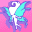 **Tricksy Pixie** (Level: 90)
> Every time a Champion other than Trixie attacks, Trixie gains a Trick stack. When Trixie attacks, she expends all her Trick stacks to slow up to that number of random enemies by 50% for 10 seconds. If she has more Trick stacks than there are enemies, then she can use the extra stacks to stun that number of random enemies for 3 seconds. Additionally, one extra Pixie Subordinate attacks for every 5 Trick stacks expended. Trixie can not have more than 50 Trick stacks at once.

<em>Raw Data</em>

<pre>
{
    "id": 19688,
    "hero_id": 176,
    "required_level": 90,
    "required_upgrade_id": 0,
    "upgrade_type": "unlock_ability",
    "effect": "effect_def,2728",
    "static_dps_mult": null,
    "default_enabled": 1,
    "name": "Tricksy Pixie"
}
{
    "id": 2728,
    "flavour_text": "",
    "description": {
        "desc": "Every time a Champion other than Trixie attacks, Trixie gains a Trick stack. When Trixie attacks, she expends all her Trick stacks to slow up to that number of random enemies by $(slow_amount)% for $(slow_duration) seconds. If she has more Trick stacks than there are enemies, then she can use the extra stacks to stun that number of random enemies for $(stun_duration) seconds. Additionally, one extra Pixie Subordinate attacks for every 5 Trick stacks expended. Trixie can not have more than $(max_stacks) Trick stacks at once."
    },
    "effect_keys": [
        {
            "effect_string": "trixie_tricksy_pixie",
            "off_when_benched": true,
            "slow_duration": 10,
            "stun_duration": 3,
            "slow_amount": 50,
            "max_stacks": 50,
            "stacks_on_trigger": "other_champion_attack",
            "show_stacks": true,
            "stack_title": "Trick Stacks",
            "slow_effect": {
                "effect_string": "monster_speed_reduce,0",
                "active_graphic_id": 29059,
                "active_graphic_y": 20,
                "use_collection_source": false,
                "for_time": 10
            },
            "debuff_effects": {
                "effect_string": "increase_monster_damage,0",
                "amount_expr": "upgrade_amount(19689,0)",
                "stacks_on_reapply": true,
                "manual_stacking": true,
                "stacks_multiply": true,
                "use_collection_source": true,
                "stack_across_effects": true,
                "for_time": 5
            },
            "attack_ids": [
                969,
                970,
                971,
                972,
                973,
                974,
                975,
                976,
                977,
                978,
                980
            ]
        }
    ],
    "requirements": "",
    "graphic_id": 29131,
    "large_graphic_id": 29123,
    "properties": {
        "is_formation_ability": true,
        "owner_use_outgoing_description": true,
        "formation_circle_icon": false,
        "per_effect_index_bonuses": true
    }
}
</pre>

 **Call for Dev** (Level: 100)
> Trixie flies off to get Dev the Devourer to consume the healthiest non-boss enemy, or otherwise deal an ultimate hit to a boss.

<em>Raw Data</em>

<pre>
{
    "id": 19685,
    "hero_id": 176,
    "required_level": 100,
    "required_upgrade_id": 0,
    "upgrade_type": "unlock_ultimate",
    "effect": "effect_def,2737",
    "static_dps_mult": null,
    "default_enabled": 1,
    "name": "Call for Dev"
}
{
    "id": 2737,
    "flavour_text": "",
    "description": {
        "desc": "Trixie flies off to get Dev the Devourer to consume the healthiest non-boss enemy, or otherwise deal an ultimate hit to a boss."
    },
    "effect_keys": [
        {
            "effect_string": "set_ultimate_attack,979"
        }
    ],
    "requirements": "",
    "graphic_id": 29135,
    "large_graphic_id": 29135,
    "properties": {
        "is_formation_ability": true,
        "owner_use_outgoing_description": true,
        "indexed_effect_properties": true,
        "per_effect_index_bonuses": true,
        "default_bonus_index": 0
    }
}
</pre>

 **Debilitating Dust** (Level: 120)
> If Trixie still has Trick stacks left after stunning all enemies on the screen, she uses the extra stacks to increase the damage a random enemy takes by 100% for 5 seconds. These debuffs can apply to the same enemy multiple times and stack multiplicatively.

<em>Raw Data</em>

<pre>
{
    "id": 19689,
    "hero_id": 176,
    "required_level": 120,
    "required_upgrade_id": 0,
    "upgrade_type": "unlock_ability",
    "effect": "effect_def,2729",
    "static_dps_mult": null,
    "default_enabled": 1,
    "name": "Debilitating Dust"
}
{
    "id": 2729,
    "flavour_text": "",
    "description": {
        "desc": "If Trixie still has Trick stacks left after stunning all enemies on the screen, she uses the extra stacks to increase the damage a random enemy takes by $amount% for $(debilitate_time) seconds. These debuffs can apply to the same enemy multiple times and stack multiplicatively."
    },
    "effect_keys": [
        {
            "effect_string": "trixie_debilitating_dust,100",
            "off_when_benched": true,
            "debilitate_time": 5
        }
    ],
    "requirements": "",
    "graphic_id": 29128,
    "large_graphic_id": 29120,
    "properties": {
        "is_formation_ability": true,
        "owner_use_outgoing_description": true,
        "formation_circle_icon": false
    }
}
</pre>

 **Ultimate Undoing** (Level: 150)
> Every time a Champion other than Trixie uses their ultimate ability, Trixie gains a Scheming stack, up to a maximum of 10 stacks. When Trixie uses her ultimate ability, she expends her Scheming stacks to increase the effect of Dancing Lights by 100% per stack, stacking multiplicatively. This buff lasts until the area is changed or until Trixie uses her ultimate again, whichever comes first.

ⓘ *Note: This ability is prestack.*

<em>Raw Data</em>

<pre>
{
    "id": 19690,
    "hero_id": 176,
    "required_level": 150,
    "required_upgrade_id": 0,
    "upgrade_type": "unlock_ability",
    "effect": "effect_def,2730",
    "static_dps_mult": null,
    "default_enabled": 1,
    "name": "Ultimate Undoing"
}
{
    "id": 2730,
    "flavour_text": "",
    "description": {
        "desc": "Every time a Champion other than Trixie uses their ultimate ability, Trixie gains a Scheming stack, up to a maximum of $(max_stacks___2) stacks. When Trixie uses her ultimate ability, she expends her Scheming stacks to increase the effect of Dancing Lights by $amount% per stack, stacking multiplicatively. This buff lasts until the area is changed or until Trixie uses her ultimate again, whichever comes first."
    },
    "effect_keys": [
        {
            "effect_string": "pre_stack,100"
        },
        {
            "effect_string": "buff_upgrade,0,19686",
            "amount_expr": "upgrade_amount(19690,0)",
            "max_stacks": 10,
            "stacks_on_trigger": "will_stack_manually",
            "off_when_benched": true,
            "show_bonus": true,
            "apply_manually": true,
            "stack_title": "Current Stacks",
            "stacks_multiply": true
        },
        {
            "effect_string": "trixie_ultimate_undoing",
            "max_stacks": 10,
            "stacks_on_trigger": "will_stack_manually",
            "off_when_benched": true,
            "show_stacks": true,
            "stack_title": "Scheming Stacks",
            "buff_indicies": [
                1
            ]
        }
    ],
    "requirements": "",
    "graphic_id": 29132,
    "large_graphic_id": 29124,
    "properties": {
        "is_formation_ability": true,
        "owner_use_outgoing_description": true,
        "indexed_effect_properties": true,
        "per_effect_index_bonuses": true,
        "default_bonus_index": 0,
        "retain_on_slot_changed": true
    }
}
</pre>

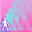 **Shrinking Dust** (Level: 180)
> Champions in the formation slots directly behind Trixie are sprinkled with Shrinking Dust, which reduces them in size by 50% and makes them count as Small for abilities and variant restrictions that care about size. Additionally, all Champions that share a species with any Champion affected by Shrinking Dust are also sprinkled with Shrinking Dust.

<em>Raw Data</em>

<pre>
{
    "id": 19691,
    "hero_id": 176,
    "required_level": 180,
    "required_upgrade_id": 0,
    "upgrade_type": "unlock_ability",
    "effect": "effect_def,2731",
    "static_dps_mult": null,
    "default_enabled": 1,
    "name": "Shrinking Dust"
}
{
    "id": 2731,
    "flavour_text": "",
    "description": {
        "desc": "Champions in the formation slots directly behind Trixie are sprinkled with Shrinking Dust, which reduces them in size by 50% and makes them count as Small for abilities and variant restrictions that care about size. Additionally, all Champions that share a species with any Champion affected by Shrinking Dust are also sprinkled with Shrinking Dust."
    },
    "effect_keys": [
        {
            "effect_string": "trixie_shrinking_dust",
            "off_when_benched": true,
            "overlay_graphic_id": 29058,
            "underlay_graphic_id": 29059,
            "targets": [
                "adj_behind_propagate_species"
            ],
            "retarget_when_any_hero_slot_changed": true,
            "retarget_when_any_hero_tags_changed": true
        },
        {
            "off_when_benched": true,
            "effect_string": "reduce_hero_scale,50",
            "targets": [
                "adj_behind_propagate_species"
            ],
            "skip_effect_key_desc": true,
            "retarget_when_any_hero_slot_changed": true,
            "retarget_when_any_hero_tags_changed": true,
            "retarget_when_any_feat_changed": true
        },
        {
            "off_when_benched": true,
            "effect_string": "add_hero_tags,0,small",
            "targets": [
                "adj_behind_propagate_species"
            ],
            "skip_effect_key_desc": true,
            "retarget_when_any_hero_slot_changed": true,
            "retarget_when_any_hero_tags_changed": true,
            "retarget_when_any_feat_changed": true
        },
        {
            "effect_string": "do_nothing",
            "off_when_benched": true,
            "stack_func": "per_hero_attribute",
            "per_hero_expr": "HasEffect(`trixie_shrinking_dust`)",
            "show_stacks": true,
            "stack_title": "Affected Champions",
            "retarget_when_any_hero_slot_changed": true,
            "retarget_when_any_hero_tags_changed": true
        }
    ],
    "requirements": "",
    "graphic_id": 29129,
    "large_graphic_id": 29121,
    "properties": {
        "is_formation_ability": true,
        "formation_circle_icon": false
    }
}
</pre>

# Specialisations

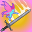 **Faster, Friends** (Level: 160)
> The damage of all Champions is increased by 100%. When a Familiar clicks on an enemy, it also reduces the Base Attack Cooldown of a random Champion other than Trixie by 100 seconds.

<em>Raw Data</em>

<pre>
{
    "id": 19692,
    "hero_id": 176,
    "required_level": 160,
    "required_upgrade_id": 0,
    "upgrade_type": "unlock_ability",
    "effect": "effect_def,2732",
    "static_dps_mult": null,
    "default_enabled": 1,
    "name": "Faster, Friends",
    "specialization_name": "Faster, Friends",
    "specialization_description": "Trixie directs the familiars to help the other Champions attack more often.",
    "specialization_graphic_id": 29133
}
{
    "id": 2732,
    "flavour_text": "",
    "description": {
        "desc": "The damage of all Champions is increased by $amount%. When a Familiar clicks on an enemy, it also reduces the Base Attack Cooldown of a random Champion other than Trixie by $cooldown_reduction seconds."
    },
    "effect_keys": [
        {
            "off_when_benched": true,
            "effect_string": "hero_dps_multiplier_mult,100",
            "targets": [
                "all"
            ]
        },
        {
            "off_when_benched": true,
            "effect_string": "trixie_faster_friends",
            "cooldown_reduction": 0.2
        }
    ],
    "requirements": "",
    "graphic_id": 29133,
    "large_graphic_id": 29133,
    "properties": {
        "is_formation_ability": true,
        "owner_use_outgoing_description": true,
        "formation_circle_icon": false
    }
}
</pre>

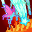 **Ultimate Friends** (Level: 160)
> The ultimate damage of all Champions is increased by 400%. When a Familiar clicks on a boss enemy, it also reduces the current Ultimate Attack Cooldown of a random Champion other than Trixie whose ultimate is on cooldown by 400 seconds.

<em>Raw Data</em>

<pre>
{
    "id": 19693,
    "hero_id": 176,
    "required_level": 160,
    "required_upgrade_id": 0,
    "upgrade_type": "unlock_ability",
    "effect": "effect_def,2733",
    "static_dps_mult": null,
    "default_enabled": 1,
    "name": "Ultimate Friends",
    "specialization_name": "Ultimate Friends",
    "specialization_description": "Trixie commands the familiars to boost the damage and speed of your formation's Ultimate attacks.",
    "specialization_graphic_id": 29134
}
{
    "id": 2733,
    "flavour_text": "",
    "description": {
        "desc": "The ultimate damage of all Champions is increased by $amount%. When a Familiar clicks on a boss enemy, it also reduces the current Ultimate Attack Cooldown of a random Champion other than Trixie whose ultimate is on cooldown by $ult_reduction seconds."
    },
    "effect_keys": [
        {
            "off_when_benched": true,
            "effect_string": "buff_ultimate,400",
            "targets": [
                "all"
            ]
        },
        {
            "off_when_benched": true,
            "effect_string": "trixie_ultimate_friends",
            "ult_reduction": 0.2
        }
    ],
    "requirements": "",
    "graphic_id": 29134,
    "large_graphic_id": 29134,
    "properties": {
        "is_formation_ability": true,
        "owner_use_outgoing_description": true,
        "formation_circle_icon": false
    }
}
</pre>

# Items

    
        
            **Icons**
        
        
            **Slot**
        
        
            **Epic Name**
        
        
            **Effect**
        
    
    
        
            ID: 4214**Training Saddle**Yes, I can fly. I just really like animals, okay?  All Champions damage +10%.<code>global_dps_multiplier_mult,10 allow_ge:true</code>ID: 4215**Hare Harness**I like their long ears and impossible dream of flight.  All Champions damage +65%.<code>global_dps_multiplier_mult,65 allow_ge:true</code>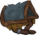ID: 4216**Ursine Saddle**For riding bear-back! Get it? Ugh, nevermind.  All Champions damage +120%.<code>global_dps_multiplier_mult,120 allow_ge:true</code>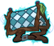ID: 4217**Seat of Power**Dev is short for Devorah, by the way. Don't call her Devorah.  All Champions damage +230%.<code>global_dps_multiplier_mult,230 allow_ge:true</code>&nbsp;
        
        
            1
        
        
            Seat of Power
        
        
            All Champions damage +230%.
        
    
    
        
            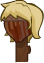ID: 4222**Regretful Hairpiece**So tacky. I hate this. Can't believe I ever wore it.  Increases the effect of Trixie's Dancing Lights ability by 25%.<code>buff_upgrade,25,19686 allow_ge:true</code>ID: 4223**Fickle Fashion**On second thought, it might be just what I'm feeling today!  Increases the effect of Trixie's Dancing Lights ability by 87.5%.<code>buff_upgrade,87.5,19686 allow_ge:true</code>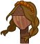ID: 4224**Wig of Whimsy**This one changes both color and style at random. It's so much fun.  All Champions damage +120%.<code>global_dps_multiplier_mult,120 allow_ge:true</code>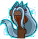ID: 4225**Perfect Postiche**I'm in my 'Archfey' era.  Increases the effect of Trixie's Dancing Lights ability by 275%.<code>buff_upgrade,275,19686 allow_ge:true</code>&nbsp;
        
        
            2
        
        
            Perfect Postiche
        
        
            Increases the effect of Trixie's Dancing Lights ability by 275%.
        
    
    
        
            ID: 4206**Antiquated Attire**Leaves are so last season.  Increases the effect of Trixie's Small Pranks ability by 10%. (Prestack)<code>buff_upgrade,10,19687 allow_ge:false</code>ID: 4207**Upcycled Dress**Hmm. I'll make it work.  Increases the effect of Trixie's Small Pranks ability by 30%. (Prestack)<code>buff_upgrade,30,19687 allow_ge:false</code>ID: 4208**Stylish Shift**Yes, that is real butterfly wing. No touching.  Increases the effect of Trixie's Small Pranks ability by 50%. (Prestack)<code>buff_upgrade,50,19687 allow_ge:false</code>ID: 4209**Diva Debut**The ultimate trick to looking good? Confidence.  Increases the effect of Trixie's Small Pranks ability by 100%. (Prestack)<code>buff_upgrade,100,19687 allow_ge:false</code>&nbsp;
        
        
            3
        
        
            Diva Debut
        
        
            Increases the effect of Trixie's Small Pranks ability by 100%. (Prestack)
        
    
    
        
            ID: 4210**Fake Pixie Dust**This is literally just sand, but no one else has to know.  Increases the effect of Trixie's Debilitating Dust ability by 25%.<code>buff_upgrade,25,19689 allow_ge:false</code>ID: 4211**Wildflower Pollen**It's everywhere, and it makes people miserable. I'm a fan.  Increases the effect of Trixie's Debilitating Dust ability by 87.5%.<code>buff_upgrade,87.5,19689 allow_ge:false</code>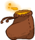ID: 4212**Charming Pouch**Do you want to be my friend? Trick question.  Increases the effect of Trixie's Debilitating Dust ability by 150%.<code>buff_upgrade,150,19689 allow_ge:false</code>ID: 4213**Coffer of Diminution**The look on their faces when they realize they're now my height is hilarious.  Increases the effect of Trixie's Debilitating Dust ability by 275%.<code>buff_upgrade,275,19689 allow_ge:false</code>&nbsp;
        
        
            4
        
        
            Coffer of Diminution
        
        
            Increases the effect of Trixie's Debilitating Dust ability by 275%.
        
    
    
        
            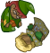ID: 4202**Rubbish Dolls**I'm too old to be playing with these.  Increases the effect of Trixie's Ultimate Undoing ability by 10%. (Prestack)<code>buff_upgrade,10,19690 allow_ge:false</code>ID: 4203**Childish Puppets**I lied. I stole these from the carnival and I love them.  Increases the effect of Trixie's Ultimate Undoing ability by 30%. (Prestack)<code>buff_upgrade,30,19690 allow_ge:false</code>ID: 4204**Painted Dolls**The design is deceptive. I like that.  Increases the effect of Trixie's Ultimate Undoing ability by 50%. (Prestack)<code>buff_upgrade,50,19690 allow_ge:false</code>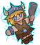ID: 4205**Collectible Figure**He's the smallest, so he's my favorite by default.  Increases the effect of Trixie's Ultimate Undoing ability by 100%. (Prestack)<code>buff_upgrade,100,19690 allow_ge:false</code>&nbsp;
        
        
            5
        
        
            Collectible Figure
        
        
            Increases the effect of Trixie's Ultimate Undoing ability by 100%. (Prestack)
        
    
    
        
            ID: 4218**Discarded Sewing Kit**Human garbage to you. A convenient sword and shield for one my size.  Increases the effect of Trixie's Specializations by 25%.<code>buff_upgrades,25,19692,19693 allow_ge:false</code>ID: 4219**Heirloom Arms**My ancestor wielded this needle astride her hornet mount against the fomorians.  Increases the effect of Trixie's Specializations by 87.5%.<code>buff_upgrades,87.5,19692,19693 allow_ge:false</code>ID: 4220**Thornbow**Briars make for abundant ammunition. Even better, some are poisonous.  Increases the effect of Trixie's Specializations by 150%.<code>buff_upgrades,150,19692,19693 allow_ge:false</code>ID: 4221**Weft**It never runs out of spider silk, which is more useful than you think.  Increases the effect of Trixie's Specializations by 275%.<code>buff_upgrades,275,19692,19693 allow_ge:false</code>&nbsp;
        
        
            6
        
        
            Weft
        
        
            Increases the effect of Trixie's Specializations by 275%.
        
    

<em>Item Names and Descriptions</em>

<pre>

Slot 5:
       Rubbish Dolls: I'm too old to be playing with these.
    Childish Puppets: I lied. I stole these from the carnival and I love them.
       Painted Dolls: The design is deceptive. I like that.
  Collectible Figure: He's the smallest, so he's my favorite by default.
   Antiquated Attire: Leaves are so last season.
      Upcycled Dress: Hmm. I'll make it work.
       Stylish Shift: Yes, that is real butterfly wing. No touching.
          Diva Debut: The ultimate trick to looking good? Confidence.
     Fake Pixie Dust: This is literally just sand, but no one else has to know.
   Wildflower Pollen: It's everywhere, and it makes people miserable. I'm a fan.
      Charming Pouch: Do you want to be my friend? Trick question.
Coffer of Diminution: The look on their faces when they realize they're now my height is
                      hilarious.
     Training Saddle: Yes, I can fly. I just really like animals, okay?
        Hare Harness: I like their long ears and impossible dream of flight.
       Ursine Saddle: For riding bear-back! Get it? Ugh, nevermind.
       Seat of Power: Dev is short for Devorah, by the way. Don't call her Devorah.

Slot 6:
Discarded Sewing Kit: Human garbage to you. A convenient sword and shield for one my size.
       Heirloom Arms: My ancestor wielded this needle astride her hornet mount against the
                      fomorians.
            Thornbow: Briars make for abundant ammunition. Even better, some are poisonous.
                Weft: It never runs out of spider silk, which is more useful than you think.
 Regretful Hairpiece: So tacky. I hate this. Can't believe I ever wore it.
      Fickle Fashion: On second thought, it might be just what I'm feeling today!
       Wig of Whimsy: This one changes both color and style at random. It's so much fun.
    Perfect Postiche: I'm in my 'Archfey' era.
</pre>

 

# Feats

This list will only show feats that are going to be available on the release of this champion. The separate [Feats](feats.md){:target="_blank"} page may show others that could be available later if they exist.

    
        
            **Feat**
        
        
            **Effect**
        
        
            **Source**
        
    
    
        
            ID: 2611**Selflessness (Trixie)**I'm totally selfless, and I would never, ever lie about that or anything else.<code>global_dps_multiplier_mult,10</code>Selflessness
        
        
            All Champions damage +10%.
        
        
            Free
        
    
    
        
            ID: 2612**Inspiring Leader (Trixie)**I'm actually kind of a big deal among my people. Or, I should be.<code>global_dps_multiplier_mult,25</code>Inspiring Leader
        
        
            All Champions damage +25%.
        
        
            Gold Chest
        
    
    
        
            ID: 2613**Dazzling Dance (Trixie)**Watch the pretty lights! Ooh, shiny!<code>buff_upgrade,20,19686</code>Dazzling Dance
        
        
            Increases the effect of Trixie's Dancing Lights ability by 20%.
        
        
            Free
        
    
    
        
            ID: 2614**Demanding Dance (Trixie)**See how they bob and weave? HEY! LISTEN! And watch your step!<code>buff_upgrade,40,19686</code>Demanding Dance
        
        
            Increases the effect of Trixie's Dancing Lights ability by 40%.
        
        
            12,500 Gems
        
    
    
        
            ID: 2615**Little Harm (Trixie)**What's the matter? It's JUST a prank. Lighten up!<code>buff_upgrade,40,19687</code>Little Harm
        
        
            Increases the effect of Trixie's Small Pranks ability by 40%. (Prestack)
        
        
            Gold Chest
        
    
    
        
            ID: 2616**Too Far (Trixie)**It's not my fault that you can't take a joke.<code>buff_upgrade,80,19687</code>Too Far
        
        
            Increases the effect of Trixie's Small Pranks ability by 80%. (Prestack)
        
        
            50,000 Gems
        
    
    
        
            ID: 2617**Pixie Leader (Trixie)**My comrades will come to my aid when called. That includes you now.<code>buff_upgrade,20,19689</code>Pixie Leader
        
        
            Increases the effect of Trixie's Debilitating Dust ability by 20%.
        
        
            Free
        
    
    
        
            ID: 2618**Pixie Paragon (Trixie)**In prettiness and pranks, I'm the best in the business.<code>buff_upgrade,40,19689</code>Pixie Paragon
        
        
            Increases the effect of Trixie's Debilitating Dust ability by 40%.
        
        
            Gold Chest
        
    
    
        
            ID: 2619**Showtime (Trixie)**All eyes on me, or else.<code>buff_upgrade,40,19690</code>Showtime
        
        
            Increases the effect of Trixie's Ultimate Undoing ability by 40%. (Prestack)
        
        
            12,500 Gems
        
    
    
        
            ID: 2620**Budding Friendship (Trixie)**The truth is that I was jealous of all of you. I wanted what you have.<code>buff_upgrades,40,19692,19693</code>Budding Friendship
        
        
            Increases the effect of Trixie's Specializations by 40%.
        
        
            12,500 Gems
        
    
    
        
            ID: 2621**Acquaintanceship (Trixie)**You've all waited long enough to be graced with the gift of my company.<code>buff_upgrades,20,19692,19693</code>Acquaintanceship
        
        
            Increases the effect of Trixie's Specializations by 20%.
        
        
            Free
        
    
    
        
            ID: 2622**Unbelievable Bond (Trixie)**You think Dev is scary? No way! She just wants snacks and cuddles!<code>trixie_familiar_ult_feat</code>Unbelievable Bond
        
        
            Prevents familiars from automatically activating Trixie's ultimate attack until she has 20 Scheming stacks.
        
        
            Event Bonus
        
    
    
        
            ID: 2623**Pixie Dust (Trixie)**This stuff will either make you taste colors, or kill you. Let's find out!<code>immolation,1,5</code>Pixie Dust
        
        
            Trixie's attacks deal an additional 1 second of BUD damage every second for 5 seconds.
        
        
            Event Bonus
        
    
    
        
            ID: 2695**Misdirection (Trixie)**Smoke and mirrors? As if. Classic misdirection is second nature to pixies. Watch and learn.<code>global_dps_multiplier_mult,100 reverse_taunt</code>Misdirection
        
        
            Enemies that attempt to attack this Champion will instead attack a different Champion, if possible.
        
        
            Event Bonus
        
    

# Legendaries

* Increases the damage of all Champions by 100%.
* Increases the damage of all Champions by 20% for each Female Champion in the formation.
* Increases the damage of all Champions with a DEX score of 15 or higher by 200%.
* Increases the damage of all Chaotic Champions by 150%.
* Increases the damage of all Champions by 20% for each Champion in the formation with a NEUTRAL alignment.
* Increases the damage of all Champions by 30% for each Magic Champion in the formation.

<em>DPS Applicable</em>

<pre>
         Arkhan: 3 / 6
        Artemis: 4 / 6
        Asharra: 4 / 6
          Azaka: 3 / 6
         Binwin: 3 / 6
       Birdsong: 4 / 6
    Black Viper: 5 / 6
          Bobby: 5 / 6
     Catti-brie: 5 / 6
         Cazrin: 5 / 6
         D'hani: 5 / 6
      Dark Urge: 4 / 6 (Potentially 5 / 6)
        Dhadius: 5 / 6
         Drizzt: 4 / 6
        Farideh: 4 / 6
            Fen: 4 / 6
          Grimm: 4 / 6
         Gromma: 4 / 6
           Ishi: 5 / 6
        Jaheira: 3 / 6
        Jamilah: 3 / 6
       Jarlaxle: 4 / 6
            Jim: 5 / 6
        Karlach: 4 / 6
            Kas: 4 / 6
           Kent: 4 / 6
King of Shadows: 4 / 6 (Potentially 5 / 6)
          Krond: 4 / 6 (Potentially 5 / 6)
           Krux: 3 / 6
        Lae'zel: 3 / 6 (Potentially 4 / 6)
         Lucius: 4 / 6
          Makos: 4 / 6
          Minsc: 4 / 6
          NERDS: 4 / 6 (Potentially 5 / 6)
         Nahara: 6 / 6
          Nixie: 5 / 6
         Orisha: 4 / 6
       Prudence: 5 / 6
       Raistlin: 5 / 6
          Rosie: 5 / 6
          Strix: 5 / 6
        Torogar: 4 / 6
         Warden: 5 / 6
       Windfall: 5 / 6 (Potentially 6 / 6)
           Wren: 3 / 6 (Potentially 4 / 6)
         Yorven: 4 / 6
          Zorbu: 5 / 6
</pre>

<em>Non-DPS Applicable</em>

<pre>
          Aeon: 3 / 6
          Aila: 5 / 6
       Alyndra: 4 / 6
         Anson: 3 / 6
       Antrius: 5 / 6
      Astarion: 4 / 6
         Avren: 6 / 6
          BBEG: 4 / 6
       Baeloth: 5 / 6
       Baldric: 3 / 6
      Barrowin: 3 / 6
       Blooshi: 4 / 6
          Brig: 5 / 6
          Briv: 4 / 6
       Bruenor: 3 / 6
      Calliope: 6 / 6
       Celeste: 4 / 6
     Certainty: 4 / 6
        Deekin: 3 / 6
       Desmond: 5 / 6
         Diana: 4 / 6
           Dob: 6 / 6
        Donaar: 5 / 6
    Dragonbait: 3 / 6
Dungeon Master: 5 / 6
      Dynaheir: 3 / 6
        Egbert: 4 / 6
      Ellywick: 6 / 6
          Eric: 3 / 6
       Evandra: 4 / 6
        Evelyn: 3 / 6
     Ezmerelda: 6 / 6
        Freely: 5 / 6
          Gale: 4 / 6
       Gazrick: 4 / 6
        Halsin: 4 / 6
          Hank: 4 / 6
       Havilar: 5 / 6
         Imoen: 4 / 6
      K'thriss: 5 / 6
         Kalix: 4 / 6
         Korth: 4 / 6
         Krull: 3 / 6
        Krydle: 5 / 6
          Kyre: 5 / 6
          Lark: 5 / 6
       Laurana: 4 / 6
       Lazaapz: 4 / 6
         Mehen: 3 / 6
          Melf: 4 / 6
      Merilwen: 5 / 6
      Minthara: 4 / 6
         Miria: 5 / 6
        Môrgæn: 5 / 6
        Nayeli: 3 / 6
         Nerys: 3 / 6
        Nordom: 4 / 6
          Nova: 5 / 6
          Omin: 3 / 6
        Orkira: 5 / 6
       Paultin: 5 / 6 (Potentially 6 / 6)
      Penelope: 5 / 6
        Presto: 4 / 6
         Pwent: 4 / 6
        Qillek: 5 / 6
         Regis: 5 / 6
          Reya: 3 / 6
          Rust: 4 / 6
        Selise: 3 / 6
        Sentry: 3 / 6
     Sgt. Knox: 3 / 6
   Shadowheart: 4 / 6
         Shaka: 5 / 6
       Shandie: 5 / 6
        Sheila: 3 / 6
      Sisaspia: 5 / 6
        Skylla: 4 / 6 (Potentially 5 / 6)
        Solaak: 4 / 6
         Spurt: 4 / 6
         Stoki: 4 / 6
   Strongheart: 3 / 6
         Talin: 5 / 6
    Tasslehoff: 4 / 6
      Thellora: 3 / 6
        Trixie: 5 / 6
        Turiel: 4 / 6
         Tyril: 4 / 6
       Ulkoria: 4 / 6
       Umberto: 4 / 6
         Uriah: 4 / 6
     Valentine: 4 / 6
            Vi: 3 / 6
       Viconia: 4 / 6
      Vin Ursa: 4 / 6
        Virgil: 4 / 6
      Vlithryn: 3 / 6
          Volo: 5 / 6
      Voronika: 6 / 6
        Widdle: 6 / 6
       Wulfgar: 4 / 6
          Wyll: 3 / 6 (Potentially 4 / 6)
        Xander: 5 / 6
      Xerophon: 4 / 6
</pre>

 

# Adventures and Variants

**Unlock Adventure: Let Sleeping Dragons Lie (Trixie)** (Complete Area 50)
> Attempt to calm down a very angry bronze dragon.

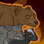 **Variant 1: If You Can't Beat Them, Join Them** (Complete Area 75)
> Trixie the Pixie starts in the formation. She can be moved, but not removed.  
> Only Trixie and Champions next to her can deal damage.  
> 1-2 beasts attack with each wave. They don't drop gold nor count towards quest progress.  
> <b>Getting to Know Trixie the Pixie:</b> Trixie increases the damage of Champions next to her. Place your main damage dealer next to her to get the most of her buff!

 **Variant 2: Size Matters Not** (Complete Area 125)
> Trixie the Pixie starts in the formation. She can be moved, but not removed.  
> After area 50, you may only use Small Champions and all Champions that aren't Small are removed from the formation. Small Champions are fairy, gnome, goblin, halfling, kender, kobold, and plasmoid Champions.  
> Non-boss enemies deal 100% additional damage and are increased in size by 50%.  
> <b>Getting to Know Trixie the Pixie:</b> Trixie can reduce the size of two Champions in the slots directly behind her so they count as small. All Champions that share a species with one of those Champions are also reduced in size!

 **Variant 3: Little Force of Nature** (Complete Area 175)
> Trixie the Pixie starts in the formation. She can be moved, but not removed.  
> After area 50, enemies that aren't slowed, stunned, or rooted only take 1 damage from normal attacks.  
> Click damage only deals damage (including fire breath effects) for the first 25 areas.  
> Fire breath potions can't be used during the adventure.  
> <b>Getting to Know Trixie the Pixie:</b> Some variants turn off click damage, so familiars don't deal damage. You can still use familiars with Trixie's specialization choices to increase the attack rate of your other Champions!

# Other Champion Images

    
        
            Console Portrait
        
    
    
        
            Gold Chest Icon
        
        
            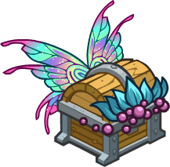Silver Chest Icon
        
    

[Back to Top](#top)

*Last Modified: {{ site.time }}*