[Back to Main](index.md)

    
        
            
        
        
            Portrait
        
    
    
        
            
        
        
            Base Model
        
    
    
        
            
        
        
            Erasmus Model
        
    

# Rudolph van Richten

moo

# Basic Information

Rudolph van Richten will be a new champion in the Founders' Day event on 1 July 2026.

    
        
            **Seat**:
        
        
            10
        
        
            **Stat**
        
        
            **Value**
        
        
            **Day 1 Trials**
        
        
            **Patrons**
        
    
    
        
            **Species**:
        
        
            Human
        
        
            **Strength**:
        
        
            9
        
        
            Yes
        
        
            Mirt
        
    
    
        
            **Class**:
        
        
            Cleric
        
        
            **Dexterity**:
        
        
            14
        
        
            Yes
        
        
            Vajra
        
    
    
        
            **Roles**:
        
        
            Support / Hunter / Debuff
        
        
            **Constitution**:
        
        
            16
        
        
            Yes
        
        
            Strahd (Ability)
        
    
    
        
            **Age**:
        
        
            75
        
        
            **Intelligence**:
        
        
            17
        
        
            Yes
        
        
            Zariel (with Feat)
        
    
    
        
            **Gender**:
        
        
            Male
        
        
            **Wisdom**:
        
        
            18
        
        
            Yes
        
        
            Elminster
        
    
    
        
            **Alignment**:
        
        
            Lawful Good
        
        
            **Charisma**:
        
        
            15
        
        
            Yes
        
        
            &nbsp;
        
    
    
        
            **Affiliation**:
        
        
            -
        
        
            **Total**:
        
        
            89
        
        
            Champion ID:
        
        
            177
        
    

# Formation

    <svg xmlns="http://www.w3.org/2000/svg" id="Van Richten" fill="#aaa" data-formationName="Van Richten" data-campaignName="Founders' Day" width="354" height="160"><circle cx="175" cy="25" r="15"/><circle cx="175" cy="65" r="15"/><circle cx="175" cy="105" r="15"/><circle cx="135" cy="45" r="15"/><circle cx="135" cy="85" r="15"/><circle cx="135" cy="125" r="15"/><circle cx="95" cy="105" r="15"/><circle cx="95" cy="145" r="15"/><circle cx="55" cy="125" r="15"/><circle cx="15" cy="145" r="15"/><text x="205" y="25" fill="#dcdcdc" font-size="25" font-family="Arial" font-weight="bold">Van Richten</text><text x="205" y="65" fill="#dcdcdc" font-size="15" font-family="Arial" font-weight="bold">Founders' Day</text></svg>

# Attacks

 **Base Attack: Silver Sword Cane** (Melee)
> Van Richten leaps out and slashes the nearest enemy with his Silver Sword Cane, dealing one hit. Deals an additional 5 seconds of BUD-based damage to Van Richten's Favored Foes.  
> Cooldown: 5.5s (Cap 1.375s)

<em>Raw Data</em>

<pre>
{
    "id": 981,
    "name": "Silver Sword Cane",
    "description": "Van Richten slashes the nearest enemy with his Silver Sword Cane.",
    "long_description": "Van Richten leaps out and slashes the nearest enemy with his Silver Sword Cane, dealing one hit. Deals an additional 5 seconds of BUD-based damage to Van Richten's Favored Foes.",
    "graphic_id": 0,
    "target": "front",
    "num_targets": 1,
    "aoe_radius": 0,
    "damage_modifier": 1,
    "cooldown": 5.5,
    "animations": [
        {
            "type": "melee_attack",
            "damage_frame": 3,
            "effects_on_monsters": [
                {
                    "effect_string": "damage_monster_target_by_bud",
                    "hit_monsters": true,
                    "only_src_favored_foes": true,
                    "damage_mult": 5,
                    "after_damage": true
                }
            ]
        }
    ],
    "tags": [
        "melee"
    ],
    "damage_types": [
        "melee"
    ]
}
</pre>

 **Ultimate Attack: Repel Evil** (Level: 0)
> Van Richten repels all foes a short distance, dealing 1 ultimate hit and slowing them. Damage is greater against his favored foes.  
> Cooldown: 260s (Cap 65s)

<em>Raw Data</em>

<pre>
{
    "id": 982,
    "name": "Repel Evil",
    "description": "Van Richten repels all foes a short distance, dealing 1 ultimate hit and slowing them.",
    "long_description": "Van Richten repels all foes a short distance, dealing 1 ultimate hit and slowing them. Damage is greater against his favored foes.",
    "graphic_id": 29205,
    "target": "all",
    "num_targets": 0,
    "aoe_radius": 0,
    "damage_modifier": 0.03,
    "cooldown": 260,
    "animations": [
        {
            "type": "ranged_attack",
            "shoot_frame": 20,
            "projectile": "empty",
            "projectile_details": {
                "projectile_hit_graphic_id": 29292,
                "impact_offset_y": -50
            },
            "effects_on_monsters": [
                {
                    "effect_string": "push_back_monster,5",
                    "after_damage": true
                },
                {
                    "effect_string": "monster_speed_reduce,50",
                    "for_time": 5,
                    "after_damage": true
                }
            ],
            "monster_bonus_damage": {
                "only_src_favored_foes": true,
                "amount": 4
            }
        }
    ],
    "tags": [
        "magic",
        "ultimate"
    ],
    "damage_types": [
        "magic"
    ]
}
</pre>

# Abilities

**Hunting Strahd** (Level: 0)
> As a sworn enemy of Strahd, Van Richten can be used in any Strahd Patron adventure or variant, even if he would not normally be available to be used due to variant or patron restrictions.

<em>Raw Data</em>

<pre>
{
    "id": 19695,
    "hero_id": 177,
    "required_level": 0,
    "required_upgrade_id": 0,
    "upgrade_type": "unlock_ability",
    "effect": "effect_def,2739",
    "static_dps_mult": null,
    "default_enabled": 1,
    "name": "Hunting Strahd",
    "tip_text": "Van Richten increases the damage of Champions in the column in front of him, and this buff increases in strength as undead foes are defeated."
}
{
    "id": 2739,
    "flavour_text": "",
    "description": {
        "desc": "As a sworn enemy of Strahd, Van Richten can be used in any Strahd Patron adventure or variant, even if he would not normally be available to be used due to variant or patron restrictions."
    },
    "effect_keys": [
        {
            "effect_string": "do_nothing"
        }
    ],
    "requirements": "",
    "graphic_id": 0,
    "large_graphic_id": 0,
    "properties": {
        "is_formation_ability": true,
        "use_outgoing_description": true,
        "formation_circle_icon": false
    }
}
</pre>

 **Slayer Training** (Level: 20)
> Van Richten increases the damage of Champions in the column in front of him by 100%.

<em>Upgrade Data</em>

<pre>
Upgrades:
      100: 100%
      140: 100%
      200: 100%
      250: 100%
      310: 100%
      370: 100%
      440: 100%
      530: 100%
      610: 100%
      710: 100%
      810: 100%
      910: 100%
    1,010: 100%
    1,110: 100%
    1,220: 100%
    1,320: 100%
    1,420: 100%
    1,520: 100%
    1,600: 100%
    1,690: 100%
    1,780: 100%

    Total Upgrade Bonus: 2.10e08%
</pre>

<em>Raw Data</em>

<pre>
{
    "id": 19696,
    "hero_id": 177,
    "required_level": 20,
    "required_upgrade_id": 0,
    "upgrade_type": "unlock_ability",
    "effect": "effect_def,2738",
    "static_dps_mult": null,
    "default_enabled": 1,
    "name": "Slayer Training"
}
{
    "id": 2738,
    "flavour_text": "",
    "description": {
        "desc": "Van Richten increases the damage of Champions in the column in front of him by $amount%."
    },
    "effect_keys": [
        {
            "off_when_benched": true,
            "effect_string": "hero_dps_multiplier_mult,100",
            "targets": [
                "next_col"
            ]
        }
    ],
    "requirements": "",
    "graphic_id": 29196,
    "large_graphic_id": 29192,
    "properties": {
        "is_formation_ability": true,
        "owner_use_outgoing_description": true,
        "formation_circle_icon": true,
        "indexed_effect_properties": true,
        "per_effect_index_bonuses": true,
        "default_bonus_index": 0
    }
}
{
    "id": 19867,
    "hero_id": 177,
    "required_level": 100,
    "required_upgrade_id": 0,
    "upgrade_type": "upgrade_ability",
    "effect": "buff_upgrade,100,19696",
    "static_dps_mult": null,
    "default_enabled": 1,
    "name": ""
}
{
    "id": 20077,
    "hero_id": 177,
    "required_level": 140,
    "required_upgrade_id": 0,
    "upgrade_type": "upgrade_ability",
    "effect": "buff_upgrade,100,19696",
    "static_dps_mult": null,
    "default_enabled": 1,
    "name": ""
}
{
    "id": 20080,
    "hero_id": 177,
    "required_level": 200,
    "required_upgrade_id": 0,
    "upgrade_type": "upgrade_ability",
    "effect": "buff_upgrade,100,19696",
    "static_dps_mult": null,
    "default_enabled": 1,
    "name": ""
}
{
    "id": 20082,
    "hero_id": 177,
    "required_level": 250,
    "required_upgrade_id": 0,
    "upgrade_type": "upgrade_ability",
    "effect": "buff_upgrade,100,19696",
    "static_dps_mult": null,
    "default_enabled": 1,
    "name": ""
}
{
    "id": 20084,
    "hero_id": 177,
    "required_level": 310,
    "required_upgrade_id": 0,
    "upgrade_type": "upgrade_ability",
    "effect": "buff_upgrade,100,19696",
    "static_dps_mult": null,
    "default_enabled": 1,
    "name": ""
}
{
    "id": 20087,
    "hero_id": 177,
    "required_level": 370,
    "required_upgrade_id": 0,
    "upgrade_type": "upgrade_ability",
    "effect": "buff_upgrade,100,19696",
    "static_dps_mult": null,
    "default_enabled": 1,
    "name": ""
}
{
    "id": 20090,
    "hero_id": 177,
    "required_level": 440,
    "required_upgrade_id": 0,
    "upgrade_type": "upgrade_ability",
    "effect": "buff_upgrade,100,19696",
    "static_dps_mult": null,
    "default_enabled": 1,
    "name": ""
}
{
    "id": 20093,
    "hero_id": 177,
    "required_level": 530,
    "required_upgrade_id": 0,
    "upgrade_type": "upgrade_ability",
    "effect": "buff_upgrade,100,19696",
    "static_dps_mult": null,
    "default_enabled": 1,
    "name": ""
}
{
    "id": 20095,
    "hero_id": 177,
    "required_level": 610,
    "required_upgrade_id": 0,
    "upgrade_type": "upgrade_ability",
    "effect": "buff_upgrade,100,19696",
    "static_dps_mult": null,
    "default_enabled": 1,
    "name": ""
}
{
    "id": 20098,
    "hero_id": 177,
    "required_level": 710,
    "required_upgrade_id": 0,
    "upgrade_type": "upgrade_ability",
    "effect": "buff_upgrade,100,19696",
    "static_dps_mult": null,
    "default_enabled": 1,
    "name": ""
}
{
    "id": 20102,
    "hero_id": 177,
    "required_level": 810,
    "required_upgrade_id": 0,
    "upgrade_type": "upgrade_ability",
    "effect": "buff_upgrade,100,19696",
    "static_dps_mult": null,
    "default_enabled": 1,
    "name": ""
}
{
    "id": 20105,
    "hero_id": 177,
    "required_level": 910,
    "required_upgrade_id": 0,
    "upgrade_type": "upgrade_ability",
    "effect": "buff_upgrade,100,19696",
    "static_dps_mult": null,
    "default_enabled": 1,
    "name": ""
}
{
    "id": 20108,
    "hero_id": 177,
    "required_level": 1010,
    "required_upgrade_id": 0,
    "upgrade_type": "upgrade_ability",
    "effect": "buff_upgrade,100,19696",
    "static_dps_mult": null,
    "default_enabled": 1,
    "name": ""
}
{
    "id": 20110,
    "hero_id": 177,
    "required_level": 1110,
    "required_upgrade_id": 0,
    "upgrade_type": "upgrade_ability",
    "effect": "buff_upgrade,100,19696",
    "static_dps_mult": null,
    "default_enabled": 1,
    "name": ""
}
{
    "id": 20113,
    "hero_id": 177,
    "required_level": 1220,
    "required_upgrade_id": 0,
    "upgrade_type": "upgrade_ability",
    "effect": "buff_upgrade,100,19696",
    "static_dps_mult": null,
    "default_enabled": 1,
    "name": ""
}
{
    "id": 20115,
    "hero_id": 177,
    "required_level": 1320,
    "required_upgrade_id": 0,
    "upgrade_type": "upgrade_ability",
    "effect": "buff_upgrade,100,19696",
    "static_dps_mult": null,
    "default_enabled": 1,
    "name": ""
}
{
    "id": 20117,
    "hero_id": 177,
    "required_level": 1420,
    "required_upgrade_id": 0,
    "upgrade_type": "upgrade_ability",
    "effect": "buff_upgrade,100,19696",
    "static_dps_mult": null,
    "default_enabled": 1,
    "name": ""
}
{
    "id": 20120,
    "hero_id": 177,
    "required_level": 1520,
    "required_upgrade_id": 0,
    "upgrade_type": "upgrade_ability",
    "effect": "buff_upgrade,100,19696",
    "static_dps_mult": null,
    "default_enabled": 1,
    "name": ""
}
{
    "id": 20122,
    "hero_id": 177,
    "required_level": 1600,
    "required_upgrade_id": 0,
    "upgrade_type": "upgrade_ability",
    "effect": "buff_upgrade,100,19696",
    "static_dps_mult": null,
    "default_enabled": 1,
    "name": ""
}
{
    "id": 20124,
    "hero_id": 177,
    "required_level": 1690,
    "required_upgrade_id": 0,
    "upgrade_type": "upgrade_ability",
    "effect": "buff_upgrade,100,19696",
    "static_dps_mult": null,
    "default_enabled": 1,
    "name": ""
}
{
    "id": 20128,
    "hero_id": 177,
    "required_level": 1780,
    "required_upgrade_id": 0,
    "upgrade_type": "upgrade_ability",
    "effect": "buff_upgrade,100,19696",
    "static_dps_mult": null,
    "default_enabled": 1,
    "name": ""
}
</pre>

 **Beyond the Grave** (Level: 60)
> When a non-Undead non-Boss enemy is killed, there is a 25% chance that Strahd will resurrect it as an Undead version of the same enemy. The enemy reappears where it died after 1 second and can drop an additional quest item or count as a second kill for quest progress when killed. Does not trigger in Boss areas.

<em>Raw Data</em>

<pre>
{
    "id": 19697,
    "hero_id": 177,
    "required_level": 60,
    "required_upgrade_id": 0,
    "upgrade_type": "unlock_ability",
    "effect": "effect_def,2740",
    "static_dps_mult": null,
    "default_enabled": 1,
    "name": "Beyond the Grave"
}
{
    "id": 2740,
    "flavour_text": "",
    "description": {
        "desc": "When a non-Undead non-Boss enemy is killed, there is a $amount% chance that Strahd will resurrect it as an Undead version of the same enemy. The enemy reappears where it died after $time second and can drop an additional quest item or count as a second kill for quest progress when killed. Does not trigger in Boss areas."
    },
    "effect_keys": [
        {
            "effect_string": "chance_resurrect_enemy_handler,25",
            "add_tag": true,
            "tag": "undead",
            "ignore_tag": false,
            "ignore_favored_foe": true,
            "graphic_id": 29293,
            "resurrected_key": "richten_resurrected",
            "time": 1,
            "resurrect_effect": {
                "effect_string": "monster_undead_respawn,1"
            },
            "post_resurrect_effects": [
                {
                    "effect_string": "richten_resurrected"
                }
            ],
            "achievement_stat_name": "richten_always_among_monsters",
            "ignored_death_animations": [
                "run"
            ]
        }
    ],
    "requirements": "",
    "graphic_id": 29195,
    "large_graphic_id": 29191,
    "properties": {
        "is_formation_ability": true,
        "show_incoming": false,
        "formation_circle_icon": false,
        "retain_on_slot_changed": true,
        "indexed_effect_properties": true,
        "per_effect_index_bonuses": true,
        "default_bonus_index": 0
    }
}
</pre>

 **Triumph** (Level: 80)
> Undead enemies are Van Richten's favored foe. When one of his favored foes is killed, Van Richten gains a Triumph stack. Slayer Training is increased by 20% for each Triumph stack he has, stacking multiplicatively. Triumph stacks cap at 100 and reset when a boss area is completed.

<em>Raw Data</em>

<pre>
{
    "id": 19698,
    "hero_id": 177,
    "required_level": 80,
    "required_upgrade_id": 0,
    "upgrade_type": "unlock_ability",
    "effect": "effect_def,2741",
    "static_dps_mult": null,
    "default_enabled": 1,
    "name": "Triumph"
}
{
    "id": 2741,
    "flavour_text": "",
    "description": {
        "desc": "Undead enemies are Van Richten's favored foe. When one of his favored foes is killed, Van Richten gains a Triumph stack. Slayer Training is increased by $(not_buffed amount___2)% for each Triumph stack he has, stacking multiplicatively. Triumph stacks cap at $max_stacks___2 and reset when a boss area is completed."
    },
    "effect_keys": [
        {
            "off_when_benched": true,
            "effect_string": "favored_foe,undead"
        },
        {
            "off_when_benched": true,
            "effect_string": "buff_upgrade,20,19696",
            "more_triggers": [
                {
                    "trigger": "favored_foe_killed",
                    "is_source_favored_foe": true,
                    "action": {
                        "type": "add_stack"
                    }
                },
                {
                    "trigger": "boss_area_complete",
                    "action": {
                        "type": "reset"
                    }
                }
            ],
            "max_stacks": 100,
            "stacks_multiply": true,
            "show_bonus": true,
            "stack_title": "Triumph Stacks"
        }
    ],
    "requirements": "",
    "graphic_id": 29197,
    "large_graphic_id": 29193,
    "properties": {
        "is_formation_ability": true,
        "formation_circle_icon": false,
        "indexed_effect_properties": true,
        "per_effect_index_bonuses": true,
        "default_bonus_index": 1
    }
}
</pre>

 **Watched by Erasmus** (Level: 150)
> If no enemies have been defeated for 3 seconds, Van Richten's ghost son Erasmus appears. Whenever Van Richten attacks, Erasmus quickly moves to the target he will attack and curses all enemies in a small area, causing all attacks against them to deal 100% more damage. This is increased by 20% for each Triumph stack Van Richten has, stacking multiplicatively. Erasmus disappears when changing areas.

<em>Raw Data</em>

<pre>
{
    "id": 19699,
    "hero_id": 177,
    "required_level": 150,
    "required_upgrade_id": 0,
    "upgrade_type": "unlock_ability",
    "effect": "effect_def,2742",
    "static_dps_mult": null,
    "default_enabled": 1,
    "name": "Watched by Erasmus",
    "tip_text": "Van Richten's ghostly son Erasmus watches over him, and he arrives to increase damage against enemies when his father is in trouble."
}
{
    "id": 2742,
    "flavour_text": "",
    "description": {
        "desc": "If no enemies have been defeated for $time___2 seconds, Van Richten's ghost son Erasmus appears. Whenever Van Richten attacks, Erasmus quickly moves to the target he will attack and curses all enemies in a small area, causing all attacks against them to deal $(amount)% more damage. This is increased by $amount___3% for each Triumph stack Van Richten has, stacking multiplicatively. Erasmus disappears when changing areas."
    },
    "effect_keys": [
        {
            "effect_string": "base_amount,100"
        },
        {
            "effect_string": "richten_watched_by_erasmus,0",
            "amount_expr": "upgrade_amount(19699,0)",
            "debuff_effects": [
                {
                    "effect_string": "increase_monster_damage,100"
                }
            ],
            "erasmus_sequences": {
                "idle": 0,
                "walk": 1,
                "attack": 2,
                "koed": 1
            },
            "time": 3,
            "wave_x_offset": 15,
            "wave_y_offset": -65,
            "show_bonus": true
        },
        {
            "effect_string": "pre_stack,20"
        },
        {
            "off_when_benched": true,
            "effect_string": "buff_upgrade,1,19699,1",
            "amount_expr": "upgrade_amount(19699,2)",
            "amount_func": "mult",
            "stack_func": "per_hero_attribute",
            "post_process_expr": "GetUpgradeStacks(19698,1)",
            "listen_for_computed_changes": true,
            "max_stacks": 100,
            "stacks_multiply": true,
            "stack_title": "Triumph Stacks",
            "total_title": "Triumph Bonus",
            "show_bonus": true,
            "amount_updated_listeners": [
                "favored_foe_killed",
                "stacks_changed"
            ]
        }
    ],
    "requirements": "",
    "graphic_id": 29198,
    "large_graphic_id": 29194,
    "properties": {
        "is_formation_ability": true,
        "show_incoming": false,
        "retain_on_slot_changed": true,
        "formation_circle_icon": false,
        "indexed_effect_properties": true,
        "per_effect_index_bonuses": true,
        "default_bonus_index": 0
    }
}
</pre>

 **Repel Evil** (Level: 180)
> Van Richten raises his hand, which projects radiant light towards the enemies. All enemies take an ultimate hit, are knocked back a short distance, and slowed by 50% for 5 seconds. Enemies that are his favored foe take 400% more damage from this ultimate.

<em>Raw Data</em>

<pre>
{
    "id": 19706,
    "hero_id": 177,
    "required_level": 180,
    "required_upgrade_id": 0,
    "upgrade_type": "unlock_ultimate",
    "effect": "effect_def,2749",
    "static_dps_mult": null,
    "default_enabled": 1,
    "name": "Repel Evil"
}
{
    "id": 2749,
    "flavour_text": "",
    "description": {
        "desc": "Van Richten raises his hand, which projects radiant light towards the enemies. All enemies take an ultimate hit, are knocked back a short distance, and slowed by 50% for 5 seconds. Enemies that are his favored foe take 400% more damage from this ultimate."
    },
    "effect_keys": [
        {
            "effect_string": "set_ultimate_attack,982"
        }
    ],
    "requirements": "",
    "graphic_id": 29205,
    "large_graphic_id": 29205,
    "properties": {
        "show_incoming": false,
        "formation_circle_icon": false
    }
}
</pre>

# Specialisations

 **Occult Allies** (Level: 120)
> Van Richten increases the effect of Slayer Training by 100% for each Cleric, Wizard, Sorcerer, or Warlock in the formation, stacking multiplicatively.

ⓘ *Note: This ability is prestack.*

<em>Raw Data</em>

<pre>
{
    "id": 19700,
    "hero_id": 177,
    "required_level": 120,
    "required_upgrade_id": 0,
    "upgrade_type": "unlock_ability",
    "effect": "effect_def,2743",
    "static_dps_mult": null,
    "default_enabled": 1,
    "name": "Occult Allies",
    "specialization_name": "Occult Allies",
    "specialization_description": "Van Richten works with other spellcasters to defeat evil.",
    "specialization_graphic_id": 29203
}
{
    "id": 2743,
    "flavour_text": "",
    "description": {
        "desc": "Van Richten increases the effect of Slayer Training by $amount% for each Cleric, Wizard, Sorcerer, or Warlock in the formation, stacking multiplicatively."
    },
    "effect_keys": [
        {
            "effect_string": "pre_stack,100"
        },
        {
            "off_when_benched": true,
            "effect_string": "buff_upgrade,0,19696",
            "amount_expr": "upgrade_amount(19700,0)",
            "amount_func": "mult",
            "stack_func": "per_hero_attribute",
            "per_hero_expr": "HasTag(`cleric`) || HasTag(`wizard`) || HasTag(`sorcerer`) || HasTag(`warlock`)",
            "stacks_multiply": true,
            "amount_updated_listeners": [
                "slot_changed",
                "hero_tags_changed"
            ],
            "show_bonus": true
        }
    ],
    "requirements": "",
    "graphic_id": 29203,
    "large_graphic_id": 29203,
    "properties": {
        "is_formation_ability": true,
        "formation_circle_icon": false,
        "owner_use_outgoing_description": true,
        "indexed_effect_properties": true,
        "per_effect_index_bonuses": true,
        "default_bonus_index": 0,
        "spec_option_post_apply_info": "Qualified Champions: $num_stacks___2"
    }
}
</pre>

 **Scholar of Dread** (Level: 120)
> Van Richten increases the effect of Slayer Training by 100% for each Champion in the formation with an Intelligence score of 14 or higher, stacking multiplicatively.

ⓘ *Note: This ability is prestack.*

<em>Raw Data</em>

<pre>
{
    "id": 19701,
    "hero_id": 177,
    "required_level": 120,
    "required_upgrade_id": 0,
    "upgrade_type": "unlock_ability",
    "effect": "effect_def,2744",
    "static_dps_mult": null,
    "default_enabled": 1,
    "name": "Scholar of Dread",
    "specialization_name": "Scholar of Dread",
    "specialization_description": "The famous author draws upon the knowledge of others in his quest to eliminate harmful undead from the world.",
    "specialization_graphic_id": 29204
}
{
    "id": 2744,
    "flavour_text": "",
    "description": {
        "desc": "Van Richten increases the effect of Slayer Training by $amount% for each Champion in the formation with an Intelligence score of 14 or higher, stacking multiplicatively."
    },
    "effect_keys": [
        {
            "effect_string": "pre_stack,100"
        },
        {
            "off_when_benched": true,
            "effect_string": "buff_upgrade,0,19696",
            "amount_expr": "upgrade_amount(19701,0)",
            "amount_func": "mult",
            "stack_func": "per_hero_attribute",
            "per_hero_expr": "GetStat(`int`)>=14",
            "stacks_multiply": true,
            "amount_updated_listeners": [
                "slot_changed",
                "hero_tags_changed"
            ],
            "show_bonus": true
        }
    ],
    "requirements": "",
    "graphic_id": 29204,
    "large_graphic_id": 29204,
    "properties": {
        "is_formation_ability": true,
        "formation_circle_icon": false,
        "owner_use_outgoing_description": true,
        "indexed_effect_properties": true,
        "per_effect_index_bonuses": true,
        "default_bonus_index": 0,
        "spec_option_post_apply_info": "INT 14+ Champions: $num_stacks___2"
    }
}
</pre>

 **Endless Hunt** (Level: 120)
> Van Richten increases the effect of Slayer Training by 100% for each Hunter Champion and each Debuff Champion in the formation, stacking multiplicatively. Champions with both roles count twice.

ⓘ *Note: This ability is prestack.*

<em>Raw Data</em>

<pre>
{
    "id": 19702,
    "hero_id": 177,
    "required_level": 120,
    "required_upgrade_id": 0,
    "upgrade_type": "unlock_ability",
    "effect": "effect_def,2745",
    "static_dps_mult": null,
    "default_enabled": 1,
    "name": "Endless Hunt",
    "specialization_name": "Endless Hunt",
    "specialization_description": "Rudolph associates with other hunters and individuals that know how to exploit an enemy's weakness.",
    "specialization_graphic_id": 29199
}
{
    "id": 2745,
    "flavour_text": "",
    "description": {
        "desc": "Van Richten increases the effect of Slayer Training by $amount% for each Hunter Champion and each Debuff Champion in the formation, stacking multiplicatively. Champions with both roles count twice."
    },
    "effect_keys": [
        {
            "effect_string": "pre_stack,100"
        },
        {
            "off_when_benched": true,
            "effect_string": "buff_upgrade,0,19696",
            "amount_expr": "upgrade_amount(19702,0)",
            "amount_func": "mult",
            "stack_func": "per_hero_attribute",
            "per_hero_expr": "as_int(HasTag(`hunter`)) + as_int(HasTag(`debuff`))",
            "stacks_multiply": true,
            "amount_updated_listeners": [
                "slot_changed",
                "hero_tags_changed"
            ],
            "show_bonus": true
        }
    ],
    "requirements": "",
    "graphic_id": 29199,
    "large_graphic_id": 29199,
    "properties": {
        "is_formation_ability": true,
        "formation_circle_icon": false,
        "owner_use_outgoing_description": true,
        "indexed_effect_properties": true,
        "per_effect_index_bonuses": true,
        "default_bonus_index": 0,
        "spec_option_post_apply_info": "Potential Stacks: $num_stacks___2"
    }
}
</pre>

 **Occult Aid: Cure Wounds** (Level: 220)
> Van Richten gains the Healing role. Every second, Van Richten heals the most damaged Champion in the formation for 20% of his own max health.

<em>Raw Data</em>

<pre>
{
    "id": 19703,
    "hero_id": 177,
    "required_level": 220,
    "required_upgrade_id": 0,
    "upgrade_type": "unlock_ability",
    "effect": "effect_def,2746",
    "static_dps_mult": null,
    "default_enabled": 1,
    "name": "Occult Aid: Cure Wounds",
    "specialization_name": "Occult Aid: Cure Wounds",
    "specialization_description": "Van Richten uses his divine gifts to heal other Champions.",
    "specialization_graphic_id": 29200
}
{
    "id": 2746,
    "flavour_text": "",
    "description": {
        "desc": "Van Richten gains the Healing role. Every second, Van Richten heals the most damaged Champion in the formation for $amount% of his own max health."
    },
    "effect_keys": [
        {
            "effect_string": "add_hero_tags,20,healing"
        },
        {
            "effect_string": "do_nothing,1",
            "off_when_benched": true,
            "amount_func": "add",
            "stack_func": "per_hero_attribute",
            "post_process_expr": "round(GetHeroHP(177))/(100/GetUpgradeAmount(19703,0))",
            "listen_for_computed_changes": true,
            "amount_updated_listeners": [
                "max_health_changed,177"
            ]
        },
        {
            "effect_string": "heal_most_damaged,1",
            "off_when_benched": true,
            "amount_expr": "upgrade_amount(19703,1)",
            "on_trigger": "on_timer,1",
            "targets": [
                "all_slots"
            ],
            "show_bonus": true
        }
    ],
    "requirements": "",
    "graphic_id": 29200,
    "large_graphic_id": 29200,
    "properties": {
        "is_formation_ability": true,
        "owner_use_outgoing_description": true,
        "indexed_effect_properties": true,
        "per_effect_index_bonuses": true,
        "default_bonus_index": 1
    }
}
</pre>

 **Occult Aid: Dispel Evil** (Level: 220)
> In non-boss areas, when Van Richten attacks one of his favored foes and does not defeat it, he Dismisses it to its home plane and he gains 2 Triumph stacks. Enemies dismissed in this way do not drop gold nor count toward quest progress.

<em>Raw Data</em>

<pre>
{
    "id": 19704,
    "hero_id": 177,
    "required_level": 220,
    "required_upgrade_id": 0,
    "upgrade_type": "unlock_ability",
    "effect": "effect_def,2747",
    "static_dps_mult": null,
    "default_enabled": 1,
    "name": "Occult Aid: Dispel Evil",
    "specialization_name": "Occult Aid: Dispel Evil",
    "specialization_description": "Van Richten exiles his foul enemies to the shadowfell or another foul home.",
    "specialization_graphic_id": 29201
}
{
    "id": 2747,
    "flavour_text": "",
    "description": {
        "desc": "In non-boss areas, when Van Richten attacks one of his favored foes and does not defeat it, he Dismisses it to its home plane and he gains $stack_increase Triumph stacks. Enemies dismissed in this way do not drop gold nor count toward quest progress."
    },
    "effect_keys": [
        {
            "off_when_benched": true,
            "effect_string": "richten_dispel_evil,100",
            "stack_increase": 2
        }
    ],
    "requirements": "",
    "graphic_id": 29201,
    "large_graphic_id": 29201,
    "properties": {
        "is_formation_ability": true,
        "show_incoming": false,
        "formation_circle_icon": false,
        "indexed_effect_properties": true,
        "per_effect_index_bonuses": true,
        "default_bonus_index": 0
    }
}
</pre>

 **Occult Aid: Sanctuary** (Level: 220)
> Van Richten casts Sanctuary on all Champions in the front column of the formation that do not have the Tanking role. Monsters prefer to attack Champions that aren't under the effect of Sanctuary first when possible.

<em>Raw Data</em>

<pre>
{
    "id": 19705,
    "hero_id": 177,
    "required_level": 220,
    "required_upgrade_id": 0,
    "upgrade_type": "unlock_ability",
    "effect": "effect_def,2748",
    "static_dps_mult": null,
    "default_enabled": 1,
    "name": "Occult Aid: Sanctuary",
    "specialization_name": "Occult Aid: Sanctuary",
    "specialization_description": "Van Richten protects his allies from attack.",
    "specialization_graphic_id": 29202
}
{
    "id": 2748,
    "flavour_text": "",
    "description": {
        "desc": "Van Richten casts Sanctuary on all Champions in the front column of the formation that do not have the Tanking role. Monsters prefer to attack Champions that aren't under the effect of Sanctuary first when possible."
    },
    "effect_keys": [
        {
            "off_when_benched": true,
            "effect_string": "reverse_taunt",
            "override_key_desc": "Enemies that attempt to choose $target as a target instead choose to attack another Champion, assuming another valid target exists.",
            "targets": [
                "front_column"
            ],
            "filter_targets": [
                {
                    "type": "hero_expr",
                    "hero_expr": "!HasTag(`tanking`)"
                }
            ]
        }
    ],
    "requirements": "",
    "graphic_id": 29202,
    "large_graphic_id": 29202,
    "properties": {
        "is_formation_ability": true,
        "formation_circle_icon": false,
        "indexed_effect_properties": true,
        "per_effect_index_bonuses": true,
        "default_bonus_index": 0
    }
}
</pre>

# Items

    
        
            **Icons**
        
        
            **Slot**
        
        
            **Epic Name**
        
        
            **Effect**
        
    
    
        
            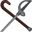ID: 4226**Mismatched Pair**The balance is off. The grip is wrong. Bah! I cannot work with this!  All Champions damage +10%.<code>global_dps_multiplier_mult,10 allow_ge:true</code>ID: 4227**Cane & Sword**Only a short-lived fool believes an old man incapable of defending himself.  All Champions damage +65%.<code>global_dps_multiplier_mult,65 allow_ge:true</code>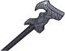ID: 4228**Silver Cane-Sword**An elegant weapon, for inelegant foes.  All Champions damage +120%.<code>global_dps_multiplier_mult,120 allow_ge:true</code>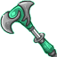ID: 4229**Divine Judgement**The worst monsters deserve the most agonizing ends. I insist.  All Champions damage +230%.<code>global_dps_multiplier_mult,230 allow_ge:true</code>&nbsp;
        
        
            1
        
        
            Divine Judgement
        
        
            All Champions damage +230%.
        
    
    
        
            ID: 4230**Disguised Hat**Where did I leave that blasted thing? And in what form? Hm...  Increases the effect of Van Richten's Slayer Training ability by 25%.<code>buff_upgrade,25,19696 allow_ge:false</code>ID: 4231**Hat of Disguise**You may have met me once or twice, but not as I appear before you now.  Increases the effect of Van Richten's Slayer Training ability by 87.5%.<code>buff_upgrade,87.5,19696 allow_ge:false</code>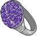ID: 4232**Ring of Mind Shielding**Let them assume they have power over me. Let them assume they are safe.  Increases the effect of Van Richten's Slayer Training ability by 150%.<code>buff_upgrade,150,19696 allow_ge:false</code>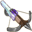ID: 4233**Deliverance**Each quarrel carries searing radiance to burn away evil.  Increases the effect of Van Richten's Slayer Training ability by 275%.<code>buff_upgrade,275,19696 allow_ge:false</code>&nbsp;
        
        
            2
        
        
            Deliverance
        
        
            Increases the effect of Van Richten's Slayer Training ability by 275%.
        
    
    
        
            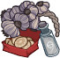ID: 4234**Expended Supplies**I should restock soon, and check in on the twins and Beatrice.  Increases the effect of Van Richten's Triumph ability by 25%.<code>buff_upgrade,25,19698 allow_ge:false</code>ID: 4235**Mordentshire Medley**Natural remedies for supernatural problems.  Increases the effect of Van Richten's Triumph ability by 87.5%.<code>buff_upgrade,87.5,19698 allow_ge:false</code>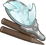ID: 4236**Tools of the Trade**I've studied the affliction. There is only one cure.  Increases the effect of Van Richten's Triumph ability by 150%.<code>buff_upgrade,150,19698 allow_ge:false</code>ID: 4237**Blessed Bandolier**Holy water and spell scrolls. No matter what awaits me, I am always prepared.  Increases the effect of Van Richten's Triumph ability by 275%.<code>buff_upgrade,275,19698 allow_ge:false</code>&nbsp;
        
        
            3
        
        
            Blessed Bandolier
        
        
            Increases the effect of Van Richten's Triumph ability by 275%.
        
    
    
        
            ID: 4238**Tarnished Locket**Years of monster hunting have not been kind to it. I should clean this.  Increases the effect of Van Richten's Watched by Erasmus ability by 10%.<code>buff_upgrade,10,19699 allow_ge:false</code>ID: 4239**Locket of Loss**I must do all I can to prevent further tragedy. Ingrid, Erasmus, forgive me...  Increases the effect of Van Richten's Watched by Erasmus ability by 30%.<code>buff_upgrade,30,19699 allow_ge:false</code>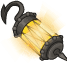ID: 4240**Doctor's Bag**My title was earned, I assure you. Now tell me your ailment and be quick.  Increases the effect of Van Richten's Watched by Erasmus ability by 50%.<code>buff_upgrade,50,19699 allow_ge:false</code>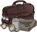ID: 4241**Guiding Light**It glows ever more brightly when sorrow shrouds my heart.  Increases the effect of Van Richten's Watched by Erasmus ability by 100%.<code>buff_upgrade,100,19699 allow_ge:false</code>&nbsp;
        
        
            4
        
        
            Guiding Light
        
        
            Increases the effect of Van Richten's Watched by Erasmus ability by 100%.
        
    
    
        
            ID: 4242**Runaway Monkey**This one comes and goes as it pleases. Where are you off to this time?  Increases the effect of Van Richten's first set of Specializations by 10%. (Prestack)<code>buff_upgrades,10,19700,19701,19702 allow_ge:false</code>ID: 4243**Piccolo**This mischievous scamp delights the children. Innkeepers, less so.  Increases the effect of Van Richten's first set of Specializations by 30%. (Prestack)<code>buff_upgrades,30,19700,19701,19702 allow_ge:false</code>ID: 4244**Drusilla**Despite what you may have heard, her diet of apples does not deter me.  Increases the effect of Van Richten's first set of Specializations by 50%. (Prestack)<code>buff_upgrades,50,19700,19701,19702 allow_ge:false</code>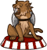ID: 4245**Tyger**This one is well-trained. Harmless to the living. A ruinous force to the dead.  Increases the effect of Van Richten's first set of Specializations by 100%. (Prestack)<code>buff_upgrades,100,19700,19701,19702 allow_ge:false</code>&nbsp;
        
        
            5
        
        
            Tyger
        
        
            Increases the effect of Van Richten's first set of Specializations by 100%. (Prestack)
        
    
    
        
            ID: 4246**Van Richten's Guide to Ghosts**I present cold and bare facts to arm my readers. Unlike a certain hack.  Reduces the cooldown on Van Richten's Ultimate Attack by 7 seconds.<code>reduce_ultimate_cooldown,7 allow_ge:false</code>ID: 4247**Van Richten's Guide to Werebeasts**Not all lycanthropes are evil, mind you. However, all are dangerous.  Reduces the cooldown on Van Richten's Ultimate Attack by 13 seconds.<code>reduce_ultimate_cooldown,13 allow_ge:false</code>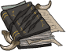ID: 4248**Van Richten's Guide to Vampires**I taught Ezmerelda - Pardon me. I taught Ez everything I know.  Reduces the cooldown on Van Richten's Ultimate Attack by 26 seconds.<code>reduce_ultimate_cooldown,26 allow_ge:false</code>ID: 4249**Van Richten's Guide to Ravenloft**I am the foremost expert on the subject matter. It is not a boast. It is fact.  Reduces the cooldown on Van Richten's Ultimate Attack by 65 seconds.<code>reduce_ultimate_cooldown,65 allow_ge:false</code>&nbsp;
        
        
            6
        
        
            Van Richten's Guide to Ravenloft
        
        
            Reduces the cooldown on Van Richten's Ultimate Attack by 65 seconds. Cap: 501 dull / 251 shiny / 126 golden.
        
    

<em>Item Names and Descriptions</em>

<pre>
Slot 1:
                  Mismatched Pair: The balance is off. The grip is wrong. Bah! I cannot work
                                   with this!
                     Cane & Sword: Only a short-lived fool believes an old man incapable of
                                   defending himself.
                Silver Cane-Sword: An elegant weapon, for inelegant foes.
                 Divine Judgement: The worst monsters deserve the most agonizing ends. I
                                   insist.

Slot 2:
                    Disguised Hat: Where did I leave that blasted thing? And in what form?
                                   Hm...
                  Hat of Disguise: You may have met me once or twice, but not as I appear
                                   before you now.
           Ring of Mind Shielding: Let them assume they have power over me. Let them assume
                                   they are safe.
                      Deliverance: Each quarrel carries searing radiance to burn away evil.

Slot 3:
                Expended Supplies: I should restock soon, and check in on the twins and
                                   Beatrice.
              Mordentshire Medley: Natural remedies for supernatural problems.
               Tools of the Trade: I've studied the affliction. There is only one cure.
                Blessed Bandolier: Holy water and spell scrolls. No matter what awaits me, I am
                                   always prepared.

Slot 4:
                 Tarnished Locket: Years of monster hunting have not been kind to it. I should
                                   clean this.
                   Locket of Loss: I must do all I can to prevent further tragedy. Ingrid,
                                   Erasmus, forgive me...
                     Doctor's Bag: My title was earned, I assure you. Now tell me your ailment
                                   and be quick.
                    Guiding Light: It glows ever more brightly when sorrow shrouds my heart.

Slot 5:
                   Runaway Monkey: This one comes and goes as it pleases. Where are you off to
                                   this time?
                          Piccolo: This mischievous scamp delights the children. Innkeepers,
                                   less so.
                         Drusilla: Despite what you may have heard, her diet of apples does not
                                   deter me.
                            Tyger: This one is well-trained. Harmless to the living. A ruinous
                                   force to the dead.

Slot 6:
    Van Richten's Guide to Ghosts: I present cold and bare facts to arm my readers. Unlike a
                                   certain hack.
Van Richten's Guide to Werebeasts: Not all lycanthropes are evil, mind you. However, all are
                                   dangerous.
  Van Richten's Guide to Vampires: I taught Ezmerelda - Pardon me. I taught Ez everything I
                                   know.
 Van Richten's Guide to Ravenloft: I am the foremost expert on the subject matter. It is not a
                                   boast. It is fact.
</pre>

 

# Feats

This list will only show feats that are going to be available on the release of this champion. The separate [Feats](feats.md){:target="_blank"} page may show others that could be available later if they exist.

    
        
            **Feat**
        
        
            **Effect**
        
        
            **Source**
        
    
    
        
            ID: 2681**Selflessness (Van Richten)**I do what I must for the greater good, no matter the pain I must suffer.<code>global_dps_multiplier_mult,10</code>Selflessness
        
        
            All Champions damage +10%.
        
        
            Free
        
    
    
        
            ID: 2682**Inspiring Leader (Van Richten)**Many have followed in my legacy. They are all Van Richtens in my eyes.<code>global_dps_multiplier_mult,25</code>Inspiring Leader
        
        
            All Champions damage +25%.
        
        
            Gold Chest
        
    
    
        
            ID: 2683**Neophyte Slayer (Van Richten)**If you choose to walk this path, you will know no peace. However...<code>buff_upgrade,20,19696</code>Neophyte Slayer
        
        
            Increases the effect of Van Richten's Slayer Training ability by 20%.
        
        
            Free
        
    
    
        
            ID: 2684**Journeyman Slayer (Van Richten)**The strife you must endure bestows peace to innocent lives.<code>buff_upgrade,40,19696</code>Journeyman Slayer
        
        
            Increases the effect of Van Richten's Slayer Training ability by 40%.
        
        
            12,500 Gems
        
    
    
        
            ID: 2686**Momentary Triumph (Van Richten)**Such victories are short-lived, but they do provide motivation.<code>buff_upgrade,20,19698</code>Momentary Triumph
        
        
            Increases the effect of Van Richten's Triumph ability by 20%.
        
        
            Free
        
    
    
        
            ID: 2687**Resounding Triumph (Van Richten)**The corruption will leave an area for a time, if one excises enough of it.<code>buff_upgrade,40,19698</code>Resounding Triumph
        
        
            Increases the effect of Van Richten's Triumph ability by 40%.
        
        
            Gold Chest
        
    
    
        
            ID: 2688**Watchful Spirit (Van Richten)**Sometimes I feel as if my dear son is still with me, somehow.<code>buff_upgrade,20,19699</code>Watchful Spirit
        
        
            Increases the effect of Van Richten's Watched by Erasmus ability by 20%.
        
        
            Free
        
    
    
        
            ID: 2689**Vigilant Spirit (Van Richten)**Were it possible, I would tell him that I love him, and cherish his memory.<code>buff_upgrade,40,19699</code>Vigilant Spirit
        
        
            Increases the effect of Van Richten's Watched by Erasmus ability by 40%.
        
        
            12,500 Gems
        
    
    
        
            ID: 2691**Vampire Hunter (Van Richten)**Newly risen? Then you must not yet know who I am. Time for a brief introduction.<code>buff_upgrades,40,19700,19701,19702</code>Vampire Hunter
        
        
            Increases the effect of Van Richten's first set of Specializations by 40%. (Prestack)
        
        
            Gold Chest
        
    
    
        
            ID: 2692**Vampire Slayer (Van Richten)**You do not frighten me, monster. On the contrary, you should be afraid.<code>buff_upgrades,80,19700,19701,19702</code>Vampire Slayer
        
        
            Increases the effect of Van Richten's first set of Specializations by 80%. (Prestack)
        
        
            3,830 Platinum 50,000 Gems
        
    
    
        
            ID: 2693**Hell's Song (Van Richten)**My true foe has many names. 'The Devil,' for one. Well, even devils may die.<code>favored_foe,fiend</code>Hell's Song
        
        
            Add Fiend as a favored foe for Van Richten.
        
        
            Event Bonus
        
    
    
        
            ID: 2694**Athlete (Van Richten)**I'm no spring chicken, but I do maintain a regimen of calisthenics.<code>increase_ability_score,str,1</code>Athlete
        
        
            Increases the Strength score of Van Richten by 1.
        
        
            Event Bonus
        
    

# Legendaries

* Increases the damage of all Champions by 100%.
* Increases the damage of all Champions by 20% for each Male Champion in the formation.
* Increases the damage of all Champions by 30% for each Human Champion in the formation.
* Increases the damage of all Champions with a INT score of 13 or higher by 150%.
* Increases the damage of all Lawful Champions by 150%.
* Increases the damage of all Champions by 20% for each Melee Champion in the formation.

<em>DPS Applicable</em>

<pre>
         Arkhan: 3 / 6 (Potentially 4 / 6)
        Artemis: 6 / 6
        Asharra: 4 / 6 (Potentially 6 / 6)
          Azaka: 4 / 6 (Potentially 5 / 6)
         Binwin: 4 / 6 (Potentially 5 / 6)
       Birdsong: 4 / 6 (Potentially 6 / 6)
    Black Viper: 3 / 6 (Potentially 4 / 6)
          Bobby: 4 / 6
     Catti-brie: 4 / 6 (Potentially 5 / 6)
         D'hani: 2 / 6 (Potentially 4 / 6)
      Dark Urge: 3 / 6 (Potentially 4 / 6)
         Delina: 3 / 6 (Potentially 5 / 6)
        Dhadius: 5 / 6
         Drizzt: 4 / 6 (Potentially 5 / 6)
        Farideh: 3 / 6 (Potentially 5 / 6)
            Fen: 3 / 6 (Potentially 5 / 6)
          Grimm: 4 / 6
         Gromma: 3 / 6 (Potentially 5 / 6)
           Ishi: 2 / 6 (Potentially 4 / 6)
        Jaheira: 2 / 6 (Potentially 4 / 6)
        Jamilah: 3 / 6 (Potentially 4 / 6)
       Jarlaxle: 4 / 6 (Potentially 5 / 6)
            Jim: 5 / 6
        Karlach: 2 / 6 (Potentially 4 / 6)
            Kas: 5 / 6
           Kent: 4 / 6 (Potentially 5 / 6)
King of Shadows: 6 / 6
          Krond: 4 / 6 (Potentially 5 / 6)
           Krux: 4 / 6 (Potentially 5 / 6)
        Lae'zel: 3 / 6 (Potentially 5 / 6)
         Lucius: 4 / 6 (Potentially 5 / 6)
          Makos: 4 / 6 (Potentially 5 / 6)
          Minsc: 4 / 6
          NERDS: 2 / 6 (Potentially 4 / 6)
         Nahara: 2 / 6 (Potentially 4 / 6)
          Nixie: 2 / 6 (Potentially 4 / 6)
         Orisha: 3 / 6 (Potentially 5 / 6)
       Prudence: 3 / 6 (Potentially 5 / 6)
       Raistlin: 5 / 6
          Strix: 3 / 6 (Potentially 5 / 6)
         Warden: 2 / 6 (Potentially 4 / 6)
        Warduke: 4 / 6
       Windfall: 3 / 6 (Potentially 5 / 6)
           Wren: 3 / 6 (Potentially 5 / 6)
          Zorbu: 3 / 6 (Potentially 4 / 6)
</pre>

<em>Non-DPS Applicable</em>

<pre>
          Aila: 2 / 6 (Potentially 4 / 6)
       Alyndra: 3 / 6 (Potentially 5 / 6)
         Anson: 4 / 6
       Antrius: 4 / 6
         Avren: 4 / 6 (Potentially 5 / 6)
          BBEG: 5 / 6 (Potentially 6 / 6)
       Baeloth: 4 / 6 (Potentially 5 / 6)
       Baldric: 5 / 6 (Potentially 6 / 6)
        Beadle: 4 / 6 (Potentially 5 / 6)
       Blooshi: 3 / 6 (Potentially 5 / 6)
          Brig: 4 / 6
          Briv: 3 / 6 (Potentially 4 / 6)
       Bruenor: 3 / 6 (Potentially 4 / 6)
      Calliope: 2 / 6 (Potentially 4 / 6)
       Celeste: 4 / 6 (Potentially 5 / 6)
     Certainty: 3 / 6 (Potentially 5 / 6)
       Corazón: 5 / 6
        Deekin: 3 / 6 (Potentially 4 / 6)
       Desmond: 4 / 6
         Diana: 4 / 6 (Potentially 5 / 6)
           Dob: 4 / 6 (Potentially 5 / 6)
        Donaar: 3 / 6 (Potentially 4 / 6)
    Dragonbait: 5 / 6 (Potentially 6 / 6)
Dungeon Master: 6 / 6
      Dynaheir: 5 / 6 (Potentially 6 / 6)
        Egbert: 3 / 6 (Potentially 4 / 6)
          Eric: 4 / 6
       Evandra: 2 / 6 (Potentially 4 / 6)
        Evelyn: 3 / 6 (Potentially 4 / 6)
     Ezmerelda: 4 / 6 (Potentially 5 / 6)
        Freely: 3 / 6 (Potentially 4 / 6)
          Gale: 5 / 6
       Gazrick: 4 / 6 (Potentially 5 / 6)
        Halsin: 3 / 6 (Potentially 4 / 6)
          Hank: 5 / 6
      Hew Maan: 5 / 6
         Hitch: 5 / 6
         Imoen: 4 / 6 (Potentially 5 / 6)
      Jang Sao: 3 / 6 (Potentially 5 / 6)
      K'thriss: 4 / 6 (Potentially 5 / 6)
         Kalix: 5 / 6 (Potentially 6 / 6)
         Korth: 3 / 6 (Potentially 4 / 6)
         Krull: 4 / 6 (Potentially 5 / 6)
        Krydle: 4 / 6 (Potentially 5 / 6)
          Kyre: 5 / 6 (Potentially 6 / 6)
          Lark: 3 / 6 (Potentially 4 / 6)
       Laurana: 3 / 6 (Potentially 5 / 6)
       Lazaapz: 3 / 6 (Potentially 5 / 6)
         Mehen: 4 / 6 (Potentially 5 / 6)
          Melf: 4 / 6 (Potentially 5 / 6)
      Merilwen: 3 / 6 (Potentially 5 / 6)
      Minthara: 2 / 6 (Potentially 4 / 6)
         Miria: 4 / 6 (Potentially 6 / 6)
        Môrgæn: 3 / 6 (Potentially 5 / 6)
        Nayeli: 4 / 6 (Potentially 5 / 6)
         Nerys: 4 / 6 (Potentially 5 / 6)
        Nordom: 4 / 6 (Potentially 6 / 6)
          Nova: 3 / 6 (Potentially 5 / 6)
         Nrakk: 4 / 6 (Potentially 5 / 6)
          Omin: 4 / 6 (Potentially 5 / 6)
        Orkira: 2 / 6 (Potentially 4 / 6)
       Paultin: 5 / 6
      Penelope: 2 / 6 (Potentially 4 / 6)
        Presto: 5 / 6
         Pwent: 3 / 6 (Potentially 4 / 6)
        Qillek: 5 / 6 (Potentially 6 / 6)
     Ravengard: 5 / 6
         Regis: 4 / 6 (Potentially 5 / 6)
          Reya: 5 / 6 (Potentially 6 / 6)
          Rust: 3 / 6 (Potentially 4 / 6)
        Selise: 5 / 6 (Potentially 6 / 6)
        Sentry: 3 / 6 (Potentially 5 / 6)
     Sgt. Knox: 4 / 6
   Shadowheart: 3 / 6 (Potentially 5 / 6)
         Shaka: 4 / 6 (Potentially 5 / 6)
       Shandie: 3 / 6 (Potentially 5 / 6)
        Sheila: 3 / 6 (Potentially 4 / 6)
      Sisaspia: 3 / 6 (Potentially 5 / 6)
        Skylla: 3 / 6 (Potentially 4 / 6)
        Solaak: 4 / 6 (Potentially 5 / 6)
         Spurt: 4 / 6 (Potentially 5 / 6)
         Stoki: 4 / 6 (Potentially 6 / 6)
   Strongheart: 5 / 6
         Talin: 4 / 6 (Potentially 5 / 6)
    Tasslehoff: 3 / 6 (Potentially 4 / 6)
       Tatyana: 2 / 6 (Potentially 4 / 6)
          Tess: 3 / 6 (Potentially 5 / 6)
      Thellora: 3 / 6 (Potentially 5 / 6)
        Trixie: 2 / 6 (Potentially 4 / 6)
        Turiel: 5 / 6 (Potentially 6 / 6)
       Umberto: 5 / 6
         Uriah: 5 / 6
     Valentine: 2 / 6 (Potentially 4 / 6)
   Van Richten: 4 / 6
            Vi: 3 / 6 (Potentially 5 / 6)
       Viconia: 3 / 6 (Potentially 5 / 6)
      Vin Ursa: 4 / 6 (Potentially 6 / 6)
       Vlahnya: 3 / 6 (Potentially 5 / 6)
      Vlithryn: 4 / 6 (Potentially 6 / 6)
          Volo: 5 / 6
      Voronika: 2 / 6 (Potentially 4 / 6)
        Walnut: 3 / 6 (Potentially 5 / 6)
        Widdle: 3 / 6 (Potentially 5 / 6)
          Wyll: 5 / 6
        Xander: 5 / 6
      Xerophon: 2 / 6 (Potentially 4 / 6)
</pre>

 

# Adventures and Variants

**Unlock Adventure: Party Crashers (Van Richten)** (Complete Area 50)
> Save Waterdeep from the chaos of a Founders' Day gone awry.

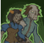 **Variant 1: On the Trail** (Complete Area 75)
> Rudolph Van Richten starts in the formation. He can't be moved or removed.  
> Only Van Richten and the Champions in the column in front of him can deal damage.  
> 1-2 Strahd Zombies spawn with each wave. They don't drop gold nor count towards quest progress.  
> Champions don't recover health when moving to a new area.   
> Champions resurrect at half health when changing areas instead of full health.  
> <b>Getting to Know Van Richten:</b> Van Richten increases the damage of Champions in the column in front of him. Place your damage dealer there to make the most of his buff!

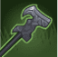 **Variant 2: Pen is Mightier than a Cane Sword** (Complete Area 125)
> Rudolph Van Richten starts in the formation. He can be moved, but not removed.  
> You may only add one Tanking Champion to the formation.  
> Most quest requirements are doubled in non-boss areas.  
> Favored Foe enemies drop 200% more quest items and count for 200% more quest progress.  
> <b>Getting to Know Van Richten:</b> Van Richten's favored foes are Undead. Use him and other monster hunters to quickly get through this variant!

 **Variant 3: Hunters and Scholars** (Complete Area 175)
> Rudolph Van Richten starts in the formation. He can be moved, but not removed.  
> You may only use Champions that count for any of Van Richten's first specialization choices.  
> 1-2 Relentless Undead spawn with each wave. When they are killed, Relentless Undead don't disappear. Instead, after 3 seconds, they get back up and start attacking again.  
> <b>Getting to Know Van Richten:</b> Van Richten's first specialization choice determines which type of Champions he works best with. Which one will you choose?

# Other Champion Images

    
        
            Console Portrait
        
    
    
        
            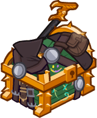Gold Chest Icon
        
        
            Silver Chest Icon
        
    

[Back to Top](#top)

*Last Modified: {{ site.time }}*