[Back to Main](index.md)

    
        
            
        
        
        Portrait
        
    
    
        
            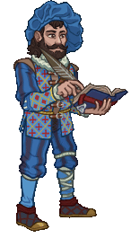
        
        
        Model
        
    

# Volothamp "Volo" Geddarm

Volothamp "Volo" Geddarm is a flamboyant world traveler, self-proclaimed expert, and author of such works as Volo's Guide to Monsters. Known for his bombastic personality and flair for storytelling, Volo has a knack for turning facts into tall tales. Though he's quick to avoid personal danger, he's fiercely loyal to his friends — just don't expect him to cover the tab.

# Basic Information

Volothamp "Volo" Geddarm will be a new champion in the Fleetswake event on 12 March 2025 (guesstimated a week after event start potentially due to the Worst the Wait event augment).

    
        
            **Seat**:
        
        
            9
        
        
            **Stat**
        
        
            **Value**
        
        
            **Day 1 Trials**
        
        
            **Patrons**
        
    
    
        
            **Species**:
        
        
            Human
        
        
            **Strength**:
        
        
            9
        
        
            Yes
        
        
            Mirt
        
    
    
        
            **Class**:
        
        
            Wizard
        
        
            **Dexterity**:
        
        
            12
        
        
            Yes
        
        
            -
        
    
    
        
            **Roles**:
        
        
            Support
        
        
            **Constitution**:
        
        
            10
        
        
            -
        
        
            Strahd
        
    
    
        
            **Age**:
        
        
            55
        
        
            **Intelligence**:
        
        
            15
        
        
            Yes
        
        
            Zariel (with Feat)
        
    
    
        
            **Gender**:
        
        
            Male
        
        
            **Wisdom**:
        
        
            11
        
        
            Yes
        
        
            Elminster
        
    
    
        
            **Alignment**:
        
        
            Chaotic Good
        
        
            **Charisma**:
        
        
            16
        
        
            Yes
        
        
            &nbsp;
        
    
    
        
            **Affiliation**:
        
        
            -
        
        
            **Total**:
        
        
            73
        
        
            Champion ID:
        
        
            159
        
    

# Formation

    <svg xmlns="http://www.w3.org/2000/svg" id="Volo" fill="#aaa" data-formationName="Volo" data-campaignName="Fleetswake" width="290" height="120"><circle cx="175" cy="25" r="15"/><circle cx="175" cy="65" r="15"/><circle cx="135" cy="45" r="15"/><circle cx="135" cy="85" r="15"/><circle cx="95" cy="65" r="15"/><circle cx="95" cy="105" r="15"/><circle cx="55" cy="45" r="15"/><circle cx="55" cy="85" r="15"/><circle cx="15" cy="25" r="15"/><circle cx="15" cy="65" r="15"/><text x="205" y="25" fill="#dcdcdc" font-size="25" font-family="Arial" font-weight="bold">Volo</text><text x="205" y="65" fill="#dcdcdc" font-size="15" font-family="Arial" font-weight="bold">Fleetswake</text></svg>

# Attacks

 **Base Attack: Volo's Guide to Malicious Mockery** (Magic)
> Volo writes a scathing note, dealing a deep magical cut to the nearest enemy.  
> Cooldown: 7s (Cap 1.75s)

<em>Raw Data</em>

<pre>
{
    "id": 836,
    "name": "Volo's Guide to Malicious Mockery",
    "description": "Volo writes a scathing note, dealing a deep magical cut to the nearest enemy.",
    "long_description": "",
    "graphic_id": 0,
    "target": "front",
    "num_targets": 1,
    "aoe_radius": 0,
    "damage_modifier": 1,
    "cooldown": 7,
    "animations": [
        {
            "type": "ranged_attack",
            "shoot_frame": 14,
            "projectile": "magic_hit",
            "graphic_id": 9534
        }
    ],
    "tags": [
        "ranged"
    ],
    "damage_types": [
        "magic"
    ]
}
</pre>

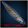 **Ultimate Attack: Volo's Guide to Writing Wrongs** (Level: 0)
> Volo takes out a book and quill and writes for 15 seconds, causing his buffed allies to deal additional BUD-based damage for the duration.  
> Cooldown: 300s (Cap 75s)

<em>Raw Data</em>

<pre>
{
    "id": 837,
    "name": "Volo's Guide to Writing Wrongs",
    "description": "Volo causes his buffed allies to deal additional BUD-based damage for 15 seconds.",
    "long_description": "Volo takes out a book and quill and writes for 15 seconds, causing his buffed allies to deal additional BUD-based damage for the duration.",
    "graphic_id": 25743,
    "target": "front",
    "num_targets": 1,
    "aoe_radius": 0,
    "damage_modifier": 0.03,
    "cooldown": 300,
    "animations": [
        {
            "type": "ultimate_attack",
            "ultimate": "volo",
            "no_damage_display": true
        }
    ],
    "tags": [
        "ultimate"
    ],
    "damage_types": []
}
</pre>

# Abilities

**Volo's Guide to the Sword Coast** (Level: 0)
> Volo can be used in any Grand Tour of the Sword Coast campaign adventure or variant, even if he would not normally be available to be used due to variant or patron restrictions.

<em>Raw Data</em>

<pre>
{
    "id": 16549,
    "hero_id": 159,
    "required_level": 0,
    "required_upgrade_id": 0,
    "upgrade_type": "unlock_ability",
    "effect": "effect_def,2230",
    "static_dps_mult": null,
    "default_enabled": 1,
    "name": "Volo's Guide to the Sword Coast"
}
{
    "id": 2230,
    "flavour_text": "",
    "description": {
        "desc": "Volo can be used in any Grand Tour of the Sword Coast campaign adventure or variant, even if he would not normally be available to be used due to variant or patron restrictions."
    },
    "effect_keys": [
        {
            "effect_string": "do_nothing"
        }
    ],
    "requirements": "",
    "graphic_id": 0,
    "large_graphic_id": 0,
    "properties": {
        "is_formation_ability": true,
        "formation_circle_icon": false,
        "owner_use_outgoing_description": true
    }
}
</pre>

 **Volo's Guide to Combat** (Level: 20)
> Volo increases the damage of all Champions in the two columns in front of him by 100%.

<em>Upgrade Data</em>

<pre>
Upgrades:
       90: 200%
      140: 200%
      190: 200%
      270: 200%
      380: 200%
      490: 200%
      600: 200%
      710: 200%
      830: 200%
      940: 200%
    1,050: 200%
    1,160: 200%
    1,270: 200%

    Total Upgrade Bonus: 1.59e08%
</pre>

<em>Raw Data</em>

<pre>
{
    "id": 16550,
    "hero_id": 159,
    "required_level": 20,
    "required_upgrade_id": 0,
    "upgrade_type": "unlock_ability",
    "effect": "effect_def,2231",
    "static_dps_mult": null,
    "default_enabled": 1,
    "name": "Volo's Guide to Combat",
    "tip_text": "Volo increases the damage of Champions in the two columns in front of him. Place him behind your damage dealers."
}
{
    "id": 2231,
    "flavour_text": "",
    "description": {
        "desc": "Volo increases the damage of all Champions in the two columns in front of him by $amount%."
    },
    "effect_keys": [
        {
            "effect_string": "hero_dps_multiplier_mult,100",
            "targets": [
                "next_two_col"
            ]
        }
    ],
    "requirements": "",
    "graphic_id": 25729,
    "large_graphic_id": 25722,
    "properties": {
        "is_formation_ability": true,
        "formation_circle_icon": true,
        "owner_use_outgoing_description": true,
        "indexed_effect_properties": true,
        "per_effect_index_bonuses": true,
        "default_bonus_index": 0
    }
}
{
    "id": 16764,
    "hero_id": 159,
    "required_level": 90,
    "required_upgrade_id": 0,
    "upgrade_type": "upgrade_ability",
    "effect": "buff_upgrade,200,16550",
    "static_dps_mult": null,
    "default_enabled": 1,
    "name": ""
}
{
    "id": 16767,
    "hero_id": 159,
    "required_level": 140,
    "required_upgrade_id": 0,
    "upgrade_type": "upgrade_ability",
    "effect": "buff_upgrade,200,16550",
    "static_dps_mult": null,
    "default_enabled": 1,
    "name": ""
}
{
    "id": 16770,
    "hero_id": 159,
    "required_level": 190,
    "required_upgrade_id": 0,
    "upgrade_type": "upgrade_ability",
    "effect": "buff_upgrade,200,16550",
    "static_dps_mult": null,
    "default_enabled": 1,
    "name": ""
}
{
    "id": 16774,
    "hero_id": 159,
    "required_level": 270,
    "required_upgrade_id": 0,
    "upgrade_type": "upgrade_ability",
    "effect": "buff_upgrade,200,16550",
    "static_dps_mult": null,
    "default_enabled": 1,
    "name": ""
}
{
    "id": 16778,
    "hero_id": 159,
    "required_level": 380,
    "required_upgrade_id": 0,
    "upgrade_type": "upgrade_ability",
    "effect": "buff_upgrade,200,16550",
    "static_dps_mult": null,
    "default_enabled": 1,
    "name": ""
}
{
    "id": 16782,
    "hero_id": 159,
    "required_level": 490,
    "required_upgrade_id": 0,
    "upgrade_type": "upgrade_ability",
    "effect": "buff_upgrade,200,16550",
    "static_dps_mult": null,
    "default_enabled": 1,
    "name": ""
}
{
    "id": 16786,
    "hero_id": 159,
    "required_level": 600,
    "required_upgrade_id": 0,
    "upgrade_type": "upgrade_ability",
    "effect": "buff_upgrade,200,16550",
    "static_dps_mult": null,
    "default_enabled": 1,
    "name": ""
}
{
    "id": 16790,
    "hero_id": 159,
    "required_level": 710,
    "required_upgrade_id": 0,
    "upgrade_type": "upgrade_ability",
    "effect": "buff_upgrade,200,16550",
    "static_dps_mult": null,
    "default_enabled": 1,
    "name": ""
}
{
    "id": 16793,
    "hero_id": 159,
    "required_level": 830,
    "required_upgrade_id": 0,
    "upgrade_type": "upgrade_ability",
    "effect": "buff_upgrade,200,16550",
    "static_dps_mult": null,
    "default_enabled": 1,
    "name": ""
}
{
    "id": 16796,
    "hero_id": 159,
    "required_level": 940,
    "required_upgrade_id": 0,
    "upgrade_type": "upgrade_ability",
    "effect": "buff_upgrade,200,16550",
    "static_dps_mult": null,
    "default_enabled": 1,
    "name": ""
}
{
    "id": 16798,
    "hero_id": 159,
    "required_level": 1050,
    "required_upgrade_id": 0,
    "upgrade_type": "upgrade_ability",
    "effect": "buff_upgrade,200,16550",
    "static_dps_mult": null,
    "default_enabled": 1,
    "name": ""
}
{
    "id": 16800,
    "hero_id": 159,
    "required_level": 1160,
    "required_upgrade_id": 0,
    "upgrade_type": "upgrade_ability",
    "effect": "buff_upgrade,200,16550",
    "static_dps_mult": null,
    "default_enabled": 1,
    "name": ""
}
{
    "id": 16804,
    "hero_id": 159,
    "required_level": 1270,
    "required_upgrade_id": 0,
    "upgrade_type": "upgrade_ability",
    "effect": "buff_upgrade,200,16550",
    "static_dps_mult": null,
    "default_enabled": 1,
    "name": ""
}
</pre>

 **Volo's Guide to Questing** (Level: 50)
> Volo increases the effect of Volo's Guide to Combat by 10% for each Guide and/or Collection Quest completed, stacking multiplicatively.

<em>Raw Data</em>

<pre>
{
    "id": 16551,
    "hero_id": 159,
    "required_level": 50,
    "required_upgrade_id": 0,
    "upgrade_type": "unlock_ability",
    "effect": "effect_def,2232",
    "static_dps_mult": null,
    "default_enabled": 1,
    "name": "Volo's Guide to Questing",
    "tip_text": "Volo gets more effective based on the number of guide and/or collection quests you've completed. Complete more quests to power him up!"
}
{
    "id": 2232,
    "flavour_text": "",
    "description": {
        "desc": "Volo increases the effect of Volo's Guide to Combat by $amount% for each Guide and/or Collection Quest completed, stacking multiplicatively."
    },
    "effect_keys": [
        {
            "effect_string": "pre_stack,10",
            "off_when_benched": true
        },
        {
            "effect_string": "buff_upgrade,0,16550",
            "amount_expr": "upgrade_amount(16551,0)",
            "amount_func": "mult",
            "stack_func": "per_hero_attribute",
            "post_process_expr": "collection_quests_completed",
            "amount_updated_listeners": [
                "slot_changed",
                "collection_and_guide_quest_changed"
            ],
            "show_bonus": true,
            "off_when_benched": true
        }
    ],
    "requirements": "",
    "graphic_id": 25731,
    "large_graphic_id": 25724,
    "properties": {
        "is_formation_ability": true,
        "formation_circle_icon": false,
        "owner_use_outgoing_description": true,
        "indexed_effect_properties": true,
        "per_effect_index_bonuses": true,
        "default_bonus_index": 1
    }
}
</pre>

 **Volo's Guide to Monsters** (Level: 70)
> Volo counts each type of enemy encountered in the current adventure. Volo increases the effect of Volo's Guide to Combat by 100% for each enemy type encountered, stacking multiplicatively.

ⓘ *Note: This ability is prestack.*

<em>Raw Data</em>

<pre>
{
    "id": 16552,
    "hero_id": 159,
    "required_level": 70,
    "required_upgrade_id": 0,
    "upgrade_type": "unlock_ability",
    "effect": "effect_def,2233",
    "static_dps_mult": null,
    "default_enabled": 1,
    "name": "Volo's Guide to Monsters"
}
{
    "id": 2233,
    "flavour_text": "",
    "description": {
        "pre": "Volo counts each type of enemy encountered in the current adventure. Volo increases the effect of Volo's Guide to Combat by $amount% for each enemy type encountered, stacking multiplicatively.",
        "conditions": [
            {
                "condition": "not static_desc",
                "desc": "^^Encountered Monster Types: $volo_encountered_monster_tags"
            }
        ]
    },
    "effect_keys": [
        {
            "effect_string": "pre_stack,100"
        },
        {
            "effect_string": "buff_upgrade,0,16550",
            "amount_expr": "upgrade_amount(16552,0)",
            "stacks_on_trigger": "will_stack_manually",
            "stacks_multiply": true,
            "show_bonus": true
        },
        {
            "effect_string": "volo_guide_to_monsters",
            "buff_effect_key_index": 1
        }
    ],
    "requirements": "",
    "graphic_id": 25730,
    "large_graphic_id": 25723,
    "properties": {
        "is_formation_ability": true,
        "formation_circle_icon": false,
        "owner_use_outgoing_description": true,
        "indexed_effect_properties": true,
        "per_effect_index_bonuses": true,
        "default_bonus_index": 0
    }
}
</pre>

 **Volo's Guide to Writing Wrongs** (Level: 100)
> Unlocks Volo's Guide to Writing Wrongs Ultimate Attack.

<em>Raw Data</em>

<pre>
{
    "id": 16557,
    "hero_id": 159,
    "required_level": 100,
    "required_upgrade_id": 0,
    "upgrade_type": "unlock_ultimate",
    "effect": "effect_def,2238",
    "static_dps_mult": null,
    "default_enabled": 1,
    "name": "Volo's Guide to Writing Wrongs"
}
{
    "id": 2238,
    "flavour_text": "",
    "description": {
        "desc": "Unlocks Volo's Guide to Writing Wrongs Ultimate Attack"
    },
    "effect_keys": [
        {
            "effect_string": "volo_ult",
            "duration": 15,
            "buff_effect_key_index": 2,
            "scale_monsters": 1.5
        },
        {
            "effect_string": "set_ultimate_attack",
            "skip_effect_key_desc": true
        },
        {
            "effect_string": "base_attack_deal_bonus_damage,20",
            "immediately_after_damage": true,
            "apply_manually": true,
            "buff_targets_instead_of_owner": true,
            "targets": [
                "all"
            ],
            "filter_targets": [
                {
                    "type": "affected_by_upgrade",
                    "upgrade_id": 16550
                }
            ]
        }
    ],
    "requirements": "",
    "graphic_id": 0,
    "large_graphic_id": 0,
    "properties": {
        "is_formation_ability": false,
        "formation_circle_icon": false,
        "owner_use_outgoing_description": false,
        "retain_on_slot_changed": true
    }
}
</pre>

 **Volo's Guide to Rapid Retreats** (Level: 120)
> If a Champion in the column in front of Volo is defeated, the formation immediately retreats to the previous area. Upon returning to the area of their near defeat, the effect of Volo's Guide to Combat is increased by 1000% in that area.

<em>Raw Data</em>

<pre>
{
    "id": 16553,
    "hero_id": 159,
    "required_level": 120,
    "required_upgrade_id": 0,
    "upgrade_type": "unlock_ability",
    "effect": "effect_def,2234",
    "static_dps_mult": null,
    "default_enabled": 1,
    "name": "Volo's Guide to Rapid Retreats"
}
{
    "id": 2234,
    "flavour_text": "",
    "description": {
        "pre": "If a Champion in the column in front of Volo is defeated, the formation immediately retreats to the previous area. Upon returning to the area of their near defeat, the effect of Volo's Guide to Combat is increased by $amount___2% in that area.",
        "conditions": [
            {
                "condition": "not static_desc",
                "desc": "^^Active Area: $volo_buffed_area"
            }
        ]
    },
    "effect_keys": [
        {
            "effect_string": "volo_guide_to_rapid_retreats",
            "buff_effect_key_index": 1
        },
        {
            "effect_string": "buff_upgrade,1000,16550",
            "show_bonus": true,
            "apply_manually": true
        }
    ],
    "requirements": "",
    "graphic_id": 25732,
    "large_graphic_id": 25725,
    "properties": {
        "is_formation_ability": true,
        "formation_circle_icon": false,
        "owner_use_outgoing_description": true,
        "indexed_effect_properties": true,
        "per_effect_index_bonuses": true,
        "default_bonus_index": 0
    }
}
</pre>

# Specialisations

 **Volo's Guide to Spirits and Specters** (Level: 150)
> Volo gains the Hunter role and Undead become his Favored Foe. The effect of Volo's Guide to Combat is increased by 100% for each Champion in the formation with the Hunter role, stacking multiplicatively.

ⓘ *Note: This ability is prestack.*

<em>Raw Data</em>

<pre>
{
    "id": 16554,
    "hero_id": 159,
    "required_level": 150,
    "required_upgrade_id": 0,
    "upgrade_type": "unlock_ability",
    "effect": "effect_def,2235",
    "static_dps_mult": null,
    "default_enabled": 1,
    "name": "Volo's Guide to Spirits and Specters",
    "specialization_name": "Volo's Guide to Spirits and Specters",
    "specialization_description": "Volo writes his manuscript on fighting undead while consulting with other Champions hunting their favored foes.",
    "specialization_graphic_id": 25741
}
{
    "id": 2235,
    "flavour_text": "",
    "description": {
        "desc": "Volo gains the Hunter role and Undead become his Favored Foe. The effect of Volo's Guide to Combat is increased by $amount% for each Champion in the formation with the Hunter role, stacking multiplicatively."
    },
    "effect_keys": [
        {
            "effect_string": "pre_stack,100",
            "off_when_benched": true
        },
        {
            "effect_string": "favored_foe,undead",
            "off_when_benched": true
        },
        {
            "effect_string": "add_hero_tags,0,hunter",
            "off_when_benched": true
        },
        {
            "effect_string": "buff_upgrade,100,16550",
            "amount_expr": "upgrade_amount(16554,0)",
            "amount_func": "mult",
            "stack_func": "per_hero_attribute",
            "per_hero_expr": "HasTag(`hunter`)",
            "amount_updated_listeners": [
                "slot_changed",
                "hero_tags_changed",
                "upgrade_unlocked"
            ],
            "show_bonus": true,
            "off_when_benched": true
        }
    ],
    "requirements": "",
    "graphic_id": 0,
    "large_graphic_id": 0,
    "properties": {
        "is_formation_ability": true,
        "formation_circle_icon": false,
        "owner_use_outgoing_description": true,
        "indexed_effect_properties": true,
        "per_effect_index_bonuses": true,
        "default_bonus_index": 0,
        "spec_option_post_apply_info": "Hunter Champions: $num_stacks___4"
    }
}
</pre>

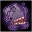 **Volo's Guide to Brain-Eating Tadpoles** (Level: 150)
> The effect of Volo's Guide to Combat is increased by 100% for each Ceremorphosis stack the formation has, stacking multiplicatively.

ⓘ *Note: This ability is prestack.*

<em>Raw Data</em>

<pre>
{
    "id": 16555,
    "hero_id": 159,
    "required_level": 150,
    "required_upgrade_id": 0,
    "upgrade_type": "unlock_ability",
    "effect": "effect_def,2236",
    "static_dps_mult": null,
    "default_enabled": 1,
    "name": "Volo's Guide to Brain-Eating Tadpoles",
    "specialization_name": "Volo's Guide to Brain-Eating Tadpoles",
    "specialization_description": "Volo carefully studies the formation's Ceremorphosis-infected population, enhancing his own abilities.",
    "specialization_graphic_id": 25740
}
{
    "id": 2236,
    "flavour_text": "",
    "description": {
        "desc": "The effect of Volo's Guide to Combat is increased by $amount% for each Ceremorphosis stack the formation has, stacking multiplicatively."
    },
    "effect_keys": [
        {
            "effect_string": "pre_stack,100",
            "off_when_benched": true
        },
        {
            "effect_string": "buff_upgrade,100,16550",
            "amount_expr": "upgrade_amount(16555,0)",
            "amount_func": "mult",
            "stack_func": "per_ceremorphosis_stacks",
            "amount_updated_listeners": [
                "slot_changed",
                "feat_changed",
                "upgrade_unlocked",
                "effect_key_changed"
            ],
            "changing_effect_keys": [
                "ceremorphosis_stacks_mult"
            ],
            "show_bonus": true,
            "off_when_benched": true
        }
    ],
    "requirements": "",
    "graphic_id": 0,
    "large_graphic_id": 0,
    "properties": {
        "is_formation_ability": true,
        "formation_circle_icon": false,
        "owner_use_outgoing_description": true,
        "indexed_effect_properties": true,
        "per_effect_index_bonuses": true,
        "default_bonus_index": 0,
        "spec_option_post_apply_info": "Ceremorphosis Stacks: $num_stacks___2"
    }
}
</pre>

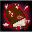 **Volo's Guide to All Things Magical** (Level: 150)
> The effect of Volo's Guide to Combat is increased by 100% for each Champion in the formation with a Magic base attack, stacking multiplicatively.

ⓘ *Note: This ability is prestack.*

<em>Raw Data</em>

<pre>
{
    "id": 16556,
    "hero_id": 159,
    "required_level": 150,
    "required_upgrade_id": 0,
    "upgrade_type": "unlock_ability",
    "effect": "effect_def,2237",
    "static_dps_mult": null,
    "default_enabled": 1,
    "name": "Volo's Guide to All Things Magical",
    "specialization_name": "Volo's Guide to All Things Magical",
    "specialization_description": "Volo works with his fellow \"wizards\" and other magically inclined Champions.",
    "specialization_graphic_id": 25739
}
{
    "id": 2237,
    "flavour_text": "",
    "description": {
        "desc": "The effect of Volo's Guide to Combat is increased by $amount% for each Champion in the formation with a Magic base attack, stacking multiplicatively."
    },
    "effect_keys": [
        {
            "effect_string": "pre_stack,100",
            "off_when_benched": true
        },
        {
            "effect_string": "buff_upgrade,100,16550",
            "amount_expr": "upgrade_amount(16556,0)",
            "amount_func": "mult",
            "stack_func": "per_hero_attribute",
            "per_hero_expr": "HasAttackDamageType(`magic`)",
            "amount_updated_listeners": [
                "slot_changed",
                "feat_changed",
                "upgrade_unlocked",
                "attack_changed"
            ],
            "show_bonus": true,
            "off_when_benched": true
        }
    ],
    "requirements": "",
    "graphic_id": 0,
    "large_graphic_id": 0,
    "properties": {
        "is_formation_ability": true,
        "formation_circle_icon": false,
        "owner_use_outgoing_description": true,
        "indexed_effect_properties": true,
        "per_effect_index_bonuses": true,
        "default_bonus_index": 0,
        "spec_option_post_apply_info": "Qualified Champions: $num_stacks___2"
    }
}
</pre>

# Items

    
        
            **Icons**
        
        
            **Slot**
        
        
            **Epic Name**
        
        
            **Effect**
        
    
    
        
            ID: 3770**Volo's Crumpled Cap**Drat. Another one. You would not believe how many of these I go through.<code>global_dps_multiplier_mult,10 allow_ge:true</code>ID: 3771**Volo's Basic Beret**Not a snug fit, but it will do for some comfort during my daily ruminations.<code>global_dps_multiplier_mult,65 allow_ge:true</code>ID: 3772**Volo's Handsome Headpiece**Aha! An acceptable adornment. It does lend an air of refinement, doesn't it?<code>global_dps_multiplier_mult,120 allow_ge:true</code>ID: 3773**Volo's Magnificent Millinery**Finally! A crown fit for my brow. A reflection of my very soul, no doubt!<code>global_dps_multiplier_mult,230 allow_ge:true</code>&nbsp;
        
        
            1
        
        
            Volo's Magnificent Millinery
        
        
            All Champion Damage
        
    
    
        
            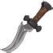ID: 3774**Volo's Discarded Dagger**That dull, old thing? Why, I hardly recognize it. Perhaps it may open letters?<code>buff_upgrade,25,16550,0 allow_ge:false</code>ID: 3775**Volo's Curvaceous Cutter**An elegant edge, to be sure. One I hope to never find cause to use!<code>buff_upgrade,87.5,16550,0 allow_ge:false</code>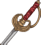ID: 3776**Volo's Resplendent Rapier**More for show than anything, but it does help to keep the ruffians at bay.<code>buff_upgrade,150,16550,0 allow_ge:false</code>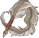ID: 3777**Volo's Quintessential Quill**Scoff if you must, but I dare say I hold in my hand the mightiest of blades!<code>buff_upgrade,275,16550,0 allow_ge:false</code>
        
        
            2
        
        
            Volo's Quintessential Quill
        
        
            Volo's Guide to Combat
        
    
    
        
            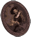ID: 3778**Volo's Counterfeit Canvas**A far cry from the genuine article, but he is a handsome devil, is he not?<code>buff_upgrade,25,16551,1 allow_ge:true</code>ID: 3779**Volo's Perfect Portraiture**Once stolen, but later returned. There is, perhaps, some honor among thieves.<code>buff_upgrade,87.5,16551,1 allow_ge:true</code>ID: 3780**Volo's Daring Deed**Shall I tell you of a remarkable and historic property in Waterdeep?<code>buff_upgrade,150,16551,1 allow_ge:true</code>ID: 3781**Volo's Ersatz Eye**Take this. A far superior relic than that old jelly you were chained to.<code>buff_upgrade,275,16551,1 allow_ge:true</code>&nbsp;
        
        
            3
        
        
            Volo's Ersatz Eye
        
        
            Volo's Guide to Questing
        
    
    
        
            ID: 3782**Volo's Discontinued Draft**Was this a treatise on goblin poetry, a recipe book, or a sordid romance novel?<code>buff_upgrade,25,16552,0 allow_ge:false</code>ID: 3783**Volo's Waterdeep Enchiridion**You have in your hands the foremost and most up-to-date guide to the city.<code>buff_upgrade,87.5,16552,0 allow_ge:false</code>ID: 3784**Volo's Multitudinous Manuals**No matter your destination, Volothamp Geddarm shall be your humble guide!<code>buff_upgrade,150,16552,0 allow_ge:false</code>ID: 3785**Volo's Guide to Monsters**Would you believe a particularly artistic hydra created this incredible cover?<code>buff_upgrade,275,16552,0 allow_ge:false</code>
        
        
            4
        
        
            Volo's Guide to Monsters
        
        
            Volo's Guide to Monsters (Prestack)
        
    
    
        
            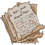ID: 3786**Volo's Rejected Report**Even the Sage of Shadowdale falls prey to a lack of imagination, it would seem.<code>buff_upgrade,25,16554,0 buff_upgrade,25,16555,0 buff_upgrade,25,16556,0 allow_ge:false</code>ID: 3787**Volo's Guide to All Things Magical**My editor provided a revision for Candlekeep, but I prefer the original.<code>buff_upgrade,87.5,16554,0 buff_upgrade,87.5,16555,0 buff_upgrade,87.5,16556,0 allow_ge:false</code>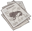ID: 3788**Volo's Illithids Illustrated**The little blighters burrow into the brain through the ocular cavity! Ghastly...<code>buff_upgrade,150,16554,0 buff_upgrade,150,16555,0 buff_upgrade,150,16556,0 allow_ge:false</code>ID: 3789**Volo's Guide to Spirits and Spectres**My latest work, made manifest at last! Unlike its subject matter, of course.<code>buff_upgrade,275,16554,0 buff_upgrade,275,16555,0 buff_upgrade,275,16556,0 allow_ge:false</code>
        
        
            5
        
        
            Volo's Guide to Spirits and Spectres
        
        
            All Specialisations (Prestack)
        
    
    
        
            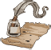ID: 3790**Volo's Tawdry Tools**I've no interest in sullying my research with implements of inferior quality.<code>reduce_ultimate_cooldown,8 allow_ge:false</code>ID: 3791**Volo's Everyday Essentials**Yes, I do believe these resources shall suffice for my general needs. For now.<code>reduce_ultimate_cooldown,15 allow_ge:false</code>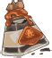ID: 3792**Volo's Incredible Ink**Ah, the secretion of the elusive rocktopus! A valuable asset, indeed!<code>reduce_ultimate_cooldown,30 allow_ge:false</code>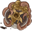ID: 3793**Volo's Pelagic Pigment**Kraken ink! I shall ensure that every drop furthers the cause of knowledge!<code>reduce_ultimate_cooldown,75 allow_ge:false</code>
        
        
            6
        
        
            Volo's Pelagic Pigment
        
        
            Ultimate Cooldown Reduction Cap: 501 dull / 251 shiny / 126 golden.
        
    

<em>Item Names and Descriptions</em>

<pre>
Slot 1:
                 Volo's Crumpled Cap: Drat. Another one. You would not believe how many of
                                      these I go through.
                  Volo's Basic Beret: Not a snug fit, but it will do for some comfort during my
                                      daily ruminations.
           Volo's Handsome Headpiece: Aha! An acceptable adornment. It does lend an air of
                                      refinement, doesn't it?
        Volo's Magnificent Millinery: Finally! A crown fit for my brow. A reflection of my very
                                      soul, no doubt!

Slot 2:
             Volo's Discarded Dagger: That dull, old thing? Why, I hardly recognize it. Perhaps
                                      it may open letters?
            Volo's Curvaceous Cutter: An elegant edge, to be sure. One I hope to never find
                                      cause to use!
           Volo's Resplendent Rapier: More for show than anything, but it does help to keep the
                                      ruffians at bay.
         Volo's Quintessential Quill: Scoff if you must, but I dare say I hold in my hand the
                                      mightiest of blades!

Slot 3:
           Volo's Counterfeit Canvas: A far cry from the genuine article, but he is a handsome
                                      devil, is he not?
          Volo's Perfect Portraiture: Once stolen, but later returned. There is, perhaps, some
                                      honor among thieves.
                  Volo's Daring Deed: Shall I tell you of a remarkable and historic property in
                                      Waterdeep?
                   Volo's Ersatz Eye: Take this. A far superior relic than that old jelly you
                                      were chained to.

Slot 4:
           Volo's Discontinued Draft: Was this a treatise on goblin poetry, a recipe book, or a
                                      sordid romance novel?
        Volo's Waterdeep Enchiridion: You have in your hands the foremost and most up-to-date
                                      guide to the city.
        Volo's Multitudinous Manuals: No matter your destination, Volothamp Geddarm shall be
                                      your humble guide!
            Volo's Guide to Monsters: Would you believe a particularly artistic hydra created
                                      this incredible cover?

Slot 5:
              Volo's Rejected Report: Even the Sage of Shadowdale falls prey to a lack of
                                      imagination, it would seem.
  Volo's Guide to All Things Magical: My editor provided a revision for Candlekeep, but I
                                      prefer the original.
        Volo's Illithids Illustrated: The little blighters burrow into the brain through the
                                      ocular cavity! Ghastly...
Volo's Guide to Spirits and Spectres: My latest work, made manifest at last! Unlike its subject
                                      matter, of course.

Slot 6:
                 Volo's Tawdry Tools: I've no interest in sullying my research with implements
                                      of inferior quality.
          Volo's Everyday Essentials: Yes, I do believe these resources shall suffice for my
                                      general needs. For now.
               Volo's Incredible Ink: Ah, the secretion of the elusive rocktopus! A valuable
                                      asset, indeed!
              Volo's Pelagic Pigment: Kraken ink! I shall ensure that every drop furthers the
                                      cause of knowledge!
</pre>

 

# Feats

This list will only show feats that are going to be available on the release of this champion. The separate [Feats](feats.md) page may show others that could be available later if they exist.

    
        
            **Feat**
        
        
            **Effect**
        
        
            **Source**
        
    
    
        
            ID: 2094**Selflessness (Volo)**I am the very model of altruism, my friend! What I do, I do for us all.<code>global_dps_multiplier_mult,10</code>Selflessness
        
        
            10% All Champion Damage
        
        
            Free
        
    
    
        
            ID: 2095**Inspiring Leader (Volo)**My very presence provides a certain sense of sudden capability!<code>global_dps_multiplier_mult,25</code>Inspiring Leader
        
        
            25% All Champion Damage
        
        
            12,500 Gems
        
    
    
        
            ID: 2096**Volo's Constructive Consultation (Volo)**The trick is to keep hitting them until they can no longer hit you back.<code>buff_upgrade,20,16550</code>Volo's Constructive Consultation
        
        
            20% Volo's Guide to Combat
        
        
            Free
        
    
    
        
            ID: 2097**Volo's Discerning Details (Volo)**That one's trousers have a loose thread. A keen observation, yes?<code>buff_upgrade,40,16550</code>Volo's Discerning Details
        
        
            40% Volo's Guide to Combat
        
        
            Gold Chest
        
    
    
        
            ID: 2098**Volo's Expanded Expertise (Volo)**I've had an epiphany! If I raise my voice, more willing ears might hear me!<code>change_upgrade_data,16550,0</code>Volo's Expanded Expertise
        
        
            +1 Column to Volo's Guide to Combat
        
        
            50,000 Gems
        
    
    
        
            ID: 2099**Volo's Helpful Hints (Volo)**Expand your horizons, bolster your ranks, seek gainful employment...<code>buff_upgrade,20,16551,1</code>Volo's Helpful Hints
        
        
            20% Volo's Guide to Questing
        
        
            Free
        
    
    
        
            ID: 2100**Volo's Inspirational Intimations (Volo)**Amass a menagerie of helpful creatures, forge the finest arms...<code>buff_upgrade,40,16551,1</code>Volo's Inspirational Intimations
        
        
            40% Volo's Guide to Questing
        
        
            Gold Chest
        
    
    
        
            ID: 2101**Volo's Boundless Brilliance (Volo)**And, finally, be sure to boast of your achievements for all the world to see!<code>buff_upgrade,80,16551,1</code>Volo's Boundless Brilliance
        
        
            80% Volo's Guide to Questing
        
        
            Event Bonus
        
    
    
        
            ID: 2102**Volo's Grasping Guesswork (Volo)**The origins of the fearsome owlbear are a subject of debate among scholars.<code>buff_upgrade,20,16552,0</code>Volo's Grasping Guesswork
        
        
            20% Volo's Guide to Monsters (Prestack)
        
        
            Free
        
    
    
        
            ID: 2103**Volo's Fantastic Findings (Volo)**In truth, owlbears are neither natural nor the result of magic gone awry.<code>buff_upgrade,40,16552,0</code>Volo's Fantastic Findings
        
        
            40% Volo's Guide to Monsters (Prestack)
        
        
            12,500 Gems
        
    
    
        
            ID: 2104**Volo's Justified Jaunt (Volo)**I believe a swift, strategic withdrawal is in order. No time to dilly-dally!<code>buff_upgrade,40,16553,1</code>Volo's Justified Jaunt
        
        
            40% Volo's Guide to Rapid Retreats
        
        
            Gold Chest
        
    
    
        
            ID: 2105**Volo's Adaptable Approach (Volo)**No matter the circumstances, the estimable Volo remains ready!<code>buff_upgrade,20,16554,0 buff_upgrade,20,16555,0 buff_upgrade,20,16556,0</code>Volo's Adaptable Approach
        
        
            20% All Specialisations (Prestack)
        
        
            12,500 Gems
        
    
    
        
            ID: 2106**Athlete (Volo)**Behold my physique! Yes, I do maintain a regiment of calisthenics.<code>increase_ability_score,str,1</code>Athlete
        
        
            Stat: +1 Strength
        
        
            Event Bonus
        
    

# Legendaries

* Increases the damage of all Champions by 10% for each Champion in the formation.
* Increases the damage of all Male Champions by 125%.
* Increases the damage of all Human Champions by 150%.
* Increases the damage of all Champions with a CHA score of 11 or higher by 100%.
* Increases the damage of all Champions with a INT score of 13 or higher by 150%.
* Increases the damage of all Champions by 20% for each Champion in the formation with a CHAOTIC alignment.

<em>DPS Applicable</em>

<pre>
        Arkhan: 4 / 6
       Artemis: 6 / 6
       Asharra: 4 / 6
         Azaka: 4 / 6
Beadle & Grimm: 5 / 6
        Binwin: 4 / 6
   Black Viper: 4 / 6
         Bobby: 4 / 6
    Catti-brie: 5 / 6
        D'hani: 2 / 6
     Dark Urge: 4 / 6
        Delina: 4 / 6
       Dhadius: 6 / 6
       Farideh: 4 / 6
           Fen: 4 / 6
         Grimm: 5 / 6
        Gromma: 3 / 6
          Ishi: 3 / 6
       Jamilah: 4 / 6
      Jarlaxle: 5 / 6
           Jim: 6 / 6
       Karlach: 3 / 6
           Kas: 6 / 6
          Kent: 5 / 6
         Krond: 4 / 6
          Krux: 4 / 6
       Lae'zel: 2 / 6
        Lucius: 4 / 6
         Minsc: 4 / 6
         NERDS: 3 / 6
        Nahara: 3 / 6
         Nixie: 3 / 6
        Orisha: 4 / 6
      Prudence: 4 / 6
         Rosie: 3 / 6
         Strix: 4 / 6
       Torogar: 4 / 6
        Warden: 3 / 6
       Warduke: 5 / 6
          Wren: 4 / 6
        Yorven: 4 / 6
         Zorbu: 4 / 6
</pre>

<em>Non-DPS Applicable</em>

<pre>
          Aeon: 4 / 6
       Alyndra: 4 / 6
       Antrius: 5 / 6
      Astarion: 4 / 6
         Avren: 5 / 6
          BBEG: 5 / 6
       Baeloth: 5 / 6
      Barrowin: 2 / 6
        Beadle: 4 / 6
       Blooshi: 4 / 6
          Brig: 5 / 6
          Briv: 4 / 6
       Bruenor: 4 / 6
      Calliope: 3 / 6
       Celeste: 3 / 6
     Certainty: 4 / 6
       Corazón: 6 / 6
        Deekin: 4 / 6
       Desmond: 5 / 6
           Dob: 5 / 6
        Donaar: 4 / 6
    Dragonbait: 5 / 6
Dungeon Master: 6 / 6
      Dynaheir: 5 / 6
        Egbert: 4 / 6
      Ellywick: 4 / 6
          Eric: 4 / 6
       Evandra: 3 / 6
        Evelyn: 4 / 6
     Ezmerelda: 5 / 6
        Freely: 4 / 6
          Gale: 6 / 6
       Gazrick: 5 / 6
        Halsin: 4 / 6
       Havilar: 3 / 6
      Hew Maan: 5 / 6
         Hitch: 6 / 6
         Imoen: 5 / 6
      Jang Sao: 3 / 6
      K'thriss: 5 / 6
         Kalix: 5 / 6
         Korth: 4 / 6
         Krull: 4 / 6
        Krydle: 5 / 6
         Mehen: 5 / 6
          Melf: 4 / 6
      Merilwen: 4 / 6
      Minthara: 3 / 6
         Miria: 4 / 6
        Nayeli: 4 / 6
         Nerys: 4 / 6
          Nova: 4 / 6
         Nrakk: 4 / 6
          Omin: 4 / 6
        Orkira: 3 / 6
       Paultin: 6 / 6
      Penelope: 3 / 6
        Presto: 6 / 6
         Pwent: 3 / 6
        Qillek: 5 / 6
     Ravengard: 5 / 6
         Regis: 5 / 6
          Reya: 5 / 6
          Rust: 4 / 6
        Selise: 5 / 6
        Sentry: 3 / 6
     Sgt. Knox: 5 / 6
   Shadowheart: 2 / 6
       Shandie: 4 / 6
        Sheila: 4 / 6
      Sisaspia: 4 / 6
        Solaak: 5 / 6
         Spurt: 3 / 6
         Stoki: 4 / 6
   Strongheart: 5 / 6
         Talin: 5 / 6
       Tatyana: 3 / 6
      Thellora: 3 / 6
        Turiel: 5 / 6
         Tyril: 5 / 6
       Ulkoria: 4 / 6
       Umberto: 5 / 6
     Valentine: 3 / 6
            Vi: 4 / 6
       Viconia: 4 / 6
      Vin Ursa: 3 / 6
        Virgil: 5 / 6
       Vlahnya: 4 / 6
          Volo: 6 / 6
      Voronika: 3 / 6
        Walnut: 2 / 6
        Widdle: 4 / 6
       Wulfgar: 5 / 6
          Wyll: 6 / 6
        Xander: 6 / 6
      Xerophon: 3 / 6
</pre>

 

# Adventures and Variants

**Unlock Adventure: The Unfair Sea (Volo)** (Complete Area 50)
> Discover the fate of some merchants in the jungles of Chult.

 **Variant 1: Volo's Guide to Unfair Seas** (Complete Area 75)
> Volo starts in the formation. He can't be moved or removed.  
> Only Volo and Champions in the two columns in front of him can deal damage.  
> Getting to know Volo: Volo increases the damage of Champions in the two columns in front of him.

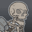 **Variant 2: Volo's Guide to Diversity** (Complete Area 125)
> Volo starts in the formation. He can be moved, but not removed.  
> Elminster joins the formation. Champions next to Elminster deal no damage as he distracts them by critiquing Volo.  
> 1-2 random enemies spawn with each wave. They don't drop gold, nor count towards quest progress. The type of enemy is determined by the area you're in, with the type changing every 10 areas.  
> Getting to know Volo: Volo's buff gets stronger the more enemy types you encounter in an adventure. Pair him with certain Hunter Champions to spawn more enemy types.

 **Variant 3: Volo's Guide to Specializations** (Complete Area 175)
> Volo starts in the formation. He can be moved, but not removed.  
> 1-2 Relentless Undead spawn with each wave. When defeated, they get back up after 5 seconds. They don't drop gold, nor count towards quest progress.   
> You may only use Hunter Champions, Absolute Adversaries affiliation members, and/or Champions with a Magic base attack.  
> Getting to know Volo: Volo's first specialization choice determines which Champions he works best with. Which set will you choose?

# Other Champion Images

    
        
            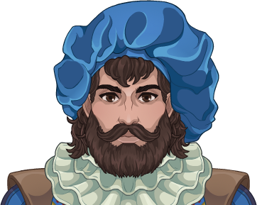Console Portrait
        
    
    
        
            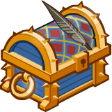Gold Chest Icon
        
        
            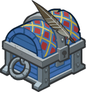Silver Chest Icon
        
    

[Back to Top](#top)

*Last Modified: {{ site.time }}*