[Back to Main](index.md)

# Astarion

Another Baldur's Gate 3 champion.

Info from a wiki.
> Astarion prowled the night as a vampire spawn for centuries, serving a sadistic master until he was snatched away. Now he can walk in the light, but can he leave his wicked past behind?

[Wiki Link](https://baldursgate3.wiki.fextralife.com/Astarion)

# Basic Information

Astarion will be the new champion in the Brightswords event on 6 September 2023.

    
        
            **Seat**:
        
        
            10 (Guess) (Spoiled by Justin on DI)
        
    
    
        
            **Race**:
        
        
            Elf (High) (Guess)
        
    
    
        
            **Class**:
        
        
            Rogue (Guess)
        
    
    
        
            **Roles**:
        
        
            Unknown
        
    
    
        
            **Age**:
        
        
            Unknown
        
    
    
        
            **Gender**:
        
        
            Male (Guess)
        
    
    
        
            **Alignment**:
        
        
            Unknown
        
    
    
        
            **Affiliation**:
        
        
            Absolute Adversaries (Guess)
        
    

# Formation

Unknown.

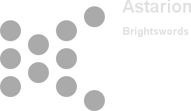


# Abilities

**Base Attack: Unknown**
> Unknown effect.

<em>Raw Data</em>

<pre>
</pre>

**Ultimate Attack: Unknown**
> Unknown effect.

<em>Raw Data</em>

<pre>
</pre>

**Ceremorphosis**
> Unknown effect.

<em>Raw Data</em>

<pre>
{
    "p": 0,
    "v": 2,
    "id": 20421,
    "export_params": {"uses": ["icon"]},
    "type": 1,
    "graphic": "Icons/Events/2018Brightswords/Icon_Formation_AstarionCeremorphosis",
    "fs": 0
}
</pre>

**Generational Wealth**
> Unknown effect.

<em>Raw Data</em>

<pre>
{
    "p": 0,
    "v": 2,
    "id": 20422,
    "export_params": {"uses": ["icon"]},
    "type": 1,
    "graphic": "Icons/Events/2018Brightswords/Icon_Formation_AstarionGenerationalWealth",
    "fs": 0
}
</pre>

**Ultimate Outflank**
> Unknown effect.

<em>Raw Data</em>

<pre>
{
    "p": 0,
    "v": 2,
    "id": 20423,
    "export_params": {"uses": ["icon"]},
    "type": 1,
    "graphic": "Icons/Events/2018Brightswords/Icon_Formation_AstarionUltimateOutflank",
    "fs": 0
}
</pre>

**Well Fed**
> Unknown effect.

<em>Raw Data</em>

<pre>
{
    "p": 0,
    "v": 2,
    "id": 20424,
    "export_params": {"uses": ["icon"]},
    "type": 1,
    "graphic": "Icons/Events/2018Brightswords/Icon_Formation_AstarionWellFed",
    "fs": 0
}
</pre>

# Specialisations

**Specialisation: Arcane Trickster**
> Unknown effect.

<em>Raw Data</em>

<pre>
{
    "p": 0,
    "v": 2,
    "id": 20425,
    "export_params": {"uses": ["icon"]},
    "type": 1,
    "graphic": "Icons/Events/2018Brightswords/Icon_Specialization_AstarionArcaneTrickster",
    "fs": 0
}
</pre>

**Specialisation: Assassin**
> Unknown effect.

<em>Raw Data</em>

<pre>
{
    "p": 0,
    "v": 2,
    "id": 20426,
    "export_params": {"uses": ["icon"]},
    "type": 1,
    "graphic": "Icons/Events/2018Brightswords/Icon_Specialization_AstarionAssassin",
    "fs": 0
}
</pre>

**Specialisation: Thief**
> Unknown effect.

<em>Raw Data</em>

<pre>
{
    "p": 0,
    "v": 2,
    "id": 20429,
    "export_params": {"uses": ["icon"]},
    "type": 1,
    "graphic": "Icons/Events/2018Brightswords/Icon_Specialization_AstarionThief",
    "fs": 0
}
</pre>

**Specialisation: Outflank Bottom**
> Unknown effect.

<em>Raw Data</em>

<pre>
{
    "p": 0,
    "v": 2,
    "id": 20427,
    "export_params": {"uses": ["icon"]},
    "type": 1,
    "graphic": "Icons/Events/2018Brightswords/Icon_Specialization_AstarionOutflankBottom",
    "fs": 0
}
</pre>

**Specialisation: Outflank Top**
> Unknown effect.

<em>Raw Data</em>

<pre>
{
    "p": 0,
    "v": 2,
    "id": 20428,
    "export_params": {"uses": ["icon"]},
    "type": 1,
    "graphic": "Icons/Events/2018Brightswords/Icon_Specialization_AstarionOutflankTop",
    "fs": 0
}
</pre>

# Items

    
        
            **Icons**
        
        
            **Name**
        
    
    
        
            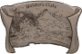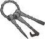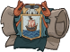
        
        
            Baldurs Gate Things
        
    
    
        
            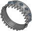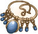
        
        
            Magic Items
        
    
    
        
            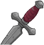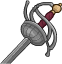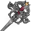
        
        
            Melee Weapons
        
    
    
        
            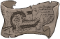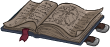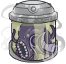
        
        
            Mind Flayer Research
        
    
    
        
            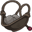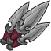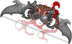
        
        
            Ranged Weapons
        
    
    
        
            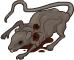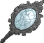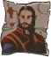
        
        
            Vampire Links
        
    

# Feats

Unknown.

# Legendaries

Unknown.

# Console Portrait

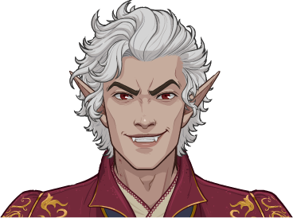

# Chests

| Gold | Silver |
|---|---|
| 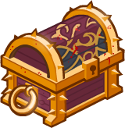 | 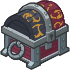 |

[Back to Top](#top)

*Last Modified: {{ site.time }}*