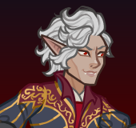

[Back to Main](index.md)

    
        Portait
    
    
        Model
    

# Astarion

Astarion prowled the night as a vampire spawn for centuries, serving a sadistic master until he was snatched away. Now he can walk in the light and has the chance at a new life, but how long can he keep his past buried?

# Basic Information

Astarion will be the new champion in the Brightswords event on 6 September 2023.

    
        
            **Seat**:
        
        
            10
        
        
            **Stat**
        
        
            **Value**
        
        
            **Day 1 Trials**
        
        
            **Patrons**
        
    
    
        
            **Race**:
        
        
            Elf (High)
        
        
            **Strength**:
        
        
            8
        
        
            -
        
        
            Mirt
        
    
    
        
            **Class**:
        
        
            Rogue
        
        
            **Dexterity**:
        
        
            17
        
        
            Yes
        
        
            Vajra
        
    
    
        
            **Roles**:
        
        
            Support / Gold
        
        
            **Constitution**:
        
        
            14
        
        
            Yes
        
        
            Strahd
        
    
    
        
            **Age**:
        
        
            350
        
        
            **Intelligence**:
        
        
            13
        
        
            Yes
        
        
            -
        
    
    
        
            **Gender**:
        
        
            Male
        
        
            **Wisdom**:
        
        
            13
        
        
            Yes
        
        
            &nbsp;
        
    
    
        
            **Alignment**:
        
        
            Neutral Evil
        
        
            **Charisma**:
        
        
            10
        
        
            -
        
        
            &nbsp;
        
    
    
        
            **Affiliation**:
        
        
            Absolute Adversaries
        
        
            **Total**:
        
        
            75
        
        
            &nbsp;
        
        
            &nbsp;
        
    

# Formation

    

# Abilities

 **Base Attack: Sneak Attack** (Ranged)
> Astarion attacks a random target, dealing massive damage if the enemy was recently attacked.  
> Cooldown: 6s (Cap 1.5s)

<em>Raw Data</em>

<pre>
{
    "description": "Astarion attacks a random target, dealing massive damage if the enemy was recently attacked.",
    "long_description": "",
    "damage_modifier": 1,
    "damage_types": ["ranged"],
    "graphic_id": 0,
    "target": "random",
    "aoe_radius": 0,
    "tags": ["ranged"],
    "num_targets": 1,
    "animations": [{
        "projectile_details": {
            "percent_height_offset": 10,
            "projectile_graphic_id": 20375,
            "projectile_speed": 1750,
            "hash": "ecac999b510d089e10f4e6a0edf92483",
            "rotation_speed": 720
        },
        "bonus_seconds_of_bud": 1,
        "teleport_sequence_name": "charge",
        "special_melee": "astarion",
        "shoot_offset": {
            "x": 50,
            "y": -125
        },
        "bud_override_upgrade_id": 12497,
        "type": "melee_attack",
        "shoot_sequence_name": "attack",
        "shoot_sound_id": 180,
        "shoot_frame": 5,
        "bonus_bud_threshold": 3
    }],
    "name": "Sneak Attack",
    "cooldown": 6,
    "id": 677
}
</pre>

 **Ultimate Attack: Sanguine Hunger** (Level: 110)
> Astarion viciously attacks the enemy with the most health with a vampiric bite and heals to full health.  
> Cooldown: 60s (Cap 15s)

<em>Raw Data</em>

<pre>
{
    "description": "Astarion viciously attacks the enemy with the most health and heals to full health.",
    "long_description": "Astarion viciously attacks the enemy with the most health with a vampiric bite and heals to full health.",
    "damage_modifier": 0.03,
    "damage_types": ["melee"],
    "graphic_id": 20430,
    "target": "highest_health",
    "aoe_radius": 0,
    "tags": [
        "melee",
        "ultimate"
    ],
    "num_targets": 1,
    "animations": [{
        "damage_frame": 18,
        "teleport_sequence_name": "charge",
        "ultimate": "astarion",
        "melee_sequence_name": "ultimate",
        "type": "ultimate_attack"
    }],
    "name": "Sanguine Hunger",
    "cooldown": 60,
    "id": 678
}
</pre>

**Vampire Spawn** (Level: 0)
> Astarion counts as "dead" for the purposes of effects that care about dead Champions, but "alive" for all other purposes.

<em>Raw Data</em>

<pre>
{
    "static_dps_mult": null,
    "required_level": 0,
    "effect": "effect_def,1663",
    "name": "Vampire Spawn",
    "id": 12488,
    "hero_id": 129,
    "upgrade_type": "unlock_ability",
    "default_enabled": 1,
    "required_upgrade_id": 0
}
{
    "effect_keys": [{"effect_string": "do_nothing"}],
    "requirements": "",
    "description": {"desc": "Astarion counts as \"dead\" for the purposes of effects that care about dead Champions, but \"alive\" for all other purposes."},
    "id": 1663,
    "flavour_text": "",
    "graphic_id": 0,
    "properties": {
        "is_formation_ability": true,
        "owner_use_outgoing_description": true,
        "formation_circle_icon": false
    }
}
</pre>

 **Ceremorphosis** (Level: 50)
> Your formation gains one Ceremorphosis stack due to the mind flayer tadpole in Astarion's brain. Astarion increases the effect of Outflank by 100% for each Ceremorphosis stack, stacking multiplicatively.

ⓘ *Note: This ability might be prestack.*

<em>Raw Data</em>

<pre>
{
    "static_dps_mult": null,
    "required_level": 50,
    "effect": "effect_def,1664",
    "name": "Ceremorphosis",
    "id": 12489,
    "hero_id": 129,
    "upgrade_type": "unlock_ability",
    "default_enabled": 1,
    "required_upgrade_id": 0
}
{
    "effect_keys": [
        {"effect_string": "pre_stack_amount,100"},
        {
            "amount_expr": "upgrade_amount(12489,0)",
            "stack_title": "Total Ceremorphosis Stacks",
            "amount_updated_listeners": ["slot_changed"],
            "stacks_multiply": true,
            "total_title": "Total Bonus",
            "off_when_benched": true,
            "show_bonus": true,
            "amount_func": "mult",
            "stack_func": "per_ceremorphosis_stacks",
            "effect_string": "buff_upgrades,0,12493,12494",
            "desc_forced_order": 2
        },
        {
            "stack_title": "Astarion Ceremorphosis Stacks",
            "manual_stacking": true,
            "stacks_multiply": false,
            "off_when_benched": true,
            "outgoing_buffs": false,
            "effect_string": "astarion_ceremorphosis_stacks,1",
            "show_stacks": true,
            "desc_forced_order": 1
        }
    ],
    "requirements": "",
    "description": {"desc": "Your formation gains one Ceremorphosis stack due to the mind flayer tadpole in Astarion's brain. Astarion increases the effect of Outflank by $(amount)% for each Ceremorphosis stack, stacking multiplicatively."},
    "id": 1664,
    "flavour_text": "",
    "graphic_id": 20421,
    "properties": {
        "indexed_effect_properties": true,
        "retain_on_slot_changed": true,
        "is_formation_ability": true,
        "default_bonus_index": 0,
        "owner_use_outgoing_description": true,
        "per_effect_index_bonuses": true
    }
}
</pre>

 **Generational Wealth** (Level: 90)
> Astarion increases the gold find of the formation by 1% multiplied by the total age of all Champions in the formation.

<em>Upgrade Data</em>

<pre>
Upgrades:
      290: 100%
      590: 100%
      990: 100%
    1,490: 100%
    1,990: 100%
    2,490: 100%

    Total Upgrade Bonus: 6,300%
</pre>

<em>Raw Data</em>

<pre>
{
    "static_dps_mult": null,
    "required_level": 90,
    "effect": "effect_def,1665",
    "name": "Generational Wealth",
    "id": 12490,
    "hero_id": 129,
    "upgrade_type": "unlock_ability",
    "default_enabled": 1,
    "required_upgrade_id": 0
}
{
    "effect_keys": [{
        "stack_title": "Total Age",
        "amount_updated_listeners": ["slot_changed"],
        "stacks_multiply": false,
        "off_when_benched": true,
        "show_bonus": true,
        "amount_func": "add",
        "stack_func": "per_hero_attribute",
        "per_hero_expr": "age",
        "effect_string": "gold_multiplier_mult,1"
    }],
    "requirements": "",
    "description": {"desc": "Astarion increases the gold find of the formation by $(amount)% multiplied by the total age of all Champions in the formation."},
    "id": 1665,
    "flavour_text": "",
    "graphic_id": 20422,
    "properties": {
        "is_formation_ability": true,
        "owner_use_outgoing_description": true
    }
}
</pre>

 **Well Fed** (Level: 140)
> After using his Sanguine Hunger ultimate, Astarion's Outflank is increased by 400%. This effect can stack (multiplicatively) up to 5 times, with stacks resetting when changing areas.

ⓘ *Note: This ability might be prestack.*

<em>Raw Data</em>

<pre>
{
    "static_dps_mult": null,
    "required_level": 140,
    "effect": "effect_def,1666",
    "name": "Well Fed",
    "id": 12491,
    "hero_id": 129,
    "upgrade_type": "unlock_ability",
    "default_enabled": 1,
    "required_upgrade_id": 0
}
{
    "effect_keys": [
        {"effect_string": "pre_stack_amount,400"},
        {
            "amount_expr": "upgrade_amount(12491,0)",
            "stack_title": "Well Fed Stacks",
            "stacks_multiply": true,
            "show_bonus": true,
            "effect_string": "buff_upgrades,0,12493,12494",
            "max_stacks": 5,
            "more_triggers": [{
                "action": {"type": "reset"},
                "trigger": "area_changed"
            }],
            "stacks_on_trigger": "owner_ultimate_attack"
        }
    ],
    "requirements": "",
    "description": {"desc": "After using his Sanguine Hunger ultimate, Astarion's Outflank is increased by $(amount)%. This effect can stack (multiplicatively) up to 5 times, with stacks resetting when changing areas."},
    "id": 1666,
    "flavour_text": "",
    "graphic_id": 20424,
    "properties": {
        "indexed_effect_properties": true,
        "retain_on_slot_changed": true,
        "is_formation_ability": true,
        "default_bonus_index": 0,
        "owner_use_outgoing_description": true,
        "per_effect_index_bonuses": true
    }
}
</pre>

 **The Ultimate Outflank** (Level: 180)
> If Astarion is buffed by his own Outflank ability, when he uses his Sanguine Hunger Ultimate attack, he reduces the active ultimate cooldown of all other Champions in the formation by 10%.

<em>Raw Data</em>

<pre>
{
    "static_dps_mult": null,
    "required_level": 180,
    "effect": "effect_def,1667",
    "tip_text": "Astarion reduces ultimate cooldowns of other Champions when he uses his ultimate if he is buffed by his own Outflank ability.",
    "name": "The Ultimate Outflank",
    "id": 12492,
    "hero_id": 129,
    "upgrade_type": "unlock_ability",
    "default_enabled": 1,
    "required_upgrade_id": 0
}
{
    "effect_keys": [{
        "effect_string": "astarion_the_ultimate_outflake,10",
        "hero_id_blacklist": [43]
    }],
    "requirements": "",
    "description": {"desc": "If Astarion is buffed by his own Outflank ability, when he uses his Sanguine Hunger Ultimate attack, he reduces the active ultimate cooldown of all other Champions in the formation by $(amount)%."},
    "id": 1667,
    "flavour_text": "",
    "graphic_id": 20423,
    "properties": {
        "is_formation_ability": true,
        "owner_use_outgoing_description": true
    }
}
</pre>

# Specialisations

.png) **Outflank (Bottom)** (Level: 10)
> Astarion increases the damage of all Champions at the bottom of each column by 100%.

<em>Upgrade Data</em>

<pre>
Upgrades:
       80: 100%
      150: 100%
      230: 100%
      300: 100%
      400: 100%
      500: 100%
      600: 100%
      750: 100%
      900: 100%
    1,100: 100%
    1,200: 100%
    1,350: 100%
    1,550: 100%
    1,720: 100%
    1,880: 100%
    2,050: 100%
    2,200: 100%
    2,360: 100%
    2,510: 100%
    2,600: 100%
    2,760: 100%

    Total Upgrade Bonus: 2.10e08%
</pre>

<em>Raw Data</em>

<pre>
{
    "specialization_name": "Outflank (Bottom)",
    "required_level": 10,
    "specialization_graphic_id": 20427,
    "upgrade_type": "unlock_ability",
    "static_dps_mult": null,
    "effect": "effect_def,1669",
    "tip_text": "Astarion increases the damage of all champions on either the top or the bottom of each column, based on your choice.",
    "name": "Outflank (Bottom)",
    "id": 12494,
    "hero_id": 129,
    "default_enabled": 1,
    "required_upgrade_id": 0,
    "specialization_description": "Astarion looks to the bottom of the formation to deal the most damage."
}
{
    "effect_keys": [{
        "off_when_benched": true,
        "effect_string": "hero_dps_multiplier_mult,100",
        "targets": ["bottom_row_of_each_column"]
    }],
    "requirements": "",
    "description": {"desc": "Astarion increases the damage of all Champions at the bottom of each column by $(amount)%"},
    "id": 1669,
    "flavour_text": "",
    "graphic_id": 20758,
    "properties": {
        "is_formation_ability": true,
        "owner_use_outgoing_description": true,
        "type": "upgrade",
        "tracking_name": "outflank"
    }
}
</pre>

.png) **Outflank (Top)** (Level: 10)
> Astarion increases the damage of all Champions at the top of each column by 100%.

<em>Upgrade Data</em>

<pre>
Upgrades:
       80: 100%
      150: 100%
      230: 100%
      300: 100%
      400: 100%
      500: 100%
      600: 100%
      750: 100%
      900: 100%
    1,100: 100%
    1,200: 100%
    1,350: 100%
    1,550: 100%
    1,720: 100%
    1,880: 100%
    2,050: 100%
    2,200: 100%
    2,360: 100%
    2,510: 100%
    2,600: 100%
    2,760: 100%

    Total Upgrade Bonus: 2.10e08%
</pre>

<em>Raw Data</em>

<pre>
{
    "specialization_name": "Outflank (Top)",
    "required_level": 10,
    "specialization_graphic_id": 20428,
    "upgrade_type": "unlock_ability",
    "static_dps_mult": null,
    "effect": "effect_def,1668",
    "tip_text": "Astarion increases the damage of all champions on either the top or the bottom of each column, based on your choice.",
    "name": "Outflank (Top)",
    "id": 12493,
    "hero_id": 129,
    "default_enabled": 1,
    "required_upgrade_id": 0,
    "specialization_description": "Astarion looks to the top of the formation to deal the most damage."
}
{
    "effect_keys": [{
        "off_when_benched": true,
        "effect_string": "hero_dps_multiplier_mult,100",
        "targets": ["top_row_of_each_column"]
    }],
    "requirements": "",
    "description": {"desc": "Astarion increases the damage of all Champions at the top of each column by $(amount)%."},
    "id": 1668,
    "flavour_text": "",
    "graphic_id": 20759,
    "properties": {
        "is_formation_ability": true,
        "owner_use_outgoing_description": true,
        "type": "upgrade",
        "tracking_name": "outflank"
    }
}
</pre>

 **Arcane Trickster** (Level: 200)
> Astarion increases the damage bonus of his Outflank specialization by 100% for each Champion in the formation that is a Rogue, Wizard, or Absolute Adversaries affiliation member, stacking multiplicatively.

<em>Raw Data</em>

<pre>
{
    "static_dps_mult": null,
    "specialization_name": "Arcane Trickster",
    "required_level": 200,
    "effect": "effect_def,1671",
    "name": "Arcane Trickster",
    "specialization_graphic_id": 20425,
    "id": 12496,
    "hero_id": 129,
    "upgrade_type": "unlock_ability",
    "default_enabled": 1,
    "required_upgrade_id": 0,
    "specialization_description": "Astarion works best with fellow rogues, wizards, and Absolute Adversaries affiliation members."
}
{
    "effect_keys": [{
        "stack_title": "Qualified Champions",
        "amount_updated_listeners": [
            "hero_tags_changed",
            "slot_changed"
        ],
        "show_bonus": true,
        "amount_func": "mult",
        "stack_func": "per_hero",
        "effect_string": "buff_upgrades,100,12493,12494",
        "tag": "absoluteadversaries|rogue|wizard"
    }],
    "requirements": "",
    "description": {"desc": "Astarion increases the damage bonus of his Outflank specialization by $(amount)% for each Champion in the formation that is a Rogue, Wizard, or Absolute Adversaries affiliation member, stacking multiplicatively."},
    "id": 1671,
    "flavour_text": "",
    "graphic_id": 0,
    "properties": {
        "is_formation_ability": true,
        "spec_option_post_apply_info": "Qualified Champions: $num_stacks",
        "owner_use_outgoing_description": true,
        "type": "upgrade",
        "formation_circle_icon": false
    }
}
</pre>

 **Assassin** (Level: 200)
> Increases the bonus BUD-based damage Astarion's Sneak Attack deals to 5 seconds worth.

<em>Raw Data</em>

<pre>
{
    "static_dps_mult": null,
    "specialization_name": "Assassin",
    "required_level": 200,
    "effect": "effect_def,1672",
    "name": "Assassin",
    "specialization_graphic_id": 20426,
    "id": 12497,
    "hero_id": 129,
    "upgrade_type": "unlock_ability",
    "default_enabled": 1,
    "required_upgrade_id": 0,
    "specialization_description": "Astarion focuses on dealing more damage when he attacks an enemy who has been recently attacked by an ally."
}
{
    "effect_keys": [{"effect_string": "do_nothing,5"}],
    "requirements": "",
    "description": {"desc": "Increases the bonus BUD-based damage Astarion's Sneak Attack deals to $(amount) seconds worth."},
    "id": 1672,
    "flavour_text": "",
    "graphic_id": 0,
    "properties": {
        "is_formation_ability": true,
        "owner_use_outgoing_description": true,
        "type": "upgrade",
        "formation_circle_icon": false
    }
}
</pre>

 **Thief** (Level: 200)
> Astarion increases the gold find of the party by 100% for each gold find Champion in the formation, stacking multiplicatively.

<em>Raw Data</em>

<pre>
{
    "static_dps_mult": null,
    "specialization_name": "Thief",
    "required_level": 200,
    "effect": "effect_def,1670",
    "name": "Thief",
    "specialization_graphic_id": 20429,
    "id": 12495,
    "hero_id": 129,
    "upgrade_type": "unlock_ability",
    "default_enabled": 1,
    "required_upgrade_id": 0,
    "specialization_description": "Astarion schemes with other gold find Champions in the formation to \"obtain\" even more gold."
}
{
    "effect_keys": [{"effect_string": "gold_mult_per_tagged_crusader_mult,100,gold"}],
    "requirements": "",
    "description": {"desc": "Astarion increases the gold find of the party by $(amount)% for each gold find Champion in the formation, stacking multiplicatively."},
    "id": 1670,
    "flavour_text": "",
    "graphic_id": 0,
    "properties": {
        "is_formation_ability": true,
        "spec_option_post_apply_info": "Qualified Champions: $num_stacks",
        "owner_use_outgoing_description": true,
        "type": "upgrade",
        "formation_circle_icon": false
    }
}
</pre>

# Items

    
        
            **Icons**
        
        
            **Slot**
        
        
            **Epic Name**
        
        
            **Effect**
        
    
    
        
            
        
        
            1
        
        
            Nightfang Bow
        
        
            All Champion Damage
        
    
    
        
            
        
        
            2
        
        
            Eldritch Experiment
        
        
            Ceremorphosis
        
    
    
        
            
        
        
            3
        
        
            Forged Patents of Nobility
        
        
            Generational Wealth
        
    
    
        
            
        
        
            4
        
        
            Cazador Szarr Portrait
        
        
            Well Fed
        
    
    
        
            
        
        
            5
        
        
            Vampiric Rapier
        
        
            All First Specialisations
        
    
    
        
            
        
        
            6
        
        
            Amulet of Misty Step
        
        
            Ultimate Cooldown Reduction
        
    

<em>Item Names and Descriptions</em>

<pre>
Slot 1:
              Gutter Sling: I found this in a gutter. It may look disgusting, but it's deadly.
                            ...to rats.
            Handmade Sling: It won't take down an owlbear, but perhaps a kobold? If the wind is
                            right...
           Infernal Blades: Don't ask where these came from, you don't want to know.
             Nightfang Bow: Showy AND deadly? Oh it's perfect, darling!

Slot 2:
      Nautiloid Schematics: The others don't need to know I have this. It's for my own
                            ...research.
  Note-Filled Illustration: These have been fascinating. I think I'm getting closer to
                            something...
      Tome of the Illithid: Could it work? It shouldn't be possible. None of this should be
                            possible...
       Eldritch Experiment: If this goes the way I hope -- I'll never have to fear the sun
                            again.

Slot 3:
         Baldur's Gate Map: This is one of my few possessions now that I serve Cazador...
          Outdated Diagram: This used to be accurate. Now it feels more like an ancient
                            painting than a map.
        Twisted Lock Picks: I've been told these will never break. I'll put that to the test.
Forged Patents of Nobility: No one will question my nobility now. Or they shouldn't for the
                            coin I paid.

Slot 4:
         The First of Many: Well, that was... disgusting.
               Quick Snack: It may not be dignified, but needs must.
      Broken Silver Mirror: Someday I'll see my face again. You're lucky enough to see it every
                            day.
    Cazador Szarr Portrait: Did you ever hate something so much, you just couldn't part with
                            it?

Slot 5:
           Throwing Dagger: Better than a sling, that's for sure.
            Balanced Blade: I'm much better with these than I expected. I'll have to get them
                            enchanted...
             Noble's Sword: Yes, this is mine. No, you don't need to know where I got it.
           Vampiric Rapier: They'll lose the blood regardless. This just happens to save it for
                            me.

Slot 6:
        Ring of Protection: I picked up this little treasure with the coin I made from
                            OnlyFangs.
            Dispelled Ring: Well, it was good while it lasted.
           Smuggler's Ring: Tav gave this to me and said it would suit me well. They were
                            right.
      Amulet of Misty Step: Stabbing your enemies gets much easier when you can simply appear
                            behind them.
</pre>

# Feats

This list will only show feats that are going to be available on the release of this champion. The separate [Feats](feats.md) page may show others that could be available later if they exist.

    
        
            **Feat**
        
        
            **Effect**
        
        
            **Source**
        
    
    
        
            Selflessness
        
        
            10% All Champion Damage
        
        
            Free
        
    
    
        
            Inspiring Leader
        
        
            25% All Champion Damage
        
        
            Gold Chest
        
    
    
        
            Frugal
        
        
            10% Gold
        
        
            Free
        
    
    
        
            Lucky
        
        
            25% Gold
        
        
            12,500 Gems
        
    
    
        
            Mortal Bond
        
        
            20% All First Specialisations
        
        
            Free
        
    
    
        
            Sanguine Pact
        
        
            40% All First Specialisations
        
        
            Gold Chest
        
    
    
        
            Eldritch Connection
        
        
            40% Ceremorphosis
        
        
            Gold Chest
        
    
    
        
            Undying Savings
        
        
            20% Generational Wealth
        
        
            Free
        
    
    
        
            Familiar Tithing
        
        
            40% Generational Wealth
        
        
            Gold Chest
        
    
    
        
            Blood Fueled
        
        
            40% Well Fed
        
        
            12,500 Gems
        
    
    
        
            Mist Step
        
        
            20% The Ultimate Outflank
        
        
            Gold Chest
        
    
    
        
            Shadow's Embrace
        
        
            40% The Ultimate Outflank
        
        
            50,000 Gems
        
    

# Legendaries

* Increases the damage of all Champions by 100%.
* Increases the damage of all Champions by 20% for each Male Champion in the formation.
* Increases the damage of all Champions by 45% for each Elf Champion in the formation.
* Increases the damage of all Champions with a INT score of 13 or higher by 150%.
* Increases the damage of all Champions with a CON score of 11 or higher by 100%.
* Increases the damage of all Evil Champions by 150%.

<em>DPS Applicable</em>

<pre>
     Arkhan: 5 / 6
    Artemis: 6 / 6
    Asharra: 4 / 6
      Azaka: 4 / 6
     Binwin: 4 / 6
   Birdsong: 5 / 6
Black Viper: 4 / 6
 Catti-brie: 5 / 6
     D'hani: 4 / 6
     Delina: 5 / 6
    Dhadius: 4 / 6
     Drizzt: 4 / 6
    Farideh: 5 / 6
        Fen: 6 / 6
      Grimm: 4 / 6
     Gromma: 4 / 6
       Ishi: 4 / 6
    Jaheira: 4 / 6
    Jamilah: 4 / 6
   Jarlaxle: 6 / 6
        Jim: 4 / 6
       Kent: 5 / 6
      Krond: 6 / 6
       Krux: 4 / 6
    Lae'zel: 5 / 6
     Lucius: 4 / 6
      Makos: 6 / 6
      Minsc: 4 / 6
      NERDS: 4 / 6
     Nahara: 4 / 6
      Nixie: 4 / 6
      Nrakk: 4 / 6
     Orisha: 4 / 6
   Prudence: 6 / 6
      Strix: 5 / 6
     Warden: 5 / 6
    Warduke: 5 / 6
      Zorbu: 4 / 6
</pre>

<em>Non-DPS Applicable</em>

<pre>
          Aila: 4 / 6
       Alyndra: 5 / 6
       Antrius: 4 / 6
      Astarion: 6 / 6
         Avren: 5 / 6
          BBEG: 5 / 6
       Baeloth: 6 / 6
        Beadle: 5 / 6
       Blooshi: 6 / 6
          Brig: 4 / 6
          Briv: 4 / 6
       Bruenor: 4 / 6
      Calliope: 4 / 6
       Celeste: 4 / 6
       Corazón: 5 / 6
        Deekin: 4 / 6
       Desmond: 4 / 6
           Dob: 5 / 6
        Donaar: 4 / 6
    Dragonbait: 5 / 6
Dungeon Master: 5 / 6
        Egbert: 4 / 6
       Evandra: 4 / 6
        Evelyn: 4 / 6
     Ezmerelda: 5 / 6
        Freely: 3 / 6
       Gazrick: 5 / 6
      Hew Maan: 5 / 6
         Hitch: 5 / 6
         Imoen: 5 / 6
      K'thriss: 4 / 6
         Korth: 5 / 6
         Krull: 5 / 6
        Krydle: 5 / 6
       Lazaapz: 6 / 6
         Mehen: 5 / 6
          Melf: 5 / 6
      Merilwen: 5 / 6
         Miria: 6 / 6
        Môrgæn: 5 / 6
        Nayeli: 4 / 6
         Nerys: 4 / 6
        Nordom: 5 / 6
          Nova: 5 / 6
          Omin: 4 / 6
        Orkira: 4 / 6
       Paultin: 5 / 6
      Penelope: 4 / 6
         Pwent: 4 / 6
        Qillek: 5 / 6
         Regis: 5 / 6
          Reya: 5 / 6
          Rust: 4 / 6
        Selise: 5 / 6
        Sentry: 4 / 6
     Sgt. Knox: 4 / 6
         Shaka: 5 / 6
       Shandie: 5 / 6
      Sisaspia: 6 / 6
        Solaak: 5 / 6
         Spurt: 5 / 6
         Stoki: 5 / 6
   Strongheart: 4 / 6
         Talin: 5 / 6
       Tatyana: 4 / 6
        Turiel: 5 / 6
         Uriah: 4 / 6
     Valentine: 4 / 6
            Vi: 5 / 6
       Viconia: 5 / 6
      Vin Ursa: 6 / 6
       Vlahnya: 4 / 6
      Voronika: 5 / 6
        Walnut: 4 / 6
        Widdle: 5 / 6
        Xander: 4 / 6
      Xerophon: 4 / 6
</pre>

 

# Champion Images

    
        
            Console Portait
        
    
    
        
            Gold Chest Icon
        
        
            Silver Chest Icon
        
    

[Back to Top](#top)

*Last Modified: {{ site.time }}*