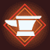

[Back to Main](index.md)

# Festival of Fools Augments

The augments for the upcoming Festival of Fools event.

 **Auto-Blacksmith**

> Event Champions whose recruitment adventure or variants you complete gain common rarity equipment in all slots, if they don't already have better.  
> Every tier two or higher event variant completed automatically applies 100 Tiny Blacksmithing Contracts to the variant's Champion's equipment for free!  

 **Golden Offers**

> One of your weekly offers will be Golden during this event. Golden offers provide an additional 10% discount! The Golden tag persists when an offer is rerolled.  

 **Challenge Week**

> A Mastery Challenge will start on the third week of the event, providing opportunities to prove your formation building skills and earn unique rewards.  

 **Supercharged Damage Boon**

> The Global Damage Boon is supercharged, granting 2,000,000% additional damage per level, instead of 200% (stacking multiplicatively).  

[Back to Top](#top)

*Last Modified: {{ site.time }}*