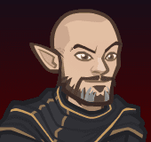
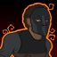
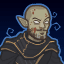

[Back to Main](index.md)

    
        
            
        
        
            Portrait
        
    

# Avren

Avren is an embodiment of mischief; a trickster god in humanoid form. Long ago, he tricked an ancient being into giving him magic and immortality. This power also came with a curse: whenever Avren dies, he will return to life with a new body and varying abilities. While Avren's body may change, however, his soul and his undying love for his wife, Sofieus, always remains. The two have remained married for centuries, seeking each other out to reunite in each lifetime.

# Changes

Avren will be a reworked champion in the Liars' Night event on 7 October 2026.

Only abilities that have seen some changes will be displayed here - and be aware that there's a lot of guesswork involved. Some abilities may not have names - some may have the *wrong* names - or specialisations might not be marked as such - etc.. Focus on the effect data itself.

Please do me a favour and don't get all melodramatic about what you find here. I - and CNE - don't appreciate it. These are spoilers and will almost certainly change before release - likely multiple times. That and we don't have access to any upgrade data prior to release. Making assumptions on how the champions will turn out based on this information would be premature.

# Abilities

**Mirror Image** (Guess)
> Avren casts Mirror Image every 15 seconds. The image lasts for 60 seconds and buffs its target depending on their tags. Avren casts Mirror Image every 15 seconds. The image lasts for 60 seconds and buffs its target depending on their tags.

<em>Raw Data</em>

<pre>
{
    "id": 2931,
    "flavour_text": "",
    "description": {
        "conditions": [
            {
                "condition": "short_form",
                "desc": "$source casts Mirror Image every $cooldown seconds. The image lasts for $duration seconds and buffs its target depending on their tags."
            },
            {
                "desc": "$source casts Mirror Image every $cooldown seconds. The image lasts for $duration seconds and buffs its target depending on their tags.^^$(mirror_image_desc)"
            }
        ]
    },
    "effect_keys": [
        {
            "effect_string": "mirror_image,100,60,15",
            "off_when_benched": true,
            "tagged_effects": {
                "dps": "effect_def,794",
                "support": "effect_def,795",
                "tanking": "effect_def,796"
            },
            "mirror_graphic": 6480,
            "anim_sequence": 4
        }
    ],
    "requirements": [],
    "graphic_id": 6539,
    "large_graphic_id": 6538,
    "properties": {
        "is_formation_ability": true,
        "show_incoming": false,
        "retain_on_slot_changed": true,
        "use_outgoing_description": true
    }
}
</pre>

**Seeing Double** (Guess)
> Global DPS is increased by 100% for each Champion adjacent to Avren, stacking multiplicatively. Champions affected by Mirror Image increase the effect by 100% for each Mirror Image buff they have, stacking multiplicatively.

ⓘ *Note: This ability is prestack.*

<em>Raw Data</em>

<pre>
{
    "id": 2938,
    "flavour_text": "",
    "description": {
        "desc": "Global DPS is increased by $(amount)% for each Champion adjacent to Avren, stacking multiplicatively. Champions affected by Mirror Image increase the effect by $(amount)% for each Mirror Image buff they have, stacking multiplicatively."
    },
    "effect_keys": [
        {
            "effect_string": "pre_stack,100",
            "skip_effect_key_desc": true
        },
        {
            "effect_string": "global_dps_multiplier_mult,100",
            "amount_expr": "upgrade_amount(20706,0)",
            "off_when_benched": true,
            "amount_func": "mult",
            "stack_func": "per_hero_attribute",
            "per_hero_targets": [
                "adj"
            ],
            "amount_updated_listeners": [
                "slot_changed",
                "avren_mirror_images_changed"
            ],
            "per_hero_expr": "true",
            "show_bonus": true
        },
        {
            "effect_string": "buff_upgrade,0,20706,1",
            "off_when_benched": true,
            "amount_expr": "upgrade_amount(20706,0)",
            "amount_func": "mult",
            "stack_func": "per_hero_attribute",
            "per_hero_targets": [
                "adj"
            ],
            "amount_updated_listeners": [
                "slot_changed",
                "avren_mirror_images_changed"
            ],
            "per_hero_expr": "NumEffectKey(`mirror_image_effect`)",
            "stack_title": "Mirror Image Stacks",
            "show_bonus": true
        }
    ],
    "requirements": [],
    "graphic_id": 6541,
    "large_graphic_id": 6540,
    "properties": {
        "is_formation_ability": true,
        "owner_use_outgoing_description": true,
        "indexed_effect_properties": true,
        "per_effect_index_bonuses": true,
        "default_bonus_index": 0
    }
}
</pre>

# Specialisations

**Specialisation: Mirror Focus (Good)** (Guess)
> Avren increases the effect of Mirror Image by 100% for each Good Champion in the formation (stacking multiplicatively), and prefers casting Mirror Image on those Champions; if a Good target is available, they will get a Mirror Image before Champions of other alignments.

<em>Raw Data</em>

<pre>
{
    "id": 2932,
    "flavour_text": "",
    "description": {
        "desc": "Avren increases the effect of Mirror Image by $(not_buffed amount)% for each Good Champion in the formation (stacking multiplicatively), and prefers casting Mirror Image on those Champions; if a Good target is available, they will get a Mirror Image before Champions of other alignments."
    },
    "effect_keys": [
        {
            "effect_string": "buff_upgrade,100,20699",
            "off_when_benched": true,
            "amount_func": "mult",
            "stack_func": "per_hero_attribute",
            "per_hero_expr": "HasTag(`good`)",
            "show_bonus": true,
            "stack_title": "Good Champions",
            "amount_updated_listeners": [
                "slot_changed",
                "hero_tags_changed"
            ]
        },
        {
            "effect_string": "mirror_image_preference",
            "tag": "good",
            "amount_func": "set",
            "stack_func": "per_crusader",
            "amount_updated_listeners": [
                "slot_changed"
            ]
        }
    ],
    "requirements": [],
    "graphic_id": 0,
    "large_graphic_id": 0,
    "properties": {
        "is_formation_ability": true,
        "use_outgoing_description": true,
        "indexed_effect_properties": true,
        "per_effect_index_bonuses": true,
        "default_bonus_index": 0,
        "show_incoming": false,
        "spec_option_post_apply_info": "Champions in Formation Targeted: $sample_amount___2"
    }
}
</pre>

**Specialisation: Mirror Focus (Neutral on Good/Evil axis)** (Guess)
> Avren increases the effect of Mirror Image by 100% for each Neutral Champion (on the Good/Evil axis) in the formation (stacking multiplicatively), and prefers casting Mirror Image on those Champions; if a Neutral target is available, they will get a Mirror Image before Champions of other alignments.

<em>Raw Data</em>

<pre>
{
    "id": 2933,
    "flavour_text": "",
    "description": {
        "desc": "Avren increases the effect of Mirror Image by $(not_buffed amount)% for each Neutral Champion (on the Good/Evil axis) in the formation (stacking multiplicatively), and prefers casting Mirror Image on those Champions; if a Neutral target is available, they will get a Mirror Image before Champions of other alignments."
    },
    "effect_keys": [
        {
            "effect_string": "buff_upgrade,100,20699",
            "off_when_benched": true,
            "amount_func": "mult",
            "stack_func": "per_hero_attribute",
            "per_hero_expr": "HasTag(`geneutral`)",
            "show_bonus": true,
            "stack_title": "Neutral Champions (on the Good/Evil axis)",
            "amount_updated_listeners": [
                "slot_changed",
                "hero_tags_changed"
            ]
        },
        {
            "effect_string": "mirror_image_preference",
            "tag": "geneutral",
            "amount_func": "set",
            "stack_func": "per_crusader",
            "amount_updated_listeners": [
                "slot_changed"
            ]
        }
    ],
    "requirements": [],
    "graphic_id": 0,
    "large_graphic_id": 0,
    "properties": {
        "is_formation_ability": true,
        "use_outgoing_description": true,
        "indexed_effect_properties": true,
        "per_effect_index_bonuses": true,
        "default_bonus_index": 0,
        "show_incoming": false,
        "spec_option_post_apply_info": "Champions in Formation Targeted: $sample_amount___2"
    }
}
</pre>

**Specialisation: Mirror Focus (Evil)** (Guess)
> Avren increases the effect of Mirror Image by 100% for each Evil Champion in the formation (stacking multiplicatively), and prefers casting Mirror Image on those Champions; if an Evil target is available, they will get a Mirror Image before Champions of other alignments.

<em>Raw Data</em>

<pre>
{
    "id": 2934,
    "flavour_text": "",
    "description": {
        "desc": "Avren increases the effect of Mirror Image by $(not_buffed amount)% for each Evil Champion in the formation (stacking multiplicatively), and prefers casting Mirror Image on those Champions; if an Evil target is available, they will get a Mirror Image before Champions of other alignments."
    },
    "effect_keys": [
        {
            "effect_string": "buff_upgrade,100,20699",
            "off_when_benched": true,
            "amount_func": "mult",
            "stack_func": "per_hero_attribute",
            "per_hero_expr": "HasTag(`evil`)",
            "show_bonus": true,
            "stack_title": "Good Champions",
            "amount_updated_listeners": [
                "slot_changed",
                "hero_tags_changed"
            ]
        },
        {
            "effect_string": "mirror_image_preference",
            "tag": "evil",
            "amount_func": "set",
            "stack_func": "per_crusader",
            "amount_updated_listeners": [
                "slot_changed"
            ]
        }
    ],
    "requirements": [],
    "graphic_id": 0,
    "large_graphic_id": 0,
    "properties": {
        "is_formation_ability": true,
        "use_outgoing_description": true,
        "indexed_effect_properties": true,
        "per_effect_index_bonuses": true,
        "default_bonus_index": 0,
        "show_incoming": false,
        "spec_option_post_apply_info": "Champions in Formation Targeted: $sample_amount___2"
    }
}
</pre>

**Specialisation: Mirror Focus (Lawful)** (Guess)
> Avren increases the effect of Mirror Image by 100% for each Lawful Champion in the formation (stacking multiplicatively), and prefers casting Mirror Image on those Champions; if a Lawful target is available, they will get a Mirror Image before Champions of other alignments.

<em>Raw Data</em>

<pre>
{
    "id": 2935,
    "flavour_text": "",
    "description": {
        "desc": "Avren increases the effect of Mirror Image by $(not_buffed amount)% for each Lawful Champion in the formation (stacking multiplicatively), and prefers casting Mirror Image on those Champions; if a Lawful target is available, they will get a Mirror Image before Champions of other alignments."
    },
    "effect_keys": [
        {
            "effect_string": "buff_upgrade,100,20699",
            "off_when_benched": true,
            "amount_func": "mult",
            "stack_func": "per_hero_attribute",
            "per_hero_expr": "HasTag(`lawful`)",
            "show_bonus": true,
            "stack_title": "Lawful Champions",
            "amount_updated_listeners": [
                "slot_changed",
                "hero_tags_changed"
            ]
        },
        {
            "effect_string": "mirror_image_preference",
            "tag": "lawful",
            "amount_func": "set",
            "stack_func": "per_crusader",
            "amount_updated_listeners": [
                "slot_changed"
            ]
        }
    ],
    "requirements": [],
    "graphic_id": 0,
    "large_graphic_id": 0,
    "properties": {
        "is_formation_ability": true,
        "use_outgoing_description": true,
        "indexed_effect_properties": true,
        "per_effect_index_bonuses": true,
        "default_bonus_index": 0,
        "show_incoming": false,
        "spec_option_post_apply_info": "Champions in Formation Targeted: $sample_amount___2"
    }
}
</pre>

**Specialisation: Mirror Focus (Neutral on Chaotic/Lawful axis)** (Guess)
> Avren increases the effect of Mirror Image by 100% for each Neutral Champion (on the Chaotic/Lawful axis) in the formation (stacking multiplicatively), and prefers casting Mirror Image on those Champions; if a Neutral target is available, they will get a Mirror Image before Champions of other alignments.

<em>Raw Data</em>

<pre>
{
    "id": 2936,
    "flavour_text": "",
    "description": {
        "desc": "Avren increases the effect of Mirror Image by $(not_buffed amount)% for each Neutral Champion (on the Chaotic/Lawful axis) in the formation (stacking multiplicatively), and prefers casting Mirror Image on those Champions; if a Neutral target is available, they will get a Mirror Image before Champions of other alignments."
    },
    "effect_keys": [
        {
            "effect_string": "buff_upgrade,100,20699",
            "off_when_benched": true,
            "amount_func": "mult",
            "stack_func": "per_hero_attribute",
            "per_hero_expr": "HasTag(`lcneutral`)",
            "show_bonus": true,
            "stack_title": "Neutral Champions (on the Chaotic/Lawful axis)",
            "amount_updated_listeners": [
                "slot_changed",
                "hero_tags_changed"
            ]
        },
        {
            "effect_string": "mirror_image_preference",
            "tag": "lcneutral",
            "amount_func": "set",
            "stack_func": "per_crusader",
            "amount_updated_listeners": [
                "slot_changed"
            ]
        }
    ],
    "requirements": [],
    "graphic_id": 0,
    "large_graphic_id": 0,
    "properties": {
        "is_formation_ability": true,
        "use_outgoing_description": true,
        "indexed_effect_properties": true,
        "per_effect_index_bonuses": true,
        "default_bonus_index": 0,
        "show_incoming": false,
        "spec_option_post_apply_info": "Champions in Formation Targeted: $sample_amount___2"
    }
}
</pre>

**Specialisation: Mirror Focus (Chaotic)** (Guess)
> Avren increases the effect of Mirror Image by 100% for each Chaotic Champion in the formation (stacking multiplicatively), and prefers casting Mirror Image on those Champions; if a Chaotic target is available, they will get a Mirror Image before Champions of other alignments.

<em>Raw Data</em>

<pre>
{
    "id": 2937,
    "flavour_text": "",
    "description": {
        "desc": "Avren increases the effect of Mirror Image by $(not_buffed amount)% for each Chaotic Champion in the formation (stacking multiplicatively), and prefers casting Mirror Image on those Champions; if a Chaotic target is available, they will get a Mirror Image before Champions of other alignments."
    },
    "effect_keys": [
        {
            "effect_string": "buff_upgrade,100,20699",
            "off_when_benched": true,
            "amount_func": "mult",
            "stack_func": "per_hero_attribute",
            "per_hero_expr": "HasTag(`chaotic`)",
            "show_bonus": true,
            "stack_title": "Chaotic Champions",
            "amount_updated_listeners": [
                "slot_changed",
                "hero_tags_changed"
            ]
        },
        {
            "effect_string": "mirror_image_preference",
            "tag": "chaotic",
            "amount_func": "set",
            "stack_func": "per_crusader",
            "amount_updated_listeners": [
                "slot_changed"
            ]
        }
    ],
    "requirements": [],
    "graphic_id": 0,
    "large_graphic_id": 0,
    "properties": {
        "is_formation_ability": true,
        "use_outgoing_description": true,
        "indexed_effect_properties": true,
        "per_effect_index_bonuses": true,
        "default_bonus_index": 0,
        "show_incoming": false,
        "spec_option_post_apply_info": "Champions in Formation Targeted: $sample_amount___2"
    }
}
</pre>

# Adventures and Variants

**Unlock Adventure: The Trickster's Delight (Avren)** (Complete Area 50)
> Chase down a masked man who has performed a daring heist.

 **Variant 1: Costumed Fans** (Complete Area 75)
> Two costumed fans join the formation, ready to be Champions! Unfortunately they're not Champions, so they just take up space.

 **Variant 2: Next Time, Champions!** (Complete Area 125)
> Each time you face the Masked Man, he has another trick up his sleeve. His attacks and strategy changes each time you engage him in combat.

 **Variant 3: The Clone War** (Complete Area 175)
> One of Avren's cloning vats was stolen and corrupted. Avren starts in the formation and can not be moved or swapped. Every area a Zombie Avren appears. Its attacks increase the attack cooldown of Champions it hits. Zombie Avren can not be stopped. He ressurects after a brief period of time.

# Formation

    <svg xmlns="http://www.w3.org/2000/svg" id="Avren" fill="#aaa" data-formationName="Avren" data-campaignName="Liar's Night" width="251" height="160"><circle cx="135" cy="65" r="15"/><circle cx="135" cy="105" r="15"/><circle cx="95" cy="45" r="15"/><circle cx="95" cy="85" r="15"/><circle cx="95" cy="125" r="15"/><circle cx="55" cy="25" r="15"/><circle cx="55" cy="65" r="15"/><circle cx="55" cy="105" r="15"/><circle cx="55" cy="145" r="15"/><circle cx="15" cy="85" r="15"/><text x="165" y="25" fill="#dcdcdc" font-size="25" font-family="Arial" font-weight="bold">Avren</text><text x="165" y="65" fill="#dcdcdc" font-size="15" font-family="Arial" font-weight="bold">Liar's Night</text></svg>

[Back to Top](#top)

*Last Modified: {{ site.time }}*