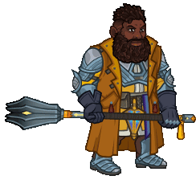
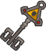
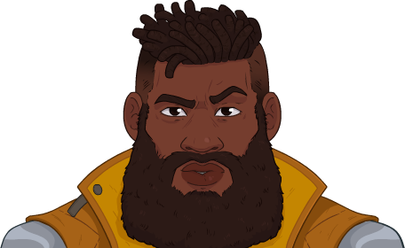

[Back to Main](index.md)

    
        
            
        
        
        Portrait
        
    
    
        
            
        
        
        Model
        
    

# Baldric

Baldric, a cleric who refuses to tie himself to a single deity when he can trade favors with them all.

[The Fallbacks: Bound for Ruin - Fandom Wiki](https://forgottenrealms.fandom.com/wiki/The_Fallbacks:_Bound_for_Ruin)

# Basic Information

Baldric will be a new champion in the Ahghairon's Day event on 6 August 2025.

    
        
            **Seat**:
        
        
            Unknown
        
    
    
        
            **Species**:
        
        
            Dwarf (Guess)
        
    
    
        
            **Class**:
        
        
            Cleric (Guess)
        
    
    
        
            **Roles**:
        
        
            Support / Healing / Gold / Debuff / Control (Guess)
        
    
    
        
            **Age**:
        
        
            Unknown
        
    
    
        
            **Gender**:
        
        
            Male (Guess)
        
    
    
        
            **Alignment**:
        
        
            Unknown
        
    
    
        
            **Affiliation**:
        
        
            The Fallbacks (Guess)
        
    

# Formation

    <svg xmlns="http://www.w3.org/2000/svg" id="Baldric" fill="#aaa" data-formationName="Baldric" data-campaignName="Founders' Day" width="312" height="160"><circle cx="175" cy="65" r="15"/><circle cx="175" cy="105" r="15"/><circle cx="135" cy="45" r="15"/><circle cx="95" cy="25" r="15"/><circle cx="95" cy="65" r="15"/><circle cx="95" cy="105" r="15"/><circle cx="95" cy="145" r="15"/><circle cx="55" cy="45" r="15"/><circle cx="15" cy="65" r="15"/><circle cx="15" cy="105" r="15"/><text x="205" y="25" fill="#dcdcdc" font-size="25" font-family="Arial" font-weight="bold">Baldric</text><text x="205" y="65" fill="#dcdcdc" font-size="15" font-family="Arial" font-weight="bold">Founders' Day</text></svg>

# Attacks

**Base Attack: Two-Handed Mace** (Melee)
> Baldric attacks the closest enemy, dealing 1 hit.  
> Cooldown: 4.75s (Cap 1.1875s)

<em>Raw Data</em>

<pre>
{
    "id": 879,
    "name": "Two-Handed Mace",
    "description": "Baldric attacks the closest enemy, dealing 1 hit.",
    "long_description": "",
    "graphic_id": 0,
    "target": "front",
    "num_targets": 1,
    "aoe_radius": 0,
    "damage_modifier": 1,
    "cooldown": 4.75,
    "animations": [
        {
            "type": "melee_attack",
            "damage_frame": 3
        }
    ],
    "tags": [
        "melee"
    ],
    "damage_types": [
        "melee"
    ]
}
</pre>

**Base Attack: Two-Handed Mace** (Magic)
> Baldric attacks the closest enemy, dealing BUD-based damage.  
> Cooldown: 4.75s (Cap 1.1875s)

<em>Raw Data</em>

<pre>
{
    "id": 882,
    "name": "Two-Handed Mace",
    "description": "Baldric attacks the closest enemy, dealing BUD-based damage.",
    "long_description": "",
    "graphic_id": 0,
    "target": "front",
    "num_targets": 1,
    "aoe_radius": 0,
    "damage_modifier": 1,
    "cooldown": 4.75,
    "animations": [
        {
            "type": "melee_attack",
            "damage_frame": 3,
            "effects_on_monsters": [
                {
                    "effect_string": "damage_monster_target_by_bud",
                    "hit_monsters": true,
                    "damage_mult": 5,
                    "after_damage": true
                }
            ]
        }
    ],
    "tags": [
        "magic"
    ],
    "damage_types": [
        "magic"
    ]
}
</pre>

**Ultimate Attack: Faith Aflame**
> Baldric's mace ignites with radiant light, preventing Champions from being stunned and empowering his attacks for the duration it is aflame  
> Cooldown: 360s (Cap 90s)

<em>Raw Data</em>

<pre>
{
    "id": 880,
    "name": "Faith Aflame",
    "description": "Baldric prevents Champions from being stunned and he empowers his attacks for a short duration.",
    "long_description": "Baldric's mace ignites with radiant light, preventing Champions from being stunned and empowering his attacks for the duration it is aflame",
    "graphic_id": 27023,
    "target": "none",
    "num_targets": 0,
    "aoe_radius": 0,
    "damage_modifier": 0.03,
    "cooldown": 360,
    "animations": [
        {
            "type": "ultimate_attack",
            "ultimate": "baldric",
            "animation_sequence_name": "ultimate"
        }
    ],
    "tags": [
        "melee",
        "ultimate"
    ],
    "damage_types": [
        "ultimate"
    ]
}
</pre>

**Base Attack: United Strike (Faith Aflame)** (Ultimate)
> Baldric directs all the Fallbacks to attack with their ultimate attack, including his own Faith Aflame.  
> Cooldown: 360s (Cap 90s)

<em>Raw Data</em>

<pre>
{
    "id": 881,
    "name": "United Strike (Faith Aflame)",
    "description": "Baldric directs all the Fallbacks to make their ultimate attack.",
    "long_description": "Baldric directs all the Fallbacks to attack with their ultimate attack, including his own Faith Aflame.",
    "graphic_id": 26834,
    "target": "none",
    "num_targets": 0,
    "aoe_radius": 0,
    "damage_modifier": 0.03,
    "cooldown": 360,
    "animations": [
        {
            "type": "united_strike_ultimate"
        }
    ],
    "tags": [
        "melee"
    ],
    "damage_types": [
        "ultimate"
    ]
}
</pre>

**Base Attack: Call Uggie**
> Baldric calls Uggie to his side.  
> Cooldown: 0s (Cap 0s)

<em>Raw Data</em>

<pre>
{
    "id": 878,
    "name": "Call Uggie",
    "description": "Baldric calls Uggie to his side.",
    "long_description": "Baldric calls Uggie to his side.",
    "graphic_id": 27101,
    "target": "none",
    "num_targets": 0,
    "aoe_radius": 0,
    "damage_modifier": 0,
    "cooldown": 0,
    "animations": [
        {
            "type": "call_uggie_ultimate",
            "no_damage_display": true
        }
    ],
    "tags": [
        "ignore_familiar",
        "ignore_cooldown_override"
    ],
    "damage_types": []
}
</pre>

**Base Attack: Call Uggie**
> Baldric calls Uggie to his side.  
> Cooldown: 0s (Cap 0s)

<em>Raw Data</em>

<pre>
{
    "id": 883,
    "name": "Call Uggie",
    "description": "Baldric calls Uggie to his side.",
    "long_description": "Baldric calls Uggie to his side.",
    "graphic_id": 27101,
    "target": "none",
    "num_targets": 0,
    "aoe_radius": 0,
    "damage_modifier": 0,
    "cooldown": 0,
    "animations": [
        {
            "type": "call_uggie_ultimate",
            "no_damage_display": true
        }
    ],
    "tags": [
        "ignore_cooldown_override",
        "ignore_familiar"
    ],
    "damage_types": []
}
</pre>

# Abilities

**Unknown** (Guess)
> Uggie joins the party, starting next to Baldric unless they're already in the formation next to another Fallbacks Champion. Uggie increases the damage of all non-adjacent Champions by 100%.

<em>Raw Data</em>

<pre>
{
    "id": 2363,
    "flavour_text": "",
    "description": {
        "desc": "Uggie joins the party, starting next to Baldric unless they're already in the formation next to another Fallbacks Champion. Uggie increases the damage of all non-adjacent Champions by $amount%"
    },
    "effect_keys": [
        {
            "effect_string": "uggie_handler,100",
            "off_when_benched": true,
            "uggie_roaming_disable_index": 1,
            "post_united_strike_effect_indices": [
                2
            ],
            "uggie_priority": 1,
            "call_uggie_ult_id": 883,
            "united_strike_ult_id": 881,
            "uggie_buff_effect_id": 2366,
            "use_computed_amount_for_description": true
        },
        {
            "effect_string": "disallow_roaming_familiar_ult_trigger",
            "apply_manually": true
        },
        {
            "effect_string": "buff_ultimate,100",
            "apply_manually": true,
            "targets": [
                "all"
            ],
            "filter_targets": [
                {
                    "type": "hero_expr",
                    "hero_expr": "HasTag(`fallbacks`)"
                }
            ]
        }
    ],
    "requirements": "",
    "graphic_id": 0,
    "large_graphic_id": 0,
    "properties": {
        "is_formation_ability": true,
        "show_incoming": false,
        "owner_use_outgoing_description": true,
        "indexed_effect_properties": true,
        "per_effect_index_bonuses": true,
        "default_bonus_index": 0,
        "retain_on_slot_changed": true
    }
}
</pre>

**Bargaining Power** (Guess)
> Baldric's bargaining partners are Fallbacks Champions and/or Champions with Charisma of 15 or higher. Baldric increases the damage of his bargaining partners by 100% for each bargaining partner in the formation, stacking multiplicatively.

<em>Raw Data</em>

<pre>
{
    "id": 2379,
    "flavour_text": "",
    "description": {
        "desc": "Baldric's bargaining partners are Fallbacks Champions and/or Champions with Charisma of 15 or higher. Baldric increases the damage of his bargaining partners by $(amount)% for each bargaining partner in the formation, stacking multiplicatively.^^Baldric's bargaining partners also include: $baldric_bargaining_partners"
    },
    "effect_keys": [
        {
            "effect_string": "pre_stack,100",
            "retarget_when_upgrade_purchased_ids": [
                17492,
                17497,
                17507,
                17512,
                17517,
                17493,
                17498,
                17503,
                17513,
                17518,
                17494,
                17499,
                17504,
                17509,
                17519,
                17495,
                17499,
                17505,
                17510,
                17515
            ],
            "skip_effect_key_desc": true
        },
        {
            "effect_string": "hero_dps_multiplier_mult,100",
            "off_when_benched": true,
            "amount_expr": "upgrade_amount(17472,0)",
            "amount_func": "mult",
            "stack_func": "per_hero_attribute",
            "per_hero_expr": "GetStat(`cha`) >= 15 || HasTag(`fallbacks`) || ((GetUpgradeUnlocked(17492) || GetUpgradeUnlocked(17497) || GetUpgradeUnlocked(17507) || GetUpgradeUnlocked(17512) || GetUpgradeUnlocked(17517)) && HasTag(`dwarf`)) || ((GetUpgradeUnlocked(17493) || GetUpgradeUnlocked(17498) || GetUpgradeUnlocked(17503) || GetUpgradeUnlocked(17513) || GetUpgradeUnlocked(17518)) && HasTag(`gold`)) || ((GetUpgradeUnlocked(17494) || GetUpgradeUnlocked(17499) || GetUpgradeUnlocked(17504) || GetUpgradeUnlocked(17509) || GetUpgradeUnlocked(17519)) && has_base_attack_dmg_type_magic) || ((GetUpgradeUnlocked(17495) || GetUpgradeUnlocked(17500) || GetUpgradeUnlocked(17505) || GetUpgradeUnlocked(17510) || GetUpgradeUnlocked(17515)) && HasTag(`healing`))",
            "target_source": true,
            "targets": [
                "all"
            ],
            "filter_targets": [
                {
                    "type": "hero_expr",
                    "hero_expr": "GetStat(`cha`) >= 15 || HasTag(`fallbacks`) || ((GetUpgradeUnlocked(17492) || GetUpgradeUnlocked(17497) || GetUpgradeUnlocked(17507) || GetUpgradeUnlocked(17512) || GetUpgradeUnlocked(17517)) && HasTag(`dwarf`)) || ((GetUpgradeUnlocked(17493) || GetUpgradeUnlocked(17498) || GetUpgradeUnlocked(17503) || GetUpgradeUnlocked(17513) || GetUpgradeUnlocked(17518)) && HasTag(`gold`)) || ((GetUpgradeUnlocked(17494) || GetUpgradeUnlocked(17499) || GetUpgradeUnlocked(17504) || GetUpgradeUnlocked(17509) || GetUpgradeUnlocked(17519)) && has_base_attack_dmg_type_magic) || ((GetUpgradeUnlocked(17495) || GetUpgradeUnlocked(17500) || GetUpgradeUnlocked(17505) || GetUpgradeUnlocked(17510) || GetUpgradeUnlocked(17515)) && HasTag(`healing`))"
                }
            ],
            "amount_updated_listeners": [
                "slot_changed",
                "hero_tags_changed"
            ],
            "stack_title": "Bargaining Partners",
            "show_bonus": true,
            "use_computed_amount_for_description": true
        }
    ],
    "requirements": "",
    "graphic_id": 27005,
    "large_graphic_id": 26998,
    "properties": {
        "is_formation_ability": true,
        "owner_use_outgoing_description": true,
        "indexed_effect_properties": true,
        "per_effect_index_bonuses": true,
        "default_bonus_index": 1
    }
}
</pre>

**Undeniable Uggie** (Guess)
> Uggie's buff is increased by 400% when Baldric is in the formation.

<em>Raw Data</em>

<pre>
{
    "id": 2380,
    "flavour_text": "",
    "description": {
        "desc": "Uggie's buff is increased by $amount% when Baldric is in the formation."
    },
    "effect_keys": [
        {
            "effect_string": "unleash_uggie_contribution,400",
            "off_when_benched": true
        }
    ],
    "requirements": "",
    "graphic_id": 27009,
    "large_graphic_id": 27002,
    "properties": {
        "is_formation_ability": true,
        "owner_use_outgoing_description": true,
        "indexed_effect_properties": true,
        "per_effect_index_bonuses": true,
        "default_bonus_index": 0
    }
}
</pre>

**Healing Word** (Guess)
> Baldric heals the Champions in all the columns in front of him for 20 health per second.

<em>Raw Data</em>

<pre>
{
    "id": 2381,
    "flavour_text": "",
    "description": {
        "desc": "Baldric heals the Champions in all the columns in front of him for $amount health per second."
    },
    "effect_keys": [
        {
            "effect_string": "heal,20",
            "off_when_benched": true,
            "targets": [
                "ahead"
            ]
        }
    ],
    "requirements": "",
    "graphic_id": 27007,
    "large_graphic_id": 27000,
    "properties": {
        "is_formation_ability": true,
        "owner_use_outgoing_description": true,
        "indexed_effect_properties": true,
        "per_effect_index_bonuses": true,
        "default_bonus_index": 0
    }
}
</pre>

**Shield of Filth** (Guess)
> When Uggie is with Baldric, any Champion that is being targeted by Baldric's Healing Word can't take more than 33% of their max health in one hit.

<em>Raw Data</em>

<pre>
{
    "id": 2382,
    "flavour_text": "",
    "description": {
        "desc": "When Uggie is with Baldric, any Champion that is being targeted by Baldric's Healing Word can't take more than $(amount___2)% of their max health in one hit."
    },
    "effect_keys": [
        {
            "effect_string": "baldric_shield_of_filth_handler",
            "buff_index": 1
        },
        {
            "effect_string": "max_health_percent_per_hit,33",
            "off_when_benched": true,
            "use_computed_amount_for_description": true,
            "apply_manually": true,
            "targets": [
                "all"
            ],
            "filter_targets": [
                {
                    "type": "affected_by_upgrade",
                    "upgrade_id": 17476
                }
            ],
            "amount_updated_listeners": [
                "feat_changed"
            ]
        }
    ],
    "requirements": "",
    "graphic_id": 27008,
    "large_graphic_id": 27001,
    "properties": {
        "is_formation_ability": true,
        "owner_use_outgoing_description": true,
        "indexed_effect_properties": true,
        "per_effect_index_bonuses": true,
        "default_bonus_index": 1
    }
}
</pre>

**Healing Lantern** (Guess)
> When any Champion drops to or below 50% of their maximum health, Baldric lights his lantern for the rest of the current area and all healing received by Champions in the formation is increased by 100% for each Healing Champion in the formation, stacking multiplicatively.

<em>Raw Data</em>

<pre>
{
    "id": 2383,
    "flavour_text": "",
    "description": {
        "desc": "When any Champion drops to or below $health_percent% of their maximum health, Baldric lights his lantern for the rest of the current area and all healing received by Champions in the formation is increased by $(not_buffed amount___2)% for each Healing Champion in the formation, stacking multiplicatively."
    },
    "effect_keys": [
        {
            "effect_string": "baldric_healing_lantern_handler",
            "health_percent": 50,
            "off_when_benched": true
        },
        {
            "effect_string": "healing_mult,100",
            "amount_func": "mult",
            "stack_func": "per_hero_attribute",
            "per_hero_expr": "HasTag(`healing`)",
            "targets": [
                "all"
            ],
            "show_bonus": true,
            "amount_updated_listeners": [
                "slot_changed",
                "hero_tags_changed"
            ],
            "apply_manually": true
        }
    ],
    "requirements": "",
    "graphic_id": 27006,
    "large_graphic_id": 26999,
    "properties": {
        "is_formation_ability": true,
        "owner_use_outgoing_description": true,
        "indexed_effect_properties": true,
        "per_effect_index_bonuses": true,
        "default_bonus_index": 1,
        "retain_on_slot_changed": true
    }
}
</pre>

# Specialisations

**Bargain: Tyr** (Guess)
> Baldric increases the pre-stack bonus of Bargaining Power by 50%.

<em>Raw Data</em>

<pre>
{
    "id": 2384,
    "flavour_text": "",
    "description": {
        "desc": "Baldric increases the pre-stack bonus of Bargaining Power by $(not_buffed amount)%."
    },
    "effect_keys": [
        {
            "effect_string": "buff_upgrade,50,17472,0",
            "off_when_benched": true
        }
    ],
    "requirements": "",
    "graphic_id": 0,
    "large_graphic_id": 0,
    "properties": {
        "is_formation_ability": true,
        "owner_use_outgoing_description": true,
        "indexed_effect_properties": true,
        "per_effect_index_bonuses": true,
        "default_bonus_index": 0
    }
}
</pre>

**Bargain: Moradin** (Guess)
> You may use any Dwarf Champion in the current adventure, even if the Patron, Variant, or other restrictions would say otherwise. Additionally, Dwarf Champions also count as Baldric's bargaining partners.

<em>Raw Data</em>

<pre>
{
    "id": 2385,
    "flavour_text": "",
    "description": {
        "desc": "You may use any Dwarf Champion in the current adventure, even if the Patron, Variant, or other restrictions would say otherwise. Additionally, Dwarf Champions also count as Baldric's bargaining partners."
    },
    "effect_keys": [
        {
            "effect_string": "force_allow_hero_by_tag,dwarf",
            "off_when_benched": true
        },
        {
            "effect_string": "do_nothing,0",
            "off_when_benched": true,
            "stack_func": "per_hero_attribute",
            "per_hero_expr": "HasTag(`dwarf`)",
            "amount_updated_listeners": [
                "slot_changed",
                "hero_tags_changed"
            ]
        }
    ],
    "requirements": "",
    "graphic_id": 0,
    "large_graphic_id": 0,
    "properties": {
        "is_formation_ability": true,
        "owner_use_outgoing_description": true,
        "indexed_effect_properties": true,
        "per_effect_index_bonuses": true,
        "default_bonus_index": 0,
        "spec_option_post_apply_info": "Dwarf Champions: $num_stacks___2"
    }
}
</pre>

**Bargain: Tymora** (Guess)
> Baldric gains the Gold Find role and increases the party's gold find by 100% for each bargaining partner, stacking multiplicatively. Additionally, Champions with the Gold Find role also count as Baldric's bargaining partners.

<em>Raw Data</em>

<pre>
{
    "id": 2386,
    "flavour_text": "",
    "description": {
        "desc": "Baldric gains the Gold Find role and increases the party's gold find by 100% for each bargaining partner, stacking multiplicatively. Additionally, Champions with the Gold Find role also count as Baldric's bargaining partners."
    },
    "effect_keys": [
        {
            "effect_string": "add_hero_tags,0,gold"
        },
        {
            "effect_string": "gold_multiplier_mult,100",
            "amount_func": "mult",
            "stack_func": "per_hero_attribute",
            "per_hero_expr": "0",
            "post_process_expr": "GetUpgradeStacks(17472,1)",
            "amount_updated_listeners": [
                "slot_changed",
                "hero_tags_changed",
                "upgrade_unlocked"
            ],
            "show_bonus": true
        },
        {
            "effect_string": "do_nothing,0",
            "off_when_benched": true,
            "stack_func": "per_hero_attribute",
            "per_hero_expr": "HasTag(`gold`)",
            "amount_updated_listeners": [
                "slot_changed",
                "hero_tags_changed"
            ]
        }
    ],
    "requirements": "",
    "graphic_id": 0,
    "large_graphic_id": 0,
    "properties": {
        "is_formation_ability": true,
        "owner_use_outgoing_description": true,
        "indexed_effect_properties": true,
        "per_effect_index_bonuses": true,
        "default_bonus_index": 0,
        "spec_option_post_apply_info": "Gold Find Champions: $num_stacks___3"
    }
}
</pre>

**Bargain: Mystra** (Guess)
> Baldric's base attack also deals 5 seconds of BUD-based damage and counts as a magic attack. Additionally, Champions with a magic base attack also count as Baldric's bargaining partners.

<em>Raw Data</em>

<pre>
{
    "id": 2387,
    "flavour_text": "",
    "description": {
        "desc": "Baldric's base attack also deals 5 seconds of BUD-based damage and counts as a magic attack. Additionally, Champions with a magic base attack also count as Baldric's bargaining partners."
    },
    "effect_keys": [
        {
            "effect_string": "change_base_attack,882"
        },
        {
            "effect_string": "do_nothing,0",
            "off_when_benched": true,
            "stack_func": "per_hero_attribute",
            "per_hero_expr": "HasAttackDamageType(`magic`)",
            "amount_updated_listeners": [
                "slot_changed",
                "hero_tags_changed"
            ]
        }
    ],
    "requirements": "",
    "graphic_id": 0,
    "large_graphic_id": 0,
    "properties": {
        "is_formation_ability": true,
        "owner_use_outgoing_description": true,
        "indexed_effect_properties": true,
        "per_effect_index_bonuses": true,
        "default_bonus_index": 0,
        "spec_option_post_apply_info": "Magic Attacking Champions: $num_stacks___2"
    }
}
</pre>

**Bargain: Eldath** (Guess)
> Baldric increases the effect of Healing Word by 100%. Additionally, Champions with the Healing role also count as Baldric's bargaining partners.

<em>Raw Data</em>

<pre>
{
    "id": 2388,
    "flavour_text": "",
    "description": {
        "desc": "Baldric increases the effect of Healing Word by $(not_buffed amount)%. Additionally, Champions with the Healing role also count as Baldric's bargaining partners."
    },
    "effect_keys": [
        {
            "effect_string": "buff_upgrade,100,17476,0",
            "off_when_benched": true
        },
        {
            "effect_string": "do_nothing,0",
            "off_when_benched": true,
            "stack_func": "per_hero_attribute",
            "per_hero_expr": "HasTag(`healing`)",
            "amount_updated_listeners": [
                "slot_changed",
                "hero_tags_changed"
            ]
        }
    ],
    "requirements": "",
    "graphic_id": 0,
    "large_graphic_id": 0,
    "properties": {
        "is_formation_ability": true,
        "owner_use_outgoing_description": true,
        "indexed_effect_properties": true,
        "per_effect_index_bonuses": true,
        "default_bonus_index": 0,
        "spec_option_post_apply_info": "Healing Champions: $num_stacks___2"
    }
}
</pre>

**Dark Bargain: Tyr** (Guess)
> Baldric increases the pre-stack bonus of Bargaining Power by an additional 50%, but the effect of Healing Word is reduced by 99%.

<em>Raw Data</em>

<pre>
{
    "id": 2389,
    "flavour_text": "",
    "description": {
        "desc": "Baldric increases the pre-stack bonus of Bargaining Power by an additional $(not_buffed amount)%, but the effect of Healing Word is reduced by $(amount___2)%."
    },
    "effect_keys": [
        {
            "effect_string": "buff_upgrade,50,17472,0",
            "off_when_benched": true
        },
        {
            "effect_string": "debuff_upgrade,99,17476",
            "off_when_benched": true
        }
    ],
    "requirements": "",
    "graphic_id": 0,
    "large_graphic_id": 0,
    "properties": {
        "is_formation_ability": true,
        "owner_use_outgoing_description": true,
        "indexed_effect_properties": true,
        "per_effect_index_bonuses": true,
        "default_bonus_index": 0
    }
}
</pre>

**Dark Bargain: Moradin** (Guess)
> The damage of Dwarf Champions is increased by 100% for each Dwarf in the formation, stacking multiplicatively, but you may only have one of each non-Dwarf species in the formation.

<em>Raw Data</em>

<pre>
{
    "id": 2390,
    "flavour_text": "",
    "description": {
        "desc": "The damage of Dwarf Champions is increased by $(not_buffed amount)% for each Dwarf in the formation, stacking multiplicatively, but you may only have one of each non-Dwarf species in the formation."
    },
    "effect_keys": [
        {
            "effect_string": "hero_dps_multiplier_mult,100",
            "off_when_benched": true,
            "targets": [
                "all"
            ],
            "filter_targets": [
                {
                    "type": "hero_expr",
                    "hero_expr": "HasTag(`dwarf`)"
                }
            ],
            "stack_func": "per_hero_attribute",
            "amount_func": "mult",
            "per_hero_expr": "HasTag(`dwarf`)",
            "amount_updated_listeners": [
                "slot_changed",
                "hero_tags_changed"
            ],
            "use_computed_amount_for_description": true,
            "stack_title": "Dwarves in Formation",
            "show_bonus": true
        },
        {
            "effect_string": "limit_formation_by_tags_handler",
            "num_per_tag": 1,
            "tag_category": 1,
            "exclude_tags": [
                "dwarf"
            ]
        },
        {
            "effect_string": "do_nothing,0",
            "off_when_benched": true,
            "stack_func": "per_hero_attribute",
            "per_hero_expr": "HasTag(`dwarf`)",
            "amount_updated_listeners": [
                "slot_changed",
                "hero_tags_changed"
            ]
        }
    ],
    "requirements": "",
    "graphic_id": 0,
    "large_graphic_id": 0,
    "properties": {
        "is_formation_ability": true,
        "owner_use_outgoing_description": true,
        "indexed_effect_properties": true,
        "per_effect_index_bonuses": true,
        "default_bonus_index": 0,
        "spec_option_post_apply_info": "Dwarf Champions: $num_stacks___3"
    }
}
</pre>

**Dark Bargain: Tymora** (Guess)
> Bosses have a 10% chance to drop twice as many gems, but non boss area quest requirements are increased by 100%.

<em>Raw Data</em>

<pre>
{
    "id": 2391,
    "flavour_text": "",
    "description": {
        "desc": "Bosses have a $amount% chance to drop twice as many gems, but non boss area quest requirements are increased by 100%."
    },
    "effect_keys": [
        {
            "effect_string": "chance_effect_on_area_change,10",
            "only_boss_areas": true,
            "only_highest_area": true,
            "effect_chance_indices": [
                1
            ]
        },
        {
            "effect_string": "increase_boss_gems_percent,100",
            "apply_manually": true
        },
        {
            "effect_string": "chance_increase_quest_requirement,100,100"
        },
        {
            "effect_string": "do_nothing,0",
            "off_when_benched": true,
            "stack_func": "per_hero_attribute",
            "per_hero_expr": "HasTag(`gold`)",
            "amount_updated_listeners": [
                "slot_changed",
                "hero_tags_changed"
            ]
        }
    ],
    "requirements": "",
    "graphic_id": 0,
    "large_graphic_id": 0,
    "properties": {
        "is_formation_ability": true,
        "owner_use_outgoing_description": true,
        "indexed_effect_properties": true,
        "per_effect_index_bonuses": true,
        "default_bonus_index": 0,
        "spec_option_post_apply_info": "Gold Find Champions: $num_stacks___4"
    }
}
</pre>

**Dark Bargain: Mystra** (Guess)
> All Champions with magic base attacks deal an additional 5 seconds of BUD-based damage with each attack, but all Champions without a magic base attack no longer deal any damage with their base attacks.

<em>Raw Data</em>

<pre>
{
    "id": 2392,
    "flavour_text": "",
    "description": {
        "desc": "All Champions with magic base attacks deal an additional 5 seconds of BUD-based damage with each attack, but all Champions without a magic base attack no longer deal any damage with their base attacks."
    },
    "effect_keys": [
        {
            "effect_string": "base_attack_deal_bonus_damage,5",
            "off_when_benched": true,
            "targets": [
                "all"
            ],
            "filter_targets": [
                {
                    "type": "hero_expr",
                    "hero_expr": "has_base_attack_dmg_type_magic"
                }
            ],
            "immediately_after_damage": true,
            "buff_targets_instead_of_owner": true,
            "override_key_desc": "$(target)'s base attack deals an additional $seconds_of_bud seconds of BUD-based damage with each attack"
        },
        {
            "effect_string": "hero_dps_multiplier_reduce,100",
            "off_when_benched": true,
            "targets": [
                "all"
            ],
            "filter_targets": [
                {
                    "type": "hero_expr",
                    "hero_expr": "!has_base_attack_dmg_type_magic"
                }
            ],
            "slot_change_updates_targets": true,
            "amount_updated_listeners": [
                "slot_changed",
                "attack_changed"
            ]
        },
        {
            "effect_string": "do_nothing,0",
            "off_when_benched": true,
            "stack_func": "per_hero_attribute",
            "per_hero_expr": "HasAttackDamageType(`magic`)",
            "amount_updated_listeners": [
                "slot_changed",
                "hero_tags_changed"
            ]
        }
    ],
    "requirements": "",
    "graphic_id": 0,
    "large_graphic_id": 0,
    "properties": {
        "is_formation_ability": true,
        "owner_use_outgoing_description": true,
        "indexed_effect_properties": true,
        "per_effect_index_bonuses": true,
        "default_bonus_index": 0,
        "spec_option_post_apply_info": "Magic Attacking Champions: $num_stacks___3"
    }
}
</pre>

**Dark Bargain: Eldath** (Guess)
> Champions are immune to damage for 15 seconds after the first instance of damage that they would take in every area (including that damage), but take 100% additional damage from all sources after that.

<em>Raw Data</em>

<pre>
{
    "id": 2393,
    "flavour_text": "",
    "description": {
        "desc": "Champions are immune to damage for $duration seconds after the first instance of damage that they would take in every area (including that damage), but take $(amount___3)% additional damage from all sources after that."
    },
    "effect_keys": [
        {
            "effect_string": "baldric_dark_bargain_eldath_handler",
            "duration": 15,
            "immunity_effect_index": 1,
            "damage_effect_index": 2
        },
        {
            "effect_string": "damage_reduction,100",
            "targets": [
                "all"
            ],
            "apply_manually": true
        },
        {
            "effect_string": "damage_increase,100",
            "targets": [
                "all"
            ],
            "apply_manually": true
        },
        {
            "effect_string": "do_nothing,0",
            "off_when_benched": true,
            "stack_func": "per_hero_attribute",
            "per_hero_expr": "HasTag(`healing`)",
            "amount_updated_listeners": [
                "slot_changed",
                "hero_tags_changed"
            ]
        }
    ],
    "requirements": "",
    "graphic_id": 0,
    "large_graphic_id": 0,
    "properties": {
        "is_formation_ability": true,
        "owner_use_outgoing_description": true,
        "indexed_effect_properties": true,
        "per_effect_index_bonuses": true,
        "retain_on_slot_changed": true,
        "default_bonus_index": 0,
        "spec_option_post_apply_info": "Healing Champions: $num_stacks___4"
    }
}
</pre>

# Items

    
        
            **Icons**
        
        
            **Name**
        
    
    
        
            
        
        
            Clothes
        
    
    
        
            
        
        
            Fallbacks Links
        
    
    
        
            
        
        
            Helmet
        
    
    
        
            
        
        
            Holy Symbol Ribbon
        
    
    
        
            
        
        
            Lantern
        
    
    
        
            
        
        
            Mace
        
    

# Feats

Unknown.

# Legendaries

Unknown.

# Adventures and Variants

**Unlock Adventure: The Missing Lord (Baldric)** (Complete Area 50)
> Search for the absent Open Lord of Waterdeep.

 **Variant 1: High Stakes Negotiators** (Complete Area 75)
> Baldric starts in the formation. He can be moved, but not removed.  
> Only Champions who have a Charisma of 15 or higher and are not next to Uggie can deal damage  
> Fallbacks Champions can always deal damage, regardless of their position or Charisma  
> Getting to know Baldric and Uggie: Baldric's main buff primarily targets Champions with a high Charisma, and Uggie's buff targets Champions that aren't next to her. Choose and place your primary damage dealer carefully!

 **Variant 2: The Tavern Keepers** (Complete Area 125)
> Baldric starts in the formation with his Healing Word ability unlocked. He can be moved, but not removed.  
> A thrown mug hits a random Champion every second, dealing 5% of their max health in damage. After area 125, this increases to 10%. After area 350, this increases to 25%; and after area 800, this increases to 50%.  
> Getting to know Baldric: Baldric heals Champions that are in front of him in the formation, and his lantern boosts all healing abilities when a Champion is heavily wounded. Use him and other healing Champions to get through this variant!

 **Variant 3: A God for Every Occasion** (Complete Area 175)
> Baldric starts in the formation with his Bargaining Power ability unlocked. He can be moved, but not removed.  
> You may only use Champions that count as one of Baldric's bargaining partners.  
> Getting to know Baldric: Baldric doesn't follow a single deity, but instead bargains with multiple deities for spells and favors. You can use his specializations to access additional Champions for this variant!

# Other Champion Images

    
        
            Console Portrait
        
    
    
        
            Gold Chest Icon
        
        
            Silver Chest Icon
        
    

[Back to Top](#top)

*Last Modified: {{ site.time }}*