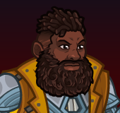
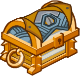
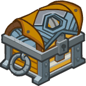

[Back to Main](index.md)

    
        
            
        
        
        Portrait
        
    
    
        
            
        
        
        Model
        
    

# Baldric

Baldric, a cleric who refuses to tie himself to a single deity when he can trade favors with them all.

[The Fallbacks: Bound for Ruin - Fandom Wiki](https://forgottenrealms.fandom.com/wiki/The_Fallbacks:_Bound_for_Ruin)

# Basic Information

Baldric will be a new champion in the Ahghairon's Day event on 6 August 2025.

    
        
            **Seat**:
        
        
            Unknown
        
    
    
        
            **Species**:
        
        
            Unknown
        
    
    
        
            **Class**:
        
        
            Cleric (Guess)
        
    
    
        
            **Roles**:
        
        
            Support (Guess)
        
    
    
        
            **Age**:
        
        
            Unknown
        
    
    
        
            **Gender**:
        
        
            Male (Guess)
        
    
    
        
            **Alignment**:
        
        
            Unknown
        
    
    
        
            **Affiliation**:
        
        
            The Fallbacks (Guess)
        
    

# Formation

Unknown.


    



# Attacks

Unknown.

# Abilities

**Unknown** (Guess)
> Uggie joins the party, starting next to Baldric unless they're already in the formation next to another Fallbacks Champion. Uggie increases the damage of all non-adjacent Champions by 100%.

<em>Raw Data</em>

<pre>
{
    "id": 2363,
    "flavour_text": "",
    "description": {
        "desc": "Uggie joins the party, starting next to Baldric unless they're already in the formation next to another Fallbacks Champion. Uggie increases the damage of all non-adjacent Champions by $amount%"
    },
    "effect_keys": [
        {
            "effect_string": "uggie_handler,100",
            "off_when_benched": true,
            "uggie_effects": [
                1
            ]
        },
        {
            "effect_string": "hero_dps_multiplier_mult,100",
            "off_when_benched": true,
            "apply_manually": true,
            "targets": [
                "non_adj"
            ]
        }
    ],
    "requirements": "",
    "graphic_id": 0,
    "large_graphic_id": 0,
    "properties": {
        "is_formation_ability": true,
        "show_incoming": false,
        "indexed_effect_properties": true,
        "per_effect_index_bonuses": true,
        "default_bonus_index": 0,
        "retain_on_slot_changed": true
    }
}
</pre>

# Specialisations

Unknown.

# Items

Unknown.

# Feats

Unknown.

# Legendaries

Unknown.

# Adventures and Variants

**Unlock Adventure: The Missing Lord (Baldric)** (Complete Area 50)
> Save Waterdeep from the chaos of a Founders' Day gone awry.

**Variant 1: TBD** (Complete Area 75)
> 

**Variant 2: TBD** (Complete Area 125)
> 

**Variant 3: TBD** (Complete Area 175)
> 

# Other Champion Images

    
        
            Console Portrait
        
    
    
        
            Gold Chest Icon
        
        
            Silver Chest Icon
        
    

[Back to Top](#top)

*Last Modified: {{ site.time }}*