[Back to Main](index.md)

# Table of Contents

* [Bastion](#bastion)
* [Roadmap Information](#roadmap-information)
* [Tutorial Texts](#tutorial-texts)
* [Trophies](#trophies)
* [Champion Interests](#champion-interests)
* [Interactive Icons](#interactive-icons)
* [Known Rooms](#known-rooms)
* [Text Defines](#text-defines)

# Bastion

This appears to be some kind of new system in the game. We know very little about it except for some text defines and graphics.

We know it will let players unlock rooms to gain access to some game systems - such as Parlor for Patrons / Observatory for Events. We also know that rooms will be able to level up (though what effect this will have is anyone's guess).

The assumption is that this will be some kind of new-player onboarding system.

# Roadmap Information

ⓘ *Note: The roadmap information is taken directly from the [roadmap twitch stream](https://www.twitch.tv/videos/2788712278?t=0h41m30s){:target="_blank"}. Double 'the's and all.*

> A Bastion is a location that belongs to a player character: a home, a stronghold, and a place of power that the character develops over the course of a campaign. ~2025 DMG

* Bastions are a central hub for various systems
* Includes rooms that you can unlock and upgrade over time.
  * These rooms path & grant access to the various features and systems of the game in a more explicit manner than currently available.
* Allows players to immediately get an idea about the the scope/depth of the game without overwhelming them with buttons and dialogs.

### Roadmap Preview Image 1

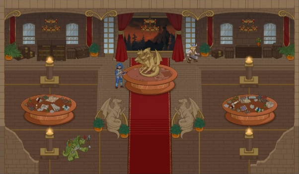

### Roadmap Preview Image 2

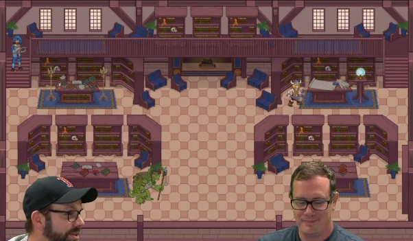

# Reddit Anniversary Q&A with Chris

ⓘ *Note: This information is taken directly from the [Reddit Anniversary Q&A](https://www.reddit.com/r/idlechampions/comments/1w0wvnx/idle_champions_9th_anniversary_qa_with_exec/){:target="_blank"}.*

> ## Introducing the Bastion System
> Our long-teased **Bastion system is almost here**!
> 
> We're putting the finishing touches on it this week, with plans to begin rolling it out to **PC players in Beta next week**, followed by console and mobile players shortly thereafter.
> 
> Recently, we've focused a lot on challenging content for long-time players with **Mastery Challenges and Mastery Variants**. Bastions are different: **they're designed for everyone, with a particular focus on helping newer players find their way through Idle Champions**.
> 
> Ever found yourself wondering...
> 
> - What should I tackle next?
> - What systems haven't I unlocked yet?
> - Where was that feature again?
> 
> **Your Bastion is here to help**.
> 
> The Bastion is a new **pathing and navigation system** that guides you through Idle Champions' many features and brings them together in one convenient place. Whether you're discovering the game for the first time or you're a seasoned adventurer looking for what to tackle next, your Bastion can help point the way.

### Reddit Q&A Sneak Peek Screenshot

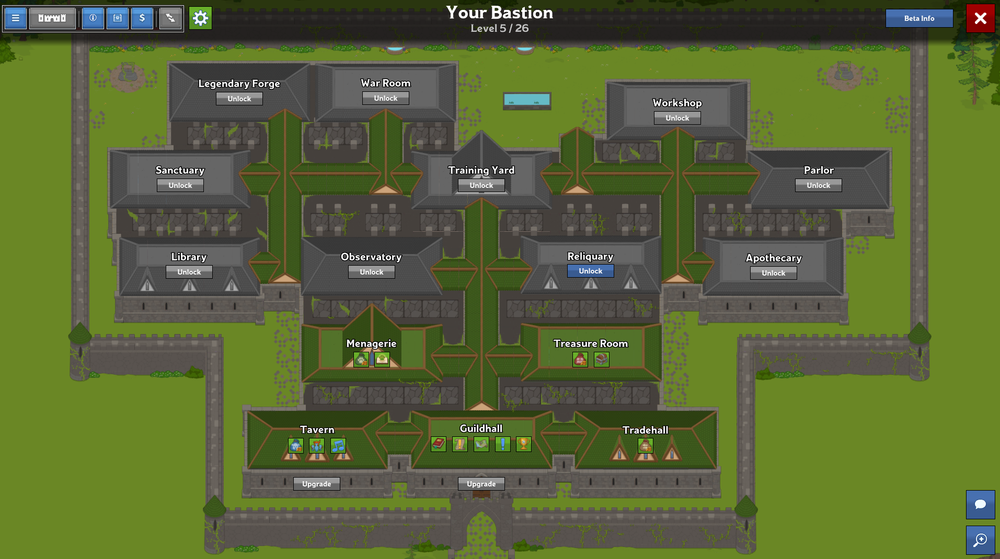

# Tutorial Texts

### State #1
> The innkeeper said we could stay as long as we'd like. He's offered this area o' the grounds as our new Bastion! He said we can fix it up over time. Each room we fix and unlock will open up more things to do!

### State #2
> Let's get started by unlockin' the Tradehall together. Click on the Tradehall to zoom in and check it out!

### State #3
> The unlock button shows the requirements fer a room. Once we've met the requirements, we can unlock the room by clicking on that button.

### State #4
> Great! Each room in the Bastion unlocks new features in the game. Unlockin' this room grants access to the shop, where ye can buy stuff fer Gems that'll help you progress. Now's not really the right time to go shoppin', though, so click outside o' the room to zoom back out.

### State #5
> Let's head over to the Guildhall.

### State #6
> The Guildhall is where ye can access the campaign map in the Bastion. When ye wanna start a new adventure, ye can click on the campaign map to bring up the list of available campaigns & adventures.

# Trophies

We now have some graphics for trophies.

{::nomarkdown}

  

    Chestof Gems
  

  

    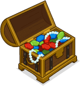
  

  

    Chultan Puzzle Cube
  

  

    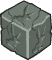
  

  

    Exhausted Modron
  

  

    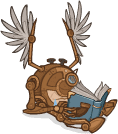
  

  

    Gleaming Bahamut
  

  

    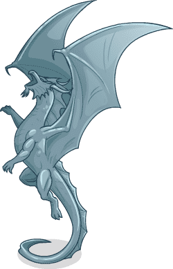
  

  

    Living Statue
  

  

    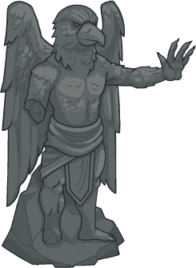
  

  

    Marvelous Pigment Cupboard
  

  

    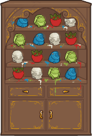
  

  

    Mirts Money Sack
  

  

    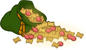
  

  

    Pileof Contracts
  

  

    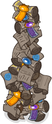
  

  

    Strahds Throne
  

  

    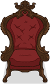
  

  

    Undermountain Ruin
  

  

    
  

  

    Zombie Trex
  

  

    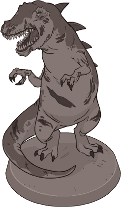
  

  

    Vajras Black Staff
  

  

    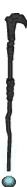
  

  

    Zariel Sword
  

  

    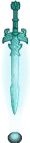
  

  

    Elminster Pipe
  

  

    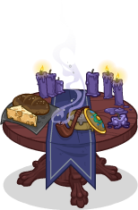
  

  

    Extravegant Rug
  

  

    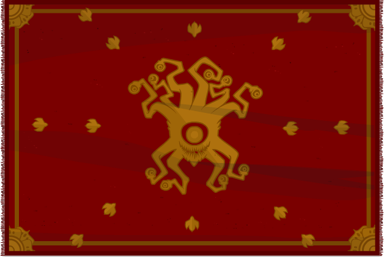
  

  

    Iris Plushie
  

  

    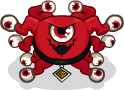
  

  

    Miniature Tiamat Statue
  

  

    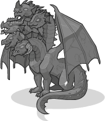
  

  

    Polished Stonepillar
  

  

    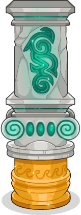
  

  

    Rusty Armor Stand
  

  

    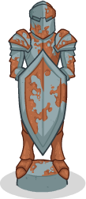
  

  

    Tomeof Advanture
  

  

    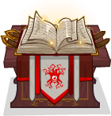
  

  

    Bahamet Statue
  

  

    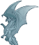
  

  

    Chestof Gems
  

  

    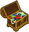
  

  

    Elminster Pipe
  

  

    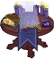
  

  

    Extravegant Rug
  

  

    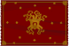
  

  

    Iris Plushie
  

  

    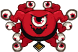
  

  

    Marvelouspigment Cupboard
  

  

    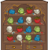
  

  

    Miniature Tiamat Statue
  

  

    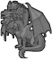
  

  

    Mirts Money Sack
  

  

    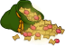
  

  

    Modron
  

  

    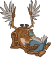
  

  

    Pileof Contracts
  

  

    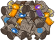
  

  

    Polished Stone Pillar
  

  

    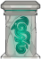
  

  

    Puzzle Cube
  

  

    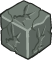
  

  

    Rusty Armor Stand
  

  

    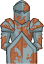
  

  

    Strahds Throne
  

  

    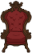
  

  

    Tomeof Adventure
  

  

    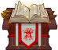
  

  

    Trex Statue
  

  

    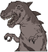
  

  

    Undermountain Rune
  

  

    
  

  

    Vajras Black Staff
  

  

    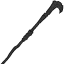
  

  

    Walking Statue
  

  

    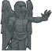
  

  

    Zariels Sword
  

  

    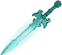
  

 

{:/nomarkdown}

The five patron ones will be available in the patron shop shop:

| Name | Currency | Influence | Trophy ID |
|---|---|---|---|
| Bastion Trophy - Mirt | 1.00e05 | 1.00e13 | 6 |
| Bastion Trophy - Vajra | 1.00e05 | 1.00e12 | 7 |
| Bastion Trophy - Strahd | 1.00e05 | 1.50e10 | 8 |
| Bastion Trophy - Zariel | 1.00e05 | 2.80e10 | 9 |
| Bastion Trophy - Elminster | 1.00e05 | 1.00e15 | 10 |

# Champion Interests

We have been told that champions will wander around the Bastion and communicate with oneanother. The way they will do this appears to be through thought bubbles.

## Alignment

{::nomarkdown}

  

    Chaotic
  

  

    

      
    

  

  

    Evil
  

  

    

      
    

  

  

    Good
  

  

    

      
    

  

  

    Lawful
  

  

    

      
    

  

  

    Neutral
  

  

    

      
    

  

{:/nomarkdown}

## Class

{::nomarkdown}

  

    Artificier
  

  

    

      
    

  

  

    Barbarian
  

  

    

      
    

  

  

    Bard
  

  

    

      
    

  

  

    Cleric
  

  

    

      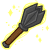
    

  

  

    Druid
  

  

    

      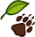
    

  

  

    Fighter
  

  

    

      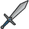
    

  

  

    Monk
  

  

    

      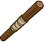
    

  

  

    Paladin
  

  

    

      
    

  

  

    Ranger
  

  

    

      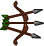
    

  

  

    Rogue
  

  

    

      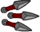
    

  

  

    Sorceror
  

  

    

      
    

  

  

    Warlock
  

  

    

      
    

  

  

    Wizard
  

  

    

      
    

  

{:/nomarkdown}

## Damage

{::nomarkdown}

  

    Magic
  

  

    

      
    

  

  

    Melee
  

  

    

      
    

  

  

    Ranged
  

  

    

      
    

  

{:/nomarkdown}

## Monster

{::nomarkdown}

  

    Abberation
  

  

    

      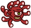
    

  

  

    Beast
  

  

    

      
    

  

  

    Celestial
  

  

    

      
    

  

  

    Construct
  

  

    

      
    

  

  

    Dragon
  

  

    

      
    

  

  

    Elemental
  

  

    

      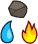
    

  

  

    Fey
  

  

    

      
    

  

  

    Fiend
  

  

    

      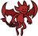
    

  

  

    Giant
  

  

    

      
    

  

  

    Humanoid
  

  

    

      
    

  

  

    Monstrosity
  

  

    

      
    

  

  

    Ooze
  

  

    

      
    

  

  

    Plant
  

  

    

      
    

  

  

    Undead
  

  

    

      
    

  

{:/nomarkdown}

## Reaction

{::nomarkdown}

  

    Negative
  

  

    

      
    

  

  

    Neutral
  

  

    

      
    

  

  

    Positive
  

  

    

      
    

  

{:/nomarkdown}

## Role

{::nomarkdown}

  

    Breaker
  

  

    

      
    

  

  

    Control
  

  

    

      
    

  

  

    Debuff
  

  

    

      
    

  

  

    DPS
  

  

    

      
    

  

  

    Gold
  

  

    

      
    

  

  

    Healing
  

  

    

      
    

  

  

    Hunter
  

  

    

      
    

  

  

    Speed
  

  

    

      
    

  

  

    Support
  

  

    

      
    

  

  

    Tanking
  

  

    

      
    

  

 

{:/nomarkdown}

# Interactive Icons

{::nomarkdown}

  

    Active Tasks
  

  

    
  

  

    Apothecary
  

  

    
  

  

    Arcana
  

  

    
  

  

    Blessings
  

  

    
  

  

    Blueprint
  

  

    
  

  

    Calendar
  

  

    
  

  

    Campaign Map
  

  

    
  

  

    Champion Shop
  

  

    
  

  

    Chest Shop
  

  

    
  

  

    Chests
  

  

    
  

  

    Collections
  

  

    
  

  

    Familiar Encyclopedia
  

  

    
  

  

    Familiar Shop
  

  

    
  

  

    Forge Upgrade
  

  

    
  

  

    Guide Quests
  

  

    
  

  

    Journal
  

  

    
  

  

    Legendary Forge
  

  

    
  

  

    Modron
  

  

    
  

  

    Multiparty
  

  

    
  

  

    Music
  

  

    
  

  

    Notary
  

  

    
  

  

    Patrons
  

  

    
  

  

    Shop
  

  

    
  

  

    Timegate
  

  

    
  

  

    Trials
  

  

    
  

  

    Trophies
  

  

    
  

 

{:/nomarkdown}

# Known Rooms

## Apothecary

Unlocks the Apothecary, which allows you to break down unwanted potions into components, and then craft those components into new potions (including Legendary potions), as well as the Notary, which allows you to trade contracts and bulk spend gems (certain restrictions apply).

### Unlock Requirements

> Use 100 potions or Obtain 1,000,000 gems

### Images

> [Bastion_Wall_Hallway_Door_Side](images/bastion/rooms/apothecary/bastion_wall_hallway_door_side.png){:target="_blank"}  
> [Bastion_Apothecary_Floor_Tile02](images/bastion/rooms/apothecary/bastion_apothecary_floor_tile02.png){:target="_blank"}  
> [Bastion_Roof_Roof3_Panel](images/bastion/rooms/apothecary/bastion_roof_roof3_panel.png){:target="_blank"}  
> [Bastion_Roof_Roof3_Side](images/bastion/rooms/apothecary/bastion_roof_roof3_side.png){:target="_blank"}  
> [Bastion_Apothecary_Floor_Tile03](images/bastion/rooms/apothecary/bastion_apothecary_floor_tile03.png){:target="_blank"}  
> [Bastion_Apothecary_Floor_Tile01](images/bastion/rooms/apothecary/bastion_apothecary_floor_tile01.png){:target="_blank"}  
> [Bastion_Apothecary_Wall_Tile01](images/bastion/rooms/apothecary/bastion_apothecary_wall_tile01.png){:target="_blank"}  
> [Bastion_Apothecary_Wall_Tile02](images/bastion/rooms/apothecary/bastion_apothecary_wall_tile02.png){:target="_blank"}  
> [Bastion_Apothecary_Wall_SideWallFront01](images/bastion/rooms/apothecary/bastion_apothecary_wall_sidewallfront01.png){:target="_blank"}  
> [Bastion_Apothecary_Wall_SideWallTop](images/bastion/rooms/apothecary/bastion_apothecary_wall_sidewalltop.png){:target="_blank"}  
> [Bastion_Apothecary_Doodad_RugSmall](images/bastion/rooms/apothecary/bastion_apothecary_doodad_rugsmall.png){:target="_blank"}  
> [Bastion_Apothecary_Doodad_RugLarge](images/bastion/rooms/apothecary/bastion_apothecary_doodad_ruglarge.png){:target="_blank"}  
> [Bastion_Apothecary_Doodad_NotaryDesk1](images/bastion/rooms/apothecary/bastion_apothecary_doodad_notarydesk1.png){:target="_blank"}  
> [Bastion_Apothecary_Doodad_Ladder](images/bastion/rooms/apothecary/bastion_apothecary_doodad_ladder.png){:target="_blank"}  
> [Bastion_Apothecary_Doodad_VertTable1](images/bastion/rooms/apothecary/bastion_apothecary_doodad_verttable1.png){:target="_blank"}  
> [Bastion_Apothecary_Doodad_VertTable2](images/bastion/rooms/apothecary/bastion_apothecary_doodad_verttable2.png){:target="_blank"}  
> [Bastion_Apothecary_Doodad_WallPlant](images/bastion/rooms/apothecary/bastion_apothecary_doodad_wallplant.png){:target="_blank"}  
> [Bastion_Apothecary_Doodad_Supplies1](images/bastion/rooms/apothecary/bastion_apothecary_doodad_supplies1.png){:target="_blank"}  
> [Bastion_Apothecary_Doodad_Supplies2](images/bastion/rooms/apothecary/bastion_apothecary_doodad_supplies2.png){:target="_blank"}  
> [Bastion_Apothecary_Doodad_Supplies3](images/bastion/rooms/apothecary/bastion_apothecary_doodad_supplies3.png){:target="_blank"}  
> [Bastion_Apothecary_Doodad_Supplies4](images/bastion/rooms/apothecary/bastion_apothecary_doodad_supplies4.png){:target="_blank"}  
> [Bastion_Apothecary_Doodad_Baskets](images/bastion/rooms/apothecary/bastion_apothecary_doodad_baskets.png){:target="_blank"}  
> [Bastion_Apothecary_Doodad_Chair](images/bastion/rooms/apothecary/bastion_apothecary_doodad_chair.png){:target="_blank"}  
> [Bastion_Apothecary_Doodad_Couch](images/bastion/rooms/apothecary/bastion_apothecary_doodad_couch.png){:target="_blank"}  
> [Bastion_Apothecary_Wall_SideWallFront](images/bastion/rooms/apothecary/bastion_apothecary_wall_sidewallfront.png){:target="_blank"}  
> [Bastion_ExtWall_Panel](images/bastion/rooms/apothecary/bastion_extwall_panel.png){:target="_blank"}  
> [Bastion_ExtWall_Window](images/bastion/rooms/apothecary/bastion_extwall_window.png){:target="_blank"}  
> [Bastion_Roof_HallRoof_HorzSide](images/bastion/rooms/apothecary/bastion_roof_hallroof_horzside.png){:target="_blank"}  

## Exterior

The walls surrounding the various bastion rooms.

### Images

> [Bastion_ExtWall_PillarCorner](images/bastion/rooms/exterior/bastion_extwall_pillarcorner.png){:target="_blank"}  
> [Bastion_Ext_StonePath](images/bastion/rooms/exterior/bastion_ext_stonepath.png){:target="_blank"}  
> [Bastion_Ext_Doodad_FlowerGroup](images/bastion/rooms/exterior/bastion_ext_doodad_flowergroup.png){:target="_blank"}  
> [Bastion_Ext_Doodad_GroundFlowers1](images/bastion/rooms/exterior/bastion_ext_doodad_groundflowers1.png){:target="_blank"}  
> [Bastion_Ext_Doodad_GrassTexture](images/bastion/rooms/exterior/bastion_ext_doodad_grasstexture.png){:target="_blank"}  
> [Bastion_Ext_Parapet_Horz](images/bastion/rooms/exterior/bastion_ext_parapet_horz.png){:target="_blank"}  
> [Bastion_Ext_Doodad_WallDirtHill1](images/bastion/rooms/exterior/bastion_ext_doodad_walldirthill1.png){:target="_blank"}  
> [Bastion_Ext_Doodad_WallDirtHill2](images/bastion/rooms/exterior/bastion_ext_doodad_walldirthill2.png){:target="_blank"}  
> [Bastion_ExtWall_PanelCorner](images/bastion/rooms/exterior/bastion_extwall_panelcorner.png){:target="_blank"}  
> [Bastion_Ext_Doodad_FloweringShrub1](images/bastion/rooms/exterior/bastion_ext_doodad_floweringshrub1.png){:target="_blank"}  
> [Bastion_Ext_Doodad_GroundShade4](images/bastion/rooms/exterior/bastion_ext_doodad_groundshade4.png){:target="_blank"}  
> [Bastion_Ext_Doodad_Shrub1](images/bastion/rooms/exterior/bastion_ext_doodad_shrub1.png){:target="_blank"}  
> [Bastion_ExtWall_SideWall](images/bastion/rooms/exterior/bastion_extwall_sidewall.png){:target="_blank"}  
> [Bastion_ExtWall_Panel](images/bastion/rooms/exterior/bastion_extwall_panel.png){:target="_blank"}  
> [Bastion_ExtWall_Pillar](images/bastion/rooms/exterior/bastion_extwall_pillar.png){:target="_blank"}  
> [Bastion_Roof_InbetweenTile](images/bastion/rooms/exterior/bastion_roof_inbetweentile.png){:target="_blank"}  
> [Bastion_Roof_InbetweenTile_Large](images/bastion/rooms/exterior/bastion_roof_inbetweentile_large.png){:target="_blank"}  
> [Bastion_Ext_Gate](images/bastion/rooms/exterior/bastion_ext_gate.png){:target="_blank"}  
> [Bastion_Ext_Doodad_GroundShade1](images/bastion/rooms/exterior/bastion_ext_doodad_groundshade1.png){:target="_blank"}  
> [Bastion_Ext_Doodad_GroundShade2](images/bastion/rooms/exterior/bastion_ext_doodad_groundshade2.png){:target="_blank"}  
> [Bastion_Ext_Doodad_GroundShade3](images/bastion/rooms/exterior/bastion_ext_doodad_groundshade3.png){:target="_blank"}  
> [Bastion_Ext_Cliffs_Down](images/bastion/rooms/exterior/bastion_ext_cliffs_down.png){:target="_blank"}  
> [Bastion_Ext_Cliffs_Straight](images/bastion/rooms/exterior/bastion_ext_cliffs_straight.png){:target="_blank"}  
> [Bastion_Ext_Cliffs_Up](images/bastion/rooms/exterior/bastion_ext_cliffs_up.png){:target="_blank"}  
> [Bastion_Ext_Parapet_Vert](images/bastion/rooms/exterior/bastion_ext_parapet_vert.png){:target="_blank"}  
> [Bastion_Ext_Parapet_LowerCorner](images/bastion/rooms/exterior/bastion_ext_parapet_lowercorner.png){:target="_blank"}  
> [Bastion_Ext_Parapet_UpperCorner](images/bastion/rooms/exterior/bastion_ext_parapet_uppercorner.png){:target="_blank"}  
> [Bastion_Ext_Doodad_BGTrees](images/bastion/rooms/exterior/bastion_ext_doodad_bgtrees.png){:target="_blank"}  
> [Bastion_Ext_Doodad_Tree1](images/bastion/rooms/exterior/bastion_ext_doodad_tree1.png){:target="_blank"}  
> [Bastion_Ext_Doodad_Tree2](images/bastion/rooms/exterior/bastion_ext_doodad_tree2.png){:target="_blank"}  
> [Bastion_Ext_Doodad_Tree3](images/bastion/rooms/exterior/bastion_ext_doodad_tree3.png){:target="_blank"}  
> [Bastion_Ext_Doodad_Tree4](images/bastion/rooms/exterior/bastion_ext_doodad_tree4.png){:target="_blank"}  
> [Bastion_Ext_Doodad_Tree5](images/bastion/rooms/exterior/bastion_ext_doodad_tree5.png){:target="_blank"}  
> [Bastion_Ext_Doodad_Tree6](images/bastion/rooms/exterior/bastion_ext_doodad_tree6.png){:target="_blank"}  
> [Bastion_Ext_Bridge_Panel](images/bastion/rooms/exterior/bastion_ext_bridge_panel.png){:target="_blank"}  
> [Bastion_Ext_BridgePillar](images/bastion/rooms/exterior/bastion_ext_bridgepillar.png){:target="_blank"}  
> [Bastion_Ext_Doodad_Shrub2](images/bastion/rooms/exterior/bastion_ext_doodad_shrub2.png){:target="_blank"}  
> [Bastion_Ext_Doodad_Shrub3](images/bastion/rooms/exterior/bastion_ext_doodad_shrub3.png){:target="_blank"}  
> [Bastion_Ext_Doodad_Rock3](images/bastion/rooms/exterior/bastion_ext_doodad_rock3.png){:target="_blank"}  
> [Bastion_Ext_Doodad_Rock1](images/bastion/rooms/exterior/bastion_ext_doodad_rock1.png){:target="_blank"}  
> [Bastion_Ext_Doodad_Rock2](images/bastion/rooms/exterior/bastion_ext_doodad_rock2.png){:target="_blank"}  
> [Bastion_Ext_Doodad_Bush4](images/bastion/rooms/exterior/bastion_ext_doodad_bush4.png){:target="_blank"}  
> [Bastion_Ext_Doodad_Bush2](images/bastion/rooms/exterior/bastion_ext_doodad_bush2.png){:target="_blank"}  
> [Bastion_Ext_Doodad_Bush3](images/bastion/rooms/exterior/bastion_ext_doodad_bush3.png){:target="_blank"}  
> [Bastion_Wall_Hallway_SideWallTop](images/bastion/rooms/exterior/bastion_wall_hallway_sidewalltop.png){:target="_blank"}  
> [Bastion_Wall_Hallway_SideWallTopCorner](images/bastion/rooms/exterior/bastion_wall_hallway_sidewalltopcorner.png){:target="_blank"}  
> [Bastion_Ext_Bridge_EndCap](images/bastion/rooms/exterior/bastion_ext_bridge_endcap.png){:target="_blank"}  
> [Bastion_Ext_ParapetTower](images/bastion/rooms/exterior/bastion_ext_parapettower.png){:target="_blank"}  
> [Bastion_Ext_Doodad_WhiteFlowerMulti](images/bastion/rooms/exterior/bastion_ext_doodad_whiteflowermulti.png){:target="_blank"}  
> [Bastion_Ext_Doodad_StoneCircle](images/bastion/rooms/exterior/bastion_ext_doodad_stonecircle.png){:target="_blank"}  
> [Bastion_Ext_Doodad_FloweringShrub2](images/bastion/rooms/exterior/bastion_ext_doodad_floweringshrub2.png){:target="_blank"}  
> [Bastion_Ext_Doodad_Well](images/bastion/rooms/exterior/bastion_ext_doodad_well.png){:target="_blank"}  
> [Bastion_Ext_Doodad_Fountain](images/bastion/rooms/exterior/bastion_ext_doodad_fountain.png){:target="_blank"}  
> [Bastion_Ext_Doodad_WallDirtHill3](images/bastion/rooms/exterior/bastion_ext_doodad_walldirthill3.png){:target="_blank"}  
> [Bastion_Ext_Doodad_WallVinesLrg1](images/bastion/rooms/exterior/bastion_ext_doodad_wallvineslrg1.png){:target="_blank"}  
> [Bastion_Ext_Doodad_WallVinesLrg2](images/bastion/rooms/exterior/bastion_ext_doodad_wallvineslrg2.png){:target="_blank"}  
> [Bastion_Ext_Doodad_WallVinesLrg3](images/bastion/rooms/exterior/bastion_ext_doodad_wallvineslrg3.png){:target="_blank"}  
> [Bastion_ExtWall_Window](images/bastion/rooms/exterior/bastion_extwall_window.png){:target="_blank"}  
> [Bastion_Ext_Doodad_WallVines6](images/bastion/rooms/exterior/bastion_ext_doodad_wallvines6.png){:target="_blank"}  
> [Bastion_Ext_Doodad_WallVines4](images/bastion/rooms/exterior/bastion_ext_doodad_wallvines4.png){:target="_blank"}  
> [Bastion_Ext_Doodad_WallVines3](images/bastion/rooms/exterior/bastion_ext_doodad_wallvines3.png){:target="_blank"}  
> [Bastion_Ext_Doodad_WallVines2](images/bastion/rooms/exterior/bastion_ext_doodad_wallvines2.png){:target="_blank"}  
> [Bastion_Ext_Doodad_OrangeFlowersMulti](images/bastion/rooms/exterior/bastion_ext_doodad_orangeflowersmulti.png){:target="_blank"}  
> [Bastion_Ext_Doodad_PurpleFlowersMulti](images/bastion/rooms/exterior/bastion_ext_doodad_purpleflowersmulti.png){:target="_blank"}  
> [Bastion_Ext_Doodad_OrangeFlower](images/bastion/rooms/exterior/bastion_ext_doodad_orangeflower.png){:target="_blank"}  
> [Bastion_Ext_Doodad_GroundTexture1](images/bastion/rooms/exterior/bastion_ext_doodad_groundtexture1.png){:target="_blank"}  
> [Bastion_Ext_Doodad_GroundTexture2](images/bastion/rooms/exterior/bastion_ext_doodad_groundtexture2.png){:target="_blank"}  
> [Bastion_Ext_Doodad_GroundTexture3](images/bastion/rooms/exterior/bastion_ext_doodad_groundtexture3.png){:target="_blank"}  
> [Bastion_Ext_Doodad_BerryBush3](images/bastion/rooms/exterior/bastion_ext_doodad_berrybush3.png){:target="_blank"}  
> [Bastion_Ext_Doodad_ShrubnTreeMd](images/bastion/rooms/exterior/bastion_ext_doodad_shrubntreemd.png){:target="_blank"}  
> [Bastion_Roof_StoneDecor](images/bastion/rooms/exterior/bastion_roof_stonedecor.png){:target="_blank"}  
> [Bastion_Roof_MossBlob](images/bastion/rooms/exterior/bastion_roof_mossblob.png){:target="_blank"}  
> [Bastion_Roof_MossCorner1](images/bastion/rooms/exterior/bastion_roof_mosscorner1.png){:target="_blank"}  
> [Bastion_Roof_PatternTIle](images/bastion/rooms/exterior/bastion_roof_patterntile.png){:target="_blank"}  
> [Bastion_Ext_Doodad_RaisedPond](images/bastion/rooms/exterior/bastion_ext_doodad_raisedpond.png){:target="_blank"}  
> [Bastion_Menagerie_Doodad_FishShadow](images/bastion/rooms/exterior/bastion_menagerie_doodad_fishshadow.webp){:target="_blank"} (animated)  

## Guildhall

Complete adventures, variants, quests, and achievements to progress in Idle Champions of the Forgotten Realms!

### Upgrading Requirements and Unlocks

> Complete 4 unique adventures: Tomb of Annihilation campaign and Tales of the Champions campaign  
> Complete 15 unique adventures: Waterdeep: Dragon Heist campaign  
> Complete 25 unique adventures: Baldur's Gate: Descent into Avernus campaign  
> Complete 35 unique adventures: Icewind Dale: Rime of the Frostmaiden campaign  
> Complete 50 unique adventures: The Wild Beyond the Witchlight campaign  
> Complete 65 unique adventures: Light of Xaryxis campaign  
> Complete 80 unique adventures: Turn of Fortune's Wheel campaign  
> Complete 100 unique adventures: Vecna: Eve of Ruin campaign

### Images

> [Bastion_Floor_WoodRockMix_PanelSmall](images/bastion/rooms/guildhall/bastion_floor_woodrockmix_panelsmall.png){:target="_blank"}  
> [Bastion_Floor_WoodRockMix_PanelFull](images/bastion/rooms/guildhall/bastion_floor_woodrockmix_panelfull.png){:target="_blank"}  
> [Bastion_Roof_Roof2_Side](images/bastion/rooms/guildhall/bastion_roof_roof2_side.png){:target="_blank"}  
> [Bastion_Roof_Roof2_Panel](images/bastion/rooms/guildhall/bastion_roof_roof2_panel.png){:target="_blank"}  
> [Bastion_ExtWall_Panel](images/bastion/rooms/guildhall/bastion_extwall_panel.png){:target="_blank"}  
> [Bastion_ExtWall_Door](images/bastion/rooms/guildhall/bastion_extwall_door.png){:target="_blank"}  
> [Bastion_ExtWall_Window](images/bastion/rooms/guildhall/bastion_extwall_window.png){:target="_blank"}  
> [Bastion_Roof_HallRoof_HorzSide](images/bastion/rooms/guildhall/bastion_roof_hallroof_horzside.png){:target="_blank"}  
> [Bastion_Wall_BlackRock_DoorPanel](images/bastion/rooms/guildhall/bastion_wall_blackrock_doorpanel.png){:target="_blank"}  
> [Bastion_Wall_BlackRock_CutOut](images/bastion/rooms/guildhall/bastion_wall_blackrock_cutout.png){:target="_blank"}  
> [Bastion_Wall_BlackRock_Panel1](images/bastion/rooms/guildhall/bastion_wall_blackrock_panel1.png){:target="_blank"}  
> [Bastion_Wall_BlackRock_SideWallTop](images/bastion/rooms/guildhall/bastion_wall_blackrock_sidewalltop.png){:target="_blank"}  
> [Bastion_Wall_BlackRock_SideWallFront](images/bastion/rooms/guildhall/bastion_wall_blackrock_sidewallfront.png){:target="_blank"}  
> [Bastion_Guild_Doodad_Chandelier](images/bastion/rooms/guildhall/bastion_guild_doodad_chandelier.png){:target="_blank"}  
> [Bastion_Guild_Doodad_DiagonalChair](images/bastion/rooms/guildhall/bastion_guild_doodad_diagonalchair.png){:target="_blank"}  
> [Bastion_Guild_Doodad_Rail1](images/bastion/rooms/guildhall/bastion_guild_doodad_rail1.png){:target="_blank"}  
> [Bastion_Guild_Doodad_Rail2](images/bastion/rooms/guildhall/bastion_guild_doodad_rail2.png){:target="_blank"}  
> [Bastion_Guild_Doodad_Banner1](images/bastion/rooms/guildhall/bastion_guild_doodad_banner1.png){:target="_blank"}  
> [Bastion_Guild_Doodad_Banner2](images/bastion/rooms/guildhall/bastion_guild_doodad_banner2.png){:target="_blank"}  
> [Bastion_Guild_Doodad_Banner3](images/bastion/rooms/guildhall/bastion_guild_doodad_banner3.png){:target="_blank"}  
> [Bastion_Guild_Doodad_Torch](images/bastion/rooms/guildhall/bastion_guild_doodad_torch.png){:target="_blank"}  
> [Bastion_Library_Doodad_Plant](images/bastion/rooms/guildhall/bastion_library_doodad_plant.png){:target="_blank"}  
> [Bastion_Wall_BlackRock_Door_Side](images/bastion/rooms/guildhall/bastion_wall_blackrock_door_side.png){:target="_blank"}  
> [Bastion_Guild_Floor_CheckeredFloor](images/bastion/rooms/guildhall/bastion_guild_floor_checkeredfloor.png){:target="_blank"}  
> [Bastion_Guild_Doodad_RugRunner](images/bastion/rooms/guildhall/bastion_guild_doodad_rugrunner.png){:target="_blank"}  
> [Bastion_Guild_Doodad_RugSide](images/bastion/rooms/guildhall/bastion_guild_doodad_rugside.png){:target="_blank"}  

## Hallways

The hallways connecting the various bastion rooms.

### Images

> [Bastion_ExtWall_SideWall](images/bastion/rooms/hallways/bastion_extwall_sidewall.png){:target="_blank"}  
> [Bastion_Roof_InbetweenTile](images/bastion/rooms/hallways/bastion_roof_inbetweentile.png){:target="_blank"}  
> [Bastion_Floor_Hallway](images/bastion/rooms/hallways/bastion_floor_hallway.png){:target="_blank"}  
> [Bastion_Roof_HallRoof_Horz](images/bastion/rooms/hallways/bastion_roof_hallroof_horz.png){:target="_blank"}  
> [Bastion_Roof_HallRoof_Vert](images/bastion/rooms/hallways/bastion_roof_hallroof_vert.png){:target="_blank"}  
> [Bastion_Wall_Hallway_Door_Side](images/bastion/rooms/hallways/bastion_wall_hallway_door_side.png){:target="_blank"}  
> [Bastion_Wall_Hallway_Panel1](images/bastion/rooms/hallways/bastion_wall_hallway_panel1.png){:target="_blank"}  
> [Bastion_Wall_Hallway_CutOut](images/bastion/rooms/hallways/bastion_wall_hallway_cutout.png){:target="_blank"}  
> [Bastion_Wall_Hallway_Panel2](images/bastion/rooms/hallways/bastion_wall_hallway_panel2.png){:target="_blank"}  
> [Bastion_Roof_HallRoof_Vert_EndCapBottom](images/bastion/rooms/hallways/bastion_roof_hallroof_vert_endcapbottom.png){:target="_blank"}  
> [Bastion_Roof_InbetweenTile_Large](images/bastion/rooms/hallways/bastion_roof_inbetweentile_large.png){:target="_blank"}  
> [Bastion_Roof_HallRoof_Vert_EndCapTop](images/bastion/rooms/hallways/bastion_roof_hallroof_vert_endcaptop.png){:target="_blank"}  
> [Bastion_Hallway_Floor_Shadow](images/bastion/rooms/hallways/bastion_hallway_floor_shadow.png){:target="_blank"}  
> [Bastion_Roof_HallRoof_HorzSide](images/bastion/rooms/hallways/bastion_roof_hallroof_horzside.png){:target="_blank"}  
> [Bastion_Roof_MossCorner1](images/bastion/rooms/hallways/bastion_roof_mosscorner1.png){:target="_blank"}  

## Legendary Forge

Unlocks the Legendary Forge, which allows you to upgrade the effects of your Legendary Equipment.

### Unlock Requirements

> Obtain 1,000 Scales of Tiamat

### Images

> [Bastion_Roof_InbetweenTile](images/bastion/rooms/legendaryforge/bastion_roof_inbetweentile.png){:target="_blank"}  
> [Bastion_Roof_InbetweenTile_Large](images/bastion/rooms/legendaryforge/bastion_roof_inbetweentile_large.png){:target="_blank"}  
> [Bastion_Forge_Wall_Panel01](images/bastion/rooms/legendaryforge/bastion_forge_wall_panel01.png){:target="_blank"}  
> [Bastion_Forge_Wall_FrontWallPanel](images/bastion/rooms/legendaryforge/bastion_forge_wall_frontwallpanel.png){:target="_blank"}  
> [Bastion_Forge_Wall_SideWallFront](images/bastion/rooms/legendaryforge/bastion_forge_wall_sidewallfront.png){:target="_blank"}  
> [Bastion_Forge_Wall_SideWall](images/bastion/rooms/legendaryforge/bastion_forge_wall_sidewall.png){:target="_blank"}  
> [Bastion_Forge_Floor_Marble](images/bastion/rooms/legendaryforge/bastion_forge_floor_marble.png){:target="_blank"}  
> [Bastion_Forge_Floor_BrownTileSmallLarge](images/bastion/rooms/legendaryforge/bastion_forge_floor_browntilesmalllarge.png){:target="_blank"}  
> [Bastion_Forge_Floor_BrownTileSmall](images/bastion/rooms/legendaryforge/bastion_forge_floor_browntilesmall.png){:target="_blank"}  
> [Bastion_Forge_Floor_CenterDetail](images/bastion/rooms/legendaryforge/bastion_forge_floor_centerdetail.png){:target="_blank"}  
> [Bastion_Forge_Floor_Stairs](images/bastion/rooms/legendaryforge/bastion_forge_floor_stairs.png){:target="_blank"}  
> [Bastion_Forge_Doodad_Anvil](images/bastion/rooms/legendaryforge/bastion_forge_doodad_anvil.png){:target="_blank"}  
> [Bastion_Forge_Doodad_Pillar](images/bastion/rooms/legendaryforge/bastion_forge_doodad_pillar.png){:target="_blank"}  
> [Bastion_Forge_Doodad_Sconce](images/bastion/rooms/legendaryforge/bastion_forge_doodad_sconce.png){:target="_blank"}  
> [Bastion_Forge_Doodad_Banner](images/bastion/rooms/legendaryforge/bastion_forge_doodad_banner.png){:target="_blank"}  
> [Bastion_Forge_Doodad_Barrels](images/bastion/rooms/legendaryforge/bastion_forge_doodad_barrels.png){:target="_blank"}  
> [Bastion_Forge_Doodad_SmallForge](images/bastion/rooms/legendaryforge/bastion_forge_doodad_smallforge.png){:target="_blank"}  
> [Bastion_Forge_Doodad_TableBlack](images/bastion/rooms/legendaryforge/bastion_forge_doodad_tableblack.png){:target="_blank"}  
> [Bastion_Forge_Doodad_TableBlue](images/bastion/rooms/legendaryforge/bastion_forge_doodad_tableblue.png){:target="_blank"}  
> [Bastion_Forge_Doodad_TableGreen](images/bastion/rooms/legendaryforge/bastion_forge_doodad_tablegreen.png){:target="_blank"}  
> [Bastion_Forge_Doodad_TableRed](images/bastion/rooms/legendaryforge/bastion_forge_doodad_tablered.png){:target="_blank"}  
> [Bastion_Forge_Doodad_TableWhite](images/bastion/rooms/legendaryforge/bastion_forge_doodad_tablewhite.png){:target="_blank"}  
> [Bastion_Forge_Doodad_WallHammers](images/bastion/rooms/legendaryforge/bastion_forge_doodad_wallhammers.png){:target="_blank"}  
> [Bastion_Forge_Doodad_WallShield](images/bastion/rooms/legendaryforge/bastion_forge_doodad_wallshield.png){:target="_blank"}  
> [Bastion_Forge_Doodad_WallSwords](images/bastion/rooms/legendaryforge/bastion_forge_doodad_wallswords.png){:target="_blank"}  
> [Bastion_Roof_Roof1_Side](images/bastion/rooms/legendaryforge/bastion_roof_roof1_side.png){:target="_blank"}  
> [Bastion_Roof_Roof1_Panel](images/bastion/rooms/legendaryforge/bastion_roof_roof1_panel.png){:target="_blank"}  
> [Bastion_Forge_LockedDoor](images/bastion/rooms/legendaryforge/bastion_forge_lockeddoor.png){:target="_blank"}  
> [Bastion_ExtWall_SideWall](images/bastion/rooms/legendaryforge/bastion_extwall_sidewall.png){:target="_blank"}  
> [Bastion_Wall_Hallway_SideWallTop](images/bastion/rooms/legendaryforge/bastion_wall_hallway_sidewalltop.png){:target="_blank"}  
> [Bastion_Roof_HallRoof_Vert](images/bastion/rooms/legendaryforge/bastion_roof_hallroof_vert.png){:target="_blank"}  
> [Bastion_Roof_StoneDecor](images/bastion/rooms/legendaryforge/bastion_roof_stonedecor.png){:target="_blank"}  
> [Bastion_Roof_PatternTIle](images/bastion/rooms/legendaryforge/bastion_roof_patterntile.png){:target="_blank"}  
> [Bastion_Roof_MossCorner2](images/bastion/rooms/legendaryforge/bastion_roof_mosscorner2.png){:target="_blank"}  
> [Bastion_Roof_MossBlob](images/bastion/rooms/legendaryforge/bastion_roof_mossblob.png){:target="_blank"}  
> [Bastion_Roof_MossCorner1](images/bastion/rooms/legendaryforge/bastion_roof_mosscorner1.png){:target="_blank"}  
> [Bastion_Roof_HallRoof_Vert_EndCapTop](images/bastion/rooms/legendaryforge/bastion_roof_hallroof_vert_endcaptop.png){:target="_blank"}  

## Library

Unlocks Collections, which tracks your completion progress through the game, as well as the Bastion Buff, which increases the damage of all your parties based on your total Bastion level.

### Unlock Requirements

> Complete 20 unique adventures

### Images

> [Bastion_Library_Floor_Panel02](images/bastion/rooms/library/bastion_library_floor_panel02.png){:target="_blank"}  
> [Bastion_Library_Floor_Panel01](images/bastion/rooms/library/bastion_library_floor_panel01.png){:target="_blank"}  
> [Bastion_Library_Wall_Panel01](images/bastion/rooms/library/bastion_library_wall_panel01.png){:target="_blank"}  
> [Bastion_Library_Wall_Fireplace](images/bastion/rooms/library/bastion_library_wall_fireplace.webp){:target="_blank"} (animated)  
> [Bastion_Tavern_Doodad_FireplaceFire](images/bastion/rooms/library/bastion_tavern_doodad_fireplacefire.png){:target="_blank"}  
> [Bastion_Library_Wall_Window](images/bastion/rooms/library/bastion_library_wall_window.png){:target="_blank"}  
> [Bastion_Library_Doodad_Rug](images/bastion/rooms/library/bastion_library_doodad_rug.png){:target="_blank"}  
> [Bastion_Library_Wall_SideWallTop](images/bastion/rooms/library/bastion_library_wall_sidewalltop.png){:target="_blank"}  
> [Bastion_Library_Wall_SideWallFront](images/bastion/rooms/library/bastion_library_wall_sidewallfront.png){:target="_blank"}  
> [Bastion_Library_Wall_FrontWallPanel](images/bastion/rooms/library/bastion_library_wall_frontwallpanel.png){:target="_blank"}  
> [Bastion_Library_Doodad_Door](images/bastion/rooms/library/bastion_library_doodad_door.png){:target="_blank"}  
> [Bastion_Library_Wall_Stairs](images/bastion/rooms/library/bastion_library_wall_stairs.png){:target="_blank"}  
> [Bastion_Library_Wall_Balcony01](images/bastion/rooms/library/bastion_library_wall_balcony01.png){:target="_blank"}  
> [Bastion_Library_Wall_Balcony02](images/bastion/rooms/library/bastion_library_wall_balcony02.png){:target="_blank"}  
> [Bastion_Library_Wall_Balcony03](images/bastion/rooms/library/bastion_library_wall_balcony03.png){:target="_blank"}  
> [Bastion_Library_Wall_Railing](images/bastion/rooms/library/bastion_library_wall_railing.png){:target="_blank"}  
> [Bastion_Library_Wall_Shelves](images/bastion/rooms/library/bastion_library_wall_shelves.png){:target="_blank"}  
> [Bastion_Library_Wall_Shadow](images/bastion/rooms/library/bastion_library_wall_shadow.png){:target="_blank"}  
> [Bastion_Library_Doodad_BookShelves01](images/bastion/rooms/library/bastion_library_doodad_bookshelves01.png){:target="_blank"}  
> [Bastion_Library_Doodad_BookShelves02](images/bastion/rooms/library/bastion_library_doodad_bookshelves02.png){:target="_blank"}  
> [Bastion_Library_Doodad_BookShelves03](images/bastion/rooms/library/bastion_library_doodad_bookshelves03.png){:target="_blank"}  
> [Bastion_Library_Doodad_Chair01](images/bastion/rooms/library/bastion_library_doodad_chair01.png){:target="_blank"}  
> [Bastion_Library_Doodad_Chair02](images/bastion/rooms/library/bastion_library_doodad_chair02.png){:target="_blank"}  
> [Bastion_Library_Doodad_Plant](images/bastion/rooms/library/bastion_library_doodad_plant.png){:target="_blank"}  
> [Bastion_Library_Doodad_Table01](images/bastion/rooms/library/bastion_library_doodad_table01.png){:target="_blank"}  
> [Bastion_Library_Doodad_Table02](images/bastion/rooms/library/bastion_library_doodad_table02.png){:target="_blank"}  
> [Bastion_Roof_Roof2_Side](images/bastion/rooms/library/bastion_roof_roof2_side.png){:target="_blank"}  
> [Bastion_Roof_Roof2_Panel](images/bastion/rooms/library/bastion_roof_roof2_panel.png){:target="_blank"}  
> [Bastion_Roof_SmallTopper](images/bastion/rooms/library/bastion_roof_smalltopper.png){:target="_blank"}  
> [Bastion_Library_Wall_Stairs_Railing](images/bastion/rooms/library/bastion_library_wall_stairs_railing.png){:target="_blank"}  
> [Bastion_ExtWall_Panel](images/bastion/rooms/library/bastion_extwall_panel.png){:target="_blank"}  
> [Bastion_ExtWall_Window](images/bastion/rooms/library/bastion_extwall_window.png){:target="_blank"}  
> [Bastion_TrainingYard_Floor_Shadow](images/bastion/rooms/library/bastion_trainingyard_floor_shadow.png){:target="_blank"}  
> [Bastion_Roof_HallRoof_HorzSide](images/bastion/rooms/library/bastion_roof_hallroof_horzside.png){:target="_blank"}  

## Menagerie

Unlocks Familiars, which can be used to automate certain clicking tasks, such as manually attacking enemies, leveling up Champions, activating ultimates, and enabling auto-progress.

### Unlock Requirements

> Obtain a Familiar or Reach Area 65 in any adventure

### Images

> [Bastion_Menagerie_Floor_Panel](images/bastion/rooms/menagerie/bastion_menagerie_floor_panel.png){:target="_blank"}  
> [Bastion_Menagerie_Wall_Panel](images/bastion/rooms/menagerie/bastion_menagerie_wall_panel.png){:target="_blank"}  
> [Bastion_Wall_GreyRock_SideWallTop](images/bastion/rooms/menagerie/bastion_wall_greyrock_sidewalltop.png){:target="_blank"}  
> [Bastion_Wall_Hallway_Door_Side](images/bastion/rooms/menagerie/bastion_wall_hallway_door_side.png){:target="_blank"}  
> [Bastion_Menagerie_Doodad_Pool](images/bastion/rooms/menagerie/bastion_menagerie_doodad_pool.png){:target="_blank"}  
> [Bastion_Menagerie_Wall_FrontWallPanel](images/bastion/rooms/menagerie/bastion_menagerie_wall_frontwallpanel.png){:target="_blank"}  
> [Bastion_Menagerie_Doodad_Tree](images/bastion/rooms/menagerie/bastion_menagerie_doodad_tree.png){:target="_blank"}  
> [Bastion_Menagerie_Doodad_Hill01](images/bastion/rooms/menagerie/bastion_menagerie_doodad_hill01.png){:target="_blank"}  
> [Bastion_Menagerie_Doodad_Hill02](images/bastion/rooms/menagerie/bastion_menagerie_doodad_hill02.png){:target="_blank"}  
> [Bastion_Menagerie_Doodad_RoseBushPink](images/bastion/rooms/menagerie/bastion_menagerie_doodad_rosebushpink.png){:target="_blank"}  
> [Bastion_Menagerie_Doodad_RoseBushOrange](images/bastion/rooms/menagerie/bastion_menagerie_doodad_rosebushorange.png){:target="_blank"}  
> [Bastion_Menagerie_Doodad_FlowerGroup](images/bastion/rooms/menagerie/bastion_menagerie_doodad_flowergroup.png){:target="_blank"}  
> [Bastion_Menagerie_Doodad_Flower03](images/bastion/rooms/menagerie/bastion_menagerie_doodad_flower03.png){:target="_blank"}  
> [Bastion_Roof_Roof3_Side](images/bastion/rooms/menagerie/bastion_roof_roof3_side.png){:target="_blank"}  
> [Bastion_Roof_Roof3_Panel](images/bastion/rooms/menagerie/bastion_roof_roof3_panel.png){:target="_blank"}  
> [Bastion_Roof_BigTopper](images/bastion/rooms/menagerie/bastion_roof_bigtopper.png){:target="_blank"}  
> [Bastion_Roof_InbetweenTile_Large](images/bastion/rooms/menagerie/bastion_roof_inbetweentile_large.png){:target="_blank"}  
> [Bastion_Roof_InbetweenTile](images/bastion/rooms/menagerie/bastion_roof_inbetweentile.png){:target="_blank"}  
> [Bastion_Menagerie_Doodad_FishShadow](images/bastion/rooms/menagerie/bastion_menagerie_doodad_fishshadow.webp){:target="_blank"} (animated)  
> [Bastion_Roof_HallRoof_HorzSide](images/bastion/rooms/menagerie/bastion_roof_hallroof_horzside.png){:target="_blank"}  
> [Bastion_Roof_PatternTIle](images/bastion/rooms/menagerie/bastion_roof_patterntile.png){:target="_blank"}  
> [Bastion_Ext_Doodad_WallVinesLrg3](images/bastion/rooms/menagerie/bastion_ext_doodad_wallvineslrg3.png){:target="_blank"}  
> [Bastion_Ext_Doodad_WallVinesLrg2](images/bastion/rooms/menagerie/bastion_ext_doodad_wallvineslrg2.png){:target="_blank"}  
> [Bastion_Roof_MossCorner1](images/bastion/rooms/menagerie/bastion_roof_mosscorner1.png){:target="_blank"}  

## Observatory

Unlocks access to Events, which are limited time campaigns that allow you to recruit new Champions and gear up existing ones. Events start on the first Wednesday of every month.

### Unlock Requirements

> Complete 3 unique adventures

### Images

> [Bastion_Observatory_Wall_SideWallTop](images/bastion/rooms/observatory/bastion_observatory_wall_sidewalltop.png){:target="_blank"}  
> [Bastion_Observatory_Floor_Floor](images/bastion/rooms/observatory/bastion_observatory_floor_floor.png){:target="_blank"}  
> [Bastion_Observatory_Floor_Door](images/bastion/rooms/observatory/bastion_observatory_floor_door.png){:target="_blank"}  
> [Bastion_Observatory_Floor_StarCircle](images/bastion/rooms/observatory/bastion_observatory_floor_starcircle.png){:target="_blank"}  
> [Bastion_Observatory_Wall_FrontWallPanel](images/bastion/rooms/observatory/bastion_observatory_wall_frontwallpanel.png){:target="_blank"}  
> [Bastion_Observatory_Doodad_Crystal](images/bastion/rooms/observatory/bastion_observatory_doodad_crystal.png){:target="_blank"}  
> [Bastion_Observatory_Wall_Panel](images/bastion/rooms/observatory/bastion_observatory_wall_panel.png){:target="_blank"}  
> [Bastion_Observatory_Wall_DecoPartial](images/bastion/rooms/observatory/bastion_observatory_wall_decopartial.png){:target="_blank"}  
> [Bastion_Observatory_Wall_Deco](images/bastion/rooms/observatory/bastion_observatory_wall_deco.png){:target="_blank"}  
> [Bastion_Observatory_Doodad_CandleStick](images/bastion/rooms/observatory/bastion_observatory_doodad_candlestick.png){:target="_blank"}  
> [Bastion_Observatory_Doodad_Mirror](images/bastion/rooms/observatory/bastion_observatory_doodad_mirror.png){:target="_blank"}  
> [Bastion_Observatory_Doodad_Painting](images/bastion/rooms/observatory/bastion_observatory_doodad_painting.png){:target="_blank"}  
> [Bastion_Observatory_Doodad_ScryeBall](images/bastion/rooms/observatory/bastion_observatory_doodad_scryeball.png){:target="_blank"}  
> [Bastion_Observatory_Doodad_Tabard](images/bastion/rooms/observatory/bastion_observatory_doodad_tabard.png){:target="_blank"}  
> [Bastion_Roof_Roof1_Side](images/bastion/rooms/observatory/bastion_roof_roof1_side.png){:target="_blank"}  
> [Bastion_Roof_Roof1_Panel](images/bastion/rooms/observatory/bastion_roof_roof1_panel.png){:target="_blank"}  
> [Bastion_Roof_InbetweenTile_Large](images/bastion/rooms/observatory/bastion_roof_inbetweentile_large.png){:target="_blank"}  
> [Bastion_Roof_InbetweenTile](images/bastion/rooms/observatory/bastion_roof_inbetweentile.png){:target="_blank"}  
> [Bastion_Roof_HallRoof_HorzSide](images/bastion/rooms/observatory/bastion_roof_hallroof_horzside.png){:target="_blank"}  
> [Bastion_Roof_PatternTIle](images/bastion/rooms/observatory/bastion_roof_patterntile.png){:target="_blank"}  
> [Bastion_Ext_Doodad_WallVines4](images/bastion/rooms/observatory/bastion_ext_doodad_wallvines4.png){:target="_blank"}  
> [Bastion_Roof_MossBlob](images/bastion/rooms/observatory/bastion_roof_mossblob.png){:target="_blank"}  
> [Bastion_Roof_MossCorner2](images/bastion/rooms/observatory/bastion_roof_mosscorner2.png){:target="_blank"}  

## Parlor

Unlocks Patrons, which allow you to re-run variants with new restrictions, and award global buffs and items based on your patron progression.

### Unlock Requirements

> Have 20 Champions unlocked  
> Have 2,000 total item levels across all Champions

### Images

> [Bastion_ExtWall_Pillar](images/bastion/rooms/parlor/bastion_extwall_pillar.png){:target="_blank"}  
> [Bastion_Roof_InbetweenTile](images/bastion/rooms/parlor/bastion_roof_inbetweentile.png){:target="_blank"}  
> [Bastion_Parlor_Floor_Panel01](images/bastion/rooms/parlor/bastion_parlor_floor_panel01.png){:target="_blank"}  
> [Bastion_Parlor_Floor_Panel03](images/bastion/rooms/parlor/bastion_parlor_floor_panel03.png){:target="_blank"}  
> [Bastion_Parlor_Floor_Panel02](images/bastion/rooms/parlor/bastion_parlor_floor_panel02.png){:target="_blank"}  
> [Bastion_Parlor_Wall_Panel01](images/bastion/rooms/parlor/bastion_parlor_wall_panel01.png){:target="_blank"}  
> [Bastion_Parlor_Wall_FrontWallPanel](images/bastion/rooms/parlor/bastion_parlor_wall_frontwallpanel.png){:target="_blank"}  
> [Bastion_Parlor_Wall_SideWallFront](images/bastion/rooms/parlor/bastion_parlor_wall_sidewallfront.png){:target="_blank"}  
> [Bastion_Parlor_Wall_SideWallTop](images/bastion/rooms/parlor/bastion_parlor_wall_sidewalltop.png){:target="_blank"}  
> [Bastion_Parlor_Doodad_Door](images/bastion/rooms/parlor/bastion_parlor_doodad_door.png){:target="_blank"}  
> [Bastion_Parlor_Wall_Window](images/bastion/rooms/parlor/bastion_parlor_wall_window.png){:target="_blank"}  
> [Bastion_Parlor_Doodad_Fireplace](images/bastion/rooms/parlor/bastion_parlor_doodad_fireplace.png){:target="_blank"}  
> [Bastion_Parlor_Doodad_Blackstaff](images/bastion/rooms/parlor/bastion_parlor_doodad_blackstaff.png){:target="_blank"}  
> [Bastion_Parlor_Doodad_PortraitElminster](images/bastion/rooms/parlor/bastion_parlor_doodad_portraitelminster.png){:target="_blank"}  
> [Bastion_Parlor_Doodad_PortraitMirt](images/bastion/rooms/parlor/bastion_parlor_doodad_portraitmirt.png){:target="_blank"}  
> [Bastion_Parlor_Doodad_PortraitStrahd](images/bastion/rooms/parlor/bastion_parlor_doodad_portraitstrahd.png){:target="_blank"}  
> [Bastion_Parlor_Doodad_PortraitVajra](images/bastion/rooms/parlor/bastion_parlor_doodad_portraitvajra.png){:target="_blank"}  
> [Bastion_Parlor_Doodad_PortraitZariel](images/bastion/rooms/parlor/bastion_parlor_doodad_portraitzariel.png){:target="_blank"}  
> [Bastion_Parlor_Doodad_ShelvesLeft](images/bastion/rooms/parlor/bastion_parlor_doodad_shelvesleft.png){:target="_blank"}  
> [Bastion_Parlor_Doodad_ShelvesRight](images/bastion/rooms/parlor/bastion_parlor_doodad_shelvesright.png){:target="_blank"}  
> [Bastion_Parlor_Doodad_Cabinet](images/bastion/rooms/parlor/bastion_parlor_doodad_cabinet.png){:target="_blank"}  
> [Bastion_Parlor_Doodad_Roses](images/bastion/rooms/parlor/bastion_parlor_doodad_roses.png){:target="_blank"}  
> [Bastion_Parlor_Doodad_Telescope](images/bastion/rooms/parlor/bastion_parlor_doodad_telescope.png){:target="_blank"}  
> [Bastion_Parlor_Doodad_Chandelier](images/bastion/rooms/parlor/bastion_parlor_doodad_chandelier.png){:target="_blank"}  
> [Bastion_Parlor_Doodad_Chair](images/bastion/rooms/parlor/bastion_parlor_doodad_chair.png){:target="_blank"}  
> [Bastion_Parlor_Doodad_Couch1](images/bastion/rooms/parlor/bastion_parlor_doodad_couch1.png){:target="_blank"}  
> [Bastion_Parlor_Doodad_Couch2](images/bastion/rooms/parlor/bastion_parlor_doodad_couch2.png){:target="_blank"}  
> [Bastion_Parlor_Doodad_Couch3](images/bastion/rooms/parlor/bastion_parlor_doodad_couch3.png){:target="_blank"}  
> [Bastion_Parlor_Doodad_FernLarge](images/bastion/rooms/parlor/bastion_parlor_doodad_fernlarge.png){:target="_blank"}  
> [Bastion_Parlor_Doodad_FernSmall](images/bastion/rooms/parlor/bastion_parlor_doodad_fernsmall.png){:target="_blank"}  
> [Bastion_Parlor_Doodad_LeafyShrub](images/bastion/rooms/parlor/bastion_parlor_doodad_leafyshrub.png){:target="_blank"}  
> [Bastion_Parlor_Doodad_PatronTable1](images/bastion/rooms/parlor/bastion_parlor_doodad_patrontable1.png){:target="_blank"}  
> [Bastion_Parlor_Doodad_PatronTable2](images/bastion/rooms/parlor/bastion_parlor_doodad_patrontable2.png){:target="_blank"}  
> [Bastion_Parlor_Doodad_Rug](images/bastion/rooms/parlor/bastion_parlor_doodad_rug.png){:target="_blank"}  
> [Bastion_Parlor_Doodad_Shrub](images/bastion/rooms/parlor/bastion_parlor_doodad_shrub.png){:target="_blank"}  
> [Bastion_Parlor_Doodad_Urn1](images/bastion/rooms/parlor/bastion_parlor_doodad_urn1.png){:target="_blank"}  
> [Bastion_Roof_Roof1_Side](images/bastion/rooms/parlor/bastion_roof_roof1_side.png){:target="_blank"}  
> [Bastion_Roof_Roof1_Panel](images/bastion/rooms/parlor/bastion_roof_roof1_panel.png){:target="_blank"}  
> [Bastion_Roof_InbetweenTile_Large](images/bastion/rooms/parlor/bastion_roof_inbetweentile_large.png){:target="_blank"}  
> [Bastion_ExtWall_Panel](images/bastion/rooms/parlor/bastion_extwall_panel.png){:target="_blank"}  
> [Bastion_Tavern_Doodad_FireplaceFire](images/bastion/rooms/parlor/bastion_tavern_doodad_fireplacefire.png){:target="_blank"}  
> [Bastion_ExtWall_Window](images/bastion/rooms/parlor/bastion_extwall_window.png){:target="_blank"}  
> [Bastion_Roof_HallRoof_HorzSide](images/bastion/rooms/parlor/bastion_roof_hallroof_horzside.png){:target="_blank"}  
> [Bastion_Roof_PatternTIle](images/bastion/rooms/parlor/bastion_roof_patterntile.png){:target="_blank"}  
> [Bastion_Roof_StoneDecor](images/bastion/rooms/parlor/bastion_roof_stonedecor.png){:target="_blank"}  
> [Bastion_Ext_Doodad_WallVinesLrg3](images/bastion/rooms/parlor/bastion_ext_doodad_wallvineslrg3.png){:target="_blank"}  
> [Bastion_Roof_MossCorner1](images/bastion/rooms/parlor/bastion_roof_mosscorner1.png){:target="_blank"}  
> [Bastion_ExtWall_SideWall](images/bastion/rooms/parlor/bastion_extwall_sidewall.png){:target="_blank"}  

## Reliquary

Unlocks Blessings, which are campaign specific or global buffs that you purchase using Divine Favor. You earn Divine Favor based on the total amount of gold you collect in each adventure you complete.

### Unlock Requirements

> Earn at least 10,000 Torm's Favor

### Images

> [Bastion_Roof_InbetweenTile_Large](images/bastion/rooms/reliquary/bastion_roof_inbetweentile_large.png){:target="_blank"}  
> [Bastion_Reliquary_Floor_Tile](images/bastion/rooms/reliquary/bastion_reliquary_floor_tile.png){:target="_blank"}  
> [Bastion_Reliquary_Wall_Tile](images/bastion/rooms/reliquary/bastion_reliquary_wall_tile.png){:target="_blank"}  
> [Bastion_Reliquary_Wall_ArchBack](images/bastion/rooms/reliquary/bastion_reliquary_wall_archback.png){:target="_blank"}  
> [Bastion_Reliquary_Wall_ArchFront](images/bastion/rooms/reliquary/bastion_reliquary_wall_archfront.png){:target="_blank"}  
> [Bastion_Reliquary_Wall_Arch01](images/bastion/rooms/reliquary/bastion_reliquary_wall_arch01.png){:target="_blank"}  
> [Bastion_Reliquary_Wall_Arch02](images/bastion/rooms/reliquary/bastion_reliquary_wall_arch02.png){:target="_blank"}  
> [Bastion_Reliquary_Wall_Arch03](images/bastion/rooms/reliquary/bastion_reliquary_wall_arch03.png){:target="_blank"}  
> [Bastion_Reliquary_Wall_Arch04](images/bastion/rooms/reliquary/bastion_reliquary_wall_arch04.png){:target="_blank"}  
> [Bastion_Reliquary_Floor_Carpet](images/bastion/rooms/reliquary/bastion_reliquary_floor_carpet.png){:target="_blank"}  
> [Bastion_Reliquary_Floor_Door](images/bastion/rooms/reliquary/bastion_reliquary_floor_door.png){:target="_blank"}  
> [Bastion_Reliquary_Floor_Altar](images/bastion/rooms/reliquary/bastion_reliquary_floor_altar.png){:target="_blank"}  
> [Bastion_Reliquary_Wall_SideWallTop](images/bastion/rooms/reliquary/bastion_reliquary_wall_sidewalltop.png){:target="_blank"}  
> [Bastion_Reliquary_Wall_SideWallFront](images/bastion/rooms/reliquary/bastion_reliquary_wall_sidewallfront.png){:target="_blank"}  
> [Bastion_Reliquary_Doodad_Beads01](images/bastion/rooms/reliquary/bastion_reliquary_doodad_beads01.png){:target="_blank"}  
> [Bastion_Reliquary_Doodad_Beads02](images/bastion/rooms/reliquary/bastion_reliquary_doodad_beads02.png){:target="_blank"}  
> [Bastion_Reliquary_Doodad_Blanket](images/bastion/rooms/reliquary/bastion_reliquary_doodad_blanket.png){:target="_blank"}  
> [Bastion_Reliquary_Doodad_Candlestick](images/bastion/rooms/reliquary/bastion_reliquary_doodad_candlestick.png){:target="_blank"}  
> [Bastion_Reliquary_Doodad_Curtain01](images/bastion/rooms/reliquary/bastion_reliquary_doodad_curtain01.png){:target="_blank"}  
> [Bastion_Reliquary_Doodad_Curtain02](images/bastion/rooms/reliquary/bastion_reliquary_doodad_curtain02.png){:target="_blank"}  
> [Bastion_Reliquary_Doodad_Curtain03](images/bastion/rooms/reliquary/bastion_reliquary_doodad_curtain03.png){:target="_blank"}  
> [Bastion_Reliquary_Doodad_Curtain04](images/bastion/rooms/reliquary/bastion_reliquary_doodad_curtain04.png){:target="_blank"}  
> [Bastion_Reliquary_Doodad_Curtain05](images/bastion/rooms/reliquary/bastion_reliquary_doodad_curtain05.png){:target="_blank"}  
> [Bastion_Reliquary_Doodad_Pillow03](images/bastion/rooms/reliquary/bastion_reliquary_doodad_pillow03.png){:target="_blank"}  
> [Bastion_Reliquary_Doodad_Pillow05](images/bastion/rooms/reliquary/bastion_reliquary_doodad_pillow05.png){:target="_blank"}  
> [Bastion_Reliquary_Doodad_Scrolls](images/bastion/rooms/reliquary/bastion_reliquary_doodad_scrolls.png){:target="_blank"}  
> [Bastion_Reliquary_General_Glow](images/bastion/rooms/reliquary/bastion_reliquary_general_glow.png){:target="_blank"}  
> [Bastion_Roof_InbetweenTile](images/bastion/rooms/reliquary/bastion_roof_inbetweentile.png){:target="_blank"}  
> [Bastion_Roof_Roof2_Side](images/bastion/rooms/reliquary/bastion_roof_roof2_side.png){:target="_blank"}  
> [Bastion_Roof_Roof2_Panel](images/bastion/rooms/reliquary/bastion_roof_roof2_panel.png){:target="_blank"}  
> [Bastion_Roof_SmallTopper](images/bastion/rooms/reliquary/bastion_roof_smalltopper.png){:target="_blank"}  
> [Bastion_Reliquary_General_BackWallGradient](images/bastion/rooms/reliquary/bastion_reliquary_general_backwallgradient.png){:target="_blank"}  
> [Bastion_Reliquary_Doodad_Pillow04](images/bastion/rooms/reliquary/bastion_reliquary_doodad_pillow04.png){:target="_blank"}  
> [Bastion_Reliquary_Doodad_Pillow01](images/bastion/rooms/reliquary/bastion_reliquary_doodad_pillow01.png){:target="_blank"}  
> [Bastion_Roof_HallRoof_HorzSide](images/bastion/rooms/reliquary/bastion_roof_hallroof_horzside.png){:target="_blank"}  
> [Bastion_Roof_PatternTIle](images/bastion/rooms/reliquary/bastion_roof_patterntile.png){:target="_blank"}  
> [Bastion_Ext_Doodad_WallVinesLrg3](images/bastion/rooms/reliquary/bastion_ext_doodad_wallvineslrg3.png){:target="_blank"}  

## Sanctuary

Unlocks Time Gates, which allow you to spend Time Gate Pieces to unlock and collect Chests for any Champion normally unlocked via an Event.

### Unlock Requirements

> Obtain 6 Time Gate Pieces

### Images

> [Bastion_Sanctuary_Wall_SideWallFront](images/bastion/rooms/sanctuary/bastion_sanctuary_wall_sidewallfront.png){:target="_blank"}  
> [Bastion_Roof_InbetweenTile_Large](images/bastion/rooms/sanctuary/bastion_roof_inbetweentile_large.png){:target="_blank"}  
> [Bastion_Roof_InbetweenTile](images/bastion/rooms/sanctuary/bastion_roof_inbetweentile.png){:target="_blank"}  
> [Bastion_Sanctuary_Wall_Tile](images/bastion/rooms/sanctuary/bastion_sanctuary_wall_tile.png){:target="_blank"}  
> [Bastion_Sanctuary_Wall_SideWallBack02](images/bastion/rooms/sanctuary/bastion_sanctuary_wall_sidewallback02.png){:target="_blank"}  
> [Bastion_Sanctuary_Wall_SideWallBack03](images/bastion/rooms/sanctuary/bastion_sanctuary_wall_sidewallback03.png){:target="_blank"}  
> [Bastion_Sanctuary_Wall_SideWallTop](images/bastion/rooms/sanctuary/bastion_sanctuary_wall_sidewalltop.png){:target="_blank"}  
> [Bastion_Sanctuary_Floor_Door](images/bastion/rooms/sanctuary/bastion_sanctuary_floor_door.png){:target="_blank"}  
> [Bastion_Sanctuary_Floor_Tile](images/bastion/rooms/sanctuary/bastion_sanctuary_floor_tile.png){:target="_blank"}  
> [Bastion_Sanctuary_Wall_Altar03](images/bastion/rooms/sanctuary/bastion_sanctuary_wall_altar03.webp){:target="_blank"} (animated)  
> [Bastion_Sanctuary_Floor_BackPool](images/bastion/rooms/sanctuary/bastion_sanctuary_floor_backpool.png){:target="_blank"}  
> [Bastion_Sanctuary_Floor_FrontPool](images/bastion/rooms/sanctuary/bastion_sanctuary_floor_frontpool.png){:target="_blank"}  
> [Bastion_Sanctuary_Floor_TimeGatePool](images/bastion/rooms/sanctuary/bastion_sanctuary_floor_timegatepool.png){:target="_blank"}  
> [Bastion_Sanctuary_Doodad_Tabard](images/bastion/rooms/sanctuary/bastion_sanctuary_doodad_tabard.png){:target="_blank"}  
> [Bastion_Sanctuary_Doodad_Candle](images/bastion/rooms/sanctuary/bastion_sanctuary_doodad_candle.webp){:target="_blank"} (animated)  
> [Bastion_Roof_Roof3_Side](images/bastion/rooms/sanctuary/bastion_roof_roof3_side.png){:target="_blank"}  
> [Bastion_Roof_Roof3_Panel](images/bastion/rooms/sanctuary/bastion_roof_roof3_panel.png){:target="_blank"}  
> [Bastion_Sanctuary_Wall_SideWallBack01](images/bastion/rooms/sanctuary/bastion_sanctuary_wall_sidewallback01.png){:target="_blank"}  
> [Bastion_Roof_HallRoof_HorzSide](images/bastion/rooms/sanctuary/bastion_roof_hallroof_horzside.png){:target="_blank"}  
> [Bastion_Roof_PatternTIle](images/bastion/rooms/sanctuary/bastion_roof_patterntile.png){:target="_blank"}  
> [Bastion_Roof_StoneDecor](images/bastion/rooms/sanctuary/bastion_roof_stonedecor.png){:target="_blank"}  
> [Bastion_Roof_MossBlob](images/bastion/rooms/sanctuary/bastion_roof_mossblob.png){:target="_blank"}  
> [Bastion_Roof_MossCorner2](images/bastion/rooms/sanctuary/bastion_roof_mosscorner2.png){:target="_blank"}  
> [Bastion_Ext_Doodad_WallVines2](images/bastion/rooms/sanctuary/bastion_ext_doodad_wallvines2.png){:target="_blank"}  
> [Bastion_Sanctuary_Doodad_Candlelight](images/bastion/rooms/sanctuary/bastion_sanctuary_doodad_candlelight.png){:target="_blank"}  

## Tavern

Collect Champions to fill your Tavern and unlock additional adventuring parties.

### Upgrading Requirements and Unlocks

> Have at least two Champions in every bench seat: Second adventuring party  
> Have at least three Champions in every bench seat: Third adventuring party  
> Have at least four Champions in every bench seat: Fourth adventuring party

### Images

> [Bastion_Floor_WoodHorz_Panel1](images/bastion/rooms/tavern/bastion_floor_woodhorz_panel1.png){:target="_blank"}  
> [Bastion_Floor_WoodVertical_Panel1](images/bastion/rooms/tavern/bastion_floor_woodvertical_panel1.png){:target="_blank"}  
> [Bastion_Wall_Hallway_Door_Side](images/bastion/rooms/tavern/bastion_wall_hallway_door_side.png){:target="_blank"}  
> [Bastion_Wall_Tavern_Panel1](images/bastion/rooms/tavern/bastion_wall_tavern_panel1.png){:target="_blank"}  
> [Bastion_Tradehall_Wall_FrontWallPanel](images/bastion/rooms/tavern/bastion_tradehall_wall_frontwallpanel.png){:target="_blank"}  
> [Bastion_Tradehall_Wall_SideWallFront](images/bastion/rooms/tavern/bastion_tradehall_wall_sidewallfront.png){:target="_blank"}  
> [Bastion_Tradehall_Wall_SideWallTop](images/bastion/rooms/tavern/bastion_tradehall_wall_sidewalltop.png){:target="_blank"}  
> [Bastion_Wall_Tavern_SideWallCorner](images/bastion/rooms/tavern/bastion_wall_tavern_sidewallcorner.png){:target="_blank"}  
> [Bastion_Tradehall_General_BackWallGradient](images/bastion/rooms/tavern/bastion_tradehall_general_backwallgradient.png){:target="_blank"}  
> [Bastion_Doodad_RoundTable](images/bastion/rooms/tavern/bastion_doodad_roundtable.png){:target="_blank"}  
> [Bastion_Roof_Roof1_Side](images/bastion/rooms/tavern/bastion_roof_roof1_side.png){:target="_blank"}  
> [Bastion_Roof_Roof1_Panel](images/bastion/rooms/tavern/bastion_roof_roof1_panel.png){:target="_blank"}  
> [Bastion_Roof_SmallTopper](images/bastion/rooms/tavern/bastion_roof_smalltopper.png){:target="_blank"}  
> [Bastion_Roof_MediumTopper](images/bastion/rooms/tavern/bastion_roof_mediumtopper.png){:target="_blank"}  
> [Bastion_Tavern_Doodad_BarBack](images/bastion/rooms/tavern/bastion_tavern_doodad_barback.png){:target="_blank"}  
> [Bastion_Tavern_Doodad_FireplaceFloorGlow](images/bastion/rooms/tavern/bastion_tavern_doodad_fireplacefloorglow.png){:target="_blank"}  
> [Bastion_Tavern_Doodad_LightStrings](images/bastion/rooms/tavern/bastion_tavern_doodad_lightstrings.png){:target="_blank"}  
> [Bastion_Tavern_Floor_BalconyPiece](images/bastion/rooms/tavern/bastion_tavern_floor_balconypiece.png){:target="_blank"}  
> [Bastion_Tavern_Floor_BalconyStairs](images/bastion/rooms/tavern/bastion_tavern_floor_balconystairs.png){:target="_blank"}  
> [Bastion_Tavern_Floor_StairRailing](images/bastion/rooms/tavern/bastion_tavern_floor_stairrailing.png){:target="_blank"}  
> [Bastion_Tavern_Doodads_WallVines_Corner](images/bastion/rooms/tavern/bastion_tavern_doodads_wallvines_corner.png){:target="_blank"}  
> [Bastion_Tavern_Doodad_BarrelStack](images/bastion/rooms/tavern/bastion_tavern_doodad_barrelstack.png){:target="_blank"}  
> [Bastion_Tavern_Doodad_BarrelSingle](images/bastion/rooms/tavern/bastion_tavern_doodad_barrelsingle.png){:target="_blank"}  
> [Bastion_Tavern_Wall_BalconyRailing](images/bastion/rooms/tavern/bastion_tavern_wall_balconyrailing.png){:target="_blank"}  
> [Bastion_Tavern_Doodad_Stage](images/bastion/rooms/tavern/bastion_tavern_doodad_stage.png){:target="_blank"}  
> [Bastion_Doodad_Rug](images/bastion/rooms/tavern/bastion_doodad_rug.png){:target="_blank"}  
> [Bastion_Doodad_Lantern](images/bastion/rooms/tavern/bastion_doodad_lantern.png){:target="_blank"}  
> [Bastion_Doodad_BackTable](images/bastion/rooms/tavern/bastion_doodad_backtable.png){:target="_blank"}  
> [Bastion_Tavern_Doodad_StainedGlassWindow](images/bastion/rooms/tavern/bastion_tavern_doodad_stainedglasswindow.png){:target="_blank"}  
> [Bastion_Tavern_Doodad_StainglassGlow](images/bastion/rooms/tavern/bastion_tavern_doodad_stainglassglow.png){:target="_blank"}  
> [Bastion_Tavern_Doodad_WallMap](images/bastion/rooms/tavern/bastion_tavern_doodad_wallmap.png){:target="_blank"}  
> [Bastion_Doodad_BarrelTap](images/bastion/rooms/tavern/bastion_doodad_barreltap.png){:target="_blank"}  
> [Bastion_Doodad_BarrelCloth](images/bastion/rooms/tavern/bastion_doodad_barrelcloth.png){:target="_blank"}  
> [Bastion_Tavern_Doodad_Winespills](images/bastion/rooms/tavern/bastion_tavern_doodad_winespills.png){:target="_blank"}  
> [Bastion_Doodad_FrameDeco](images/bastion/rooms/tavern/bastion_doodad_framedeco.png){:target="_blank"}  
> [Bastion_Doodad_StandingCandle](images/bastion/rooms/tavern/bastion_doodad_standingcandle.png){:target="_blank"}  
> [Bastion_Doodad_SkullDeco](images/bastion/rooms/tavern/bastion_doodad_skulldeco.png){:target="_blank"}  
> [Bastion_Tavern_Doodad_Sacks](images/bastion/rooms/tavern/bastion_tavern_doodad_sacks.png){:target="_blank"}  
> [Bastion_Tavern_Doodad_TableSetting3](images/bastion/rooms/tavern/bastion_tavern_doodad_tablesetting3.png){:target="_blank"}  
> [Bastion_Tavern_Doodad_WallSword](images/bastion/rooms/tavern/bastion_tavern_doodad_wallsword.png){:target="_blank"}  
> [Bastion_Tavern_Doodad_Fireplace](images/bastion/rooms/tavern/bastion_tavern_doodad_fireplace.png){:target="_blank"}  
> [Bastion_Tavern_Doodad_FireplaceFire](images/bastion/rooms/tavern/bastion_tavern_doodad_fireplacefire.png){:target="_blank"}  
> [Bastion_ExtWall_Panel](images/bastion/rooms/tavern/bastion_extwall_panel.png){:target="_blank"}  
> [Bastion_ExtWall_Window](images/bastion/rooms/tavern/bastion_extwall_window.png){:target="_blank"}  
> [Bastion_Roof_HallRoof_HorzSide](images/bastion/rooms/tavern/bastion_roof_hallroof_horzside.png){:target="_blank"}  

## Tradehall

Grants access to the Shop, where you can use Gems, Platinum, and other currencies to unlock Champions and Chests, along with Skins, Familiars, Feats, and various other useful items.

### Images

> [Bastion_Floor_WoodHorz_Panel1](images/bastion/rooms/tradehall/bastion_floor_woodhorz_panel1.png){:target="_blank"}  
> [Bastion_Tradehall_Wall_Panel](images/bastion/rooms/tradehall/bastion_tradehall_wall_panel.png){:target="_blank"}  
> [Bastion_Wall_Hallway_Door_Side](images/bastion/rooms/tradehall/bastion_wall_hallway_door_side.png){:target="_blank"}  
> [Bastion_Tradehall_General_BackWallGradient](images/bastion/rooms/tradehall/bastion_tradehall_general_backwallgradient.png){:target="_blank"}  
> [Bastion_Tradehall_Wall_FrontWallPanel](images/bastion/rooms/tradehall/bastion_tradehall_wall_frontwallpanel.png){:target="_blank"}  
> [Bastion_Tradehall_Wall_SideWallTop](images/bastion/rooms/tradehall/bastion_tradehall_wall_sidewalltop.png){:target="_blank"}  
> [Bastion_Tradehall_Wall_SideWallFront](images/bastion/rooms/tradehall/bastion_tradehall_wall_sidewallfront.png){:target="_blank"}  
> [Bastion_Tradehall_Doodad_Shelf2](images/bastion/rooms/tradehall/bastion_tradehall_doodad_shelf2.png){:target="_blank"}  
> [Bastion_Tradehall_Doodad_Shelf6](images/bastion/rooms/tradehall/bastion_tradehall_doodad_shelf6.png){:target="_blank"}  
> [Bastion_Tradehall_Doodad_Shelf7](images/bastion/rooms/tradehall/bastion_tradehall_doodad_shelf7.png){:target="_blank"}  
> [Bastion_Tradehall_Doodad_Shelf8](images/bastion/rooms/tradehall/bastion_tradehall_doodad_shelf8.png){:target="_blank"}  
> [Bastion_Tradehall_Doodad_Shield1](images/bastion/rooms/tradehall/bastion_tradehall_doodad_shield1.png){:target="_blank"}  
> [Bastion_Tradehall_Doodad_Shield2](images/bastion/rooms/tradehall/bastion_tradehall_doodad_shield2.png){:target="_blank"}  
> [Bastion_Tradehall_Doodad_Shield3](images/bastion/rooms/tradehall/bastion_tradehall_doodad_shield3.png){:target="_blank"}  
> [Bastion_Tradehall_Doodad_Shield4](images/bastion/rooms/tradehall/bastion_tradehall_doodad_shield4.png){:target="_blank"}  
> [Bastion_Tradehall_Doodad_Spears](images/bastion/rooms/tradehall/bastion_tradehall_doodad_spears.png){:target="_blank"}  
> [Bastion_Tradehall_Doodad_Swords](images/bastion/rooms/tradehall/bastion_tradehall_doodad_swords.png){:target="_blank"}  
> [Bastion_Tradehall_Doodad_Table1](images/bastion/rooms/tradehall/bastion_tradehall_doodad_table1.png){:target="_blank"}  
> [Bastion_Tradehall_Doodad_Table2](images/bastion/rooms/tradehall/bastion_tradehall_doodad_table2.png){:target="_blank"}  
> [Bastion_Tradehall_Doodad_TankTable](images/bastion/rooms/tradehall/bastion_tradehall_doodad_tanktable.png){:target="_blank"}  
> [Bastion_Tradehall_Doodad_Arrows](images/bastion/rooms/tradehall/bastion_tradehall_doodad_arrows.png){:target="_blank"}  
> [Bastion_Tradehall_Doodad_Banner](images/bastion/rooms/tradehall/bastion_tradehall_doodad_banner.png){:target="_blank"}  
> [Bastion_Tradehall_Doodad_Boxes1](images/bastion/rooms/tradehall/bastion_tradehall_doodad_boxes1.png){:target="_blank"}  
> [Bastion_Tradehall_Doodad_Boxes2](images/bastion/rooms/tradehall/bastion_tradehall_doodad_boxes2.png){:target="_blank"}  
> [Bastion_Tradehall_Doodad_Boxes3](images/bastion/rooms/tradehall/bastion_tradehall_doodad_boxes3.png){:target="_blank"}  
> [Bastion_Tradehall_Doodad_CandelLamp](images/bastion/rooms/tradehall/bastion_tradehall_doodad_candellamp.webp){:target="_blank"} (animated)  
> [Bastion_Tradehall_Doodad_Changerooms](images/bastion/rooms/tradehall/bastion_tradehall_doodad_changerooms.png){:target="_blank"}  
> [Bastion_Tradehall_Doodad_Chest1](images/bastion/rooms/tradehall/bastion_tradehall_doodad_chest1.png){:target="_blank"}  
> [Bastion_Tradehall_Doodad_ClothingRack](images/bastion/rooms/tradehall/bastion_tradehall_doodad_clothingrack.png){:target="_blank"}  
> [Bastion_Tradehall_Doodad_Crates](images/bastion/rooms/tradehall/bastion_tradehall_doodad_crates.png){:target="_blank"}  
> [Bastion_Tradehall_Doodad_Chest3](images/bastion/rooms/tradehall/bastion_tradehall_doodad_chest3.png){:target="_blank"}  
> [Bastion_Tradehall_Doodad_MaskTable](images/bastion/rooms/tradehall/bastion_tradehall_doodad_masktable.png){:target="_blank"}  
> [Bastion_Tradehall_Doodad_Mirror](images/bastion/rooms/tradehall/bastion_tradehall_doodad_mirror.png){:target="_blank"}  
> [Bastion_Tradehall_Doodad_PetPodiums](images/bastion/rooms/tradehall/bastion_tradehall_doodad_petpodiums.png){:target="_blank"}  
> [Bastion_Roof_Roof1_Panel](images/bastion/rooms/tradehall/bastion_roof_roof1_panel.png){:target="_blank"}  
> [Bastion_Roof_Roof1_Side](images/bastion/rooms/tradehall/bastion_roof_roof1_side.png){:target="_blank"}  
> [Bastion_Roof_MediumTopper](images/bastion/rooms/tradehall/bastion_roof_mediumtopper.png){:target="_blank"}  
> [Bastion_Roof_SmallTopper](images/bastion/rooms/tradehall/bastion_roof_smalltopper.png){:target="_blank"}  
> [Bastion_Tradehall_Doodad_Carpet](images/bastion/rooms/tradehall/bastion_tradehall_doodad_carpet.png){:target="_blank"}  
> [Bastion_Tradehall_Floor_StoneCircle](images/bastion/rooms/tradehall/bastion_tradehall_floor_stonecircle.png){:target="_blank"}  
> [Bastion_ExtWall_Panel](images/bastion/rooms/tradehall/bastion_extwall_panel.png){:target="_blank"}  
> [Bastion_ExtWall_Window](images/bastion/rooms/tradehall/bastion_extwall_window.png){:target="_blank"}  
> [Bastion_Roof_HallRoof_HorzSide](images/bastion/rooms/tradehall/bastion_roof_hallroof_horzside.png){:target="_blank"}  

## Training Yard

Unlocks Formation Saves, which allow you to save a specific layout of Champions to be loaded later on.

### Unlock Requirements

> Complete 10 unique adventures

### Images

> [Bastion_TrainingYard_LockedDoor](images/bastion/rooms/trainingyard/bastion_trainingyard_lockeddoor.png){:target="_blank"}  
> [Bastion_Roof_InbetweenTile](images/bastion/rooms/trainingyard/bastion_roof_inbetweentile.png){:target="_blank"}  
> [Bastion_ExtWall_SideWall](images/bastion/rooms/trainingyard/bastion_extwall_sidewall.png){:target="_blank"}  
> [Bastion_Roof_Roof3_Panel](images/bastion/rooms/trainingyard/bastion_roof_roof3_panel.png){:target="_blank"}  
> [Bastion_TrainingYard_Wall_Panel01](images/bastion/rooms/trainingyard/bastion_trainingyard_wall_panel01.png){:target="_blank"}  
> [Bastion_Wall_Hallway_Door_Side](images/bastion/rooms/trainingyard/bastion_wall_hallway_door_side.png){:target="_blank"}  
> [Bastion_TrainingYard_Floor_Panel](images/bastion/rooms/trainingyard/bastion_trainingyard_floor_panel.png){:target="_blank"}  
> [Bastion_TrainingYard_Wall_FrontWallPanel](images/bastion/rooms/trainingyard/bastion_trainingyard_wall_frontwallpanel.png){:target="_blank"}  
> [Bastion_TrainingYard_Wall_SideWallTop](images/bastion/rooms/trainingyard/bastion_trainingyard_wall_sidewalltop.png){:target="_blank"}  
> [Bastion_TrainingYard_Wall_Stairs](images/bastion/rooms/trainingyard/bastion_trainingyard_wall_stairs.png){:target="_blank"}  
> [Bastion_TrainingYard_Wall_Railing](images/bastion/rooms/trainingyard/bastion_trainingyard_wall_railing.png){:target="_blank"}  
> [Bastion_TrainingYard_Doodad_FightPitGrass](images/bastion/rooms/trainingyard/bastion_trainingyard_doodad_fightpitgrass.png){:target="_blank"}  
> [Bastion_TrainingYard_Doodad_FightPitTargetBig](images/bastion/rooms/trainingyard/bastion_trainingyard_doodad_fightpittargetbig.png){:target="_blank"}  
> [Bastion_TrainingYard_Doodad_FightPitTargetSmall](images/bastion/rooms/trainingyard/bastion_trainingyard_doodad_fightpittargetsmall.png){:target="_blank"}  
> [Bastion_TrainingYard_Doodad_Flag](images/bastion/rooms/trainingyard/bastion_trainingyard_doodad_flag.png){:target="_blank"}  
> [Bastion_TrainingYard_Doodad_TargetDummy](images/bastion/rooms/trainingyard/bastion_trainingyard_doodad_targetdummy.png){:target="_blank"}  
> [Bastion_TrainingYard_Floor_Shadow](images/bastion/rooms/trainingyard/bastion_trainingyard_floor_shadow.png){:target="_blank"}  
> [Bastion_TrainingYard_Doodad_DoodadPile02](images/bastion/rooms/trainingyard/bastion_trainingyard_doodad_doodadpile02.png){:target="_blank"}  
> [Bastion_TrainingYard_Doodad_DoodadPile01](images/bastion/rooms/trainingyard/bastion_trainingyard_doodad_doodadpile01.png){:target="_blank"}  
> [Bastion_TrainingYard_Wall_Shadow](images/bastion/rooms/trainingyard/bastion_trainingyard_wall_shadow.png){:target="_blank"}  
> [Bastion_TrainingYard_Doodad_ArrowBucket](images/bastion/rooms/trainingyard/bastion_trainingyard_doodad_arrowbucket.png){:target="_blank"}  
> [Bastion_Roof_Roof3_Side](images/bastion/rooms/trainingyard/bastion_roof_roof3_side.png){:target="_blank"}  
> [Bastion_Roof_BigTopper](images/bastion/rooms/trainingyard/bastion_roof_bigtopper.png){:target="_blank"}  
> [Bastion_Roof_InbetweenTile_Large](images/bastion/rooms/trainingyard/bastion_roof_inbetweentile_large.png){:target="_blank"}  
> [Bastion_Wall_Hallway_SideWallTop](images/bastion/rooms/trainingyard/bastion_wall_hallway_sidewalltop.png){:target="_blank"}  
> [Bastion_Roof_HallRoof_Vert](images/bastion/rooms/trainingyard/bastion_roof_hallroof_vert.png){:target="_blank"}  
> [Bastion_Roof_HallRoof_Vert_EndCapTop](images/bastion/rooms/trainingyard/bastion_roof_hallroof_vert_endcaptop.png){:target="_blank"}  
> [Bastion_Roof_HallRoof_HorzSide](images/bastion/rooms/trainingyard/bastion_roof_hallroof_horzside.png){:target="_blank"}  
> [Bastion_Roof_StoneDecor](images/bastion/rooms/trainingyard/bastion_roof_stonedecor.png){:target="_blank"}  
> [Bastion_Roof_PatternTIle](images/bastion/rooms/trainingyard/bastion_roof_patterntile.png){:target="_blank"}  
> [Bastion_Roof_MossCorner1](images/bastion/rooms/trainingyard/bastion_roof_mosscorner1.png){:target="_blank"}  

## Treasure Room

Open chests to obtain equipment, potions, and contracts to help gear up your Champions and provide temporary buffs during your adventures.

### Images

> [Bastion_Wall_TreasureRoom_ArcanaStairWall](images/bastion/rooms/treasureroom/bastion_wall_treasureroom_arcanastairwall.png){:target="_blank"}  
> [Bastion_Floor_TreasureRoom](images/bastion/rooms/treasureroom/bastion_floor_treasureroom.png){:target="_blank"}  
> [Bastion_Wall_TreasureRoom](images/bastion/rooms/treasureroom/bastion_wall_treasureroom.png){:target="_blank"}  
> [Bastion_Doodad_TreasureRoomPillar](images/bastion/rooms/treasureroom/bastion_doodad_treasureroompillar.png){:target="_blank"}  
> [Bastion_Wall_TreasureRoom_SideWall](images/bastion/rooms/treasureroom/bastion_wall_treasureroom_sidewall.png){:target="_blank"}  
> [Bastion_Wall_TreasureRoom_SideWallCorner](images/bastion/rooms/treasureroom/bastion_wall_treasureroom_sidewallcorner.png){:target="_blank"}  
> [Bastion_Wall_TreasureRoom_SideWallFront](images/bastion/rooms/treasureroom/bastion_wall_treasureroom_sidewallfront.png){:target="_blank"}  
> [Bastion_Wall_TreasureRoom_Door_Side](images/bastion/rooms/treasureroom/bastion_wall_treasureroom_door_side.png){:target="_blank"}  
> [Bastion_Wall_TreasureRoom_CutOut](images/bastion/rooms/treasureroom/bastion_wall_treasureroom_cutout.png){:target="_blank"}  
> [Bastion_Doodad_BlueFirePit](images/bastion/rooms/treasureroom/bastion_doodad_bluefirepit.png){:target="_blank"}  
> [Bastion_Doodad_BlueFireSconce](images/bastion/rooms/treasureroom/bastion_doodad_bluefiresconce.png){:target="_blank"}  
> [Bastion_Doodad_TreasurePile1](images/bastion/rooms/treasureroom/bastion_doodad_treasurepile1.png){:target="_blank"}  
> [Bastion_Roof_InbetweenTile](images/bastion/rooms/treasureroom/bastion_roof_inbetweentile.png){:target="_blank"}  
> [Bastion_Roof_Roof3_Side](images/bastion/rooms/treasureroom/bastion_roof_roof3_side.png){:target="_blank"}  
> [Bastion_Roof_Roof3_Panel](images/bastion/rooms/treasureroom/bastion_roof_roof3_panel.png){:target="_blank"}  
> [Bastion_Roof_HallRoof_HorzSide](images/bastion/rooms/treasureroom/bastion_roof_hallroof_horzside.png){:target="_blank"}  
> [Bastion_Roof_PatternTIle](images/bastion/rooms/treasureroom/bastion_roof_patterntile.png){:target="_blank"}  
> [Bastion_Roof_MossCorner1](images/bastion/rooms/treasureroom/bastion_roof_mosscorner1.png){:target="_blank"}  
> [Bastion_Ext_Doodad_WallVinesLrg2](images/bastion/rooms/treasureroom/bastion_ext_doodad_wallvineslrg2.png){:target="_blank"}  
> [Bastion_Ext_Doodad_WallVinesLrg3](images/bastion/rooms/treasureroom/bastion_ext_doodad_wallvineslrg3.png){:target="_blank"}  
> [Bastion_TreasureRoom_Doodad_ArcanaObject1](images/bastion/rooms/treasureroom/bastion_treasureroom_doodad_arcanaobject1.png){:target="_blank"}  
> [Bastion_TreasureRoom_Doodad_ArcanaObject2](images/bastion/rooms/treasureroom/bastion_treasureroom_doodad_arcanaobject2.png){:target="_blank"}  
> [Bastion_TreasureRoom_Doodad_Chandelier](images/bastion/rooms/treasureroom/bastion_treasureroom_doodad_chandelier.png){:target="_blank"}  
> [Bastion_TreasureRoom_Doodad_GoldShield](images/bastion/rooms/treasureroom/bastion_treasureroom_doodad_goldshield.png){:target="_blank"}  
> [Bastion_TreasureRoom_Doodad_HangingLight1](images/bastion/rooms/treasureroom/bastion_treasureroom_doodad_hanginglight1.png){:target="_blank"}  
> [Bastion_TreasureRoom_Doodad_HangingLight2](images/bastion/rooms/treasureroom/bastion_treasureroom_doodad_hanginglight2.png){:target="_blank"}  
> [Bastion_TreasureRoom_Doodad_TiamatShadow](images/bastion/rooms/treasureroom/bastion_treasureroom_doodad_tiamatshadow.png){:target="_blank"}  
> [Bastion_TreasureRoom_Doodad_WeaponStand1](images/bastion/rooms/treasureroom/bastion_treasureroom_doodad_weaponstand1.png){:target="_blank"}  
> [Bastion_TreasureRoom_Doodad_WeaponStand2](images/bastion/rooms/treasureroom/bastion_treasureroom_doodad_weaponstand2.png){:target="_blank"}  
> [Bastion_TreasureRoom_Doodad_PurpleFirePit](images/bastion/rooms/treasureroom/bastion_treasureroom_doodad_purplefirepit.png){:target="_blank"}  
> [Bastion_Floor_TreasureRoom_ArcanaStair](images/bastion/rooms/treasureroom/bastion_floor_treasureroom_arcanastair.png){:target="_blank"}  
> [Bastion_Floor_TreasureRoom_MiddleCarpet](images/bastion/rooms/treasureroom/bastion_floor_treasureroom_middlecarpet.png){:target="_blank"}  
> [Bastion_Wall_TreasureRoom_BookShelf1](images/bastion/rooms/treasureroom/bastion_wall_treasureroom_bookshelf1.png){:target="_blank"}  
> [Bastion_Wall_TreasureRoom_BookShelf2](images/bastion/rooms/treasureroom/bastion_wall_treasureroom_bookshelf2.png){:target="_blank"}  
> [Bastion_TreasureRoom_Doodad_Curtain](images/bastion/rooms/treasureroom/bastion_treasureroom_doodad_curtain.png){:target="_blank"}  
> [Bastion_Wall_TreasureRoom_TiamatHeads](images/bastion/rooms/treasureroom/bastion_wall_treasureroom_tiamatheads.png){:target="_blank"}  
> [Bastion_TreasureRoom_Doodad_TreasurePile7](images/bastion/rooms/treasureroom/bastion_treasureroom_doodad_treasurepile7.png){:target="_blank"}  
> [Bastion_TreasureRoom_Doodad_TreasurePile6](images/bastion/rooms/treasureroom/bastion_treasureroom_doodad_treasurepile6.png){:target="_blank"}  
> [Bastion_Doodad_TreasurePile4](images/bastion/rooms/treasureroom/bastion_doodad_treasurepile4.png){:target="_blank"}  
> [Bastion_Doodad_TreasurePile2](images/bastion/rooms/treasureroom/bastion_doodad_treasurepile2.png){:target="_blank"}  
> [Bastion_Doodad_TreasurePile5](images/bastion/rooms/treasureroom/bastion_doodad_treasurepile5.png){:target="_blank"}  
> [Bastion_Doodad_TreasurePile3](images/bastion/rooms/treasureroom/bastion_doodad_treasurepile3.png){:target="_blank"}  

## War Room

Unlocks the Trials of Mount Tiamat, which allows you to partake in Trials Campaigns to complete missions and earn Scales of Tiamat, craft Legendary Loot, open Arcana Chests, and more.

### Unlock Requirements

> Have 60+ Champions unlocked  
> Have 20+ Champions equipped with fully epic gear

### Images

> [Bastion_Roof_InbetweenTile_Large](images/bastion/rooms/warroom/bastion_roof_inbetweentile_large.png){:target="_blank"}  
> [Bastion_Roof_InbetweenTile](images/bastion/rooms/warroom/bastion_roof_inbetweentile.png){:target="_blank"}  
> [Bastion_Roof_Roof3_Side](images/bastion/rooms/warroom/bastion_roof_roof3_side.png){:target="_blank"}  
> [Bastion_Roof_Roof3_Panel](images/bastion/rooms/warroom/bastion_roof_roof3_panel.png){:target="_blank"}  
> [Bastion_WarRoom_Wall_Tile](images/bastion/rooms/warroom/bastion_warroom_wall_tile.png){:target="_blank"}  
> [Bastion_WarRoom_Wall_PaintingWall](images/bastion/rooms/warroom/bastion_warroom_wall_paintingwall.png){:target="_blank"}  
> [Bastion_WarRoom_Wall_Roof01](images/bastion/rooms/warroom/bastion_warroom_wall_roof01.png){:target="_blank"}  
> [Bastion_WarRoom_Wall_Roof02](images/bastion/rooms/warroom/bastion_warroom_wall_roof02.png){:target="_blank"}  
> [Bastion_WarRoom_Wall_Roof03](images/bastion/rooms/warroom/bastion_warroom_wall_roof03.png){:target="_blank"}  
> [Bastion_WarRoom_Wall_SideWallTop](images/bastion/rooms/warroom/bastion_warroom_wall_sidewalltop.png){:target="_blank"}  
> [Bastion_WarRoom_Wall_WindowBig](images/bastion/rooms/warroom/bastion_warroom_wall_windowbig.png){:target="_blank"}  
> [Bastion_WarRoom_Floor_Tile](images/bastion/rooms/warroom/bastion_warroom_floor_tile.png){:target="_blank"}  
> [Bastion_WarRoom_Wall_SideWallFront02](images/bastion/rooms/warroom/bastion_warroom_wall_sidewallfront02.png){:target="_blank"}  
> [Bastion_WarRoom_Floor_Stairs](images/bastion/rooms/warroom/bastion_warroom_floor_stairs.png){:target="_blank"}  
> [Bastion_WarRoom_Floor_Carpet](images/bastion/rooms/warroom/bastion_warroom_floor_carpet.png){:target="_blank"}  
> [Bastion_WarRoom_General_BackWallGradient](images/bastion/rooms/warroom/bastion_warroom_general_backwallgradient.png){:target="_blank"}  
> [Bastion_WarRoom_Doodad_Window](images/bastion/rooms/warroom/bastion_warroom_doodad_window.png){:target="_blank"}  
> [Bastion_WarRoom_Doodad_Banner](images/bastion/rooms/warroom/bastion_warroom_doodad_banner.png){:target="_blank"}  
> [Bastion_WarRoom_Doodad_DragonStatue](images/bastion/rooms/warroom/bastion_warroom_doodad_dragonstatue.png){:target="_blank"}  
> [Bastion_WarRoom_Doodad_StairRailing](images/bastion/rooms/warroom/bastion_warroom_doodad_stairrailing.png){:target="_blank"}  
> [Bastion_WarRoom_Doodad_PottedPlant01](images/bastion/rooms/warroom/bastion_warroom_doodad_pottedplant01.png){:target="_blank"}  
> [Bastion_WarRoom_Doodad_PottedPlant02](images/bastion/rooms/warroom/bastion_warroom_doodad_pottedplant02.png){:target="_blank"}  
> [Bastion_WarRoom_Doodad_Table01](images/bastion/rooms/warroom/bastion_warroom_doodad_table01.png){:target="_blank"}  
> [Bastion_WarRoom_Doodad_Table02](images/bastion/rooms/warroom/bastion_warroom_doodad_table02.png){:target="_blank"}  
> [Bastion_WarRoom_Doodad_Chandalier](images/bastion/rooms/warroom/bastion_warroom_doodad_chandalier.webp){:target="_blank"} (animated)  
> [Bastion_WarRoom_Doodad_FirePillar](images/bastion/rooms/warroom/bastion_warroom_doodad_firepillar.webp){:target="_blank"} (animated)  
> [Bastion_WarRoom_Doodad_Boxes01](images/bastion/rooms/warroom/bastion_warroom_doodad_boxes01.png){:target="_blank"}  
> [Bastion_WarRoom_Doodad_Boxes02](images/bastion/rooms/warroom/bastion_warroom_doodad_boxes02.png){:target="_blank"}  
> [Bastion_WarRoom_LockedDoor](images/bastion/rooms/warroom/bastion_warroom_lockeddoor.png){:target="_blank"}  
> [Bastion_ExtWall_SideWall](images/bastion/rooms/warroom/bastion_extwall_sidewall.png){:target="_blank"}  
> [Bastion_Wall_Hallway_SideWallTop](images/bastion/rooms/warroom/bastion_wall_hallway_sidewalltop.png){:target="_blank"}  
> [Bastion_Roof_HallRoof_Vert](images/bastion/rooms/warroom/bastion_roof_hallroof_vert.png){:target="_blank"}  
> [Bastion_Roof_MossCorner1](images/bastion/rooms/warroom/bastion_roof_mosscorner1.png){:target="_blank"}  
> [Bastion_Roof_PatternTIle](images/bastion/rooms/warroom/bastion_roof_patterntile.png){:target="_blank"}  
> [Bastion_Roof_StoneDecor](images/bastion/rooms/warroom/bastion_roof_stonedecor.png){:target="_blank"}  
> [Bastion_Roof_HallRoof_Vert_EndCapTop](images/bastion/rooms/warroom/bastion_roof_hallroof_vert_endcaptop.png){:target="_blank"}  
> [Bastion_Roof_MossCorner2](images/bastion/rooms/warroom/bastion_roof_mosscorner2.png){:target="_blank"}  

## Workshop

Unlocks Modrons, which you can power up using Modron Pipes to massively buff the party it's assigned to, and Modron Automation, which allows you to automate the resets of your parties.

### Unlock Requirements

> Tavern Level 2

### Images

> [Bastion_Workshop_Floor_Tile03](images/bastion/rooms/workshop/bastion_workshop_floor_tile03.png){:target="_blank"}  
> [Bastion_Workshop_Wall_Tile01](images/bastion/rooms/workshop/bastion_workshop_wall_tile01.png){:target="_blank"}  
> [Bastion_Workshop_Wall_Tile02](images/bastion/rooms/workshop/bastion_workshop_wall_tile02.png){:target="_blank"}  
> [Bastion_Workshop_Wall_Tile02Fire](images/bastion/rooms/workshop/bastion_workshop_wall_tile02fire.png){:target="_blank"}  
> [Bastion_Workshop_Floor_Tile02](images/bastion/rooms/workshop/bastion_workshop_floor_tile02.png){:target="_blank"}  
> [Bastion_Workshop_Wall_SideWallTop](images/bastion/rooms/workshop/bastion_workshop_wall_sidewalltop.png){:target="_blank"}  
> [Bastion_Workshop_Wall_SideWallBack01](images/bastion/rooms/workshop/bastion_workshop_wall_sidewallback01.png){:target="_blank"}  
> [Bastion_Workshop_Wall_SideWallFront01](images/bastion/rooms/workshop/bastion_workshop_wall_sidewallfront01.png){:target="_blank"}  
> [Bastion_Workshop_Wall_SideWallFront02](images/bastion/rooms/workshop/bastion_workshop_wall_sidewallfront02.png){:target="_blank"}  
> [Bastion_Workshop_Wall_Pipe](images/bastion/rooms/workshop/bastion_workshop_wall_pipe.png){:target="_blank"}  
> [Bastion_Workshop_Doodad_FirePitRectangle](images/bastion/rooms/workshop/bastion_workshop_doodad_firepitrectangle.webp){:target="_blank"} (animated)  
> [Bastion_Workshop_Doodad_Anvil](images/bastion/rooms/workshop/bastion_workshop_doodad_anvil.png){:target="_blank"}  
> [Bastion_Workshop_Doodad_CeilingLamp](images/bastion/rooms/workshop/bastion_workshop_doodad_ceilinglamp.png){:target="_blank"}  
> [Bastion_Workshop_Doodad_CrystalBucket01](images/bastion/rooms/workshop/bastion_workshop_doodad_crystalbucket01.png){:target="_blank"}  
> [Bastion_Workshop_Doodad_CrystalBucket02](images/bastion/rooms/workshop/bastion_workshop_doodad_crystalbucket02.png){:target="_blank"}  
> [Bastion_Workshop_Doodad_MetalSheet](images/bastion/rooms/workshop/bastion_workshop_doodad_metalsheet.png){:target="_blank"}  
> [Bastion_Workshop_Doodad_ModronTable](images/bastion/rooms/workshop/bastion_workshop_doodad_modrontable.png){:target="_blank"}  
> [Bastion_Workshop_Doodad_Pile01](images/bastion/rooms/workshop/bastion_workshop_doodad_pile01.png){:target="_blank"}  
> [Bastion_Workshop_Doodad_Table01](images/bastion/rooms/workshop/bastion_workshop_doodad_table01.png){:target="_blank"}  
> [Bastion_Workshop_Doodad_Table02](images/bastion/rooms/workshop/bastion_workshop_doodad_table02.png){:target="_blank"}  
> [Bastion_Workshop_Doodad_WallLight](images/bastion/rooms/workshop/bastion_workshop_doodad_walllight.png){:target="_blank"}  
> [Bastion_Workshop_Floor_Vent](images/bastion/rooms/workshop/bastion_workshop_floor_vent.webp){:target="_blank"} (animated)  
> [Bastion_Workshop_Floor_Tile01](images/bastion/rooms/workshop/bastion_workshop_floor_tile01.png){:target="_blank"}  
> [Bastion_Roof_Roof3_Panel](images/bastion/rooms/workshop/bastion_roof_roof3_panel.png){:target="_blank"}  
> [Bastion_Roof_Roof3_Side](images/bastion/rooms/workshop/bastion_roof_roof3_side.png){:target="_blank"}  
> [Bastion_Roof_InbetweenTile_Large](images/bastion/rooms/workshop/bastion_roof_inbetweentile_large.png){:target="_blank"}  
> [Bastion_Workshop_LockedDoor](images/bastion/rooms/workshop/bastion_workshop_lockeddoor.png){:target="_blank"}  
> [Bastion_ExtWall_SideWall](images/bastion/rooms/workshop/bastion_extwall_sidewall.png){:target="_blank"}  
> [Bastion_Wall_Hallway_SideWallTop](images/bastion/rooms/workshop/bastion_wall_hallway_sidewalltop.png){:target="_blank"}  
> [Bastion_Roof_HallRoof_Vert](images/bastion/rooms/workshop/bastion_roof_hallroof_vert.png){:target="_blank"}  
> [Bastion_Workshop_Floor_Vent_Smoke](images/bastion/rooms/workshop/bastion_workshop_floor_vent_smoke.png){:target="_blank"}  
> [Bastion_Roof_PatternTIle](images/bastion/rooms/workshop/bastion_roof_patterntile.png){:target="_blank"}  
> [Bastion_Roof_MossBlob](images/bastion/rooms/workshop/bastion_roof_mossblob.png){:target="_blank"}  
> [Bastion_Roof_MossCorner1](images/bastion/rooms/workshop/bastion_roof_mosscorner1.png){:target="_blank"}  
> [Bastion_Roof_MossCorner2](images/bastion/rooms/workshop/bastion_roof_mosscorner2.png){:target="_blank"}  
> [Bastion_Roof_HallRoof_Vert_EndCapTop](images/bastion/rooms/workshop/bastion_roof_hallroof_vert_endcaptop.png){:target="_blank"}  

# Text Defines

> "key": "loading_bastion_details",  
> "contents": "Loading Bastion Details..."

> "key": "unlocking_bastion_room",  
> "contents": "Unlocking Room..."

> "key": "unlocking_bastion_room_feature",  
> "contents": "Unlocking Room Feature..."

> "key": "leveling_up_bastion_room",  
> "contents": "Leveling Up Room..."

> "key": "saving_bastion_layout",  
> "contents": "Saving Bastion Layout..."

> "key": "events_bastion_unlock_condition",  
> "contents": "Unlock the Bastion's Observatory to access Events!"

> "key": "patrons_bastion_unlock_condition",  
> "contents": "Unlock the Bastion's Parlor to access Patrons!"

> "key": "bastion",  
> "contents": "Bastion"

> "key": "bastion_dialog_title_1",  
> "contents": "Your Bastion"

> "key": "bastion_room_upg_hint",  
> "contents": "Once you've met the requirements, click this button to upgrade your $roomName"

> "key": "adv_party_bastion_req",  
> "contents": "Complete $adventureName and upgrade the Bastion's Tavern to Level $level"

> "key": "trophies_faq_title",  
> "contents": "Trophies FAQ"

> "key": "trophies_faq",  
> "contents": ""

> "key": "clear_all_trophies",  
> "contents": "Clear All Trophies"

> "key": "show_placed_trophies",  
> "contents": "Show Placed Trophies"

> "key": "clear_all_trophies_confirmation",  
> "contents": "Are you sure you want to remove all trophies from the Bastion and return them to your inventory?"

> "key": "trophy_card_text",  
> "contents": "Place in your Bastion"

> "key": "trophy_shop",  
> "contents": "Trophy Shop"

> "key": "trophy_inventory_empty_message",  
> "contents": "You have no trophies in your inventory!"

> "key": "trophy_shop_empty_message",  
> "contents": "You have purchased all available trophies in the Trophy Shop!"

> "key": "trophy_search_empty_message",  
> "contents": "No trophies match the search term"

> "key": "trophy",  
> "contents": "Trophy"

> "key": "enter_trophy_mode",  
> "contents": "Enter Trophy Mode"

> "key": "exit_trophy_mode",  
> "contents": "Exit Trophy Mode"

> "key": "place_trophy",  
> "contents": "Place Trophy"

> "key": "remove_trophy",  
> "contents": "Remove Trophy"

> "key": "return_trophy_to_inv",  
> "contents": "Return Trophy to inventory"

> "key": "select_trophy",  
> "contents": "Select Trophy"

> "key": "room_unlock_available",  
> "contents": "Room unlock available!"

> "key": "room_upgrade_available",  
> "contents": "Room upgrade available!"

> "key": "back_to_your_bastion",  
> "contents": "Back to your Bastion"

> "key": "bastion_loading_message",  
> "contents": "Loading your Bastion..."

> "key": "bastion_room_unlock_hint",  
> "contents": "Once you've met the requirements, click this button to unlock the $roomName"

> "key": "bastion_buff_dialog_desc",  
> "contents": "Your Bastion Buff increases the damage of all your adventuring parties based on your progress unlocking and leveling up your Bastion and your progress with your Collection."

> "key": "bastion_buff_dialog_title",  
> "contents": "Bastion Buff"

> "key": "bastion_buff_dialog_guide_quests",  
> "contents": "$amount% bonus for each Guide Quest completed"

> "key": "bastion_buff_dialog_collection_quests",  
> "contents": "$amount% bonus for each Collection Quest completed"

> "key": "bastion_buff_dialog_bastion_lvl",  
> "contents": "$amount% bonus for each Bastion Level"

> "key": "bastion_buff_dialog_library_lvl",  
> "contents": "$amount% bonus for each Library Level"

> "key": "bastion_buff_dialog_uncommon_trophies",  
> "contents": "$amount% bonus for each uncommon Trophy owned"

> "key": "bastion_buff_dialog_rare_trophies",  
> "contents": "$amount% bonus for each rare Trophy owned"

> "key": "bastion_buff_dialog_epic_trophies",  
> "contents": "$amount% bonus for each epic Trophy owned"

> "key": "bastion_buff_dialog_total_buff_text",  
> "contents": "Increases the damage of all Champions by $amount%"

> "key": "bastion_room_unlocked",  
> "contents": "$roomName unlocked!"

> "key": "bastion_room_upgraded",  
> "contents": "$roomName upgraded to Level $roomLevel!"

> "key": "bastion_party_unlock_message",  
> "contents": "The game must reload to unlock the next party."

> "key": "bastion_familiars_info_popup_desc",  
> "contents": "Familiars can be assigned to multiple tasks to make your adventuring life easier! They can:
>   - Level up your click damage.
>   - Level up a Champion.
>   - Activate a specific Ultimate ability, or roam around and activate a random Ultimate ability.
>   - Toggle auto progress on if it turns off.
>   - Auto-click potions in the Potion Manager.
>   - Click enemies.
> 
> If you have multiple familiars assigned to clicking enemies, they'll gain additional powers:
>   3+: Gold will be collected automatically.
>   5+: Boss loot sacks will be collected automatically.
>   6: Your familiars will automatically click any distractions that appear in the background, collecting their gold without any interaction needed on your part!"

> "key": "bastion_conv_icons_dialog_title",  
> "contents": "Conversation Icons"

> "key": "bastion_beta_intro_1",  
> "contents": "The Bastion is a new system launching in <b>Beta</b> for select players, so not everyone has access just yet.
> 
> While in Beta, the Bastion may occasionally be unavailable as we make improvements and squash bugs. Thanks for your understanding while we optimize this exciting new system!"

> "key": "bastion_beta_intro_2",  
> "contents": "Do you ever get lost in Idle Champions, forget about a feature, or wonder what to tackle next? <b>Your Bastion is here to help!</b>
> 
> The Bastion brings helpful features together in one place, making it easier to discover everything Idle Champions has to offer. Whether you're a newer player finding your way or a seasoned adventurer looking for what's next, there's something here for you!
> 
> Access your Bastion anytime using the new icon in the UI, shown above."

> "key": "bastion_beta_intro_3",  
> "contents": "We'd love to hear what you think! If you encounter a bug or have feedback about the Bastion, please open an in-game support ticket or join the conversation in our Discord community.
> 
> Join us at: <b>discord.gg/idlechampions</b>"

> "key": "bastion_beta_intro_1_title",  
> "contents": "BETA FEATURE"

> "key": "bastion_beta_intro_2_title",  
> "contents": "INTRODUCING: YOUR BASTION"

> "key": "bastion_beta_intro_3_title",  
> "contents": "PROVIDING FEEDBACK"

> "key": "bastion_dialog_title_2",  
> "contents": "Level $level / $maxLevel"

> "key": "bastion_room_level_req",  
> "contents": "The $roomName must be at Level $level"

> "key": "bastion_opt_in_message",  
> "contents": "To enable the Bastion, the game must be restarted. Your game will automatically close and will need to be reopened."

> "key": "bastion_beta",  
> "contents": "Bastion Beta"

> "key": "bastion_opt_out_message",  
> "contents": "To disable the Bastion, the game must be restarted. Your game will automatically close and will need to be reopened."

> "key": "bastion_beta_setting",  
> "contents": "Bastion Beta Opt In"

[Back to Top](#top)

*Last Modified: {{ site.time }}*