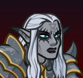
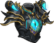
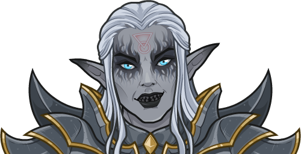
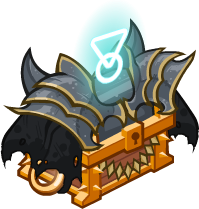

[Back to Main](index.md)

# BBEG

BBEG is the Big Bad Evil Guy brought to life by Pat, the DM of the Awful Ones. This drow necromancer believes immaculate planning will always lead to success, but his constant failures contradict this conviction. BBEG likes to monologue and taunt his opponents, leaving his summoned zombies to engage directly in combat.

# Basic Information

BBEG will be the new champion in the Dragondown event on 7 June 2023.

* Seat: 3
* Race: Elf (Drow)
* Class: Wizard
* Roles: Support / Speed
* Age: 500
* Gender: Male
* Alignment: Lawful Evil

| Stat | Value | Day 1 Trials | Patrons |
|---|---|---|---|
| Strength | 10 | Yes | Mirt |
| Dexterity | 13 | Yes | - |
| Constitution | 8 | - | Strahd |
| Intelligence | 18 | Yes | Zariel (with Feat) |
| Wisdom | 15 | Yes | |
| Charisma | 12 | Yes | |
| Total | 76 | |

# Formation

# Abilities

 **Base Attack: Chill Touch** (Magic)
> BBEG conjures a spectral hand over the enemy with the most health and touches it, dealing one hit.

<em>Raw Data</em>

<pre>
{
    "description": "BBEG conjures a spectral hand over the enemy with the most health and touches it, dealing one hit.",
    "long_description": "",
    "damage_modifier": 1,
    "damage_types": ["magic"],
    "graphic_id": 0,
    "target": "highest_health",
    "aoe_radius": 0,
    "tags": ["ranged"],
    "num_targets": 1,
    "animations": [{
        "projectile_details": {"target_offset_y": -60},
        "hit_sound": 133,
        "shoot_sound": 149,
        "type": "ranged_attack",
        "projectile": "bbeg_chill_touch",
        "shoot_frame": 21
    }],
    "name": "Chill Touch",
    "cooldown": 5,
    "id": 638
}
</pre>

 

 **Ultimate Attack: Balgronuuth's Undead Horde** (Level: 250)
> Balgronuuth's symbol appears in the air for 30 seconds. While the symbol is in the air, every time Rise, My Minions! summons a zombie, it summons two instead of one.

<em>Raw Data</em>

<pre>
{
    "description": "Balgronuuth's symbol appears in the air for 30 seconds, causing Rise, My Minions! to summon two zombies instead of one.",
    "long_description": "Balgronuuth's symbol appears in the air for 30 seconds. While the symbol is in the air, every time Rise, My Minions! summons a zombie, it summons two instead of one.",
    "damage_modifier": 0,
    "damage_types": ["magic"],
    "graphic_id": 19515,
    "target": "none",
    "aoe_radius": 0,
    "tags": [
        "ranged",
        "ultimate"
    ],
    "num_targets": 0,
    "animations": [{
        "symbol_duration": 30,
        "ultimate": "bbeg",
        "type": "ultimate_attack",
        "no_damage_display": true
    }],
    "name": "Balgronuuth's Undead Horde",
    "cooldown": 360,
    "id": 639
}
</pre>

 

**Awful Nemesis** (Level: 0)
> As the sworn enemy of the Awful Ones, BBEG is eligible for any adventure that any of them are eligible for. However, they still don't remember who he is.

<em>Raw Data</em>

<pre>
Upgrades:
    None

{
    "static_dps_mult": null,
    "required_level": 0,
    "effect": "effect_def,1538",
    "name": "Awful Nemesis",
    "id": 11538,
    "hero_id": 125,
    "upgrade_type": "unlock_ability",
    "default_enabled": 1,
    "required_upgrade_id": 0
}
{
    "effect_keys": [{"effect_string": "do_nothing"}],
    "requirements": "",
    "description": {"desc": "As the sworn enemy of the Awful Ones, $source is eligible for any adventure that any of them are eligible for. However, they still don't remember who he is."},
    "id": 1538,
    "flavour_text": "",
    "graphic_id": 0,
    "properties": {
        "is_formation_ability": true,
        "owner_use_outgoing_description": true,
        "formation_circle_icon": false
    }
}
</pre>

 

 **Evil Overlord** (Level: 20)
> BBEG increases the damage of all Champions with an Intelligence of 12 or less by 100%.

<em>Raw Data</em>

<pre>
Upgrades:
    17x 100%

    Total Upgrade Bonus: 1.31e07%

{
    "static_dps_mult": null,
    "required_level": 20,
    "effect": "effect_def,1539",
    "tip_text": "BBEG increases the damage of all Champions with an INT score of 12 or less.",
    "name": "Evil Overlord",
    "id": 11539,
    "hero_id": 125,
    "upgrade_type": "unlock_ability",
    "default_enabled": 1,
    "required_upgrade_id": 0
}
{
    "effect_keys": [{
        "formation_arrows_for_effected_only": true,
        "off_when_benched": true,
        "effect_string": "hero_dps_multiplier_mult,100",
        "targets": [{
            "stat": "int",
            "comparison": "<=",
            "type": "stat",
            "value": 12
        }]
    }],
    "requirements": "",
    "description": {"desc": "$source increases the damage of all Champions with an Intelligence of 12 or less by $(amount)%."},
    "id": 1539,
    "flavour_text": "",
    "graphic_id": 19507,
    "properties": {"is_formation_ability": true}
}
</pre>

 

 **Homebrew** (Level: 100)
> BBEG increases the damage bonus of Evil Overlord by 100% for each active potion, stacking multiplicatively.

<em>Raw Data</em>

<pre>
Upgrades:
    8x 100%

    Total Upgrade Bonus: 2.55e04%

{
    "static_dps_mult": null,
    "required_level": 100,
    "effect": "effect_def,1540",
    "name": "Homebrew",
    "id": 11540,
    "hero_id": 125,
    "upgrade_type": "unlock_ability",
    "default_enabled": 1,
    "required_upgrade_id": 0
}
{
    "effect_keys": [{
        "stack_title": "Active Potions",
        "amount_updated_listeners": [
            "slot_changed",
            "active_potions_changed"
        ],
        "stacks_multiply": true,
        "show_bonus": true,
        "amount_func": "mult",
        "stack_func": "per_active_potion",
        "effect_string": "buff_upgrade,100,11539"
    }],
    "requirements": "",
    "description": {"desc": "$source increases the damage bonus of $(upgrade_name id) by $(not_buffed amount)% for each active potion, stacking multiplicatively."},
    "id": 1540,
    "flavour_text": "",
    "graphic_id": 19508,
    "properties": {
        "is_formation_ability": true,
        "owner_use_outgoing_description": true
    }
}
</pre>

 

 **Rise, My Minions!** (Level: 200)
> Every 10 seconds BBEG creates a plodding zombie that appears in front of the party and slowly plods forward. Zombies persist with area changes. Enemies near the zombie take 0.2 seconds worth of BUD damage per second.
>  
> - Current Summon Speed: 10 seconds

<em>Raw Data</em>

<pre>
Upgrades:
    None

{
    "static_dps_mult": null,
    "required_level": 200,
    "effect": "effect_def,1541",
    "name": "Rise, My Minions!",
    "id": 11541,
    "hero_id": 125,
    "upgrade_type": "unlock_ability",
    "default_enabled": 1,
    "required_upgrade_id": 0
}
{
    "effect_keys": [
        {
            "tickrate": 1,
            "off_when_benched": true,
            "effect_string": "bbeg_rise_my_minions,0.2",
            "spawn_rate": 10
        },
        {
            "skin_property_prefix": "summon_overlay",
            "effect_string": "animation_synced_overlay,19469",
            "apply_manually": true
        }
    ],
    "requirements": "",
    "description": {
        "post": {"conditions": [{
            "condition": "not static_desc",
            "desc": "^^Current Summon Speed: $(bbeg_buffed_minion_spawn_rate) seconds"
        }]},
        "desc": "Every $(spawn_rate) seconds $source creates a plodding zombie that appears in front of the party and slowly plods forward. Zombies persist with area changes. Enemies near the zombie take $(amount) seconds worth of BUD damage per second."
    },
    "id": 1541,
    "flavour_text": "",
    "graphic_id": 19510,
    "properties": {
        "indexed_effect_properties": true,
        "retain_on_slot_changed": true,
        "is_formation_ability": true,
        "default_bonus_index": 0,
        "owner_use_outgoing_description": true,
        "per_effect_index_bonuses": true
    }
}
</pre>

 

 **Sources of Corpses** (Level: 300)
> The time it takes for Rise, My Minions! to summon a zombie is reduced by 2.5 seconds for each Awful Ones affiliation member in the formation, and the damage bonus of Evil Overlord is increased by 100% for each summoned zombie, stacking multiplicatively, with buffs applying to the pre-stack value.

<em>Raw Data</em>

<pre>
Upgrades:
    None

{
    "static_dps_mult": null,
    "required_level": 300,
    "effect": "effect_def,1542",
    "name": "Sources of Corpses",
    "id": 11542,
    "hero_id": 125,
    "upgrade_type": "unlock_ability",
    "default_enabled": 1,
    "required_upgrade_id": 0
}
{
    "effect_keys": [
        {"effect_string": "buff_pre_stack_amount,100"},
        {
            "amount_expr": "upgrade_amount(11542,0)",
            "stack_title": "Active Zombies",
            "amount_updated_listeners": ["bbeg_zombie_count_changed"],
            "stacks_multiply": true,
            "show_bonus": true,
            "amount_func": "mult",
            "stack_func": "per_bbeg_zombie",
            "effect_string": "buff_upgrade,0,11539",
            "desc_forced_order": 1
        },
        {
            "amount_updated_listeners": ["slot_changed"],
            "stacks_multiply": false,
            "total_title": "Speed Change",
            "bonus_is_seconds": true,
            "amount_func": "add",
            "stack_func": "per_crusader",
            "effect_string": "bbeg_minion_spawn_rate_reduction,2.5",
            "stack_title": "Awful Ones Champions",
            "show_bonus": true,
            "percent_values": false,
            "stack_func_data": {"tag": "awfulones"},
            "desc_forced_order": 0,
            "total_bonus_amount_prefix": "-"
        }
    ],
    "requirements": "",
    "description": {"desc": "The time it takes for Rise, My Minions! to summon a zombie is reduced by $(amount___3) seconds for each Awful Ones affiliation member in the formation, and the damage bonus of $(upgrade_name id___2) is increased by $(amount)% for each summoned zombie, stacking multiplicatively, with buffs applying to the pre-stack value."},
    "id": 1542,
    "flavour_text": "",
    "graphic_id": 19511,
    "properties": {
        "indexed_effect_properties": true,
        "is_formation_ability": true,
        "default_bonus_index": 0,
        "owner_use_outgoing_description": true,
        "per_effect_index_bonuses": true
    }
}
</pre>

 

 **Railroad** (Level: 370)
> If the current area is completed in 5s or less, BBEG reduces the next area's quest requirements by 25%.
>  
> - Time Remaining: 5

<em>Raw Data</em>

<pre>
Upgrades:
    None

{
    "static_dps_mult": null,
    "required_level": 370,
    "effect": "effect_def,1543",
    "tip_text": "BBEG reduces the next area quest requirements if you are completing areas quickly.",
    "name": "Railroad",
    "id": 11543,
    "hero_id": 125,
    "upgrade_type": "unlock_ability",
    "default_enabled": 1,
    "required_upgrade_id": 0
}
{
    "effect_keys": [
        {
            "off_when_benched": true,
            "effect_string": "bbeg_railroad,5"
        },
        {
            "off_when_benched": true,
            "effect_string": "chance_reduce_quest_requirement,25,100",
            "apply_manually": true
        }
    ],
    "requirements": "",
    "description": {
        "post": {"conditions": [{
            "condition": "not static_desc",
            "desc": "^^Time Remaining: $(bbeg_railroad_seconds_left)"
        }]},
        "desc": "If the current area is completed in $(seconds_plural amount) or less, $source reduces the next area's quest requirements by $(amount___2)%."
    },
    "id": 1543,
    "flavour_text": "",
    "graphic_id": 19509,
    "properties": {
        "indexed_effect_properties": true,
        "retain_on_slot_changed": true,
        "is_formation_ability": true,
        "default_bonus_index": 1,
        "owner_use_outgoing_description": true,
        "type": "not_buffable_by_nrakk",
        "per_effect_index_bonuses": true
    }
}
</pre>

 

# Specialisations

 **Min-Maxing** (Level: 150)
> BBEG increases the damage bonus of Evil Overlord by 150% for each Champion with a total ability score of 78 or less in the formation, stacking multiplicatively and applied multiplicatively.

<em>Raw Data</em>

<pre>
Upgrades:
    None

{
    "static_dps_mult": null,
    "specialization_name": "Min-Maxing",
    "required_level": 150,
    "effect": "effect_def,1545",
    "name": "Min-Maxing",
    "specialization_graphic_id": 19512,
    "id": 11545,
    "hero_id": 125,
    "upgrade_type": "unlock_ability",
    "default_enabled": 1,
    "required_upgrade_id": 0,
    "specialization_description": "BBEG powers his evil empire with bumbling minions"
}
{
    "effect_keys": [{
        "stack_title": "Qualified Champions",
        "amount_updated_listeners": [
            "slot_changed",
            "feat_changed"
        ],
        "show_bonus": true,
        "amount_func": "mult",
        "stack_func": "per_crusader",
        "effect_string": "buff_upgrade,150,11539",
        "stack_func_data": {"target_filters": [{
            "stat": "total_ability_score",
            "comparison": "<=",
            "type": "stat",
            "value": 78
        }]}
    }],
    "requirements": "",
    "description": {"desc": "$source increases the damage bonus of $(upgrade_name id) by $(not_buffed amount)% for each Champion with a total ability score of 78 or less in the formation, stacking multiplicatively and applied multiplicatively."},
    "id": 1545,
    "flavour_text": "",
    "graphic_id": 0,
    "properties": {
        "is_formation_ability": true,
        "spec_option_post_apply_info": "Qualified Champions: $num_stacks",
        "owner_use_outgoing_description": true,
        "type": "upgrade",
        "formation_circle_icon": false
    }
}
</pre>

 

 **Powergaming** (Level: 150)
> BBEG increases the damage bonus of Evil Overlord by 200% for each Evil Champion in the formation, stacking multiplicatively and applied multiplicatively.

<em>Raw Data</em>

<pre>
Upgrades:
    None

{
    "static_dps_mult": null,
    "specialization_name": "Powergaming",
    "required_level": 150,
    "effect": "effect_def,1544",
    "name": "Powergaming",
    "specialization_graphic_id": 19513,
    "id": 11544,
    "hero_id": 125,
    "upgrade_type": "unlock_ability",
    "default_enabled": 1,
    "required_upgrade_id": 0,
    "specialization_description": "BBEG powers his evil empire with Evil minions"
}
{
    "effect_keys": [{
        "stacks_multiply": true,
        "off_when_benched": true,
        "effect_string": "buff_upgrade_per_any_tagged_crusader_mult,200,11539,evil"
    }],
    "requirements": "",
    "description": {"desc": "$source increases the damage bonus of $(upgrade_name id) by $(not_buffed amount)% for each Evil Champion in the formation, stacking multiplicatively and applied multiplicatively."},
    "id": 1544,
    "flavour_text": "",
    "graphic_id": 0,
    "properties": {
        "is_formation_ability": true,
        "spec_option_post_apply_info": "Evil Champions: $num_stacks",
        "owner_use_outgoing_description": true,
        "type": "upgrade",
        "formation_circle_icon": false
    }
}
</pre>

 

 **Rules Lawyering** (Level: 150)
> BBEG increases the damage bonus of Evil Overlord by 100% for each Lawful Champion in the formation, stacking multiplicatively and applied multiplicatively.

<em>Raw Data</em>

<pre>
Upgrades:
    None

{
    "static_dps_mult": null,
    "specialization_name": "Rules Lawyering",
    "required_level": 150,
    "effect": "effect_def,1546",
    "name": "Rules Lawyering",
    "specialization_graphic_id": 19514,
    "id": 11546,
    "hero_id": 125,
    "upgrade_type": "unlock_ability",
    "default_enabled": 1,
    "required_upgrade_id": 0,
    "specialization_description": "BBEG powers his evil empire with Lawful minions"
}
{
    "effect_keys": [{
        "stacks_multiply": true,
        "off_when_benched": true,
        "effect_string": "buff_upgrade_per_any_tagged_crusader_mult,100,11539,lawful"
    }],
    "requirements": "",
    "description": {"desc": "$source increases the damage bonus of $(upgrade_name id) by $(not_buffed amount)% for each Lawful Champion in the formation, stacking multiplicatively and applied multiplicatively."},
    "id": 1546,
    "flavour_text": "",
    "graphic_id": 0,
    "properties": {
        "is_formation_ability": true,
        "spec_option_post_apply_info": "Lawful Champions: $num_stacks",
        "owner_use_outgoing_description": true,
        "type": "upgrade",
        "formation_circle_icon": false
    }
}
</pre>

 

# Items

| Icon | Slot | Epic Name | Type |
|:-:|---|---|---|
|  | 1 | `Deathfrost` | Evil Overlord |
|  | 2 | `Barrier of Meta Protection` | Homebrew |
|  | 3 | `Zarxox, Undead General` | Rise, My Minions! |
|  | 4 | `Omniscient Tome` | Sources of Corpses |
|  | 5 | `Die of 1 for All` | All Specialisations |
|  | 6 | `Armor of the Plot` | Ultimate Cooldown Reduction |

<em>Item Names and Descriptions</em>

<pre>
Slot 1:
             Ritual Athame: This was the dagger he used to start his journey of evil.
            Stained Dagger: The blood that stains this dagger imbues it with evil magic.
          Necrotic Cleaver: 'This blade has killed many innocents,' he says with an evil laugh.
                Deathfrost: You see a sword glowing with evil runes and a skull crossguard.
                            It's badass.

Slot 2:
           Borrowed Screen: Yeah, I guess I could give this DM thing a try.
            Updated Screen: This is full of sticky notes now.
             Hand Made Kit: I actually made this all by myself. Yes, that is tape painted to
                            look like wood.
Barrier of Meta Protection: It has tiny catapults to throw things at players when they sneak a
                            peek.

Slot 3:
            Annoying Skull: He didn't always have an undead army. He started with just a
                            talking skull.
            Undead Advisor: One day the skull began talking about Balgronuuth, and he listened
                            intently.
           Skeletal Herald: 'My master will usher in the reign of Balgronuuth!' The herald
                            begins to glow.
    Zarxox, Undead General: 'You should serve my master,' says the general. 'Great dental plan
                            for biting.'

Slot 4:
              Old Notebook: I just had this laying around. It'll do the job.
             Story Journal: Don't touch! This has all my brilliant ideas in it - they're
                            secret!
          Book from E'tsyy: Look, I didn't know how to bind a book and this one was the coolest
                            online.
           Omniscient Tome: 'With this tome I will finally release Balgronuuth and destroy this
                            realm!'

Slot 5:
           Starter Kit Die: Oh, it comes with dice. These will do until I get some nice ones.
                  DM's Die: DO NOT TOUCH THIS D20! YOU'LL JUST CURSE IT!
                 Metal D20: Wow, these edges are pretty sharp...
          Die of 1 for All: Oh, here Eva, you can use my D20 for the save.

Slot 6:
           Backstory Plate: This was his brother's. The players don't need to know he killed
                            his brother.
   Inconspicuous NPC Armor: No, no, he's just a normal NPC that needs to be escorted somewhere.
     Not-the-Villain Plate: I totally never, ever, expected this NPC to be part of the story -
                            nope.
         Armor of the Plot: HOW MUCH DAMAGE?! I mean, haha! He has immunity to that type of
                            damage!
</pre>

 

# Feats

This list will only show feats that are going to be available on the release of this champion. The separate [Feats](feats.md) page may show others that could be available later if they exist.

| Icon | Feat | Effect | Source |
|---|---|---|---|
|  | `Selflessness` | 10% All Champion Damage | Free |
|  | `Inspiring Leader` | 25% All Champion Damage | 12,500 Gems |
|  | `Recruitment` | 20% Evil Overlord | Free |
|  | `Derailed Campaign` | 40% Evil Overlord | Gold Chest |
|  | `Balgronuuth's Pact` | 20% Homebrew | Free |
|  | `We Brought Snacks` | 40% Homebrew | Gold Chest |
|  | `Improved Summoning` | 40% Rise, My Minions! | 12,500 Gems |
|  | `Skipping Ahead` | 100% Railroad | 50,000 Gems |
|  | `Evil Plan Completed` | 40% All Specialisations | Gold Chest |
|  | `Motivational Monologue` | Stat: +1 Charisma | Gold Chest |

# Legendaries

* Increases the damage of all Champions by 10% for each Champion in the formation.
* Increases the damage of all Female Champions by 125%.
* Increases the damage of all Elf Champions by 150%.
* Increases the damage of all Champions with a WIS score of 11 or higher by 100%.
* Increases the damage of all Champions by 40% for each Champion with a WIS score of 15 or higher in the formation.
* Increases the damage of all Lawful Champions by 150%.

<em>DPS Applicable</em>

<pre>
     Arkhan: 3 / 6
    Asharra: 5 / 6
      Azaka: 4 / 6
   Birdsong: 5 / 6
Black Viper: 4 / 6
 Catti-brie: 4 / 6
     D'hani: 4 / 6
     Delina: 5 / 6
    Dhadius: 2 / 6
     Drizzt: 5 / 6
    Farideh: 4 / 6
        Fen: 5 / 6
      Grimm: 2 / 6
       Ishi: 4 / 6
    Jaheira: 4 / 6
    Jamilah: 4 / 6
   Jarlaxle: 4 / 6
        Jim: 3 / 6
       Kent: 2 / 6
      Krond: 3 / 6
     Lucius: 5 / 6
      Makos: 2 / 6
      Minsc: 2 / 6
      NERDS: 3 / 6
      Nixie: 3 / 6
      Nrakk: 4 / 6
     Orisha: 4 / 6
   Prudence: 4 / 6
      Rosie: 4 / 6
      Strix: 4 / 6
    Torogar: 3 / 6
     Warden: 3 / 6
    Warduke: 3 / 6
     Yorven: 3 / 6
      Zorbu: 3 / 6
</pre>

 

# Console Portrait

# Chests

| Gold | Silver |
|---|---|
|  |  |

[Back to Top](#top)

*Last Modified: {{ site.time }}*