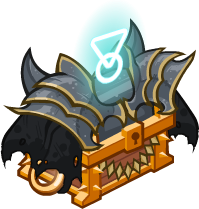
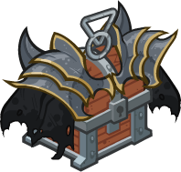

[Back to Main](index.md)

# BBEG

This is Big Bad Evil Guy from the 1 for All sketch show of the same name.

# Basic Information

BBEG will be the new champion in the Dragondown event on 7 June 2023.

* Seat: Unknown
* Race: Drow Elf (Guess)
* Class: Wizard (Guess)
* Roles: Unknown
* Age: Unknown
* Gender: Male (Guess)
* Alignment: Unknown
* Affiliation: Awful Ones (Guess)
* Stats: Unknown

# Formation

Unknown.




# Abilities

**Base Attack: Chill Touch** (Guess)
> Unknown effect.

<em>Raw Data</em>

<pre>
{
    "p": 0,
    "v": 2,
    "id": 19596,
    "export_params": {"uses": ["effect"]},
    "type": 1,
    "graphic": "Effects/Effect_ChillTouch_BBEG",
    "fs": 0
}
</pre>

 

**Ultimate Attack: Balgronuuths Undead Horde**
> Unknown effect.

<em>Raw Data</em>

<pre>
{
    "p": 0,
    "v": 2,
    "id": 19515,
    "export_params": {"uses": ["icon"]},
    "type": 1,
    "graphic": "Icons/Events/2018 Dragondown/Dragondown_Y6/Icon_Ultimate_BBEGBalgronuuthsUndeadHorde",
    "fs": 0
}
</pre>

 

**Homebrew**
> Unknown effect.

<em>Raw Data</em>

<pre>
{
    "p": 0,
    "v": 2,
    "id": 19503,
    "export_params": {"uses": ["icon"]},
    "type": 1,
    "graphic": "Icons/Events/2018 Dragondown/Dragondown_Y6/Icon_FormationLarge_BBEGHomebrew",
    "fs": 0
}
</pre>

 

**Railroad**
> Unknown effect.

<em>Raw Data</em>

<pre>
{
    "p": 0,
    "v": 2,
    "id": 19504,
    "export_params": {"uses": ["icon"]},
    "type": 1,
    "graphic": "Icons/Events/2018 Dragondown/Dragondown_Y6/Icon_FormationLarge_BBEGRailroad",
    "fs": 0
}
</pre>

 

**Rise My Minions**
> Unknown effect.

<em>Raw Data</em>

<pre>
{
    "p": 0,
    "v": 2,
    "id": 19505,
    "export_params": {"uses": ["icon"]},
    "type": 1,
    "graphic": "Icons/Events/2018 Dragondown/Dragondown_Y6/Icon_FormationLarge_BBEGRiseMyMinions",
    "fs": 0
}
</pre>

 

**Sources of Corpses**
> Unknown effect.

<em>Raw Data</em>

<pre>
{
    "p": 0,
    "v": 2,
    "id": 19506,
    "export_params": {"uses": ["icon"]},
    "type": 1,
    "graphic": "Icons/Events/2018 Dragondown/Dragondown_Y6/Icon_FormationLarge_BBEGSourcesofCorpses",
    "fs": 0
}
</pre>

 

**Evil Overlord**
> Unknown effect.

<em>Raw Data</em>

<pre>
{
    "p": 0,
    "v": 2,
    "id": 19507,
    "export_params": {"uses": ["icon"]},
    "type": 1,
    "graphic": "Icons/Events/2018 Dragondown/Dragondown_Y6/Icon_Formation_BBEGEvilOverlord",
    "fs": 0
}
</pre>

 

# Specialisations

**Specialisation: Min Maxing**
> Unknown effect.

<em>Raw Data</em>

<pre>
{
    "p": 0,
    "v": 2,
    "id": 19512,
    "export_params": {"uses": ["icon"]},
    "type": 1,
    "graphic": "Icons/Events/2018 Dragondown/Dragondown_Y6/Icon_Specialization_BBEGMinMaxing",
    "fs": 0
}
</pre>

 

**Specialisation: Powergaming**
> Unknown effect.

<em>Raw Data</em>

<pre>
{
    "p": 0,
    "v": 2,
    "id": 19513,
    "export_params": {"uses": ["icon"]},
    "type": 1,
    "graphic": "Icons/Events/2018 Dragondown/Dragondown_Y6/Icon_Specialization_BBEGPowergaming",
    "fs": 0
}
</pre>

 

**Specialisation: Rules Lawyering**
> Unknown effect.

<em>Raw Data</em>

<pre>
{
    "p": 0,
    "v": 2,
    "id": 19514,
    "export_params": {"uses": ["icon"]},
    "type": 1,
    "graphic": "Icons/Events/2018 Dragondown/Dragondown_Y6/Icon_Specialization_BBEGRulesLawyering",
    "fs": 0
}
</pre>

 

# Items

| Slot | Name | Type |
|---|---|---|
| 1 | `Armor` | Unknown |
| 2 | `Book` | Unknown |
| 3 | `Dice` | Unknown |
| 4 | `DM Screen` | Unknown |
| 5 | `Weapon` | Unknown |
| 6 | `Zombie Minions` | Unknown |

# Feats

Unknown.

# Legendaries

Unknown.

# Console Portrait


# Chests

| Gold | Silver |
|---|---|
|  |  |


[Back to Top](#top)

*Last Modified: {{ site.time }}*