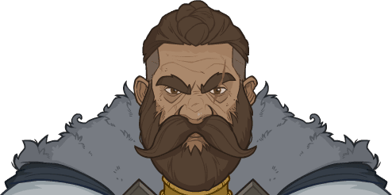

[Back to Main](index.md)

    
        
            
        
        
        Portrait
        
    

# Beadle

# Basic Information

Beadle will be a new champion in the Festival of Fools event on 09 April 2025 (guesstimated a week after event start potentially due to the Worst the Wait event augment).

    
        
            **Seat**:
        
        
            Unknown
        
    
    
        
            **Species**:
        
        
            Dwarf (Guess)
        
    
    
        
            **Class**:
        
        
            Rogue / Wizard (Guess)
        
    
    
        
            **Roles**:
        
        
            Unknown
        
    
    
        
            **Age**:
        
        
            91 (Guess)
        
    
    
        
            **Gender**:
        
        
            Male (Guess)
        
    
    
        
            **Alignment**:
        
        
            Neutral (Guess)
        
    
    
        
            **Affiliation**:
        
        
            Unknown
        
    

# Formation

Unknown.


    



# Attacks

**Ultimate Attack: Arcane Blast**
> Beadle teleports into the center of the battlefield and blasts all enemies with arcane magic, dealing ultimate damage and stunning them for 5 seconds.  
> Cooldown: 300s (Cap 75s)

<em>Raw Data</em>

<pre>
{
    "id": 840,
    "name": "Arcane Strike",
    "description": "Beadle teleports into the center of the battlefield and blasts all enemies with arcane magic, dealing ultimate damage and stunning them for 5 seconds.",
    "long_description": "",
    "graphic_id": 8181,
    "target": "all",
    "num_targets": 0,
    "aoe_radius": 0,
    "damage_modifier": 0.03,
    "cooldown": 300,
    "animations": [
        {
            "type": "beadle_ultimate",
            "damage_frame": 8,
            "right_blast_offset_x": 40,
            "left_blast_offset_x": -40,
            "blast_offset_y": -40,
            "arcane_blast": {
                "graphic_id": 7699,
                "move_speed": 500,
                "max_scale": 2,
                "min_scale": 0.2,
                "min_scale_distance": 500
            },
            "hit_effect": "stun,5,none,0,1509"
        }
    ],
    "tags": [
        "ultimate"
    ],
    "damage_types": [
        "magic"
    ]
}
</pre>

# Abilities

**Unknown** (Guess)
> Beadle & Grimm are so inseparable that if either one qualifies for an adventure restriction based on their tags, ages, ability scores, etc., then both can be used.

<em>Raw Data</em>

<pre>
{
    "id": 2240,
    "flavour_text": "",
    "description": {
        "desc": "Beadle & Grimm are so inseparable that if either one qualifies for an adventure restriction based on their tags, ages, ability scores, etc., then both can be used."
    },
    "effect_keys": [
        {
            "effect_string": "do_nothing"
        }
    ],
    "requirements": "",
    "graphic_id": 0,
    "large_graphic_id": 0,
    "properties": []
}
</pre>

**Unknown** (Guess)
> Beadle increases the damage of Champions within 2 slots of himself by 100%, and enemies that hit targets affected by this have a 20% chance to miss.

<em>Raw Data</em>

<pre>
{
    "id": 2241,
    "flavour_text": "",
    "description": {
        "desc": "Beadle increases the damage of Champions within 2 slots of himself by 100%, and enemies that hit targets affected by this have a 20% chance to miss."
    },
    "effect_keys": [
        {
            "effect_string": "hero_dps_multiplier_mult,100",
            "targets": [
                {
                    "type": "distance",
                    "distance": 2
                }
            ]
        },
        {
            "effect_string": "evade_damage_change,20",
            "targets": [
                {
                    "type": "distance",
                    "distance": 2
                }
            ],
            "filter_targets": [
                {
                    "type": "hero_expr",
                    "hero_expr": "hero_id != 108"
                }
            ]
        }
    ],
    "requirements": "",
    "graphic_id": 8183,
    "large_graphic_id": 8188,
    "properties": []
}
</pre>

**Unknown** (Guess)
> Whenever Beadle attacks an enemy he causes it to immediately drop 20% of the gold it would award on death. The enemy then stops and checks its pockets, stunning it for 2 seconds. This can only occur to each enemy 5 times.

<em>Raw Data</em>

<pre>
{
    "id": 2242,
    "flavour_text": "",
    "description": {
        "desc": "Whenever Beadle attacks an enemy he causes it to immediately drop 20% of the gold it would award on death. The enemy then stops and checks its pockets, stunning it for 2 seconds. This can only occur to each enemy 5 times."
    },
    "effect_keys": [
        {
            "effect_string": "beadle_sticky_fingers",
            "graphic": 0
        },
        {
            "effect_string": "add_attack_stun,100,2,1509,304"
        }
    ],
    "requirements": "",
    "graphic_id": 0,
    "large_graphic_id": 0,
    "properties": []
}
</pre>

**Unknown** (Guess)
> Most positional formation abilities that affect Beadle also affect Grimm if he is in the formation. If Grimm is already affected by the same ability, Beadle instead increases the effect of In The Shadows by 400%.

<em>Raw Data</em>

<pre>
{
    "id": 2243,
    "flavour_text": "",
    "description": {
        "desc": "Most positional formation abilities that affect Beadle also affect Grimm if he is in the formation. If Grimm is already affected by the same ability, Beadle instead increases the effect of In The Shadows by 400%."
    },
    "effect_keys": [
        {
            "effect_string": "beadle_share_the_glory",
            "hero_id": 64
        }
    ],
    "requirements": "",
    "graphic_id": 0,
    "large_graphic_id": 0,
    "properties": []
}
</pre>

# Specialisations

Unknown.

# Items

Unknown.

# Feats

Unknown.

# Legendaries

Unknown.

# Adventures and Variants

**Unlock Adventure: The Missing Lord (Beadle & Grimm)** (Complete Area 50)
> Search for the absent Open Lord of Waterdeep.

 **Variant 1: Arvaiss' Next Trap** (Complete Area 75)
> Various creatures attack your formation, each with different abilities. See the buff icon for details.

 **Variant 2: Showoffs** (Complete Area 125)
> Beadle & Grimm take up a slot in your formation. Only Champions with a STR of 18 or higher, DEX of 17 or higher, or INT of 16 or higher can be used.

 **Variant 3: A Contest, You Say?** (Complete Area 175)
> Enemies have 300% more health and attack twice as often. When a Champion kills an enemy, all Champions with that same attack type (melee, ranged, or magic) deal 2% less damage, and all Champions with other attack types deal 1% more damage.

# Other Champion Images

    
        
            Console Portrait
        
    

[Back to Top](#top)

*Last Modified: {{ site.time }}*