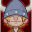
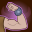

[Back to Main](index.md)

    
        Portrait
    
    
        Model
    

# Bobby

Bobby is the youngest of the group that was transported to the magical world of Dungeons & Dragons. As a brave and loyal Barbarian, he wields a powerful magical club that enhances his strength. Bobby has close ties to his sister Sheila and his pet unicorn, Uni. Despite his impulsiveness, Bobby's courage and determination are key assets in the search to find the way back home.

# Basic Information

Bobby will be a new champion in the Highharvestide event on 4 September 2024.

    
        
            **Seat**:
        
        
            12
        
        
            **Stat**
        
        
            **Value**
        
        
            **Day 1 Trials**
        
        
            **Patrons**
        
    
    
        
            **Race**:
        
        
            Human
        
        
            **Strength**:
        
        
            18
        
        
            Yes
        
        
            Mirt
        
    
    
        
            **Class**:
        
        
            Barbarian
        
        
            **Dexterity**:
        
        
            15
        
        
            Yes
        
        
            -
        
    
    
        
            **Roles**:
        
        
            DPS / Support
        
        
            **Constitution**:
        
        
            12
        
        
            Yes
        
        
            -
        
    
    
        
            **Age**:
        
        
            8
        
        
            **Intelligence**:
        
        
            9
        
        
            -
        
        
            -
        
    
    
        
            **Gender**:
        
        
            Male
        
        
            **Wisdom**:
        
        
            8
        
        
            -
        
        
            Elminster
        
    
    
        
            **Alignment**:
        
        
            Chaotic Good
        
        
            **Charisma**:
        
        
            10
        
        
            -
        
        
            &nbsp;
        
    
    
        
            **Affiliation**:
        
        
            Saturday Morning Squad
        
        
            **Total**:
        
        
            72
        
        
            Champion ID:
        
        
            152
        
    

# Formation

    <svg xmlns="http://www.w3.org/2000/svg" id="Bobby" fill="#aaa" data-formationName="Bobby" data-campaignName="Highharvestide" width="359" height="140"><circle cx="215" cy="25" r="15"/><circle cx="215" cy="65" r="15"/><circle cx="215" cy="105" r="15"/><circle cx="175" cy="45" r="15"/><circle cx="175" cy="85" r="15"/><circle cx="135" cy="65" r="15"/><circle cx="135" cy="105" r="15"/><circle cx="95" cy="85" r="15"/><circle cx="55" cy="105" r="15"/><circle cx="15" cy="125" r="15"/><text x="245" y="25" fill="#dcdcdc" font-size="25" font-family="Arial" font-weight="bold">Bobby</text><text x="245" y="65" fill="#dcdcdc" font-size="15" font-family="Arial" font-weight="bold">Highharvestide</text></svg>

# Attacks

 **Base Attack: Thunder Club** (Melee)
> Bobby swings his club at the closest enemy.  
> Cooldown: 6s (Cap 1.5s)

<em>Raw Data</em>

<pre>
{
    "id": 791,
    "name": "Thunder Club",
    "description": "Bobby swings his club at the closest enemy.",
    "long_description": "",
    "graphic_id": 0,
    "target": "front",
    "num_targets": 1,
    "aoe_radius": 100,
    "damage_modifier": 1,
    "cooldown": 6,
    "animations": [
        {
            "type": "melee_attack",
            "damage_frame": 8,
            "target_offset_x": -40,
            "jump_sound": 30,
            "sound_frames": {
                "14": 154
            }
        }
    ],
    "tags": [
        "melee"
    ],
    "damage_types": [
        "melee"
    ]
}
</pre>

 **Ultimate Attack: Bobby-quake** (Level: 120)
> Bobby strikes the ground with his club, knocking all enemies up and back and stunning them for 5 seconds.  
> Cooldown: 320s (Cap 80s)

<em>Raw Data</em>

<pre>
{
    "id": 792,
    "name": "Bobby-quake",
    "description": "Bobby strikes the ground with his club, stunning and knocking back all enemies.",
    "long_description": "Bobby strikes the ground with his club, knocking all enemies up and back and stunning them for 5 seconds.",
    "graphic_id": 24409,
    "target": "front",
    "num_targets": 1,
    "aoe_radius": 0,
    "damage_modifier": 0.03,
    "cooldown": 320,
    "animations": [
        {
            "type": "ultimate_attack",
            "ultimate": "bobby",
            "knockback_effect": {
                "effect_string": "push_back_monster,10"
            }
        }
    ],
    "tags": [
        "melee",
        "ultimate"
    ],
    "damage_types": [
        "melee"
    ]
}
</pre>

# Abilities

**Critical Hit** (Level: 0)
> Bobby's base chance to Critical Hit is 20%.

<em>Raw Data</em>

<pre>
{
    "id": 15442,
    "hero_id": 152,
    "required_level": 0,
    "required_upgrade_id": 0,
    "upgrade_type": "unlock_ability",
    "effect": "effect_def,2051",
    "static_dps_mult": null,
    "default_enabled": 1,
    "name": "Critical Hit"
}
{
    "id": 2051,
    "flavour_text": "",
    "description": {
        "desc": "Bobby's base chance to Critical Hit is $(amount)%."
    },
    "effect_keys": [
        {
            "effect_string": "set_base_crit_chance,20"
        },
        {
            "effect_string": "expression_on_trigger,area_complete",
            "per_hero_expr": "hero_column==0 && hero_id == 152",
            "per_trigger_expr": "AppendToSaveStat(`bobby_danger_zone`, false, trigger_count * as_int(per_hero_count))",
            "skip_effect_key_desc": true
        }
    ],
    "requirements": "",
    "graphic_id": 0,
    "large_graphic_id": 0,
    "properties": {
        "is_formation_ability": true,
        "owner_use_outgoing_description": true,
        "formation_circle_icon": false
    }
}
</pre>

 **Charge Into Battle** (Level: 10)
> Bobby increases his damage by 100% for each column behind him, stacking multiplicatively.

ⓘ *Note: This ability is prestack.*

<em>Raw Data</em>

<pre>
{
    "id": 15443,
    "hero_id": 152,
    "required_level": 10,
    "required_upgrade_id": 0,
    "upgrade_type": "unlock_ability",
    "effect": "effect_def,2052",
    "static_dps_mult": null,
    "default_enabled": 1,
    "name": "Charge Into Battle"
}
{
    "id": 2052,
    "flavour_text": "",
    "description": {
        "desc": "Bobby increases his damage by $(amount)% for each column behind him, stacking multiplicatively."
    },
    "effect_keys": [
        {
            "effect_string": "pre_stack,100",
            "skip_effect_key_desc": true
        },
        {
            "effect_string": "hero_dps_multiplier_mult,0",
            "amount_expr": "upgrade_amount(15443,0)",
            "stacks_on_trigger": "on_columns_from,back",
            "stacks_multiply": true,
            "show_bonus": true,
            "stack_title": "Columns from the back",
            "off_when_benched": true
        }
    ],
    "requirements": "",
    "graphic_id": 24400,
    "large_graphic_id": 24396,
    "properties": {
        "is_formation_ability": true,
        "owner_use_outgoing_description": true,
        "formation_circle_icon": false,
        "indexed_effect_properties": true,
        "per_effect_index_bonuses": true,
        "default_bonus_index": 0
    }
}
</pre>

 **Uni, the Unicorn** (Level: 40)
> Uni takes her place next to Bobby. Uni increases the damage of Bobby and all other Champions next to her by 100%. If Uni is in Dungeon Master's formation slot, this is further increased by 400%.

<em>Upgrade Data</em>

<pre>
Upgrades:
      100: 100%
      150: 100%
      190: 100%
      240: 100%
      300: 100%
      360: 100%
      420: 100%
      500: 100%
      640: 100%
      770: 100%
      910: 100%
    1,050: 100%
    1,190: 100%
    1,320: 100%
    1,460: 100%
    1,590: 100%
    1,730: 100%
    1,870: 100%
    2,000: 100%
    2,140: 100%
    2,210: 100%

    Total Upgrade Bonus: 2.10e08%
</pre>

<em>Raw Data</em>

<pre>
{
    "id": 15444,
    "hero_id": 152,
    "required_level": 40,
    "required_upgrade_id": 0,
    "upgrade_type": "unlock_ability",
    "effect": "effect_def,2053",
    "static_dps_mult": null,
    "default_enabled": 1,
    "name": "Uni, the Unicorn",
    "tip_text": "Bobby's pet unicorn Uni supports all Champions that are next to her."
}
{
    "id": 2053,
    "flavour_text": "",
    "description": {
        "desc": "Uni takes her place next to Bobby. Uni increases the damage of Bobby and all other Champions next to her by $(amount___2)%. If Uni is in Dungeon Master's formation slot, this is further increased by $(amount___5)%."
    },
    "effect_keys": [
        {
            "effect_string": "bobby_uni_the_unicorn",
            "adjacent_buff_effect_index": 2,
            "dm_bonus_effect_indexes": [
                5,
                6
            ],
            "dm_hero_id": 99
        },
        {
            "effect_string": "pre_buff,100"
        },
        {
            "effect_string": "hero_dps_mult_bobby_uni,0",
            "amount_expr": "upgrade_amount(15444,1)",
            "targets": [
                "adj"
            ],
            "filter_targets": [
                {
                    "type": "exclude_heroes",
                    "hero_ids": [
                        152
                    ]
                }
            ],
            "skip_effect_key_desc": false,
            "show_bonus": true,
            "override_key_desc": "Increases the damage of $target by $amount%",
            "amount_updated_listeners": [
                "slot_changed",
                "area_changed"
            ]
        },
        {
            "effect_string": "hero_dps_mult_bobby_uni,0",
            "amount_expr": "upgrade_amount(15444,1)",
            "targets": [
                {
                    "type": "heroes",
                    "hero_ids": [
                        152
                    ]
                }
            ],
            "skip_effect_key_desc": true
        },
        {
            "effect_string": "dm_pre_buff,400"
        },
        {
            "effect_string": "buff_upgrade,0,15444,2",
            "amount_expr": "upgrade_amount(15444,4)",
            "apply_manually": true,
            "skip_effect_key_desc": true
        },
        {
            "effect_string": "buff_upgrade,0,15444,3",
            "amount_expr": "upgrade_amount(15444,4)",
            "apply_manually": true,
            "skip_effect_key_desc": true
        }
    ],
    "requirements": "",
    "graphic_id": 24403,
    "large_graphic_id": 24399,
    "properties": {
        "is_formation_ability": true,
        "owner_use_outgoing_description": true,
        "formation_circle_icon": true,
        "indexed_effect_properties": true,
        "per_effect_index_bonuses": true,
        "default_bonus_index": 0,
        "use_owner_override": true,
        "retain_on_slot_changed": true
    }
}
{
    "id": 15454,
    "hero_id": 152,
    "required_level": 100,
    "required_upgrade_id": 0,
    "upgrade_type": "upgrade_ability",
    "effect": "buff_upgrade,100,15444,1",
    "static_dps_mult": null,
    "default_enabled": 1,
    "name": ""
}
{
    "id": 15709,
    "hero_id": 152,
    "required_level": 150,
    "required_upgrade_id": 0,
    "upgrade_type": "upgrade_ability",
    "effect": "buff_upgrade,100,15444,1",
    "static_dps_mult": null,
    "default_enabled": 1,
    "name": ""
}
{
    "id": 15712,
    "hero_id": 152,
    "required_level": 190,
    "required_upgrade_id": 0,
    "upgrade_type": "upgrade_ability",
    "effect": "buff_upgrade,100,15444,1",
    "static_dps_mult": null,
    "default_enabled": 1,
    "name": ""
}
{
    "id": 15714,
    "hero_id": 152,
    "required_level": 240,
    "required_upgrade_id": 0,
    "upgrade_type": "upgrade_ability",
    "effect": "buff_upgrade,100,15444,1",
    "static_dps_mult": null,
    "default_enabled": 1,
    "name": ""
}
{
    "id": 15716,
    "hero_id": 152,
    "required_level": 300,
    "required_upgrade_id": 0,
    "upgrade_type": "upgrade_ability",
    "effect": "buff_upgrade,100,15444,1",
    "static_dps_mult": null,
    "default_enabled": 1,
    "name": ""
}
{
    "id": 15719,
    "hero_id": 152,
    "required_level": 360,
    "required_upgrade_id": 0,
    "upgrade_type": "upgrade_ability",
    "effect": "buff_upgrade,100,15444,1",
    "static_dps_mult": null,
    "default_enabled": 1,
    "name": ""
}
{
    "id": 15721,
    "hero_id": 152,
    "required_level": 420,
    "required_upgrade_id": 0,
    "upgrade_type": "upgrade_ability",
    "effect": "buff_upgrade,100,15444,1",
    "static_dps_mult": null,
    "default_enabled": 1,
    "name": ""
}
{
    "id": 15724,
    "hero_id": 152,
    "required_level": 500,
    "required_upgrade_id": 0,
    "upgrade_type": "upgrade_ability",
    "effect": "buff_upgrade,100,15444,1",
    "static_dps_mult": null,
    "default_enabled": 1,
    "name": ""
}
{
    "id": 15728,
    "hero_id": 152,
    "required_level": 640,
    "required_upgrade_id": 0,
    "upgrade_type": "upgrade_ability",
    "effect": "buff_upgrade,100,15444,1",
    "static_dps_mult": null,
    "default_enabled": 1,
    "name": ""
}
{
    "id": 15732,
    "hero_id": 152,
    "required_level": 770,
    "required_upgrade_id": 0,
    "upgrade_type": "upgrade_ability",
    "effect": "buff_upgrade,100,15444,1",
    "static_dps_mult": null,
    "default_enabled": 1,
    "name": ""
}
{
    "id": 15736,
    "hero_id": 152,
    "required_level": 910,
    "required_upgrade_id": 0,
    "upgrade_type": "upgrade_ability",
    "effect": "buff_upgrade,100,15444,1",
    "static_dps_mult": null,
    "default_enabled": 1,
    "name": ""
}
{
    "id": 15739,
    "hero_id": 152,
    "required_level": 1050,
    "required_upgrade_id": 0,
    "upgrade_type": "upgrade_ability",
    "effect": "buff_upgrade,100,15444,1",
    "static_dps_mult": null,
    "default_enabled": 1,
    "name": ""
}
{
    "id": 15742,
    "hero_id": 152,
    "required_level": 1190,
    "required_upgrade_id": 0,
    "upgrade_type": "upgrade_ability",
    "effect": "buff_upgrade,100,15444,1",
    "static_dps_mult": null,
    "default_enabled": 1,
    "name": ""
}
{
    "id": 15746,
    "hero_id": 152,
    "required_level": 1320,
    "required_upgrade_id": 0,
    "upgrade_type": "upgrade_ability",
    "effect": "buff_upgrade,100,15444,1",
    "static_dps_mult": null,
    "default_enabled": 1,
    "name": ""
}
{
    "id": 15748,
    "hero_id": 152,
    "required_level": 1460,
    "required_upgrade_id": 0,
    "upgrade_type": "upgrade_ability",
    "effect": "buff_upgrade,100,15444,1",
    "static_dps_mult": null,
    "default_enabled": 1,
    "name": ""
}
{
    "id": 15750,
    "hero_id": 152,
    "required_level": 1590,
    "required_upgrade_id": 0,
    "upgrade_type": "upgrade_ability",
    "effect": "buff_upgrade,100,15444,1",
    "static_dps_mult": null,
    "default_enabled": 1,
    "name": ""
}
{
    "id": 15753,
    "hero_id": 152,
    "required_level": 1730,
    "required_upgrade_id": 0,
    "upgrade_type": "upgrade_ability",
    "effect": "buff_upgrade,100,15444,1",
    "static_dps_mult": null,
    "default_enabled": 1,
    "name": ""
}
{
    "id": 15755,
    "hero_id": 152,
    "required_level": 1870,
    "required_upgrade_id": 0,
    "upgrade_type": "upgrade_ability",
    "effect": "buff_upgrade,100,15444,1",
    "static_dps_mult": null,
    "default_enabled": 1,
    "name": ""
}
{
    "id": 15758,
    "hero_id": 152,
    "required_level": 2000,
    "required_upgrade_id": 0,
    "upgrade_type": "upgrade_ability",
    "effect": "buff_upgrade,100,15444,1",
    "static_dps_mult": null,
    "default_enabled": 1,
    "name": ""
}
{
    "id": 15761,
    "hero_id": 152,
    "required_level": 2140,
    "required_upgrade_id": 0,
    "upgrade_type": "upgrade_ability",
    "effect": "buff_upgrade,100,15444,1",
    "static_dps_mult": null,
    "default_enabled": 1,
    "name": ""
}
{
    "id": 15765,
    "hero_id": 152,
    "required_level": 2210,
    "required_upgrade_id": 0,
    "upgrade_type": "upgrade_ability",
    "effect": "buff_upgrade,100,15444,1",
    "static_dps_mult": null,
    "default_enabled": 1,
    "name": ""
}
</pre>

 **Now We're Talking** (Level: 80)
> Whenever Bobby lands a Critical Hit, the effect of Charge Into Battle is increased by 100%, stacking multiplicatively up to 10 times and resetting when changing areas.

ⓘ *Note: This applies prestackitively to Charge Into Battle.*

<em>Raw Data</em>

<pre>
{
    "id": 15445,
    "hero_id": 152,
    "required_level": 80,
    "required_upgrade_id": 0,
    "upgrade_type": "unlock_ability",
    "effect": "effect_def,2054",
    "static_dps_mult": null,
    "default_enabled": 1,
    "name": "Now We're Talking"
}
{
    "id": 2054,
    "flavour_text": "",
    "description": {
        "desc": "Whenever Bobby lands a Critical Hit, the effect of Charge Into Battle is increased by $(amount)%, stacking multiplicatively up to 10 times and resetting when changing areas."
    },
    "effect_keys": [
        {
            "effect_string": "pre_stack,100",
            "skip_effect_key_desc": true
        },
        {
            "effect_string": "buff_upgrade,0,15443,0",
            "amount_expr": "upgrade_amount(15445,0)",
            "off_when_benched": false,
            "max_stacks": 10,
            "total_title": "Total Charge Into Battle Bonus",
            "stacks_multiply": true,
            "show_bonus": true,
            "stacks_on_trigger": "pre_owner_attack_crit",
            "more_triggers": [
                {
                    "trigger": "area_changed",
                    "action": {
                        "type": "reset"
                    }
                }
            ]
        }
    ],
    "requirements": "",
    "graphic_id": 24401,
    "large_graphic_id": 24397,
    "properties": {
        "is_formation_ability": true,
        "owner_use_outgoing_description": true,
        "formation_circle_icon": false,
        "indexed_effect_properties": true,
        "per_effect_index_bonuses": true,
        "default_bonus_index": 0
    }
}
</pre>

 **Scales of Tiamat Scavenger** (Level: 160)
> Bobby can help scavenge up to 5000 additional Scales of Tiamat from boss loot sacks. While this cap is not reached, Bobby has a 10% chance of scavenging 10 Scales of Tiamat each time a boss drops a loot bag. The cap increases by 150 every day.

<em>Raw Data</em>

<pre>
{
    "id": 15446,
    "hero_id": 152,
    "required_level": 160,
    "required_upgrade_id": 0,
    "upgrade_type": "unlock_ability",
    "effect": "effect_def,2055",
    "static_dps_mult": null,
    "default_enabled": 1,
    "name": "Scales of Tiamat Scavenger",
    "tip_text": "Bobby has a chance to uncover Scales of Tiamat with each defeated boss, with a cap that increases every day."
}
{
    "id": 2055,
    "flavour_text": "",
    "description": {
        "desc": "Bobby can help scavenge up to $(current_scavenge_cap bobby_scale_scavenger floor) additional Scales of Tiamat from boss loot sacks. While this cap is not reached, Bobby has a $amount% chance of scavenging 10 Scales of Tiamat each time a boss drops a loot bag. The cap increases by $cap_increase_per_day every day.",
        "post": {
            "conditions": [
                {
                    "condition": "not static_desc",
                    "desc": "^^Scales of Tiamat Scavenged: $(stat_value bobby_scales_collected 0 none) ($(stat_value bobby_scales_collected_this_adventure 1 none) this adventure)"
                }
            ]
        }
    },
    "effect_keys": [
        {
            "off_when_benched": true,
            "effect_string": "scavenge_items,10",
            "id": "bobby_scale_scavenger",
            "item_type": "scales_of_tiamat",
            "initial_cap": 5000,
            "cap_increase_per_day": 150,
            "start_date": "2024-07-01 12:00:00",
            "total_collected_stat": "bobby_scales_collected",
            "adventure_collected_stat": "bobby_scales_collected_this_adventure",
            "upgrade_id": 15446,
            "amount_per_drop": 10
        }
    ],
    "requirements": "",
    "graphic_id": 24402,
    "large_graphic_id": 24398,
    "properties": {
        "is_formation_ability": true,
        "owner_use_outgoing_description": true,
        "formation_circle_icon": false
    }
}
</pre>

# Specialisations

 **Group Charge** (Level: 110)
> Bobby's Charge Into Battle now also increases the damage of all Champions behind Bobby by $(amount)% of the buff it provides to Bobby.

<em>Raw Data</em>

<pre>
{
    "id": 15448,
    "hero_id": 152,
    "required_level": 110,
    "required_upgrade_id": 0,
    "upgrade_type": "unlock_ability",
    "effect": "effect_def,2057",
    "static_dps_mult": null,
    "default_enabled": 1,
    "name": "Group Charge",
    "specialization_name": "Group Charge",
    "specialization_description": "Bobby bravely focuses on his support role by leading the heroes behind him into the battle.",
    "specialization_graphic_id": 24404
}
{
    "id": 2057,
    "flavour_text": "",
    "description": {
        "desc": "Bobby's Charge Into Battle now also increases the damage of all Champions behind Bobby by $(amount)% of the buff it provides to Bobby."
    },
    "effect_keys": [
        {
            "effect_string": "do_nothing,100",
            "dev_note": "this is the pre-stack amount",
            "skip_effect_key_desc": true
        },
        {
            "effect_string": "hero_dps_multiplier_mult,0",
            "amount_expr": "upgrade_amount(15443,1)*upgrade_amount(15448,0)*0.01",
            "targets": [
                "behind"
            ],
            "amount_updated_listeners": [
                "slot_changed",
                "feat_changed",
                "ability_score_changed"
            ],
            "show_bonus": true
        }
    ],
    "requirements": "",
    "graphic_id": 24400,
    "large_graphic_id": 24396,
    "properties": {
        "is_formation_ability": true,
        "owner_use_outgoing_description": false,
        "formation_circle_icon": true,
        "indexed_effect_properties": true,
        "per_effect_index_bonuses": true,
        "default_bonus_index": 0
    }
}
</pre>

 **Stunning Strength** (Level: 110)
> Bobby increases his damage by 100%. When Bobby scores a Critical Hit, the enemies are also knocked back and stunned for 5 seconds.

<em>Raw Data</em>

<pre>
{
    "id": 15447,
    "hero_id": 152,
    "required_level": 110,
    "required_upgrade_id": 0,
    "upgrade_type": "unlock_ability",
    "effect": "effect_def,2056",
    "static_dps_mult": null,
    "default_enabled": 1,
    "name": "Stunning Strength",
    "specialization_name": "Stunning Strength",
    "specialization_description": "Bobby impulsively focuses on his damage dealing role by stunning his opponents when he scores critical hits.",
    "specialization_graphic_id": 24408
}
{
    "id": 2056,
    "flavour_text": "",
    "description": {
        "desc": "Bobby increases his damage by $(amount)%. When Bobby scores a Critical Hit, the enemies are also knocked back and stunned for 5 seconds."
    },
    "effect_keys": [
        {
            "effect_string": "hero_dps_multiplier_mult,100",
            "targets": [
                "self"
            ],
            "amount_updated_listeners": [
                "slot_changed",
                "feat_changed",
                "ability_score_changed"
            ]
        },
        {
            "effect_string": "add_crit_effect,5",
            "crit_effect": {
                "effect_string": "stun,$amount"
            }
        },
        {
            "effect_string": "add_crit_effect,15",
            "crit_effect": {
                "effect_string": "push_back_monster,$amount"
            }
        }
    ],
    "requirements": "",
    "graphic_id": 0,
    "large_graphic_id": 0,
    "properties": {
        "is_formation_ability": true,
        "owner_use_outgoing_description": true,
        "formation_circle_icon": false,
        "indexed_effect_properties": true,
        "per_effect_index_bonuses": true,
        "default_bonus_index": 0
    }
}
</pre>

 **Not So Low** (Level: 250)
> Bobby increases the effect of his first Specialization choice by 100% for each Champion in the formation with a total ability score of 78 or less, stacking multiplicatively.

ⓘ *Note: This ability is prestack.*

<em>Raw Data</em>

<pre>
{
    "id": 15449,
    "hero_id": 152,
    "required_level": 250,
    "required_upgrade_id": 0,
    "upgrade_type": "unlock_ability",
    "effect": "effect_def,2058",
    "static_dps_mult": null,
    "default_enabled": 1,
    "name": "Not So Low",
    "specialization_name": "Not So Low",
    "specialization_description": "Bobby focuses on Champions who have low total ability scores.",
    "specialization_graphic_id": 24405
}
{
    "id": 2058,
    "flavour_text": "",
    "description": {
        "desc": "Bobby increases the effect of his first Specialization choice by $(amount)% for each Champion in the formation with a total ability score of 78 or less, stacking multiplicatively."
    },
    "effect_keys": [
        {
            "effect_string": "pre_stack,100",
            "skip_effect_key_desc": true
        },
        {
            "effect_string": "buff_upgrades,0,15447,15448",
            "amount_expr": "upgrade_amount(15449,0)",
            "stack_func": "per_hero_attribute",
            "per_hero_expr": "GetStat(`total_ability_score`)<=78",
            "amount_func": "mult",
            "show_bonus": true,
            "stack_title": "Humble Champions",
            "amount_updated_listeners": [
                "slot_changed",
                "feat_changed",
                "ability_score_changed"
            ],
            "off_when_benched": true
        }
    ],
    "requirements": "",
    "graphic_id": 0,
    "large_graphic_id": 0,
    "properties": {
        "is_formation_ability": true,
        "owner_use_outgoing_description": true,
        "formation_circle_icon": false,
        "indexed_effect_properties": true,
        "per_effect_index_bonuses": true,
        "default_bonus_index": 0,
        "spec_option_post_apply_info": "Humble Champions: $num_stacks___2"
    }
}
</pre>

 **Still Growing Up** (Level: 250)
> Bobby increases the effect of his first Specialization choice by 100% for each Champion in the formation that is 20 years old or younger, stacking multiplicatively.

ⓘ *Note: This ability is prestack.*

<em>Raw Data</em>

<pre>
{
    "id": 15450,
    "hero_id": 152,
    "required_level": 250,
    "required_upgrade_id": 0,
    "upgrade_type": "unlock_ability",
    "effect": "effect_def,2059",
    "static_dps_mult": null,
    "default_enabled": 1,
    "name": "Still Growing Up",
    "specialization_name": "Still Growing Up",
    "specialization_description": "Bobby works best with other young Champions.",
    "specialization_graphic_id": 24406
}
{
    "id": 2059,
    "flavour_text": "",
    "description": {
        "desc": "Bobby increases the effect of his first Specialization choice by $(amount)% for each Champion in the formation that is 20 years old or younger, stacking multiplicatively."
    },
    "effect_keys": [
        {
            "effect_string": "pre_stack,100",
            "skip_effect_key_desc": true
        },
        {
            "effect_string": "buff_upgrades,0,15447,15448",
            "amount_expr": "upgrade_amount(15450,0)",
            "stack_func": "per_hero_attribute",
            "per_hero_expr": "age<=20&&hero_id!=146",
            "amount_func": "mult",
            "show_bonus": true,
            "stack_title": "Young Champions",
            "amount_updated_listeners": [
                "slot_changed",
                "feat_changed"
            ],
            "off_when_benched": true
        }
    ],
    "requirements": "",
    "graphic_id": 0,
    "large_graphic_id": 0,
    "properties": {
        "is_formation_ability": true,
        "owner_use_outgoing_description": true,
        "formation_circle_icon": false,
        "indexed_effect_properties": true,
        "per_effect_index_bonuses": true,
        "default_bonus_index": 0,
        "spec_option_post_apply_info": "Young Champions: $num_stacks___2"
    }
}
</pre>

 **Strong Armed** (Level: 250)
> Bobby increases the effect of his first Specialization choice by 100% for each Champion in the formation with a Strength of 15 or higher, stacking multiplicatively.

ⓘ *Note: This ability is prestack.*

<em>Raw Data</em>

<pre>
{
    "id": 15451,
    "hero_id": 152,
    "required_level": 250,
    "required_upgrade_id": 0,
    "upgrade_type": "unlock_ability",
    "effect": "effect_def,2060",
    "static_dps_mult": null,
    "default_enabled": 1,
    "name": "Strong Armed",
    "specialization_name": "Strong Armed",
    "specialization_description": "Bobby flexes his muscles with other strong Champions.",
    "specialization_graphic_id": 24407
}
{
    "id": 2060,
    "flavour_text": "",
    "description": {
        "desc": "Bobby increases the effect of his first Specialization choice by $(amount)% for each Champion in the formation with a Strength of 15 or higher, stacking multiplicatively."
    },
    "effect_keys": [
        {
            "effect_string": "pre_stack,100",
            "skip_effect_key_desc": true
        },
        {
            "effect_string": "buff_upgrades,0,15447,15448",
            "amount_expr": "upgrade_amount(15451,0)",
            "stack_func": "per_hero_attribute",
            "per_hero_expr": "GetStat(`str`)>=15",
            "amount_func": "mult",
            "show_bonus": true,
            "stack_title": "Strong Champions",
            "amount_updated_listeners": [
                "slot_changed",
                "feat_changed",
                "ability_score_changed"
            ],
            "off_when_benched": true
        }
    ],
    "requirements": "",
    "graphic_id": 0,
    "large_graphic_id": 0,
    "properties": {
        "is_formation_ability": true,
        "owner_use_outgoing_description": true,
        "formation_circle_icon": false,
        "indexed_effect_properties": true,
        "per_effect_index_bonuses": true,
        "default_bonus_index": 0,
        "spec_option_post_apply_info": "Strong Champions: $num_stacks___2"
    }
}
</pre>

# Items

    
        
            **Icons**
        
        
            **Slot**
        
        
            **Epic Name**
        
        
            **Effect**
        
    
    
        
            ID: 3602**Mom's Picks**Mom says I get to pick out my clothes next year!<code>global_dps_multiplier_mult,10</code>ID: 3603**Weekend Clothes**Mom said to not get these dirty - oh well!<code>global_dps_multiplier_mult,65</code>ID: 3604**Barbarian Gear**Sheila - look how cool I am in this!<code>global_dps_multiplier_mult,120</code>ID: 3605**Clothes of the Harvest**That golden crow is never gonna suspect this!<code>global_dps_multiplier_mult,230</code>&nbsp;
        
        
            1
        
        
            Clothes of the Harvest
        
        
            All Champion Damage
        
    
    
        
            ID: 3606**Home Run**Did you see how far I hit that one?!<code>buff_upgrade,10,15443,0</code>ID: 3607**Baseball Bat**I promise not to break this one!<code>buff_upgrade,30,15443,0</code>ID: 3608**Sturdy Club**I could hit so many home runs with this!<code>buff_upgrade,50,15443,0</code>ID: 3609**Magical Bonking Club**Tiamat won't stand a chance against this!<code>buff_upgrade,100,15443,0</code>
        
        
            2
        
        
            Magical Bonking Club
        
        
            Charge Into Battle (Prestack)
        
    
    
        
            ID: 3610**A Time of Fear**I was so scared I was going to lose you, Uni!<code>buff_upgrade,25,15444,1</code>ID: 3611**Shed Horn**No matter what, I'll always have this to remind me of Uni.<code>buff_upgrade,87.5,15444,1</code>ID: 3612**Uni Hair**Uni, you're shedding everywhere!<code>buff_upgrade,150,15444,1</code>ID: 3613**Dragonbane Wreath**That old man said it would bring Uni luck - and he was right!<code>buff_upgrade,275,15444,1</code>
        
        
            3
        
        
            Dragonbane Wreath
        
        
            Uni, the Unicorn
        
    
    
        
            ID: 3614**Go Fasters**I can round the bases faster than anyone else on the team!<code>buff_upgrade,25,15447,0 buff_upgrade,25,15448,0 </code>ID: 3615**School Shoes**It took me forever to get my mom to let me wear these to school!<code>buff_upgrade,87.5,15447,0 buff_upgrade,87.5,15448,0 </code>ID: 3616**Leather Boots**I miss my laces, but the fur is cool!<code>buff_upgrade,150,15447,0 buff_upgrade,150,15448,0 </code>ID: 3617**Boots of Wheat**I feel like that scarecrow from that old movie!<code>buff_upgrade,275,15447,0 buff_upgrade,275,15448,0 </code>
        
        
            4
        
        
            Boots of Wheat
        
        
            Stunning Strength
        
    
    
        
            ID: 3618**Know Your Limits**Dungeon Master said that I need to know when to run away...<code>buff_upgrade,10,15449,0 buff_upgrade,10,15450,0  buff_upgrade,10,15451,0 </code>ID: 3619**Amulet of Protection**...but this is for when I don't!<code>buff_upgrade,30,15449,0 buff_upgrade,30,15450,0  buff_upgrade,30,15451,0 </code>ID: 3620**Terri's Heart Necklace**I'll always remember...<code>buff_upgrade,50,15449,0 buff_upgrade,50,15450,0  buff_upgrade,50,15451,0 </code>ID: 3621**Kelek's Amulet**Kelek will NEVER get this back!<code>buff_upgrade,100,15449,0 buff_upgrade,100,15450,0  buff_upgrade,100,15451,0 </code>
        
        
            5
        
        
            Kelek's Amulet
        
        
            Not So Low (Prestack)
        
    
    
        
            ID: 3622**Rally Time**We need a little extra help! Everyone flip your caps!<code>reduce_ultimate_cooldown,8</code>ID: 3623**Baseball Cap**No, we can't clean it! It's lucky!<code>reduce_ultimate_cooldown,16</code>ID: 3624**Helm of the Barbarian**Dungeon Master says I need to be careful - I could put someone's eye out!<code>reduce_ultimate_cooldown,32</code>ID: 3625**Goddess Touched Helm**My head isn't just for thinking - it's a weapon!<code>reduce_ultimate_cooldown,80</code>
        
        
            6
        
        
            Goddess Touched Helm
        
        
            Ultimate Cooldown Reduction Cap: 501 dull / 251 shiny / 126 golden.
        
    

<em>Item Names and Descriptions</em>

<pre>
Slot 1:
           Mom's Picks: Mom says I get to pick out my clothes next year!
       Weekend Clothes: Mom said to not get these dirty - oh well!
        Barbarian Gear: Sheila - look how cool I am in this!
Clothes of the Harvest: That golden crow is never gonna suspect this!

Slot 2:
              Home Run: Did you see how far I hit that one?!
          Baseball Bat: I promise not to break this one!
           Sturdy Club: I could hit so many home runs with this!
  Magical Bonking Club: Tiamat won't stand a chance against this!

Slot 3:
        A Time of Fear: I was so scared I was going to lose you, Uni!
             Shed Horn: No matter what, I'll always have this to remind me of Uni.
              Uni Hair: Uni, you're shedding everywhere!
     Dragonbane Wreath: That old man said it would bring Uni luck - and he was right!

Slot 4:
            Go Fasters: I can round the bases faster than anyone else on the team!
          School Shoes: It took me forever to get my mom to let me wear these to school!
         Leather Boots: I miss my laces, but the fur is cool!
        Boots of Wheat: I feel like that scarecrow from that old movie!

Slot 5:
      Know Your Limits: Dungeon Master said that I need to know when to run away...
  Amulet of Protection: ...but this is for when I don't!
Terri's Heart Necklace: I'll always remember...
        Kelek's Amulet: Kelek will NEVER get this back!

Slot 6:
            Rally Time: We need a little extra help! Everyone flip your caps!
          Baseball Cap: No, we can't clean it! It's lucky!
 Helm of the Barbarian: Dungeon Master says I need to be careful - I could put someone's eye
                        out!
  Goddess Touched Helm: My head isn't just for thinking - it's a weapon!
</pre>

 

# Feats

This list will only show feats that are going to be available on the release of this champion. The separate [Feats](feats.md) page may show others that could be available later if they exist.

    
        
            **Feat**
        
        
            **Effect**
        
        
            **Source**
        
    
    
        
            ID: 1898**Tavern Brawler (Bobby)**I'm not old enough to go inside - but I'll kick your butt in the street!<code>hero_dps_multiplier_mult,30</code>Tavern Brawler
        
        
            30% Self DPS
        
        
            Free
        
    
    
        
            ID: 1899**Grappler (Bobby)**You won't BELIEVE how far I'm gonna throw you!<code>hero_dps_multiplier_mult,60</code>Grappler
        
        
            60% Self DPS
        
        
            12,500 Gems
        
    
    
        
            ID: 1900**Tactical Prowess (Bobby)**Okay, Uni. You go around and distract them. I'll bonk 'em on the head!<code>buff_base_crit_chance_add,5</code>Tactical Prowess
        
        
            +5% Crit Chance
        
        
            Free
        
    
    
        
            ID: 1901**Battle Expertise (Bobby)**I've fought a battle or two before - don't worry!<code>buff_base_crit_chance_add,10</code>Battle Expertise
        
        
            +10% Crit Chance
        
        
            Gold Chest
        
    
    
        
            ID: 1902**Cataclysmic Strike (Bobby)**Now we're talking!<code>buff_base_crit_damage,60</code>Cataclysmic Strike
        
        
            +60% Crit Damage
        
        
            Gold Chest
        
    
    
        
            ID: 1903**Selflessness (Bobby)**You'll have to go through me to get to Uni!<code>global_dps_multiplier_mult,10</code>Selflessness
        
        
            10% All Champion Damage
        
        
            Free
        
    
    
        
            ID: 1904**Inspiring Leader (Bobby)**Uh, usually Hank handles this stuff. But - we can do this! I know it!<code>global_dps_multiplier_mult,25</code>Inspiring Leader
        
        
            25% All Champion Damage
        
        
            12,500 Gems
        
    
    
        
            ID: 1905**Lead the Party (Bobby)**Don't worry - I'll go in first and you all sweep up!<code>buff_upgrade,20,15443,0</code>Lead the Party
        
        
            20% Charge Into Battle (Prestack)
        
        
            Free
        
    
    
        
            ID: 1906**Lead the Charge (Bobby)**Kelek can't stop all of us! Let's GO!<code>buff_upgrade,40,15443,0</code>Lead the Charge
        
        
            40% Charge Into Battle (Prestack)
        
        
            Gold Chest
        
    
    
        
            ID: 1907**Lead the Unicorns (Bobby)**FOR UNI!<code>buff_upgrade,80,15443,0</code>Lead the Unicorns
        
        
            80% Charge Into Battle (Prestack)
        
        
            50,000 Gems
        
    
    
        
            ID: 1908**Oh, Uni! (Bobby)**You're always getting into so much trouble, Uni. But we still love you!<code>buff_upgrade,20,15444,1</code>Oh, Uni!
        
        
            20% Uni, the Unicorn
        
        
            Free
        
    
    
        
            ID: 1909**Uni, Watch Out! (Bobby)**Uni, RUN! I'll protect you!<code>buff_upgrade,40,15444,1</code>Uni, Watch Out!
        
        
            40% Uni, the Unicorn
        
        
            12,500 Gems
        
    
    
        
            ID: 1910**A Magical Friend (Bobby)**Go with Dungeon Master. He'll keep you safe, okay?<code>buff_upgrade,40,15444,4</code>A Magical Friend
        
        
            40% Uni, the Unicorn
        
        
            Gold Chest
        
    
    
        
            ID: 1911**Barbarian Confidence (Bobby)**I'm just like that one barbarian from that movie!<code>buff_upgrade,40,15445,1</code>Barbarian Confidence
        
        
            40% Now We're Talking (Prestack)
        
        
            Gold Chest
        
    
    
        
            ID: 1912**Barbarian Strength (Bobby)**Just because I'm small doesn't mean I can't lift this boulder!<code>buff_upgrade_effect_stacks_max_mult,100,15445,1</code>Barbarian Strength
        
        
            100% Now We're Talking Stacks
        
        
            Event Bonus
        
    
    
        
            ID: 1913**Rage! (Bobby)**NO ONE TREATS UNI LIKE THAT!<code>buff_upgrade,40,15447,0 buff_upgrade,40,15448,0</code>Rage!
        
        
            40% Stunning Strength & 40% Group Charge
        
        
            Gold Chest
        
    
    
        
            ID: 1914**Playground Rules (Bobby)**All right, so we take turns picking players. Then you'll decide...<code>buff_upgrade,40,15449,0 buff_upgrade,40,15450,0 buff_upgrade,40,15451,0</code>Playground Rules
        
        
            40% Not So Low & 40% Still Growing Up & 40% Strong Armed (Prestack)
        
        
            12,500 Gems
        
    

# Legendaries

* Increases the damage of all Champions by 100%.
* Increases the damage of all Male Champions by 125%.
* Increases the damage of all Human Champions by 150%.
* Increases the damage of all Champions with a STR score of 11 or higher by 100%.
* Increases the damage of all Champions by 30% for each Champion with a DEX score of 13 or higher in the formation.
* Increases the damage of all Chaotic Champions by 150%.

<em>DPS Applicable</em>

<pre>
    Artemis: 5 / 6
    Asharra: 2 / 6
     Binwin: 4 / 6
   Birdsong: 2 / 6
Black Viper: 5 / 6
      Bobby: 6 / 6
 Catti-brie: 5 / 6
     D'hani: 4 / 6
  Dark Urge: 4 / 6
     Delina: 3 / 6
    Dhadius: 5 / 6
     Drizzt: 3 / 6
    Farideh: 2 / 6
        Fen: 4 / 6
      Grimm: 6 / 6
     Gromma: 3 / 6
       Ishi: 3 / 6
    Jaheira: 3 / 6
    Jamilah: 4 / 6
   Jarlaxle: 3 / 6
        Jim: 5 / 6
    Karlach: 4 / 6
       Kent: 3 / 6
      Krond: 5 / 6
       Krux: 4 / 6
    Lae'zel: 3 / 6
     Lucius: 4 / 6
      Makos: 4 / 6
      Minsc: 6 / 6
      NERDS: 3 / 6
     Nahara: 3 / 6
      Nixie: 3 / 6
     Orisha: 3 / 6
   Prudence: 4 / 6
      Rosie: 3 / 6
      Strix: 3 / 6
    Torogar: 4 / 6
     Warden: 4 / 6
    Warduke: 6 / 6
       Wren: 3 / 6
     Yorven: 5 / 6
</pre>

<em>Non-DPS Applicable</em>

<pre>
          Aeon: 2 / 6
          Aila: 4 / 6
       Alyndra: 2 / 6
       Antrius: 5 / 6
      Astarion: 3 / 6
         Avren: 4 / 6
          BBEG: 3 / 6
       Baeloth: 5 / 6
      Barrowin: 3 / 6
        Beadle: 4 / 6
       Blooshi: 2 / 6
          Brig: 6 / 6
          Briv: 5 / 6
       Bruenor: 4 / 6
      Calliope: 4 / 6
       Celeste: 4 / 6
     Certainty: 3 / 6
       Corazón: 6 / 6
        Deekin: 3 / 6
       Desmond: 6 / 6
         Diana: 4 / 6
        Donaar: 5 / 6
    Dragonbait: 4 / 6
Dungeon Master: 5 / 6
      Dynaheir: 4 / 6
        Egbert: 5 / 6
      Ellywick: 4 / 6
       Evandra: 4 / 6
        Evelyn: 4 / 6
     Ezmerelda: 5 / 6
        Freely: 4 / 6
          Gale: 4 / 6
       Gazrick: 3 / 6
       Havilar: 4 / 6
      Hew Maan: 5 / 6
         Hitch: 6 / 6
         Imoen: 3 / 6
      Jang Sao: 2 / 6
      K'thriss: 4 / 6
         Korth: 4 / 6
         Krull: 4 / 6
        Krydle: 5 / 6
       Lazaapz: 2 / 6
         Mehen: 4 / 6
      Merilwen: 3 / 6
        Môrgæn: 4 / 6
        Nayeli: 4 / 6
        Nordom: 3 / 6
          Nova: 3 / 6
         Nrakk: 4 / 6
          Omin: 4 / 6
        Orkira: 4 / 6
       Paultin: 6 / 6
        Presto: 4 / 6
         Pwent: 5 / 6
        Qillek: 4 / 6
     Ravengard: 5 / 6
         Regis: 4 / 6
          Reya: 4 / 6
          Rust: 4 / 6
        Sentry: 3 / 6
     Sgt. Knox: 5 / 6
   Shadowheart: 3 / 6
         Shaka: 3 / 6
       Shandie: 3 / 6
      Sisaspia: 2 / 6
        Solaak: 4 / 6
         Spurt: 3 / 6
         Stoki: 3 / 6
   Strongheart: 5 / 6
         Talin: 4 / 6
       Tatyana: 4 / 6
      Thellora: 3 / 6
        Turiel: 3 / 6
         Tyril: 4 / 6
       Ulkoria: 2 / 6
       Umberto: 5 / 6
         Uriah: 4 / 6
     Valentine: 2 / 6
       Viconia: 2 / 6
      Vin Ursa: 2 / 6
        Virgil: 3 / 6
       Vlahnya: 2 / 6
      Voronika: 3 / 6
        Walnut: 2 / 6
        Widdle: 4 / 6
       Wulfgar: 6 / 6
        Xander: 5 / 6
      Xerophon: 2 / 6
</pre>

 

# Adventures and Variants

 **Unlock Adventure: The Bandit's Harvest (Bobby)** (Complete Area 50)
> Bandits are attempting to pilfer the harvest during Highharvestide and must be stopped.

 **Variant 1: Barbarian!** (Complete Area 75)
> Bobby starts in the formation. He can be moved but not removed.  
> Only Champions in the front two columns can deal damage.  
> Getting to Know Bobby: Bobby's damage increases as you put him closer to the front of the formation.

 **Variant 2: Valley of the Unicorns** (Complete Area 125)
> Bobby starts in the formation with Uni, the Unicorn unlocked. He can be moved but not removed.  
> Only Champions affected by Uni, the Unicorn can deal damage.  
> Silvermane joins the formation.  
> 1-2 wolves attack with each wave. They don't drop gold nor count towards quest progress.   
> At the start of area 25 and 50, Kelek attacks as an additional boss that must be defeated.  
> Getting to Know Bobby: Bobby's main support ability buffs Champions next to Uni, the Unicorn.

 **Variant 3: Venger Strikes Back!** (Complete Area 175)
> Bobby starts in the formation. He can be moved but not removed.  
> At the start of each Boss area, Venger arrives on his nightmare as an additional boss that must be defeated.  
> You may only use Champions with a Strength of 15 or higher, an age of 20 or younger, or have a total ability score of 78 or lower.  
> Getting to Know Bobby: Bobby's second set of specializations determines which Champions he works best with. Which formation will you build?

# Other Champion Images

    
        
            Console Portrait
        
    
    
        
            Gold Chest Icon
        
        
            Silver Chest Icon
        
    

[Back to Top](#top)

*Last Modified: {{ site.time }}*