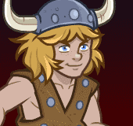
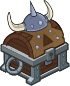

[Back to Main](index.md)

    
        Portrait
    
    
        Model
    

# Bobby

Bobby, the Barbarian (voiced by Ted Field III) – the youngest member of the team at eight years old and the younger brother of Sheila. He is the Barbarian, as indicated by his fur pants and boots, horned helmet, and cross belt harness. Brash, brave and selfless but occasionally impulsive, Bobby's personality frequently puts himself and his friends in danger. His cudgel saves the protagonists from peril on numerous occasions.

[D&D TV Series Wiki](https://en.wikipedia.org/wiki/Dungeons_%26_Dragons_(TV_series))

# Basic Information

Bobby will be a new champion in the Highharvestide event on 4 September 2024.

    
        
            **Seat**:
        
        
            Unknown
        
    
    
        
            **Race**:
        
        
            Human (Guess)
        
    
    
        
            **Class**:
        
        
            Barbarian (Guess)
        
    
    
        
            **Roles**:
        
        
            DPS / Support (Guess)
        
    
    
        
            **Age**:
        
        
            8 (Guess)
        
    
    
        
            **Gender**:
        
        
            Male (Guess)
        
    
    
        
            **Alignment**:
        
        
            Unknown
        
    
    
        
            **Affiliation**:
        
        
            Saturday Morning Squad (Guess)
        
    

# Formation

Unknown.


    



# Attacks

**Base Attack: Thunder Club** (Melee)
> Bobby moves up to the closest enemy and swings his club, dealing 1 hit to all nearby enemies.  
> Cooldown: 3s (Cap 0.75s)

<em>Raw Data</em>

<pre>
{
    "id": 791,
    "name": "Thunder Club",
    "description": "Bobby swings his club at the closest enemy.",
    "long_description": "Bobby moves up to the closest enemy and swings his club, dealing 1 hit to all nearby enemies.",
    "graphic_id": 0,
    "target": "front",
    "num_targets": 1,
    "aoe_radius": 100,
    "damage_modifier": 1,
    "cooldown": 3,
    "animations": [
        {
            "type": "melee_attack",
            "damage_frame": 8,
            "target_offset_x": -40,
            "jump_sound": 30,
            "sound_frames": {
                "14": 154
            }
        }
    ],
    "tags": [
        "melee"
    ],
    "damage_types": [
        "melee"
    ]
}
</pre>

**Ultimate Attack: Bobby-quake**
> Bobby strikes the ground with his club, knocking all enemies up and back and stunning them for 5 seconds.  
> Cooldown: 3s (Cap 0.75s)

ⓘ *Note: Very short ultimate cooldowns are almost always for testing purposes and are likely to be increased later.*

<em>Raw Data</em>

<pre>
{
    "id": 792,
    "name": "Bobby-quake",
    "description": "Bobby strikes the ground with his club, stunning and knocking back all enemies.",
    "long_description": "Bobby strikes the ground with his club, knocking all enemies up and back and stunning them for 5 seconds.",
    "graphic_id": 24409,
    "target": "front",
    "num_targets": 1,
    "aoe_radius": 0,
    "damage_modifier": 0.03,
    "cooldown": 3,
    "animations": [
        {
            "type": "ultimate_attack",
            "ultimate": "bobby",
            "knockback_effect": {
                "effect_string": "push_back_monster,10"
            }
        }
    ],
    "tags": [
        "melee",
        "ultimate"
    ],
    "damage_types": [
        "melee"
    ]
}
</pre>

# Abilities

**Unknown** (Guess)
> Bobby's base chance to Critical Hit is 20%.

<em>Raw Data</em>

<pre>
{
    "id": 2051,
    "flavour_text": "",
    "description": {
        "desc": "Bobby's base chance to Critical Hit is $(amount)%."
    },
    "effect_keys": [
        {
            "effect_string": "set_base_crit_chance,20"
        }
    ],
    "requirements": "",
    "graphic_id": 0,
    "large_graphic_id": 0,
    "properties": {
        "is_formation_ability": true,
        "owner_use_outgoing_description": true,
        "formation_circle_icon": false
    }
}
</pre>

**Charge Into Battle** (Guess)
> Bobby increases his damage by 100% for each column behind him, stacking multiplicatively.

ⓘ *Note: This ability is prestack.*

<em>Raw Data</em>

<pre>
{
    "id": 2052,
    "flavour_text": "",
    "description": {
        "desc": "Bobby increases his damage by $(amount)% for each column behind him, stacking multiplicatively."
    },
    "effect_keys": [
        {
            "effect_string": "pre_stack,100",
            "skip_effect_key_desc": true
        },
        {
            "effect_string": "hero_dps_multiplier_mult,0",
            "amount_expr": "upgrade_amount(15443,0)",
            "stacks_on_trigger": "on_columns_from,back",
            "stacks_multiply": true,
            "show_bonus": true,
            "stack_title": "Columns from the back",
            "off_when_benched": true
        }
    ],
    "requirements": "",
    "graphic_id": 24400,
    "large_graphic_id": 24396,
    "properties": {
        "is_formation_ability": true,
        "owner_use_outgoing_description": true,
        "formation_circle_icon": false,
        "indexed_effect_properties": true,
        "per_effect_index_bonuses": true,
        "default_bonus_index": 0
    }
}
</pre>

**Uni the Unicorn** (Guess)
> Uni takes her place next to Bobby. Uni increases the damage of Bobby and all other Champions next to her by 100%. If Uni is in Dungeon Master's formation slot, this is further increased by 400%.

<em>Raw Data</em>

<pre>
{
    "id": 2053,
    "flavour_text": "",
    "description": {
        "desc": "Uni takes her place next to Bobby. Uni increases the damage of Bobby and all other Champions next to her by $(amount___2)%. If Uni is in Dungeon Master's formation slot, this is further increased by $(amount___4)%."
    },
    "effect_keys": [
        {
            "effect_string": "bobby_uni_the_unicorn",
            "adjacent_buff_effect_index": 1,
            "dm_bonus_effect_index": 3,
            "dm_hero_id": 99
        },
        {
            "effect_string": "pre_buff,100"
        },
        {
            "effect_string": "hero_dps_multiplier_mult,0",
            "amount_expr": "upgrade_amount(15444,1)",
            "targets": [
                "self_and_adj"
            ],
            "show_bonus": true
        },
        {
            "effect_string": "buff_upgrade,400,15444,2",
            "apply_manually": true,
            "skip_effect_key_desc": true
        }
    ],
    "requirements": "",
    "graphic_id": 24403,
    "large_graphic_id": 24399,
    "properties": {
        "is_formation_ability": true,
        "owner_use_outgoing_description": true,
        "formation_circle_icon": false,
        "indexed_effect_properties": true,
        "per_effect_index_bonuses": true,
        "default_bonus_index": 0,
        "use_owner_override": true,
        "retain_on_slot_changed": true
    }
}
</pre>

**Now We're Talking** (Guess)
> Whenever Bobby lands a Critical Hit, the effect of Charge Into Battle is increased by 100%, stacking multiplicatively up to 10 times and resetting when changing areas.

ⓘ *Note: This ability is prestack.*

<em>Raw Data</em>

<pre>
{
    "id": 2054,
    "flavour_text": "",
    "description": {
        "desc": "Whenever Bobby lands a Critical Hit, the effect of Charge Into Battle is increased by $(amount)%, stacking multiplicatively up to 10 times and resetting when changing areas."
    },
    "effect_keys": [
        {
            "effect_string": "pre_stack,100",
            "skip_effect_key_desc": true
        },
        {
            "effect_string": "buff_upgrade,0,15443,0",
            "amount_expr": "upgrade_amount(15445,0)",
            "off_when_benched": false,
            "max_stacks": 10,
            "total_title": "Total Charge Into Battle Bonus",
            "stacks_multiply": true,
            "show_bonus": true,
            "stacks_on_trigger": "pre_owner_attack_crit",
            "more_triggers": [
                {
                    "trigger": "area_changed",
                    "action": {
                        "type": "reset"
                    }
                }
            ]
        }
    ],
    "requirements": "",
    "graphic_id": 24401,
    "large_graphic_id": 24397,
    "properties": {
        "is_formation_ability": true,
        "owner_use_outgoing_description": true,
        "formation_circle_icon": false,
        "indexed_effect_properties": true,
        "per_effect_index_bonuses": true,
        "default_bonus_index": 0
    }
}
</pre>

**Scales of Tiamat Scavenger** (Guess)
> Bobby can help scavenge up to 5000 additional Scales of Tiamat from boss loot sacks. While this cap is not reached, Bobby has a 10% chance of scavenging 10 Scales of Tiamat each time a boss drops a loot bag. The cap increases by 150 every day.

<em>Raw Data</em>

<pre>
{
    "id": 2055,
    "flavour_text": "",
    "description": {
        "desc": "Bobby can help scavenge up to $(current_scavenge_cap bobby_scale_scavenger floor) additional Scales of Tiamat from boss loot sacks. While this cap is not reached, Bobby has a $amount% chance of scavenging 10 Scales of Tiamat each time a boss drops a loot bag. The cap increases by $cap_increase_per_day every day.",
        "post": {
            "conditions": [
                {
                    "condition": "not static_desc",
                    "desc": "^^Scales of Tiamat Scavenged: $(stat_value bobby_scales_collected 0 none) ($(stat_value bobby_scales_collected_this_adventure 1 none) this adventure)"
                }
            ]
        }
    },
    "effect_keys": [
        {
            "off_when_benched": true,
            "effect_string": "scavenge_items,10",
            "id": "bobby_scale_scavenger",
            "item_type": "scales_of_tiamat",
            "initial_cap": 5000,
            "cap_increase_per_day": 150,
            "start_date": "2024-07-01 12:00:00",
            "total_collected_stat": "bobby_scales_collected",
            "adventure_collected_stat": "bobby_scales_collected_this_adventure",
            "upgrade_id": 15446,
            "amount_per_drop": 10
        }
    ],
    "requirements": "",
    "graphic_id": 24402,
    "large_graphic_id": 24398,
    "properties": {
        "is_formation_ability": true,
        "owner_use_outgoing_description": true,
        "formation_circle_icon": false
    }
}
</pre>

# Specialisations

**Unknown** (Guess)
> Bobby strikes the ground with his club causing a small earthquake, briefly launching all enemies into the air and back a short distance. Each enemy takes one ultimate hit and is stunned for 5 seconds.

<em>Raw Data</em>

<pre>
{
    "id": 2061,
    "flavour_text": "",
    "description": {
        "desc": "Bobby strikes the ground with his club causing a small earthquake, briefly launching all enemies into the air and back a short distance. Each enemy takes one ultimate hit and is stunned for 5 seconds."
    },
    "effect_keys": [
        {
            "effect_string": "set_ultimate_attack"
        }
    ],
    "requirements": "",
    "graphic_id": 24409,
    "large_graphic_id": 24409,
    "properties": {
        "is_formation_ability": true,
        "owner_use_outgoing_description": true,
        "formation_circle_icon": false
    }
}
</pre>

**Strong Armed** (Guess)
> Bobby increases his damage by 100%. When Bobby scores a Critical Hit, the enemies are also knocked back and stunned for 5 seconds.

<em>Raw Data</em>

<pre>
{
    "id": 2056,
    "flavour_text": "",
    "description": {
        "desc": "Bobby increases his damage by $(amount)%. When Bobby scores a Critical Hit, the enemies are also knocked back and stunned for 5 seconds."
    },
    "effect_keys": [
        {
            "effect_string": "hero_dps_multiplier_mult,100",
            "targets": [
                "self"
            ],
            "amount_updated_listeners": [
                "slot_changed"
            ]
        },
        {
            "effect_string": "add_crit_effect,5",
            "crit_effect": {
                "effect_string": "stun,$amount"
            }
        },
        {
            "effect_string": "add_crit_effect,15",
            "crit_effect": {
                "effect_string": "push_back_monster,$amount"
            }
        }
    ],
    "requirements": "",
    "graphic_id": 0,
    "large_graphic_id": 0,
    "properties": {
        "is_formation_ability": true,
        "owner_use_outgoing_description": true,
        "formation_circle_icon": false,
        "indexed_effect_properties": true,
        "per_effect_index_bonuses": true,
        "default_bonus_index": 0
    }
}
</pre>

**Group Charge** (Guess)
> Bobby's Charge Into Battle now also increases the damage of all Champions behind Bobby by $(amount)% of the buff it provides to Bobby.

<em>Raw Data</em>

<pre>
{
    "id": 2057,
    "flavour_text": "",
    "description": {
        "desc": "Bobby's Charge Into Battle now also increases the damage of all Champions behind Bobby by $(amount)% of the buff it provides to Bobby."
    },
    "effect_keys": [
        {
            "effect_string": "do_nothing,100",
            "dev_note": "this is the pre-stack amount",
            "skip_effect_key_desc": true
        },
        {
            "effect_string": "hero_dps_multiplier_mult,0",
            "amount_expr": "upgrade_amount(15443,1)*upgrade_amount(15448,0)*0.01",
            "targets": [
                "behind"
            ],
            "show_bonus": true
        }
    ],
    "requirements": "",
    "graphic_id": 0,
    "large_graphic_id": 0,
    "properties": {
        "is_formation_ability": true,
        "owner_use_outgoing_description": false,
        "formation_circle_icon": false,
        "indexed_effect_properties": true,
        "per_effect_index_bonuses": true,
        "default_bonus_index": 0
    }
}
</pre>

**Not So Low** (Guess)
> Bobby increases the effect of his first Specialization choice by 100% for each Champion in the formation with a total ability score of 78 or less, stacking multiplicatively.

ⓘ *Note: This ability is prestack.*

<em>Raw Data</em>

<pre>
{
    "id": 2058,
    "flavour_text": "",
    "description": {
        "desc": "Bobby increases the effect of his first Specialization choice by $(amount)% for each Champion in the formation with a total ability score of 78 or less, stacking multiplicatively."
    },
    "effect_keys": [
        {
            "effect_string": "pre_stack,100",
            "skip_effect_key_desc": true
        },
        {
            "effect_string": "buff_upgrades,0,15447,15448",
            "amount_expr": "upgrade_amount(15449,0)",
            "stack_func": "per_hero_attribute",
            "per_hero_expr": "GetStat(`total_ability_score`)<=78",
            "amount_func": "mult",
            "show_bonus": true,
            "stack_title": "Humble Champions",
            "amount_updated_listeners": [
                "slot_changed"
            ],
            "off_when_benched": true
        }
    ],
    "requirements": "",
    "graphic_id": 0,
    "large_graphic_id": 0,
    "properties": {
        "is_formation_ability": true,
        "owner_use_outgoing_description": true,
        "formation_circle_icon": false,
        "indexed_effect_properties": true,
        "per_effect_index_bonuses": true,
        "default_bonus_index": 0
    }
}
</pre>

**Still Growing Up** (Guess)
> Bobby increases the effect of his first Specialization choice by 100% for each Champion in the formation that is 20 years old or younger, stacking multiplicatively.

ⓘ *Note: This ability is prestack.*

<em>Raw Data</em>

<pre>
{
    "id": 2059,
    "flavour_text": "",
    "description": {
        "desc": "Bobby increases the effect of his first Specialization choice by $(amount)% for each Champion in the formation that is 20 years old or younger, stacking multiplicatively."
    },
    "effect_keys": [
        {
            "effect_string": "pre_stack,100",
            "skip_effect_key_desc": true
        },
        {
            "effect_string": "buff_upgrades,0,15447,15448",
            "amount_expr": "upgrade_amount(15450,0)",
            "stack_func": "per_hero_attribute",
            "per_hero_expr": "age<=20",
            "amount_func": "mult",
            "show_bonus": true,
            "stack_title": "Young Champions",
            "amount_updated_listeners": [
                "slot_changed"
            ],
            "off_when_benched": true
        }
    ],
    "requirements": "",
    "graphic_id": 0,
    "large_graphic_id": 0,
    "properties": {
        "is_formation_ability": true,
        "owner_use_outgoing_description": true,
        "formation_circle_icon": false,
        "indexed_effect_properties": true,
        "per_effect_index_bonuses": true,
        "default_bonus_index": 0
    }
}
</pre>

**Stunning Strength** (Guess)
> Bobby increases the effect of his first Specialization choice by 100% for each Champion in the formation with a Strength of 15 or higher, stacking multiplicatively.

ⓘ *Note: This ability is prestack.*

<em>Raw Data</em>

<pre>
{
    "id": 2060,
    "flavour_text": "",
    "description": {
        "desc": "Bobby increases the effect of his first Specialization choice by $(amount)% for each Champion in the formation with a Strength of 15 or higher, stacking multiplicatively."
    },
    "effect_keys": [
        {
            "effect_string": "pre_stack,100",
            "skip_effect_key_desc": true
        },
        {
            "effect_string": "buff_upgrades,0,15447,15448",
            "amount_expr": "upgrade_amount(15451,0)",
            "stack_func": "per_hero_attribute",
            "per_hero_expr": "GetStat(`str`)>=15",
            "amount_func": "mult",
            "show_bonus": true,
            "stack_title": "Strong Champions",
            "amount_updated_listeners": [
                "slot_changed"
            ],
            "off_when_benched": true
        }
    ],
    "requirements": "",
    "graphic_id": 0,
    "large_graphic_id": 0,
    "properties": {
        "is_formation_ability": true,
        "owner_use_outgoing_description": true,
        "formation_circle_icon": false,
        "indexed_effect_properties": true,
        "per_effect_index_bonuses": true,
        "default_bonus_index": 0
    }
}
</pre>

# Items

    
        
            **Icons**
        
        
            **Name**
        
    
    
        
            
        
        
            Boots
        
    
    
        
            
        
        
            Clothing
        
    
    
        
            
        
        
            Club
        
    
    
        
            
        
        
            Helm
        
    
    
        
            
        
        
            Necklace
        
    
    
        
            
        
        
            Uni Stuff
        
    

# Feats

Unknown.

# Legendaries

Unknown.

# Adventures and Variants

Unknown.

# Other Champion Images

    
        
            Console Portrait
        
    
    
        
            Gold Chest Icon
        
        
            Silver Chest Icon
        
    

[Back to Top](#top)

*Last Modified: {{ site.time }}*