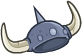
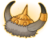

[Back to Main](index.md)

    
        Portrait
    
    
        Model
    

# Bobby

Bobby, the Barbarian (voiced by Ted Field III) – the youngest member of the team at eight years old and the younger brother of Sheila. He is the Barbarian, as indicated by his fur pants and boots, horned helmet, and cross belt harness. Brash, brave and selfless but occasionally impulsive, Bobby's personality frequently puts himself and his friends in danger. His cudgel saves the protagonists from peril on numerous occasions.

[D&D TV Series Wiki](https://en.wikipedia.org/wiki/Dungeons_%26_Dragons_(TV_series))

# Basic Information

Bobby will be a new champion in the Highharvestide event on 4 September 2024.

    
        
            **Seat**:
        
        
            Unknown
        
    
    
        
            **Race**:
        
        
            Human (Guess)
        
    
    
        
            **Class**:
        
        
            Barbarian (Guess)
        
    
    
        
            **Roles**:
        
        
            DPS / Support (Guess)
        
    
    
        
            **Age**:
        
        
            8 (Guess)
        
    
    
        
            **Gender**:
        
        
            Male (Guess)
        
    
    
        
            **Alignment**:
        
        
            Unknown
        
    
    
        
            **Affiliation**:
        
        
            Saturday Morning Squad (Guess)
        
    

# Formation

Unknown.


    



# Attacks

**Base Attack: Thunder Club** (Melee)
> Bobby moves up to the closest enemy and swings his club, dealing 1 hit to all nearby enemies.  
> Cooldown: 3s (Cap 0.75s)

<em>Raw Data</em>

<pre>
{
    "id": 791,
    "name": "Thunder Club",
    "description": "Bobby swings his club at the closest enemy.",
    "long_description": "Bobby moves up to the closest enemy and swings his club, dealing 1 hit to all nearby enemies.",
    "graphic_id": 0,
    "target": "front",
    "num_targets": 1,
    "aoe_radius": 100,
    "damage_modifier": 1,
    "cooldown": 3,
    "animations": [
        {
            "type": "melee_attack",
            "damage_frame": 8,
            "target_offset_x": -40,
            "jump_sound": 30,
            "sound_frames": {
                "14": 154
            }
        }
    ],
    "tags": [
        "melee"
    ],
    "damage_types": [
        "melee"
    ]
}
</pre>

**Base Attack: Bobby-quake** (Melee)
> Bobby strikes the ground with his club, knocking all enemies up and back and stunning them for 5 seconds.  
> Cooldown: 3s (Cap 0.75s)

<em>Raw Data</em>

<pre>
{
    "id": 792,
    "name": "Bobby-quake",
    "description": "Bobby strikes the ground with his club, stunning and knocking back all enemies.",
    "long_description": "Bobby strikes the ground with his club, knocking all enemies up and back and stunning them for 5 seconds.",
    "graphic_id": 24409,
    "target": "front",
    "num_targets": 1,
    "aoe_radius": 0,
    "damage_modifier": 0.03,
    "cooldown": 3,
    "animations": [
        {
            "type": "melee_attack",
            "damage_frame": 8
        }
    ],
    "tags": [
        "melee"
    ],
    "damage_types": [
        "melee"
    ]
}
</pre>

# Abilities

**Unknown** (Guess)
> Bobby's base chance to Critical Hit is 20%.

<em>Raw Data</em>

<pre>
{
    "id": 2051,
    "flavour_text": "",
    "description": {
        "desc": "Bobby's base chance to Critical Hit is $(amount)%."
    },
    "effect_keys": [
        {
            "effect_string": "set_base_crit_chance,20"
        }
    ],
    "requirements": "",
    "graphic_id": 0,
    "large_graphic_id": 0,
    "properties": {
        "is_formation_ability": true,
        "owner_use_outgoing_description": true,
        "formation_circle_icon": false
    }
}
</pre>

**Charge Into Battle** (Guess)
> Bobby increases his damage by 100% for each column behind him, stacking multiplicatively.

ⓘ *Note: This ability is prestack.*

<em>Raw Data</em>

<pre>
{
    "id": 2052,
    "flavour_text": "",
    "description": {
        "desc": "Bobby increases his damage by $(amount)% for each column behind him, stacking multiplicatively."
    },
    "effect_keys": [
        {
            "effect_string": "pre_stack,100",
            "skip_effect_key_desc": true
        },
        {
            "effect_string": "hero_dps_multiplier_mult,0",
            "amount_expr": "upgrade_amount(15443,0)",
            "stacks_on_trigger": "on_columns_from,back",
            "stacks_multiply": true,
            "show_bonus": true,
            "stack_title": "Columns from the back",
            "off_when_benched": true
        }
    ],
    "requirements": "",
    "graphic_id": 24400,
    "large_graphic_id": 24396,
    "properties": {
        "is_formation_ability": true,
        "owner_use_outgoing_description": true,
        "formation_circle_icon": false,
        "indexed_effect_properties": true,
        "per_effect_index_bonuses": true,
        "default_bonus_index": 0
    }
}
</pre>

**Uni the Unicorn** (Guess)
> Uni takes her place next to Bobby. Uni increases the damage of Bobby and all other Champions next to her by 100%. If Uni is in Dungeon Master's formation slot, this is further increased by 400%.

<em>Raw Data</em>

<pre>
{
    "id": 2053,
    "flavour_text": "",
    "description": {
        "desc": "Uni takes her place next to Bobby. Uni increases the damage of Bobby and all other Champions next to her by $(amount___2)%. If Uni is in Dungeon Master's formation slot, this is further increased by $(amount___3)%."
    },
    "effect_keys": [
        {
            "effect_string": "bobby_uni_the_unicorn",
            "adjacent_buff_effect_index": 1,
            "dm_bonus_effect_index": 2,
            "dm_hero_id": 99
        },
        {
            "effect_string": "hero_dps_multiplier_mult,100",
            "targets": [
                "self_and_adj"
            ],
            "show_bonus": true
        },
        {
            "effect_string": "buff_upgrade,400,15444,1",
            "apply_manually": true,
            "show_bonus": true
        }
    ],
    "requirements": "",
    "graphic_id": 24403,
    "large_graphic_id": 24399,
    "properties": {
        "is_formation_ability": true,
        "owner_use_outgoing_description": true,
        "formation_circle_icon": false,
        "indexed_effect_properties": true,
        "per_effect_index_bonuses": true,
        "default_bonus_index": 0,
        "use_owner_override": true,
        "retain_on_slot_changed": true
    }
}
</pre>

**Now We're Talking** (Guess)
> Whenever Bobby lands a Critical Hit, the effect of Charge Into Battle is increased by 100%, stacking multiplicatively up to 10 times and resetting when changing areas.

ⓘ *Note: This ability is prestack.*

<em>Raw Data</em>

<pre>
{
    "id": 2054,
    "flavour_text": "",
    "description": {
        "desc": "Whenever Bobby lands a Critical Hit, the effect of Charge Into Battle is increased by $(amount)%, stacking multiplicatively up to 10 times and resetting when changing areas."
    },
    "effect_keys": [
        {
            "effect_string": "pre_stack,100",
            "skip_effect_key_desc": true
        },
        {
            "effect_string": "buff_upgrade,0,15443,0",
            "amount_expr": "upgrade_amount(15445,0)",
            "off_when_benched": false,
            "max_stacks": 10,
            "total_title": "Total Charge Into Battle Bonus",
            "stacks_multiply": true,
            "show_bonus": true,
            "stacks_on_trigger": "pre_owner_attack_crit",
            "more_triggers": [
                {
                    "trigger": "area_changed",
                    "action": {
                        "type": "reset"
                    }
                }
            ]
        }
    ],
    "requirements": "",
    "graphic_id": 24401,
    "large_graphic_id": 24397,
    "properties": {
        "is_formation_ability": true,
        "owner_use_outgoing_description": true,
        "formation_circle_icon": false,
        "indexed_effect_properties": true,
        "per_effect_index_bonuses": true,
        "default_bonus_index": 0
    }
}
</pre>

**Scales of Tiamat Scavenger** (Guess)
> Bobby can help scavenge up to 20 additional Electrum Chests from boss loot sacks. While this cap is not reached, Diana has a 0.5% chance of scavenging 1 Electrum Chest each time a boss drops a loot bag. The cap increases by 0.5 every day.

<em>Raw Data</em>

<pre>
{
    "id": 2055,
    "flavour_text": "",
    "description": {
        "desc": "Bobby can help scavenge up to $(current_scavenge_cap diana_electrum_scavenger floor) additional Electrum Chests from boss loot sacks. While this cap is not reached, Diana has a $amount% chance of scavenging 1 Electrum Chest each time a boss drops a loot bag. The cap increases by $cap_increase_per_day every day.",
        "post": {
            "conditions": [
                {
                    "condition": "not static_desc",
                    "desc": "^^Electrum Chests Scavenged: $(stat_value diana_electrum_collected 0 none) ($(stat_value diana_electrum_collected_this_adventure 1 none) this adventure)"
                }
            ]
        }
    },
    "effect_keys": [
        {
            "off_when_benched": true,
            "effect_string": "scavenge_items,0.5",
            "id": "diana_electrum_scavenger",
            "item_type": "chest",
            "item_id": 282,
            "initial_cap": 20,
            "cap_increase_per_day": 0.5,
            "start_date": "2024-05-01 12:00:00",
            "total_collected_stat": "diana_electrum_collected",
            "adventure_collected_stat": "diana_electrum_collected_this_adventure",
            "upgrade_id": 14798
        }
    ],
    "requirements": "",
    "graphic_id": 24402,
    "large_graphic_id": 24398,
    "properties": {
        "is_formation_ability": true,
        "owner_use_outgoing_description": true,
        "formation_circle_icon": false
    }
}
</pre>

# Specialisations

**Group Charge** (Guess)
> Unknown effect.

<em>Raw Data</em>

<pre>
{
    "id": 24404,
    "graphic": "Icons/Events/2017Highharvestide/Highharvestide_Y8/Icon_Specialization_Bobby_GroupCharge",
    "v": 2,
    "fs": 0,
    "p": 0,
    "type": 1,
    "export_params": {
        "uses": [
            "icon"
        ]
    }
}
</pre>

**Not So Low** (Guess)
> Unknown effect.

<em>Raw Data</em>

<pre>
{
    "id": 24405,
    "graphic": "Icons/Events/2017Highharvestide/Highharvestide_Y8/Icon_Specialization_Bobby_NotSoLow",
    "v": 2,
    "fs": 0,
    "p": 0,
    "type": 1,
    "export_params": {
        "uses": [
            "icon"
        ]
    }
}
</pre>

**Still Growing Up** (Guess)
> Unknown effect.

<em>Raw Data</em>

<pre>
{
    "id": 24406,
    "graphic": "Icons/Events/2017Highharvestide/Highharvestide_Y8/Icon_Specialization_Bobby_StillGrowingUp",
    "v": 2,
    "fs": 0,
    "p": 0,
    "type": 1,
    "export_params": {
        "uses": [
            "icon"
        ]
    }
}
</pre>

**Strong Armed** (Guess)
> Unknown effect.

<em>Raw Data</em>

<pre>
{
    "id": 24407,
    "graphic": "Icons/Events/2017Highharvestide/Highharvestide_Y8/Icon_Specialization_Bobby_StrongArmed",
    "v": 2,
    "fs": 0,
    "p": 0,
    "type": 1,
    "export_params": {
        "uses": [
            "icon"
        ]
    }
}
</pre>

**Stunning Strength** (Guess)
> Unknown effect.

<em>Raw Data</em>

<pre>
{
    "id": 24408,
    "graphic": "Icons/Events/2017Highharvestide/Highharvestide_Y8/Icon_Specialization_Bobby_StunningStrength",
    "v": 2,
    "fs": 0,
    "p": 0,
    "type": 1,
    "export_params": {
        "uses": [
            "icon"
        ]
    }
}
</pre>

# Items

    
        
            **Icons**
        
        
            **Name**
        
    
    
        
            
        
        
            Boots
        
    
    
        
            
        
        
            Clothing
        
    
    
        
            
        
        
            Club
        
    
    
        
            
        
        
            Helm
        
    
    
        
            
        
        
            Necklace
        
    
    
        
            
        
        
            Uni Stuff
        
    

# Feats

Unknown.

# Legendaries

Unknown.

# Adventures and Variants

Unknown.

# Other Champion Images

    
        
            Console Portrait
        
    
    
        
            Gold Chest Icon
        
        
            Silver Chest Icon
        
    

[Back to Top](#top)

*Last Modified: {{ site.time }}*