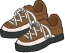
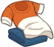
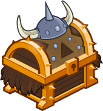

[Back to Main](index.md)

    
        Portrait
    
    
        Model
    

# Bobby

Bobby, the Barbarian (voiced by Ted Field III) – the youngest member of the team at eight years old and the younger brother of Sheila. He is the Barbarian, as indicated by his fur pants and boots, horned helmet, and cross belt harness. Brash, brave and selfless but occasionally impulsive, Bobby's personality frequently puts himself and his friends in danger. His cudgel saves the protagonists from peril on numerous occasions.

[D&D TV Series Wiki](https://en.wikipedia.org/wiki/Dungeons_%26_Dragons_(TV_series))

# Basic Information

Bobby will be a new champion in the Highharvestide event on 4 September 2024.

    
        
            **Seat**:
        
        
            Unknown
        
    
    
        
            **Race**:
        
        
            Human (Guess)
        
    
    
        
            **Class**:
        
        
            Barbarian (Guess)
        
    
    
        
            **Roles**:
        
        
            Unknown
        
    
    
        
            **Age**:
        
        
            8 (Guess)
        
    
    
        
            **Gender**:
        
        
            Male (Guess)
        
    
    
        
            **Alignment**:
        
        
            Unknown
        
    
    
        
            **Affiliation**:
        
        
            Saturday Morning Squad (Guess)
        
    

# Formation

Unknown.


    



# Abilities

**Charge Into Battle** (Guess)
> Unknown effect.

<em>Raw Data</em>

<pre>
{
    "id": 24400,
    "graphic": "Icons/Events/2017Highharvestide/Highharvestide_Y8/Icon_Formation_Bobby_ChargeIntoBattle",
    "v": 2,
    "fs": 0,
    "p": 0,
    "type": 1,
    "export_params": {
        "uses": [
            "icon"
        ]
    }
}
</pre>

**Now We're Talking** (Guess)
> Unknown effect.

<em>Raw Data</em>

<pre>
{
    "id": 24401,
    "graphic": "Icons/Events/2017Highharvestide/Highharvestide_Y8/Icon_Formation_Bobby_NowWereTalking",
    "v": 2,
    "fs": 0,
    "p": 0,
    "type": 1,
    "export_params": {
        "uses": [
            "icon"
        ]
    }
}
</pre>

**Scales of Tiamat Scavenger** (Guess)
> Unknown effect.

<em>Raw Data</em>

<pre>
{
    "id": 24402,
    "graphic": "Icons/Events/2017Highharvestide/Highharvestide_Y8/Icon_Formation_Bobby_ScalesofTiamatScavenger",
    "v": 2,
    "fs": 0,
    "p": 0,
    "type": 1,
    "export_params": {
        "uses": [
            "icon"
        ]
    }
}
</pre>

**Uni the Unicorn** (Guess)
> Unknown effect.

<em>Raw Data</em>

<pre>
{
    "id": 24403,
    "graphic": "Icons/Events/2017Highharvestide/Highharvestide_Y8/Icon_Formation_Bobby_UnitheUnicorn",
    "v": 2,
    "fs": 0,
    "p": 0,
    "type": 1,
    "export_params": {
        "uses": [
            "icon"
        ]
    }
}
</pre>

# Specialisations

**Group Charge** (Guess)
> Unknown effect.

<em>Raw Data</em>

<pre>
{
    "id": 24404,
    "graphic": "Icons/Events/2017Highharvestide/Highharvestide_Y8/Icon_Specialization_Bobby_GroupCharge",
    "v": 2,
    "fs": 0,
    "p": 0,
    "type": 1,
    "export_params": {
        "uses": [
            "icon"
        ]
    }
}
</pre>

**Not So Low** (Guess)
> Unknown effect.

<em>Raw Data</em>

<pre>
{
    "id": 24405,
    "graphic": "Icons/Events/2017Highharvestide/Highharvestide_Y8/Icon_Specialization_Bobby_NotSoLow",
    "v": 2,
    "fs": 0,
    "p": 0,
    "type": 1,
    "export_params": {
        "uses": [
            "icon"
        ]
    }
}
</pre>

**Still Growing Up** (Guess)
> Unknown effect.

<em>Raw Data</em>

<pre>
{
    "id": 24406,
    "graphic": "Icons/Events/2017Highharvestide/Highharvestide_Y8/Icon_Specialization_Bobby_StillGrowingUp",
    "v": 2,
    "fs": 0,
    "p": 0,
    "type": 1,
    "export_params": {
        "uses": [
            "icon"
        ]
    }
}
</pre>

**Strong Armed** (Guess)
> Unknown effect.

<em>Raw Data</em>

<pre>
{
    "id": 24407,
    "graphic": "Icons/Events/2017Highharvestide/Highharvestide_Y8/Icon_Specialization_Bobby_StrongArmed",
    "v": 2,
    "fs": 0,
    "p": 0,
    "type": 1,
    "export_params": {
        "uses": [
            "icon"
        ]
    }
}
</pre>

**Stunning Strength** (Guess)
> Unknown effect.

<em>Raw Data</em>

<pre>
{
    "id": 24408,
    "graphic": "Icons/Events/2017Highharvestide/Highharvestide_Y8/Icon_Specialization_Bobby_StunningStrength",
    "v": 2,
    "fs": 0,
    "p": 0,
    "type": 1,
    "export_params": {
        "uses": [
            "icon"
        ]
    }
}
</pre>

# Items

    
        
            **Icons**
        
        
            **Name**
        
    
    
        
            
        
        
            Boots
        
    
    
        
            
        
        
            Clothing
        
    
    
        
            
        
        
            Club
        
    
    
        
            
        
        
            Helm
        
    
    
        
            
        
        
            Necklace
        
    
    
        
            
        
        
            Uni Stuff
        
    

# Feats

Unknown.

# Legendaries

Unknown.

# Adventures and Variants

Unknown.

# Other Champion Images

    
        
            Console Portrait
        
    
    
        
            Gold Chest Icon
        
        
            Silver Chest Icon
        
    

[Back to Top](#top)

*Last Modified: {{ site.time }}*