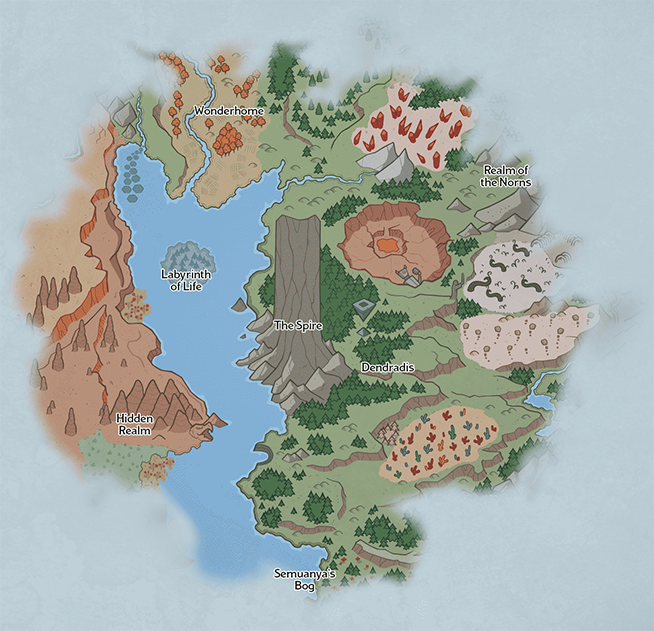

[Back to Main](index.md)

# New Campaign

A new campaign was recently added to the defines: `Turn of Fortune's Wheel`. The guesstimated date of release is 1 November 2023 as per the [Content Drops](contentdrops.md) page.

| Logo | Campaign Button |
|---|---|
|  |  |

## Theme

It seems it will be Planescape / Sigil related - given the reference to the Fortune's Wheel tavern.

## Formation

## Map Preview

The introductory map for this campaign appears to be Outlands (from what I've been told).

## Gimmick

A recent change to the formation data suggests that this campaign will have a very weird gimmick.

It's hard to parse but it *seems* that on z50 (and maybe z100/150/200/etc.) it will forcibly turn on the story dialogue, disable hotkeys, hide the UI and make champions unable to use ultimates, as well as give them a **massively long** attack cooldown.

This is all - presumably - to offer some kind of message or choice. Then when it's finished whatever that is - it will put everything back to normal and continue on its merry way.

Of course - bear in mind - that's just my interpretation of the data - I could be wrong. I've added it below for your own perusal.

*Note: The `game_change_data` recently changed. I have kept the old data just for posterity - but the new data is what's in use now.*

<em>New Raw Data</em>

<pre>
"campaign_name": "Turn of Fortune's Wheel",
"game_change_data": [
	{
		"type": "override_quest_graphic",
		"graphic_id": 20109
	},
	{
		"type": "block_gamepad_input",
		"loop_at": 51,
		"by_area": [
			{
				"min_area": 1,
				"blocked": false
			},
			{
				"min_area": 50,
				"blocked": true,
				"buttons": [
					"LeftBump",
					"RightBump",
					"LeftTrigger",
					"RightTrigger",
					"Start"
				],
				"axes": [
					"LeftStick",
					"RightStick",
					"DPad"
				]
			}
		]
	},
	{
		"type": "cap_area_level",
		"area_level_cap": 50
	},
	{
		"type": "cap_area_skipping",
		"area_skip_cap": 50
	},
	{
		"type": "force_reset",
		"instant": true,
		"area": 50
	},
	{
		"type": "force_cinematics",
		"loop_at": 51,
		"by_area": [
			{
				"min_area": 1,
				"force": false
			},
			{
				"min_area": 50,
				"force": true
			}
		]
	},
	{
		"type": "disable_hotkeys",
		"loop_at": 51,
		"by_area": [
			{
				"min_area": 1,
				"enabled": true
			},
			{
				"min_area": 50,
				"enabled": false
			}
		]
	},
	{
		"type": "skip_boss_loot",
		"loop_at": 51,
		"by_area": [
			{
				"min_area": 1,
				"skip": false
			},
			{
				"min_area": 50,
				"skip": true
			}
		]
	},
	{
		"type": "hide_ui",
		"by_area": [
			{
				"min_area": 1,
				"hide": false
			},
			{
				"min_area": 50,
				"max_area": 50,
				"hide": true
			}
		],
		"loop_at": 51
	},
	{
		"type": "cap_time_scale",
		"by_area": [
			{
				"min_area": 1,
				"should_cap": false
			},
			{
				"min_area": 50,
				"max_area": 50,
				"should_cap": true,
				"time_scale_cap": 1
			}
		],
		"loop_at": 51
	},
	{
		"type": "slot_effects_by_area",
		"effects": [
			{
				"effect_string": "increase_attack_cooldown,1000000"
			},
			{
				"effect_string": "disable_hero_properties,0,0,0,0,1"
			}
		],
		"loop_at": 51,
		"area_slot_effects": [
			{
				"min_area": 50,
				"max_area": 50,
				"slot_effects": [
					{
						"slots": [
							0,
							1,
							2,
							3,
							4,
							5,
							6,
							7,
							8,
							9
						],
						"effect_index": 0
					}
				]
			}
		]
	},
	{
		"type": "locked_slots",
		"loop_at": 51,
		"by_area": [
			{
				"min_area": 50,
				"max_area": 50,
				"locked": true,
				"slots": [
					0,
					1,
					2,
					3,
					4,
					5,
					6,
					7,
					8,
					9
				]
			}
		]
	}
],
</pre>

 

<em>Old Raw Data</em>

<pre>
"campaign_name": "Turn of Fortune's Wheel",
"game_change_data": [
	{
		"by_area": [
			{
				"blocked": false,
				"min_area": 1
			},
			{
				"buttons": [
					"LeftBump",
					"RightBump",
					"LeftTrigger",
					"RightTrigger",
					"Start"
				],
				"blocked": true,
				"min_area": 50,
				"axes": [
					"LeftStick",
					"RightStick",
					"DPad"
				]
			}
		],
		"loop_at": 51,
		"type": "block_gamepad_input"
	},
	{
		"area_level_cap": 50,
		"type": "cap_area_level"
	},
	{
		"type": "cap_area_skipping",
		"area_skip_cap": 50
	},
	{
		"area": 50,
		"type": "force_reset",
		"instant": true
	},
	{
		"by_area": [
			{
				"min_area": 1,
				"force": false
			},
			{
				"min_area": 50,
				"force": true
			}
		],
		"loop_at": 51,
		"type": "force_cinematics"
	},
	{
		"by_area": [
			{
				"min_area": 1,
				"enabled": true
			},
			{
				"min_area": 50,
				"enabled": false
			}
		],
		"loop_at": 51,
		"type": "disable_hotkeys"
	},
	{
		"by_area": [
			{
				"min_area": 1,
				"skip": false
			},
			{
				"min_area": 50,
				"skip": true
			}
		],
		"loop_at": 51,
		"type": "skip_boss_loot"
	},
	{
		"by_area": [
			{
				"hide": false,
				"min_area": 1
			},
			{
				"max_area": 50,
				"hide": true,
				"min_area": 50
			}
		],
		"loop_at": 51,
		"type": "hide_ui"
	},
	{
		"by_area": [
			{
				"min_area": 1,
				"should_cap": false
			},
			{
				"max_area": 50,
				"min_area": 50,
				"should_cap": true,
				"time_scale_cap": 1
			}
		],
		"loop_at": 51,
		"type": "cap_time_scale"
	},
	{
		"effects": [
			{
				"effect_string": "increase_attack_cooldown,1000000"
			},
			{
				"effect_string": "disable_hero_properties,0,0,0,0,1"
			}
		],
		"loop_at": 51,
		"type": "slot_effects_by_area",
		"area_slot_effects": [
			{
				"max_area": 50,
				"slot_effects": [
					{
						"slots": [
							0,
							1,
							2,
							3,
							4,
							5,
							6,
							7,
							8,
							9
						],
						"effect_index": 0
					}
				],
				"min_area": 50
			}
		]
	},
	{
		"by_area": [
			{
				"max_area": 50,
				"slots": [
					0,
					1,
					2,
					3,
					4,
					5,
					6,
					7,
					8,
					9
				],
				"min_area": 50,
				"locked": true
			}
		],
		"loop_at": 51,
		"type": "locked_slots"
	}
],
</pre>

 

## Favour

The campaign favour will be `Fortune's Favor`.

[Back to Top](#top)

*Last Modified: {{ site.time }}*