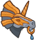
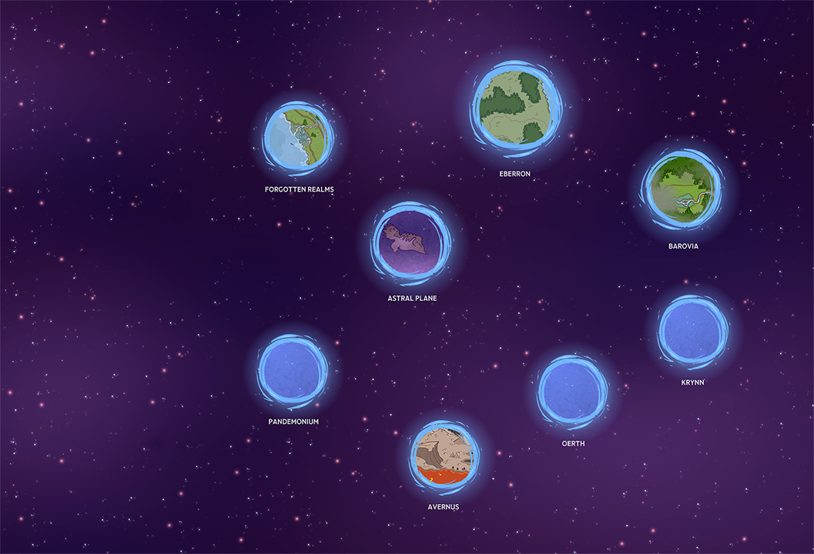

[Back to Main](index.md)

# New Campaign - Vecna: Eve of Ruin

A new campaign was recently added to the defines: `Vecna: Eve of Ruin`. The guesstimated date of release is 22 May 2024 as per the [Content Drops](contentdrops.md) page. This lines up very well with the release of the official WoTC adventure module of the same name on 21 May 2024.

# Blessings

Some effects made it into the definitions that look suspiciously like blessings. Can't be certain though of course.

**Local** (Guess)
> Increases the damage of all Lawful Champions by 100%

<em>Raw Data</em>

<pre>
{
    "id": 1964,
    "flavour_text": "",
    "description": {
        "desc": "Increases the damage of all Lawful Champions by 100%"
    },
    "effect_keys": [
        {
            "effect_string": "hero_dps_multiplier_mult,$replace",
            "targets": [
                {
                    "type": "by_tags",
                    "tags": [
                        "lawful"
                    ]
                }
            ]
        }
    ],
    "requirements": "",
    "graphic_id": 0,
    "large_graphic_id": 0,
    "properties": {
        "is_formation_ability": true,
        "formation_circle_icon": false
    }
}
</pre>

**Local** (Guess)
> Increases your gold find by 8.33% for each piece of epic or better gear on Champions in your formation, stacking additively

<em>Raw Data</em>

<pre>
{
    "id": 1965,
    "flavour_text": "",
    "description": {
        "desc": "Increases your gold find by 8.33% for each piece of epic or better gear on Champions in your formation, stacking additively"
    },
    "effect_keys": [
        {
            "effect_string": "gold_multiplier_mult,$replace",
            "amount_func": "add",
            "stack_func": "per_hero_attribute",
            "per_hero_expr": "NumEquipmentWithMinimumRarity(`Epic`)",
            "amount_updated_listeners": [
                "loot_changed"
            ]
        }
    ],
    "requirements": "",
    "graphic_id": 0,
    "large_graphic_id": 0,
    "properties": {
        "is_formation_ability": true,
        "formation_circle_icon": false
    }
}
</pre>

**Local** (Guess)
> Increases the damage of all Champions whose base attack is melee by 100%

<em>Raw Data</em>

<pre>
{
    "id": 1966,
    "flavour_text": "",
    "description": {
        "desc": "Increases the damage of all Champions whose base attack is melee by 100%"
    },
    "effect_keys": [
        {
            "effect_string": "hero_dps_multiplier_mult,$replace",
            "targets": [
                "all"
            ],
            "filter_targets": [
                {
                    "type": "attack_type",
                    "attack": "melee"
                }
            ]
        }
    ],
    "requirements": "",
    "graphic_id": 0,
    "large_graphic_id": 0,
    "properties": {
        "is_formation_ability": true,
        "formation_circle_icon": false
    }
}
</pre>

**Global** (Guess)
> Increases the damage of all Champions by 100% for each piece of the Rod of Seven Parts you have collected (stacking multiplicatively)

<em>Raw Data</em>

<pre>
{
    "id": 1967,
    "flavour_text": "",
    "description": {
        "desc": "Increases the damage of all Champions by 100% for each piece of the Rod of Seven Parts you have collected (stacking multiplicatively)"
    },
    "effect_keys": [
        {
            "effect_string": "hero_dps_multiplier_mult,$replace",
            "targets": [
                "all"
            ],
            "amount_func": "mult",
            "stack_func": "per_hero_attribute",
            "post_process_expr": "GetSaveStat(`vecna_rod_of_seven_parts`)"
        }
    ],
    "requirements": "",
    "graphic_id": 0,
    "large_graphic_id": 0,
    "properties": {
        "is_formation_ability": true,
        "formation_circle_icon": false
    }
}
</pre>

# Rod of Seven Parts

As you can probably see from the assumed Global blessing - there are some things called the `Rod of Seven Parts`. This appears to be something we will be able collect as we do more adventures in the campaign - though that is speculation on my part. All we have to go on are the names and the icons below.

| Part 1 | Part 2|
|---|---|
|  |  |

## Other Icons and Logos

| Logo | Campaign Button | Favour Icon |
|---|---|
|  |  |  |

## Formation

## Map

[Back to Top](#top)

*Last Modified: {{ site.time }}*