[Back to Main](index.md)

    
        
            
        
        
            Portrait
        
    
    
        
            
        
        
            Model
        
    

# Caramon Majere

[Caramon Majere - Dragonlace Fandom Wiki](https://dragonlance.fandom.com/wiki/Caramon_Majere){:target="_blank"}

# Basic Information

Caramon Majere will be a new champion in the Highharvestide event on 2 September 2026.

    
        
            **Seat**:
        
        
            Unknown
        
    
    
        
            **Species**:
        
        
            Human (Guess)
        
    
    
        
            **Class**:
        
        
            Fighter (Guess)
        
    
    
        
            **Roles**:
        
        
            Tanking / Support (Guess)
        
    
    
        
            **Age**:
        
        
            Unknown
        
    
    
        
            **Gender**:
        
        
            Male (Guess)
        
    
    
        
            **Alignment**:
        
        
            Unknown
        
    
    
        
            **Affiliation**:
        
        
            Heroes of the Lance (Guess)
        
    

# Formation

    <svg xmlns="http://www.w3.org/2000/svg" id="Caramon" fill="#aaa" data-formationName="Caramon" data-campaignName="Highharvestide" width="279" height="160"><circle cx="135" cy="45" r="15"/><circle cx="135" cy="85" r="15"/><circle cx="135" cy="125" r="15"/><circle cx="95" cy="25" r="15"/><circle cx="95" cy="65" r="15"/><circle cx="95" cy="105" r="15"/><circle cx="95" cy="145" r="15"/><circle cx="55" cy="45" r="15"/><circle cx="55" cy="85" r="15"/><circle cx="15" cy="65" r="15"/><text x="165" y="25" fill="#dcdcdc" font-size="25" font-family="Arial" font-weight="bold">Caramon</text><text x="165" y="65" fill="#dcdcdc" font-size="15" font-family="Arial" font-weight="bold">Highharvestide</text></svg>

# Attacks

**Base Attack: Mighty Blow** (Melee)
> Caramon attacks the nearest enemy for one hit.  
> Cooldown: 6.25s (Cap 1.5625s)

<em>Raw Data</em>

<pre>
{
    "id": 996,
    "name": "Mighty Blow",
    "description": "Caramon attacks the nearest enemy for one hit.",
    "long_description": "",
    "graphic_id": 0,
    "target": "front",
    "num_targets": 1,
    "aoe_radius": 0,
    "damage_modifier": 1,
    "cooldown": 6.25,
    "animations": [
        {
            "type": "melee_attack",
            "target_offset_x": -34,
            "damage_frame": 2,
            "jump_sound": 30,
            "sound_frames": {
                "2": 154
            }
        }
    ],
    "tags": [
        "melee"
    ],
    "damage_types": [
        "melee"
    ]
}
</pre>

**Ultimate Attack: Endure All** (Guess)
> Caramon is healed to full and buffs the party based on the health he was missing. This ultimate can automatically trigger when Caramon is close to death.  
> Cooldown: 360s (Cap 90s)

<em>Raw Data</em>

<pre>
{
    "id": 997,
    "name": "Endure All",
    "description": "Caramon is healed to full and buffs the party based on the health he was missing.",
    "long_description": "Caramon is healed to full and buffs the party based on the health he was missing. This ultimate can automatically trigger when Caramon is close to death.",
    "graphic_id": 30155,
    "target": "none",
    "num_targets": 1,
    "aoe_radius": 0,
    "damage_modifier": 0.03,
    "cooldown": 360,
    "animations": [
        {
            "type": "ultimate_attack",
            "ultimate": "caramon",
            "animation_sequence_name": "ultimate",
            "no_damage_display": true
        }
    ],
    "tags": [
        "magic",
        "ultimate"
    ],
    "damage_types": [
        "magic"
    ]
}
</pre>

# Abilities

**Unknown** (Guess)
> If Raistlin is in the formation, Caramon may be used as well, regardless of any active variant or patron restrictions.

<em>Raw Data</em>

<pre>
{
    "id": 2851,
    "flavour_text": "",
    "description": {
        "desc": "If Raistlin is in the formation, Caramon may be used as well, regardless of any active variant or patron restrictions."
    },
    "effect_keys": [
        {
            "effect_string": "do_nothing,100"
        }
    ],
    "requirements": [],
    "graphic_id": 0,
    "large_graphic_id": 0,
    "properties": {
        "is_formation_ability": true,
        "owner_use_outgoing_description": true,
        "indexed_effect_properties": true,
        "per_effect_index_bonuses": true,
        "default_bonus_index": 0
    }
}
</pre>

**Protect the Weak** (Guess)
> Caramon increases the health of all Champions targeted by his Raise Spirits ability by 10% of his max health. If a Champion is targeted multiple times (via his Allies specialization), this ability applies multiple times.

<em>Raw Data</em>

<pre>
{
    "id": 2858,
    "flavour_text": "",
    "description": {
        "desc": "Caramon increases the health of all Champions targeted by his Raise Spirits ability by $amount% of his max health. If a Champion is targeted multiple times (via his Allies specialization), this ability applies multiple times."
    },
    "effect_keys": [
        {
            "off_when_benched": true,
            "effect_string": "caramon_protect_the_weak,10",
            "targets": [
                "all"
            ],
            "filter_targets": [
                {
                    "type": "hero_expr",
                    "hero_expr": "HasEffect(`caramon_raise_spirits`)"
                }
            ],
            "health_stacking_index": 0,
            "effect_key": "caramon_raise_spirits",
            "health_effect": {
                "effect_string": "effect_def,2861"
            }
        }
    ],
    "requirements": [],
    "graphic_id": 30136,
    "large_graphic_id": 30133,
    "properties": {
        "is_formation_ability": true,
        "show_incoming": false,
        "owner_use_outgoing_description": true,
        "indexed_effect_properties": true,
        "per_effect_index_bonuses": true,
        "default_bonus_index": 0
    }
}
</pre>

**Close Ranks** (Guess)
> Whenever Caramon is attacked by an enemy, the effect of Raise Spirits buff is increased by 100%, stacking multiplicatively. This can stack up to 25 times and loses half of its stacks when changing areas.

<em>Raw Data</em>

<pre>
{
    "id": 2859,
    "flavour_text": "",
    "description": {
        "desc": "Whenever Caramon is attacked by an enemy, the effect of Raise Spirits buff is increased by $(not_buffed amount)%, stacking multiplicatively. This can stack up to $max_stacks times and loses half of its stacks when changing areas."
    },
    "effect_keys": [
        {
            "off_when_benched": true,
            "effect_string": "buff_upgrades,100,20177,20178,20179",
            "stacks_on_trigger": {
                "trigger": "hero_attacked",
                "target": "self_slot"
            },
            "more_triggers": [
                {
                    "trigger": "area_changed",
                    "action": {
                        "type": "reduce_percent",
                        "percent": 50
                    }
                }
            ],
            "max_stacks": 25,
            "stacks_multiply": true,
            "show_bonus": true
        }
    ],
    "requirements": [],
    "graphic_id": 30135,
    "large_graphic_id": 30132,
    "properties": {
        "is_formation_ability": true,
        "owner_use_outgoing_description": true,
        "indexed_effect_properties": true,
        "per_effect_index_bonuses": true,
        "default_bonus_index": 0
    }
}
</pre>

**Brother's Keepers** (Guess)
> Caramon increases the effect of Raise Spirits by 100% for each Champion in the formation not affected by Raise Spirits.

ⓘ *Note: This ability is prestack.*

<em>Raw Data</em>

<pre>
{
    "id": 2860,
    "flavour_text": "",
    "description": {
        "desc": "Caramon increases the effect of Raise Spirits by $(not_buffed amount)% for each Champion in the formation not affected by Raise Spirits."
    },
    "effect_keys": [
        {
            "effect_string": "pre_stack,100",
            "skip_effect_key_desc": true
        },
        {
            "off_when_benched": true,
            "effect_string": "buff_upgrades,0,20177,20178,20179",
            "amount_expr": "upgrade_amount(20185,0)",
            "amount_func": "mult",
            "stack_func": "per_hero_attribute",
            "per_hero_expr": "!GetFeatEquipped(2758) && !HasEffectByID(2852) && !HasEffectByID(2853) && !HasEffectByID(2854)",
            "stacks_multiply": true,
            "amount_updated_listeners": [
                "slot_changed"
            ],
            "show_bonus": true
        }
    ],
    "requirements": [],
    "graphic_id": 30134,
    "large_graphic_id": 30131,
    "properties": {
        "is_formation_ability": true,
        "owner_use_outgoing_description": true,
        "indexed_effect_properties": true,
        "per_effect_index_bonuses": true,
        "default_bonus_index": 0
    }
}
</pre>

# Specialisations

**Raise Spirits: Encirclement** (Guess)
> Caramon increases the damage of all adjacent Champions by 100%.

<em>Raw Data</em>

<pre>
{
    "id": 2852,
    "flavour_text": "",
    "description": {
        "desc": "Caramon increases the damage of all adjacent Champions by $amount%."
    },
    "effect_keys": [
        {
            "off_when_benched": true,
            "effect_string": "hero_dps_multiplier_mult,100",
            "targets": [
                "adj"
            ],
            "amount_updated_listeners": [
                "slot_changed"
            ]
        },
        {
            "off_when_benched": true,
            "effect_string": "caramon_raise_spirits",
            "skip_effect_key_desc": true,
            "targets": [
                "adj"
            ]
        }
    ],
    "requirements": [],
    "graphic_id": 30141,
    "large_graphic_id": 30141,
    "properties": {
        "is_formation_ability": true,
        "effect_name": "Raise Spirits: Encirclement",
        "owner_use_outgoing_description": true,
        "indexed_effect_properties": true,
        "per_effect_index_bonuses": true,
        "default_bonus_index": 0
    }
}
</pre>

**Raise Spirits: Overwatch** (Guess)
> Caramon increases the damage of all Champions in the same column as him and the column in front of him by 100%.

<em>Raw Data</em>

<pre>
{
    "id": 2853,
    "flavour_text": "",
    "description": {
        "desc": "Caramon increases the damage of all Champions in the same column as him and the column in front of him by $amount%."
    },
    "effect_keys": [
        {
            "off_when_benched": true,
            "effect_string": "hero_dps_multiplier_mult,100",
            "targets": [
                "col_and_next_col"
            ],
            "amount_updated_listeners": [
                "slot_changed",
                "feat_changed",
                "loot_changed",
                "hero_attack_ended"
            ]
        },
        {
            "off_when_benched": true,
            "effect_string": "caramon_raise_spirits",
            "skip_effect_key_desc": true,
            "targets": [
                "col_and_next_col"
            ]
        }
    ],
    "requirements": [],
    "graphic_id": 30142,
    "large_graphic_id": 30142,
    "properties": {
        "is_formation_ability": true,
        "effect_name": "Raise Spirits: Overwatch",
        "owner_use_outgoing_description": true,
        "indexed_effect_properties": true,
        "per_effect_index_bonuses": true,
        "default_bonus_index": 0
    }
}
</pre>

**Raise Spirits: Spearhead** (Guess)
> Caramon increases the damage of all Champions in the two columns behind him by 100%.

<em>Raw Data</em>

<pre>
{
    "id": 2854,
    "flavour_text": "",
    "description": {
        "desc": "Caramon increases the damage of all Champions in the two columns behind him by $amount%."
    },
    "effect_keys": [
        {
            "off_when_benched": true,
            "effect_string": "hero_dps_multiplier_mult,100",
            "targets": [
                "prev_two_col"
            ],
            "amount_updated_listeners": [
                "slot_changed",
                "feat_changed",
                "loot_changed",
                "hero_attack_ended"
            ]
        },
        {
            "off_when_benched": true,
            "effect_string": "caramon_raise_spirits",
            "skip_effect_key_desc": true,
            "targets": [
                "prev_two_col"
            ]
        }
    ],
    "requirements": [],
    "graphic_id": 30143,
    "large_graphic_id": 30143,
    "properties": {
        "is_formation_ability": true,
        "effect_name": "Raise Spirits: Spearhead",
        "owner_use_outgoing_description": true,
        "indexed_effect_properties": true,
        "per_effect_index_bonuses": true,
        "default_bonus_index": 0
    }
}
</pre>

**Staunch Allies** (Guess)
> Caramon recruits all other Tanking Champions in the formation. Caramon's Raise Spirits ability emanates from each eligible Champion as if each were a separate formation ability for the purposes of Champions that care about such things.

<em>Raw Data</em>

<pre>
{
    "id": 2855,
    "flavour_text": "",
    "description": {
        "desc": "Caramon recruits all other Tanking Champions in the formation. Caramon's Raise Spirits ability emanates from each eligible Champion as if each were a separate formation ability for the purposes of Champions that care about such things."
    },
    "effect_keys": [
        {
            "effect_string": "carmon_second_spec,100",
            "off_when_benched": true,
            "override_key_desc": "Recruits $target to emanate Caramon's Raise Spirits Specialization",
            "targets": [
                "all"
            ],
            "filter_targets": [
                {
                    "type": "hero_expr",
                    "hero_expr": "HasTag(`tanking`)"
                }
            ],
            "spec_effects": {
                "20177": {
                    "effect_string": "effect_def,2852"
                },
                "20178": {
                    "effect_string": "effect_def,2853"
                },
                "20179": {
                    "effect_string": "effect_def,2854"
                }
            }
        }
    ],
    "requirements": [],
    "graphic_id": 30144,
    "large_graphic_id": 30144,
    "properties": {
        "is_formation_ability": true,
        "owner_use_outgoing_description": true,
        "indexed_effect_properties": true,
        "per_effect_index_bonuses": true,
        "default_bonus_index": 0
    }
}
</pre>

**Stalwart Allies** (Guess)
> Caramon recruits all other Good Champions in the formation. Caramon's Raise Spirits ability emanates from each eligible Champion as if each were a separate formation ability for the purposes of Champions that care about such things.

<em>Raw Data</em>

<pre>
{
    "id": 2856,
    "flavour_text": "",
    "description": {
        "desc": "Caramon recruits all other Good Champions in the formation. Caramon's Raise Spirits ability emanates from each eligible Champion as if each were a separate formation ability for the purposes of Champions that care about such things."
    },
    "effect_keys": [
        {
            "effect_string": "carmon_second_spec,100",
            "off_when_benched": true,
            "override_key_desc": "Recruits $target to emanate Caramon's Raise Spirits Specialization",
            "targets": [
                "all"
            ],
            "filter_targets": [
                {
                    "type": "hero_expr",
                    "hero_expr": "HasTag(`good`)"
                }
            ],
            "spec_effects": {
                "20177": {
                    "effect_string": "effect_def,2852"
                },
                "20178": {
                    "effect_string": "effect_def,2853"
                },
                "20179": {
                    "effect_string": "effect_def,2854"
                }
            }
        }
    ],
    "requirements": [],
    "graphic_id": 30154,
    "large_graphic_id": 30154,
    "properties": {
        "is_formation_ability": true,
        "owner_use_outgoing_description": true,
        "indexed_effect_properties": true,
        "per_effect_index_bonuses": true,
        "default_bonus_index": 0
    }
}
</pre>

**Sympathetic Allies** (Guess)
> Caramon recruits all other Champions in the formation with a STR score of 16 or higher. Caramon's Raise Spirits ability emanates from each eligible Champion as if each were a separate formation ability for the purposes of Champions that care about such things.

<em>Raw Data</em>

<pre>
{
    "id": 2857,
    "flavour_text": "",
    "description": {
        "desc": "Caramon recruits all other Champions in the formation with a STR score of 16 or higher. Caramon's Raise Spirits ability emanates from each eligible Champion as if each were a separate formation ability for the purposes of Champions that care about such things."
    },
    "effect_keys": [
        {
            "effect_string": "carmon_second_spec,100",
            "off_when_benched": true,
            "override_key_desc": "Recruits $target to emanate Caramon's Raise Spirits Specialization",
            "targets": [
                "all"
            ],
            "filter_targets": [
                {
                    "type": "hero_expr",
                    "hero_expr": "GetStat(`str`) >= 16"
                }
            ],
            "spec_effects": {
                "20177": {
                    "effect_string": "effect_def,2852"
                },
                "20178": {
                    "effect_string": "effect_def,2853"
                },
                "20179": {
                    "effect_string": "effect_def,2854"
                }
            }
        }
    ],
    "requirements": [],
    "graphic_id": 30145,
    "large_graphic_id": 30145,
    "properties": {
        "is_formation_ability": true,
        "owner_use_outgoing_description": true,
        "indexed_effect_properties": true,
        "per_effect_index_bonuses": true,
        "default_bonus_index": 0
    }
}
</pre>

# Items

    
        
            **Icons**
        
        
            **Name**
        
    
    
        
            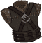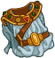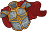
        
        
            Armor
        
    
    
        
            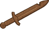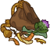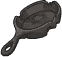
        
        
            Companion Ties
        
    
    
        
            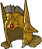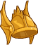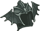
        
        
            Helmet
        
    
    
        
            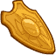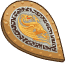
        
        
            Shield
        
    
    
        
            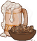
        
        
            Solace
        
    
    
        
            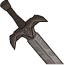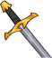
        
        
            Sword
        
    

# Feats

Unknown.

# Legendaries

Unknown.

# Adventures and Variants

**Unlock Adventure: The Bandit's Harvest (Caramon)** (Complete Area 50)
> Bandits are attempting to pilfer the harvest during Highharvestide and must be stopped.

 **Variant 1: The Mercenary Years** (Complete Area 75)
> Caramon starts in the formation. He can be moved, but not removed.   
> After area 50, only Champions affected by Caramon's Raise Spirits ability can deal damage.   
> 1 to 3 extra goblin enemies spawn with each wave of enemies. They do not drop gold nor count toward quest progress.   
> 

 **Variant 2: The War Begins** (Complete Area 125)
> Caramon starts in the formation. He can be moved, but not removed.   
> After area 100, only Champions affected at least twice by Caramon's Raise Spirits ability can deal damage.   
> Only Champions with the Tanking role, Champions of a Good alignment, or Champions with a STR of 16 or higher may be used.   
> 1 extra draconian enemy spawns in each area with the first wave of enemies. They do not drop gold nor count toward quest progress.  
> 

 **Variant 3: Why We Fight** (Complete Area 175)
> Caramon starts in the formation. He can be moved, but not removed.   
> After area 150, only Champions affected at least three times by Caramon's Raise Spirits ability can deal damage.   
> Tika takes up a position in the formation. Caramon may only be placed in spots adjacent to Tika.   
> Enemies move 100% faster and attack twice as often.   
> 

# Other Champion Images

    
        
            Console Portrait
        
    
    
        
            Gold Chest Icon
        
        
            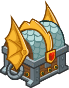Silver Chest Icon
        
    

[Back to Top](#top)

*Last Modified: {{ site.time }}*