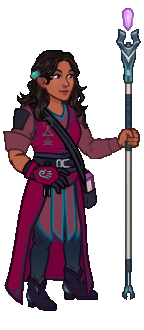
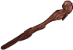
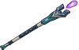
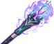
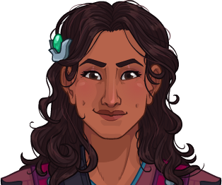

[Back to Main](index.md)

    
        
            
        
        
        Portrait
        
    
    
        
            
        
        
        Model
        
    

# Cazrin

Cazrin, a self-taught wizard determined to test her theoretical mettle against the real world.

[The Fallbacks: Bound for Ruin - Fandom Wiki](https://forgottenrealms.fandom.com/wiki/The_Fallbacks:_Bound_for_Ruin)

# Basic Information

Cazrin will be a new champion in the Highharvestide event on 3 September 2025.

    
        
            **Seat**:
        
        
            Unknown
        
    
    
        
            **Species**:
        
        
            Human (Guess)
        
    
    
        
            **Class**:
        
        
            Wizard (Guess)
        
    
    
        
            **Roles**:
        
        
            DPS / Support (Guess)
        
    
    
        
            **Age**:
        
        
            Unknown
        
    
    
        
            **Gender**:
        
        
            Female (Guess)
        
    
    
        
            **Alignment**:
        
        
            Unknown
        
    
    
        
            **Affiliation**:
        
        
            The Fallbacks (Guess)
        
    

# Formation

    <svg xmlns="http://www.w3.org/2000/svg" id="Cazrin" fill="#aaa" data-formationName="Cazrin" data-campaignName="Ahghairon's Day" width="324" height="140"><circle cx="175" cy="25" r="15"/><circle cx="175" cy="65" r="15"/><circle cx="135" cy="85" r="15"/><circle cx="95" cy="25" r="15"/><circle cx="95" cy="65" r="15"/><circle cx="95" cy="105" r="15"/><circle cx="55" cy="45" r="15"/><circle cx="55" cy="125" r="15"/><circle cx="15" cy="65" r="15"/><circle cx="15" cy="105" r="15"/><text x="205" y="25" fill="#dcdcdc" font-size="25" font-family="Arial" font-weight="bold">Cazrin</text><text x="205" y="65" fill="#dcdcdc" font-size="15" font-family="Arial" font-weight="bold">Ahghairon's Day</text></svg>

# Attacks

**Base Attack: Magic Missile** (Magic)
> Cazrin fires 2 magic missiles at random enemies, preferring different targets if possible  
> Cooldown: 4.5s (Cap 1.125s)

<em>Raw Data</em>

<pre>
{
    "id": 891,
    "name": "Magic Missile",
    "description": "Cazrin fires 2 magic missiles at random enemies, preferring different targets if possible",
    "long_description": "",
    "graphic_id": 27105,
    "target": "random",
    "num_targets": 2,
    "aoe_radius": 0,
    "damage_modifier": 1,
    "cooldown": 4.5,
    "animations": [
        {
            "type": "ranged_attack",
            "projectile": "magic_missile",
            "shoot_frame": 10,
            "shoot_offset_x": 55,
            "shoot_offset_y": -155,
            "projectile_delay": 0.1,
            "projectile_count": 2,
            "shoot_sound": 149,
            "hit_sound": 133,
            "projectile_details": {
                "projectile_graphic_id": 27105,
                "impact_offset_y": -45,
                "trail_tint": "#c999c3",
                "impact_tint": "#c999c3"
            }
        }
    ],
    "tags": [
        "ranged",
        "multitarget"
    ],
    "damage_types": [
        "magic"
    ]
}
</pre>

**Base Attack: Magic Missile** (Magic)
> Cazrin fires 3 magic missiles at random enemies, preferring different targets if possible  
> Cooldown: 4.5s (Cap 1.125s)

<em>Raw Data</em>

<pre>
{
    "id": 896,
    "name": "Magic Missile",
    "description": "Cazrin fires 3 magic missiles at random enemies, preferring different targets if possible",
    "long_description": "",
    "graphic_id": 27105,
    "target": "random",
    "num_targets": 3,
    "aoe_radius": 0,
    "damage_modifier": 1,
    "cooldown": 4.5,
    "animations": [
        {
            "type": "ranged_attack",
            "projectile": "magic_missile",
            "shoot_frame": 10,
            "shoot_offset_x": 55,
            "shoot_offset_y": -155,
            "projectile_delay": 0.1,
            "projectile_count": 3,
            "shoot_sound": 149,
            "hit_sound": 133,
            "projectile_details": {
                "projectile_graphic_id": 27105,
                "impact_offset_y": -45,
                "trail_tint": "#c999c3",
                "impact_tint": "#c999c3"
            }
        }
    ],
    "tags": [
        "ranged",
        "multitarget"
    ],
    "damage_types": [
        "magic"
    ]
}
</pre>

**Base Attack: Magic Missile** (Magic)
> Cazrin fires 4 magic missiles at random enemies, preferring different targets if possible  
> Cooldown: 4.5s (Cap 1.125s)

<em>Raw Data</em>

<pre>
{
    "id": 897,
    "name": "Magic Missile",
    "description": "Cazrin fires 4 magic missiles at random enemies, preferring different targets if possible",
    "long_description": "",
    "graphic_id": 27105,
    "target": "random",
    "num_targets": 4,
    "aoe_radius": 0,
    "damage_modifier": 1,
    "cooldown": 4.5,
    "animations": [
        {
            "type": "ranged_attack",
            "projectile": "magic_missile",
            "shoot_frame": 10,
            "shoot_offset_x": 55,
            "shoot_offset_y": -155,
            "projectile_delay": 0.1,
            "projectile_count": 4,
            "shoot_sound": 149,
            "hit_sound": 133,
            "projectile_details": {
                "projectile_graphic_id": 27105,
                "impact_offset_y": -45,
                "trail_tint": "#c999c3",
                "impact_tint": "#c999c3"
            }
        }
    ],
    "tags": [
        "ranged",
        "multitarget"
    ],
    "damage_types": [
        "magic"
    ]
}
</pre>

**Ultimate Attack: Fallback Fireball**
> Cazrin attacks all enemies with her version of a fireball.  
> Cooldown: 360s (Cap 90s)

<em>Raw Data</em>

<pre>
{
    "id": 892,
    "name": "Fallback Fireball",
    "description": "Cazrin attacks all enemies with a fireball.",
    "long_description": "Cazrin attacks all enemies with her version of a fireball.",
    "graphic_id": 27188,
    "target": "all",
    "num_targets": 1,
    "aoe_radius": 0,
    "damage_modifier": 0.03,
    "cooldown": 360,
    "animations": [
        {
            "type": "ultimate_attack",
            "ultimate": "cazrin",
            "projectile_data": {
                "type": "ranged_attack",
                "shoot_offset_y": -215,
                "shoot_offset_x": 165,
                "shoot_frame": 29,
                "shoot_sound": 149,
                "hit_sound": 133,
                "projectile_details": {
                    "hash": "7081d5ba41d98b53cc07844a3a0a219d",
                    "projectile_speed": 1500,
                    "projectile_graphic_id": 27104
                }
            },
            "damage_frame": 8
        }
    ],
    "tags": [
        "ranged",
        "ultimate"
    ],
    "damage_types": [
        "magic"
    ]
}
</pre>

**Base Attack: United Strike (Fallback Fireball)** (Ultimate)
> Cazrin directs all the Fallbacks to attack with their ultimate attack, including her own Fallback Fireball.  
> Cooldown: 360s (Cap 90s)

<em>Raw Data</em>

<pre>
{
    "id": 894,
    "name": "United Strike (Fallback Fireball)",
    "description": "Cazrin directs all the Fallbacks to make their ultimate attack.",
    "long_description": "Cazrin directs all the Fallbacks to attack with their ultimate attack, including her own Fallback Fireball.",
    "graphic_id": 26835,
    "target": "none",
    "num_targets": 0,
    "aoe_radius": 0,
    "damage_modifier": 0.03,
    "cooldown": 360,
    "animations": [
        {
            "type": "united_strike_ultimate"
        }
    ],
    "tags": [
        "magic"
    ],
    "damage_types": [
        "ultimate"
    ]
}
</pre>

**Base Attack: Call Uggie**
> Cazrin calls Uggie to her side.  
> Cooldown: 0s (Cap 0s)

<em>Raw Data</em>

<pre>
{
    "id": 893,
    "name": "Call Uggie",
    "description": "Cazrin calls Uggie to her side.",
    "long_description": "Cazrin calls Uggie to her side.",
    "graphic_id": 27102,
    "target": "none",
    "num_targets": 0,
    "aoe_radius": 0,
    "damage_modifier": 0,
    "cooldown": 0,
    "animations": [
        {
            "type": "call_uggie_ultimate",
            "no_damage_display": true
        }
    ],
    "tags": [
        "ignore_familiar",
        "ignore_cooldown_override"
    ],
    "damage_types": []
}
</pre>

# Abilities

**Unknown** (Guess)
> Uggie joins the party, starting next to Cazrin unless she's already in the formation next to another Fallbacks Champion. Uggie increases the damage of all non-adjacent Champions by 100%.

<em>Raw Data</em>

<pre>
{
    "id": 2412,
    "flavour_text": "",
    "description": {
        "desc": "Uggie joins the party, starting next to Cazrin unless she's already in the formation next to another Fallbacks Champion. Uggie increases the damage of all non-adjacent Champions by $amount%."
    },
    "effect_keys": [
        {
            "effect_string": "uggie_handler,100",
            "off_when_benched": true,
            "uggie_roaming_disable_index": 1,
            "uggie_priority": 3,
            "call_uggie_ult_id": 893,
            "united_strike_ult_id": 894,
            "use_computed_amount_for_description": true,
            "uggie_buff_effect_id": 2366,
            "reload_buff_def_upgrade_ids": [
                17681
            ]
        },
        {
            "effect_string": "disallow_roaming_familiar_ult_trigger",
            "apply_manually": true
        }
    ],
    "requirements": "",
    "graphic_id": 27102,
    "large_graphic_id": 27102,
    "properties": {
        "is_formation_ability": true,
        "owner_use_outgoing_description": true,
        "indexed_effect_properties": true,
        "per_effect_index_bonuses": true,
        "default_bonus_index": 0
    }
}
</pre>

**Library of Lore** (Guess)
> Whenever a boss is defeated for the first time in an adventure, it drops a Book that Cazrin collects. Subsequent kills of the same boss have a 10% chance of dropping an additional Book. The maximum number of Books that can be collected during a single adventure is the highest area reached divided by 5, rounded down. Cazrin keeps track of both the number of Books she has collected in the current adventure, as well as the size of her Library, which is the number of Books she has collected across all adventures. Cazrin's damage is increased by 10% for each book in her Library, stacking additively. Each time her Library reaches a new order of magnitude, the base buff is multiplicatively increased by 100%.

ⓘ *Note: This ability is prestack.*

<em>Raw Data</em>

<pre>
{
    "id": 2413,
    "flavour_text": "",
    "description": {
        "desc": "Whenever a boss is defeated for the first time in an adventure, it drops a Book that Cazrin collects. Subsequent kills of the same boss have a $chance% chance of dropping an additional Book. The maximum number of Books that can be collected during a single adventure is the highest area reached divided by $max_book_divisor, rounded down. Cazrin keeps track of both the number of Books she has collected in the current adventure, as well as the size of her Library, which is the number of Books she has collected across all adventures. Cazrin's damage is increased by $(amount___2)% for each book in her Library, stacking additively. Each time her Library reaches a new order of magnitude, the base buff is multiplicatively increased by $(amount___4)%."
    },
    "effect_keys": [
        {
            "effect_string": "library_of_lore_handler,1",
            "max_book_divisor": 5,
            "chance": 10,
            "off_when_benched": true
        },
        {
            "effect_string": "pre_stack,10",
            "skip_effect_key_desc": true
        },
        {
            "effect_string": "hero_dps_multiplier_add,10",
            "apply_manually": true,
            "amount_expr": "upgrade_amount(17673,1)",
            "stacks_multiply": false,
            "stacks_on_trigger": "will_manually_stack",
            "stack_title": "Books Collected",
            "show_bonus": true
        },
        {
            "effect_string": "buff_upgrade,100,17673,1",
            "stacks_multiply": true,
            "stacks_on_trigger": "will_manually_stack",
            "apply_manually": true
        }
    ],
    "requirements": "",
    "graphic_id": 27173,
    "large_graphic_id": 27166,
    "properties": {
        "is_formation_ability": true,
        "owner_use_outgoing_description": true,
        "indexed_effect_properties": true,
        "per_effect_index_bonuses": true,
        "default_bonus_index": 1
    }
}
</pre>

**Sunny Disposition** (Guess)
> Cazrin increases the damage of all Champions in her column (including herself) and the columns in front of her by 100%.

<em>Raw Data</em>

<pre>
{
    "id": 2414,
    "flavour_text": "",
    "description": {
        "desc": "Cazrin increases the damage of all Champions in her column (including herself) and the columns in front of her by $amount%."
    },
    "effect_keys": [
        {
            "effect_string": "hero_dps_multiplier_mult,100",
            "off_when_benched": true,
            "targets": [
                "col_and_ahead"
            ]
        }
    ],
    "requirements": "",
    "graphic_id": 27175,
    "large_graphic_id": 27168,
    "properties": {
        "is_formation_ability": true,
        "owner_use_outgoing_description": true,
        "indexed_effect_properties": true,
        "per_effect_index_bonuses": true,
        "default_bonus_index": 0
    }
}
</pre>

**Unctuous Uggie** (Guess)
> Uggie's buff is increased by 400% when Cazrin is in the formation.

<em>Raw Data</em>

<pre>
{
    "id": 2415,
    "flavour_text": "",
    "description": {
        "desc": "Uggie's buff is increased by $amount% when Cazrin is in the formation."
    },
    "effect_keys": [
        {
            "effect_string": "unleash_uggie_contribution,400",
            "off_when_benched": true,
            "show_bonus": false
        }
    ],
    "requirements": "",
    "graphic_id": 27176,
    "large_graphic_id": 27169,
    "properties": {
        "is_formation_ability": true,
        "owner_use_outgoing_description": true,
        "indexed_effect_properties": true,
        "per_effect_index_bonuses": true,
        "default_bonus_index": 0
    }
}
</pre>

**Mage Armour** (Guess)
> The first time anyone in the formation takes damage in each area, Cazrin casts Mage Armor on herself. Champions affected by Mage Armor decrease the damage they take by 25%.

<em>Raw Data</em>

<pre>
{
    "id": 2416,
    "flavour_text": "",
    "description": {
        "desc": "The first time anyone in the formation takes damage in each area, Cazrin casts Mage Armor on herself. Champions affected by Mage Armor decrease the damage they take by $(amount___2)%."
    },
    "effect_keys": [
        {
            "effect_string": "apply_effects_at_stacks",
            "off_when_benched": true,
            "show_description": false,
            "apply_effect_stack_amounts": [
                1,
                1
            ],
            "max_stacks": 1,
            "stacks_on_trigger": "hero_damaged",
            "more_triggers": [
                {
                    "trigger": "area_changed",
                    "action": {
                        "type": "reset"
                    }
                }
            ]
        },
        {
            "effect_string": "damage_reduction,25",
            "targets": [
                "self_slot"
            ],
            "apply_manually": true
        },
        {
            "effect_string": "animation_synced_overlay_on_stat",
            "stat": "cazrin_books_collected_this_adventure",
            "instanced": true,
            "stat_keys": [
                0,
                120
            ],
            "graphics": [
                "mage_armor_graphic_id",
                "empowered_mage_armor_graphic_id"
            ],
            "default_graphic_ids": [
                27351,
                27352
            ],
            "apply_manually": true
        }
    ],
    "requirements": "",
    "graphic_id": 27174,
    "large_graphic_id": 27167,
    "properties": {
        "is_formation_ability": true,
        "owner_use_outgoing_description": true,
        "indexed_effect_properties": true,
        "per_effect_index_bonuses": true,
        "default_bonus_index": 1
    }
}
</pre>

**In Search of Knowledge** (Guess)
> In Search of Knowledge - Cazrin's attacks and abilities gain additional effects based on the number of Books that she has collected in the current adventure:  
>  - 10+ Books (area 50/20+): Cazrin fires an additional Magic Missile with her base attack.  
>  - 40+ Books (area 200/70+): Increase the effect of Sunny Disposition by 50% for each Book she has collected in the current adventure, stacking multiplicatively.  
>  - 80+ Books (area 400/135+): Cazrin fires an additional Magic Missile with her base attack.   
>  - 120+ Books (area 600/200+): When triggered, Mage Armor is now cast on all Champions in the formation instead of just Cazrin.  
>  - 160+ Books (area 800/270+): Increase the effect of Unctuous Uggie by 50% for each Book Cazrin has collected in the current adventure, stacking additively.  
>  - 200+ Books (area 1000/335+): Support Champions affected by Mage Armor have a 50% chance to deal an additional 5 seconds of BUD damage with each normal attack hit.  
>  - 240+ Books (area 1200/400+): Mage Armor's damage prevention is increased to 50%.  
>  - 300+ Books (area 1500/500+): For each Tanking Champion affected by Mage Armor, the effect of Sunny Disposition is increased by 50%, stacking multiplicatively.

<em>Raw Data</em>

<pre>
{
    "id": 2417,
    "flavour_text": "",
    "description": {
        "desc": "In Search of Knowledge - Cazrin's attacks and abilities gain additional effects based on the number of Books that she has collected in the current adventure:^^ - 10+ Books (area 50/20+): Cazrin fires an additional Magic Missile with her base attack.^^ - 40+ Books (area 200/70+): Increase the effect of Sunny Disposition by $(amount___3)% for each Book she has collected in the current adventure, stacking multiplicatively.^^ - 80+ Books (area 400/135+): Cazrin fires an additional Magic Missile with her base attack. ^^ - 120+ Books (area 600/200+): When triggered, Mage Armor is now cast on all Champions in the formation instead of just Cazrin.^^ - 160+ Books (area 800/270+): Increase the effect of Unctuous Uggie by $(amount___6)% for each Book Cazrin has collected in the current adventure, stacking additively.^^ - 200+ Books (area 1000/335+): Support Champions affected by Mage Armor have a $(amount___7)% chance to deal an additional 5 seconds of BUD damage with each normal attack hit.^^ - 240+ Books (area 1200/400+): Mage Armor's damage prevention is increased to $(amount_desc___8)%.^^ - 300+ Books (area 1500/500+): For each Tanking Champion affected by Mage Armor, the effect of Sunny Disposition is increased by $(amount___9)%, stacking multiplicatively."
    },
    "effect_keys": [
        {
            "effect_string": "apply_effects_at_stacks",
            "off_when_benched": true,
            "show_description": false,
            "apply_effect_stack_amounts": [
                10,
                40,
                80,
                120,
                120,
                160,
                200,
                240,
                300
            ],
            "stacks_on_trigger": "will_stack_manually",
            "stacks_from_amount_func": "get_stat",
            "instance_stat": true,
            "stat": "cazrin_books_collected_this_adventure",
            "amount_updated_listeners": [
                "stat_changed,cazrin_books_collected_this_adventure",
                "slot_changed"
            ],
            "stack_title": "Books Collected This Adventure",
            "show_stacks": true
        },
        {
            "effect_string": "change_base_attack,896",
            "apply_manually": true
        },
        {
            "effect_string": "buff_upgrade,5,17674",
            "stacks_from_amount_func": "get_stat",
            "stacks_multiply": true,
            "instance_stat": true,
            "stat": "cazrin_books_collected_this_adventure",
            "amount_updated_listeners": [
                "stat_changed,cazrin_books_collected_this_adventure",
                "slot_changed"
            ],
            "apply_manually": true
        },
        {
            "effect_string": "change_base_attack,897",
            "apply_manually": true
        },
        {
            "effect_string": "change_upgrade_data,17676,1",
            "data": {
                "targets": [
                    "all"
                ]
            },
            "apply_manually": true
        },
        {
            "effect_string": "change_upgrade_data,17676,2",
            "data": {
                "graphic_id": 27352
            },
            "apply_manually": true
        },
        {
            "effect_string": "buff_upgrade_add_then_mult,1,17675",
            "amount_func": "add",
            "stack_func": "get_stat",
            "stacks_multiply": false,
            "instance_stat": true,
            "stat": "cazrin_books_collected_this_adventure",
            "amount_updated_listeners": [
                "stat_changed,cazrin_books_collected_this_adventure",
                "slot_changed"
            ],
            "apply_manually": true
        },
        {
            "effect_string": "add_monster_hit_effects,5",
            "chance": 40,
            "monster_effect": {
                "effect_string": "ki_explosion,$amount,1,1"
            },
            "after_damage": true,
            "targets": [
                "all"
            ],
            "filter_targets": [
                {
                    "type": "by_tags",
                    "tags": "support"
                },
                {
                    "type": "affected_by_upgrade",
                    "upgrade_id": 17676
                }
            ],
            "apply_manually": true
        },
        {
            "effect_string": "change_upgrade_data,17676,1",
            "data": {
                "amount": 50
            },
            "amount_desc": 50,
            "apply_manually": true
        },
        {
            "effect_string": "buff_upgrade,400,17674",
            "amount_func": "mult",
            "stack_func": "per_hero_attribute",
            "per_hero_expr": "HasTag(`tanking`)",
            "apply_manually": true
        }
    ],
    "requirements": "",
    "graphic_id": 27172,
    "large_graphic_id": 27165,
    "properties": {
        "is_formation_ability": true,
        "owner_use_outgoing_description": true,
        "indexed_effect_properties": true,
        "per_effect_index_bonuses": true,
        "default_bonus_index": 0
    }
}
</pre>

# Specialisations

**Self Taught** (Guess)
> Cazrin increases the damage bonus of Sunny Disposition by 100% for each Fallbacks Champion and/or Champions with a Melee and/or Ranged base attack in the formation, stacking multiplicatively.

ⓘ *Note: This ability is prestack.*

<em>Raw Data</em>

<pre>
{
    "id": 2418,
    "flavour_text": "",
    "description": {
        "desc": "Cazrin increases the damage bonus of Sunny Disposition by $amount% for each Fallbacks Champion and/or Champions with a Melee and/or Ranged base attack in the formation, stacking multiplicatively."
    },
    "effect_keys": [
        {
            "effect_string": "pre_stack,100",
            "skip_effect_key_desc": true
        },
        {
            "effect_string": "buff_upgrade,100,17674",
            "amount_expr": "upgrade_amount(17678,0)",
            "off_when_benched": true,
            "amount_func": "mult",
            "stack_func": "per_hero_attribute",
            "per_hero_expr": "HasTag(`fallbacks`) || has_base_attack_dmg_type_melee || has_base_attack_dmg_type_ranged",
            "show_bonus": true
        }
    ],
    "requirements": "",
    "graphic_id": 27184,
    "large_graphic_id": 27184,
    "properties": {
        "is_formation_ability": true,
        "owner_use_outgoing_description": true,
        "indexed_effect_properties": true,
        "per_effect_index_bonuses": true,
        "default_bonus_index": 0,
        "spec_option_post_apply_info": "Qualified Champions: $num_stacks___2"
    }
}
</pre>

**Ancestor's Shadow** (Guess)
> Cazrin increases the damage bonus of Sunny Disposition by 100% for each Fallbacks Champion and/or Good Champion in the formation, stacking multiplicatively.

ⓘ *Note: This ability is prestack.*

<em>Raw Data</em>

<pre>
{
    "id": 2419,
    "flavour_text": "",
    "description": {
        "desc": "Cazrin increases the damage bonus of Sunny Disposition by $amount% for each Fallbacks Champion and/or Good Champion in the formation, stacking multiplicatively."
    },
    "effect_keys": [
        {
            "effect_string": "pre_stack,100",
            "skip_effect_key_desc": true
        },
        {
            "effect_string": "buff_upgrade,100,17674",
            "amount_expr": "upgrade_amount(17679,0)",
            "off_when_benched": true,
            "amount_func": "mult",
            "stack_func": "per_hero_attribute",
            "per_hero_expr": "HasTag(`fallbacks`) || HasTag(`good`)",
            "show_bonus": true
        }
    ],
    "requirements": "",
    "graphic_id": 27182,
    "large_graphic_id": 27182,
    "properties": {
        "is_formation_ability": true,
        "owner_use_outgoing_description": true,
        "indexed_effect_properties": true,
        "per_effect_index_bonuses": true,
        "default_bonus_index": 0,
        "spec_option_post_apply_info": "Qualified Champions: $num_stacks___2"
    }
}
</pre>

**In the Library** (Guess)
> Whenever a boss drops a Book, Cazrin collects 3 Books. The maximum number of Books she can collect during this adventure is tripled, but In Search of Knowledge's per Book damage boost to Sunny Disposition is reduced from 5% to 1.65%.

<em>Raw Data</em>

<pre>
{
    "id": 2420,
    "flavour_text": "",
    "description": {
        "desc": "Whenever a boss drops a Book, Cazrin collects $amount_desc Books. The maximum number of Books she can collect during this adventure is tripled, but In Search of Knowledge's per Book damage boost to Sunny Disposition is reduced from 5% to $(amount_desc___2)%. "
    },
    "effect_keys": [
        {
            "effect_string": "change_upgrade_data,17673,0",
            "off_when_benched": true,
            "data": {
                "amount": 3
            },
            "amount_desc": 3
        },
        {
            "effect_string": "change_upgrade_data,17677,2",
            "off_when_benched": true,
            "data": {
                "amount": 1.65
            },
            "amount_desc": 1.65
        }
    ],
    "requirements": "",
    "graphic_id": 27183,
    "large_graphic_id": 27183,
    "properties": {
        "is_formation_ability": true,
        "owner_use_outgoing_description": true,
        "indexed_effect_properties": true,
        "per_effect_index_bonuses": true,
        "default_bonus_index": 0
    }
}
</pre>

**Signature Smell** (Guess)
> When Uggie is with Cazrin, each damage increase that Uggie! would normally apply to other members of the formation instead applies to Cazrin herself, stacking multiplicatively.

<em>Raw Data</em>

<pre>
{
    "id": 2421,
    "flavour_text": "",
    "description": {
        "desc": "When Uggie is with Cazrin, each damage increase that Uggie! would normally apply to other members of the formation instead applies to Cazrin herself, stacking multiplicatively."
    },
    "effect_keys": [
        {
            "effect_string": "cazrin_uggie_spec_handler",
            "off_when_benched": true,
            "spec_effect_index": 1
        },
        {
            "effect_string": "change_upgrade_data,17672,0",
            "apply_manually": true,
            "data": {
                "uggie_buff_effect_id": 2424
            }
        }
    ],
    "requirements": "",
    "graphic_id": 27185,
    "large_graphic_id": 27185,
    "properties": {
        "is_formation_ability": true,
        "owner_use_outgoing_description": true,
        "indexed_effect_properties": true,
        "per_effect_index_bonuses": true,
        "default_bonus_index": 0
    }
}
</pre>

**Smell Mastery** (Guess)
> When Uggie is with Cazrin, In Search of Knowledge's per-Book bonus for Sunny Disposition is increased by 100%.

<em>Raw Data</em>

<pre>
{
    "id": 2422,
    "flavour_text": "",
    "description": {
        "desc": "When Uggie is with Cazrin, In Search of Knowledge's per-Book bonus for Sunny Disposition is increased by $amount___2%."
    },
    "effect_keys": [
        {
            "effect_string": "cazrin_uggie_spec_handler",
            "off_when_benched": true,
            "spec_effect_index": 1
        },
        {
            "effect_string": "buff_upgrade,100,17677,2",
            "apply_manually": true
        }
    ],
    "requirements": "",
    "graphic_id": 27186,
    "large_graphic_id": 27186,
    "properties": {
        "is_formation_ability": true,
        "owner_use_outgoing_description": true,
        "indexed_effect_properties": true,
        "per_effect_index_bonuses": true,
        "default_bonus_index": 0
    }
}
</pre>

# Items

    
        
            **Icons**
        
        
            **Name**
        
    
    
        
            
        
        
            Fallbacks Items
        
    
    
        
            
        
        
            Robes
        
    
    
        
            
        
        
            Spellbook
        
    
    
        
            
        
        
            Staff
        
    
    
        
            
        
        
            Uggie Stuff
        
    
    
        
            
        
        
            Wands
        
    

# Feats

Unknown.

# Legendaries

Unknown.

# Adventures and Variants

**Unlock Adventure: The Bandit's Harvest (Cazrin)** (Complete Area 50)
> Bandits are attempting to pilfer the harvest during Highharvestide and must be stopped.

 **Variant 1: Time For Tea** (Complete Area 75)
> Cazrin starts in the formation with her Sunny Disposition ability unlocked. She can't be moved or removed.  
> Only Cazrin and Champions buffed by both her and Uggie can deal damage.  
> 1-2 Animated Tea Set constructs spawn with each wave. They don't drop gold nor count towards quest progress.  
> Getting to Know Cazrin and Uggie: Cazrin increases the damage of Champions in her column and the columns ahead of her, while Uggie increases the damage of Champions not next to Uggie. Will you focus on Cazrin being your damage dealer, or another Champion?

 **Variant 2: The Company of the Tavern** (Complete Area 125)
> Cazrin starts in the formation. She can be moved but not removed.  
> Starting in area 11, a thrown mug hits a random Champion every second, dealing 25% of their max health in damage. This does not happen for the first 5 seconds of every area.  
> Two revelers join the formation. They are so distracting that Champions next to them deal no damage with their base attacks.  
> Getting to Know Cazrin: Cazrin protects herself with Mage Armor when the formation is under attack. She extends her protection to the whole formation after she recovers enough books.

 **Variant 3:  In Shambles** (Complete Area 175)
> Cazrin starts in the formation. She can be moved but not removed.  
> You may only use Good Champions, Champions with a Melee or Ranged attack, or Fallbacks Champions.  
> Starting in area 11, a thrown rock hits a random Champion every second, dealing 25% of their max health in damage and stunning them for 3 seconds. This does not happen for the first 5 seconds of every area.  
> At the start of each boss area, a Shambling Mound spawns as an additional boss. It must also be defeated to progress.  
> Getting to Know Cazrin: Cazrin's first specialization choice determines which Champions she works best with, and her second choice determines if her Support or Damage Dealing capabilities are buffed when Uggie is assigned to her.

# Other Champion Images

    
        
            Console Portrait
        
    
    
        
            Gold Chest Icon
        
        
            Silver Chest Icon
        
    

[Back to Top](#top)

*Last Modified: {{ site.time }}*