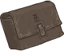

[Back to Main](index.md)

# Certainty Dran

Omin's Daughter - apparently. Possibly a new member of Acquisitions Incorporated affiliation and in time for their season.

Info from a wiki.
> Certainty Dran is the Head Secretarian at Acquisitions Incorporated headquarters. She communicates with other franchise teams through their documancy ledgers, passing on orders from Omin Dran, who also happens to be her father.

[Wiki Link](https://acquisitionsincorporated.fandom.com/wiki/Certainty_Dran)

# Basic Information

Certainty will be the new champion in the Highharvestide event on 27 September 2023.

    
        
            **Seat**:
        
        
            Unknown
        
    
    
        
            **Race**:
        
        
            Unknown
        
    
    
        
            **Class**:
        
        
            Bard / Fighter (Guess)
        
    
    
        
            **Roles**:
        
        
            Unknown
        
    
    
        
            **Age**:
        
        
            19 (Guess)
        
    
    
        
            **Gender**:
        
        
            Female (Guess)
        
    
    
        
            **Alignment**:
        
        
            Unknown
        
    
    
        
            **Affiliation**:
        
        
            Acquisitions Incorporated (Guess)
        
    

# Formation

    

# Abilities

**Base Attack: Jim's Magic Missile** (Magic)
> Certainty attacks random enemies with a version of Jim's patented magic missile spell.
> Cooldown: 5s (Cap 1.25s)

<em>Raw Data</em>

<pre>
{
    "description": "Certainty attacks random enemies with a version of Jim's patented magic missile spell.",
    "long_description": "",
    "damage_modifier": 1,
    "damage_types": ["magic"],
    "graphic_id": 0,
    "target": "random",
    "aoe_radius": 0,
    "tags": [
        "monster",
        "ranged"
    ],
    "num_targets": 2,
    "animations": [{
        "projectile_count": 2,
        "hit_sound": 133,
        "shoot_offset_y": -80,
        "shoot_offset_x": 50,
        "shoot_sound": 149,
        "projectile_delay_no_pause": 0.2,
        "type": "ranged_attack",
        "projectile": "magic_missile",
        "hold_shoot_frame": false,
        "shoot_frame": 3
    }],
    "name": "Jim's Magic Missile",
    "cooldown": 5,
    "id": 682
}
</pre>

**Ultimate Attack: Airship Attack**
> A barrage of fire from Certainty's enlarged toy airship flings up to 10 enemies off the screen.
> Cooldown: 1s (Cap 0.25s)

<em>Raw Data</em>

<pre>
{
    "description": "A barrage of fire from Certainty's enlarged toy airship flings up to 10 enemies off the screen.",
    "long_description": "A barrage of fire from Certainty's enlarged toy airship flings up to 10 enemies off the screen.",
    "damage_modifier": 1,
    "damage_types": ["magic"],
    "graphic_id": 20577,
    "target": "all",
    "aoe_radius": 0,
    "tags": [
        "ranged",
        "ultimate"
    ],
    "num_targets": 0,
    "animations": [{
        "projectile_details": {
            "trail": {
                "scale_lerp": [
                    {
                        "x": 0.5,
                        "y": 0.5
                    },
                    {
                        "x": 0,
                        "y": 0
                    }
                ],
                "lifespan": 0.5,
                "initial_velocity": {
                    "x": 0,
                    "y": 0
                },
                "alpha_lerp": {
                    "0": 0,
                    "1": 0,
                    "0.1": 0.5
                },
                "particle_graphic_ids": [693],
                "spawn_rate": 150,
                "velocity_jitter": {
                    "x": 30,
                    "y": 30
                }
            },
            "projectile_graphic_id": 20530,
            "projectile_speed": 2000,
            "hash": "9ba15ca9aad1c276fcc13c07c5633f04"
        },
        "ultimate": "certainty",
        "type": "ultimate_attack"
    }],
    "name": "Airship Attack",
    "cooldown": 1,
    "id": 683
}
</pre>

**Secretarian's Advice**
> Certainty increases the damage of Champions in the column in front of her by `$(amount)%`.

<em>Raw Data</em>

<pre>
{
    "effect_keys": [{
        "off_when_benched": true,
        "effect_string": "hero_dps_multiplier_mult,100",
        "targets": ["next_col"]
    }],
    "requirements": "",
    "description": {"desc": "Certainty increases the damage of Champions in the column in front of her by $(amount)%."},
    "id": 1675,
    "flavour_text": "",
    "graphic_id": 20573,
    "properties": {
        "is_formation_ability": true,
        "owner_use_outgoing_description": true
    }
}
</pre>

**Reboot Expert**
> Certainty increases the effect of Secretarian's Advice by `$(amount)%` each time she has been in an adventure for at least `$(num_areas___2)` areas when it is reset. This stacks additively and persists through resets.

<em>Raw Data</em>

<pre>
{
    "effect_keys": [
        {
            "stack_title": "Reboot Stacks",
            "manual_stacking": true,
            "stacks_multiply": false,
            "show_bonus": true,
            "effect_string": "buff_upgrade,100,12505"
        },
        {
            "effect_string": "certainty_reboot_expert",
            "buff_index": 0,
            "num_areas": 250
        }
    ],
    "requirements": "",
    "description": {
        "pre": "Certainty increases the effect of Secretarian's Advice by $(amount)% each time she has been in an adventure for at least $(num_areas___2) areas when it is reset. This stacks additively and persists through resets.",
        "conditions": [{
            "condition": "not static_desc",
            "desc": "^^Current Adventure:$(certainty_reboot_desc)"
        }]
    },
    "id": 1676,
    "flavour_text": "",
    "graphic_id": 20572,
    "properties": {
        "indexed_effect_properties": true,
        "is_formation_ability": true,
        "default_bonus_index": 0,
        "owner_use_outgoing_description": true,
        "per_effect_index_bonuses": true
    }
}
</pre>

**Financing Rounds**
> Certainty increases the effect of Secretarian's Advice and your Gold Find by `$(amount)%` for each level on Acquisitions Incorporated or 'C' Team Champions in the formation, stacking additively. Each Champion's contribution caps at `$(max_levels_past_soft_cap)` levels after their last available upgrade.

<em>Raw Data</em>

<pre>
{
    "effect_keys": [
        {
            "max_levels_past_soft_cap": 1000,
            "amount_updated_listeners": [
                "hero_level_changed",
                "area_completed",
                "slot_changed"
            ],
            "stacks_multiply": false,
            "off_when_benched": true,
            "show_bonus": true,
            "amount_func": "add",
            "stack_func": "per_hero_level_past_softcap",
            "per_hero_expr": "floor(max(has_tag_acqinc,has_tag_cteam)*min(hero_level,hero_softcap+max_levels_past_soft_cap))",
            "effect_string": "gold_multiplier_mult,1"
        },
        {
            "max_levels_past_soft_cap": 1000,
            "amount_updated_listeners": [
                "hero_level_changed",
                "area_completed",
                "slot_changed"
            ],
            "stacks_multiply": false,
            "off_when_benched": true,
            "amount_func": "add",
            "stack_func": "per_hero_level_past_softcap",
            "per_hero_expr": "floor(max(has_tag_acqinc,has_tag_cteam)*min(hero_level,hero_softcap+max_levels_past_soft_cap))",
            "effect_string": "buff_upgrade,1,12505"
        }
    ],
    "requirements": "",
    "description": {"desc": "Certainty increases the effect of Secretarian's Advice and your Gold Find by $(amount)% for each level on Acquisitions Incorporated or 'C' Team Champions in the formation, stacking additively. Each Champion's contribution caps at $(max_levels_past_soft_cap) levels after their last available upgrade."},
    "id": 1677,
    "flavour_text": "",
    "graphic_id": 20571,
    "properties": {
        "indexed_effect_properties": true,
        "is_formation_ability": true,
        "default_bonus_index": 0,
        "owner_use_outgoing_description": true,
        "per_effect_index_bonuses": true
    }
}
</pre>

**Dad and Uncle Jim**
> Certainty helps her father Omin by recruiting all Champions adjacent to her to be Champions of Tymora, and she helps her 'uncle' Jim Darkmagic by increasing his damage by `$(amount___2)%` due to royalty payments for using his spell.

<em>Raw Data</em>

<pre>
{
    "effect_keys": [
        {
            "amount_updated_listeners": ["slot_changed"],
            "off_when_benched": true,
            "add_targets": [{
                "use_source_as_base_slot": true,
                "type": "adj"
            }],
            "effect_string": "add_target_to_upgrade,,12299"
        },
        {
            "amount_updated_listeners": ["slot_changed"],
            "effect_string": "hero_dps_multiplier_mult,200",
            "targets": [{
                "hero_ids": [
                    48,
                    108
                ],
                "type": "heroes"
            }]
        }
    ],
    "requirements": "",
    "description": {"desc": "Certainty helps her father Omin by recruiting all Champions adjacent to her to be Champions of Tymora, and she helps her 'uncle' Jim Darkmagic by increasing his damage by $(amount___2)% due to royalty payments for using his spell."},
    "id": 1678,
    "flavour_text": "",
    "graphic_id": 20569,
    "properties": {
        "indexed_effect_properties": true,
        "is_formation_ability": true,
        "default_bonus_index": 0,
        "owner_use_outgoing_description": true,
        "per_effect_index_bonuses": true
    }
}
</pre>

**Employee Evaluations**
> Certainty assesses the average score of her preferred ability (INT or CHA) of the Champions in the column in front of her and increases the damage effect of Secretarian's Advice by `$(not_buffed amount)%` for each full point over `$(min_stat_amount)`, stacking multiplicatively.

<em>Raw Data</em>

<pre>
{
    "effect_keys": [{
        "amount_updated_listeners": [
            "slot_changed",
            "feat_changed"
        ],
        "stacks_multiply": true,
        "off_when_benched": true,
        "show_bonus": true,
        "per_hero_targets": ["next_col"],
        "amount_func": "mult",
        "stack_func": "per_hero_attribute",
        "min_stat_amount": 13,
        "per_hero_expr": "int",
        "effect_string": "buff_upgrade,200,12505",
        "post_process_expr": "max(0,input/max(1,num_targets)-min_stat_amount)"
    }],
    "requirements": "",
    "description": {"desc": "Certainty assesses the average score of her preferred ability (INT or CHA) of the Champions in the column in front of her and increases the damage effect of Secretarian's Advice by $(not_buffed amount)% for each full point over $(min_stat_amount), stacking multiplicatively."},
    "id": 1679,
    "flavour_text": "",
    "graphic_id": 20570,
    "properties": {
        "is_formation_ability": true,
        "owner_use_outgoing_description": true
    }
}
</pre>

# Specialisations

**Specialisation: Best and the Brightest** (Guess)
> Certainty's preferred ability is Intelligence and she grants a +`$(amount)` INT bonus to all Champions in the column in front of her.

<em>Raw Data</em>

<pre>
{
    "effect_keys": [{
        "amount_updated_listeners": [
            "slot_changed",
            "feat_changed"
        ],
        "effect_string": "increase_ability_score_not_always_on,int,1",
        "targets": ["next_col"]
    }],
    "requirements": "",
    "description": {"desc": "Certainty's preferred ability is Intelligence and she grants a +$(amount) INT bonus to all Champions in the column in front of her."},
    "id": 1680,
    "flavour_text": "",
    "graphic_id": 20842,
    "properties": {
        "is_formation_ability": true,
        "owner_use_outgoing_description": true,
        "type": "upgrade"
    }
}
</pre>

**Specialisation: Smooth Negotiators** (Guess)
> Certainty's preferred ability is Charisma and she grants a +`$(amount)` CHA bonus to all Champions in the column in front of her.

<em>Raw Data</em>

<pre>
{
    "effect_keys": [{
        "amount_updated_listeners": [
            "slot_changed",
            "feat_changed"
        ],
        "effect_string": "increase_ability_score_not_always_on,cha,1",
        "targets": ["next_col"]
    }],
    "requirements": "",
    "description": {"desc": "Certainty's preferred ability is Charisma and she grants a +$(amount) CHA bonus to all Champions in the column in front of her."},
    "id": 1681,
    "flavour_text": "",
    "graphic_id": 20843,
    "properties": {
        "is_formation_ability": true,
        "owner_use_outgoing_description": true,
        "type": "upgrade"
    }
}
</pre>

**Specialisation: Employee Evaluations** (Guess)
> Certainty assesses the average score of her preferred ability (INT or CHA) of the Champions in the column in front of her and increases the damage effect of Secretarian's Advice by `$(not_buffed amount)%` for each full point over `$(min_stat_amount)`, stacking multiplicatively.

<em>Raw Data</em>

<pre>
{
    "effect_keys": [{
        "amount_updated_listeners": [
            "slot_changed",
            "feat_changed"
        ],
        "stacks_multiply": true,
        "off_when_benched": true,
        "show_bonus": true,
        "per_hero_targets": ["next_col"],
        "amount_func": "mult",
        "stack_func": "per_hero_attribute",
        "min_stat_amount": 13,
        "per_hero_expr": "cha",
        "effect_string": "buff_upgrade,200,12505",
        "post_process_expr": "max(0,input/max(1,num_targets)-min_stat_amount)"
    }],
    "requirements": "",
    "description": {"desc": "Certainty assesses the average score of her preferred ability (INT or CHA) of the Champions in the column in front of her and increases the damage effect of Secretarian's Advice by $(not_buffed amount)% for each full point over $(min_stat_amount), stacking multiplicatively."},
    "id": 1682,
    "flavour_text": "",
    "graphic_id": 20570,
    "properties": {
        "is_formation_ability": true,
        "owner_use_outgoing_description": true
    }
}
</pre>

# Items

    
        
            **Icons**
        
        
            **Name**
        
    
    
        
            
        
        
            Airship Stuff
        
    
    
        
            
        
        
            Clothing
        
    
    
        
            
        
        
            Music Instruments
        
    
    
        
            
        
        
            School Items
        
    
    
        
            
        
        
            Secretarian Items
        
    
    
        
            
        
        
            Time Stuff
        
    

# Feats

Unknown.

# Legendaries

Unknown.

# Champion Images

    
        
            Console Portait
        
    
    
        
            Gold Chest Icon
        
        
            Silver Chest Icon
        
    

[Back to Top](#top)

*Last Modified: {{ site.time }}*