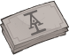

[Back to Main](index.md)

    
        Portait
    
    
        Model
    

# Certainty Dran

Certainty Dran, the heiress apparent of Acquisitions Incorporated, is endowed with knowledge surpassing even her father, Omin Dran, and privileged with access to the finest schools and resources. With a fusion of martial skill, clever magic, and unwavering self-belief, Certainty is certainly an unstoppable force.

# Basic Information

Certainty will be the new champion in the Highharvestide event on 27 September 2023.

    
        
            **Seat**:
        
        
            5
        
        
            **Stat**
        
        
            **Value**
        
        
            **Day 1 Trials**
        
        
            **Patrons**
        
    
    
        
            **Race**:
        
        
            Half-Elf / Aasimar
        
        
            **Strength**:
        
        
            14
        
        
            Yes
        
        
            Mirt
        
    
    
        
            **Class**:
        
        
            Wizard / Bard
        
        
            **Dexterity**:
        
        
            12
        
        
            Yes
        
        
            -
        
    
    
        
            **Roles**:
        
        
            Support / Gold
        
        
            **Constitution**:
        
        
            12
        
        
            Yes
        
        
            Strahd
        
    
    
        
            **Age**:
        
        
            19
        
        
            **Intelligence**:
        
        
            16
        
        
            Yes
        
        
            Zariel
        
    
    
        
            **Gender**:
        
        
            Female
        
        
            **Wisdom**:
        
        
            13
        
        
            Yes
        
        
            &nbsp;
        
    
    
        
            **Alignment**:
        
        
            Neutral Good
        
        
            **Charisma**:
        
        
            16
        
        
            Yes
        
        
            &nbsp;
        
    
    
        
            **Affiliation**:
        
        
            Acquisitions Incorporated
        
        
            **Total**:
        
        
            83
        
        
            &nbsp;
        
        
            &nbsp;
        
    

# Formation

    

# Abilities

 **Base Attack: Jim's Magic Missile** (Magic)
> Certainty attacks random enemies with a version of Jim's patented magic missile spell.  
> Cooldown: 5s (Cap 1.25s)

<em>Raw Data</em>

<pre>
{
    "description": "Certainty attacks random enemies with a version of Jim's patented magic missile spell.",
    "long_description": "",
    "damage_modifier": 1,
    "damage_types": ["magic"],
    "graphic_id": 0,
    "target": "random",
    "aoe_radius": 0,
    "tags": [
        "monster",
        "ranged"
    ],
    "num_targets": 2,
    "animations": [{
        "projectile_count": 2,
        "hit_sound": 133,
        "shoot_offset_y": -80,
        "shoot_offset_x": 50,
        "shoot_sound": 149,
        "projectile_delay_no_pause": 0.2,
        "type": "ranged_attack",
        "projectile": "magic_missile",
        "hold_shoot_frame": false,
        "shoot_frame": 3
    }],
    "name": "Jim's Magic Missile",
    "cooldown": 5,
    "id": 682
}
</pre>

 **Ultimate Attack: Airship Attack** (Level: 120)
> A barrage of fire from Certainty's enlarged toy airship flings up to 10 enemies off the screen.  
> Cooldown: 280s (Cap 70s)

<em>Raw Data</em>

<pre>
{
    "description": "A barrage of fire from Certainty's enlarged toy airship flings up to 10 enemies off the screen.",
    "long_description": "A barrage of fire from Certainty's enlarged toy airship flings up to 10 enemies off the screen.",
    "damage_modifier": 0.03,
    "damage_types": ["magic"],
    "graphic_id": 20577,
    "target": "all",
    "aoe_radius": 0,
    "tags": [
        "ranged",
        "ultimate"
    ],
    "num_targets": 0,
    "animations": [{
        "projectile_details": {
            "trail": {
                "scale_lerp": [
                    {
                        "x": 0.5,
                        "y": 0.5
                    },
                    {
                        "x": 0,
                        "y": 0
                    }
                ],
                "lifespan": 0.5,
                "initial_velocity": {
                    "x": 0,
                    "y": 0
                },
                "alpha_lerp": {
                    "0": 0,
                    "1": 0,
                    "0.1": 0.5
                },
                "particle_graphic_ids": [693],
                "spawn_rate": 150,
                "velocity_jitter": {
                    "x": 30,
                    "y": 30
                }
            },
            "projectile_graphic_id": 20530,
            "projectile_speed": 2000,
            "hash": "9ba15ca9aad1c276fcc13c07c5633f04"
        },
        "ultimate": "certainty",
        "type": "ultimate_attack"
    }],
    "name": "Airship Attack",
    "cooldown": 280,
    "id": 683
}
</pre>

 **Secretarian's Advice** (Level: 30)
> Certainty increases the damage of Champions in the column in front of her by 100%.

<em>Upgrade Data</em>

<pre>
Upgrades:
       80: 100%
      170: 100%
      300: 100%
      470: 100%
      620: 100%
      770: 100%
      900: 100%
    1,030: 100%
    1,150: 100%
    1,280: 100%
    1,400: 100%
    1,530: 100%
    1,660: 100%
    1,800: 100%
    1,920: 100%
    2,050: 100%
    2,180: 100%
    2,300: 100%
    2,430: 100%

    Total Upgrade Bonus: 5.24e07%
</pre>

<em>Raw Data</em>

<pre>
{
    "static_dps_mult": null,
    "required_level": 30,
    "effect": "effect_def,1675",
    "tip_text": "Certainty increases the damage of Champions in the column in front of her.",
    "name": "Secretarian's Advice",
    "id": 12505,
    "hero_id": 138,
    "upgrade_type": "unlock_ability",
    "default_enabled": 1,
    "required_upgrade_id": 0
}
{
    "effect_keys": [{
        "off_when_benched": true,
        "effect_string": "hero_dps_multiplier_mult,100",
        "targets": ["next_col"]
    }],
    "requirements": "",
    "description": {"desc": "Certainty increases the damage of Champions in the column in front of her by $(amount)%."},
    "id": 1675,
    "flavour_text": "",
    "graphic_id": 20573,
    "properties": {
        "is_formation_ability": true,
        "owner_use_outgoing_description": true
    }
}
</pre>

 **Financing Rounds** (Level: 100)
> Certainty increases the effect of Secretarian's Advice and your Gold Find by 1% for each level on Acquisitions Incorporated or 'C' Team Champions in the formation, stacking additively. Each Champion's contribution caps at 1000 levels after their last available upgrade.

<em>Upgrade Data</em>

<pre>
Upgrades:
    1,250: 100%
    2,490: 100%

    Total Upgrade Bonus: 300%
</pre>

<em>Raw Data</em>

<pre>
{
    "static_dps_mult": null,
    "required_level": 100,
    "effect": "effect_def,1677",
    "name": "Financing Rounds",
    "id": 12507,
    "hero_id": 138,
    "upgrade_type": "unlock_ability",
    "default_enabled": 1,
    "required_upgrade_id": 0
}
{
    "effect_keys": [
        {
            "max_levels_past_soft_cap": 1000,
            "amount_updated_listeners": [
                "hero_level_changed",
                "area_completed",
                "slot_changed"
            ],
            "stacks_multiply": false,
            "off_when_benched": true,
            "amount_func": "add",
            "stack_func": "per_hero_level_past_softcap",
            "per_hero_expr": "floor(max(has_tag_acqinc,has_tag_cteam)*min(hero_level,hero_softcap+max_levels_past_soft_cap))",
            "effect_string": "gold_multiplier_mult,1"
        },
        {
            "max_levels_past_soft_cap": 1000,
            "amount_updated_listeners": [
                "hero_level_changed",
                "area_completed",
                "slot_changed"
            ],
            "stacks_multiply": false,
            "off_when_benched": true,
            "show_bonus": true,
            "amount_func": "add",
            "stack_func": "per_hero_level_past_softcap",
            "per_hero_expr": "floor(max(has_tag_acqinc,has_tag_cteam)*min(hero_level,hero_softcap+max_levels_past_soft_cap))",
            "effect_string": "buff_upgrade,1,12505"
        }
    ],
    "requirements": "",
    "description": {"desc": "Certainty increases the effect of Secretarian's Advice and your Gold Find by $(not_buffed amount)% for each level on Acquisitions Incorporated or 'C' Team Champions in the formation, stacking additively. Each Champion's contribution caps at $(max_levels_past_soft_cap) levels after their last available upgrade."},
    "id": 1677,
    "flavour_text": "",
    "graphic_id": 20571,
    "properties": {
        "indexed_effect_properties": true,
        "is_formation_ability": true,
        "owner_use_outgoing_description": true,
        "per_effect_index_bonuses": false
    }
}
</pre>

 **Dad and Uncle Jim** (Level: 150)
> Certainty helps her father Omin by recruiting all Champions adjacent to her to be Champions of Tymora, and she helps her 'uncle' Jim Darkmagic by increasing his damage by 200% due to royalty payments for using his spell.

<em>Raw Data</em>

<pre>
{
    "static_dps_mult": null,
    "required_level": 150,
    "effect": "effect_def,1678",
    "name": "Dad and Uncle Jim",
    "id": 12508,
    "hero_id": 138,
    "upgrade_type": "unlock_ability",
    "default_enabled": 1,
    "required_upgrade_id": 0
}
{
    "effect_keys": [
        {
            "amount_updated_listeners": [
                "slot_changed",
                "hero_level_changed"
            ],
            "off_when_benched": true,
            "add_targets": [{
                "use_source_as_base_slot": true,
                "type": "adj"
            }],
            "effect_string": "add_target_to_upgrade,,12299"
        },
        {
            "amount_updated_listeners": ["slot_changed"],
            "effect_string": "hero_dps_multiplier_mult,200",
            "targets": [{
                "hero_ids": [
                    48,
                    108
                ],
                "type": "heroes"
            }]
        }
    ],
    "requirements": "",
    "description": {"desc": "Certainty helps her father Omin by recruiting all Champions adjacent to her to be Champions of Tymora, and she helps her 'uncle' Jim Darkmagic by increasing his damage by $(amount___2)% due to royalty payments for using his spell."},
    "id": 1678,
    "flavour_text": "",
    "graphic_id": 20569,
    "properties": {
        "indexed_effect_properties": true,
        "is_formation_ability": true,
        "default_bonus_index": 0,
        "owner_use_outgoing_description": true,
        "per_effect_index_bonuses": true
    }
}
</pre>

 **Employee Evaluations** (Level: 250)
> Certainty assesses the average score of her preferred ability (INT) of the Champions in the column in front of her and increases the damage effect of Secretarian's Advice by 200% for each full point over 13, stacking multiplicatively.

<em>Raw Data</em>

<pre>
{
    "static_dps_mult": null,
    "required_level": 250,
    "effect": "effect_def,1679",
    "name": "Employee Evaluations",
    "id": 12509,
    "hero_id": 138,
    "upgrade_type": "unlock_ability",
    "default_enabled": 1,
    "required_upgrade_id": 12510
}
{
    "effect_keys": [{
        "amount_updated_listeners": [
            "slot_changed",
            "feat_changed"
        ],
        "stacks_multiply": true,
        "off_when_benched": true,
        "show_bonus": true,
        "per_hero_targets": ["next_col"],
        "amount_func": "mult",
        "stack_func": "per_hero_attribute",
        "min_stat_amount": 13,
        "per_hero_expr": "int",
        "effect_string": "buff_upgrade,200,12505",
        "post_process_expr": "max(0,input/max(1,num_targets)-min_stat_amount)"
    }],
    "requirements": "",
    "description": {"desc": "Certainty assesses the average score of her preferred ability (INT) of the Champions in the column in front of her and increases the damage effect of Secretarian's Advice by $(not_buffed amount)% for each full point over $(min_stat_amount), stacking multiplicatively."},
    "id": 1679,
    "flavour_text": "",
    "graphic_id": 20570,
    "properties": {
        "is_formation_ability": true,
        "owner_use_outgoing_description": true
    }
}
</pre>

 **Employee Evaluations** (Level: 250)
> Certainty assesses the average score of her preferred ability (CHA) of the Champions in the column in front of her and increases the damage effect of Secretarian's Advice by 200% for each full point over 13, stacking multiplicatively.

<em>Raw Data</em>

<pre>
{
    "static_dps_mult": null,
    "required_level": 250,
    "effect": "effect_def,1682",
    "name": "Employee Evaluations",
    "id": 12975,
    "hero_id": 138,
    "upgrade_type": "unlock_ability",
    "default_enabled": 1,
    "required_upgrade_id": 12511
}
{
    "effect_keys": [{
        "amount_updated_listeners": [
            "slot_changed",
            "feat_changed"
        ],
        "stacks_multiply": true,
        "off_when_benched": true,
        "show_bonus": true,
        "per_hero_targets": ["next_col"],
        "amount_func": "mult",
        "stack_func": "per_hero_attribute",
        "min_stat_amount": 13,
        "per_hero_expr": "cha",
        "effect_string": "buff_upgrade,200,12505",
        "post_process_expr": "max(0,input/max(1,num_targets)-min_stat_amount)"
    }],
    "requirements": "",
    "description": {"desc": "Certainty assesses the average score of her preferred ability (CHA) of the Champions in the column in front of her and increases the damage effect of Secretarian's Advice by $(not_buffed amount)% for each full point over $(min_stat_amount), stacking multiplicatively."},
    "id": 1682,
    "flavour_text": "",
    "graphic_id": 20570,
    "properties": {
        "is_formation_ability": true,
        "owner_use_outgoing_description": true
    }
}
</pre>

 **Reboot Expert** (Level: 500)
> Certainty increases the effect of Secretarian's Advice by 100% each time she has been in an adventure for at least 250 areas when it is reset. This stacks additively and persists through resets.

<em>Raw Data</em>

<pre>
{
    "static_dps_mult": null,
    "required_level": 500,
    "effect": "effect_def,1676",
    "tip_text": "Certainty increases her effectiveness as you thoroughly complete  adventures with her.",
    "name": "Reboot Expert",
    "id": 12506,
    "hero_id": 138,
    "upgrade_type": "unlock_ability",
    "default_enabled": 1,
    "required_upgrade_id": 0
}
{
    "effect_keys": [
        {
            "stack_title": "Reboot Stacks",
            "manual_stacking": true,
            "stacks_multiply": false,
            "show_bonus": true,
            "effect_string": "buff_upgrade,100,12505"
        },
        {
            "effect_string": "certainty_reboot_expert",
            "buff_index": 0,
            "num_areas": 250
        }
    ],
    "requirements": "",
    "description": {
        "pre": "Certainty increases the effect of Secretarian's Advice by $(amount)% each time she has been in an adventure for at least $(num_areas___2) areas when it is reset. This stacks additively and persists through resets.",
        "conditions": [{
            "condition": "not static_desc",
            "desc": "^^Current Adventure:$(certainty_reboot_desc)"
        }]
    },
    "id": 1676,
    "flavour_text": "",
    "graphic_id": 20572,
    "properties": {
        "indexed_effect_properties": true,
        "is_formation_ability": true,
        "default_bonus_index": 0,
        "owner_use_outgoing_description": true,
        "per_effect_index_bonuses": true
    }
}
</pre>

# Specialisations

 **Best And The Brightest** (Level: 200)
> Certainty's preferred ability is Intelligence and she grants a +1 INT bonus to all Champions in the column in front of her.

<em>Raw Data</em>

<pre>
{
    "static_dps_mult": null,
    "specialization_name": "Best And The Brightest",
    "required_level": 200,
    "effect": "effect_def,1680",
    "name": "Best And The Brightest",
    "specialization_graphic_id": 20575,
    "id": 12510,
    "hero_id": 138,
    "upgrade_type": "unlock_ability",
    "default_enabled": 1,
    "required_upgrade_id": 0,
    "specialization_description": "Certainty increases the Intelligence of Champions in the column in front of her."
}
{
    "effect_keys": [{
        "amount_updated_listeners": [
            "slot_changed",
            "feat_changed"
        ],
        "effect_string": "increase_ability_score_not_always_on,int,1",
        "targets": ["next_col"]
    }],
    "requirements": "",
    "description": {"desc": "Certainty's preferred ability is Intelligence and she grants a +$(amount) INT bonus to all Champions in the column in front of her."},
    "id": 1680,
    "flavour_text": "",
    "graphic_id": 20842,
    "properties": {
        "is_formation_ability": true,
        "owner_use_outgoing_description": true,
        "type": "upgrade"
    }
}
</pre>

 **Smooth Negotiators** (Level: 200)
> Certainty's preferred ability is Charisma and she grants a +1 CHA bonus to all Champions in the column in front of her.

<em>Raw Data</em>

<pre>
{
    "static_dps_mult": null,
    "specialization_name": "Smooth Negotiators",
    "required_level": 200,
    "effect": "effect_def,1681",
    "name": "Smooth Negotiators",
    "specialization_graphic_id": 20576,
    "id": 12511,
    "hero_id": 138,
    "upgrade_type": "unlock_ability",
    "default_enabled": 1,
    "required_upgrade_id": 0,
    "specialization_description": "Certainty increases the Charisma of Champions in the column in front of her."
}
{
    "effect_keys": [{
        "amount_updated_listeners": [
            "slot_changed",
            "feat_changed"
        ],
        "effect_string": "increase_ability_score_not_always_on,cha,1",
        "targets": ["next_col"]
    }],
    "requirements": "",
    "description": {"desc": "Certainty's preferred ability is Charisma and she grants a +$(amount) CHA bonus to all Champions in the column in front of her."},
    "id": 1681,
    "flavour_text": "",
    "graphic_id": 20843,
    "properties": {
        "is_formation_ability": true,
        "owner_use_outgoing_description": true,
        "type": "upgrade"
    }
}
</pre>

# Items

    
        
            **Icons**
        
        
            **Slot**
        
        
            **Epic Name**
        
        
            **Effect**
        
    
    
        
            &nbsp;
        
        
            1
        
        
            Gong of Activation
        
        
            All Champion Damage
        
    
    
        
            
        
        
            2
        
        
            Acq Inc. Sending Stone
        
        
            Secretarian's Advice
        
    
    
        
            
        
        
            3
        
        
            Teddy of Time
        
        
            Reboot Expert
        
    
    
        
            
        
        
            4
        
        
            Presage Grimoire
        
        
            Financing Rounds
        
    
    
        
            
        
        
            5
        
        
            Cloak of the Secretarian
        
        
            Employee Evaluations
        
    
    
        
            
        
        
            6
        
        
            Wonderous Airship Miniature
        
        
            Ultimate Cooldown Reduction
        
    

<em>Item Names and Descriptions</em>

<pre>
Slot 1:
             Starter Chimes: A gift from Dad. He said I should play these while Uncle Jim is
                             reading.
             Expert Cymbals: They said these didn't fit in the school marching band, but I did
                             it anyway.
        Standard Issue Gong: What do you mean a gong isn't a real instrument?! Are you looking
                             for a fight?!
         Gong of Activation: This was lying around headquarters. Dad said something about an
                             acid pit?

Slot 2:
            Fresh Parchment: If you don't get how exciting fresh parchment is -- we can be
                             friends.
    Important Documentation: These papers just hold the fate of the company in them, no big
                             deal.
           Portfolio Keeper: I wanted something more colorful, but Uncle K'thriss wanted it
                             spooky.
     Acq Inc. Sending Stone: Every Acq Inc. member has one of these. The important ones anyway.

Slot 3:
                Old Almanac: Found this in my room when I was a kid. No idea where it came
                             from.
                New Almanac: OH! So I -- OKAY, now I get what's going on. Hang on, be right
                             back.
        History of Acq Inc.: This book writes itself. I wonder what happens when it runs out of
                             pages.
              Teddy of Time: A strange, bald man gave me this in the Feywild. Is that weird?

Slot 4:
             School Reports: Oh, these are just some college papers I aced when I was eight.
             College Papers: I told my professors I deserved an A++, but they said 'that isn't
                             real.'
         Mandragore Diploma: Did you know diplomas could be magic items?
           Presage Grimoire: It's not that the contents are a secret, you just can't read it.

Slot 5:
                 School Bag: Dad thought it was adorable that, as a kid, I put the AI on this
                             all by myself.
           Adventuring Pack: I made this look so cool they turned it into actual merch.
              Certain Robes: This is called 'style.' Look it up.
   Cloak of the Secretarian: Oh, this old thing?

Slot 6:
              Hand Made Toy: I never found out who made this. But I loved it when I was a kid.
               Carved Model: I made this one on my own when I lost my childhood one. Just to
                             show I could.
        Improved Schematics: I've got some BIG plans. For a thing.
Wonderous Airship Miniature: Had to call in a lot of favors for this, but now I have an
                             emergency airship!
</pre>

# Feats

This list will only show feats that are going to be available on the release of this champion. The separate [Feats](feats.md) page may show others that could be available later if they exist.

    
        
            **Feat**
        
        
            **Effect**
        
        
            **Source**
        
    
    
        
            Selflessness
        
        
            10% All Champion Damage
        
        
            Free
        
    
    
        
            Inspiring Leader
        
        
            25% All Champion Damage
        
        
            Gold Chest
        
    
    
        
            Frugal
        
        
            10% Gold
        
        
            Free
        
    
    
        
            Lucky
        
        
            25% Gold
        
        
            Gold Chest
        
    
    
        
            The Pen is Mightier
        
        
            20% Secretarian's Advice
        
        
            Free
        
    
    
        
            Shorthand
        
        
            40% Secretarian's Advice
        
        
            Gold Chest
        
    
    
        
            New Me
        
        
            Specialisations +2 (Instead of +1)
        
        
            50,000 Gems
        
    
    
        
            Remaster
        
        
            20% Reboot Expert
        
        
            Free
        
    
    
        
            Remake
        
        
            40% Reboot Expert
        
        
            12,500 Gems
        
    
    
        
            Q3 Reports
        
        
            40% Financing Rounds
        
        
            Gold Chest
        
    

# Legendaries

* Increases the damage of all Champions by 100%.
* Increases the damage of all Female Champions by 125%.
* Increases the damage of all Half-Elf Champions by 150%.
* Increases the damage of all Champions with a INT score of 13 or higher by 150%.
* Increases the damage of all Champions by 30% for each Champion with a CHA score of 13 or higher in the formation.
* Increases the damage of all Champions by 20% for each Champion in the formation with a GOOD alignment.

<em>DPS Applicable</em>

<pre>
     Arkhan: 3 / 6
    Artemis: 4 / 6
    Asharra: 5 / 6
      Azaka: 4 / 6
     Binwin: 3 / 6
   Birdsong: 5 / 6
Black Viper: 4 / 6
 Catti-brie: 5 / 6
     D'hani: 4 / 6
     Delina: 5 / 6
     Drizzt: 3 / 6
    Farideh: 5 / 6
        Fen: 5 / 6
      Grimm: 3 / 6
     Gromma: 4 / 6
       Ishi: 4 / 6
    Jaheira: 5 / 6
    Jamilah: 4 / 6
   Jarlaxle: 4 / 6
        Jim: 4 / 6
       Kent: 4 / 6
      Krond: 4 / 6
       Krux: 3 / 6
    Lae'zel: 4 / 6
     Lucius: 3 / 6
      Makos: 4 / 6
      Minsc: 3 / 6
      NERDS: 3 / 6
     Nahara: 4 / 6
      Nixie: 4 / 6
      Nrakk: 3 / 6
     Orisha: 5 / 6
      Rosie: 4 / 6
      Strix: 5 / 6
    Torogar: 3 / 6
     Warden: 3 / 6
    Warduke: 3 / 6
     Yorven: 3 / 6
      Zorbu: 3 / 6
</pre>

<em>Non-DPS Applicable</em>

<pre>
          Aila: 4 / 6
       Alyndra: 5 / 6
       Antrius: 3 / 6
      Astarion: 4 / 6
         Avren: 5 / 6
          BBEG: 4 / 6
       Baeloth: 4 / 6
      Barrowin: 4 / 6
        Beadle: 4 / 6
       Blooshi: 5 / 6
          Brig: 3 / 6
       Bruenor: 3 / 6
       Celeste: 4 / 6
     Certainty: 6 / 6
       Corazón: 4 / 6
        Deekin: 3 / 6
       Desmond: 3 / 6
           Dob: 4 / 6
        Donaar: 3 / 6
    Dragonbait: 4 / 6
Dungeon Master: 4 / 6
        Egbert: 3 / 6
      Ellywick: 5 / 6
        Evelyn: 4 / 6
     Ezmerelda: 5 / 6
        Freely: 3 / 6
       Gazrick: 4 / 6
       Havilar: 4 / 6
      Hew Maan: 4 / 6
         Hitch: 4 / 6
         Imoen: 5 / 6
      K'thriss: 4 / 6
         Korth: 3 / 6
         Krull: 3 / 6
        Krydle: 5 / 6
       Lazaapz: 5 / 6
         Mehen: 4 / 6
          Melf: 4 / 6
      Merilwen: 5 / 6
         Miria: 5 / 6
        Môrgæn: 5 / 6
        Nayeli: 4 / 6
         Nerys: 4 / 6
        Nordom: 4 / 6
          Nova: 5 / 6
          Omin: 4 / 6
        Orkira: 4 / 6
       Paultin: 4 / 6
      Penelope: 4 / 6
         Regis: 4 / 6
          Reya: 5 / 6
          Rust: 3 / 6
        Selise: 5 / 6
        Sentry: 4 / 6
     Sgt. Knox: 3 / 6
         Shaka: 4 / 6
       Shandie: 5 / 6
      Sisaspia: 5 / 6
        Solaak: 4 / 6
         Spurt: 3 / 6
         Stoki: 5 / 6
   Strongheart: 3 / 6
         Talin: 4 / 6
       Tatyana: 4 / 6
        Turiel: 4 / 6
         Tyril: 4 / 6
       Ulkoria: 5 / 6
         Uriah: 3 / 6
            Vi: 5 / 6
      Vin Ursa: 5 / 6
        Virgil: 4 / 6
       Vlahnya: 5 / 6
      Voronika: 4 / 6
        Walnut: 4 / 6
        Widdle: 5 / 6
       Wulfgar: 3 / 6
      Xerophon: 3 / 6
</pre>

 

# Other Champion Images

    
        
            Console Portait
        
    
    
        
            Gold Chest Icon
        
        
            Silver Chest Icon
        
    

[Back to Top](#top)

*Last Modified: {{ site.time }}*