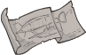
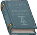

[Back to Main](index.md)

# Certainty Dran

Omin's Daughter - apparently. Possibly a new member of Acquisitions Incorporated affiliation and in time for their season.

Info from a wiki.
> Certainty Dran is the Head Secretarian at Acquisitions Incorporated headquarters. She communicates with other franchise teams through their documancy ledgers, passing on orders from Omin Dran, who also happens to be her father.

[Wiki Link](https://acquisitionsincorporated.fandom.com/wiki/Certainty_Dran)

# Basic Information

Certainty will be the new champion in the Highharvestide event on 27 September 2023.

    
        
            **Seat**:
        
        
            Unknown
        
    
    
        
            **Race**:
        
        
            Unknown
        
    
    
        
            **Class**:
        
        
            Bard / Fighter (Guess)
        
    
    
        
            **Roles**:
        
        
            Unknown
        
    
    
        
            **Age**:
        
        
            19 (Guess)
        
    
    
        
            **Gender**:
        
        
            Female (Guess)
        
    
    
        
            **Alignment**:
        
        
            Unknown
        
    
    
        
            **Affiliation**:
        
        
            Acquisitions Incorporated (Guess)
        
    

# Formation

Unknown.


    



# Abilities

**Base Attack: Unknown**
> Unknown effect.

<em>Raw Data</em>

<pre>
</pre>

**Ultimate Attack: Unknown**
> Unknown effect.

<em>Raw Data</em>

<pre>
</pre>

**Dad and Uncle Jim**
> Unknown effect.

<em>Raw Data</em>

<pre>
{
    "p": 0,
    "v": 2,
    "id": 20569,
    "export_params": {"uses": ["icon"]},
    "type": 1,
    "graphic": "Icons/Events/2017Highharvestide/Highharvestide_Y7/Icon_Formation_CertaintyDranDadandUncleJim",
    "fs": 0
}
</pre>

**Employee Evaluations**
> Unknown effect.

<em>Raw Data</em>

<pre>
{
    "p": 0,
    "v": 2,
    "id": 20570,
    "export_params": {"uses": ["icon"]},
    "type": 1,
    "graphic": "Icons/Events/2017Highharvestide/Highharvestide_Y7/Icon_Formation_CertaintyDranEmployeeEvaluations",
    "fs": 0
}
</pre>

**Financing Rounds**
> Unknown effect.

<em>Raw Data</em>

<pre>
{
    "p": 0,
    "v": 2,
    "id": 20571,
    "export_params": {"uses": ["icon"]},
    "type": 1,
    "graphic": "Icons/Events/2017Highharvestide/Highharvestide_Y7/Icon_Formation_CertaintyDranFinancingRounds",
    "fs": 0
}
</pre>

**Reboot Expert**
> Unknown effect.

<em>Raw Data</em>

<pre>
{
    "p": 0,
    "v": 2,
    "id": 20572,
    "export_params": {"uses": ["icon"]},
    "type": 1,
    "graphic": "Icons/Events/2017Highharvestide/Highharvestide_Y7/Icon_Formation_CertaintyDranRebootExpert",
    "fs": 0
}
</pre>

**Secretarian's Advice**
> Unknown effect.

<em>Raw Data</em>

<pre>
{
    "p": 0,
    "v": 2,
    "id": 20573,
    "export_params": {"uses": ["icon"]},
    "type": 1,
    "graphic": "Icons/Events/2017Highharvestide/Highharvestide_Y7/Icon_Formation_CertaintyDranSecretariansAdvice",
    "fs": 0
}
</pre>

# Specialisations

**Specialisation: Employee Evaluations**
> Unknown effect.

<em>Raw Data</em>

<pre>
{
    "p": 0,
    "v": 2,
    "id": 20574,
    "export_params": {"uses": ["icon"]},
    "type": 1,
    "graphic": "Icons/Events/2017Highharvestide/Highharvestide_Y7/Icon_SpecializationLarge_CertaintyDranEmployeeEvaluations",
    "fs": 0
}
</pre>

**Specialisation: Best and the Brightest**
> Unknown effect.

<em>Raw Data</em>

<pre>
{
    "p": 0,
    "v": 2,
    "id": 20575,
    "export_params": {"uses": ["icon"]},
    "type": 1,
    "graphic": "Icons/Events/2017Highharvestide/Highharvestide_Y7/Icon_Specialization_CertaintyDranBestandtheBrightest",
    "fs": 0
}
</pre>

**Specialisation: Smooth Negotiators**
> Unknown effect.

<em>Raw Data</em>

<pre>
{
    "p": 0,
    "v": 2,
    "id": 20576,
    "export_params": {"uses": ["icon"]},
    "type": 1,
    "graphic": "Icons/Events/2017Highharvestide/Highharvestide_Y7/Icon_Specialization_CertaintyDranSmoothNegotiators",
    "fs": 0
}
</pre>

# Items

    
        
            **Icons**
        
        
            **Name**
        
    
    
        
            
        
        
            Airship Stuff
        
    
    
        
            
        
        
            Clothing
        
    
    
        
            
        
        
            Music Instruments
        
    
    
        
            
        
        
            School Items
        
    
    
        
            
        
        
            Secretarian Items
        
    
    
        
            
        
        
            Time Stuff
        
    

# Feats

Unknown.

# Legendaries

Unknown.


# Console Portrait



# Chests

| Gold | Silver |
|---|---|
|  |  |

[Back to Top](#top)

*Last Modified: {{ site.time }}*