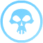
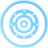
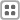

[Back to Main](index.md)

# Collections Dialogue

Since we've now had an official blog about the Collections Dialogue - probably best just to view that. We've been told Collections and Guide Quests will release on 28 February 2024.

[Idle Champions 2024 State of the Game Blog](https://codenameentertainment.com/?page=idle_champions&post_id=1636#blog)

  
    
      
    
    
      
        <strong>Achievements</strong>
      
    
  
  
    
      
    
    
      
        <strong>Blessings</strong>
      
    
  
  
    
      
    
    
      
        <strong>Campaign</strong>
      
    
  
  
    
      
    
    
      
        <strong>Champions</strong>
      
    
  
  
    
      
    
    
      
        <strong>Enemies</strong>
      
    
  
  
    
      
    
    
      
        <strong>Equipment</strong>
      
    
  
  
    
      
    
    
      
        <strong>Events</strong>
      
    
  
  
    
      
    
    
      
        <strong>Familiars</strong>
      
    
  
  
    
      
    
    
      
        <strong>Feats</strong>
      
    
  
  
    
      
    
    
      
        <strong>Modron</strong>
      
    
  
  
    
      
    
    
      
        <strong>Patrons</strong>
      
    
  
  
    
      
    
    
      
        <strong>Seasons</strong>
      
    
  
  
    
      
    
    
      
        <strong>Skins</strong>
      
    
  
  
    
      
    
    
      
        <strong>Time Gate</strong>
      
    
  
  
    
      
    
    
      
        <strong>Trials of Mount Tiamat</strong>
      
    
  
  
    
      
    
    
      
        <strong>Guide Quests</strong>
      
    
  
  
    
      
    
    
      
        <strong>Mini Icon</strong>
      
    
  
  
    
      
    
    
      
        <strong>Campaign Button</strong>
      
    
  
  
    
      
    
    
      
        <strong>Highest Area Container</strong>
      
    
  
  
    
      
    
    
      
        <strong>No Adventure</strong>
      
    
  
  
    
      
    
    
      
        <strong>Unavailable Adventure</strong>
      
    
  
  
    
      
    
    
      
        <strong>Special Reward</strong>
      
    
  
  
    
      
    
    
      
        <strong>Store Button</strong>
      
    
  
  
    
      
    
    
      
        <strong>Wild Offer</strong>
      
    
  
