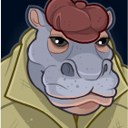
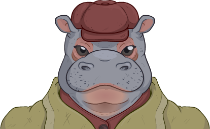
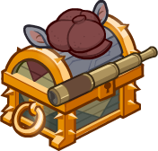

[Back to Main](index.md)

# Commodore Krux

> The giff Commodore Krux of the Second Wind met a group of adventurers in the Happy Beholder to recruit them to fight against the astral elves of the Xaryxian Empire.

[Wiki](https://forgottenrealms.fandom.com/wiki/Happy_Beholder)

# Basic Information

Commodore Krux will be an upcoming Evergreen champion.

* Seat: Unknown
* Race: Giff (Guess)
* Class: Unknown.
* Roles: Unknown
* Age: Unknown
* Gender: Male (Guess)
* Alignment: Unknown.
* Affiliation: Unknown
* Stats: Unknown

# Formation

Unknown.




# Abilities

**Base Attack: Unknown**
> Unknown effect.

<em>Raw Data</em>

<pre>
</pre>

 

**Ultimate Attack: Unknown**
> Unknown effect.

<em>Raw Data</em>

<pre>
</pre>

 

**Unknown**
> Unknown effect.

<em>Raw Data</em>

<pre>
</pre>

 

# Specialisations

Unknown.

# Items

| Slot | Name | Type |
|---|---|---|
| 1 | `Coin Pouch` | Unknown |
| 2 | `Flintlock Pistols` | Unknown |
| 3 | `Giff Uniform` | Unknown |
| 4 | `Hat` | Unknown |
| 5 | `Memento` | Unknown |
| 6 | `Navigation Gear` | Unknown |

# Feats

Unknown.

# Legendaries

Unknown.

# Console Portrait

# Chests

| Gold |
|---|
|  |

[Back to Top](#top)

*Last Modified: {{ site.time }}*